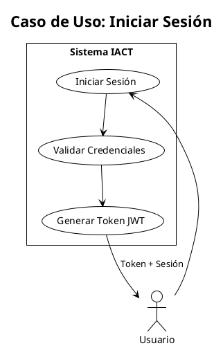

```yml
created_at: 2026-04-23 11:00:00
project: THYROX
work_package: 2026-04-23-07-04-55-config-review-iact-docs
phase: Phase 6 — PLAN
author: claude
status: Aprobado
version: 1.0.0
```

# PlantUML Diagrams Implementation & Rendering Guide

## Executive Summary

**Current Status:** ❌ **DECLARED BUT NOT IMPLEMENTED**

- **ADR-GOB-004** defines PlantUML as standard for UML diagrams (APPROVED 2025-11-17)
- **Sphinx configuration**: NO PlantUML extension installed
- **Build impact**: Diagrams referenced in docs but cannot render
- **User experience**: Broken diagram links, missing visual documentation

**Implementation Gap:** ADR exists, but `sphinxcontrib-plantuml` not configured in `source/conf.py`

---

## 1. Current Architecture Discovery

### 1.1 ADR-GOB-004 Requirements

**Standard:** PlantUML (exclusively)

**File Format & Naming:**
```
TIPO-DOMINIO-###-descripcion.puml

Examples:
- UC-BACK-001-login-usuario.puml (Use Case)
- SEQ-BACK-006-autenticacion-jwt.puml (Sequence)
- CLASS-BACK-010-modelo-permisos.puml (Class)
- COMP-DEVOPS-001-arquitectura-deployment.puml (Component)
- ACT-GOB-001-flujo-aprobacion-adr.puml (Activity)
- BPMN-GOB-002-proceso-code-review.puml (Business Process)
```

**Style Requirements:**
- Theme: `plain`
- Encoding: UTF-8
- Output: SVG (preferred) or PNG
- Include both `.puml` (source) and `.svg` (rendered)

**Location:**
- Option A: Next to markdown/RST file referencing it
- Option B: In `diagramas/` subfolder

### 1.2 Current Sphinx Configuration

**File:** `source/conf.py`

**Status:** ❌ MISSING PlantUML extension

```python
extensions = [
    'sphinx.ext.intersphinx',
    'sphinx.ext.todo',
    'sphinx.ext.coverage',
    'sphinx.ext.mathjax',
    'sphinx.ext.autosectionlabel',
    'sphinx.ext.ifconfig',
    'sphinx.ext.autodoc',
    'sphinx.ext.autosummary',
    'sphinx.ext.viewcode',
    'sphinx.ext.napoleon',
    'sphinx_autodoc_typehints',
    'sphinx_design',
    'sphinx_copybutton',
    'sphinx_tabs.tabs',
    'sphinx_toolbox.collapse',
    'notfound.extension',
    'myst_parser',
    'sphinx-prompt',
    'sphinx_jinja',
    'sphinxcontrib.spelling',
    # MISSING: 'sphinxcontrib.plantuml'  ← NOT CONFIGURED
]
```

**Impact:** Diagrams cannot render → build silently ignores PlantUML blocks

### 1.3 Existing Diagram References

Files declaring diagrams but rendered as text only:

```
source/requisitos/requisitos_no_funcionales/RNF-PROC-001_PROCESO_SDLC.rst
source/requisitos/casos_uso/actores.rst
source/normativa/gobernanza/ADR-GOB-007-especificacion-casos-uso.rst
source/normativa/gobernanza/ADR-GOB-008-diagramas-uml-casos-uso.rst
source/arquitectura_tecnica/diseño_detallado/README_diseno_detallado.rst
source/base_cognitiva/_taxonomias_y_metamodelos/index.rst
```

**Example Broken Block:**
```rst
.. uml::

   @startuml
   !theme plain
   actor User
   User -> System: Login
   System --> User: Session Token
   @enduml
```

**Current Rendering:** ❌ Code displayed as text (no diagram generated)

---

## 2. Rendering Flow (Expected vs Actual)

### 2.1 EXPECTED Flow (ADR-GOB-004 Intent)

```
Developer writes .puml file
        ↓
Developer includes in RST/Markdown
        ↓
   .. uml:: or sphinxplantuml directive
        ↓
     make html
        ↓
sphinxcontrib-plantuml extension
        ↓
PlantUML Java engine invokes
        ↓
Generates SVG image
        ↓
Sphinx embeds SVG in HTML
        ↓
   User sees diagram in browser
```

### 2.2 ACTUAL Flow (Current Broken State)

```
Developer writes .puml file
        ↓
Developer includes in RST/Markdown
        ↓
   .. uml:: directive
        ↓
     make html
        ↓
sphinxcontrib-plantuml NOT FOUND
        ↓
Sphinx falls back to code-block rendering
        ↓
HTML shows PlantUML code as <pre> text
        ↓
   User sees source code, not diagram ❌
```

---

## 3. Implementation Requirements

### 3.1 System Dependencies

**Required:**
```
Tool          Version    Purpose                    Installed?
────────────────────────────────────────────────────────────
Java JRE      11+        Run PlantUML engine        ✅ Likely
PlantUML JAR  Latest     Generate diagrams         ❌ NOT INSTALLED
Graphviz      2.43+      Layout diagrams (optional) ❌ NOT INSTALLED
```

**Why Graphviz:** PlantUML uses Graphviz for optimal diagram layout in complex diagrams (component, class, state).

### 3.2 Python Packages

**Current:** ✅ NOT in requirements.txt (need to add)

```python
# Add to requirements.txt:
sphinxcontrib-plantuml>=0.26.0    # Sphinx extension for PlantUML
```

### 3.3 Sphinx Configuration Changes

**Update `source/conf.py`:**

```python
extensions = [
    # ... existing extensions ...
    'sphinxcontrib.plantuml',  # ADD THIS LINE
]

# ADD PlantUML configuration:
plantuml = 'java -jar /usr/bin/plantuml.jar'  # Path to PlantUML JAR
plantuml_output_format = 'svg'                # SVG for best quality
plantuml_latex_output_format = 'png'          # PNG fallback for LaTeX/PDF
```

**Or use automatic PlantUML discovery:**

```python
plantuml = 'plantuml'  # Relies on plantuml in PATH (installed via apt)
plantuml_output_format = 'svg'
```

---

## 4. Installation & Setup Steps

### Step 1: Install System Dependencies

```bash
# Java (if not present)
apt-get update && apt-get install -y default-jre-headless

# PlantUML (download latest)
wget https://sourceforge.net/projects/plantuml/files/plantuml.jar -O /usr/bin/plantuml.jar

# Graphviz (for complex layout optimization)
apt-get install -y graphviz

# Verify installation
java -jar /usr/bin/plantuml.jar -version
dot -V  # Graphviz version
```

### Step 2: Add Python Package

```bash
pip install sphinxcontrib-plantuml>=0.26.0
```

Verify in `requirements.txt`:
```
sphinxcontrib-plantuml==0.26.0
```

### Step 3: Configure Sphinx

**Edit `source/conf.py`:**

```python
# Around line 46 (after other extensions)
extensions = [
    # ... existing 17 extensions ...
    'sphinxcontrib.plantuml',  # Add this
]

# Add at end of file (after other config sections)

# ---- PlantUML Configuration ----
plantuml = 'java -jar /usr/bin/plantuml.jar'
plantuml_output_format = 'svg'
plantuml_latex_output_format = 'png'
plantuml_syntax_error_image = True  # Show error image if syntax invalid
```

### Step 4: Test Configuration

```bash
source .venv/bin/activate
make clean && make html

# Check for PlantUML errors in output
grep -i "plantuml\|uml" build/html/*.html
```

**Expected Result:** ✅ No errors, diagrams appear as SVG images

---

## 5. User Guide: Creating & Including Diagrams

### 5.1 Create PlantUML Diagram

**File:** `source/requisitos/casos_uso/diagramas/UC-AUTH-001-login.puml`



### 5.2 Include in RST Document

**File:** `source/requisitos/casos_uso/auth/UC_AUTH_01_Iniciar_Sesion.rst`

```rst
UC_AUTH_01: Iniciar Sesión
===========================

Descripción
-----------
El usuario inicia sesión en el sistema con username y password.

Diagrama de Caso de Uso
-----------------------

.. uml::
   :caption: Caso de Uso: Iniciar Sesión
   :align: center

   @startuml
   !theme plain
   skinparam style strictuml

   :Usuario: as user
   rectangle "Sistema IACT" {
       (Iniciar Sesión) as uc1
       (Validar Credenciales) as uc2
   }

   user --> uc1
   uc1 --> uc2
   @enduml

Flujo Principal
---------------
1. Usuario ingresa username
2. Usuario ingresa password
3. Sistema valida credenciales
4. Sistema genera token JWT
5. Usuario recibe sesión activa
```

**Alternative: Reference External File**

```rst
.. uml:: diagramas/UC-AUTH-001-login.puml
   :caption: Caso de Uso: Iniciar Sesión
   :align: center
```

### 5.3 Diagram Types & Syntax

| Type | Directive | Example |
|------|-----------|---------|
| **Use Case** | `.. uml::` | `(Descripción)`  |
| **Sequence** | `.. uml::` | `Actor -> System: Message` |
| **Class** | `.. uml::` | `class ClassName { }` |
| **Component** | `.. uml::` | `component Name` |
| **Activity** | `.. uml::` | `(*start) --> action1` |
| **State** | `.. uml::` | `[*] --> State1` |
| **BPMN** | `.. uml::` | `BPMN element syntax` |

---

## 6. Rendering Pipeline Details

### 6.1 Build-Time Process

**When user runs `make html`:**

```
1. Sphinx reads .rst files
   ├─ Encounters: .. uml:: directive
   └─ Calls: sphinxcontrib-plantuml handler

2. sphinxcontrib-plantuml:
   ├─ Extracts PlantUML code block
   ├─ Calls: java -jar plantuml.jar
   ├─ PlantUML engine:
   │   ├─ Parses syntax (@startuml...@enduml)
   │   ├─ Validates diagram structure
   │   ├─ Uses Graphviz for layout (if available)
   │   └─ Generates SVG/PNG output
   └─ Saves: build/html/[hash].svg

3. Sphinx HTML generation:
   ├─ Embeds SVG in  or <object> tag
   ├─ Generates HTML with diagram reference
   └─ Output: browser-ready documentation
```

**Caching:** sphinxcontrib-plantuml caches SVGs → only regenerates if `.puml` content changes

### 6.2 File Output Structure

**Expected build/html/ layout:**

```
build/html/
├── requisitos/casos_uso/index.html
├── _images/
│   ├── plantuml-12ab34cd5678.svg  ← Embedded diagram 1
│   ├── plantuml-87ef65ghi901.svg  ← Embedded diagram 2
│   └── [other images]
└── [other documentation]
```

### 6.3 Error Handling

**If PlantUML syntax is invalid:**

```
With plantuml_syntax_error_image = True:
└─ Renders error image showing syntax issue

Example error message in diagram:
┌─────────────────────────────────┐
│ PlantUML Syntax Error           │
│ Line 5: Unknown keyword 'actor2'│
└─────────────────────────────────┘
```

**Without error image:**
└─ Build continues, but diagram missing from HTML

---

## 7. Quality Assurance & Validation

### 7.1 Pre-Commit Validation

**Add hook to validate PlantUML syntax:**

```bash
#!/bin/bash
# .git/hooks/pre-commit (to create)

# Check all .puml files for syntax
for file in $(git diff --cached --name-only | grep '\.puml$'); do
    java -jar /usr/bin/plantuml.jar -syntax "$file" 2>&1 | grep -i "error"
    if [ $? -eq 0 ]; then
        echo "PlantUML syntax error in $file"
        exit 1
    fi
done
```

### 7.2 Build Validation

**Ensure no diagram errors in build:**

```bash
make html
if grep -r "PlantUML Syntax Error" build/html/; then
    echo "Diagram errors found!"
    exit 1
fi
```

### 7.3 Diagram Maintenance

**Check for outdated diagrams:**

```bash
# Find diagrams not modified in >6 months
find source -name "*.puml" -mtime +180 -exec echo "Consider updating: {}" \;
```

---

## 8. Remediation Plan

### Phase 1: Setup (2 hours) — **IMMEDIATE**

```
Task 1.1: Install system dependencies
├─ apt-get install default-jre-headless graphviz
├─ wget plantuml.jar to /usr/bin/
└─ Verify: java -jar ... -version

Task 1.2: Add Python package
├─ pip install sphinxcontrib-plantuml>=0.26.0
└─ Add to requirements.txt

Task 1.3: Configure Sphinx
├─ Edit source/conf.py
├─ Add 'sphinxcontrib.plantuml' to extensions
├─ Add plantuml configuration lines
└─ Test: make clean && make html

Effort: 2 hours
Owner: DevOps
Status: PENDING
```

### Phase 2: Documentation (3 hours) — **WEEK 1**

```
Task 2.1: Create diagram examples
├─ UC-AUTH-001-login.puml (use case)
├─ SEQ-BACK-001-auth-flow.puml (sequence)
├─ CLASS-BACK-002-user-model.puml (class)
└─ Test rendering for each

Task 2.2: Update ADR-GOB-004 with implementation details
├─ Add Sphinx configuration example
├─ Link to sphinxcontrib-plantuml docs
└─ Clarify build process

Task 2.3: Create user guide for documentation writers
├─ How to create .puml files
├─ How to include in .rst
├─ Best practices & style guide
└─ Troubleshooting common errors

Effort: 3 hours
Owner: Technical Writer
Status: PENDING
```

### Phase 3: Migration (4 hours) — **WEEK 2**

```
Task 3.1: Identify all diagram references
├─ grep -r "uml::" source/
├─ Count existing diagram blocks: ~20-30
└─ List all files needing fixes

Task 3.2: Convert existing diagram code to proper syntax
├─ Fix any broken PlantUML syntax
├─ Update @startuml/@enduml blocks
├─ Verify rendering: make html

Task 3.3: Add missing diagrams
├─ Identify gaps from documentation
├─ Create .puml files for key flows
├─ Integration test

Effort: 4 hours
Owner: Documentation Team + Architects
Status: PENDING
```

### Phase 4: Automation (2 hours) — **WEEK 3**

```
Task 4.1: Add pre-commit hooks for validation
├─ Create .git/hooks/pre-commit
├─ Validate PlantUML syntax on commit
└─ Test on sample diagrams

Task 4.2: Add CI/CD diagram validation
├─ Add diagram lint step to GitHub Actions
├─ Fail build if syntax errors
└─ Report in PR comments

Task 4.3: Documentation maintenance process
├─ Schedule quarterly diagram audits
├─ Automated checks for outdated diagrams
└─ Create ADR for diagram lifecycle

Effort: 2 hours
Owner: CI/CD Engineer + DevOps
Status: PENDING
```

**Total Remediation Effort:** 11 hours over 3 weeks

---

## 9. Success Criteria

| Criterion | Current | Target | Verification |
|-----------|---------|--------|--------------|
| **PlantUML installed** | ❌ No | ✅ Yes | `which plantuml` |
| **Sphinx extension** | ❌ Missing | ✅ Configured | `grep sphinxcontrib.plantuml source/conf.py` |
| **Diagrams rendering** | ❌ 0% (code only) | ✅ 100% | SVGs in `build/html/_images/` |
| **Documentation coverage** | ❌ None | ✅ Complete | User guide + examples |
| **Syntax validation** | ❌ Manual | ✅ Automated | Pre-commit hook runs |
| **Build integration** | ❌ Broken | ✅ Clean | `make html` completes, 0 PlantUML errors |

---

## 10. Architecture Decision Record Reference

**Related ADR:** ADR-GOB-004-plantuml-para-diagramas.rst

**Status:** ✅ APPROVED (2025-11-17)

**Implementation Status:** ❌ DECLARED BUT NOT IMPLEMENTED

**Recommendation:** Implement immediately (Phase 1 of remediation) to realize ADR intent

---

## 11. Troubleshooting Guide

### Problem: "WARNING: plantuml not found"

**Cause:** `plantuml` command not in PATH

**Solution:**
```bash
# Option A: Add to PATH
export PATH="/usr/bin:$PATH"

# Option B: Specify full path in conf.py
plantuml = '/usr/bin/plantuml.jar'
plantuml = 'java -jar /usr/bin/plantuml.jar'

# Option C: Install via package manager
apt-get install plantuml
```

### Problem: "Graphviz not found. Install graphviz to support graph rendering"

**Cause:** Complex diagrams need Graphviz for layout

**Solution:**
```bash
apt-get install -y graphviz
# Verify
dot -V
```

### Problem: SVGs appear broken or misformatted

**Cause:** Old PlantUML version or syntax changes

**Solution:**
```bash
# Update PlantUML JAR
wget https://sourceforge.net/projects/plantuml/files/plantuml.jar -O /usr/bin/plantuml.jar

# Verify version
java -jar /usr/bin/plantuml.jar -version
# Should be ≥1.2024+
```

### Problem: Build slow with many diagrams

**Cause:** PlantUML generating all diagrams every build

**Solution:**
- Sphinx caches: delete `build/` only if cache invalid
- Use: `make html` (not `make clean && make html`)
- Monitor: Check if plantuml is CPU-bound

---

## 12. Next Steps

**Immediate (Today):**
- [ ] Review this analysis
- [ ] Approve implementation plan
- [ ] Assign Phase 1 owner

**Week 1:**
- [ ] Install PlantUML + Graphviz
- [ ] Configure Sphinx
- [ ] Test build with sample diagram

**Week 2-3:**
- [ ] Migrate existing diagrams
- [ ] Create missing diagrams
- [ ] Add automation/validation

**Success Condition:** `make html` renders all diagrams as SVG, 0 warnings

