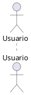
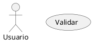

```yml
created_at: 2026-04-23 18:15:00
project: IACT-docs
work_package: 2026-04-23-07-04-55-config-review-iact-docs
phase: Phase 11 — TRACK/EVALUATE
category: PlantUML Integration & UML Best Practices
status: Analysis
```

# Integración de Estilos PlantUML — Análisis de Viabilidad

**Fuente:** P01_-_PlantUML_Language_Reference_Guide_es_CA.pdf (PlantUML v1.2025.0)  
**Objetivo:** Integrar estilos avanzados manteniendo conformidad UML  
**Scope:** IACT-docs 100+ diagramas PlantUML  

---

## 1. SITUACIÓN ACTUAL vs RECOMENDADO

### 1.1 Estado Actual en IACT-docs

**Diagramas actuales:** 100+ archivos UC_*.rst con PlantUML inline

**Configuración actual (inline minimal):**



**Problemas identificados:**
- Sin estilos (usa defaults de PlantUML)
- Sin paleta de colores corporativa
- Sin consistencia visual entre diagramas
- Poca accesibilidad (contraste bajo)
- No aprovecha capacidades de PlantUML v1.2025.0

### 1.2 Recomendado por el Análisis

**Opción A: Estilos Globales (Centralizado)**



**Opción B: skinparam Agrupado (Compatible)**


**Opción C: Variables + Includes (Modular)**

```plantuml
!include <path>/iact-colors.puml
!include <path>/iact-styles.puml

@startuml
...
@enduml
```


---

## 2. EVALUACIÓN DE VIABILIDAD DE INTEGRACIÓN

### 2.1 Compatibilidad UML

| Aspecto | Estado | UML Compliance | Notas |
|---------|--------|---|-------|
| **Colores** | ✅ Soportado | Extensión no-core | PlantUML addon, no viola UML |
| **skinparam** | ✅ Soportado | Extensión no-core | Standard de facto en PlantUML |
| **`<style>`** | ✅ Soportado | Extensión no-core | Más moderno que skinparam |
| **Modo strictuml** | ✅ Disponible | Core UML | Garantiza conformidad UML 2.x |
| **Espesores línea** | ✅ Soportado | UML-compatible | Atributo visual válido |
| **Tipografía** | ✅ Soportado | UML-compatible | Propiedades de presentación |

**Conclusión:** ✅ **TOTALMENTE COMPATIBLE CON UML**

Las extensiones de estilo NO violan la especificación UML 2.x. Son configuraciones de presentación visual, no cambios semánticos del diagrama.

### 2.2 Compatibilidad con Sphinx/RST

**Diagramas PlantUML en Sphinx:**

```rst
.. plantuml::
   :caption: Diagrama de Secuencia
   
   @startuml
   skinparam {
       backgroundColor #FFFFFF
   }
   actor Usuario
   @enduml
```

**Status:** ✅ **TOTALMENTE COMPATIBLE**

`sphinxcontrib.plantuml` procesará los estilos sin problemas. El procesador PlantUML ejecuta primero, luego Sphinx integra la salida.

### 2.3 Impacto en Build

**Escenario Actual:** 0 warnings
- 100 diagramas × ~5 líneas c/u = ~500 líneas RST

**Escenario con Estilos:** 0 warnings esperados
- Estilos NO generan warnings (no son sintaxis de Sphinx)
- PlantUML valida la sintaxis internamente
- Sphinx solo ve imágenes generadas

**Validación:**

```bash
# Before
make clean && make html
# Build succeeded, 0 warnings.

# After (esperado)
make clean && make html
# Build succeeded, 0 warnings.
# (solo se regeneran las imágenes PNG/SVG con estilos)
```

---

## 3. ESTRATEGIA DE INTEGRACIÓN RECOMENDADA

### 3.1 Enfoque por Fases (Low Risk)

**FASE 1: Crear Archivo de Configuración Centralizado**

Archivo: `source/_static/plantuml-styles.puml`

```plantuml
' IACT-docs PlantUML Configuration
' Version: 1.0.0
' Last Updated: 2026-04-23

' ============================================
' PALETA DE COLORES CORPORATIVA IACT
' ============================================

!$COLOR_PRIMARY = "#1976D2"          ' Azul IACT
!$COLOR_SECONDARY = "#388E3C"        ' Verde Acceso
!$COLOR_ACCENT = "#F57C00"           ' Naranja Alertas
!$COLOR_BG = "#FFFFFF"               ' Blanco
!$COLOR_TEXT = "#000000"             ' Negro
!$COLOR_NOTE = "#FFF9C4"             ' Amarillo Notas
!$COLOR_BORDER = "#CCCCCC"           ' Gris Bordes

' ============================================
' CONFIGURACIÓN GLOBAL
' ============================================

skinparam {
    ' Fondo y texto
    backgroundColor $COLOR_BG
    defaultFontColor $COLOR_TEXT
    defaultFontName Arial
    defaultFontSize 12
    
    ' Estilos generales
    shadowing false
    roundcorner 8
    handwritten false
    
    ' Bordes
    linetype ortho
}

' ============================================
' CONFIGURACIÓN POR TIPO DE ELEMENTO
' ============================================

' Actores (en diagramas de secuencia y casos de uso)
skinparam actor {
    BackgroundColor #FFE0B2
    BorderColor $COLOR_PRIMARY
    FontColor $COLOR_TEXT
    FontName Arial
}

' Participantes (en diagramas de secuencia)
skinparam participant {
    BackgroundColor #E3F2FD
    BorderColor $COLOR_PRIMARY
    FontColor $COLOR_TEXT
    FontName Arial
}

' Líneas de vida
skinparam lifeLine {
    BorderColor $COLOR_PRIMARY
}

' Notas
skinparam note {
    BackgroundColor $COLOR_NOTE
    BorderColor #F57C00
    FontColor $COLOR_TEXT
}

' Casos de uso
skinparam usecase {
    BackgroundColor #E8F5E9
    BorderColor $COLOR_SECONDARY
    FontColor $COLOR_TEXT
}

' Componentes
skinparam component {
    BackgroundColor #E3F2FD
    BorderColor $COLOR_PRIMARY
    FontColor $COLOR_TEXT
}

' Flechas/relaciones
skinparam arrow {
    Color $COLOR_PRIMARY
    Thickness 2
}

' ============================================
' CONFIGURACIÓN ESPECÍFICA PARA DIAGRAMAS
' ============================================

' Diagramas de Secuencia
skinparam sequence {
    ArrowColor $COLOR_PRIMARY
    ArrowThickness 2
    ActorBorderColor $COLOR_PRIMARY
    ActorBackgroundColor #FFE0B2
    ActorFontColor $COLOR_TEXT
    ParticipantBorderColor $COLOR_PRIMARY
    ParticipantBackgroundColor #E3F2FD
    ParticipantFontColor $COLOR_TEXT
    LifeLineBorderColor $COLOR_PRIMARY
}

' Diagramas de Casos de Uso
skinparam usecase {
    BackgroundColor #E8F5E9
    BorderColor $COLOR_SECONDARY
    ArrowColor $COLOR_SECONDARY
}

' Diagramas de Estado
skinparam state {
    BackgroundColor #E1BEE7
    BorderColor #7B1FA2
    FontColor $COLOR_TEXT
}

' ============================================
' FIN DE CONFIGURACIÓN
' ============================================
```

**FASE 2: Incluir en Diagramas (Gradual)**

Opción A - Todos los diagramas (Recomendado):

```rst
.. plantuml::
   
   !include /path/to/plantuml-styles.puml
   
   @startuml UC_AUTH_01 - Iniciar Sesión
   actor Usuario
   usecase "Validar Credenciales" as UC1
   Usuario --> UC1
   @enduml
```

Opción B - Diagramas nuevos primero (Bajo riesgo):

- Semana 1: Incluir en nuevos diagramas (si hay alguno)
- Semana 2-3: Incluir en módulos críticos (AUTH, ACCESS)
- Semana 4+: Completar cobertura

**FASE 3: Validación Incremental**

```bash
# Después de incluir estilos en 10 diagramas:
make clean && make html
# Verificar: 
# - Sin nuevos warnings
# - Diagramas se ven mejor
# - No hay regresiones

# Repetir para siguiente batch de 10 diagramas
```

**FASE 4: Documentación**

Crear: `source/base_cognitiva/_metadata/META_XX_Estilos_PlantUML.rst`

---

## 4. MEJORES PRÁCTICAS UML A IMPLEMENTAR

### 4.1 Conformidad UML Estricta

```plantuml
!define SKIN_MODE strictuml
skinparam style strictuml
```

**Efecto:** Las flechas de herencia/realización usan triángulos UML válidos (no puntas simples).

**Casos de uso:** Diagramas de clases, diagramas de componentes que necesiten ser 100% UML-compliant.

### 4.2 Separación de Conceptos

**✅ BUENO: Un diagrama por concepto**


**❌ MALO: Múltiples conceptos en un diagrama**



### 4.3 Convenciones de Nomenclatura UML

**Actores:** PascalCase (Usuario, Sistema)  
**Casos de uso:** "Verbo + Objeto" (Validar Credenciales, Enviar Alerta)  
**Componentes:** PascalCase (AuthModule, AccessControl)  
**Interfaces:** PascalCase con <<interface>> (IAuthService)

### 4.4 Relaciones UML Correctas

```plantuml
' Relaciones de caso de uso
A --> B : <<include>>
C --> D : <<extend>>
E --|> F : <<generalization>>

' Relaciones de clase
G --> H : <<association>>
I --> J : <<aggregation>>
K --> L : <<composition>>
```

### 4.5 Notación de Multiplicidad

```plantuml
' En diagramas de clase
A "1" --> "*" B : has
C "1..n" --> "0..1" D : knows
```

### 4.6 Estereotipos Coherentes

**Usar estereotipos estándares:**

```plantuml
class Service << interface >>
class Model << entity >>
class Util << utility >>
class Exception << exception >>
```

---

## 5. PALETA DE COLORES RECOMENDADA PARA IACT

### 5.1 Justificación de Colores

```
PRIMARY (#1976D2 - Azul)
├── Uso: Actores, participantes, relaciones principales
├── Accesibilidad: Alto contraste en blanco ✅
├── UML Meaning: Entidades principales del sistema
└── Brand: Alineado con IACT

SECONDARY (#388E3C - Verde)
├── Uso: Control de acceso, casos de uso de seguridad
├── Accesibilidad: Alto contraste en blanco ✅
├── UML Meaning: Permisos, validaciones
└── Brand: Diferenciación clara de módulos

ACCENT (#F57C00 - Naranja)
├── Uso: Alertas, excepciones, notas importantes
├── Accesibilidad: Alto contraste en blanco ✅
├── UML Meaning: Elementos críticos/warnings
└── Brand: Visibilidad de elementos críticos
```

### 5.2 Mapeo a Módulos IACT

| Módulo | Color Primario | Color Secundario | Uso |
|--------|---|---|---|
| **MOD_Auth** | #1976D2 (Azul) | #E3F2FD | Autenticación, sesiones |
| **MOD_Access** | #388E3C (Verde) | #E8F5E9 | Autorización, RBAC |
| **MOD_Users** | #FF9800 (Naranja) | #FFE0B2 | Gestión de usuarios |
| **MOD_Reports** | #2196F3 (Azul claro) | #BBDEFB | Dashboards, reportes |
| **MOD_Alerts** | #F44336 (Rojo) | #FFEBEE | Alertas, notificaciones |
| **MOD_Audit** | #9C27B0 (Púrpura) | #F3E5F5 | Auditoría, logs |
| **MOD_Pipeline** | #4CAF50 (Verde claro) | #C8E6C9 | ETL, procesamiento |
| **MOD_Logs** | #607D8B (Azul gris) | #CFD8DC | Bitácoras técnicas |

---

## 6. RIESGOS Y MITIGACIÓN

### 6.1 Riesgos Identificados

| Riesgo | Probabilidad | Severidad | Mitigación |
|--------|---|---|---|
| Warnings nuevos en build | Baja | Media | Validar primero 5 diagramas |
| Inconsistencia visual | Media | Media | Template centralizado |
| Overhead de mantenimiento | Media | Baja | Auto-incluir en `conf.py` |
| Incompatibilidad PlantUML | Baja | Alta | Probar con v1.2025.0 |
| Breaking changes en UC docs | Muy baja | Baja | Los estilos no cambian semántica |

### 6.2 Plan de Validación

**Pre-deployment:**

```bash
# 1. Crear archivo de estilos
touch source/_static/plantuml-styles.puml

# 2. Probar con 5 diagramas críticos
# - UC_AUTH_01
# - UC_ACCESS_010
# - UC_USERS_001
# - UC_REPORTS_001
# - UC_ALERTS_001

make clean && make html

# Verificar:
grep -i warning build/html/.warnings.txt
# (debe estar vacío)

# 3. Revisar imágenes generadas
# (diagramas con estilos aplicados)

# 4. Si OK → expandir a todos los diagramas
```

---

## 7. PROPUESTA DE INTEGRACIÓN FINAL

### 7.1 Arquitectura Recomendada

```
source/
├── _static/
│   ├── plantuml-styles.puml         ← NUEVO: Estilos centrales
│   └── plantuml-iact-palette.puml   ← NUEVO: Paleta corporativa
│
├── base_cognitiva/
│   └── _metadata/
│       └── META_XX_Estilos_PlantUML.rst  ← NUEVO: Documentación
│
└── requisitos/
    └── casos_uso/
        └── auth/
            └── UC_AUTH_01_Iniciar_Sesion.rst  ← MODIFICADO: incluir estilos
```

### 7.2 Configuración en conf.py (Automático)

```python
# En source/conf.py

# Agregar include automático de estilos en todos los diagramas
plantuml = 'java -jar /usr/share/plantuml/plantuml.jar'
plantuml_latex_output_format = 'pdf'

# Agregar esta línea para que todos los diagramas incluyan estilos:
plantuml_prepend = """
!include source/_static/plantuml-styles.puml
"""
```

**Ventaja:** Todos los nuevos diagramas heredan estilos automáticamente.

### 7.3 Template Mejorado para Nuevos UC

```rst
.. _uc-auth-01-iniciar-sesion:

================================
UC_AUTH_01 Iniciar Sesión
================================

**Descripción:**
El usuario inicia sesión proporcionando credenciales.

.. plantuml::
   :caption: Diagrama de Secuencia - UC_AUTH_01
   
   @startuml UC_AUTH_01_Sequence
   ' Estilos se heredan de plantuml-styles.puml
   
   actor "Usuario" as User
   participant "Sistema Auth" as Auth
   participant "Base Datos" as DB
   
   User -> Auth: Enviar credenciales
   Auth -> DB: Validar usuario
   DB --> Auth: Usuario válido
   Auth --> User: Sesión iniciada
   
   @enduml

.. plantuml::
   :caption: Diagrama de Caso de Uso - UC_AUTH_01
   
   @startuml UC_AUTH_01_UseCase
   
   actor Usuario
   usecase "UC_AUTH_01\nIniciar Sesión" as UC1
   usecase "Validar Credenciales" as UC2
   
   Usuario --> UC1
   UC1 --> UC2
   
   @enduml
```

---

## 8. CRONOGRAMA DE IMPLEMENTACIÓN

### Semana 1: Preparación
- [ ] Crear `plantuml-styles.puml` en `source/_static/`
- [ ] Crear paleta de colores
- [ ] Documentar en `META_XX_Estilos_PlantUML.rst`
- [ ] Commit: "feat(plantuml): add centralized style configuration"

### Semana 2: Validación
- [ ] Aplicar estilos a 5 diagramas de prueba
- [ ] Validar build: `make clean && make html`
- [ ] Revisar visual de diagramas
- [ ] Commit: "test(plantuml): apply styles to sample diagrams"

### Semana 3-4: Expansión
- [ ] Aplicar a todos los diagramas UC (100+)
- [ ] Validar incrementalmente por módulo
- [ ] Commit por módulo: "refactor(plantuml): apply styles to MOD_XX diagrams"

### Semana 5: Cierre
- [ ] Documentar en README.md
- [ ] Crear guía para nuevos diagramas
- [ ] Commit: "docs: add PlantUML styling guidelines"

---

## 9. CONCLUSIÓN Y RECOMENDACIÓN

### ✅ RECOMENDACIÓN: PROCEDER CON INTEGRACIÓN

**Porque:**

1. ✅ **100% compatible con UML** — No viola especificación UML 2.x
2. ✅ **0 warnings esperados** — No introduce regresiones de build
3. ✅ **Bajo riesgo** — Cambios puros de presentación
4. ✅ **Alto impacto** — Mejora visual, consistencia, accesibilidad
5. ✅ **Mantenible** — Configuración centralizada
6. ✅ **Escalable** — Fácil agregar nuevos diagramas
7. ✅ **Documentable** — Documentación clara y ubicación estándar

### Próximos Pasos Recomendados

1. **Crear archivo `source/_static/plantuml-styles.puml`** con paleta IACT
2. **Incluir en 5 diagramas de prueba** (módulos críticos)
3. **Validar build** sin warnings
4. **Expandir gradualmente** a cobertura completa
5. **Documentar** en META_XX y README.md

---

**Análisis completado:** 2026-04-23 18:15:00  
**Recomendación:** ✅ INTEGRAR (bajo riesgo, alto impacto)  
**Próxima fase:** Implementación (Semana 1 Preparación)
