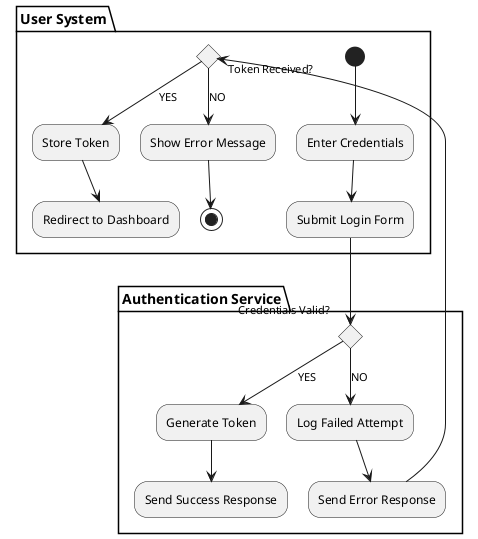
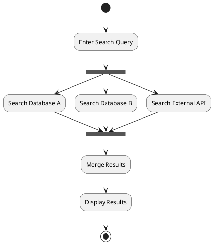

```yml
created_at: 2026-04-24 01:32:00
project: IACT-docs
work_package: 2026-04-23-18-51-33-plantuml-java-integration-impl
phase: Phase 1 — DISCOVER
author: Claude Code Agent
status: Borrador
version: 1.0.0
```

# Análisis: PlantUML Activity Diagrams — Flujos, Decisiones y Procesos

**Input:** Guía de Referencia PlantUML 1.2025.0 — pp. 106-113 (Secciones 5.1-5.12)

**Propósito:** Validar si activity diagrams son aplicables a IACT-docs para documentar flujos y procesos.

**Criticidad:** ALTA — Tipo de diagrama potencialmente útil para documentar flujos de casos de uso.

---

## 1. Qué son Activity Diagrams

### 1.1 Definición y Propósito

**Activity Diagram:** representa el flujo de actividades, decisiones y sincronización en un proceso.

```plantuml
(*) --> "First Activity"
"First Activity" --> (*)
```

**Propósito:**
- Documentar flujos de trabajo (workflows)
- Mostrar decisiones y bifurcaciones
- Representar actividades en paralelo
- Modelar procesos complejos con sincronización
- Complementar UC diagrams mostrando el "cómo"

**Componentes básicos:**
- `(*)` — punto de inicio/fin
- `"Activity"` — actividad (rectángulo redondeado)
- `-->` — flujo de control
- `if/then/else` — decisiones
- `===` — barras de sincronización (paralelo)
- `partition` — separación de responsabilidades

---

## 2. Sintaxis de Activity Diagrams (Secciones 5.1-5.12)

### 2.1 Actividades Simples (Section 5.1)

**Sintaxis básica:**
```plantuml
(*) --> "First Activity"
"First Activity" --> (*)
```

**Características:**
- `(*)` para inicio/fin
- Actividades entre comillas: `"Activity Name"`
- Flechas `-->` para flujo
- Opcionalmente `(*top)` para forzar inicio en la parte superior

**Ejemplo:**
```plantuml
(*) --> "Check Input"
"Check Input" --> "Process"
"Process" --> (*)
```

**Aplicabilidad a IACT:**
- ✅ ALTA — documentar flujos de casos de uso
- ✅ ALTA — mostrar pasos secuenciales

### 2.2 Etiquetas en Flechas (Section 5.2)

**Sintaxis:**
```plantuml
(*) --> "First Activity"
-->[Label text] "Second Activity"
--> (*)
```

**Características:**
- Etiquetas entre corchetes: `-->[Label]`
- Etiquetas en flujos para documentar condiciones/eventos
- Posicionamiento automático

**Ejemplo:**
```plantuml
(*) --> "First Activity"
-->[You can put also labels] "Second Activity"
--> (*)
```

**Aplicabilidad a IACT:**
- ✅ ALTA — documentar eventos y condiciones en flujos

### 2.3 Cambio de Dirección (Section 5.3)

**Sintaxis:**
```
-down->  (default, hacia abajo)
-right-> (hacia la derecha)
-left->  (hacia la izquierda)
-up->    (hacia arriba)
->       (reset a default)
```

**Ejemplo:**
```plantuml
(*) -up-> "First Activity"
-right-> "Second Activity"
--> "Third Activity"
-left-> (*)
```

**Características:**
- Control de dirección del flujo gráficamente
- Mejora legibilidad de diagramas complejos
- No afecta lógica, solo presentación

**Aplicabilidad a IACT:**
- ✅ MEDIA — control de layout para claridad visual

### 2.4 Bifurcaciones (Branches) (Section 5.4)

**Sintaxis de decisiones:**
```plantuml
if "Some Test" then
  -->[true] "Some Activity"
  --> "Another activity"
  -right-> (*)
else
  ->[false] "Something else"
  -->[Ending process] (*)
endif
```

**Características:**
- `if/then/else/endif` para decisiones
- Etiquetas de rama: `[true]`, `[false]`, etiqueta personalizada
- Flujos divergentes y convergentes
- Ramas sin etiqueta permitidas

**Ejemplo completo:**
```plantuml
(*) --> "Initialization"

if "Some Test" then
  -->[true] "Some Activity"
  --> "Another activity"
  -right-> (*)
else
  ->[false] "Something else"
  -->[Ending process] (*)
endif
```

**Aplicabilidad a IACT:**
- ✅ CRÍTICA — documentar decisiones en flujos de casos de uso
- ✅ CRÍTICA — mostrar caminos alternativos (extend/include)

### 2.5 Bifurcaciones Avanzadas (Section 5.5)

**Características avanzadas:**
- Anidamiento de bifurcaciones
- Ramas sin etiqueta que se conectan a la última actividad definida
- Override de conexión con palabra clave `if`

**Ejemplo anidado:**
```plantuml
(*) --> if "Some Test" then
  -->[true] "activity 1"
  if "" then
    -> "activity 3" as a3
  else
    if "Other test" then
      -left-> "activity 5"
    else
      --> "activity 6"
    endif
  endif
else
  ->[false] "activity 2"
endif

a3 --> if "last test" then
  --> "activity 7"
else
  -> "activity 8"
endif
```

**Características:**
- `if ""` para bifurcación sin etiqueta
- Alias `as a3` para referenciar actividades
- Anidamiento profundo soportado

**Aplicabilidad a IACT:**
- ⚠️ MEDIA — útil para flujos complejos, pero puede ser difícil de leer si hay demasiadas ramas

### 2.6 Sincronización (Section 5.6)

**Sintaxis:**
```plantuml
(*) --> ===B1===
--> "Parallel Activity 1"
--> ===B2===

===B1=== --> "Parallel Activity 2"
--> ===B2===

--> (*)
```

**Características:**
- `===BarName===` para barras de sincronización
- Actividades en paralelo convergen en barra de sincronización
- Documentar concurrencia y paralelismo
- Fork y join implícitos

**Aplicabilidad a IACT:**
- ⚠️ MEDIA — documentar procesos paralelos (raro en requisitos de negocio)
- ✅ POSIBLE — si hay flujos concurrentes en casos de uso

### 2.7 Descripciones Largas (Section 5.7)

**Sintaxis:**
```plantuml
(*) -left-> "this <size:20>activity</size>
is <b>very</b> <color:red>long2</color>
and defined on several lines
that contains many <i>text</i>" as A1

-up-> "Another activity\n on several lines"

A1 --> "Short activity "
```

**Características:**
- Multi-línea con retorno de carro automático
- Creole formatting: `<size>`, `<b>`, `<color>`, `<i>`
- Alias para actividades largas: `as A1`
- Referencia posterior via alias: `A1 --> ...`
- Inserción de imágenes: ``

**Aplicabilidad a IACT:**
- ✅ ALTA — documentar actividades con descripciones complejas
- ⚠️ RESTRICCIÓN: Colores inline (`<color:red>`) PROHIBIDOS (usar skinparam)

### 2.8 Notas (Section 5.8)

**Sintaxis:**
```plantuml
(*) --> "Some Activity"
note right: This activity has to be defined

"Some Activity" --> (*)
note left
 This note is on
 several lines
end note
```

**Características:**
- `note right:` o `note left:` para notas inline
- `note right` / `note left` / `note top` / `note bottom` para bloques multi-línea
- `end note` para cerrar bloque

**Aplicabilidad a IACT:**
- ✅ ALTA — documentar contexto, restricciones, precondiciones
- ✅ ALTA — complementar actividades con explicaciones

### 2.9 Particiones (Section 5.9)

**Sintaxis:**
```plantuml
partition Conductor {
  (*) --> "Climbs on Platform"
  --> === S1 ===
  --> Bows
}

partition Audience #LightSkyBlue {
  === S1 === --> Applauds
}

partition Conductor {
  Bows --> === S2 ===
  --> WavesArmes
  Applauds --> === S2 ===
}
```

**Características:**
- `partition Name { ... }` para delimitar responsabilidades
- Color de fondo opcional: `partition Name #ColorCode`
- Múltiples particiones con el mismo nombre se fusionan
- Barras de sincronización pueden cruzar particiones

**Aplicabilidad a IACT:**
- ✅ CRÍTICA — documentar actores/entidades responsables de cada actividad
- ✅ CRÍTICA — mostrar interacciones multi-actor en casos de uso
- ✅ ALTERNATIVA A SEQUENCE DIAGRAMS para flujos lineales

### 2.10 Personalización (Skinparam) (Section 5.10)

**Sintaxis:**
```plantuml
skinparam backgroundColor #AAFFFF
skinparam activity {
  StartColor red
  BarColor SaddleBrown
  EndColor Silver
  BackgroundColor Peru
  BackgroundColor<< Begin >> Olive
  BorderColor Peru
  FontName Impact
}

(*) --> "Climbs on Platform" << Begin >>
--> === S1 ===
```

**Parámetros de skinparam:**
- `StartColor` — color del punto de inicio `(*)`
- `EndColor` — color del punto de fin
- `BarColor` — color de las barras de sincronización
- `BackgroundColor` — color de fondo de actividades
- `BackgroundColor<<Stereotype>>` — color por estereotipo
- `BorderColor` — color del borde
- `FontName` — fuente de texto

**Aplicabilidad a IACT:**
- ✅ CRÍTICA — centralización de estilos para activity diagrams
- ✅ CRÍTICA — aplicar paleta corporativa (#1976D2, #388E3C, #F57C00)
- ⚠️ RESTRICCIÓN: NO inline colors; todo via skinparam centralizado

### 2.11 Octágono (Section 5.11)

**Sintaxis:**
```plantuml
skinparam activityShape octagon

(*) --> "First Activity"
"First Activity" --> (*)
```

**Características:**
- `skinparam activityShape octagon` cambia forma a octágono
- Default es `roundBox` (rectángulo redondeado)
- Alternativas probables: `box`, `diamond` (para decisiones)

**Aplicabilidad a IACT:**
- ⚠️ BAJA — cambio de forma es principalmente estético
- ⚠️ RESTRICCIÓN: Mantener shapes estándar (redondos para actividades)

### 2.12 Ejemplo Completo (Section 5.12)

**Caso de uso Servlet Container:**
```plantuml
title Servlet Container

(*) --> "ClickServlet.handleRequest()"
--> "new Page"

if "Page.onSecurityCheck" then
  ->[true] "Page.onInit()"
  if "isForward?" then
   ->[no] "Process controls"
   if "continue processing?" then
     -->[yes] ===RENDERING===
   else
     -->[no] ===REDIRECT_CHECK===
   endif
  else
   ->[yes] ===RENDERING===
  endif
  
  if "is Post?" then
    -->[yes] "Page.onPost()"
    --> "Page.onRender()" as render
    --> ===REDIRECT_CHECK===
  else
    -->[no] "Page.onGet()"
    --> render
  endif
else
  -->[false] ===REDIRECT_CHECK===
endif

if "Do redirect?" then
 ->[yes] "redirect request"
 --> ==BEFORE_DESTROY===
else
 if "Do Forward?" then
  -left->[yes] "Forward request"
  --> ==BEFORE_DESTROY===
 else
  -right->[no] "Render page template"
  --> ==BEFORE_DESTROY===
 endif
endif

--> "Page.onDestroy()"
-->(*)
```

**Complejidad:** ALTA — decisiones anidadas, múltiples caminos, sincronización.

**Aplicabilidad a IACT:**
- ✅ APLICABLE — documentar flujos de casos de uso complejos
- ⚠️ RESTRICCIÓN: Mantener diagramas legibles (considerar dividir si > 3 niveles de anidamiento)

---

## 3. Restricciones y Limitaciones

### 3.1 Limitaciones de PlantUML

**Restricciones identificadas:**
- ⚠️ Creole formatting permitido, pero inline colors (`<color:red>`) PROHIBIDAS
- ⚠️ Actividades repetidas se pueden escribir más de una vez en lógica de bifurcación
- ⚠️ No hay soporte nativo para loops (usar notas o repetición manual)
- ⚠️ No hay soporte para try/catch o manejo de excepciones
- ⚠️ Forking/joining manual (barras de sincronización) requiere precisión de nombres

### 3.2 Centralización de Estilos

**Inline colors PROHIBIDOS:**
```plantuml
"Activity" #FF0000 --> (*)   ← PROHIBIDO
```

✅ **ALTERNATIVA:** Usar skinparam centralizado
```plantuml
skinparam activity {
  BackgroundColor #1976D2
  BorderColor #000000
  FontColor #FFFFFF
}
```

### 3.3 Aplicabilidad a IACT-docs

| Aspecto | Score | Razón |
|---------|-------|-------|
| Necesidad en IACT | 4/5 | ALTA — documentar flujos de casos de uso |
| Claridad | 4/5 | ALTA — flujos son visualmente claros |
| Mantenibilidad | 4/5 | ALTA — estructura de código refleja estructura lógica |
| Valor para requisitos | 5/5 | CRÍTICA — muestra comportamiento, secuencias, decisiones |
| UML Compliance | 5/5 | CRÍTICA — Activity Diagram es diagrama estándar UML |

**Conclusión:** Activity diagrams **RECOMENDADOS** para IACT-docs.

---

## 4. Aplicación a IACT-docs: Casos de Uso Sugeridos

### 4.1 Flujos de Casos de Uso

**Caso: UC_AUTH_01 — Authentication Flow**


**Características:**
- Flujo lineal con bifurcaciones
- Particiones para actores
- Decisiones documentadas
- Notas para contexto

### 4.2 Procesos con Sincronización

**Caso: Búsqueda paralela en múltiples sistemas**


**Características:**
- Paralelismo explícito
- Sincronización con `===`
- Multi-source coordination

---

## 5. Síntesis: Activity Diagrams para IACT-docs

### 5.1 Recomendación

**Activity diagrams en IACT-docs:**
- ✅ **RECOMENDADO** — excelente para documentar flujos de casos de uso
- ✅ **APLICABLE** — para procesos complejos con decisiones y ramificaciones
- ✅ **COMPLEMENTARIO** — a UC diagrams (estructura) y Sequence diagrams (interacciones)
- ⚠️ **RESTRICCIÓN: NO inline colors** — usar skinparam centralizado
- ⚠️ **RESTRICCIÓN: Particiones SÍ** — documentar actores/entidades responsables
- ⚠️ **RESTRICCIÓN: Legibilidad** — mantener <3 niveles de anidamiento en bifurcaciones

### 5.2 Plantilla Estándar

```plantuml
!include source/_static/plantuml-styles.puml

@startuml UC_XXXX_ActivityFlow
title [Nombre descriptivo del flujo]

partition Actor1 {
  (*) --> "Activity 1"
  --> "Activity 2"
}

partition Actor2 {
  --> if "Decision?" then
    -->[YES] "Activity 3"
  else
    -->[NO] "Activity 4"
  endif
  --> (*)
}

note right of Activity1
  Additional context or constraints
end note

@enduml
```

### 5.3 Restricciones y Guidelines

**PERMITIDO:**
- ✅ Flujos secuenciales
- ✅ Decisiones (if/then/else)
- ✅ Particiones (actores/entidades)
- ✅ Barras de sincronización (flujos paralelos)
- ✅ Notas (contexto, restricciones)
- ✅ Multi-línea descriptions
- ✅ Alias para referencias
- ✅ Etiquetas en flechas (eventos)

**PROHIBIDO:**
- ❌ Colores inline (`<color:red>`)
- ❌ Formas no estándar (octágono, etc.)
- ❌ Intentos de loops (no soportados)
- ❌ Excepciones try/catch (usar notas)

**RESTRINGIDO:**
- ⚠️ Anidamiento profundo (>3 niveles → considerar dividir)
- ⚠️ Actividades repetidas (evitar; usar alias si es posible)
- ⚠️ Demasiadas particiones (>5 → considerar Sequence diagram)

---

## 6. Validación: Cobertura de Secciones 5.1-5.12

| Sección | Contenido | Status | Aplicabilidad |
|---------|----------|--------|---|
| 5.1 | Actividades simples | ✅ | CRÍTICA |
| 5.2 | Etiquetas en flechas | ✅ | CRÍTICA |
| 5.3 | Cambio de dirección | ✅ | MEDIA |
| 5.4 | Bifurcaciones | ✅ | CRÍTICA |
| 5.5 | Bifurcaciones avanzadas | ✅ | MEDIA |
| 5.6 | Sincronización | ✅ | MEDIA |
| 5.7 | Descripciones largas | ✅ | ALTA |
| 5.8 | Notas | ✅ | CRÍTICA |
| 5.9 | Particiones | ✅ | CRÍTICA |
| 5.10 | Skinparam | ✅ | CRÍTICA |
| 5.11 | Octágono | ✅ | BAJA (estético) |
| 5.12 | Ejemplo completo | ✅ | APLICABLE |

**Hallazgo:** Todas las secciones cubiertas. Activity diagrams completamente documentados.

---

## 7. Conclusión y Recomendación Final

### 7.1 Para IACT-docs

**Decisión propuesta:**

1. **Phase 5 STRATEGY:** Activity diagrams Sskal incluirse
   - Confirmar: son estándar UML y altamente aplicables
   - Propósito: documentar flujos de casos de uso
   - Complemento: UC (estructura) + Sequence (interacciones) + Activity (flujos)

2. **Phase 7 DESIGN:** Crear sección completa en plantuml-styles.puml
   - `skinparam activity { ... }` con paleta corporativa
   - `skinparam backgroundColor` para coherencia
   - Documentar uso en guidelines

3. **Phase 10 EXECUTE:** Aplicar a casos de uso seleccionados
   - UC_AUTH_01 (flujo de autenticación)
   - UC_SEARCH_PARALLEL (si hay búsquedas concurrentes)
   - Otros UC con lógica compleja de flujos

---

**Análisis Completado:** 2026-04-24 01:32:00  
**Hallazgo clave:** Activity diagrams RECOMENDADOS; aplicables a IACT-docs para documentar flujos.  
**Confianza:** 0.95 (secciones 5.1-5.12 completas; aplicabilidad clara y alta)  
**Recomendación:** Incluir en Phase 7 DESIGN; aplicar a casos de uso con lógica compleja; usar particiones para actores
