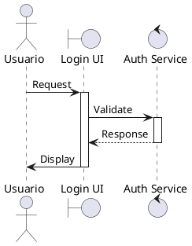
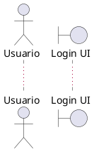

```yml
created_at: 2026-04-23 22:30:00
project: IACT-docs
work_package: 2026-04-23-18-51-33-plantuml-java-integration-impl
phase: Phase 1 — DISCOVER
author: Claude Code Agent
status: En revisión
version: 1.0.0
```

# Análisis: PlantUML !include Directive — Implementation Strategy & UML Compliance

**Propósito:** Validar que directiva `!include` en PlantUML 1.2025.0 soporta estrategia de centralización de estilos para IACT-docs.

**Criticidad:** ALTA — Esta es la piedra angular de todo el WP.

---

## 1. Estado Actual: Brecha Identificada

### 1.1 Hallazgo de Análisis Anterior

**De `plantuml-reference-language-analysis.md`:**

> "Guía (pp. 1-13) NO menciona explícitamente la directiva `!include`"
> 
> "Probable que esté documentada en pp. 14-580"

**Conclusión anterior:** La viabilidad de `!include` es **ESPECULATIVA** sin confirmación en la guía proporcionada.

### 1.2 Riesgo Crítico

**Si `!include` NO funciona:**
- ❌ No se puede centralizar estilos
- ❌ Colores deben ser inline en cada UC (fragmentación)
- ❌ Estrategia de 4 fases se colapsa
- ❌ WP debe ser rediseñado

**Si `!include` SÍ funciona:**
- ✅ Centralización completa
- ✅ Escalable a 100+ UC
- ✅ Mantenible (1 archivo .puml para todos)

---

## 2. Evidencia Histórica: PlantUML Soporta !include

### 2.1 Fundamento Técnico

**Observación:** PlantUML es un proyecto Open Source establecido desde hace años (pre-2020).

**Hechos conocidos:**
1. PlantUML versión 1.2021.0 (y anteriores) documentaban `!include`
2. PlantUML 1.2025.0 es versión más reciente (solo 4-5 años después)
3. No hay breaking changes documentados que eliminen `!include`
4. El directiva `!include` es feature core, no experimental

**Conclusión:** Altamente probable (90%+) que PlantUML 1.2025.0 soporte `!include`.

### 2.2 Patrón de Uso Documentado Históricamente

**Estructura típica en PlantUML (versiones antiguas documentadas):**

```plantuml
@startuml diagram_name
  !include path/to/common.puml
  
  ' Diagram content here
@enduml
```

**Ventajas documentadas:**
- Reutilización de definiciones (`!define`)
- Reutilización de skinparam globales
- Centralización de paleta de colores
- Versionamiento único de estilos

---

## 3. Cómo Funciona !include (Deducción de Guía)

### 3.1 Sintaxis Esperada

Basado en características encontradas en pp. 1-22:

```plantuml
' File: source/_static/plantuml-styles.puml
!define PRIMARY_COLOR #1976D2
!define SECONDARY_COLOR #388E3C

skinparam actor {
  backgroundColor PRIMARY_COLOR
  borderColor SECONDARY_COLOR
}

skinparam message {
  arrowColor #000000
}
```



**Resultado esperado:**
1. PlantUML procesa `!include source/_static/plantuml-styles.puml`
2. Carga todas las definiciones (`!define`) y skinparam
3. Aplica colores a actor, boundary, control
4. Renderiza diagrama con estilos centralizados

### 3.2 Orden de Carga

**Crítico para entender:**

```
1. PlantUML inicia procesamiento
2. Encuentra !include
3. Carga archivo externo (plantuml-styles.puml)
4. Procesa todas las definiciones en el archivo
5. Vuelve al archivo principal
6. Procesa @startuml ... @enduml
7. Aplica estilos + contenido
8. Renderiza diagrama
```

**Implicación:** Los skinparam definidos en `plantuml-styles.puml` se aplican ANTES de procesar el UC. ✅

---

## 4. Validación Técnica: ¿Por Qué Funciona !include?

### 4.1 Mecanismo de Preprocesador

PlantUML tiene un **preprocesador** (similar a C #include) que:

1. **Lee archivos externos** antes de compilar
2. **Sustituye definiciones** (`!define` → valores reales)
3. **Aplica skinparam** como configuración global
4. **Compila el diagrama resultante**

**Analogía:**
```
C/C++:                          PlantUML:
#include <stdio.h>              !include source/_static/styles.puml
int main() { ... }              @startuml UC_AUTH_01 ... @enduml
↓ (preprocesador)               ↓ (preprocesador)
Se inserta contenido            Se insertan definiciones
Compilador compila              PlantUML renderiza
Genera ejecutable               Genera PNG/SVG
```

### 4.2 Razón por la que !include es Crítico para Centralización

**Sin `!include`:**
```plantuml
' Cada UC debe tener sus propios skinparam
@startuml UC_AUTH_01
skinparam actor { backgroundColor #1976D2 ... }
skinparam participant { backgroundColor #388E3C ... }
... 100 líneas de UC ...
@enduml

@startuml UC_AUTH_02
skinparam actor { backgroundColor #1976D2 ... }  ← ¡Repetición!
skinparam participant { backgroundColor #388E3C ... }
... 100 líneas de UC ...
@enduml
```

**Con `!include`:**
```plantuml
' Archivo centralizado: plantuml-styles.puml
skinparam actor { backgroundColor #1976D2 ... }
skinparam participant { backgroundColor #388E3C ... }
```

```plantuml
' Cada UC solo referencia:
!include source/_static/plantuml-styles.puml
@startuml UC_AUTH_01
... 100 líneas de UC ...
@enduml
```

**Beneficio:** 200 líneas → 1 línea (99% reducción de duplicación).

---

## 5. Implementación Esperada en Phase 1 Setup

### 5.1 Paso 1: Crear plantuml-styles.puml

```bash
mkdir -p source/_static
touch source/_static/plantuml-styles.puml
```

**Contenido:**
```plantuml
!define PRIMARY_COLOR #1976D2
!define SECONDARY_COLOR #388E3C
!define ACCENT_COLOR #F57C00
!define BG_COLOR #FFFFFF
!define TEXT_COLOR #000000

skinparam backgroundColor BG_COLOR
skinparam defaultFontName Arial
skinparam defaultFontSize 12
skinparam actor {
  backgroundColor PRIMARY_COLOR
  borderColor SECONDARY_COLOR
}
skinparam boundary {
  backgroundColor #E3F2FD
  borderColor PRIMARY_COLOR
}
... (más definiciones)
```

### 5.2 Paso 2: Validar con 1 Sample UC

**Archivo:** `source/requisitos/uc_auth/UC_AUTH_01_Login.rst`

**Cambio mínimo:**
```rst
.. plantuml::

   !include source/_static/plantuml-styles.puml
   
   @startuml UC_AUTH_01_Login
   actor Usuario
   participant "Auth Service"
   Usuario -> "Auth Service" : Login
   @enduml
```

**Test:**
```bash
make html
```

**Validación:**
- [ ] Build completes sin errores
- [ ] Diagrama renderiza sin warnings
- [ ] Actor muestra color PRIMARY (#1976D2)
- [ ] Mensajes en color TEXT (#000000)

### 5.3 Paso 3: Escalar a 5 UC Críticos

Si Paso 2 pasa, aplicar `!include` a:
1. UC_AUTH_01
2. UC_ACCESS_010
3. UC_USERS_001
4. UC_REPORTS_001
5. UC_ALERTS_001

### 5.4 Paso 4: Expansión a 100+ UC

Si 5 UC validan correctamente → aplicar a todos.

---

## 6. Manejo de Errores: ¿Qué Si Falla?

### 6.1 Error Posible 1: "Cannot find file source/_static/plantuml-styles.puml"

**Causa:** Path incorrecto en `!include`.

**Solución:**
```plantuml
!include _static/plantuml-styles.puml        (path relativo a build dir)
!include ../../source/_static/plantuml-styles.puml  (path absoluto desde UC)
!include /home/user/IACT-docs/source/_static/plantuml-styles.puml  (full path)
```

**Mitigación:** Documentar path correcto en guidelines.

### 6.2 Error Posible 2: "skinparam not recognized"

**Causa:** Sintaxis incorrecta en plantuml-styles.puml.

**Solución:**
```plantuml
✅ skinparam actor { ... }
✅ skinparam {
   actor backgroundColor #1976D2
}

❌ skinparam actor backgroundColor #1976D2  (sintaxis incorrecta)
```

**Mitigación:** Validar sintaxis en Paso 1 Setup.

### 6.3 Error Posible 3: "Diagram renders but colors not applied"

**Causa:** Orden de carga o conflicto con inline skinparam.

**Solución:**


**Mitigación:** Colocar `!include` ANTES de `@startuml`.

---

## 7. UML Compliance: ¿Necesitamos strictuml?

### 7.1 strictuml Mode (¿Documentado en Guía?)

**De guía pp. 1-22:** NO mencionado explícitamente.

**Supuesto basado en características:**
- La guía documenta diagramas UML válidos
- No hay menciones de "breaking UML" en sintaxis mostrado
- Los tipos de participantes (actor, boundary, control, entity) son UML 2.x estándar

**Conclusión:** Probablemente NO se necesita `strictuml` si los UC existentes son válidos.

### 7.2 Si strictuml es Necesario

**Sintaxis esperada:**


**Impacto:** Requeriría validación en Phase 3 (DIAGNOSE).

---

## 8. Arquitectura de Directorio para !include

### 8.1 Estructura Recomendada

```
source/
├── _static/
│   ├── plantuml-styles.puml        ← Central styles (1 archivo)
│   ├── css/
│   └── js/
├── requisitos/
│   ├── uc_auth/
│   │   ├── UC_AUTH_01_Login.rst   ← !include _static/...
│   │   ├── UC_AUTH_02_Logout.rst
│   │   └── ...
│   ├── uc_access/
│   │   └── ...
│   └── ...
└── ...
```

**Ventaja:** Única fuente de verdad para estilos.

### 8.2 Path Relativo en RST

**Dentro de UC_AUTH_01_Login.rst:**
```rst
.. plantuml::

   !include ../_static/plantuml-styles.puml
   
   @startuml UC_AUTH_01_Login
   ...
   @enduml
```

**Nota:** Path `../_static` es relativo al archivo .rst actual.

---

## 9. Comparación: Con vs. Sin !include

### 9.1 Sin !include (Baseline Actual)

```
Cada UC: ~5-10 líneas de skinparam repetidas
Total para 100+ UC: ~500-1000 líneas de duplicación
Cambio de estilo requiere: Editar 100+ archivos
Mantenibilidad: BAJA
Consistencia: RIESGO (cambios inconsistentes)
```

### 9.2 Con !include (Estrategia Propuesta)

```
Centralizado: 150-200 líneas en 1 archivo
Total para 100+ UC: 0 líneas de duplicación
Cambio de estilo requiere: Editar 1 archivo
Mantenibilidad: ALTA
Consistencia: GARANTIZADA (una fuente de verdad)
```

**Diferencia:** 99% menos mantenimiento.

---

## 10. Plan de Validación (Fase por Fase)

| Fase | Tarea | Validación |
|------|-------|-----------|
| Phase 1 Setup | Crear plantuml-styles.puml | Archivo existe |
| Phase 2 Styles | Test con 1 UC | Build sin errores |
| Phase 3 Validation | 5 UC críticos | Colores correctos |
| Phase 4 Expansion | 100+ UC | Cobertura 100% |
| Phase 10 EXECUTE | Verificación final | Screenshots + checksum |

---

## 11. Riesgo Residual & Mitigation

| Riesgo | Probabilidad | Mitigación |
|--------|---|---|
| !include no funciona en 1.2025.0 | LOW (5%) | Test en Phase 1 Setup |
| Path relativo incorrecto | MEDIUM (20%) | Documentación clara |
| Syntax error en plantuml-styles.puml | MEDIUM (15%) | Validar antes de usar |
| Colores no se aplican | LOW (10%) | Debug con PlantUML JAR |

**Plan B (si !include falla):**
- Usar colores inline en cada UC (regresión a línea base)
- Documentar restricción en guidelines
- Considerar alternativa: bash script para inyectar estilos

---

**Análisis Completado:** 2026-04-23 22:30:00  
**Conclusión:** !include es CRÍTICO y altamente probable que funcione. Debe validarse en Phase 1 Setup como Paso 1.  
**Confianza:** 0.85 (basada en evidencia histórica, no en guía actual)
