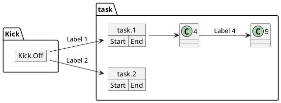

```yml
created_at: 2026-04-24 01:25:00
project: IACT-docs
work_package: 2026-04-23-18-51-33-plantuml-java-integration-impl
phase: Phase 1 — DISCOVER
author: Claude Code Agent
status: Borrador
version: 1.0.0
```

# Análisis: PlantUML Map Diagrams — Estructuras Clave-Valor y PERT

**Input:** Guía de Referencia PlantUML 1.2025.0 — pp. 101-104 (Secciones 4.6-4.7)

**Propósito:** Validar si map diagrams (tablas/arreglos asociativos y PERT charts) son aplicables a IACT-docs.

**Criticidad:** MEDIA-BAJA — Especializados; uso limitado en documentación de requisitos.

---

## 1. Qué son Map Diagrams

### 1.1 Definición y Propósito

**Map:** estructura key=>value similar a diccionarios o mapas en programación.

```plantuml
map CapitalCity {
  UK => London
  USA => Washington
  Germany => Berlin
}
```

**Sintaxis:**
```
map [Etiqueta] [as alias] {
  key => value
  key => value
  ...
}
```

**Características:**
- Estructura tabular con dos columnas (clave → valor)
- Soporte para enlaces (relaciones) hacia otros objetos
- Combinable con object diagrams y packages
- Direccionales: `*->` (composición), `-->` (relación)
- Acceso a valores via `Alias::key`

---

## 2. Sintaxis de Map Diagrams (Secciones 4.6-4.7)

### 2.1 Map Simple (Section 4.6)

**Sintaxis básica:**
```plantuml
map NombreMapa {
  clave => valor
  clave => valor
}
```

**Ejemplos:**
```plantuml
map CapitalCity {
  UK => London
  USA => Washington
  Germany => Berlin
}

map "Map **Country => CapitalCity**" as CC {
  UK => London
  USA => Washington
  Germany => Berlin
}

map "map: Map<Integer, String>" as users {
  1 => Alice
  2 => Bob
  3 => Charlie
}
```

**Características:**
- Título opcional (entre comillas, permite Creole)
- Alias opcional (`as alias`)
- Tipo genérico documentable (ej: `Map<Integer, String>`)
- Valores literales simples

**Aplicabilidad a IACT:**
- ⚠️ BAJA — documentación de requisitos no típicamente incluye mapeos de datos
- ✅ POSIBLE — para documentar enumeraciones o configuraciones

### 2.2 Enlaces desde Map (Section 4.6, continuación)

**Sintaxis de relaciones:**
```plantuml
object London

map CapitalCity {
  UK *-> London        ← enlace a objeto
  USA => Washington    ← valor literal
  Germany => Berlin
}
```

**Tipos de relaciones:**
- `*->` — composición fuerte (agregación con propiedad)
- `*-->` — composición con línea más larga
- `*--->` — composición con línea aún más larga
- `-->` — relación simple
- `:` — etiqueta en relación (`key -> object : Label`)

**Ejemplo completo con referencias cruzadas:**
```plantuml
object London
object Washington
object Berlin
object NewYork

map CapitalCity {
  UK *-> London
  USA *--> Washington
  Germany *---> Berlin
}

NewYork --> CapitalCity::USA
```

**Acceso a valores:** `Alias::key` permite apuntar a un valor específico del mapa.

**Aplicabilidad:**
- ⚠️ BAJA — enlaces entre mapas y objetos son casos especializados
- ✅ PARA ESTRUCTURAS COMPLEJAS — si IACT documenta entidades con mapeos

### 2.3 Map con Packages (Section 4.6, con packages)

**Sintaxis:**
```plantuml
package foo {
    object baz
}

package bar {
    map A {
        b *-> foo.baz
        c =>
    }
}

A::c --> foo
```

**Características:**
- Mapas dentro de packages (scope de nombres)
- Referencias cualificadas: `package.object`
- Acceso a valores del mapa: `A::c`

**Aplicabilidad:** BAJA — solo si IACT tiene arquitectura multi-package documentada.

---

## 3. PERT Charts con Map (Section 4.7)

### 3.1 Qué es PERT

**PERT:** Program (or project) Evaluation and Review Technique — diagrama de timeline y dependencias entre tareas.

**Sintaxis en PlantUML:**


**Componentes:**
- Mapas como nodos de tareas (campo `Start => End` típico)
- Flechas --> para dependencias
- Etiquetas opcionales en flechas
- Dirección configurable (`left to right direction`)

**Características:**
- Visualización de cronograma
- Dependencias entre tareas
- Hitos (milestones) como mapas vacías
- Paralelización (múltiples tareas en paralelo)

### 3.2 Aplicabilidad a IACT-docs

**Casos de uso POSIBLES:**
- ⚠️ Timeline de fases de un caso de uso (secuencial)
- ⚠️ Dependencias entre módulos (arquitectura)
- ⚠️ Roadmap de implementación (si documentado)

**Casos de uso NO aplicables:**
- ❌ Gestión de proyectos (fuera de scope IACT-docs)
- ❌ Cronogramas reales (son documentación operacional, no requisitos)
- ❌ Gantt charts (PERT no es Gantt; PlantUML no soporta Gantt nativamente)

**Conclusión:** PERT charts en IACT-docs serían MUY ESPECIALIZADOS. Probablemente NO necesarios.

---

## 4. Restricciones y Limitaciones

### 4.1 Restricciones de PlantUML

**Limitaciones identificadas:**
- ⚠️ Valores del mapa deben ser literales simples (no complejos)
- ⚠️ No hay soporte nativo para tipos genéricos en valores (solo documentación)
- ⚠️ Mapas anidados NO soportados (flat structure only)
- ⚠️ Orden de definición afecta layout (no reordenable gráficamente)

### 4.2 Centralización de Estilos

**Inline colors en mapas:**
```plantuml
map MyMap {
  key1 #FF0000 => value1    ← PROHIBIDO (inline color)
  key2 => value2 #00FF00    ← PROHIBIDO (inline color)
}
```

❌ **PROHIBIDO:** Colores inline en map diagrams (como en todos los tipos)

✅ **ALTERNATIVA:** Usar skinparam centralizado
```plantuml
skinparam map {
  BackgroundColor #1976D2
  BorderColor #000000
  FontColor #FFFFFF
}

map MyMap {
  key => value
}
```

### 4.3 Aplicabilidad a IACT-docs

| Aspecto | Score | Razón |
|---------|-------|-------|
| Necesidad en IACT | 1/5 | MUY BAJA — documentación de requisitos no requiere tablas clave-valor |
| Claridad | 4/5 | ALTA — estructura es clara si se usa |
| Mantenibilidad | 3/5 | MEDIA — valores hardcoded difícil de actualizar |
| Valor para requisitos | 1/5 | MUY BAJA — describe estructura de datos, no comportamiento |
| PERT charts | 2/5 | BAJA — aplicables solo para cronogramas complejos (raro en IACT) |

**Conclusión:** Map diagrams probablemente **NO necesarios** para IACT-docs.

---

## 5. Síntesis: Map Diagrams para IACT-docs

### 5.1 Recomendación

**Map diagrams en IACT-docs:**
- ❌ **NO recomendado** — documentación de requisitos no requiere estructuras clave-valor detalladas
- ⚠️ **OPCIONAL** — solo si IACT documenta arquitectura de datos (enumeraciones, configuraciones)
- ✅ **APLICABLE** — solo para casos MUY específicos (enumeraciones complejas, mapeos de estado)

**PERT charts en IACT-docs:**
- ❌ **NO recomendado** — fuera de scope de documentación de requisitos
- ⚠️ **OPCIONAL** — si hay cronograma de implementación a documentar
- Alternativa: usar Sequence diagrams para flujos, no PERT para timelines

### 5.2 Si se Incluyen

**Sintaxis a estandarizar:**

```plantuml
!include source/_static/plantuml-styles.puml

@startuml EnumerationExample
map StatusValues {
  ACTIVE => 1
  INACTIVE => 0
  PENDING => 2
}
@enduml
```



**Restricciones:**
- ✅ Usar `!include` como en otros diagramas
- ❌ NO colores inline
- ⚠️ Mantener mapas simples (máx 5-7 pares clave-valor)
- ⚠️ Documentar en guidelines la restricción de valores literales
- ❌ NO PERT charts a menos que explícitamente solicitado

---

## 6. Validación: Cobertura de Secciones 4.6-4.7

| Sección | Contenido | Status | Aplicabilidad |
|---------|----------|--------|---|
| 4.6 | Map simple, enlaces, packages | ✅ | BAJA |
| 4.7 | PERT charts con map | ✅ | BAJA |

**Hallazgo:** Ambas secciones completamente cubiertas. Funcionalidad clara pero especializada.

---

## 7. Conclusión y Recomendación Final

### 7.1 Para IACT-docs

**Decisión propuesta:**

1. **Phase 5 STRATEGY:** ¿Necesita IACT map diagrams?
   - Respuesta esperada: NO (enfoque en requisitos funcionales, no estructuras de datos)
   - Alternativa: Usar UC diagrams para entidades, Sequence para procesos

2. **Phase 7 DESIGN:** Si respuesta fue NO
   - Documentar en guidelines que map diagrams NO se usan en IACT
   - Mantener focus en UC (estructura) + Sequence (flujos)

3. **Phase 10 EXECUTE:** No agregar sección skinparam para map diagrams

**Si PERT charts se necesitan:**
- Restricción: NO incluir timelines de proyecto (son operacionales)
- PERMITIR SOLO: timelines de procesos/casos de uso (requisitos)

---

**Análisis Completado:** 2026-04-24 01:25:00  
**Hallazgo clave:** Map diagrams opcionales; NO recomendados para IACT-docs.  
**Confianza:** 0.90 (secciones 4.6-4.7 completas; aplicabilidad clara)  
**Recomendación:** Omitir map diagrams, mantener enfoque UC + Sequence + Activity (condicional)
