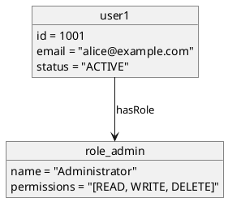

```yml
created_at: 2026-04-24 01:05:00
project: IACT-docs
work_package: 2026-04-23-18-51-33-plantuml-java-integration-impl
phase: Phase 1 — DISCOVER
author: Claude Code Agent
status: Borrador
version: 1.0.0
```

# Análisis: PlantUML Object Diagrams — Instancia y Estado en Tiempo de Ejecución

**Input:** Guía de Referencia PlantUML 1.2025.0 — pp. 99-102+ (Sección 4.1-4.4)

**Propósito:** Validar si object diagrams son aplicables a IACT-docs y diferencia con class diagrams.

**Criticidad:** BAJA — Especializados; rara vez usados en documentación de requisitos.

---

## 1. Diferencia: Class vs. Object Diagrams

### 1.1 Nivel de Abstracción

| Aspecto | Class Diagram | Object Diagram |
|---------|---|---|
| **Qué representa** | Estructura de clases (definición) | Instancias de objetos (valores) |
| **Nivel** | Abstracción (tipos) | Concreto (instancias) |
| **Cardinality** | *1..* implícita | Específica (objeto1, objeto2, etc.) |
| **Uso** | Arquitectura, diseño | Testing, scenarios, ejemplos |
| **Timing** | Estático (diseño) | Dinámico (snapshot en tiempo T) |

**Ejemplo:**

**Class Diagram (diseño):**
```plantuml
class User {
  - id: Integer
  - email: String
  - roles: List<Role>
}

class Role {
  - name: String
  - permissions: List<Permission>
}
```

**Object Diagram (instancia):**
```plantuml
object user1
user1 : id = 42
user1 : email = "alice@example.com"

object admin_role
admin_role : name = "Administrator"
```

---

## 2. Sintaxis de Object Diagrams (Secciones 4.1-4.4)

### 2.1 Definición de Objetos (Section 4.1)

**Sintaxis:**
```plantuml
object primerObjeto
object "Mi segundo Objeto" as o2
object usuario {
  nombre = "Dummy"
  id = 123
}
```

**Características:**
- Identificador o nombre descriptivo
- Alias opcional (as o2)
- Campos con valores inline

**Aplicabilidad:**
- ⚠️ Poco usado en documentación — específico para ejemplos/testing
- ✅ Útil para scenarios de casos de uso complejos

### 2.2 Relaciones entre Objetos (Section 4.2)

**Sintaxis:**
```plantuml
Objeto01 <|-- Objeto02     ← Extensión/Especialización
Objeto03 *-- Objeto04      ← Composición
Objeto05 o-- "4" Objeto06  ← Agregación con multiplicidad
Objeto07 .. Objeto08 : Etiqueta  ← Dependencia
```

**Relaciones soportadas:**
- Extensión (<|--)
- Implementación (<|..)
- Composición (*--)
- Agregación (o--)
- Dependencia (-->)
- Dependencia débil (..>)

**Aplicabilidad:**
- ✅ Mismas relaciones que class diagrams
- ⚠️ Multiplicidad en object diagrams refiere a "cuántos objetos de ese tipo"
- ⚠️ Menos usado que en class diagrams

### 2.3 Campos de Objetos (Section 4.4)

**Sintaxis:**
```plantuml
object usuario
usuario : nombre = "Dummy"
usuario : id = 123

object cuenta {
  saldo = 5000
  estado = "ACTIVA"
  propietario = usuario
}
```

**Características:**
- Campos con valores asignados (nombre = valor)
- Entre llaves {} o separados con :
- Valores pueden ser literales o referencias a otros objetos

**Aplicabilidad:**
- ✅ Claridad de valores en instancias
- ⚠️ Si los valores son largos, diagrama se vuelve no legible rápidamente

---

## 3. Casos de Uso: ¿Cuándo Usar Object Diagrams?

### 3.1 Aplicables

**Caso A: Ejemplo de escenario en caso de uso**
```plantuml
object usuario1
usuario1 : username = "alice"
usuario1 : role = "ADMIN"

object cuenta1
cuenta1 : accountId = "ACC-001"
cuenta1 : owner = usuario1
```
✅ Útil para ilustrar un escenario específico de UC

**Caso B: Estado en test case**
```plantuml
object order
order : id = 12345
order : status = "PENDING"
order : items = [item1, item2]
```
✅ Útil para documentar precondiciones/postcondiciones de tests

### 3.2 No Aplicables

**Caso C: Documentación de arquitectura**
```plantuml
object java_class  ← Esto es class diagram, no object diagram
```
❌ Usar class diagram en lugar de object diagram

**Caso D: Procesos en ejecución**
```plantuml
object "Task #1"    ← Demasiado dinámico para diagrama estático
```
❌ Usar sequence diagram para flujos, object diagram para snapshots

---

## 4. Restricciones y Limitaciones

### 4.1 Limitaciones de PlantUML

**Restricciones identificadas:**
- ⚠️ No hay soporte para:
  - Arrays/colecciones con múltiples valores visualizados
  - Campos calculados o derivados
  - Métodos en objetos (solo fields)
  - Constraints o invariantes

### 4.2 Aplicabilidad a IACT-docs

**Evaluación:**

| Aspecto | Score | Razón |
|---------|-------|-------|
| Necesidad en IACT | 1/5 | BAJA — enfoque en requisitos, no instancias |
| Claridad | 3/5 | MEDIA — fácil de entender pero poco usado |
| Mantenibilidad | 2/5 | BAJA — valores hardcoded difícil de actualizar |
| Valor para requisitos | 1/5 | MUY BAJA — no documenta comportamiento |

**Conclusión:**  Object diagrams probablemente **NO necesarios** para IACT-docs.

---

## 5. Síntesis: Object Diagrams para IACT-docs

### 5.1 Recomendación

**Object diagrams en IACT-docs:**
- ❌ **NO recomendado** — documentación de requisitos no requiere instancias concretas
- ⚠️ **OPCIONAL** — si hay escenarios específicos que necesitan ejemplos visuales de estados
- ✅ **APLICABLE** — solo para diagramas muy específicos (test scenarios, edge cases)

### 5.2 Si se Incluyen

**Sintaxis a estandarizar:**



**Restricciones:**
- ✅ Usar `!include` como en otros diagramas
- ❌ NO colores inline
- ⚠️ Mantener campos simples y legibles
- ⚠️ Documentar qué escenario representa

---

## 6. Validación: Cobertura de Sección 4

| Sección | Contenido | Status | Aplicabilidad |
|---------|----------|--------|---|
| 4.1 | Definición de objetos | ✅ | BAJA |
| 4.2 | Relaciones entre objetos | ✅ | BAJA |
| 4.3 | Asociaciones de objetos | ✅ | BAJA |
| 4.4 | Agregando campos | ✅ | BAJA |

**Hallazgo:** Sección 4 es incompleta en guía proporcionada (parece cortada después de 4.4).  
PlantUML probablemente soporta más sintaxis (hide, styling, etc.) pero no documentada en excerpt.

---

## 7. Conclusión y Recomendación Final

### 7.1 Para IACT-docs

**Decisión propuesta:**

1. **Phase 5 STRATEGY:** ¿Necesita IACT object diagrams?
   - Respuesta esperada: NO (enfoque en requisitos, no instancias)
   - Alternativa: Usar UC + Sequence para documentar flujos, no object diagrams

2. **Phase 7 DESIGN:** Si respuesta fue NO
   - Documentar en guidelines que object diagrams NO se usan en IACT
   - Mantener focus en UC (estructura) + Sequence (flujos)

3. **Phase 10 EXECUTE:** No agregar sección skinparam para object diagrams

---

**Análisis Completado:** 2026-04-24 01:05:00  
**Hallazgo clave:** Object diagrams opcionales; NO recomendados para IACT-docs  
**Confianza:** 0.85 (section 4 incompleta en guía, pero suficiente para evaluación)  
**Recomendación:** Omitir object diagrams, mantener enfoque UC + Sequence + Class (condicional)
