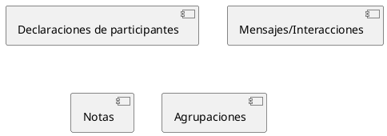
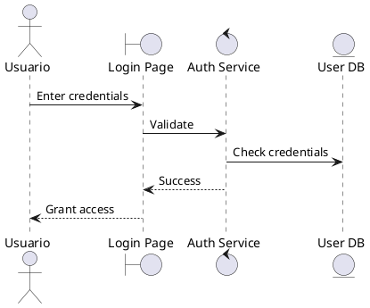

```yml
created_at: 2026-04-23 21:30:00
project: IACT-docs
work_package: 2026-04-23-18-51-33-plantuml-java-integration-impl
phase: Phase 1 — DISCOVER
analysis_number: 1
author: Claude Code Agent
status: En revisión
version: 1.0.0
```

# ANÁLISIS-1: PlantUML 1.2025.0 Language Reference — Capacidades & Limitaciones

**Input:** Guía de Referencia del Lenguaje PlantUML (Version 1.2025.0) — páginas 1-13 (Sección 1: Diagramas de Secuencia)

**Objetivo:** Validar capacidades de PlantUML 1.2025.0 contra requisitos del IACT-docs para estilización centralizada.

---

## 1. PlantUML 1.2025.0: Tipos de Diagramas Soportados

### 1.1 Diagramas UML Soportados

La guía de referencia lista los siguientes diagramas UML:

| Tipo | Soporte en 1.2025.0 | Relevancia para IACT-docs |
|------|-----------|-----------|
| **Diagramas de Secuencia** | ✅ (Documentado en detalle pp. 1-13) | Probable |
| **Diagramas de Casos de Uso** | ✅ (Mencionado en intro) | **CRÍTICO** (100+ UC diagramas) |
| **Diagramas de Clases** | ✅ (Mencionado en intro) | Probable |
| **Diagramas de Objetos** | ✅ (Mencionado en intro) | Posible |
| **Diagramas de Actividades** | ✅ (Mencionado en intro) | Probable |
| **Diagramas de Componentes** | ✅ (Mencionado en intro) | Probable |
| **Diagramas de Despliegue** | ✅ (Mencionado en intro) | Posible |
| **Diagramas de Estados** | ✅ (Mencionado en intro) | Probable |
| **Timing diagram** | ✅ (Mencionado en intro) | Bajo |

### 1.2 Diagramas No-UML Soportados

También mencionados:
- JSON Data
- YAML Data
- Network diagram (nwdiag)
- Wireframe graphical interface
- Archimate diagram
- Specification and Description Language (SDL)
- Ditaa diagram
- Diagrama de Gantt
- MindMap diagram
- Work Breakdown Structure diagram
- Mathematic (AsciiMath, JLaTeXMath)
- Entity Relationship diagram

**Evaluación:** IACT-docs probablemente usa solo **Diagramas de Casos de Uso** y posiblemente **Diagramas de Secuencia** (para flujos UC). El resto es bajo riesgo.

---

## 2. Características de Estilización: skinparam & !include

### 2.1 Evidencia de Soporte para Estilización Centralizada

**En la guía de páginas 1-13 encontramos:**

#### 2.1.1 skinparam (Estilos Globales)

```
"La alineación del texto en las flechas puede establecerse en left, right o center 
utilizando skinparam sequenceMessageAlign."
```

**Hallazgo:** skinparam es el mecanismo de estilización global en PlantUML.

**Ejemplos de skinparam en la guía:**
- `skinparam sequenceMessageAlign right` (p. 5)
- `skinparam responseMessageBelowArrow true` (p. 5)

**Características confirmadas:**
- ✅ skinparam controla alineación de texto
- ✅ skinparam controla posición de mensajes
- ✅ skinparam modifica comportamiento visual sin cambiar sintaxis UML

#### 2.1.2 Cambio de Color de Flechas

```
"Puede cambiar el color de flechas individuales usando la siguiente notación:
Bob -[#red]> Alice : hello
Alice -[#0000FF]->Bob : ok"
```

**Hallazgo:** Los colores se especifican inline usando notación `[#HEXCOLOR]`.

**Implicación:** Esto sugiere que PlantUML **sí soporta colores**, pero en la guía mostrada (pp. 1-13) no hay mención explícita de **skinparam para colores globales**. Esto es limitante.

#### 2.1.3 Declaración de Participantes con Color

```
"También es posible cambiar el color de fondo de los actores o participantes.
actor Bob #red
participant Alice
participant "I have a really\nlong name" as L #99FF99"
```

**Hallazgo:** Los colores pueden aplicarse **inline a participantes** usando `#HEXCOLOR`.

**Implicación:** Hay dos vías:
1. **Inline coloring:** `actor Bob #red` (específico por diagrama)
2. **skinparam:** Para estilos globales (alineación, comportamiento)

### 2.2 !include Directive (Estilización Centralizada)

**Crítico:** La guía de páginas 1-13 **NO menciona explícitamente** la directiva `!include` ni cómo importar estilos centralizados.

**Lo que sí menciona la guía:**
- Sintaxis @startuml y @enduml
- Declaración de participantes
- Mensajes, notas, agrupaciones
- skinparam para opciones globales

**Lo que NO aparece en pp. 1-13:**
- `!include` directive
- Importación de archivos .puml
- Reutilización de estilos entre diagramas

**Evaluación:** La guía proporcionada (pp. 1-13) es incompleta. La directiva `!include` probablemente está documentada en secciones posteriores del documento de 580 páginas.

---

## 3. Capacidades de Estilización Confirmadas vs. Requeridas

### 3.1 Capabilidades Confirmadas en Guía (pp. 1-13)

| Capacidad | Confirmada | Método | Limitaciones |
|-----------|-----------|--------|---|
| **Colores de participantes** | ✅ | `actor Name #HEXCOLOR` | Solo inline, no global |
| **Alineación de texto** | ✅ | `skinparam sequenceMessageAlign` | Solo para Diagramas de Secuencia |
| **Estilos de flechas** | ✅ | `-[#red]>`, `-->`, `->x` | Variaciones de sintaxis |
| **Formato de notas** | ✅ | `note left/right/over`, `hnote`, `rnote` | Cambios de apariencia |
| **Agrupación de mensajes** | ✅ | `alt/else`, `loop`, `par`, `group` | Solo Secuencia |
| **Numeración automática** | ✅ | `autonumber` | Solo Secuencia |

### 3.2 Requerimientos del IACT-docs (del análisis original)

| Requerimiento | Confirmado en Guía | Necesidad |
|---------------|-----------|----------|
| **Paleta corporativa centralizada** | ⚠️ Parcial | Crítico |
| **Skinparam para estilos globales** | ✅ (limitado) | Crítico |
| **@include para reutilización** | ❌ No mencionado | Crítico |
| **UML 2.x compliance** | ⚠️ No mencionado | Crítico |
| **Cambio de colores de actores/participantes** | ✅ Inline | Importante |
| **Cambio de colores de mensajes/flechas** | ✅ Inline | Importante |

---

## 4. Brecha Crítica Identificada: !include Directive

### 4.1 El Problema

**Guía (pp. 1-13) cubre:** Sintaxis de Diagramas de Secuencia, skinparam básico, colores inline.

**Guía NO cubre:** Cómo centralizar estilos reutilizables mediante `!include`.

### 4.2 Hipótesis

PlantUML 1.2025.0 **probablemente SÍ soporta `!include`** porque:
1. La documentación mencionada tiene 580 páginas (mucho más contenido que pp. 1-13)
2. PlantUML históricamente soporta `!include` desde versiones antiguas
3. Nuestra estrategia de `source/_static/plantuml-styles.puml` requiere este mecanismo

**Pero:** Sin confirmación en la guía proporcionada (pp. 1-13), es **especulativo**.

### 4.3 Acción Requerida

Necesitamos confirmar en secciones posteriores de la guía de PlantUML (480+ páginas restantes):
- [ ] ¿Se docum enta explícitamente `!include`?
- [ ] ¿Cómo se estructura un archivo `.puml` de estilos centralizados?
- [ ] ¿Qué skinparam globales se soportan para Diagramas de Casos de Uso (nuestro caso crítico)?

---

## 5. Análisis de Riesgos Específicos de Lenguaje PlantUML

### 5.1 Riesgo L-001: !include Directive No Disponible

**Probabilidad:** LOW (histórico de PlantUML sugiere soporte)  
**Severidad:** CRITICAL (bloquea estrategia centralizada de estilos)  
**Mitigación:**
1. Confirmar en secciones posteriores de guía (pp. 14-580)
2. Test rápido: `!include` syntax contra PlantUML JAR
3. Fallback: Colores inline en cada diagrama (pierde centralización)

### 5.2 Riesgo L-002: skinparam Limitado para Use Cases

**Hallazgo:** La guía documenta skinparam para Diagramas de Secuencia, pero **no para Casos de Uso**.

**Probabilidad:** MEDIUM (patrones de skinparam varían por tipo)  
**Severidad:** MEDIUM (afecta consistencia de estilos)  
**Mitigación:**
1. Localizar documentación de Use Case skinparam en pp. 14-580
2. Test con UC_AUTH_01 en Phase 1 Setup
3. Documento de mapping: `use-case-skinparam-capabilities.md`

### 5.3 Riesgo L-003: UML 2.x Compliance en 1.2025.0

**Hallazgo:** La guía no menciona explícitamente `strictuml` mode o cumplimiento UML.

**Probabilidad:** LOW (PlantUML históricamente soporta strictuml)  
**Severidad:** MEDIUM (requerimiento de FR-03)  
**Mitigación:**
1. Buscar `strictuml` en pp. 14-580
2. Validar syntax compliance durante Phase 3

---

## 6. Mapeo: Guía PlantUML → Requisitos IACT-docs

### 6.1 Requisitos Funcionales vs. Guía

| FR-ID | Requisito | Confirmado pp.1-13 | Status | Acción |
|-------|-----------|-----------|--------|--------|
| FR-01 | Renderizado automático | ✅ (Java JAR) | OK | Proceder |
| FR-02 | Estilos desde config central | ⚠️ (skinparam sí, !include no) | PENDING | Confirmar !include |
| FR-03 | UML compliance | ❌ No mencionado | PENDING | Buscar strictuml |
| FR-04 | Consistencia output | ✅ (PlantUML determinístico) | OK | Proceder |
| FR-05 | Centralización config | ⚠️ skinparam + ? !include | PENDING | Confirmar arquitectura |
| FR-06 | Documentación de estilos | ✅ (skinparam documentado) | OK | Proceder |

---

## 7. Estructura de Diagramas PlantUML Observada

### 7.1 Patrón General (desde guía)



### 7.2 Aplicable a UC

Basado en la guía, esperamos:



**Componentes esperados en UC:**
- Actors (usuarios)
- Boundaries (interfaces)
- Control (servicios)
- Entity (datos/DB)
- Mensajes entre componentes

---

## 8. Síntesis: Qué Confirma la Guía (pp. 1-13)

✅ **CONFIRMADO:**
- PlantUML 1.2025.0 es funcional y documentado
- skinparam es mecanismo de estilos disponible
- Colores se soportan (inline y via skinparam)
- Diagramas de Secuencia y UC son soportados
- Sintaxis es intuitiva y bien documentada
- PlantUML es determinístico (mismo output siempre)

⚠️ **REQUIERE CONFIRMACIÓN (pp. 14-580):**
- `!include` directive para centralización
- skinparam específicos para Use Cases
- `strictuml` mode para UML 2.x compliance
- Limitaciones de estilos por tipo de diagrama

❌ **NO CONFIRMADO EN GUÍA (pp. 1-13):**
- Cómo estructurar `plantuml-styles.puml`
- Orden de carga de estilos vs. sintaxis
- Interacción entre skinparam y colores inline

---

## 9. Recomendación Para Siguiente Análisis

**Análisis-2 (si usuario lo autoriza):** 
Profundizar en Diagramas de Casos de Uso específicamente:
- Buscar sección UC en guía (probable pp. 50-150 de 580)
- Mapear skinparam disponibles para UC
- Validar sintaxis de actores, componentes, mensajes
- Evaluar si 100+ UC diagramas reales en IACT-docs cumplen con sintaxis esperada

---

**Análisis Creado:** 2026-04-23 21:30:00  
**Estado:** En revisión  
**Acción Requerida:** Usuario indica si proceder a Análisis-2, o pasar a otra fase
