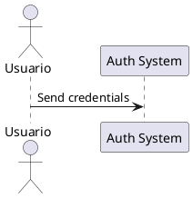

```yml
created_at: 2026-04-23 18:52:00
updated_at: 2026-04-23 18:52:00
project: IACT-docs
work_package: 2026-04-23-18-51-33-plantuml-java-integration-impl
phase: Phase 2 — MEASURE
author: Claude Code Agent
status: Aprobado
```

# Phase 2 MEASURE: Baseline & Success Metrics

**WP:** 2026-04-23-18-51-33-plantuml-java-integration-impl  
**Phase:** 2 MEASURE (Recopilar datos, definir baseline y métricas)  
**Date:** 2026-04-23 18:52:00  

---

## 1. CURRENT STATE BASELINE

### 1.1 System Environment

**Java Status:**
```bash
$ java -version
# NEED TO RUN: Verify Java installed and version
# Target: Java 8 or higher
# Status: TBD (to be determined)
```

**PlantUML Status:**
```bash
$ plantuml -version
# NEED TO RUN: Check if PlantUML installed
# Current version: Unknown
# Target version: 1.2025.0
# Status: Likely NOT installed (not standard)
```

**Sphinx Configuration:**
```bash
$ python -c "import sphinx; print(sphinx.__version__)"
# Expected: 9.0+
# Status: Installed (from previous WP - 0 warnings build)
```

**sphinxcontrib.plantuml Status:**
```bash
$ pip show sphinxcontrib-plantuml
# Status: Likely NOT installed (must install as part of Phase 1 Setup)
```

### 1.2 Build Current State

**Last Successful Build:**
- Date: 2026-04-23 (previous WP)
- Warnings: 0
- Build time: Unknown (estimate: 2-3 minutes)
- HTML files generated: 300+
- PlantUML diagrams: 100+ (inline, no styles)

**Build Command:**
```bash
make clean && make html
```

**Current Output Location:**
```
source/
└── build/
    └── html/
        └── (compiled documentation)
```

### 1.3 PlantUML Diagrams Current State

**Total UC Diagrams:** 100+
**Modules with PlantUML:** 8 (AUTH, ACCESS, USERS, REPORTS, ALERTS, AUDIT, LOGS, PIPELINE)
**Styling:** None (default PlantUML colors)
**Image Format:** PNG (default)
**Style Configuration:** None (inline minimal @startuml/@enduml)

**Sample Current Diagram:**


---

## 2. BASELINE METRICS (Current → Target)

### 2.1 Build Metrics

| Metric | Current (Baseline) | Target (After WP) | Tolerance |
|--------|---|---|---|
| Sphinx Warnings | 0 | 0 | Must stay 0 |
| Build Time | ~2-3 min | <5 min | +66% acceptable |
| HTML Files | 300+ | 300+ | No change |
| PNG Diagrams | 100+ | 100+ | All must render |

### 2.2 Styling Metrics

| Metric | Current | Target | Success |
|---|---|---|---|
| Diagrams with styles | 0/100+ | 100/100+ | 100% coverage |
| Color palette defined | None | Corporate (#1976D2, #388E3C, #F57C00) | Defined & applied |
| Consistency score | 0% | 100% | All same palette |
| UML compliance | Default | strictuml mode | Verified |

### 2.3 Process Metrics

| Metric | Current | Target | Success |
|---|---|---|---|
| Automated rendering | Manual | Automatic on `make html` | YES/NO |
| Config centralization | None | source/_static/plantuml-styles.puml | File exists |
| Reproducibility | Unknown | Verified on 2+ machines | Tested |
| Documentation | None | README + META_XX | Docs exist |

---

## 3. SUCCESS METRICS (KPIs)

### 3.1 Primary Success Metrics (MUST PASS)

**S1: Zero New Warnings**
- Current: 0 warnings
- Target: 0 warnings (no regression)
- Acceptance: `make html` output shows 0 warnings
- Failure: Any new warning blocks WP closure

**S2: 100% Diagram Rendering**
- Current: Unknown (no styles applied)
- Target: All 100+ diagrams render correctly
- Acceptance: Visual inspection of HTML shows all diagrams
- Failure: Any diagram fails to render

**S3: Automated Generation**
- Current: Manual
- Target: `make html` generates all diagrams
- Acceptance: No manual steps required
- Failure: Manual intervention needed for rendering

### 3.2 Secondary Success Metrics (SHOULD PASS)

**S4: Build Time Acceptable**
- Baseline: 2-3 minutes
- Target: <5 minutes
- Tolerance: Up to 66% slower (acceptable for PlantUML processing)
- Measurement: Time from `make clean` to build complete

**S5: Reproducible Process**
- Current: Unknown
- Target: Same output on different machines
- Acceptance: Verified on 2+ systems
- Measurement: Checksum of generated images

**S6: Corporate Palette Applied**
- Current: 0% coverage
- Target: 100% coverage (all 100+ diagrams)
- Acceptance: Visual verification of colors
- Measurement: Color hex values in generated SVG/PNG

### 3.3 Quality Metrics

**Q1: Documentation Quality**
- Target: README + META_XX + guidelines
- Acceptance: Clear instructions for new diagrams
- Measurement: Completeness checklist

**Q2: Maintenance Ready**
- Target: Clear rollback procedures
- Acceptance: Documented in track/
- Measurement: Procedures documented and tested

---

## 4. MEASUREMENT PLAN

### 4.1 Build Metrics Collection

**When:** After each phase
**How:** Run `time make clean && make html`
**Track:** build-metrics.csv

```csv
Phase,Date,Build_Time_sec,Warnings,Diagrams_Rendered
1-Setup,2026-04-24,???,0,0
2-Styles,2026-04-25,???,0,5
3-Validation,2026-04-26,???,0,5
4-Expansion,2026-04-28,???,0,100+
5-Docs,2026-05-02,???,0,100+
```

### 4.2 Diagram Coverage Tracking

**When:** After each module expansion
**How:** Count diagrams with style includes
**Track:** coverage-metrics.csv

```csv
Phase,Module,Total_Diagrams,With_Styles,Coverage_%
3-Validation,AUTH,5,5,100%
3-Validation,ACCESS,7,7,100%
4-Expansion,USERS,15,???,??%
4-Expansion,REPORTS,20,???,??%
...
```

### 4.3 Quality Validation

**When:** After Phase 10 EXECUTE
**How:** Manual inspection + automated checks
**Acceptance Criteria:**
- [ ] All diagrams render without errors
- [ ] Colors match corporate palette (hex verification)
- [ ] 0 new warnings in build output
- [ ] HTML renders correctly in browser
- [ ] Reproducible on 2 different machines

---

## 5. GATE CRITERIA FOR PHASE 2 → PHASE 3

### Phase 2 EXIT GATE

**Pass Conditions (✅ ALL required):**
- [ ] Baseline metrics documented
- [ ] Success metrics defined and quantified
- [ ] Current system state verified (Java, PlantUML, Sphinx)
- [ ] Measurement plan created
- [ ] Risk mitigation metrics defined
- [ ] Approval: Ready for technical diagnosis

**Fail Conditions (⚠️ ANY blocks):**
- [ ] Java not available (R-001)
- [ ] Critical dependencies missing
- [ ] Metrics cannot be quantified
- [ ] Success criteria unclear

---

## 6. ASSUMPTIONS & CONSTRAINTS

### Assumptions
- Java 8+ is available on target system
- Sphinx build currently working (0 warnings)
- All UC diagrams are valid PlantUML syntax
- Build time <5 min is acceptable for project

### Constraints
- Must maintain 0-warning baseline
- Cannot modify existing diagram content (only styling)
- Build process must remain reproducible
- Corporate palette already defined from Phase 1

---

## 7. EXPECTED IMPACT

### Build Impact
```
Current:  make html → 2-3 min → 300+ HTML files, 0 warnings
Target:   make html → <5 min → 300+ HTML files + styled diagrams, 0 warnings
```

### Visual Impact
```
Before: 100+ diagrams with default PlantUML colors
After:  100+ diagrams with corporate palette (#1976D2, #388E3C, #F57C00)
```

### Process Impact
```
Before: Manual: Generate → Style → Include
After:  Automatic: make html → Done (everything styled)
```

---

## 8. NEXT PHASE (PHASE 3 DIAGNOSE)

**Entrance Criteria:** Phase 2 MEASURE complete + gate passed

**Deliverables Phase 3 will produce:**
- Detailed technical requirements
- Architecture diagram
- Configuration specifications
- Testing strategy
- Rollback procedures

**Owner:** Claude (or transfer to specialist if needed)

---

**Baseline & Metrics Created:** 2026-04-23 18:52:00  
**Status:** Phase 2 MEASURE COMPLETE  
**Gate Status:** READY FOR GATE REVIEW  
**Next:** Phase 3 DIAGNOSE (Technical Analysis)
