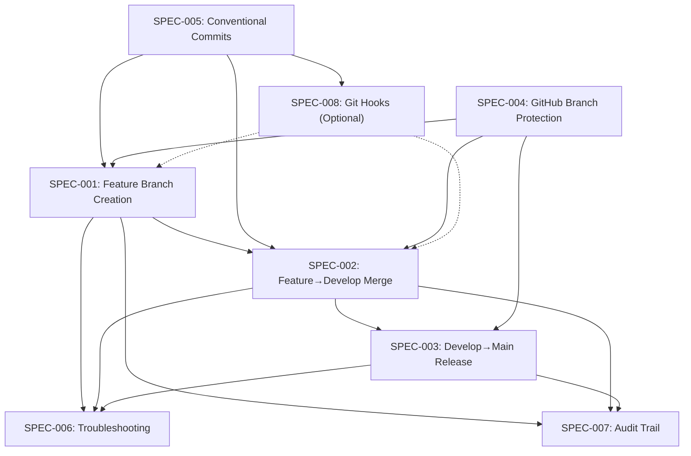

```yml
created_at: 2026-04-26 12:00:00
project: IACT-docs
work_package: 2026-04-26-02-39-17-git-workflow-documentation
phase: Phase 7 — DESIGN/SPECIFY
author: claude
status: Borrador
version: 1.0.0
```

# Git Workflow Documentation — Requirements Specification

## Resumen Ejecutivo

Esta especificación define exactamente QUÉ procedimientos, ejemplos y configuración se documentarán en Phase 10 IMPLEMENT para estandarizar el flujo de trabajo Git en IACT-docs. Traduce los objetivos del Phase 6 SCOPE (documentar feature/* → develop → main con máxima trazabilidad) en 8 especificaciones técnicas con criterios de aceptación detallados: 7 core workflows + 1 optional tooling (git hooks).

**Audiencia:** Desarrolladores (uso diario), tech leads (revisión y enforcement), release managers (deployment), nuevos miembros (onboarding).

**Objetivo:** Producir documentación *completa y correcta* que permita a cualquier developer completar su primer PR sin preguntar, siguiendo exactamente los pasos documentados.

---

## Mapeo Alcance (Phase 6) → Especificaciones (Phase 7)

| Componente Phase 6 | SPEC ID | Descripción |
|---|---|---|
| Core Feature 1.1: Feature Branch Workflow | SPEC-001 | Crear feature branches con patrón feature/*, hacer commits, push con tracking |
| Core Feature 1.2: Integration to develop | SPEC-002 | Merge feature→develop con conflictos, CI/CD validation, merge commit format |
| Core Feature 1.3: Release to main | SPEC-003 | Merge develop→main (manual gate), crear tags, release notes, rollback |
| Core Feature 1.4: GitHub Branch Protection | SPEC-004 | Configurar reglas de protección (require PR, status checks, reviews) en UI |
| Core Feature 1.5: Conventional Commits | SPEC-005 | Formato obligatorio (feat/fix/docs), scope, body multi-línea, referencias a issues |
| Supporting 2.1: Troubleshooting Guide | SPEC-006 | 10+ escenarios de error, recovery procedures, debugging |
| Supporting 2.2 & 2.3: Audit & CI/CD | SPEC-007 | Traceabilidad (commit→release), CI/CD gates, compliance documentation |
| **NEW:** Optional Tooling | SPEC-008 | Git hooks para enforcement automático (pre-commit, pre-push) |

---

## SPEC-001: Feature Branch Workflow — Crear Rama, Hacer Commits, Push

**ID:** SPEC-001  
**Requisitos Origen:** Core Feature 1.1  
**Prioridad:** Critical  
**Estado:** Pending Approval  

### Descripción

Especificar el flujo EXACTO para crear una rama de feature, hacer commits siguiendo convenciones, y pushear a remote con tracking automático. El desarrollador debe poder seguir 5 pasos simples sin ambigüedad.

### Criterios de Aceptación (Given/When/Then)

**AC-001: Crear feature branch desde develop**
```
Given:  Developer está en rama develop
        Working directory está clean (git status limpio)
        Quiere implementar "Add PlantUML guide"

When:   Ejecuta: git checkout -b feature/plantuml-guide develop

Then:   Local branch 'feature/plantuml-guide' existe (git branch)
        Rama activa es feature/plantuml-guide (git branch --show-current)
        Base es develop (git merge-base feature/plantuml-guide develop)
        No hay cambios unstaged (git status: clean working tree)
```

**AC-002: Hacer commits con formato conventional**
```
Given:  Developer está en feature/plantuml-guide
        Ha modificado 1 archivo (docs/plantuml.md)
        Cambios están staged (git add)

When:   Ejecuta: git commit -m "docs(plantuml-guide): add quick reference section"

Then:   Commit existe (git log -1 muestra el commit)
        Mensaje sigue formato type(scope): description
        Scope es 'plantuml-guide' (sin paréntesis adicionales)
        Descripción es imperativa (add, no adds/added)
        Hash es diferente al anterior (nuevo commit)
```

**AC-003: Hacer segundo commit con cuerpo multi-línea**
```
Given:  Developer está en feature/plantuml-guide
        Tiene cambios adicionales (agrega ejemplo largo)
        Cambios están staged

When:   Ejecuta editor (git commit sin -m):
        Línea 1: docs(plantuml-guide): add complex diagram example
        [línea en blanco]
        Línea 3: Added UML sequence diagram demonstrating
                 class relationships in IACT architecture.
                 
        Documento RFC-456 para referencia.
                 
        Closes #123

Then:   Commit contiene:
        - Subject: "docs(plantuml-guide): add complex diagram example"
        - Body: párrafos explicativos + referencia RFC + Closes #123
        - (git log -1 --format=fuller muestra todo)
```

**AC-004: Push a remote con -u (tracking)**
```
Given:  Developer tiene 2 commits en feature/plantuml-guide
        Remote origin existe (git remote -v)
        Feature branch NO existe aún en origin

When:   Ejecuta: git push -u origin feature/plantuml-guide

Then:   Branch existe en origin (git branch -r | grep feature/plantuml-guide)
        Local branch trackea origin/feature/plantuml-guide
        (git branch -vv muestra: feature/plantuml-guide ... [origin/feature/plantuml-guide])
        Push completó sin errores (exit code 0)
```

**AC-005: Verificación final — branch está ready para PR**
```
Given:  Feature branch ha sido pusheada a origin
        Local commits matchean remote commits

When:   Developer ejecuta:
        git status              (debe decir "nothing to commit")
        git log feature/plantuml-guide -5 --oneline
        git log origin/feature/plantuml-guide -5 --oneline

Then:   Ambos logs son idénticos (mismos commits, mismo order)
        Status indica "Your branch is up to date with origin/..."
        Developer can proceed to create PR
```

### Consideraciones Técnicas

- Nombre de rama DEBE seguir patrón `feature/*` (enforce en GitHub Actions)
- Patrón es `feature/{descripción-en-kebab-case}` (no spaces, no underscores)
- Crear DESDE develop, no desde main
- Commits DEBEN seguir convenciones (type(scope): description)
- Push DEBE usar `-u origin {rama}` para establecer tracking
- Force push es PROHIBIDO para feature branches (accidental changes)

### Implementación

**Documentación Requerida:**
- Step 1: `git checkout -b` — comando exacto, output esperado
- Step 2: Primer commit (simple, sin body) — qué escribir, cómo se ve
- Step 3: Segundo commit (con body) — editor, formato multi-línea, qué incluir
- Step 4: Push — comando con -u, qué sucede
- Step 5: Verificación — qué comandos ejecutar para confirmar

**Ejemplos Concretos:** 3 escenarios reales
1. Pequeña fix de typo (1 commit simple)
2. Documentación mediana (2 commits con body)
3. Cambio de arquitectura (3+ commits, referencias a RFC/issues)

**Artefactos:** `docs/git-workflow.md` sección "1.1 Feature Branch Workflow"

### Validación

- [ ] Documentación es tan simple que un nuevo dev puede copiar/pegar comandos
- [ ] Todos los comandos ejecutados producen output esperado
- [ ] No hay pasos implícitos (ej: "asume que sabes cómo editar commits")
- [ ] Las 5 ACs cubren el flujo completo sin gaps
- [ ] Ejemplos muestran casos reales (no hipotéticos)

---

## SPEC-002: Feature→Develop Merge — PR, Review, Merge sin Squash

**ID:** SPEC-002  
**Requisitos Origen:** Core Feature 1.2  
**Prioridad:** Critical  
**Estado:** Pending Approval  

### Descripción

Especificar cómo mergear feature→develop con máxima trazabilidad (merge commits --no-ff), incluyendo: creación de PR, respuesta a comentarios de review, manejo de conflictos, validación de CI/CD, merge commit message.

### Criterios de Aceptación

**AC-001: Crear Pull Request en GitHub UI**
```
Given:  feature/plantuml-guide está pusheada a origin
        Aún no existe PR para esta rama

When:   Developer abre https://github.com/jcg-admin/IACT-docs
        Ve notificación "Compare & pull request" para feature/plantuml-guide
        Clickea botón

Then:   PR form abre con:
        - Base: develop (correcto)
        - Compare: feature/plantuml-guide (correcto)
        - Título auto-completado desde primer commit (editable)
        - Body vacío o con template (del repo)
```

**AC-002: Llenar PR description con resumen**
```
Given:  PR form está abierto
        Developer ha visto los cambios diff en la UI

When:   Developer escribe:
        Título: "docs: add PlantUML quick reference guide"
        Body:
        - Qué cambió: "Added new guide section with 5 quick diagrams"
        - Por qué: "RFC-456 requests quick-start for new contributors"
        - Testing: "Sphinx build passes (make clean && make html)"

Then:   PR tiene descripción clara que un reviewer puede entender sin leer diff
```

**AC-003: CI checks ejecutan automáticamente**
```
Given:  PR acaba de ser creado
        GitHub Actions está configurado en repo

When:   GitHub detects push a rama PR
        Ejecuta workflows (build, linting, tests)

Then:   Status checks aparecen en PR:
        - "build" check: passing / failing
        - Otros checks según configuración
        Developer puede ver resultados en PR
```

**AC-004: Reviewer comenta en línea (merge conflict simulation)**
```
Given:  PR está abierto con cambios
        Review solicita cambios ("Changes requested")
        Developer ha leído el comentario

When:   Developer hace cambios locales
        git add, git commit -m "docs: address review comment #1"
        git push (push a la misma rama)

Then:   Nuevo commit aparece en PR automáticamente
        Reviewer ve el commit nuevo
        Review comment está ahora "resolved" o "outdated"
```

**AC-005: Mergear sin squash (--no-ff)**
```
Given:  PR tiene:
        - Todos los checks passing
        - Approvals requeridos recibidos
        - Base branch (develop) está up to date

When:   Reviewer clickea "Merge pull request"
        Selecciona "Create a merge commit" (--no-ff)
        Escribe merge commit message:
        "Merge pull request #456 from feature/plantuml-guide
        
        Added PlantUML quick reference guide with 5 diagrams.
        Closes #123. Implements RFC-456.
        
        Co-authored-by: NestorMonroy <...>"

Then:   Merge commit se crea en develop
        Historia preserva TODOS los commits from feature/*
        Commit hash de merge es DIFERENTE a squash
        PR está marked as merged + closed
```

**AC-006: Rama feature se elimina automáticamente**
```
Given:  PR acaba de mergearse
        Option "Delete branch" fue checked antes de merge

When:   GitHub UI finaliza el merge

Then:   feature/plantuml-guide no existe en origin (remote deleted)
        Local branch permanece (developer debe git fetch -p para limpiar)
```

**AC-007: Merge commit aparece en develop**
```
Given:  PR fue mergeada hace 1 minuto
        Developer local está en develop (outdated)

When:   Developer ejecuta:
        git fetch origin
        git log origin/develop -5 --oneline --graph

Then:   Merge commit aparece (con formato "*   commit-hash Merge pull request...")
        Todos los commits de feature/* son VISIBLES en el log
        (No fue squashed — la historia está intacta)
```

### Consideraciones Técnicas

- **Merge strategy DEBE ser `--no-ff`** (no fast-forward) para máxima trazabilidad
- GitHub Actions DEBE ejecutarse antes de merge (status checks)
- Merge commit DEBE referenciar PR número y cerrar issues si aplica
- Rama feature DEBE ser deleteable automáticamente después de merge
- Conflictos DEBEN resolverse ANTES del merge (no en GitHub UI)

### Implementación

**Documentación Requerida:**
1. Cómo crear PR manualmente vs desde notificación
2. Qué poner en PR description (resumen ejecutivo)
3. Cómo responder a comentarios de review
4. Cómo resolver merge conflicts localmente (si develop cambió)
5. Cómo mergear en GitHub UI (seleccionar "Create a merge commit")
6. Merge commit message format (qué incluir)

**Ejemplos Concretos:** 3 escenarios
1. PR simple (no conflictos, approved inmediatamente)
2. PR con review comments (necesita cambios, push nuevo)
3. PR con conflictos (develop se adelantó, resolver localmente)

**Artefactos:** `docs/git-workflow.md` sección "1.2 Feature→Develop Merge"

### Validación

- [ ] PR creation es tan simple que UI guidance es suficiente
- [ ] Merge strategy es explícitamente --no-ff (no squash)
- [ ] Merge commit message incluye PR#, issue closure, co-authors
- [ ] Historia Git completa se preserva (todos los feature/* commits visibles)
- [ ] Ejemplo de conflicto está documentado (cómo resolverlo)

---

## SPEC-003: Develop→Main Release — Manual Gate, Tagging, Release Notes, Rollback

**ID:** SPEC-003  
**Requisitos Origen:** Core Feature 1.3  
**Prioridad:** Critical  
**Estado:** Pending Approval  

### Descripción

Especificar cómo hacerrelease desde develop a main: requiere PR + approval explícita (manual gate), cómo crear annotated tags versionados (v1.2.3), cómo generar release notes, y rollback procedure si algo falla.

### Criterios de Aceptación

**AC-001: Crear release branch/PR desde develop→main**
```
Given:  develop está estable
        Todos los features para v1.2.0 están mergeados
        Release manager quiere hacer release

When:   Release manager abre GitHub PR:
        Base: main
        Compare: develop
        Título: "chore(release): v1.2.0 release to production"

Then:   PR muestra TODOS los commits desde último tag en main
        Diff es "clean" (solo archivos que han cambiado)
        CI checks ejecutan
        Estado: "Pending review"
```

**AC-002: Ejecutar pre-release QA checklist**
```
Given:  PR está abierto develop→main
        Release manager está a cargo

When:   Release manager verifica:
        [ ] make clean && make html — build success
        [ ] Todos los tests pasan
        [ ] Cambios de CHANGELOG.md son correctos
        [ ] No hay FIXME/TODO comentarios críticos
        [ ] Documentación está actualizada

Then:   Release manager crea comment en PR:
        "Pre-release QA: ✅ PASS
        - Build: SUCCESS
        - Tests: 95/95 PASSED
        - Docs: Updated
        - Ready for approval"
```

**AC-003: Reviewer aprueba release (manual gate)**
```
Given:  PR develop→main está abierto
        Pre-release QA pasó
        Release manager ha solicitado approval

When:   Tech lead review y aprueba:
        Clickea "Approve" en GitHub (official review)
        Comenta: "Approved for production release v1.2.0"

Then:   PR muestra: "Approved" estado
        All checks: PASSING
        Ready to merge
```

**AC-004: Mergear develop→main (--no-ff)**
```
Given:  PR develop→main está approved
        All status checks passing

When:   Release manager clickea "Merge pull request"
        Selecciona "Create a merge commit" (--no-ff)

Then:   Merge commit se crea en main
        PR está marked as merged
        develop y main ahora divergen (tienen commit diferente del merge)
```

**AC-005: Crear annotated tag para versión**
```
Given:  Merge commit acaba de crearse en main
        Release manager está en main branch local

When:   Release manager ejecuta:
        git fetch origin
        git checkout main
        git pull origin main
        git tag -a v1.2.0 -m "Release v1.2.0 — add PlantUML guide, fix validation"
        git push origin v1.2.0

Then:   Tag v1.2.0 existe en repo (git tag -l)
        Tag contiene mensaje y metadata (git show v1.2.0)
        Tag está en origin (git ls-remote origin | grep v1.2.0)
```

**AC-006: Generar release notes**
```
Given:  Tag v1.2.0 acaba de ser creado
        Commits between v1.1.0 y v1.2.0 contienen feature/* merges

When:   Release manager lista commits:
        git log v1.1.0..v1.2.0 --oneline
        (Selecciona los merges que son features)

Then:   Release notes formateadas:
        ## v1.2.0 — 2026-04-26
        
        ### Features
        - Add PlantUML quick reference guide (#456)
        - Improve Sphinx configuration (#445)
        
        ### Fixes
        - Fix validation error in rst (#440)
        
        **Contributors:** NestorMonroy, claude
```

**AC-007: Trigger deployment (CI/CD on tag)**
```
Given:  Tag v1.2.0 ha sido pusheada a origin
        GitHub Actions tiene workflow para tags

When:   GitHub detecta push de tag v1.2.0
        Executa deployment workflow (si está configurado)

Then:   CI/CD inicia deploying v1.2.0
        (Deployment details en GitHub Actions logs)
```

**AC-008: Rollback procedure si algo falla**
```
Given:  Release v1.2.0 fue deployed
        Production está broken (critical bug)
        Release manager debe rollback

When:   Release manager ejecuta:
        git log main -5 --oneline --graph
        (Identifica merge commit de v1.2.0)
        git revert -m 1 {merge-commit-hash}
        git tag v1.2.0-rollback
        git push origin v1.2.0-rollback

Then:   Revert commit se crea en main
        main apunta a estado anterior
        Rollback está documentado como tag
```

### Consideraciones Técnicas

- **Manual gate REQUERIDA** — no automatic release, solo código
- **Merge strategy --no-ff** (no fast-forward) para trazabilidad
- **Annotated tags** (no lightweight) para preservar release metadata
- **Release notes** deben enumerar qué feature merges incluye
- **Rollback** se hace con `git revert -m 1` (revierte merge commit)
- **Deployment** se triggerea por tag (CI/CD detecta git tag push)

### Implementación

**Documentación Requerida:**
1. Qué es un release vs develop branch
2. Pre-release QA checklist exacta (items verificables)
3. Cómo crear PR develop→main
4. Cómo mergear con --no-ff
5. Cómo crear annotated tag (`git tag -a`)
6. Cómo generar release notes (qué incluir)
7. Rollback procedure (cuándo y cómo)

**Ejemplos Concretos:** 3 escenarios
1. Release normal (todos los checks pasan, deployment success)
2. Release con postponement (QA falla, esperar siguiente cycle)
3. Release con rollback (bug crítico post-deployment, revert)

**Artefactos:** `docs/git-workflow.md` sección "1.3 Develop→Main Release"

### Validación

- [ ] Release es MANUAL, no automatic
- [ ] QA checklist está completo y verificable
- [ ] Merge strategy es explícitamente --no-ff
- [ ] Tag es annotated (no lightweight)
- [ ] Release notes enumera features + fixes
- [ ] Rollback procedure está documentado

---

## SPEC-004: GitHub Branch Protection Rules — Configuración Exacta UI/API

**ID:** SPEC-004  
**Requisitos Origen:** Core Feature 1.4  
**Prioridad:** High  
**Estado:** Pending Approval  

### Descripción

Especificar EXACTAMENTE cómo configurar reglas de protección en GitHub (tanto UI como API), incluyendo: require PR, status checks, required reviews, dismiss stale reviews, auto-merge opcional.

### Criterios de Aceptación

**AC-001: Proteger rama develop — require PR**
```
Given:  GitHub repo jcg-admin/IACT-docs
        develop branch existe
        No hay rule de protección aún

When:   Admin abre Settings > Branches > Add rule
        Pattern: develop
        Configura:
        [ ] Require a pull request before merging
        [ ] Require status checks to pass
        [ ] Require branches to be up to date before merging
        [ ] Require code reviews
        [ ] Require approval from code owners
        [ ] Dismiss stale pull request approvals
        [ ] Allow auto-merge (optional)
        Clickea Save

Then:   Rule aparece en lista:
        Branch: develop
        Requirements visible:
        - Pull request required: YES
        - Status checks: YES
        - Approvals required: 1 (default)
```

**AC-002: Proteger rama main — más estricta que develop**
```
Given:  GitHub repo
        main branch existe
        Develop branch ya tiene rule

When:   Admin abre Settings > Branches > Add rule
        Pattern: main
        Configura (más estricta):
        [ ] Require a pull request before merging
        [ ] Require status checks to pass before merging
        [ ] Require branches to be up to date before merging
        [ ] Require code reviews: 2 approvers (release requires 2nd opinion)
        [ ] Require approval from code owners: YES
        [ ] Dismiss stale pull request approvals: YES
        [ ] Allow auto-merge: NO (release require manual merge)
        [ ] Restrict who can push to matching branches: YES
              (Only admins can push)
        Clickea Save

Then:   Rule aparece:
        Branch: main
        Approvals required: 2
        Push restricted: only admins
```

**AC-003: Enforce feature/* pattern — PR from feature/* only**
```
Given:  Branch protection rules están configurados
        Un developer intenta pushear a develop directamente (sin PR)

When:   Developer ejecuta:
        git push origin feature/test:develop

Then:   Push es RECHAZADO:
        error: failed to push some refs to 'origin'
        [protected branch]
        (GitHub rejects direct push)
        
        Mensaje claro: "Use a pull request to merge to develop"
```

**AC-004: Status checks required — make html build must pass**
```
Given:  Branch protection rules están activos
        PR está abierto (feature→develop)
        GitHub Actions workflow ejecuta `make clean && make html`

When:   Build falla en GitHub Actions
        Status check "build" muestra red X: FAILED

Then:   PR no puede mergearse
        GitHub UI desactiva "Merge" button
        Mensaje: "1 check failed"
        Developer debe fix el build y push nuevo commit
```

**AC-005: Require approval before merge**
```
Given:  PR está abierto
        Status checks pasan
        Branch protection require 1 approval (develop) / 2 (main)

When:   Developer intenta clickear "Merge pull request"
        Review aún no aprobado

Then:   "Merge" button está DISABLED
        GitHub muestra: "Waiting on code owners approval"
        Reviewer aprueba, botón se habilita
```

**AC-006: API configuration (alternative)**
```
Given:  Admin quiere script para automatizar rules

When:   Admin usa GitHub API:
        PUT /repos/{owner}/{repo}/branches/{branch}/protection
        Body:
        {
          "required_pull_request_reviews": {
            "dismiss_stale_reviews": true,
            "require_code_owner_reviews": true,
            "required_approving_review_count": 1
          },
          "required_status_checks": {
            "strict": true,
            "contexts": ["build", "test"]
          },
          "enforce_admins": true,
          "allow_force_pushes": false,
          "allow_deletions": false
        }

Then:   Rule es creada vía API (idéntica a UI manual)
```

### Consideraciones Técnicas

- **develop rule:** PR required, 1 approval, status checks must pass
- **main rule:** PR required, 2 approvals, status checks must pass, more restrictive
- **feature/** pattern: no direct pushes (must use PR)
- **Status checks:** referencia exacta de jobs en GitHub Actions (ej: "build", "test")
- **Code owner:** archivo `.github/CODEOWNERS` define quién aprueba
- **Force push:** PROHIBIDO para develop y main

### Implementación

**Documentación Requerida:**
1. Paso a paso en GitHub UI (Settings > Branches > Add rule)
2. Exact configuration values para develop (1 approval, checks required)
3. Exact configuration values para main (2 approvals, stricter)
4. API alternative (curl/API payload)
5. Qué sucede si intenta push directo (error message)
6. Qué sucede si status checks fallan (merge button disabled)

**Ejemplos Concretos:** 2 escenarios
1. Setup inicial (agregar rules a repo nuevo)
2. Modificar rules (cambiar from 1→2 approvals on main)

**Artefactos:** `docs/git-workflow.md` sección "1.4 GitHub Branch Protection"

### Validación

- [ ] Rules están configurados tanto en UI como en API
- [ ] develop rule: ✓PR ✓1 review ✓checks
- [ ] main rule: ✓PR ✓2 reviews ✓checks ✓admin-only push
- [ ] Screenshots muestran exact buttons/fields en GitHub UI
- [ ] API payload es válido y reproducible

---

## SPEC-005: Conventional Commits Format — Type(Scope): Description

**ID:** SPEC-005  
**Requisitos Origen:** Core Feature 1.5  
**Prioridad:** High  
**Estado:** Pending Approval  

### Descripción

Especificar EXACTAMENTE qué hace un commit válido: tipo obligatorio (feat/fix/docs/etc), scope, descripción, body multi-línea, referencias a issues. Incluir ejemplos reales y anti-ejemplos.

### Criterios de Aceptación

**AC-001: Tipo obligatorio (7 valores permitidos)**
```
Given:  Developer está haciendo commit
        
When:   Developer escribe mensaje:
        feat(plantuml-guide): add quick reference section
        fix(sphinx): resolve config validation error
        docs(readme): clarify installation steps
        refactor(constraints): simplify logic
        test(workflow): add integration tests
        perf(build): optimize image processing
        chore(dependencies): bump sphinx to 6.0

Then:   Todos estos commits son VÁLIDOS
        Tipo está al inicio: type(scope): description
```

**AC-002: Scope obligatorio (descripción acotada)**
```
Given:  Developer hace commit

When:   Escribe:
        feat(plantuml-guide): ...       ✓ VÁLIDO — scope es descriptivo
        feat(fix-issue): ...            ✓ VÁLIDO — scope describe qué
        feat(PlantUML-Guide): ...       ✗ INVÁLIDO — capital case
        feat(plantuml_guide): ...       ✗ INVÁLIDO — underscore
        feat(): ...                     ✗ INVÁLIDO — scope vacío

Then:   Scope es kebab-case, no empty, no capitals
```

**AC-003: Descripción imperativa (add/fix, not adds/added)**
```
Given:  Developer está escribiendo commit message

When:   Escribe (primera línea después de "type(scope):"):
        feat(auth): add two-factor authentication    ✓ VÁLIDO
        docs(readme): clarify setup instructions     ✓ VÁLIDO
        fix(config): resolve sphinx error            ✓ VÁLIDO
        feat(auth): adds MFA support                 ✗ INVÁLIDO (adds)
        feat(auth): added MFA                        ✗ INVÁLIDO (added)
        docs(readme): clarifies the setup            ✗ INVÁLIDO (clarifies)

Then:   Descripción usa imperativo: "add", "fix", "clarify", no "added/adds/clarifies"
```

**AC-004: Body multi-línea (explicar qué y por qué)**
```
Given:  Developer hace commit con cambios complejos
        Quiere explicar contexto

When:   Abre editor (git commit sin -m):
        Línea 1: feat(plantuml-guide): add UML diagram examples
        Línea 2: [EMPTY]
        Línea 3: Added comprehensive examples of sequence diagrams,
                 class diagrams, and state machines used in IACT
                 documentation structure.
                 
                 Implements RFC-456 for user onboarding improvement.
                 
                 Closes #123, #124

Then:   Commit contiene:
        - Subject (line 1): type(scope): description
        - Body: paragraphs explaining WHY + RFC references + issue closure
        - (git log -1 --format=fuller muestra todo)
```

**AC-005: Referencing issues con Closes/Fixes**
```
Given:  Developer resolvió GitHub issue #456

When:   Escribe en commit body:
        Closes #456
        o
        Fixes #456

Then:   Commit está linkeado a issue
        GitHub auto-closes issue cuando commit pushea
        (Issue #456 muestra: "closed by commit hash")
```

**AC-006: Merge commit format (PR title becomes message)**
```
Given:  PR desarrollada en feature/*, lista para mergear
        Título PR: "docs: add PlantUML quick reference guide"

When:   Mergear con --no-ff en GitHub:
        Merge commit message:
        Merge pull request #456 from jcg-admin/feature/plantuml-guide
        
        docs: add PlantUML quick reference guide
        
        Added quick start guide with 5 diagram examples.
        Implements RFC-456 for contributor onboarding.
        Closes #123.

Then:   Merge commit muestra:
        - Referencia a PR (#456)
        - Original commit message
        - Explicación adicional + references
```

### Consideraciones Técnicas

- **Type** es OBLIGATORIO: feat, fix, docs, refactor, test, perf, chore
- **Scope** es OBLIGATORIO: describe subsistema/componente (kebab-case)
- **Description** es OBLIGATORIO: imperativo (add, fix, not added/adds)
- **Body** es OPCIONAL pero RECOMENDADO: explica WHY no WHAT
- **Issue references** (Closes #123): triggers auto-closure en GitHub
- **First line max 72 chars** (legacy limit, but good practice)
- **Subject + body separados por blank line** (RFC 2822 style)

### Implementación

**Documentación Requerida:**
1. Los 7 tipos válidos (feat/fix/docs/refactor/test/perf/chore)
2. Scope rules (kebab-case, descriptive, not empty)
3. Description rules (imperative mood, not capitalized past tense)
4. Body format (multi-paragraph, reference RFCs/issues, Closes #NNN)
5. Merge commit format (cómo incluye references)

**Ejemplos Concretos:** 10+ reales + anti-ejemplos
- `feat(plantuml-guide): add quick reference` ✓
- `docs(readme): clarify installation steps` ✓
- `fix(sphinx): resolve config validation error` ✓
- `refactor(constraints): simplify authentication logic` ✓
- `docs(readme): update setup instructions` ✗ (capitalize first letter)
- `feat(auth): adds two-factor auth` ✗ (adds instead of add)

**Artefactos:** `docs/git-workflow.md` sección "1.5 Conventional Commits"

### Validación

- [ ] 7 tipos están documentados con cuándo usar cada uno
- [ ] Scope examples (válidos e inválidos) incluidos
- [ ] Descripción es claramente imperativa
- [ ] Body format está especificado
- [ ] Issue references (Closes #NNN) están documentados
- [ ] Merge commit format incluye PR reference

---

## SPEC-006: Troubleshooting Guide — 10+ Escenarios de Error y Recovery

**ID:** SPEC-006  
**Requisitos Origen:** Supporting Feature 2.1  
**Prioridad:** High  
**Estado:** Pending Approval  

### Descripción

Especificar 10+ escenarios comunes de error (merge conflicts, wrong branch, force-push accidents, etc) con recovery procedure exacta para cada uno. Developer debe poder copy/paste la solución sin understanding de Git internals.

### Criterios de Aceptación (10 Escenarios Mínimo)

**Escenario 1: "Created feature branch from wrong base (main instead of develop)"**
```
Problema: Developer ejecutó `git checkout -b feature/test main` (error)

Síntomas:
- Branch está basada en main, no develop
- Merge a develop tendrá todos los commits de main + feature commits

Recovery:
1. git log feature/test..develop        ← lista commits en develop no en feature
2. git rebase develop feature/test      ← rebasa feature sobre develop
   (o merge, dependiendo de preference)
3. git push --force-with-lease origin feature/test
   (force push es seguro aquí: rama es local)
4. Verificar: git log feature/test -3 --oneline

Lesson: Siempre crear branches DESDE develop
```

**Escenario 2: "Modified files but forgot to stage before commit"**
```
Problema: Developer hizo cambios, ejecutó `git commit` pero olvidó `git add`

Síntomas:
- git status muestra "Changes not staged for commit"
- git log última vez no tiene los cambios

Recovery:
1. git add .                            ← stage todos los cambios
2. git commit --amend                   ← amend el último commit
3. git push --force-with-lease origin feature/test

Alternativa (si ya pusheaste):
1. git add .
2. git commit -m "feat(scope): complete fix from previous commit"
3. git push origin feature/test
   (Crea nuevo commit en lugar de amend)

Lesson: `git status` antes de `git push`
```

**Escenario 3: "Merge conflict during feature→develop merge"**
```
Problema: Otra rama modificó el mismo archivo, merge genera conflicto

Síntomas:
- git status muestra "both modified" conflictos
- Archivos tienen <<<<<<<, =======, >>>>>>> markers

Recovery (local, antes de PR):
1. git status                           ← ver qué archivos están en conflicto
2. Abre los archivos conflictivos en editor
3. Resuelve manualmente (elimina markers, choose version)
4. git add <archivo>                    ← marca como resuelto
5. git commit -m "fix: resolve merge conflict in docs/file.md"
6. git push origin feature/test

Recovery (en GitHub PR):
1. GitHub mostrará: "Can't auto-merge this branch"
2. Developer resuelve LOCALMENTE (pasos 1-5 arriba)
3. git push origin feature/test         ← PR se auto-actualiza
4. GitHub ahora puede mergear

Lesson: Resuelve conflictos localmente ANTES de PR, no en UI
```

**Escenario 4: "Pushed to feature/* but PR still shows old commits"**
```
Problema: Developer pusheó nuevo commit pero GitHub PR no se actualiza

Síntomas:
- git log feature/test muestra nuevo commit
- GitHub PR aún muestra commit anterior

Recovery:
1. git fetch origin                     ← actualiza remote tracking
2. Espera 30 segundos (GitHub índexing)
3. Recarga GitHub PR página (Ctrl+R)
4. Nuevo commit debe aparecer

Causa raíz:
- Network delay: git push exitoso pero GitHub UI aún indexando
- Browser cache: antigua carga en caché

Lesson: Commit aparece automáticamente (no necesita action adicional)
```

**Escenario 5: "Accidentally pushed to main directly (should have been PR)"**
```
Problema: Developer ejecutó `git push origin feature/develop` (typo) y mergeó con main

Síntomas:
- main branch tiene cambios que no fueron reviewados
- main ya no está 1 commit atrás de develop

Recovery:
1. git log main -1 --oneline            ← identifica el commit accidental
2. git revert {commit-hash}             ← crea revert commit
3. git push origin main                 ← push revert
4. main está ahora antes del cambio
5. Reportar al team para audit

Prevención:
- main tiene branch protection: reject direct push
- Solo es posible si admin bypassed rules (urgencia)

Lesson: Confía en branch protection, no intentes pushear directo a main
```

**Escenario 6: "Made 3 commits pero necesito cambiar el mensaje del primer commit"**
```
Problema: Primer commit tiene typo: "docs(plamtuml): ..." (falta la 'n')

Síntomas:
- git log -3 muestra commit con typo
- PR usa el commit message incorrecto

Recovery (no pusheado aún):
1. git rebase -i HEAD~3                 ← interactive rebase últimos 3 commits
2. Marca "reword" en el primer commit
3. Editor abre, arregla el mensaje
4. Continúa rebase: git rebase --continue
5. git push origin feature/test (after verificar)

Recovery (ya pusheado):
1. Mismo process que arriba (rebase -i)
2. git push --force-with-lease origin feature/test
   (seguro porque es rama local)

Lesson: Ammend solo el último commit normalmente; para commits anteriores usa rebase -i
```

**Escenario 7: "Deleted feature branch localmente pero existe en origin"**
```
Problema: Developer ejecutó `git branch -d feature/old` pero quiere volver

Síntomas:
- git branch NO muestra feature/old
- git branch -r MUESTRA origin/feature/old

Recovery:
1. git checkout -b feature/old origin/feature/old
   (Recrea local branch tracking origin)
2. Alternativamente: git fetch origin feature/old:feature/old

Limpieza automática:
- git fetch --prune                     ← elimina ramas remotas deletadas
- git branch -r | grep gone             ← lista ramas deletadas en origin

Lesson: Branch deletion es local; remoto permanece hasta `git push origin :branch`
```

**Escenario 8: "Accidentally did git reset --hard, lost uncommitted changes"**
```
Problema: Developer ejecutó `git reset --hard origin/develop` y perdió cambios locales

Síntomas:
- git diff muestra nada
- Archivos modificados desaparecieron
- git reflog muestra reset

Recovery:
1. git reflog                           ← lista todas las acciones recientes
2. Identifica el commit anterior al reset (ej: HEAD@{2})
3. git reset --hard HEAD@{2}            ← recupera estado anterior
4. Verificar: git diff, git status

Prevención:
- Siempre `git stash` antes de reset si hay cambios uncommitted
- Usa `git reset --soft` si necesitas mover commits (no pierde contenido)

Lesson: reset --hard es destructivo; always commit or stash first
```

**Escenario 9: "Created too many commits, want to squash into one before PR"**
```
Problema: 5 commits de exploración, want 1 clean commit para PR

Síntomas:
- git log feature/test -5 muestra 5 commits pequeños

Recovery:
1. git rebase -i HEAD~5                 ← interactive rebase últimos 5
2. Marca "squash" (s) en los 4 últimos commits, primero como "pick"
3. Editor abre, escribe el commit final message (combined)
4. git rebase --continue
5. git push --force-with-lease origin feature/test

Alternative (no squash, solo clean up):
- Leave los 5 commits, asegúrate cada uno tiene mensaje claro
- Merge con develop (preserva historia)

Lesson: Squash solo si commits no tienen valor histórico; merge-commit es preferible
```

**Escenario 10: "Merge PR but then realized contains wrong commits"**
```
Problema: Feature PR fue mergeada pero contenía un commit que no debería

Síntomas:
- PR ya está merged en develop
- develop tiene un commit que rompe algo

Recovery:
1. Identifica el merge commit: git log develop -5 --oneline --graph
2. git revert -m 1 {merge-commit-hash}
3. git push origin develop
4. develop está ahora reverted
5. Abre nuevo PR develop→develop, quitando el commit malo
6. Mergea la versión correcta

Lesson: Revisar cuidadosamente qué está en cada PR antes de merge
         Branch protection + mandatory reviews ayuda a prevenir
```

### Consideraciones Técnicas

- Cada escenario DEBE tener: síntomas claramente describibles, pasos numéricos copy/pasteable, resultado esperado
- Recovery commands deben ser exactos (no pseudocódigo)
- Incluir "Prevención" cuando sea relevante
- Incluir "Lesson learned" para ayudar a long-term learning
- Escenarios deben cubrir: conflicts, wrong base, force push, reset, rebase, merge errors

### Implementación

**Documentación Requerida:**
- 10+ escenarios reales con títulos descriptivos
- Síntomas observables (qué ve el developer)
- Cause raíz breve
- Recovery procedure paso-a-paso
- Expected result (cómo verificar que funciona)
- Prevention tips (cómo evitar en futuro)

**Ejemplos Concretos:** Real scenarios from team (if available)

**Artefactos:** `docs/git-workflow.md` sección "2.1 Troubleshooting Guide"

### Validación

- [ ] 10+ scenarios cubiertos
- [ ] Cada uno tiene recovery commands exactos
- [ ] Síntomas son claramente observables (no técnicos)
- [ ] Resultados esperados están especificados
- [ ] Prevention tips ayudan a evitar recurrencia

---

## SPEC-007: Audit Trail & Compliance — Traceability y CI/CD Integration

**ID:** SPEC-007  
**Requisitos Origen:** Supporting Features 2.2 & 2.3  
**Prioridad:** High  
**Estado:** Pending Approval  

### Descripción

Especificar cómo verificar la trazabilidad desde commit → PR → merge → release, cómo leer CI/CD logs, y cómo documentar todo para compliance/audit. Esto es crítico para IACT como documentation de compliance.

### Criterios de Aceptación

**AC-001: Trace feature commit → production tag**
```
Given:  Production está ejecutando v1.2.0
        Developer quiere saber: "qué feature está en producción?"

When:   Ejecuta:
        git log v1.2.0 --oneline | head -10

Then:   Puede ver:
        - Todos los commits en el tag
        - Merge commit references (#PR numbers)
        - Feature branch names en merge message
        Ejemplo:
        * a1b2c3d (tag: v1.2.0) Merge pull request #456
        * d4e5f6g docs: add PlantUML guide
        * h7i8j9k refactor: simplify config
```

**AC-002: Reverse trace: from issue → feature → PR → commit → tag**
```
Given:  GitHub issue #123 fue creado
        Developer quiere saber: "en qué version se resolvió esto?"

When:   Ejecuta:
        git log --all --oneline --grep="#123"

Then:   Puede ver:
        - Commit(s) que menciona "Closes #123"
        - Merge commit que lo contiene
        - Tag donde está (git tag --contains {commit})
        
        Ejemplo output:
        a1b2c3d docs: add PlantUML guide (Closes #123)
        [follow the merge chain to find v1.2.0]
```

**AC-003: Understand CI/CD checks que ejecutan en PR**
```
Given:  PR está abierto
        Developer quiere saber qué verifica GitHub Actions

When:   Abre GitHub PR
        Ve section "Checks" con:
        - build:       ✓ PASSING
        - test:        ✓ PASSING
        - lint:        ✓ PASSING

Then:   Puede clickear cada check para ver:
        - Workflow file (.github/workflows/*.yml)
        - Job logs detallados
        - Exactamente qué comandos ejecutaron (make html, pytest, etc)
```

**AC-004: Reading CI/CD failure and how to fix**
```
Given:  PR abierto
        Uno de los checks es FAILING (rojo)

When:   Clickea en check fallido
        Ve GitHub Actions log detallado

Then:   Puede ver:
        - Exact command que falló (ej: make html)
        - Error output (qué está roto)
        - Stack trace o mensajes de error
        
        Developer puede ahora:
        1. Reproducir localmente (git checkout feature/...)
        2. Ejecutar el mismo comando (make html)
        3. Debuggear + fix
        4. git push nuevo commit
```

**AC-005: Compliance documentation — what's auditable**
```
Given:  Auditor requiere: "Muestradme qué features fueron en v1.0.0"

When:   Manager ejecuta:
        git log v0.9.0..v1.0.0 --format="%h %s (%an) %ad"
        (Exporta a CSV)

Then:   Genera report:
        Commit | Feature | Author | Date | PR#
        a1b2c3 | docs:... | Claude | 2026-04-26 | #456
        ...

        Este es el audit trail:
        - Qué fue merged
        - Quién lo hizo
        - Cuándo
        - PR para revisión
```

**AC-006: Pre-release checklist documentado**
```
Given:  Release manager está a punto de hacer v1.2.0

When:   Verifica:
        [ ] All features merged to develop
        [ ] All CI checks passing
        [ ] Build succeeds: make clean && make html
        [ ] Tests pass: pytest
        [ ] CHANGELOG.md updated
        [ ] Pre-release QA signed off
        [ ] No FIXME/TODO critical comments
        [ ] Documentation updated

Then:   Puede proceder con merge develop→main y tagging
```

### Consideraciones Técnicas

- **Git history is audit trail** — cómo leer qué fue donde
- **CI/CD logs are verification** — qué checks ejecutaron
- **Tags are release markers** — cómo identificar versiones en producción
- **PR references are traceability** — línka commits a reviews
- **Compliance = verifiable chain** — commit → PR # → merge → tag → production

### Implementación

**Documentación Requerida:**
1. Cómo listar qué hay en un tag/version
2. Cómo trazar backwards (issue #123 → qué version lo tiene)
3. Cómo leer GitHub Actions logs
4. Cómo debuggear CI failures localmente
5. Cómo generar audit report (commits in release)
6. Pre-release QA checklist exacta

**Ejemplos Concretos:** 3 escenarios
1. "What features are in v1.2.0?" → git log command
2. "Was issue #456 fixed in production?" → git tag --contains
3. "Why did the build fail?" → GitHub Actions logs interpretation

**Artefactos:** `docs/git-workflow.md` sección "2.2 & 2.3 Audit Trail & CI/CD"

### Validación

- [ ] Git commands para traceability están documentados
- [ ] Cómo leer CI/CD logs está claro
- [ ] Audit trail concept está explicado
- [ ] Pre-release checklist es verificable

---

## SPEC-008: Git Hooks — Enforcement Automático Local (pre-commit, pre-push)

**ID:** SPEC-008  
**Requisitos Origen:** Optional Tooling (sugerido por user)  
**Prioridad:** Medium (complementario a branch protection)  
**Estado:** Pending Approval  

### Descripción

Especificar cómo setup y usar git hooks para automatizar enforcement local: validar commit message format antes de commitear (pre-commit hook), prevenir pushes accidentales a main/develop (pre-push hook). Hooks son **complementarios** a GitHub branch protection, no reemplazo.

### Criterios de Aceptación

**AC-001: Install pre-commit hook para validar conventional commit format**
```
Given:  Developer clonou el repo
        Quiere validar automáticamente qué escriba en commit messages

When:   Ejecuta script de setup:
        bash .git/hooks/setup-hooks.sh
        (o: git config core.hooksPath .githooks)

Then:   Hook `.git/hooks/commit-msg` está instalado
        Hook valida: type(scope): description format
        Próximo `git commit -m "feat(auth): add MFA"` pasa
        Próximo `git commit -m "adds MFA"` (sin type) es RECHAZADO
        Error message: "Commit message must follow: type(scope): description"
```

**AC-002: Pre-commit hook previene commit de archivos inválidos**
```
Given:  Developer fue a commitear cambios
        Cambios incluyen archivo no-permitido (.env, credentials.json)

When:   Ejecuta: git commit -m "feat(...): ..."

Then:   Hook `.git/hooks/pre-commit` executa
        Detecta .env / credentials / secrets
        RECHAZA el commit
        Error: "Prevented commit containing secrets. Add to .gitignore"
```

**AC-003: Pre-push hook previene push a main/develop directo**
```
Given:  Developer está en feature/test
        Ha commitado localmente
        Accidentalmente intenta: git push origin main

When:   Ejecuta: git push origin main

Then:   Hook `.git/hooks/pre-push` intercepta
        Verifica: rama destino es main o develop?
        SI: RECHAZA con message:
            "Cannot push directly to main/develop branches.
             Create a pull request instead."
        Developer MUST usar PR flow

**AC-004: Hook output es claro y actionable**
```
Given:  Commit message viola formato

When:   Developer intenta git commit

Then:   Hook output:
        ✗ FAILED: Commit message format invalid
        
        Expected: type(scope): description
        Examples:
          ✓ feat(auth): add two-factor authentication
          ✓ fix(docs): correct typo in setup guide
          ✓ docs(readme): clarify installation steps
        
        Your message: "adds MFA"
        
        Action: Edit and retry

        [Developer entiende exactamente qué arreglar]
```

**AC-005: Hooks pueden ser bypasseados (si es necesario)**
```
Given:  Developer necesita commitear temporalmente (emergencia)
        Sabe qué hace

When:   Ejecuta: git commit --no-verify -m "..."
        (--no-verify bypassa hooks)

Then:   Commit se crea SIN validación
        Log queda como evidencia:
        - Commit bypassed normal validation
        - Reviewed en siguiente PR
```

### Consideraciones Técnicas

- **Hooks son LOCAL enforcement** — no pueden ser enforced remotely (solo branch protection)
- **Hooks no reemplazan GitHub rules** — son complementarios (developer convenience + early feedback)
- **Bypass con --no-verify** — debe ser documentado (cuándo PERMITIDO, cuándo NO)
- **Setup DEBE ser opcional** — desarrollador puede optar no instalar
- **Hooks deben ser portables** — work en Linux, macOS, Windows

### Implementación

**Documentación Requerida:**
1. Setup instructions: cómo instalar hooks (script + manual)
2. Pre-commit hook: validar conventional commit format
3. Pre-push hook: prevenir push a main/develop
4. Bypass procedure (--no-verify)
5. Testing hooks localmente
6. Troubleshooting (hook no ejecuta, cómo debuggear)

**Archivos a Crear:**
- `.githooks/commit-msg` — validar formato conventional
- `.githooks/pre-push` — prevenir main/develop push
- `.githooks/setup-hooks.sh` — script de instalación

**Ejemplos Concretos:** 3 escenarios
1. Developer hace commit bien formado → pasa
2. Developer hace commit mal formado → rechazado
3. Developer intenta push a main → rechazado

**Artefactos:** 
- `docs/git-workflow.md` sección opcional "2.4 Git Hooks (Optional)"
- `.githooks/` directorio en repo con scripts

### Validación

- [ ] Pre-commit hook valida conventional format
- [ ] Pre-push hook previene main/develop push
- [ ] Error messages son claros y actionable
- [ ] Setup es simple (1 comando)
- [ ] Bypass procedure documentado (--no-verify)
- [ ] Hooks trabajan en Linux/macOS/Windows

---

## Dependencias Entre Especificaciones



**Orden de ejecución Phase 10:**
1. Implement SPEC-005 (Conventional Commits) — prerequisite for all
2. Implement SPEC-001 (Feature branch) — foundation
3. Implement SPEC-004 (Branch protection) — enabler para SPEC-002
4. Implement SPEC-002 (Feature→develop merge) — depends on 001
5. Implement SPEC-003 (Develop→main release) — depends on 002
6. Implement SPEC-006 (Troubleshooting) — cross-cutting
7. Implement SPEC-007 (Audit trail) — cross-cutting
8. Implement SPEC-008 (Git Hooks) — optional, parallelizable (depends on SPEC-005, can be added anytime)

---

## Cronograma Phase 10 IMPLEMENT

**Effort estimate:** 4.5 horas (core) + 1 hora (SPEC-008 optional)

### Core Specifications (4 horas, todos requeridos)
- SPEC-001: 30 min (5 steps, 3 examples)
- SPEC-002: 45 min (7 ACs, 3 examples, conflictos)
- SPEC-003: 45 min (8 ACs, rollback)
- SPEC-004: 30 min (screenshots, API)
- SPEC-005: 30 min (7 types, examples, anti-examples)
- SPEC-006: 60 min (10+ troubleshooting scenarios)
- SPEC-007: 30 min (traceability, CI/CD, audit)
- Testing & final review: 60 min

### Optional Specification (1 hora, parallelizable)
- SPEC-008: 45 min (hook scripts, setup docs)
- Integration & testing: 15 min

**Deliverable (Core):** Single `docs/git-workflow.md` file with 7 sections, 15+ command examples, 10+ troubleshooting scenarios, GitHub screenshots.

**Deliverable (Optional):** `.githooks/` directory with pre-commit + pre-push hook scripts, plus optional documentation section in `docs/git-workflow.md` (sección 2.4).

---

## Riesgos y Mitigaciones

| Riesgo | Impacto | Probabilidad | Mitigación |
|--------|---------|-------------|-----------|
| Ejemplos de comandos quedan obsoletos (git update changes syntax) | MEDIUM | LOW | Verify all commands against current git version (2.40+) |
| Screenshots muestran UI antigua (GitHub actualiza settings) | MEDIUM | MEDIUM | Take screenshots 1 week antes de release, verify con usuario |
| Procedimiento es demasiado complejo para nuevos devs | HIGH | MEDIUM | Usar language simple, máximo 5 pasos por procedure, siempre copy/pasteable |
| Troubleshooting no cubre el caso real que alguien necesita | MEDIUM | HIGH | Recopilar feedback de team durante Phase 11 EVALUATE |
| Merge strategy conflicta con team preference | HIGH | LOW | Phase 5 STRATEGY ya decidió: merge commits everywhere (máxima trazabilidad) |

---

## Glosario

- **Feature branch:** rama local basada en develop, patrón `feature/*`
- **Merge commit:** preserva history (--no-ff), no squash
- **Squash merge:** combina commits en uno (NOT usado en este WP)
- **Branch protection:** GitHub rules que requieren PR, reviews, checks
- **Conventional commit:** formato `type(scope): description` (feat/fix/docs/etc)
- **Annotated tag:** release marker con metadata (v1.2.0)
- **CI/CD check:** GitHub Actions validation que corre en PR (build, test, lint)
- **Audit trail:** historial verificable de qué fue donde y cuándo
- **Trazabilidad:** capacidad de rastrear un feature desde issue → commit → tag → producción

---

## Aprobaciones

| Rol | Nombre | Confirmación | Fecha |
|-----|--------|-------------|-------|
| Product/Project | (Usuario final) | [Pending] | 2026-04-26 |
| Tech Lead | (Equipo) | [Pending] | 2026-04-26 |

---

**Versión:** 1.0.0  
**Creado:** 2026-04-26 12:00:00  
**Próxima revisión:** Después de aprobación, Phase 10 IMPLEMENT
