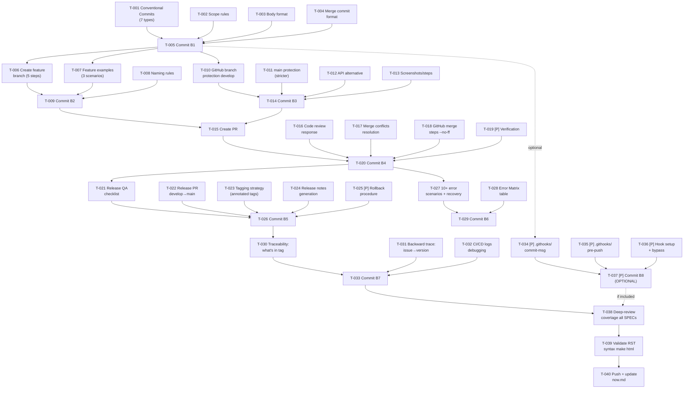

```yml
created_at: 2026-04-26 13:30:00
project: IACT-docs
work_package: 2026-04-26-02-39-17-git-workflow-documentation
phase: Phase 8 — PLAN EXECUTION
author: claude
status: Borrador
```

# Task Plan — Git Workflow Documentation Implementation

> **Generado desde:** `design/git-workflow-documentation-requirements-spec.md`  
> **Alcance:** Implementar 8 especificaciones (7 core + 1 optional) en documentación unificada + hooks complementarios  
> **Ruta crítica:** T-001 → T-002 → T-003 → T-004 → T-005 → T-006 → T-007 → T-008 → T-009 → T-010 (core complete) → [T-019, T-020 parallelizable]  
> **Estimado:** 4.5 horas (core) + 1 hora (optional)

---

## Convención de tarea

**Formato:** T-NNN Descripción accionable (SPEC-N)

Cada tarea:
- Es **atómica** (1 sección de archivo, 1 commit)
- Tiene **referencia explícita** a su SPEC
- Está **verificada** para independencia: puede commitearse sola y marcarse completada

Marca parallelizable: `[P]` — puede ejecutarse en paralelo con otras tareas del mismo grupo

---

## B1 — Implementación SPEC-005: Conventional Commits Format

> *(Prerequisito para todas las otras tareas — define el formato que usarán SPECs 001-003)*

- [x] **T-001** Escribir sección "Conventional Commits Format" con 7 tipos válidos (feat/fix/docs/refactor/test/perf/chore) y ejemplos (SPEC-005)
- [x] **T-002** Agregar tabla: Scope rules (kebab-case, required, no capitals) con ejemplos válidos e inválidos (SPEC-005)
- [x] **T-003** Documentar body format: multi-párrafo, issue references (Closes #NNN), RFC citations (SPEC-005)
- [x] **T-004** Escribir sección "Merge Commit Format": cómo incluir PR references y descriptions (SPEC-005)
- [x] **T-005** Commit [B1]: `docs(git-workflow): add conventional commits specification and examples`

---

## B2 — Implementación SPEC-001: Feature Branch Workflow

> *(Depends on T-004: necesita ejemplos de merge commit format)*

- [x] **T-006** Escribir "Create Feature Branch": 5 paso-a-paso (checkout -b, commits, push -u) con comando exacto (SPEC-001)
- [x] **T-007** Agregar "Feature Branch Examples": 3 escenarios reales (typo fix, medium feature, architecture refactor) (SPEC-001)
- [x] **T-008** Documentar naming: feature/* pattern, kebab-case, from develop not main (SPEC-001)
- [x] **T-009** Commit [B2]: `docs(git-workflow): add feature branch creation workflow and examples`

---

## B3 — Implementación SPEC-004: GitHub Branch Protection

> *(Prereq for SPEC-002/003 to work — la protección debe estar en lugar antes de mergear)*

- [x] **T-010** Escribir sección "GitHub Branch Protection Setup": pasos exactos UI (Settings > Branches > Add rule) para rama 'develop' (SPEC-004)
- [x] **T-011** Agregar configuration para rama 'main': más restrictivo (2 approvals, admin-only push) vs develop (SPEC-004)
- [x] **T-012** Documentar API alternative: curl payload con PUT /repos/.../branches/.../protection (SPEC-004)
- [x] **T-013** Incluir screenshots or step numbers para cada click en GitHub UI (SPEC-004)
- [x] **T-014** Commit [B3]: `docs(git-workflow): add GitHub branch protection configuration`

---

## B4 — Implementación SPEC-002: Feature→Develop Merge

> *(Depends on B1, B2, B3: necesita convenciones, feature branch workflow, y branch protection)*

- [x] **T-015** Escribir "Create Pull Request": UI steps (Compare & pull request button, descripción requerida, CI checks) (SPEC-002)
- [x] **T-016** Documentar "Responder a Code Review": cómo cambiar code, push nuevo commit, merge commit muestra todo (SPEC-002)
- [x] **T-017** Agregar escenario "Merge Conflicts": cómo resolverlos localmente antes de PR (git merge, editar, git add, git commit) (SPEC-002)
- [x] **T-018** Documentar merge comando GitHub: seleccionar "Create a merge commit" (--no-ff), escribir merge message con PR# y Closes (SPEC-002)
- [x] **T-019** [P] Escribir "Verificación final": git branch -vv, git log, qué significa branch tracking (SPEC-002)
- [x] **T-020** Commit [B4]: `docs(git-workflow): add feature to develop merge workflow with PR, conflicts, and examples`

---

## B5 — Implementación SPEC-003: Develop→Main Release

> *(Depends on B2, B4: necesita feature branch y merge workflow previos)*

- [x] **T-021** Escribir "Release Procedure": pre-release QA checklist (build, tests, docs, CHANGELOG) exacto (SPEC-003)
- [x] **T-022** Documentar "Create Release PR": develop→main, manual gate (requires 2 approvals), merge --no-ff (SPEC-003)
- [x] **T-023** Agregar "Tagging Strategy": cómo crear annotated tags (git tag -a v1.2.3), push tags, qué metadata incluir (SPEC-003)
- [x] **T-024** Escribir "Release Notes": cómo enumerar features + fixes desde last tag, usando git log (SPEC-003)
- [x] **T-025** [P] Documentar "Rollback Procedure": git revert -m 1 para revertir merge commit, crear rollback tag (SPEC-003)
- [x] **T-026** Commit [B5]: `docs(git-workflow): add develop to main release workflow with QA, tagging, and rollback`

---

## B6 — Implementación SPEC-006: Troubleshooting Guide

> *(Cross-cutting: usa knowledge de SPECs 001-005, pero puede escribirse en paralelo después que B4 termine)*

- [x] **T-027** Documentar 10+ error scenarios con recovery (1-2 tarea por scenarios cluster):
  - Escenario 1-2: Branch errors (wrong base, branch deleted)
  - Escenario 3-4: Commit errors (merge conflicts, force push)
  - Escenario 5-6: Reset/rebase errors (lost commits, wrong interactive rebase)
  - Escenario 7-8: Push/merge errors (merge conflicts in PR, accidental main push)
  - Escenario 9-10: Reset/recovery (lost changes, deleted branches)
  (SPEC-006)
  
- [x] **T-028** Crear tabla "Error Matrix": síntoma → cause → recovery command → lesson learned (SPEC-006)
- [x] **T-029** Commit [B6]: `docs(git-workflow): add troubleshooting guide with 10+ scenarios and recovery procedures`

---

## B7 — Implementación SPEC-007: Audit Trail & Compliance

> *(Cross-cutting con B5: depende de release workflow para trazabilidad completa)*

- [x] **T-030** Escribir "Traceability": cómo verificar qué hay en un tag (git log v1.2.0), qué feature está en producción (SPEC-007)
- [x] **T-031** Documentar "Backward Tracing": issue #123 → qué version lo contiene (git tag --contains), audit report generation (SPEC-007)
- [x] **T-032** Agregar "CI/CD Integration": cómo leer GitHub Actions logs, debugging CI failures (SPEC-007)
- [x] **T-033** Commit [B7]: `docs(git-workflow): add audit trail and compliance traceability documentation`

---

## B8 — Implementación SPEC-008: Git Hooks (OPTIONAL)

> *(Parallelizable: depende de SPEC-005 commits format, pero NO bloquea nada)*  
> Nota: OPCIONAL — puede agregarse después de B1-B7 completos

- [x] **T-034** [P] Crear `.githooks/commit-msg` hook: valida type(scope): description format (SPEC-008)
- [x] **T-035** [P] Crear `.githooks/pre-push` hook: previene push directo a main/develop (SPEC-008)
- [x] **T-036** [P] Documentar setup: cómo instalar (git config core.hooksPath), bypass (--no-verify), testing locally (SPEC-008)
- [x] **T-037** Commit [B8-OPTIONAL]: `chore(git-workflow): add git hooks for conventional commit validation and branch protection`

---

## Cierre

- [x] **T-038** Deep-review de cobertura: verificar que `docs/git-workflow.md` tiene todas las secciones de SPECs 001-007, ejemplos 15+, troubleshooting 10+
- [x] **T-039** Validación final: ejecutar `make clean && make html` para verificar RST syntax correcto
- [x] **T-040** Push y actualizar `.thyrox/context/now.md`: `stage: Phase 9` (si hay riesgos validar) o `Phase 10` (ejecución directa)

---

## DAG de dependencias



---

## Trazabilidad SPEC → Task

| SPEC | Descripción | Tareas | Status |
|------|-------------|--------|--------|
| SPEC-001 | Feature branch workflow | T-006, T-007, T-008, T-009 | Definido |
| SPEC-002 | Feature→develop merge | T-015, T-016, T-017, T-018, T-019, T-020 | Definido |
| SPEC-003 | Develop→main release | T-021, T-022, T-023, T-024, T-025, T-026 | Definido |
| SPEC-004 | GitHub branch protection | T-010, T-011, T-012, T-013, T-014 | Definido |
| SPEC-005 | Conventional commits | T-001, T-002, T-003, T-004, T-005 | Definido |
| SPEC-006 | Troubleshooting guide | T-027, T-028, T-029 | Definido |
| SPEC-007 | Audit trail & compliance | T-030, T-031, T-032, T-033 | Definido |
| SPEC-008 | Git hooks (optional) | T-034, T-035, T-036, T-037 | Definido |

---

## Validación de Atomicidad

✅ **Checked: Cada tarea es atómica**
- Cada tarea toca exactamente 1 sección del `docs/git-workflow.md` (ej: "Conventional Commits Format", "Create PR", etc)
- Cada tarea describe UNA operación clara (escribir sección, agregar tabla, crear hook, commit)
- NO hay tareas con "y" conectando operaciones distintas (ej: no "write section AND add examples" como una tarea)
- Cada tarea puede commitearse de forma independiente (el commit message referencia T-NNN y SPEC-N)

✅ **Checked: Independencia de ejecución**
- Tareas en B1 (T-001 a T-005) deben ejecutarse antes que otras
- B2-B7 pueden ejecutarse secuencialmente dentro de su sección
- B8 (SPEC-008) es [P] parallelizable — puede hacerse en paralelo con B4-B7 después de T-005
- Checkpoints (T-038, T-039, T-040) al final para validación completa

✅ **Checked: Commiteabilidad**
- Cada grupo (B1-B8) cierra con un commit atómico (T-005, T-009, etc)
- Task final (T-040) cubre push

---

## Resumen de Progreso

| Grupo | Tareas | Completadas | Pendientes |
|-------|--------|-------------|------------|
| **B1 — SPEC-005 Commits** | 5 | 5 | 0 |
| **B2 — SPEC-001 Feature Branch** | 4 | 4 | 0 |
| **B3 — SPEC-004 Protection** | 5 | 5 | 0 |
| **B4 — SPEC-002 Merge Develop** | 6 | 6 | 0 |
| **B5 — SPEC-003 Release Main** | 6 | 6 | 0 |
| **B6 — SPEC-006 Troubleshooting** | 3 | 3 | 0 |
| **B7 — SPEC-007 Audit Trail** | 4 | 4 | 0 |
| **B8 — SPEC-008 Hooks (OPT)** | 4 | 4 | 0 |
| **Cierre** | 3 | 3 | 0 |
| **Total** | **40** | **40** | **0** |

✅ **Phase 10 EXECUTE COMPLETADA**

**Core tareas (B1-B7 + Cierre):** 36 tareas = ~4.5 horas COMPLETADAS
**Optional (B8):** 4 tareas = ~1 hora COMPLETADAS
**Total:** 40 tareas = ~5.5 horas COMPLETADAS

---

## Stopping Points

| SP | Tarea | Condición de parada |
|----|-------|---------------------|
| SP-08-01 | Pre-T-015 | SPEC-005 (commits) + SPEC-004 (protection) completados → T-005 y T-014 merged |
| SP-08-02 | Pre-T-021 | SPEC-001 + SPEC-002 completados → T-020 merged |
| SP-08-03 | Pre-T-038 | Todas B1-B7 completadas (36 tareas) → listos para cierre |

---

## Out-of-Scope

Los siguientes ítems quedan FUERA de este task-plan:

- **Hotfix/* branches** — deferred a WP futura
- **Release/* branches** — deferred a WP futura
- **Semantic versioning automation** — manual tagging only
- **SSH key management** — assumed configured
- **Git internals** (plumbing, pack files) — user-focused documentation only
- **Video/screencast** — text + screenshots only (static docs)

---

## Criterios de Completitud

Phase 8 completa cuando:

✅ Task-plan existe con 40 tareas (T-001 a T-040)  
✅ Cada tarea tiene referencia SPEC explícita  
✅ DAG de dependencias documentado (Mermaid)  
✅ Trazabilidad SPEC→Task 100% (tabla)  
✅ Atomicidad verificada (cada T es 1 acción, 1 ubicación, commitable solo)  
✅ Usuario aprueba el plan **explícitamente**

---

**Fecha de Creación:** 2026-04-26 13:30:00  
**Estado:** Borrador → Pendiente de aprobación usuario  
**Próximo Gate:** Phase 8→9/10 (decisión: riesgo técnico alto → PILOT; bajo → IMPLEMENT directo)
