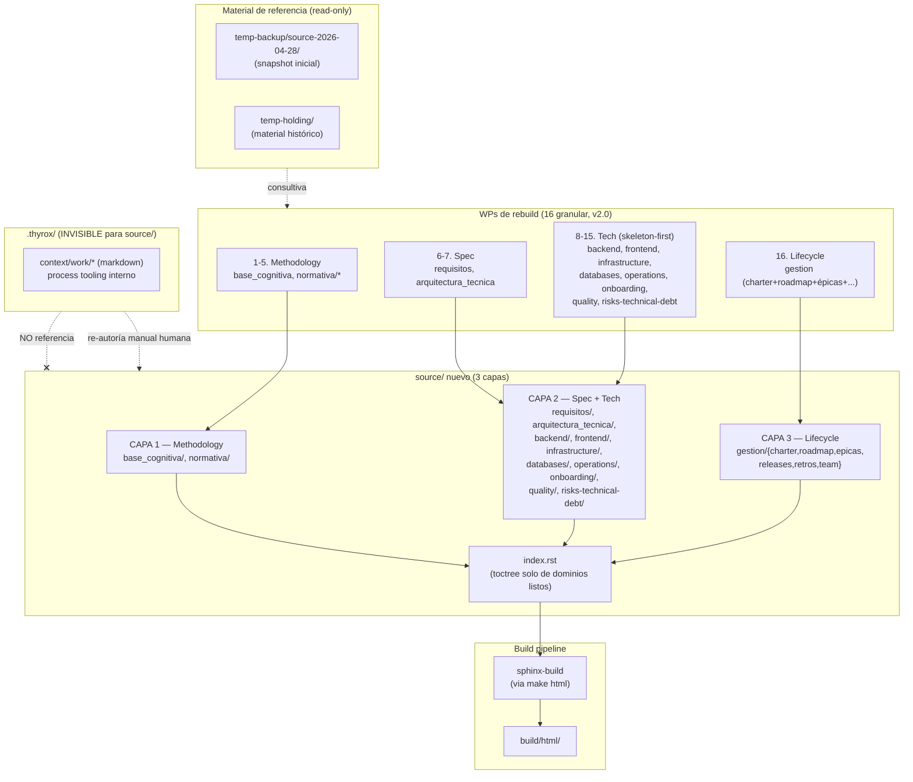

```yml
created_at: 2026-04-28 04:10:00
project: IACT-docs
work_package: 2026-04-28-01-58-08-source-rebuild-strategy
phase: Phase 5 — STRATEGY
architecture_version: 2.0
architect: NestorMonroy
stack_version: Sphinx 8.2.3 + Furo 2025.9.25 + Python 3.11 + RST puro · Producto IACT: React+Webpack / Django REST Framework / Ubuntu+Apache / MySQL+PostgreSQL
status: Aprobado — 2026-04-28 04:48 (ejecutor: SI)
```

> **v2.0 — MAJOR. Re-framing del ejecutor (2026-04-28):** IACT-docs
> documenta un proyecto de software multi-tier (React+Webpack /
> DRF / Ubuntu+Apache / MySQL+PostgreSQL) Y su ciclo de vida
> (planes, épicas). 3 dimensiones, no 2.
>
> Cambios MAJOR vs v1.2:
> - 8 cajones técnicos nuevos (backend, frontend, infrastructure,
>   databases, operations, onboarding, quality, risks-technical-debt)
> - `gestion/` se expande con cajón de proyecto (charter, roadmap,
>   épicas, releases, retros, team)
> - Total WPs: 16 (granular, D-TECH-1)
> - source/ y .thyrox/ son worlds separados (D-TECH-6)
> - Idea 8 (3-dimension architecture), Idea 9 (skeleton-first),
>   Idea 10 (separación source ↔ .thyrox)
> - Decisions 9-14 nuevas
>
> Análisis de soporte: `strategy/tech-stack-alignment-analysis.md`
> + `strategy/iact-docs-v2-applicability-analysis.md`.

# Solution Strategy: Source Rebuild

## Propósito

Definir CÓMO reconstruir `source/` (379 archivos `.rst`, 34 patrones
de naming, 147 hyperlinks rotos, errores editoriales heredados) para
producir un `source/` limpio, alineado a STD_007, sin warnings ni
errores, y con criterio editorial aplicado en cada archivo.

Este documento traduce las decisiones de Phase 1 DISCOVER (D1-D5,
F-04, F-05) en una arquitectura ejecutable que los WPs de rebuild
de dominio (8 hijos) van a seguir.

---

## Key Ideas

### Idea 1: Backup-as-reference rebuild (no lift-and-shift)

**Descripción:** ni `temp-backup/` ni `temp-holding/` son fuentes de
copia. Son material consultivo. El nuevo `source/` se ESCRIBE,
archivo por archivo, con criterio editorial — leyendo los temp-*
como insumo, decidiendo qué sobrevive, se fusiona, se reescribe o
se descarta.

**Impacto:**
- Elimina la propagación de errores heredados (los problemas de
  diseño/contenido del `source/` actual no llegan al nuevo).
- Aumenta el esfuerzo 5–10x respecto a un copy-and-rename mecánico,
  pero produce un `source/` que no necesita un segundo cleanup
  posterior.
- Cambia el criterio de aceptación por dominio: ya no es "todo
  archivo del backup está en source/ con su nuevo nombre" sino
  "todo archivo del backup está clasificado como
  incorporado / fusionado-en-X / reescrito / descartado-con-razón".

### Idea 2: Reconstrucción incremental dominio por dominio con bridge

**Descripción:** los 8 dominios se reconstruyen uno a la vez en
WPs separados. Mientras un dominio está en rebuild, los demás
permanecen intactos en su estado actual o en `temp-backup/`. El
sitio publicado siempre construye porque `source/index.rst` solo
lista los dominios reconstruidos; los pendientes viven fuera del
toctree y Sphinx no los conoce → no genera refs ni warnings.

**Impacto:**
- Build verde durante todo el rebuild (no hay big-bang).
- Cada WP de dominio es atómico, revisable y revertible.
- Permite pausar el rebuild entre dominios sin dejar el repo en
  estado inconsistente.

### Idea 3: Estándares-first

**Descripción:** STD_007 (naming), STD_006 (versionado en metadata,
no en filename) y los demás STDs definen el estado objetivo desde
el día uno. No se reconstruye "como esté" para luego normalizar —
se reconstruye YA siguiendo los estándares vigentes.

**Impacto:**
- IDs semánticos (UC_001, BR_001, FND_01, STD_007 mismo) se
  preservan donde STD_007 los codifica.
- Caracteres prohibidos (espacios, ñ, tildes, paréntesis) no
  entran al nuevo `source/`.
- Versiones viven en metadata YAML, nunca en filename.
- `index.rst` como punto de entrada único por directorio (no
  README.rst paralelos).

### Idea 4: RST puro, sin Markdown

**Descripción:** myst-parser eliminado. El nuevo `source/` es 100%
RST. Decisión del ejecutor (F-NEW-5).

**Impacto:**
- Una sola sintaxis a aprender por nuevos contribuidores.
- Sphinx-tabs y todas las directivas avanzadas funcionan
  consistentemente.
- Pérdida: archivos `.md` del `source/` actual o de `temp-holding/`
  deben reescribirse a RST si su contenido se quiere conservar.
- `source_suffix = '.rst'` ya está limpio en `conf.py`.

### Idea 5: Criterio editorial humano-en-el-loop

**Descripción:** Claude propone una clasificación inicial por
archivo (incorporar / fusionar-con-X / reescribir / descartar) en
el discover de cada WP de rebuild de dominio. El ejecutor confirma
o corrige antes de iniciar la ejecución.

**Impacto:**
- Velocidad asistida sin perder control editorial.
- Decisiones quedan documentadas en cada WP — no son tácitas.
- Si el ejecutor se vuelve cuello de botella, la opción es batch:
  validar dominio entero en una sesión en vez de archivo por
  archivo.

### Idea 6: Templates como contrato estructural — first-class citizen

**Descripción:** los templates `TPL_*` no son "más contenido" — son
el **molde estructural** de cada tipo de artefacto. Definen qué
secciones tiene un UC, qué metadata YAML lleva un BR, qué
checklist debe satisfacer un FR. Sin templates canónicos, los
artefactos derivados heredan inconsistencias.

**Inventario verificado (ver `strategy/templates-inventory-analysis.md`):**

- `source/normativa/estandares/plantillas/`: 22 templates "oficiales"
  con versiones en filename (viola STD_006).
- `temp-holding/.../iact_templates_v1_3_0/`: set CURADO de 13
  templates v1_3_0 con README.txt — el más reciente y agrupado.
- `temp-holding/FASE 02/tmp_work/`: 30+ variantes individuales con
  multiples versiones (UC tiene 7 patrones distintos: CRUD,
  Actor_Secundario, Stakeholder_Driven, UI_Driven, Temporal_
  Schedulers, Larman_Contratos, Construccion_7_Pasos).
- Documentos de análisis previo: `ANALISIS_TEMPLATES_VERSIONES.md`,
  `PLAN_TEMPLATES_3_12_v1_2_0.md`, `ANALISIS_NOMENCLATURA_TPL_1_0_0.md`,
  `PROPUESTA_TEMPLATE_01..10.txt`.

**Impacto:**
- Los templates deben reconstruirse ANTES que cualquier dominio
  que los use (requisitos, arquitectura).
- Las múltiples variantes de UC NO son redundancia — son patrones
  distintos. Se conservan todos como templates separados.
- Las versiones en filenames (`_1_3_0.rst`) deben moverse a
  metadata YAML (`:version: 1.3.0`) según STD_006.

### Idea 7: Restricciones (CNST) como input arquitectónico

**Descripción:** las restricciones `CNST_*` definen el espacio de
diseño de los artefactos derivados. Un UC no puede violar una CNST;
un FR debe ser consistente con las restricciones aplicables. Si
las CNST están inconsistentes (numeración divergente, contenido
contradictorio entre versiones), todo lo que se construya encima
hereda esa inconsistencia.

**Hallazgo crítico (ver `strategy/restricciones-divergence-analysis.md`):**

- `source/normativa/restricciones/` tiene 12 CNSTs (gap en
  CNST_011) con contenido específico (Comunicaciones_Prohibidas,
  Antipatrones_Arquitectura, etc.).
- `temp-holding/.../base_cognitiva/normativa/restricciones/` tiene
  8 CNSTs con **misma numeración pero conceptos distintos** (ej:
  source CNST_005 = Seguridad_DRF_Checklist; temp-holding CNST_005
  = RBAC_Flat_SoD_Permisos).
- Existe `RESTRICCIONES_COMPLETAS_DEL_SISTEMA_IACT.md` — documento
  maestro consolidado en 2 ubicaciones del temp-holding/.
- Existe `ACTUALIZACION_DEL_ARBOL_SECCION_RESTRICCIONES.md` —
  propuesta previa de reorganización.

**Impacto:**
- Las CNSTs deben **reconciliarse antes** de reconstruir el
  dominio `requisitos`. Si requisitos consume CNSTs inconsistentes,
  el rebuild de UCs/FRs se hace sobre arena movediza.
- El rebuild de CNSTs requiere un proceso especial: **partir del
  documento maestro consolidado** + reconciliar las versiones de
  source y temp-holding + numeración final consistente.
- La gravedad amerita separar CNST en su propio WP, distinto del
  WP de gobernanza (ver Decision 7).

### Idea 8: Arquitectura de 3 dimensiones (methodology + tech + lifecycle)

**Descripción:** IACT-docs no es solo "documentación del producto".
Cubre tres dimensiones ortogonales:

1. **Methodology / Governance** — STDs, plantillas, procedimientos,
   restricciones, ADRs internos. Define el cómo se trabaja.
2. **Product spec + Tech implementation** — UCs, FRs, NFRs, BRs +
   architecture overview + cajones por tier técnico (backend,
   frontend, infrastructure, databases, operations, etc.). Define
   el qué y el cómo del producto.
3. **Project lifecycle** — charter, roadmap, OKRs, épicas, sprints,
   releases, retros, team. Define el cómo se gestiona el proyecto.

**Impacto:**
- Estructura de `source/` refleja las 3 capas explícitamente.
- Cada capa tiene cajones top-level distintos.
- Ningún cajón pertenece a más de una capa — clasificación clara
  evita el "catch-all" (problema documentado en v2.0 cuello #10).

### Idea 9: Skeleton-first para cajones técnicos (D-TECH-5)

**Descripción:** los nuevos cajones técnicos (backend, frontend,
infrastructure, databases, operations, onboarding, quality,
risks-technical-debt) se crean con estructura **mínima** —
`overview.rst` + `conventions.rst` por cajón. Documentación
detallada (componentes, módulos, endpoints, schemas) se expande
en sub-WPs cuando exista código a documentar.

**Justificación del ejecutor:** "no tiene sentido mencionar el
código ahorita; eso se va a ir creando ya con el código".

**Impacto:**
- Cada WP de cajón técnico es ligero — solo overview + convenciones.
- Evita inventar contenido especulativo sobre código que no existe.
- Los cajones quedan listos como "hooks" para que el desarrollo
  los pueble incrementalmente.
- Sub-WPs futuros (`source-rebuild-backend-api`, etc.) expanden
  cuando sea pertinente.

### Idea 10: Separación de mundos — source/ ↔ .thyrox/ (D-TECH-6)

**Descripción:** `source/` y `.thyrox/context/work/` son **worlds
independientes**:

- `.thyrox/` es **process tooling interno** — cómo trabajan Claude
  y el ejecutor. Markdown, no publicado, invisible al usuario final
  del sitio.
- `source/` es **producto + proyecto publicado** — RST estricto,
  renderizado por Sphinx, visible para stakeholders.

**Regla:** `source/` no sabe que `.thyrox/` existe. Si un WP
genera contenido valioso para el sitio (ej. una decisión técnica
relevante para devs externos), el ejecutor **re-autora ese contenido
en source/ como RST**. No hay imports automáticos, no hay symlinks,
no hay generación cross-world.

**Impacto:**
- Cero acoplamiento entre tooling interno y sitio público.
- Re-autoría humana garantiza calidad editorial al pasar de markdown
  interno a RST publicable.
- `source/gestion/epicas/` (si se decide tenerlo) contiene RST
  escritos a mano que resumen las épicas — NO son auto-generación
  desde `.thyrox/context/work/`.

---

## Fundamental Decisions

### Decision 1: Orden de reconstrucción por dependencia

**Alternatives Considered:**
- Por tamaño (chico primero) — `plantuml-guide` (8 archivos) o
  `arquitectura_tecnica` (15) primero. Pro: feedback rápido. Con:
  empezar por dependientes deja los dominios base en estado
  inconsistente.
- Alfabético — `arquitectura_tecnica` primero. Sin justificación
  técnica.
- **Por dependencias salientes (de menos a más, elegida).**

**Justification:**
- `base_cognitiva` (33 archivos) provee el vocabulario (glosario,
  ontología, fundamentos) — sin esto, los demás dominios pueden
  introducir términos inconsistentes.
- `normativa/estandares/` (~10) viene segundo — los STDs son
  referencia para todo lo demás (incluido este propio rebuild).
- Sigue la cadena: procedimientos → gobernanza/restricciones →
  requisitos → arquitectura técnica → gestión.
- `plantuml-guide` se resuelve dentro de `arquitectura_tecnica`
  (decisión F-04).

**Implications (actualizado v2.0):**
- **16 WPs de rebuild de dominio** — granular (D-TECH-1).
  plantuml-guide se absorbe en arquitectura_tecnica (F-04);
  restricciones se separa de gobernanza (Decision 7); 8 cajones
  técnicos nuevos (Decision 9); gestion expandido (Decision 10).
- Orden final v2.0:

  | # | WP | Capa | Notas |
  |---|----|------|-------|
  | 1 | base_cognitiva | Methodology | vocabulario base — incluye "knowledge" subsumido (D-TECH-7) |
  | 2 | normativa/estandares | Methodology | STDs → templates → resto (Decision 5) |
  | 3 | normativa/procedimientos | Methodology | |
  | 4 | normativa/restricciones | Methodology | reconciliación CNST (Decision 7) |
  | 5 | normativa/gobernanza | Methodology | ADRs internos del proyecto |
  | 6 | requisitos | Spec | UCs/FRs/NFRs/BRs (consume CNSTs + templates) |
  | 7 | arquitectura_tecnica | Spec/Tech | architecture overview + decisions; absorbe plantuml-guide |
  | 8 | **backend** | Tech | NEW — DRF (skeleton-first) |
  | 9 | **frontend** | Tech | NEW — React + Webpack (skeleton-first) |
  | 10 | **infrastructure** | Tech | NEW — Ubuntu + Apache (skeleton-first) |
  | 11 | **databases** | Tech | NEW — MySQL + PostgreSQL en cajón propio (D-TECH-3) |
  | 12 | **operations** | Tech | NEW — deployment, monitoring, runbooks |
  | 13 | **onboarding** | Tech | NEW — dev quickstart |
  | 14 | **quality** | Tech | NEW — testing strategy |
  | 15 | **risks-technical-debt** | Tech | NEW — TD log |
  | 16 | gestion (expandido) | Lifecycle | charter + roadmap + épicas + releases + retros + team |

- El orden permite que cada WP nuevo pueda apoyarse en términos y
  patrones definidos por los anteriores.
- Si un dominio de "abajo" descubre que necesita ajustar uno ya
  reconstruido, se hace en un WP separado, no en cascada.

### Decision 2: `temp-backup/` se crea al inicio del primer WP de rebuild

**Alternatives Considered:**
- Crear `temp-backup/` ahora en este WP DISCOVER — Pro:
  disponible para Phase 5/6. Con: ocupa repo space sin que se
  esté usando todavía.
- Crear al inicio de cada WP de dominio (snapshot por dominio) —
  Pro: granular. Con: 7 snapshots redundantes.
- **Crear UNA vez al inicio del primer WP de rebuild
  (`source-rebuild-base-cognitiva`), persistir hasta el final.**

**Justification:**
- Un único snapshot del estado verificado "0 warnings" al momento
  de empezar (F-NEW-3 ya verificado).
- Sirve a los 7 WPs de dominio como referencia inmutable.
- Eliminación al cerrar el último WP de dominio (CLEANUP).

**Implications:**
- Ocupa ~8 MB versionados temporalmente en feature branches.
- Recuperable siempre vía git history aunque se borre el directorio.

### Decision 3: Build sin `-W` durante rebuild, con `-W` al final

**Alternatives Considered:**
- `-W` siempre (rigor máximo) — bloquearía el rebuild la primera
  vez que un dominio en transición tenga refs huérfanas
  legítimas (porque el dominio destino aún no está reconstruido).
- Sin `-W` nunca — pierde el rigor que el CI ya aplica.
- **Sin `-W` durante el rebuild, con `-W` al final del último
  dominio (decisión D3 confirmada).**

**Justification:**
- Pragmatismo durante la transición.
- El CI (`validate.yml`) ya usa `-W` y validará en cada PR — actúa
  como red de seguridad continua.
- Recuperar `-W` localmente solo cuando todo encaje.

**Implications:**
- Cada WP de dominio puede generar warnings transitorios —
  documentarlos en su track changelog.
- Al final del último WP de dominio, agregar tarea explícita:
  "verificar build con -W exit 0".

### Decision 4: Sphinx-tabs incluido proactivamente, plantuml requerido

**Alternatives Considered:**
- Sin sphinx-tabs (deshabilitar también) — Pro: dependencias
  mínimas. Con: contradice la intención del ejecutor de usarlo
  correctamente en el nuevo source/.
- Sphinx-tabs + sphinx-toolbox — descartado en F-NEW-4 (toolbox
  unused, conflicto con tabs 3.5.0).
- **Sphinx-tabs habilitado en `conf.py`, sphinx-toolbox eliminado,
  plantuml.jar gestionado por setup.sh con guard en Makefile.**

**Justification:**
- Tabs habilitado de antemano evita "agregar la extension cuando
  el primer WP la necesite" — la directiva está disponible para
  cualquier dominio que la requiera.
- Plantuml es esencial (29 archivos `.puml` en repo) — el guard
  garantiza que el bootstrap esté completo antes de build.

**Implications:**
- Skill `sphinx` cargado provee referencia para uso correcto de
  `.. tabs::`, `.. tab::`, `.. group-tab::`, `.. code-tab::`.
- Cualquier futura adición de extensions requiere actualizar
  conf.py + verificar conflicto en pyproject.toml + re-`uv sync`.

### Decision 5: Sub-orden interno de `normativa/estandares` — STDs → templates → resto

**Alternatives Considered:**
- Reconstruir todo `estandares/` en orden alfabético —
  arbitrario, no respeta dependencias.
- Templates primero, STDs después — invertido: los STDs definen
  reglas que aplican a los templates (ej: STD_006 dice "versión va
  en metadata", STD_007 dice cómo nombrar — ambos restringen
  templates).
- **STDs → Templates → Otros estándares (elegida).**

**Justification:**
- STDs son las reglas universales — deben estar firmes antes de
  aplicar a templates.
- Templates son moldes de artefactos — deben estar listos antes
  de que `requisitos`, `arquitectura_tecnica` y otros dominios
  empiecen a producir artefactos según template.
- "Otros estándares" (guías de estilo, etc.) cierran el WP.

**Implications:**
- Dentro del WP `normativa/estandares`, el task plan tiene 3
  bloques claros.
- El WP `requisitos` (que produce UC, BR, FR, NFR — todos basados
  en templates) NO puede empezar hasta que `normativa/estandares`
  cierre.

### Decision 6: Triage de versiones de templates antes de incorporar

**Alternatives Considered:**
- Tomar `source/normativa/estandares/plantillas/` tal cual —
  problema: tiene versiones en filename (viola STD_006) y no
  incluye las variantes de UC más recientes de temp-holding.
- Tomar `iact_templates_v1_3_0` tal cual — problema: solo cubre
  13 templates; faltan ~15 que están en source/.
- **Triage explícito caso por caso (elegida).** Para cada tipo
  de template (UC, BR, FR, NFR, ADR, etc.):
  1. Listar versiones existentes en source/ y temp-holding/.
  2. Consultar `ANALISIS_TEMPLATES_VERSIONES.md` y
     `PLAN_TEMPLATES_3_12_v1_2_0.md` para conocer la decisión
     editorial previa.
  3. Elegir la versión canónica (preferir la más reciente,
     verificar que no contradiga STDs vigentes).
  4. Renombrar al patrón sin versión en filename
     (`TPL_BR_Decision_Tipo.rst`, no `_1_3_0`).
  5. Mover versión a metadata YAML (`:version: 1.3.0`).

**Justification:**
- Existen análisis previos del ejecutor sobre qué versión es
  canónica — ignorarlos sería re-trabajo innecesario.
- STD_006 obliga a versión en metadata, no filename — el rename
  no es opcional.
- Las variantes de UC (CRUD, Larman, Stakeholder_Driven, etc.)
  NO son duplicadas — cada una es un patrón distinto y se
  conserva como template separado.

**Implications:**
- El task plan del WP `normativa/estandares` debe incluir tarea
  explícita de triage por cada tipo de template (~15 tareas).
- Los análisis previos (`ANALISIS_TEMPLATES_VERSIONES.md`, etc.)
  son inputs obligatorios — leerlos antes de proponer canónica.

### Decision 7: CNST tiene WP propio y se reconcilia antes de `requisitos`

**Alternatives Considered:**
- CNST se reconstruye dentro del WP `normativa/gobernanza+
  restricciones` — problema: la divergencia profunda source vs
  temp-holding amerita tratamiento dedicado, no compartir scope
  con gobernanza.
- CNST se difiere hasta el WP `requisitos` — problema: los UCs
  necesitan CNSTs claras como input. Diferir crea bloqueo.
- **WP independiente `source-rebuild-restricciones`, ejecutado
  antes que `source-rebuild-requisitos` (elegida).**

**Justification:**
- Source y temp-holding tienen **misma numeración con conceptos
  distintos** (ver `restricciones-divergence-analysis.md`).
  Reconciliar es trabajo no trivial.
- Existe `RESTRICCIONES_COMPLETAS_DEL_SISTEMA_IACT.md` como
  documento maestro consolidado — debe ser punto de partida.
- Existe `ACTUALIZACION_DEL_ARBOL_SECCION_RESTRICCIONES.md` con
  propuesta previa — input obligatorio para evitar re-trabajo.
- Numeración final debe quedar consistente y completa (sin gap
  en CNST_011 o equivalente).

**Implications:**
- El total de WPs de rebuild de dominio sube a **8** (no 7):
  el WP `normativa/gobernanza+restricciones` se divide en
  `normativa/gobernanza` + `normativa/restricciones`.
- El nuevo orden de WPs queda:
  1. base_cognitiva
  2. normativa/estandares (STDs → templates → resto)
  3. normativa/procedimientos
  4. **normativa/restricciones** (NEW — separado)
  5. normativa/gobernanza
  6. requisitos
  7. arquitectura_tecnica (absorbe plantuml-guide)
  8. gestion
- El WP `restricciones` debe completarse y aprobarse ANTES de
  abrir `requisitos`.

### Decision 9: Estructura híbrida — agregar 8 cajones técnicos (D-TECH-1, D-TECH-3)

**Alternatives Considered:**
- Mantener solo dominios metodológicos (status quo). Rechazada:
  el contenido técnico está disperso y un dev de backend tiene
  que recorrer 3+ dominios para reconstruir el cuadro DRF.
- Adoptar los "12 cajones" v2.0 al pie de la letra. Rechazada:
  v2.0 es para multi-proyecto + corp; varios cajones no aplican.
- Reorganizar todo source/ siguiendo v2.0. Rechazada: rompe
  artefactos válidos (UCs, BRs, etc.) que tienen su lugar
  metodológico claro.
- **Híbrida — agregar cajones técnicos como top-level
  (elegida).** Coexisten con los metodológicos.

**Justification:**
- Stack real (verificado): React+Webpack / DRF / Ubuntu+Apache
  / MySQL+PostgreSQL — necesita cajones por tier.
- `databases/` propio porque son 2 motores distintos (D-TECH-3),
  no son extensión simple de backend.
- Cajones nuevos: backend, frontend, infrastructure, databases,
  operations, onboarding, quality, risks-technical-debt.
- Granular WPs (D-TECH-1) — cada cajón = WP propio. Total sube
  de 8 a 16.

**Implications:**
- 16 WPs en total (8 metodológicos + tech-related + 1 lifecycle).
- Cada cajón nuevo es bajo costo gracias a Decision 12 (skeleton-
  first).
- Refs cross-dominio: backend ↔ databases, backend ↔ requisitos
  (UCs implementados), arquitectura_tecnica ↔ todos los tech.

### Decision 10: Migración como re-autoría, NO como copia (D-TECH-2)

**Alternatives Considered:**
- Migrar archivos físicamente: mover `normativa/gobernanza/
  ADR-FRONT-*.rst` a `frontend/decisions/`. Rechazada: rompe
  refs históricas y no aplica el criterio editorial (Idea 5).
- Linkear sin migrar: stubs en cajones nuevos que apuntan a la
  ubicación actual. Rechazada: deuda técnica permanente, no
  resuelve la dispersión.
- **Re-autoría (elegida).** El contenido se REESCRIBE en el
  nuevo cajón aplicando criterio editorial. Las versiones nuevas
  empiezan en **1.0.0 a menos que existan versiones superiores**
  (en source/ actual o en temp-holding/).

**Justification:**
- Coherente con D5 (backup-as-reference): NO se copia mecánica-
  mente; se decide qué incorporar / fusionar / reescribir /
  descartar.
- Coherente con Idea 9 (skeleton-first): no se documenta código
  que aún no existe. Solo overview + conventions.
- temp-holding/ tiene "muchos ADRs" según el ejecutor — son la
  fuente principal de re-autoría para los cajones técnicos
  (especialmente frontend, devops, infra).
- Versionado v1.0.0 fresh permite que la metadata refleje el
  estado actual, no el histórico.

**Implications:**
- Discover de cada WP de cajón técnico debe inventariar:
  - Archivos relevantes en source/ actual (ej: ADR-FRONT-001,
    ADR-FRONT-004 → relevantes para frontend).
  - Archivos relevantes en temp-holding/ (probablemente más).
  - Decisión por archivo: re-autorizar / fusionar / descartar.
- ADRs antiguos de source/normativa/gobernanza/ pueden ser
  descartados de su ubicación actual una vez re-autorizado el
  contenido en el cajón técnico correspondiente.
- Si hay versión superior a 1.0.0 documentada, esa versión se
  preserva (con justificación de por qué se conserva el número).

### Decision 11: Tech-skill mismatch fix (F-NEW-8) en bootstrap-hardening WP (D-TECH-4)

**Alternatives Considered:**
- Fix en este WP. Rechazada: agrega scope no relacionado al
  rebuild de source/.
- Fix en spinoff WP nuevo dedicado. Costo de overhead.
- **Fix en WP existente `bootstrap-hardening` (elegida).** Ese
  WP ya cubre el bootstrap del repo y los tech-skills caen
  dentro de su scope.

**Acción concreta:**
- Generar `.thyrox/guidelines/backend-django.instructions.md`
  con convenciones DRF (urls.py, viewsets, serializers,
  manage.py, requirements/pyproject, settings, models).
- Desactivar/eliminar `.thyrox/guidelines/backend-nodejs.
  instructions.md`.
- Actualizar @import en CLAUDE.md.
- Verificar que registry/agents/* y registry/{layer}/* generen
  el guideline correcto si bootstrap.py se re-ejecuta.

**Implications:**
- WP `bootstrap-hardening` agrega F-NEW-8 a sus hallazgos.
- Cualquier sugerencia futura de Claude sobre backend hereda
  convenciones DRF, no Express.

### Decision 12: Skeleton-first para cajones técnicos (D-TECH-5)

**Alternatives Considered:**
- Estructura completa al inicio (todos los sub-cajones del
  modelo v2.0). Rechazada: alto esfuerzo, contenido especulativo.
- **Mínima inicial (elegida).** Cada cajón técnico nuevo
  contiene en su WP de rebuild solo:
  - `index.rst` (entry point del cajón)
  - `overview.rst` (alcance, contexto, decisiones a alto nivel)
  - `conventions.rst` (convenciones de código/diseño que aplican
    a ese tier)

**Justification:**
- "No tiene sentido mencionar el código ahorita" — ejecutor.
- Cajones quedan listos como hooks para población incremental.
- Sub-WPs futuros expanden cuando exista código a documentar
  (ej: `source-rebuild-backend-api`, `source-rebuild-frontend-
  components`).

**Implications:**
- Cada WP de cajón técnico es WP **pequeño** (~3 archivos +
  inventario de re-autoría).
- El sitio publicado cubre la estructura completa pero algunos
  cajones empiezan ligeros — eso es transparente al usuario
  via index.rst que explica el estado.

### Decision 13: source/ y .thyrox/ son worlds separados (D-TECH-6)

**Alternatives Considered:**
- Espejo manual de WPs en source/gestion/epicas/. Rechazada:
  duplicación, viola I-002.
- Generación automática de epicas/ desde .thyrox/. Rechazada:
  acoplamiento cross-world, complejidad.
- Solo referencias (links externos a .thyrox). Rechazada:
  source/ no debe saber que .thyrox existe.
- **Independencia total (elegida).** `source/gestion/` (incluyendo
  cualquier sub-cajón de épicas/releases/retros) es escrito a
  mano por el ejecutor cuando corresponde, con el contenido del
  proyecto que el sitio público debe mostrar. `.thyrox/` queda
  invisible.

**Justification del ejecutor:**
> ".thyrox/context/work/ no se relaciona, si se ha tenido contenido
> valioso que es parte del proyecto, se documenta en .thyrox como
> markdown, y se pone de manera correcta en source — source no sabe
> que existe .thyrox."

**Implications:**
- Ningún script de Sphinx, Makefile target ni extension custom
  refiere a `.thyrox/`.
- Si el ejecutor decide que una decisión de WP es valiosa para
  el sitio público, la re-autora como RST en `source/`.
- `gestion/` puede tener `epicas/`, `releases/`, `retrospectives/`,
  `team/` — pero el contenido se escribe a mano, no se genera.

### Decision 14: news/ no aplica; knowledge/ subsumido en base_cognitiva (D-TECH-7)

**Alternatives Considered:**
- Crear `news/` y `knowledge/` como cajones top-level v2.0.
  Rechazada: news no aplica al scope del producto IACT;
  knowledge ya tiene cobertura.
- **No crear (elegida).**

**Justification:**
- `news/` (anuncios, releases corporativas, updates de servicio):
  IACT no tiene flujo de comunicación regular a stakeholders
  externos en este scope. Si se necesita en el futuro, se
  agrega como cajón top-level. Por ahora no.
- `knowledge/` v2.0 contiene: how-to-guides, best-practices,
  lessons-learned, architecture-patterns, faqs. Mapeo:
  - how-to-guides → `onboarding/` y `operations/runbooks/`
  - best-practices → `normativa/estandares/` + conventions.rst
    de cada cajón técnico
  - lessons-learned → `gestion/retrospectives/` (si se crea)
  - architecture-patterns → `arquitectura_tecnica/`
  - faqs → distribuidas por dominio
- Y crucialmente: **`base_cognitiva/`** YA cubre la dimensión
  conceptual/glosario/ontología/fundamentos/taxonomías que es
  el equivalente real al "knowledge base" del proyecto. El
  ejecutor lo confirmó: "considero que hacen relación a lo que
  se tiene actualmente en source/base_cognitiva".

**Implications:**
- 0 cajones nuevos de tipo news/knowledge.
- `base_cognitiva/` mantiene su scope con: `_fundamentos_
  conceptuales/`, `_metadata/`, `_ontologia_sbvr/`, `_taxonomias_
  y_metamodelos/`, glosarios.
- Si emergen necesidades futuras de "FAQ pública", se decide en
  ese momento dónde colocarlas.

### Decision 8: Cada WP de rebuild de dominio tiene su propio ciclo THYROX

**Alternatives Considered:**
- Un mega-WP que cubra los 7 dominios — inmanejable, mezcla
  decisiones independientes.
- Sub-tasks dentro de este WP — viola la regla de granularidad
  (este WP es DISCOVER de la estrategia, no implementación).
- **7 WPs hermanos, cada uno con su propio DISCOVER → STRATEGY
  → PLAN → DESIGN → EXECUTE → TRACK.**

**Justification:**
- Cada dominio tiene su propio inventario, sus propias decisiones
  de fusión/descarte, su propio scope.
- Permite paralelización si en algún momento se ejecutan dos
  dominios independientes en simultáneo (no recomendado al inicio).
- Audit trail granular por dominio.

**Implications:**
- Repositorio acumula 7 WPs nuevos en `.thyrox/context/work/`.
- Este WP (`source-rebuild-strategy`) queda como WP-padre
  conceptual — referenciado por todos los hijos.

---

## Technology Stack (heredado, no es decisión nueva de Phase 5)

```
Documentation engine:    Sphinx 8.2.3
Theme:                   Furo 2025.9.25
Source format:           reStructuredText (RST puro)
Markdown parser:         NINGUNO (myst-parser eliminado, F-NEW-5)
Diagram engine:          PlantUML 1.2024.7 (vía sphinxcontrib-plantuml)
Tabs:                    sphinx-tabs 3.5.0
Spell check:             sphinxcontrib-spelling 8.0.2 (requiere libenchant)
Python:                  3.11
Dep manager:             uv 0.8.17 + pyproject.toml + uv.lock
Bootstrap:               scripts/setup.sh (idempotente, 6 pasos)
Build target:            make html (con guard check-bootstrap, F-NEW-7)
CI:                      .github/workflows/validate.yml (sphinx-build -W)
```

**Justification:** stack ya en uso, no se cambia en este WP. Las
únicas modificaciones aplicadas son las de F-NEW-4 (drop
sphinx-toolbox), F-NEW-5 (drop myst-parser), F-NEW-6 (settings
allowlist) y F-NEW-7 (Makefile guard) — todas para enabling, no
para disrupción.

---

## Architecture Patterns

### Structural Patterns

- **Domain-by-domain rebuild** — separación estricta por dominio
  durante la reconstrucción.
- **Reference-only sources** — `temp-backup/` y `temp-holding/`
  como advisory inputs, nunca como copy origin.
- **Single entry point per directory** — `index.rst` (no
  README.rst paralelos).
- **Semantic IDs in filenames** — `UC_001`, `BR_001`, `STD_007`
  según STD_007.

### Behavioral Patterns

- **Editorial classification per file** — incorporar / fusionar /
  reescribir / descartar.
- **Bridge plan via toctree** — solo dominios reconstruidos van al
  toctree maestro; los pendientes viven fuera.
- **Fail-fast bootstrap** — guard en Makefile aborta build si
  setup incompleto.

### Architectural Styles

- **Incremental migration** — sin big-bang, sin freeze del repo.
- **Standards-first** — STDs definen estado objetivo desde día 1.

---

## Diagrama de Arquitectura



---

## How We Achieve Quality Goals

### Quality Goal 1: 0 warnings, 0 errores en build final

**Approach:** estándares-first + guard de bootstrap + CI con `-W`.

**Mechanisms:**
- STD_007 aplicado desde el primer archivo del rebuild.
- Refs entre dominios usan `:ref:` con anchor explícito (no
  `:doc:` con path) — robustez frente a futuros renombres.
- `make html` con `check-bootstrap` previene build con
  pre-condiciones faltantes.
- CI corre `sphinx-build -W` en cada PR.

**Technologies:** Sphinx 8.2.3, sphinxcontrib-plantuml,
sphinxcontrib-spelling.

### Quality Goal 2: Trazabilidad editorial

**Approach:** clasificación explícita por archivo + WP-changelogs
por dominio.

**Mechanisms:**
- Cada archivo del backup termina marcado: incorporado / fusionado /
  reescrito / descartado-con-razón.
- Cada WP de dominio mantiene su track changelog con todas las
  decisiones.
- ADRs en `.thyrox/context/decisions/` para decisiones
  arquitectónicas que trasciendan un dominio.

### Quality Goal 3: Build verde durante toda la migración

**Approach:** bridge via toctree + sin `-W` durante rebuild.

**Mechanisms:**
- `source/index.rst` lista solo dominios reconstruidos.
- Dominios pendientes viven en `temp-backup/` (fuera del toctree).
- CI sigue siendo strict — actúa como red de seguridad por PR.

---

## Adherence to Constraints

### Constraint: STD_007 (naming convention)

**How we respect it:** todo archivo del nuevo `source/` cumple
STD_007 antes de incorporarse — kebab para guías generales,
snake_case para directorios, IDs semánticos donde STD_007 los
codifica, `index.rst` como entry-point.

### Constraint: STD_006 (semantic versioning, version in metadata)

**How we respect it:** ningún filename del nuevo `source/` lleva
versión. Versiones viven en bloque YAML del archivo (`:version:`).

### Constraint: I-002 (git as persistence, no `.bak` files)

**How we respect it:** `temp-backup/` es directorio único
versionado, no copias `.bak` por archivo. Recuperación vía git
history o git revert.

### Constraint: Build verde requerido por CI

**How we respect it:** bridge plan + dominios fuera de toctree
mientras se reconstruyen. Cada PR del rebuild se valida con
`-W` por validate.yml.

### Constraint: Bootstrap dependiente de `setup.sh`

**How we respect it:** Makefile `check-bootstrap` falla rápido
con mensaje accionable si `setup.sh` no se ejecutó. CI corre
`setup.sh` siempre.

---

## Traceability to Analysis

### Satisfying Findings

- **F-04** (plantuml-guide destination) → Decision 1: absorbido
  por WP `arquitectura_tecnica`.
- **F-05** (`_static/`/`_templates/`) → mantienen ubicación, no
  se mueven (decisión confirmada en discover).
- **F-NEW-3** (premisa 0 warnings) → verificada; baseline para
  `temp-backup/`.
- **F-NEW-4** (pyproject contradicciones) → resuelta vía
  eliminación de sphinx-toolbox; sphinx-tabs preservado por
  Decision 4.
- **F-NEW-5** (no Markdown) → Idea 4 (RST puro).
- **F-NEW-6** (rm -rf prompts) → resuelto vía settings allowlist.
- **F-NEW-7** (setup.sh visibility) → spawneado WP
  `bootstrap-hardening`; Makefile guard ya implementado.

### Satisfying Decisions

- **D1** (temp-backup versionado) → Decision 2.
- **D2** (base_cognitiva primero) → Decision 1, primer WP.
- **D3** (sin -W durante rebuild) → Decision 3.
- **D4** (no tensión en STD_007) → Idea 3.
- **D5** (backup as reference) → Idea 1.

### Satisfying nuevos hallazgos v1.2

- **Templates como contrato** → Idea 6 + Decisions 5, 6. Análisis
  detallado en `strategy/templates-inventory-analysis.md`.
- **Restricciones (CNST) divergentes** → Idea 7 + Decision 7.
  Análisis detallado en
  `strategy/restricciones-divergence-analysis.md`.

### Satisfying re-framing v2.0 (2026-04-28)

- **Stack técnico real (React+Webpack / DRF / Ubuntu+Apache /
  MySQL+PostgreSQL)** → Idea 8 (3 dimensiones) + Decision 9
  (8 cajones técnicos) + Decision 12 (skeleton-first).
- **F-NEW-8 (tech-skill mismatch backend-nodejs vs DRF)** →
  Decision 11 (fix en bootstrap-hardening WP).
- **Contenido técnico disperso** → Decision 10 (re-autoría con
  versión 1.0.0 fresh, no migración mecánica).
- **Documentamos también ciclo de vida (épicas, planes)** →
  Idea 8 capa 3 + capa expandida en `gestion/`.
- **Separación tooling interno vs sitio público** → Idea 10 +
  Decision 13.
- **news/ no aplica; knowledge subsumido** → Decision 14.
- Análisis detallados en
  `strategy/tech-stack-alignment-analysis.md` y
  `strategy/iact-docs-v2-applicability-analysis.md`.

---

## Evidencia de respaldo

| Claim | Tipo | Fuente | Confianza | Origen |
|-------|------|--------|-----------|--------|
| `source/` actual tiene 0 warnings con setup completo | PROVEN | Output de `uv run sphinx-build -E -b html source/ build/html-verify` 2026-04-28 03:55 → "build succeeded." (cero warnings) | alta | nuevo |
| `source/` contiene 379 .rst en 8 dominios | PROVEN | `find source -name "*.rst" \| wc -l` → 379 (verificado en discover) | alta | heredado-verificado |
| sphinx-toolbox no es usado en source/ | PROVEN | `grep -rn "sphinx_toolbox\|.. collapse::" source/` → 0 ocurrencias | alta | nuevo |
| sphinx-tabs no es usado actualmente en source/ | PROVEN | `grep -rn ".. tabs::" source/` → 0 ocurrencias; se incluye proactivamente para nuevo source/ | alta | nuevo |
| temp-holding contiene 5 backups anidados | PROVEN | `ls temp-holding/GENERACION_DOCUMENTACION/` muestra IACT_Backup_Completo_2026-01-11/, IACT_Backup_Completo_2026-01-11-old/, TMP_COMPLETO_2026-01-13/, TMP_COMPLETO_2026-01-13_OK/, TMP_COMPLETO_IACT_2026-01-13_2/ | alta | nuevo |
| pyproject.toml + uv.lock sincronizados post-fix | PROVEN | `uv sync` exit 0 + `.venv/bin/sphinx-build --version` → 8.2.3 | alta | nuevo |
| CI (validate.yml) corre setup.sh + -W | PROVEN | Read de .github/workflows/validate.yml líneas 32-38 | alta | nuevo |
| Existen 22 templates en source/ y 519 archivos relacionados a templates en temp-holding/ | PROVEN | `find source -iname "TPL_*"` → 22; `find temp-holding -iname "TPL_*" -o -iname "*template*" -o -iname "*plantilla*"` → 519 (excluyendo binarios) | alta | nuevo |
| Set curado `iact_templates_v1_3_0` tiene 13 templates con README.txt | PROVEN | `find temp-holding/.../iact_templates_v1_3_0 -type f` → 13 archivos incluyendo README.txt | alta | nuevo |
| source/ y temp-holding/ tienen CNST con misma numeración pero conceptos distintos | PROVEN | Comparación: source CNST_005=Seguridad_DRF_Checklist; temp-holding CNST_005=RBAC_Flat_SoD_Permisos. Verificado con `find -iname "CNST_*"` en ambos directorios. | alta | nuevo |
| source/ tiene gap en CNST_011 | PROVEN | Listado de source/normativa/restricciones/: CNST_001..010 + CNST_012, sin CNST_011 | alta | nuevo |
| Existe documento maestro `RESTRICCIONES_COMPLETAS_DEL_SISTEMA_IACT.md` | PROVEN | `find temp-holding -iname "RESTRICCIONES_COMPLETAS*"` → 2 ubicaciones (originales/ + uploads/ del backup) | alta | nuevo |
| source/ NO tiene cajones backend, frontend, infrastructure, databases, operations, onboarding, quality, risks-technical-debt | PROVEN | `find source -maxdepth 1 -type d` → solo arquitectura_tecnica, base_cognitiva, gestion, normativa, plantuml-guide, requisitos, _static, _templates | alta | nuevo |
| Contenido técnico (frontend/backend/devops) disperso en source/normativa/* y source/gestion/ | PROVEN | 14+ archivos relevantes encontrados con grep en normativa/gobernanza/, normativa/procedimientos/, gestion/pm/ | alta | nuevo |
| `.thyrox/guidelines/backend-nodejs.instructions.md` activo siendo que stack es DRF | PROVEN | `ls .thyrox/guidelines/` muestra backend-nodejs (no backend-django) | alta | nuevo |
| Stack real declarado: React+Webpack / Django REST Framework / Ubuntu+Apache / MySQL+PostgreSQL | TESTIMONIAL | Declaración del ejecutor 2026-04-28 04:50 | alta (testimonial directo) | nuevo |
| IACT-docs cubre 3 dimensiones (methodology + tech + lifecycle), incluye documentación de planes y épicas | TESTIMONIAL | Declaración del ejecutor 2026-04-28 04:55: "documentamos los planes de trabajo, las épicas, etc." | alta (testimonial directo) | nuevo |
| Rebuild dominio-por-dominio no rompe build si toctree filtra pendientes | INFERRED | Comportamiento conocido de Sphinx: archivos fuera del toctree no se procesan; sin processing no hay warnings/refs. Confirmar empíricamente en primer WP de dominio. | media | inferencia-stage5 |
| Esfuerzo 5–10x para rebuild editorial vs lift-and-shift | SPECULATIVE | Estimación cualitativa sin benchmarks empíricos. Útil como ranking, no como estimación de schedule. | baja | nuevo-flagged |

---

## Validation Checklist

- [x] Key ideas clearly articulated (5 ideas)
- [x] Fundamental decisions documented (5 decisions)
- [x] Alternatives considered for each decision
- [x] Clear justifications
- [x] Technology stack documented (heredado)
- [x] Patterns explained (structural, behavioral, architectural)
- [x] Quality goals addressed (3 goals)
- [x] Constraints respected (5 constraints)
- [x] Traceable to Phase 1 DISCOVER findings/decisions
- [x] Evidencia de respaldo con ≥3 claims clasificados (9 claims)
- [x] No claim SPECULATIVE fundamenta una decisión de gate (la
      única SPECULATIVE está flagged como tal y no es input de
      decisión arquitectónica)

---

## Siguiente Paso

Una vez aprobada esta estrategia:
→ Phase 6 PLAN — definir scope (in/out) detallado del WP-padre y
   listar los 7 WPs de rebuild de dominio que se van a abrir.
