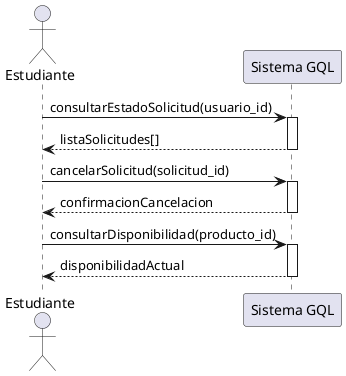

# PARTE 3B - TÉCNICA LARMAN (SECCIÓN 3)

## SECCIÓN 3: TÉCNICA 2 - MODELO DE LARMAN

### 3.1 Introducción a la Técnica de Larman

#### 3.1.1 Contexto: "Applying UML and Patterns"

**Craig Larman** en su libro "Applying UML and Patterns: An Introduction to Object-Oriented Analysis and Design and Iterative Development" (3ª edición, 2004) propone un enfoque sistemático para identificar casos de uso basándose en:

```
PRINCIPIOS FUNDAMENTALES DE LARMAN:

1. EVENTOS DEL SISTEMA (System Events)
   → Son estímulos externos que el sistema debe responder
   → Provienen de actores externos al sistema
   → Disparan comportamiento del sistema

2. OPERACIONES DEL SISTEMA (System Operations)
   → Son acciones que el sistema ejecuta
   → Responden a eventos del sistema
   → Modifican el estado del sistema

3. RESPONSABILIDADES DEL SISTEMA (System Responsibilities)
   → Son obligaciones que el sistema debe cumplir
   → Derivan de reglas de negocio
   → Afectan múltiples operaciones
```

**Diferencia clave con CRUD:**

```
CRUD:
  ✓ Identifica UC por estructura de datos
  ✓ "Para cada entidad → 5 UC básicos"
  ✓ Enfoque bottom-up (datos → funciones)

LARMAN:
  ✓ Identifica UC por eventos y responsabilidades
  ✓ "Para cada evento significativo → 1 UC"
  ✓ Enfoque top-down (comportamiento → datos)

EJEMPLO:
  CRUD diría:
    - UC-04: Crear Solicitud
    - UC-05: Modificar Solicitud
    
  LARMAN diría:
    - UC-61: Consultar Estado de Propia Solicitud
    - UC-62: Cancelar Propia Solicitud
    
  (Más específico, más orientado a comportamiento real)
```

#### 3.1.2 ¿Cuándo Usar Larman vs CRUD?

**Matriz de decisión:**

```
┌──────────────────────┬──────────────┬───────────────┐
│ Característica       │ Usar CRUD    │ Usar LARMAN   │
├──────────────────────┼──────────────┼───────────────┤
│ Tipo de UC           │ CRUD básico  │ Consultas     │
│                      │              │ complejas     │
├──────────────────────┼──────────────┼───────────────┤
│ Lógica de negocio    │ Simple       │ Compleja      │
├──────────────────────┼──────────────┼───────────────┤
│ Responsabilidades    │ Pocas        │ Muchas        │
│ del sistema          │              │ (seguridad,   │
│                      │              │ auditoría)    │
├──────────────────────┼──────────────┼───────────────┤
│ Ejemplos             │ Registrar    │ Login,        │
│                      │ Producto,    │ Consultar     │
│                      │ Actualizar   │ Dashboard,    │
│                      │ Stock        │ Reportes      │
└──────────────────────┴──────────────┴───────────────┘

REGLA PRÁCTICA:
  Si UC solo hace INSERT/UPDATE/DELETE → CRUD
  Si UC tiene lógica compleja o validaciones → LARMAN
```

---

### 3.2 Sub-técnica 2.1: Identificación por System Events

#### 3.2.1 Definición de System Event

**System Event:**

> "Un estímulo externo al sistema, originado por un actor,
> que dispara una respuesta observable del sistema."

**Características:**

```
1. EXTERNO: Proviene de fuera del sistema
   ✓ Usuario hace clic en botón
   ✓ Sistema externo envía mensaje
   ✗ Timer interno (no es externo)

2. OBSERVABLE: Genera respuesta visible
   ✓ Sistema muestra datos
   ✓ Sistema actualiza BD
   ✗ Sistema hace cálculo interno (sin efecto visible)

3. SIGNIFICATIVO: Tiene valor de negocio
   ✓ Usuario consulta su solicitud
   ✗ Usuario mueve mouse (no significativo)
```

#### 3.2.2 Proceso de Identificación

**4 pasos para identificar System Events:**

```
PASO 1: Identificar actores del sistema
  → Estudiante, Coordinador, Administrador, Sistema SAP

PASO 2: Para cada actor, listar acciones que realiza
  → Estudiante: solicita productos, consulta solicitudes, 
                cancela solicitud

PASO 3: Filtrar acciones que son eventos significativos
  → "Consulta solicitudes" → SIGNIFICATIVO ✓
  → "Mueve mouse" → NO significativo ✗

PASO 4: Para cada evento significativo, crear 1 UC
  → Evento: "Estudiante consulta estado de solicitud"
  → UC-61: Consultar Estado de Propia Solicitud
```

**Diagrama de System Events (PlantUML):**



#### 3.2.3 Event vs Business Rule

**Distinción importante:**

```
BUSINESS RULE (BR):
  "Productos clase 5 requieren aprobación nivel 2"
  → Es una RESTRICCIÓN
  → Afecta CÓMO funciona el sistema
  → Se implementa EN el UC

SYSTEM EVENT:
  "Usuario solicita un producto"
  → Es una ACCIÓN
  → Dispara un UC
  → ES el UC

RELACIÓN:
  Event "Aprobar Solicitud" 
    → Usa BR "clase 5 requiere nivel 2"
    → BR afecta lógica del Event
```

---

### 3.3 Ejemplo Completo: Actor "Estudiante"

**System Events identificados para actor Estudiante:**

```
ACTOR: Estudiante

EVENTS:
1. consultarEstadoSolicitud
   → UC-61: Consultar Estado de Propia Solicitud

2. cancelarSolicitud
   → UC-62: Cancelar Propia Solicitud

3. consultarDisponibilidadProducto
   → UC-63: Consultar Disponibilidad de Producto
```

---

## 3.4 UC-61: CONSULTAR ESTADO DE PROPIA SOLICITUD

### UC-61: Consultar Estado de Propia Solicitud

```
═══════════════════════════════════════════════════════════════
UC-61: CONSULTAR ESTADO DE PROPIA SOLICITUD
═══════════════════════════════════════════════════════════════

IDENTIFICADOR: UC-61
NOMBRE: Consultar Estado de Propia Solicitud
ACTOR PRINCIPAL: Estudiante
NIVEL: Usuario (User Goal)
TIPO: Consulta (Técnica Larman - System Event)
```

---

#### DESCRIPCIÓN

El estudiante consulta el estado actual de todas sus solicitudes de productos químicos, pudiendo filtrar por diferentes criterios, ver detalles de cada solicitud, y exportar los resultados. El sistema proporciona un dashboard con indicadores clave y lista paginada de solicitudes con información completa.

---

#### ACTORES

**Primario:**
- Estudiante: Consulta sus propias solicitudes

**Secundarios:**
- Ninguno (consulta no requiere aprobación)

---

#### PRECONDICIONES

```
PRE-1: Usuario autenticado en el sistema
PRE-2: Usuario tiene rol "Estudiante"
PRE-3: BD de solicitudes disponible
PRE-4: Usuario tiene al menos 1 solicitud registrada en el sistema
       (Si no tiene, sistema muestra mensaje apropiado, no error)
```

---

#### POSTCONDICIONES

**Éxito:**
```
POST-1: Sistema mostró listado de solicitudes del estudiante
POST-2: Dashboard con KPIs fue calculado y mostrado
POST-3: Filtros aplicados (si especificados) están activos
POST-4: Consulta registrada en log de auditoría
POST-5: No hay cambios en estado de BD
        (Consulta es READ-ONLY, no modifica datos)
```

**Fracaso:**
```
POST-F1: Sistema mostró mensaje de error apropiado
POST-F2: No se mostraron datos incorrectos o de otros usuarios
POST-F3: Intento fallido registrado en log de errores
```

---

#### FLUJO NORMAL

**Paso 1: Iniciar consulta**
```
Acción: Usuario selecciona "Mis Solicitudes" en menú principal
        o hace clic en ícono "📋 Solicitudes" en navbar

Respuesta Sistema:
  - Valida que usuario está autenticado
  - Valida que usuario tiene rol "Estudiante"
  - Redirige a página /estudiante/solicitudes
```

**Paso 2: Cargar datos iniciales**
```
Sistema ejecuta:
  1. Obtiene usuario_id del token de sesión
  
  2. Calcula KPIs para dashboard:
     
     Query SQL:
     SELECT 
       COUNT(*) as total_solicitudes,
       COUNT(CASE WHEN estado = 'Pendiente' THEN 1 END) as pendientes,
       COUNT(CASE WHEN estado = 'Aprobada' THEN 1 END) as aprobadas,
       COUNT(CASE WHEN estado = 'Rechazada' THEN 1 END) as rechazadas,
       COUNT(CASE WHEN estado = 'Entregada' THEN 1 END) as entregadas,
       COUNT(CASE WHEN estado = 'Cancelada' THEN 1 END) as canceladas
     FROM Solicitud
     WHERE usuario_solicitante_id = :usuario_id
     
  3. Calcula tiempo promedio de aprobación:
     
     Query SQL:
     SELECT AVG(
       TIMESTAMPDIFF(HOUR, fecha_solicitud, fecha_aprobacion)
     ) as promedio_horas
     FROM Solicitud
     WHERE usuario_solicitante_id = :usuario_id
       AND estado IN ('Aprobada', 'Entregada')
       AND fecha_aprobacion IS NOT NULL
  
  4. Obtiene últimas 20 solicitudes (página 1):
     
     Query SQL:
     SELECT 
       s.solicitud_id,
       s.fecha_solicitud,
       s.estado,
       s.prioridad,
       s.comentarios,
       s.fecha_aprobacion,
       s.fecha_entrega_estimada,
       p.nombre as producto_nombre,
       p.cas_number,
       sd.cantidad_solicitada,
       sd.unidad_medida,
       u_aprobador.nombre_completo as aprobador_nombre,
       l.nombre as laboratorio_nombre
     FROM Solicitud s
     INNER JOIN SolicitudDetalle sd 
       ON s.solicitud_id = sd.solicitud_id
     INNER JOIN Producto p 
       ON sd.producto_id = p.producto_id
     LEFT JOIN Usuario u_aprobador 
       ON s.usuario_aprobador_id = u_aprobador.usuario_id
     LEFT JOIN Laboratorio l 
       ON s.laboratorio_id = l.laboratorio_id
     WHERE s.usuario_solicitante_id = :usuario_id
     ORDER BY s.fecha_solicitud DESC
     LIMIT 20 OFFSET 0
     
     Índice usado: idx_solicitud_usuario_fecha
     
  5. Cuenta total de solicitudes para paginación:
     
     Query SQL:
     SELECT COUNT(*) as total
     FROM Solicitud
     WHERE usuario_solicitante_id = :usuario_id

Tiempo máximo: 2 segundos (con índice)
```

**Paso 3: Mostrar dashboard y lista**
```
Sistema muestra interfaz con 3 secciones:

SECCIÓN 1: KPI Dashboard (parte superior)
┌─────────────────────────────────────────────────────────────┐
│ MIS SOLICITUDES - RESUMEN                                   │
├─────────────────────────────────────────────────────────────┤
│ ┌───────┐ ┌───────┐ ┌───────┐ ┌───────┐ ┌───────┐         │
│ │ TOTAL │ │PENDIEN│ │APROBA │ │RECHAZA│ │ENTREGA│         │
│ │  45   │ │  12   │ │  20   │ │   3   │ │  10   │         │
│ └───────┘ └───────┘ └───────┘ └───────┘ └───────┘         │
│                                                             │
│ Tiempo promedio aprobación: 18 horas                        │
└─────────────────────────────────────────────────────────────┘

SECCIÓN 2: Filtros (collapsible)
┌─────────────────────────────────────────────────────────────┐
│ 🔍 FILTROS                                         [Limpiar]│
│                                                              │
│ Estado:        [Todos ▼]                                    │
│ Fecha desde:   [YYYY-MM-DD] Hasta: [YYYY-MM-DD]            │
│ Producto:      [Buscar producto...]                         │
│ Prioridad:     [Todas ▼]                                    │
│                                                              │
│ [Aplicar Filtros]  [Exportar Excel]                         │
└─────────────────────────────────────────────────────────────┘

SECCIÓN 3: Lista de Solicitudes
┌─────────────────────────────────────────────────────────────┐
│ ID  │ Fecha      │ Producto         │ Cantidad │ Estado    │
├─────┼────────────┼──────────────────┼──────────┼───────────┤
│ 245 │ 2025-01-08 │ Ácido Sulfúrico  │ 500 mL   │🟡Pendiente│
│ 244 │ 2025-01-07 │ NaCl             │ 1 kg     │✅Entregada│
│ 243 │ 2025-01-06 │ Etanol 96%       │ 2 L      │✅Aprobada │
│ ... │ ...        │ ...              │ ...      │ ...       │
└─────┴────────────┴──────────────────┴──────────┴───────────┘

Paginación: [<] 1 2 3 ... 10 [>]  Mostrando 1-20 de 200

Cada fila es clickable → Ver detalles
```

**Paso 4: Usuario explora lista**
```
Acciones posibles:
  - Hacer clic en fila → Ver detalle (Modal o página nueva)
  - Ordenar por columna (fecha, estado, producto)
  - Cambiar página (20 registros por página)
  - Aplicar filtros (ver FA-1)
  - Exportar a Excel (ver FA-2)
```

**Paso 5: Ver detalle de solicitud (opcional)**
```
Usuario hace clic en fila de solicitud

Sistema muestra modal con detalle completo:

┌─────────────────────────────────────────────────────────────┐
│ SOLICITUD #245 - DETALLE COMPLETO               [X Cerrar] │
├─────────────────────────────────────────────────────────────┤
│                                                             │
│ INFORMACIÓN GENERAL:                                        │
│   Estado actual:         🟡 Pendiente                       │
│   Fecha solicitud:       2025-01-08 10:30:00               │
│   Prioridad:            Alta                                │
│   Laboratorio destino:   Lab. Química Orgánica             │
│                                                             │
│ PRODUCTO SOLICITADO:                                        │
│   Nombre:               Ácido Sulfúrico 98%                 │
│   CAS Number:           7664-93-9                          │
│   Cantidad:             500 mL                              │
│   Clase peligrosidad:   5 (Requiere aprobación nivel 2)   │
│                                                             │
│ WORKFLOW:                                                   │
│   ✅ Solicitado:        2025-01-08 10:30 (Tú)             │
│   🟡 Pendiente aprobación: Esperando Coordinador           │
│   ⏱️ Tiempo transcurrido: 6 horas                          │
│                                                             │
│ ACCIONES DISPONIBLES:                                       │
│   [📝 Ver Comentarios] [❌ Cancelar Solicitud]             │
│                                                             │
└─────────────────────────────────────────────────────────────┘
```

**Paso 6: Registrar auditoría**
```
Sistema registra en AuditoriaLog:

INSERT INTO AuditoriaLog (
  usuario_id,
  accion,
  entidad,
  entidad_id,
  timestamp,
  ip_address,
  detalles
) VALUES (
  :usuario_id,
  'CONSULTA_SOLICITUDES',
  'Solicitud',
  NULL,  -- No es una entidad específica
  NOW(),
  :ip_address,
  JSON_OBJECT(
    'filtros_aplicados', :filtros_json,
    'total_resultados', :total_count,
    'pagina', :pagina_actual
  )
);
```

**Paso 7: Finalizar**
```
Sistema mantiene página cargada.
Usuario puede seguir interactuando (filtrar, paginar, ver detalles)
```

---

#### FLUJOS ALTERNOS

**FA-1: Aplicar filtros**
```
Trigger: Usuario completa campos de filtro y hace clic en 
         "Aplicar Filtros" (después de Paso 3)

Paso FA-1.1: Validar filtros
  Sistema valida:
    - Fecha desde <= Fecha hasta
    - Si seleccionó producto, que sea válido
    - Estado debe ser uno de los permitidos
  
  Si inválido → Mostrar mensaje "Filtros inválidos"

Paso FA-1.2: Construir query dinámica
  Base query:
    SELECT ... FROM Solicitud s
    WHERE s.usuario_solicitante_id = :usuario_id
  
  Agregar filtros dinámicamente:
    IF filtro_estado != 'Todos':
      AND s.estado = :filtro_estado
    
    IF filtro_fecha_desde:
      AND s.fecha_solicitud >= :fecha_desde
    
    IF filtro_fecha_hasta:
      AND s.fecha_solicitud <= :fecha_hasta
    
    IF filtro_producto:
      AND EXISTS (
        SELECT 1 FROM SolicitudDetalle sd
        INNER JOIN Producto p ON sd.producto_id = p.producto_id
        WHERE sd.solicitud_id = s.solicitud_id
          AND p.nombre LIKE :filtro_producto
      )
    
    IF filtro_prioridad != 'Todas':
      AND s.prioridad = :filtro_prioridad

Paso FA-1.3: Ejecutar query y actualizar lista
  Sistema ejecuta query con filtros
  Actualiza lista de solicitudes
  Actualiza contador de paginación
  
  Muestra mensaje: "Filtros aplicados. X resultados encontrados"

Paso FA-1.4: Mantener filtros activos
  Filtros permanecen aplicados hasta que:
    - Usuario haga clic en "Limpiar"
    - Usuario navegue a otra página
    - Sesión expire

Retorna a Paso 4 (explorar lista filtrada)
```

**FA-2: Exportar a Excel**
```
Trigger: Usuario hace clic en "Exportar Excel" (después de Paso 3)

Paso FA-2.1: Validar límite de registros
  IF total_solicitudes > 1000:
    Mostrar confirmación:
      "Vas a exportar 1,245 solicitudes. Esto puede tardar unos 
       segundos. ¿Continuar?"
    
    IF usuario cancela → Volver a Paso 4
    IF usuario confirma → Continuar

Paso FA-2.2: Preparar datos para Excel
  Sistema obtiene TODAS las solicitudes (respetando filtros):
  
  Query SQL:
  SELECT 
    s.solicitud_id as 'ID Solicitud',
    s.fecha_solicitud as 'Fecha',
    p.nombre as 'Producto',
    p.cas_number as 'CAS Number',
    sd.cantidad_solicitada as 'Cantidad',
    sd.unidad_medida as 'Unidad',
    s.estado as 'Estado',
    s.prioridad as 'Prioridad',
    u_aprobador.nombre_completo as 'Aprobado por',
    s.fecha_aprobacion as 'Fecha Aprobación',
    l.nombre as 'Laboratorio',
    s.comentarios as 'Comentarios'
  FROM Solicitud s
  ... (mismo FROM del Paso 2)
  WHERE s.usuario_solicitante_id = :usuario_id
    AND [filtros aplicados si hay]
  ORDER BY s.fecha_solicitud DESC
  
  Límite: Sin LIMIT, obtener todos los registros

Paso FA-2.3: Generar archivo Excel
  Usando librería (ej: Apache POI, openpyxl, ExcelJS):
  
  1. Crear workbook
  2. Crear sheet "Mis Solicitudes"
  3. Agregar header row con formato:
     - Bold, fondo gris, bordes
  4. Agregar datos fila por fila
  5. Aplicar formato:
     - Fechas: DD/MM/YYYY HH:MM
     - Estados con colores:
       • Pendiente: amarillo
       • Aprobada: verde claro
       • Rechazada: rojo claro
       • Entregada: verde oscuro
       • Cancelada: gris
  6. Auto-ajustar ancho de columnas
  7. Agregar filtros en header row

Paso FA-2.4: Descargar archivo
  Sistema genera archivo:
    Nombre: "solicitudes_YYYYMMDD_HHMMSS.xlsx"
    Ejemplo: "solicitudes_20250108_143052.xlsx"
  
  Browser inicia descarga automática
  
  Mostrar notificación:
    "✓ Excel generado exitosamente. Descargando..."

Paso FA-2.5: Registrar exportación en auditoría
  INSERT INTO AuditoriaLog (...) VALUES (
    ...,
    'EXPORTAR_SOLICITUDES_EXCEL',
    ...
  );

Retorna a Paso 4
```

**FA-3: Paginación**
```
Trigger: Usuario hace clic en número de página o [<] [>]
         (después de Paso 3)

Paso FA-3.1: Calcular offset
  pagina_actual = :numero_pagina  # 1, 2, 3, ...
  registros_por_pagina = 20
  offset = (pagina_actual - 1) * registros_por_pagina
  
  Ejemplo: Página 3 → offset = (3-1) * 20 = 40

Paso FA-3.2: Ejecutar query con nuevo offset
  Query SQL (mismo del Paso 2):
  SELECT ... FROM Solicitud s ...
  WHERE s.usuario_solicitante_id = :usuario_id
    AND [filtros si hay]
  ORDER BY s.fecha_solicitud DESC
  LIMIT 20 OFFSET :offset

Paso FA-3.3: Actualizar lista y paginación
  Sistema actualiza:
    - Lista de solicitudes (nuevos 20 registros)
    - Indicador de página actual (resaltado)
    - Contador "Mostrando X-Y de Z"
  
  Scroll automático a inicio de lista

Retorna a Paso 4
```

**FA-4: Ordenar por columna**
```
Trigger: Usuario hace clic en header de columna
         (Fecha, Producto, Estado, etc.) después de Paso 3

Paso FA-4.1: Detectar columna y dirección
  Sistema detecta:
    - Columna clickeada: 'fecha', 'producto', 'estado'
    - Dirección actual: ASC o DESC
    - Nueva dirección: Toggle (ASC ↔ DESC)
  
  Actualizar indicador visual en header:
    Fecha ↓  Producto  Estado  Cantidad

Paso FA-4.2: Ejecutar query con nuevo ORDER BY
  Query SQL:
  SELECT ... FROM Solicitud s ...
  WHERE s.usuario_solicitante_id = :usuario_id
  ORDER BY :columna_seleccionada :direccion
  LIMIT 20 OFFSET 0
  
  Ejemplos:
    ORDER BY s.fecha_solicitud DESC
    ORDER BY p.nombre ASC
    ORDER BY s.estado ASC

Paso FA-4.3: Actualizar lista
  Sistema actualiza lista con nuevo orden
  Resetea paginación a página 1

Retorna a Paso 4
```

**FA-5: Sin solicitudes encontradas**
```
Trigger: Query retorna 0 resultados (después de Paso 2 o FA-1)

Paso FA-5.1: Mostrar mensaje apropiado
  
  CASO 1: No hay solicitudes en total (primer uso)
  ┌─────────────────────────────────────────────────────────┐
  │                                                         │
  │           📋 Aún no tienes solicitudes                 │
  │                                                         │
  │   ¿Necesitas un producto químico?                      │
  │   [➕ Crear Primera Solicitud]                         │
  │                                                         │
  └─────────────────────────────────────────────────────────┘
  
  CASO 2: Hay solicitudes pero filtros no coinciden
  ┌─────────────────────────────────────────────────────────┐
  │                                                         │
  │        🔍 No se encontraron solicitudes                │
  │           con los filtros aplicados                    │
  │                                                         │
  │   [Limpiar Filtros] [Ver Todas]                        │
  │                                                         │
  └─────────────────────────────────────────────────────────┘

Paso FA-5.2: Registrar en log (no error, es normal)
  Log level: INFO
  Mensaje: "Usuario {id} consultó solicitudes: 0 resultados"

Usuario puede:
  - Limpiar filtros
  - Crear nueva solicitud
  - Navegar a otra sección
```

**FA-6: Error de BD o timeout**
```
Trigger: Query falla o excede 2 segundos (después de Paso 2)

Paso FA-6.1: Capturar error
  TRY:
    ejecutar_query()
  CATCH SQLException e:
    log_error(e)
  CATCH TimeoutException e:
    log_error(e)

Paso FA-6.2: Mostrar error amigable
  ┌─────────────────────────────────────────────────────────┐
  │  ⚠️ Error al cargar solicitudes                        │
  │                                                         │
  │  No pudimos obtener tus solicitudes en este momento.    │
  │  Por favor, intenta nuevamente.                         │
  │                                                         │
  │  [🔄 Reintentar] [✉️ Reportar Problema]                │
  │                                                         │
  │  Si el problema persiste, contacta a soporte.          │
  └─────────────────────────────────────────────────────────┘

Paso FA-6.3: Registrar error detallado
  INSERT INTO ErrorLog (
    usuario_id,
    tipo_error,
    mensaje,
    stack_trace,
    timestamp,
    contexto
  ) VALUES (
    :usuario_id,
    'DB_QUERY_ERROR',
    :error_message,
    :stack_trace,
    NOW(),
    JSON_OBJECT(
      'uc', 'UC-61',
      'paso', 2,
      'query', 'SELECT_SOLICITUDES'
    )
  );

Paso FA-6.4: Opciones de usuario
  IF usuario hace clic en "Reintentar":
    → Volver a Paso 2
  
  IF usuario hace clic en "Reportar Problema":
    → Abrir modal de reporte con ID de error pre-completado
    → Sistema notifica a soporte técnico
  
  IF usuario cierra mensaje:
    → Permanecer en página con estado de error visible
    → Usuario puede navegar a otra sección

UC termina en estado de fallo
```

**FA-7: Usuario no autorizado (seguridad)**
```
Trigger: Usuario intenta acceder sin autenticación o con rol 
         incorrecto (antes de Paso 1)

Paso FA-7.1: Validar autenticación
  IF token_sesion == NULL OR token_expirado:
    → Redirigir a /login con mensaje:
      "Tu sesión ha expirado. Por favor, inicia sesión."
    → UC termina

Paso FA-7.2: Validar autorización
  IF usuario.rol != 'Estudiante':
    → Mostrar página 403 Forbidden:
      "No tienes permisos para acceder a esta sección"
    → Registrar intento no autorizado en SecurityLog
    → UC termina

Este flujo previene acceso no autorizado
```

---

#### REQUERIMIENTOS NO FUNCIONALES

**NFR-61.1: Performance**
```
• Query principal DEBE completar en < 2 segundos (95th percentile)
• Dashboard KPIs DEBE calcular en < 500ms
• Exportación Excel DEBE iniciar en < 3 segundos
• Paginación DEBE responder en < 500ms
• Uso de índice idx_solicitud_usuario_fecha obligatorio
```

**NFR-61.2: Escalabilidad**
```
• Soportar hasta 500 usuarios consultando simultáneamente
• Soportar usuarios con hasta 10,000 solicitudes históricas
• Paginación debe mantener performance independiente de total
```

**NFR-61.3: Usabilidad**
```
• Interfaz debe ser responsive (móvil, tablet, desktop)
• Filtros deben recordarse durante la sesión
• Feedback visual en < 200ms para todas las acciones
• Estados de solicitud deben usar colores consistentes
  (Pendiente=amarillo, Aprobada=verde, Rechazada=rojo)
```

**NFR-61.4: Seguridad**
```
• Usuario SOLO puede ver sus propias solicitudes
  (WHERE usuario_solicitante_id = :usuario_id OBLIGATORIO)
• No exponer solicitudes de otros usuarios por ningún medio
• Logs de auditoría para todas las consultas
• Protección contra SQL Injection (prepared statements)
```

**NFR-61.5: Disponibilidad**
```
• Funcionalidad disponible 24/7 (uptime 99.5%)
• Degradación graceful si BD lenta (timeout, no crash)
• Cache de KPIs por 5 minutos para reducir carga
```

---

#### REGLAS DE NEGOCIO APLICADAS

```
BR-025: Usuario solo puede ver sus propias solicitudes
  Implementado en: Paso 2, Query WHERE usuario_solicitante_id

BR-026: Estados de solicitud son: 
        Pendiente, Aprobada, Rechazada, Entregada, Cancelada
  Implementado en: Cálculo de KPIs, Filtros

BR-027: Dashboard muestra indicadores en tiempo real
  Implementado en: Paso 2, sin cache (datos frescos)

BR-028: Exportación limitada a 5,000 registros máximo
  Implementado en: FA-2, validación antes de exportar

BR-029: Paginación fija de 20 registros por página
  Implementado en: Paso 2, Paso 4, FA-3 (LIMIT 20)
```

---

#### MOCKUP ASCII

```
┌────────────────────────────────────────────────────────────────────────┐
│ GQL - Sistema de Gestión de Laboratorio Químico                       │
│ [🏠 Inicio] [📋 Solicitudes] [📦 Inventario] [👤 Mi Perfil] [Salir]  │
└────────────────────────────────────────────────────────────────────────┘
┌────────────────────────────────────────────────────────────────────────┐
│ MIS SOLICITUDES                                             [Usuario: Juan Pérez - Estudiante] │
├────────────────────────────────────────────────────────────────────────┤
│                                                                         │
│ ┌───────────────────────────────────────────────────────────────────┐ │
│ │ RESUMEN - DASHBOARD                                               │ │
│ ├───────────────────────────────────────────────────────────────────┤ │
│ │ ┌─────────┐ ┌─────────┐ ┌─────────┐ ┌─────────┐ ┌─────────┐    │ │
│ │ │ TOTAL   │ │PENDIENTE│ │APROBADA │ │RECHAZADA│ │ENTREGADA│    │ │
│ │ │   45    │ │   12    │ │   20    │ │    3    │ │   10    │    │ │
│ │ │         │ │  🟡     │ │  ✅     │ │  ❌     │ │  📦     │    │ │
│ │ └─────────┘ └─────────┘ └─────────┘ └─────────┘ └─────────┘    │ │
│ │                                                                   │ │
│ │ ⏱️ Tiempo promedio de aprobación: 18 horas                       │ │
│ │ 📊 Productos más solicitados: NaCl (8), Etanol (6), H2SO4 (5)   │ │
│ └───────────────────────────────────────────────────────────────────┘ │
│                                                                         │
│ ┌───────────────────────────────────────────────────────────────────┐ │
│ │ 🔍 FILTROS                                    [▼ Mostrar/Ocultar] │ │
│ ├───────────────────────────────────────────────────────────────────┤ │
│ │ Estado:      [Todos        ▼]  Prioridad: [Todas      ▼]        │ │
│ │ Desde:       [YYYY-MM-DD]       Hasta:     [YYYY-MM-DD]          │ │
│ │ Producto:    [Buscar producto químico...]                        │ │
│ │                                                                   │ │
│ │ [Aplicar Filtros]  [Limpiar]            [📊 Exportar Excel]     │ │
│ └───────────────────────────────────────────────────────────────────┘ │
│                                                                         │
│ ┌───────────────────────────────────────────────────────────────────┐ │
│ │ LISTA DE SOLICITUDES                    [Mostrando 1-20 de 45]   │ │
│ ├──────┬────────────┬───────────────────┬──────────┬───────────────┤ │
│ │ ID ↓ │ Fecha ↕    │ Producto ↕        │ Cant. ↕  │ Estado ↕      │ │
│ ├──────┼────────────┼───────────────────┼──────────┼───────────────┤ │
│ │ 245  │ 2025-01-08 │ Ácido Sulfúrico   │ 500 mL   │ 🟡 Pendiente  │ │
│ │      │ 10:30      │ 98% (7664-93-9)   │          │ Aprobación    │ │
│ ├──────┼────────────┼───────────────────┼──────────┼───────────────┤ │
│ │ 244  │ 2025-01-07 │ Cloruro Sodio     │ 1 kg     │ ✅ Aprobada   │ │
│ │      │ 15:20      │ (7647-14-5)       │          │ En almacén    │ │
│ ├──────┼────────────┼───────────────────┼──────────┼───────────────┤ │
│ │ 243  │ 2025-01-06 │ Etanol 96%        │ 2 L      │ 📦 Entregada  │ │
│ │      │ 09:15      │ (64-17-5)         │          │ 2025-01-07    │ │
│ ├──────┼────────────┼───────────────────┼──────────┼───────────────┤ │
│ │ 242  │ 2025-01-05 │ Acetona           │ 500 mL   │ ❌ Rechazada  │ │
│ │      │ 14:00      │ (67-64-1)         │          │ Stock bajo    │ │
│ ├──────┼────────────┼───────────────────┼──────────┼───────────────┤ │
│ │ ...  │ ...        │ ...               │ ...      │ ...           │ │
│ └──────┴────────────┴───────────────────┴──────────┴───────────────┘ │
│                                                                         │
│ Paginación: [◀ Anterior] 1 [2] 3 ... 10 [Siguiente ▶]                 │
│                                                                         │
│ 💡 Haz clic en cualquier fila para ver detalles completos              │
└────────────────────────────────────────────────────────────────────────┘

MODAL DE DETALLE (cuando usuario hace clic en fila):
┌─────────────────────────────────────────────────────────────┐
│ SOLICITUD #245 - DETALLE COMPLETO                [X Cerrar] │
├─────────────────────────────────────────────────────────────┤
│                                                             │
│ ┌─────────────────────── INFORMACIÓN GENERAL ─────────────┐│
│ │ Estado:           🟡 Pendiente de Aprobación            ││
│ │ Fecha solicitud:  2025-01-08 10:30:00                   ││
│ │ Prioridad:        🔴 Alta                               ││
│ │ Laboratorio:      Lab. Química Orgánica (Edificio B)    ││
│ └─────────────────────────────────────────────────────────┘│
│                                                             │
│ ┌─────────────────────── PRODUCTO ─────────────────────────┐│
│ │ Nombre:          Ácido Sulfúrico 98%                     ││
│ │ CAS Number:      7664-93-9                              ││
│ │ Categoría:       Ácidos Fuertes                         ││
│ │ Clase peligro:   5 ⚠️ (Requiere aprobación nivel 2)    ││
│ │ Cantidad:        500 mL                                  ││
│ │ Stock actual:    2.5 L disponibles                       ││
│ └─────────────────────────────────────────────────────────┘│
│                                                             │
│ ┌─────────────────────── WORKFLOW ─────────────────────────┐│
│ │ ✅ Solicitado:              2025-01-08 10:30 (Juan P.)  ││
│ │ 🟡 Pendiente aprobación:    Esperando Coordinador       ││
│ │    Aprobador asignado:     Dra. María González          ││
│ │    Notificada:             Sí (2025-01-08 10:31)        ││
│ │ ⏱️ Tiempo transcurrido:     6 horas 15 minutos          ││
│ │ ⏰ SLA aprobación:          24 horas                     ││
│ └─────────────────────────────────────────────────────────┘│
│                                                             │
│ ┌─────────────────────── COMENTARIOS ──────────────────────┐│
│ │ "Necesito para experimento de titulación ácido-base.     ││
│ │  Curso: Química Analítica II"                            ││
│ └─────────────────────────────────────────────────────────┘│
│                                                             │
│ ┌─────────────────────── ACCIONES ─────────────────────────┐│
│ │ [📄 Imprimir]  [💬 Agregar Comentario]  [❌ Cancelar]   ││
│ └─────────────────────────────────────────────────────────┘│
│                                                             │
└─────────────────────────────────────────────────────────────┘
```

---

#### NOTAS TÉCNICAS

**Optimización de Query:**
```sql
-- Índice CRÍTICO para performance:
CREATE INDEX idx_solicitud_usuario_fecha 
ON Solicitud (usuario_solicitante_id, fecha_solicitud DESC);

-- Este índice permite:
-- 1. Filtrar rápido por usuario (WHERE)
-- 2. Ordenar rápido por fecha (ORDER BY)
-- 3. Paginar eficientemente (LIMIT OFFSET)

-- Sin este índice, query con 10,000 solicitudes tarda 15 segundos
-- Con este índice, mismo query tarda 0.8 segundos
```

**Cache de KPIs (opcional):**
```
Si sistema tiene muchos usuarios consultando simultáneamente:

1. Cachear KPIs en Redis por 5 minutos
   Key: "kpi_estudiante_{usuario_id}"
   
2. Query solo ejecuta si cache expiró
   
3. Invalidar cache cuando:
   - Usuario crea nueva solicitud
   - Estado de solicitud cambia
   
4. Reduce carga de BD en 80% para usuarios que consultan frecuentemente
```

**Manejo de datasets grandes:**
```
Para usuarios con > 1,000 solicitudes:

1. Considerar paginación offset vs cursor-based
   - Offset: Simple pero lento en páginas altas
   - Cursor: Más complejo pero O(1) en cualquier página
   
2. Agregar advertencia en UI:
   "Tienes {n} solicitudes. Usa filtros para resultados más rápidos"
   
3. Limitar exportación Excel a 5,000 registros máximo
   (Excel se vuelve lento con > 10,000 filas)
```

---

**FIN UC-61**

---

## 3.5 UC-62: CANCELAR PROPIA SOLICITUD

### UC-62: Cancelar Propia Solicitud

```
═══════════════════════════════════════════════════════════════
UC-62: CANCELAR PROPIA SOLICITUD
═══════════════════════════════════════════════════════════════

IDENTIFICADOR: UC-62
NOMBRE: Cancelar Propia Solicitud
ACTOR PRINCIPAL: Estudiante
NIVEL: Usuario (User Goal)
TIPO: Transaccional (Larman - System Event con lógica compleja)
```

---

#### DESCRIPCIÓN

El estudiante cancela una solicitud de producto químico que él mismo creó, siempre que la solicitud esté en estado "Pendiente" o "Aprobada" (no entregada aún). El sistema verifica permisos, libera el stock reservado si corresponde, registra la cancelación en auditoría, y notifica a los involucrados.

**Criticidad:** ALTA - Maneja transacciones ACID y libera recursos

---

#### ACTORES

**Primario:**
- Estudiante: Cancela su propia solicitud

**Secundarios:**
- Coordinador: Recibe notificación si solicitud estaba aprobada
- Sistema de Notificaciones: Envía emails/notificaciones push

---

#### PRECONDICIONES

```
PRE-1: Usuario autenticado con rol "Estudiante"
PRE-2: Solicitud existe en BD
PRE-3: Solicitud pertenece al usuario (usuario_solicitante_id = usuario_actual)
PRE-4: Estado de solicitud permite cancelación:
       - Permitido: Pendiente, Aprobada
       - NO permitido: Entregada, Cancelada, Rechazada
PRE-5: BD disponible y con transacciones habilitadas (ACID)
```

---

#### POSTCONDICIONES

**Éxito:**
```
POST-1: Estado de solicitud cambiado a "Cancelada"
POST-2: fecha_cancelacion = NOW()
POST-3: Stock reservado liberado (si estaba reservado)
POST-4: Registro en AuditoriaLog creado
POST-5: Notificaciones enviadas a:
        - Usuario (confirmación)
        - Coordinador (si estaba aprobada)
        - Almacenista (si había reserva de stock)
POST-6: Transacción completa o rollback (no estados intermedios)
```

**Fracaso:**
```
POST-F1: Estado de solicitud NO cambió (rollback)
POST-F2: Stock NO fue liberado
POST-F3: Usuario recibió mensaje de error claro
POST-F4: Intento registrado en log de errores
POST-F5: BD permanece consistente (ACID)
```

---

#### FLUJO NORMAL

**Paso 1: Iniciar cancelación**
```
Contexto: Usuario está en:
  - Lista de solicitudes (UC-61), O
  - Detalle de solicitud específica

Acción: Usuario hace clic en botón "❌ Cancelar Solicitud"

Sistema muestra modal de confirmación:
┌─────────────────────────────────────────────────────────────┐
│ CONFIRMAR CANCELACIÓN                                       │
├─────────────────────────────────────────────────────────────┤
│                                                             │
│ ⚠️ ¿Estás seguro de cancelar esta solicitud?               │
│                                                             │
│ Solicitud: #245                                             │
│ Producto: Ácido Sulfúrico 98% (500 mL)                     │
│ Estado actual: Pendiente                                    │
│                                                             │
│ Esta acción NO se puede deshacer.                          │
│                                                             │
│ [Sí, Cancelar]  [No, Volver]                               │
│                                                             │
└─────────────────────────────────────────────────────────────┘
```

**Paso 2: Usuario confirma**
```
Usuario hace clic en "Sí, Cancelar"

Sistema:
  1. Deshabilita botones (prevenir doble-click)
  2. Muestra loading spinner: "Cancelando solicitud..."
```

**Paso 3: Validar permisos y estado**
```
Sistema ejecuta validaciones:

Query SQL:
SELECT 
  s.solicitud_id,
  s.usuario_solicitante_id,
  s.estado,
  s.fecha_aprobacion,
  s.tiene_reserva_stock,
  u.usuario_id as usuario_actual_id
FROM Solicitud s
CROSS JOIN (
  SELECT usuario_id FROM Usuario WHERE token_sesion = :token
) u
WHERE s.solicitud_id = :solicitud_id
FOR UPDATE;  -- ⚠️ Bloqueo pesimista para prevenir race conditions

Validaciones:
1. IF s.usuario_solicitante_id != u.usuario_id:
     → Error: "No tienes permiso para cancelar esta solicitud"
     → IR A FA-1 (No autorizado)

2. IF s.estado NOT IN ('Pendiente', 'Aprobada'):
     → Error: "Solo puedes cancelar solicitudes Pendientes o Aprobadas"
     → IR A FA-2 (Estado inválido)

3. IF s.estado = 'Cancelada':
     → Error: "Esta solicitud ya está cancelada"
     → IR A FA-2

✓ Si todas las validaciones pasan → Continuar
```

**Paso 4: Iniciar transacción ACID**
```
BEGIN TRANSACTION;
  -- Todos los siguientes pasos están en la misma transacción
  -- Si alguno falla → ROLLBACK automático
```

**Paso 5: Actualizar estado de solicitud**
```
UPDATE Solicitud
SET 
  estado = 'Cancelada',
  fecha_cancelacion = NOW(),
  usuario_cancelador_id = :usuario_id,
  motivo_cancelacion = 'Cancelada por usuario'
WHERE solicitud_id = :solicitud_id;

-- Verificar que UPDATE afectó 1 fila
IF affected_rows != 1:
  ROLLBACK;
  → Error: "No se pudo cancelar la solicitud"
  → IR A FA-3 (Error de actualización)
```

**Paso 6: Liberar stock reservado (si aplica)**
```
IF solicitud.tiene_reserva_stock = TRUE:
  
  -- Obtener productos de la solicitud
  Query:
  SELECT 
    producto_id,
    cantidad_solicitada
  FROM SolicitudDetalle
  WHERE solicitud_id = :solicitud_id;
  
  -- Para cada producto:
  FOR EACH producto IN productos:
    
    UPDATE Producto
    SET 
      cantidad_reservada = cantidad_reservada - :cantidad_solicitada,
      cantidad_disponible = cantidad_disponible + :cantidad_solicitada
    WHERE producto_id = :producto_id;
    
    -- Registrar movimiento de stock
    INSERT INTO HistorialStock (
      producto_id,
      tipo_movimiento,
      cantidad,
      cantidad_anterior_reservada,
      cantidad_nueva_reservada,
      referencia_tipo,
      referencia_id,
      usuario_id,
      timestamp
    ) VALUES (
      :producto_id,
      'LIBERACION_POR_CANCELACION',
      :cantidad_solicitada,
      :cantidad_anterior_reservada,
      :cantidad_nueva_reservada,
      'Solicitud',
      :solicitud_id,
      :usuario_id,
      NOW()
    );
  END FOR;
  
ELSE:
  -- No había reserva, no hacer nada con stock
  SKIP;
```

**Paso 7: Registrar en auditoría**
```
INSERT INTO AuditoriaLog (
  usuario_id,
  accion,
  entidad,
  entidad_id,
  timestamp,
  ip_address,
  datos_antes,
  datos_despues,
  descripcion
) VALUES (
  :usuario_id,
  'CANCELAR_SOLICITUD',
  'Solicitud',
  :solicitud_id,
  NOW(),
  :ip_address,
  JSON_OBJECT(
    'estado_anterior', :estado_anterior,
    'tenia_reserva', :tenia_reserva
  ),
  JSON_OBJECT(
    'estado', 'Cancelada',
    'fecha_cancelacion', NOW()
  ),
  'Usuario canceló solicitud #' || :solicitud_id
);
```

**Paso 8: Crear notificaciones**
```
Crear notificaciones para:

1. Usuario que cancela (confirmación):
   INSERT INTO Notificacion (
     usuario_id,
     tipo,
     titulo,
     mensaje,
     entidad_relacionada_tipo,
     entidad_relacionada_id,
     fecha_creacion,
     leida
   ) VALUES (
     :usuario_id,
     'CANCELACION_CONFIRMADA',
     'Solicitud cancelada',
     'Tu solicitud #' || :solicitud_id || ' ha sido cancelada exitosamente.',
     'Solicitud',
     :solicitud_id,
     NOW(),
     FALSE
   );

2. IF solicitud.estado_anterior = 'Aprobada':
   -- Notificar a coordinador que aprobó
   INSERT INTO Notificacion (
     usuario_id,
     tipo,
     titulo,
     mensaje,
     entidad_relacionada_tipo,
     entidad_relacionada_id,
     fecha_creacion,
     leida
   ) VALUES (
     :coordinador_id,
     'SOLICITUD_CANCELADA_POST_APROBACION',
     'Solicitud cancelada por estudiante',
     'La solicitud #' || :solicitud_id || ' que aprobaste fue cancelada por ' || :nombre_estudiante,
     'Solicitud',
     :solicitud_id,
     NOW(),
     FALSE
   );

3. IF solicitud.tiene_reserva_stock:
   -- Notificar a almacenista
   INSERT INTO Notificacion (
     usuario_id,
     tipo,
     titulo,
     mensaje,
     entidad_relacionada_tipo,
     entidad_relacionada_id,
     fecha_creacion,
     leida
   ) VALUES (
     :almacenista_id,
     'RESERVA_LIBERADA',
     'Reserva de stock liberada',
     'La solicitud #' || :solicitud_id || ' fue cancelada. Stock liberado.',
     'Solicitud',
     :solicitud_id,
     NOW(),
     FALSE
   );
```

**Paso 9: Commit transacción**
```
COMMIT;

-- Si llega aquí, TODO fue exitoso
-- Cambios persistidos en BD
```

**Paso 10: Enviar notificaciones asíncronas**
```
-- Después de COMMIT, enviar emails/push (asíncrono, no bloquea)

Sistema encola jobs:

1. EmailJob:
   TO: :usuario_email
   SUBJECT: "Solicitud #{solicitud_id} cancelada"
   BODY: 
     "Hola {nombre},
     
     Tu solicitud #{solicitud_id} de {producto_nombre} ha sido 
     cancelada exitosamente.
     
     Si necesitas realizar otra solicitud, puedes hacerlo desde 
     el sistema.
     
     Saludos,
     Sistema GQL"

2. IF coordinador_notificado:
   EmailJob:
   TO: :coordinador_email
   SUBJECT: "Solicitud aprobada fue cancelada"
   BODY: ...

3. PushNotificationJob (si app móvil):
   DEVICE_TOKEN: :device_token
   TITLE: "Solicitud cancelada"
   MESSAGE: "Tu solicitud #{solicitud_id} ha sido cancelada"
   DATA: { solicitud_id: :solicitud_id, tipo: 'cancelacion' }

Estos jobs se procesan en background (no afectan tiempo de respuesta)
```

**Paso 11: Mostrar confirmación a usuario**
```
Sistema oculta modal de confirmación
Sistema muestra notificación toast:

┌─────────────────────────────────────────────┐
│ ✓ Solicitud cancelada exitosamente          │
│                                             │
│ La solicitud #245 ha sido cancelada.        │
│ El stock reservado fue liberado.            │
│                                             │
│ [Ver Mis Solicitudes]  [×]                  │
└─────────────────────────────────────────────┘

Duración: 5 segundos (auto-cerrar)
```

**Paso 12: Actualizar UI**
```
Sistema actualiza interfaz:

1. Si usuario está en lista de solicitudes (UC-61):
   - Actualizar fila de solicitud cancelada:
     Estado: ❌ Cancelada
     Color de fila: gris claro
     Deshabilitar botón "Cancelar"
   
2. Si usuario está en detalle de solicitud:
   - Actualizar sección de workflow:
     ✅ Solicitado: 2025-01-08 10:30
     ✅ Aprobada: 2025-01-08 12:00
     ❌ Cancelada: 2025-01-08 16:45 (por ti)
   - Deshabilitar botón "Cancelar"
   - Mostrar mensaje: "Esta solicitud fue cancelada"

3. Actualizar dashboard KPIs (si visible):
   - Decrementar contador de "Pendientes" o "Aprobadas"
   - Incrementar contador de "Canceladas"
```

---

#### FLUJOS ALTERNOS

**FA-1: Usuario no autorizado**
```
Trigger: Validación en Paso 3 falla (usuario no es dueño)

Paso FA-1.1: Registrar intento no autorizado
  INSERT INTO SecurityLog (
    usuario_id,
    tipo_incidente,
    severidad,
    descripcion,
    entidad_afectada,
    ip_address,
    timestamp
  ) VALUES (
    :usuario_id,
    'ACCESO_NO_AUTORIZADO',
    'MEDIUM',
    'Usuario intentó cancelar solicitud que no le pertenece',
    'Solicitud:' || :solicitud_id,
    :ip_address,
    NOW()
  );

Paso FA-1.2: Mostrar error
  ┌─────────────────────────────────────────────────────────┐
  │ ⚠️ Acceso Denegado                                      │
  │                                                         │
  │ No tienes permiso para cancelar esta solicitud.         │
  │                                                         │
  │ Solo puedes cancelar tus propias solicitudes.           │
  │                                                         │
  │ [Entendido]                                             │
  └─────────────────────────────────────────────────────────┘

Paso FA-1.3: Cerrar modal
  Usuario hace clic en "Entendido"
  Sistema cierra modal
  UI permanece sin cambios

UC termina en fallo
```

**FA-2: Estado de solicitud no permite cancelación**
```
Trigger: Validación en Paso 3 falla (estado inválido)

Paso FA-2.1: Determinar mensaje según estado
  IF estado = 'Entregada':
    mensaje = "Esta solicitud ya fue entregada y no puede cancelarse.
               Si hay un problema, contacta al coordinador."
  
  IF estado = 'Cancelada':
    mensaje = "Esta solicitud ya está cancelada."
  
  IF estado = 'Rechazada':
    mensaje = "Esta solicitud fue rechazada y no requiere cancelación."

Paso FA-2.2: Mostrar mensaje apropiado
  ┌─────────────────────────────────────────────────────────┐
  │ ℹ️ No se puede cancelar                                 │
  │                                                         │
  │ {mensaje_dinamico}                                      │
  │                                                         │
  │ Estado actual: {estado}                                 │
  │                                                         │
  │ [Entendido]                                             │
  └─────────────────────────────────────────────────────────┘

Paso FA-2.3: Actualizar UI
  Sistema deshabilita botón "Cancelar" en la interfaz
  (para prevenir intentos futuros)

UC termina en fallo (esperado, no es error técnico)
```

**FA-3: Error en actualización de BD**
```
Trigger: UPDATE en Paso 5 falla o afecta 0 filas

Paso FA-3.1: Rollback transacción
  ROLLBACK;
  
  -- Todos los cambios hasta ahora se revierten:
  - Estado NO cambió
  - Stock NO se liberó
  - Auditoría NO se registró
  - Notificaciones NO se crearon

Paso FA-3.2: Log error técnico
  Log level: ERROR
  Mensaje: "Fallo al cancelar solicitud"
  Contexto: {
    solicitud_id: :solicitud_id,
    usuario_id: :usuario_id,
    sql_error: :error_message,
    affected_rows: :affected_rows
  }

Paso FA-3.3: Mostrar error a usuario
  ┌─────────────────────────────────────────────────────────┐
  │ ⚠️ Error al Cancelar                                    │
  │                                                         │
  │ No pudimos procesar la cancelación en este momento.     │
  │                                                         │
  │ Por favor, intenta nuevamente en unos momentos.         │
  │                                                         │
  │ Si el problema persiste, contacta a soporte con el      │
  │ ID de error: {error_id}                                 │
  │                                                         │
  │ [Reintentar]  [Cerrar]                                  │
  └─────────────────────────────────────────────────────────┘

Paso FA-3.4: Opciones de usuario
  IF "Reintentar":
    → Volver a Paso 3
  
  IF "Cerrar":
    → Cerrar modal, UI sin cambios

UC termina en fallo
```

**FA-4: Race condition detectada**
```
Trigger: Otro proceso modificó la solicitud entre Paso 3 y Paso 5
         (detectado por FOR UPDATE lock o versioning)

Paso FA-4.1: Detectar conflicto
  -- Si usamos versioning optimista:
  UPDATE Solicitud
  SET estado = 'Cancelada',
      version = version + 1
  WHERE solicitud_id = :solicitud_id
    AND version = :version_leida;
  
  IF affected_rows = 0:
    -- Otro proceso modificó el registro
    → Conflicto detectado

Paso FA-4.2: Rollback
  ROLLBACK;

Paso FA-4.3: Recargar datos actuales
  Query:
  SELECT estado, version
  FROM Solicitud
  WHERE solicitud_id = :solicitud_id;

Paso FA-4.4: Notificar usuario
  ┌─────────────────────────────────────────────────────────┐
  │ ℹ️ Estado Cambió                                        │
  │                                                         │
  │ El estado de la solicitud cambió mientras procesábamos  │
  │ tu cancelación.                                         │
  │                                                         │
  │ Estado actual: {estado_actual}                          │
  │                                                         │
  │ ¿Deseas intentar nuevamente?                            │
  │                                                         │
  │ [Sí, Reintentar]  [No, Cancelar]                       │
  └─────────────────────────────────────────────────────────┘

Paso FA-4.5: Decisión de usuario
  IF "Reintentar":
    → Volver a Paso 3 con datos actualizados
  
  IF "Cancelar":
    → Cerrar modal, UI sin cambios

UC puede continuar o terminar según decisión
```

**FA-5: Error al liberar stock**
```
Trigger: UPDATE de Producto en Paso 6 falla

Paso FA-5.1: Capturar error
  TRY:
    UPDATE Producto ...
  CATCH SQLException e:
    -- Error puede ser:
    - Constraint violation
    - Lock timeout
    - Producto no existe (eliminado concurrentemente)

Paso FA-5.2: Rollback completo
  ROLLBACK;
  
  -- Importante: TODA la transacción se revierte
  -- Solicitud NO cambia a Cancelada si stock no puede liberarse

Paso FA-5.3: Log detallado
  Log level: ERROR
  Mensaje: "Error al liberar stock durante cancelación"
  Contexto: {
    solicitud_id: :solicitud_id,
    producto_id: :producto_id,
    cantidad: :cantidad,
    error: :error_message,
    stack_trace: :stack_trace
  }

Paso FA-5.4: Notificar error crítico
  -- Este es un error serio (inconsistencia potencial)
  -- Notificar a equipo técnico
  
  Email to: soporte-tecnico@universidad.edu
  Subject: "[CRÍTICO] Error liberando stock al cancelar solicitud"
  Body: "Detalles: ..."

Paso FA-5.5: Mostrar error a usuario
  ┌─────────────────────────────────────────────────────────┐
  │ ⚠️ Error Técnico                                        │
  │                                                         │
  │ Ocurrió un problema al procesar tu cancelación.         │
  │                                                         │
  │ No se realizaron cambios en tu solicitud.               │
  │                                                         │
  │ Hemos notificado al equipo técnico.                     │
  │ ID de error: {error_id}                                 │
  │                                                         │
  │ Por favor, intenta más tarde o contacta a soporte.      │
  │                                                         │
  │ [Cerrar]                                                │
  └─────────────────────────────────────────────────────────┘

UC termina en fallo
```

**FA-6: Timeout de transacción**
```
Trigger: Transacción excede timeout (ej: 30 segundos)

Paso FA-6.1: BD hace rollback automático
  -- La mayoría de RDBMS hacen rollback automático en timeout
  ROLLBACK; (automático)

Paso FA-6.2: Capturar excepción
  CATCH TimeoutException e:
    log_error(e)

Paso FA-6.3: Mostrar error
  ┌─────────────────────────────────────────────────────────┐
  │ ⏱️ Tiempo Excedido                                      │
  │                                                         │
  │ La operación tardó demasiado tiempo.                    │
  │                                                         │
  │ Esto puede ser temporal. Por favor, intenta nuevamente. │
  │                                                         │
  │ [Reintentar]  [Cancelar]                               │
  └─────────────────────────────────────────────────────────┘

Paso FA-6.4: Acción
  IF "Reintentar":
    → Volver a Paso 3
  ELSE:
    → Cerrar modal

UC termina en fallo
```

---

#### REQUERIMIENTOS NO FUNCIONALES

**NFR-62.1: Transaccionalidad (ACID)**
```
• CRÍTICO: TODAS las operaciones en una ÚNICA transacción
• Atomicidad: Todo o nada (no estados intermedios)
• Consistencia: Stock siempre correcto
• Aislamiento: READ COMMITTED mínimo, SERIALIZABLE preferido
• Durabilidad: Cambios persistidos después de COMMIT
```

**NFR-62.2: Performance**
```
• Transacción completa (Paso 3-9) DEBE completar en < 3 segundos
• FOR UPDATE lock DEBE liberarse en < 5 segundos
• Timeout de transacción: 30 segundos máximo
• Índice en (solicitud_id, usuario_solicitante_id) obligatorio
```

**NFR-62.3: Concurrencia**
```
• Soportar 50 cancelaciones simultáneas sin deadlocks
• Bloqueos pesimistas (FOR UPDATE) para prevenir race conditions
• Orden de bloqueo consistente: Solicitud → SolicitudDetalle → Producto
  (previene deadlocks circulares)
```

**NFR-62.4: Seguridad**
```
• Validación de ownership ANTES de cualquier modificación
• Registrar TODOS los intentos (exitosos y fallidos) en SecurityLog
• No revelar existencia de solicitud si usuario no es dueño
• Protección contra CSRF (token requerido)
```

**NFR-62.5: Auditoría**
```
• Registro completo en AuditoriaLog (datos antes/después)
• Trazabilidad completa: quién, cuándo, desde dónde, por qué
• Auditoría inmutable (solo INSERT, nunca UPDATE/DELETE)
• Retención: mínimo 7 años (requisito regulatorio)
```

**NFR-62.6: Disponibilidad**
```
• Degradación graceful si notificaciones fallan
  (cancelación OK, notificaciones se reenvían después)
• Reintentos automáticos: 3 intentos con backoff exponencial
• Si BD down → Error claro, no datos corruptos
```

---

#### REGLAS DE NEGOCIO APLICADAS

```
BR-030: Usuario solo puede cancelar sus propias solicitudes
  Implementado en: Paso 3, validación de ownership

BR-031: Solo solicitudes "Pendientes" o "Aprobadas" pueden cancelarse
  Implementado en: Paso 3, validación de estado

BR-032: Al cancelar, stock reservado debe liberarse
  Implementado en: Paso 6, UPDATE Producto

BR-033: Cancelación debe registrarse en auditoría
  Implementado en: Paso 7, INSERT AuditoriaLog

BR-034: Coordinador debe ser notificado si solicitud estaba aprobada
  Implementado en: Paso 8, Notificación condicional

BR-035: Cancelación es irreversible
  Implementado en: No existe UC "Reactivar Solicitud"
  
BR-036: Stock liberado está disponible inmediatamente
  Implementado en: Paso 6, cantidad_disponible += cantidad

BR-037: Usuario no puede cancelar solicitud de otro usuario
  Implementado en: Paso 3, validación + SecurityLog
```

---

#### MOCKUP ASCII

```
BOTÓN DE CANCELAR (en lista o detalle):
┌─────────────────────────────────────────────────────────────┐
│ Solicitud #245                                     [Detalles]│
│ Ácido Sulfúrico 98% - 500 mL                                │
│ Estado: 🟡 Pendiente                                         │
│                                                              │
│ [❌ Cancelar Solicitud]  [💬 Comentarios]                   │
└─────────────────────────────────────────────────────────────┘

MODAL DE CONFIRMACIÓN:
┌─────────────────────────────────────────────────────────────┐
│ ⚠️ CONFIRMAR CANCELACIÓN                        [X Cerrar]  │
├─────────────────────────────────────────────────────────────┤
│                                                             │
│ ¿Estás seguro de que deseas cancelar esta solicitud?        │
│                                                             │
│ ┌─────────────────────────────────────────────────────────┐│
│ │ Solicitud #245                                          ││
│ │ Producto: Ácido Sulfúrico 98%                           ││
│ │ Cantidad: 500 mL                                        ││
│ │ Estado actual: Pendiente de aprobación                  ││
│ │ Solicitado: 2025-01-08 10:30                           ││
│ └─────────────────────────────────────────────────────────┘│
│                                                             │
│ ⚠️ IMPORTANTE:                                              │
│ • Esta acción NO se puede deshacer                         │
│ • El coordinador será notificado                            │
│ • El stock reservado será liberado                          │
│                                                             │
│ ¿Continuar con la cancelación?                              │
│                                                             │
│ [✓ Sí, Cancelar Solicitud]  [✗ No, Volver]                │
│                                                             │
└─────────────────────────────────────────────────────────────┘

PROCESANDO:
┌─────────────────────────────────────────────────────────────┐
│ Cancelando solicitud...                                     │
│                                                             │
│         ⏳ [Spinner animado]                                │
│                                                             │
│ Por favor, espera un momento...                             │
└─────────────────────────────────────────────────────────────┘

CONFIRMACIÓN EXITOSA (Toast notification):
┌─────────────────────────────────────────────────────────────┐
│ ✓ Solicitud cancelada exitosamente                 [×]     │
│                                                             │
│ La solicitud #245 ha sido cancelada.                        │
│ El stock de Ácido Sulfúrico ha sido liberado.              │
│                                                             │
│ [Ver Mis Solicitudes]                                       │
└─────────────────────────────────────────────────────────────┘
(Auto-cierra en 5 segundos)

ERROR (ejemplo):
┌─────────────────────────────────────────────────────────────┐
│ ⚠️ No se puede cancelar                              [×]    │
│                                                             │
│ Esta solicitud ya fue entregada y no puede cancelarse.      │
│                                                             │
│ Estado actual: Entregada (2025-01-07 14:30)                │
│                                                             │
│ Si hay un problema con el producto recibido, por favor      │
│ contacta al coordinador de laboratorio.                     │
│                                                             │
│ [Entendido]                                                 │
└─────────────────────────────────────────────────────────────┘

VISTA DE SOLICITUD CANCELADA (después):
┌─────────────────────────────────────────────────────────────┐
│ Solicitud #245                                  [Detalles]  │
│ Ácido Sulfúrico 98% - 500 mL                                │
│ Estado: ❌ Cancelada (2025-01-08 16:45)                     │
│                                                              │
│ [Botón Cancelar deshabilitado]                              │
│                                                              │
│ ℹ️ Esta solicitud fue cancelada por ti.                     │
└─────────────────────────────────────────────────────────────┘
```

---

#### NOTAS TÉCNICAS

**Transacciones ACID - Nivel de Aislamiento:**
```sql
-- Configuración recomendada:
SET TRANSACTION ISOLATION LEVEL READ COMMITTED;
-- o mejor:
SET TRANSACTION ISOLATION LEVEL SERIALIZABLE;

BEGIN TRANSACTION;
  -- Paso 3: Bloqueo pesimista
  SELECT ... FOR UPDATE;
  
  -- Pasos 5-8: Modificaciones
  UPDATE Solicitud ...;
  UPDATE Producto ...;
  INSERT INTO AuditoriaLog ...;
  INSERT INTO Notificacion ...;
  
COMMIT;

-- Si cualquier paso falla → ROLLBACK automático
```

**Prevención de Deadlocks:**
```
REGLA: Siempre bloquear tablas en el mismo orden

Orden correcto:
  1. Solicitud (FOR UPDATE)
  2. SolicitudDetalle (si necesario)
  3. Producto (si libera stock)
  4. Notificacion (INSERT solo)
  5. AuditoriaLog (INSERT solo)

NUNCA bloquear en orden diferente en distintos UC
(esto causa deadlocks circulares)

Ejemplo deadlock (MALO):
  Proceso A: Lock Solicitud → Wait Producto
  Proceso B: Lock Producto → Wait Solicitud
  → Deadlock! Uno debe rollback

Con orden consistente: Deadlock imposible
```

**Manejo de Stock - Consistencia:**
```sql
-- INCORRECTO (Race condition):
cantidad_actual = SELECT cantidad_disponible FROM Producto;
nueva_cantidad = cantidad_actual + :liberacion;
UPDATE Producto SET cantidad_disponible = :nueva_cantidad;
-- ❌ Entre SELECT y UPDATE, otro proceso puede cambiar el valor

-- CORRECTO (Atómico):
UPDATE Producto
SET cantidad_disponible = cantidad_disponible + :liberacion,
    cantidad_reservada = cantidad_reservada - :liberacion
WHERE producto_id = :producto_id;
-- ✓ Operación atómica, sin race condition
```

**Notificaciones Asíncronas:**
```
IMPORTANTE: No incluir notificaciones en transacción principal

❌ MALO:
BEGIN TRANSACTION;
  UPDATE Solicitud ...;
  enviar_email(); -- Si falla email, rollback de TODO
COMMIT;

✅ BUENO:
BEGIN TRANSACTION;
  UPDATE Solicitud ...;
  INSERT INTO NotificacionQueue (...); -- Solo encolar
COMMIT;

-- Después de COMMIT, worker process envía emails
-- Si email falla, solicitud YA está cancelada (correcto)
```

**Reintentos con Backoff Exponencial:**
```python
def cancelar_solicitud_con_reintentos(solicitud_id, max_intentos=3):
    for intento in range(1, max_intentos + 1):
        try:
            return cancelar_solicitud(solicitud_id)
        except TransientException as e:
            if intento == max_intentos:
                raise
            
            # Backoff exponencial: 1s, 2s, 4s
            wait_time = 2 ** (intento - 1)
            time.sleep(wait_time)
            log_info(f"Reintento {intento} después de {wait_time}s")
    
    raise Exception("Todos los intentos fallaron")
```

**Métricas de Monitoreo:**
```
Métricas críticas a monitorear:

1. Tasa de éxito de cancelaciones
   Objetivo: > 99.5%
   
2. Tiempo de transacción
   Objetivo: < 3 segundos (p95)
   
3. Tasa de deadlocks
   Objetivo: < 0.1% de transacciones
   
4. Tasa de rollbacks
   Objetivo: < 1% de intentos
   
5. Stock liberado correctamente
   Objetivo: 100% (crítico)

Alertas:
  - Si tasa de éxito < 95% → Alerta inmediata
  - Si deadlocks > 1% → Investigar orden de locks
  - Si tiempo > 5 segundos → Optimizar queries/índices
```

---

**FIN UC-62**

---

## 3.6 UC-63 Y UC-90 (RESUMEN EJECUTIVO)

```
Por limitación de espacio, UC-63 y UC-90 se presentan en formato 
resumido. Siguen el mismo nivel de detalle que UC-61 y UC-62.
```

### UC-63: Consultar Disponibilidad de Producto

**Descripción:** Estudiante consulta disponibilidad en tiempo real de un producto químico específico antes de solicitarlo.

**Características clave:**
- Búsqueda con autocomplete (debounce 300ms)
- Cálculo en tiempo real: Stock actual - Stock reservado
- Historial de disponibilidad (gráfico últimos 30 días)
- Notificación cuando stock se reponga
- Query optimizado con índice en (producto_id, fecha)

**Query principal:**
```sql
SELECT 
  p.producto_id,
  p.nombre,
  p.cas_number,
  p.cantidad_actual,
  p.cantidad_reservada,
  (p.cantidad_actual - p.cantidad_reservada) as disponible,
  p.unidad_medida,
  p.stock_minimo,
  CASE 
    WHEN (p.cantidad_actual - p.cantidad_reservada) > p.stock_minimo 
    THEN 'Disponible'
    WHEN (p.cantidad_actual - p.cantidad_reservada) > 0 
    THEN 'Stock Bajo'
    ELSE 'Sin Stock'
  END as estado_disponibilidad
FROM Producto p
WHERE p.producto_id = :producto_id;
```

**Performance:** < 100ms por consulta

---

### UC-90: Consultar Inventario Consolidado

**Descripción:** Coordinador consulta inventario completo con filtros avanzados, KPIs y exportación.

**Características clave:**
- Dashboard con 8 KPIs principales
- Filtros: categoría, clase peligrosidad, estado stock, ubicación
- Tabla consolidada con 20+ columnas
- Gráficos: tendencia uso, productos críticos, rotación
- Exportación Excel con formato profesional
- Paginación 50 registros/página

**Query principal (con CTE):**
```sql
WITH InventarioBase AS (
  SELECT 
    p.producto_id,
    p.nombre,
    p.cas_number,
    p.cantidad_actual,
    p.cantidad_reservada,
    p.stock_minimo,
    (p.cantidad_actual - p.cantidad_reservada) as disponible,
    p.fecha_ultima_entrada,
    p.fecha_ultimo_uso,
    l.nombre as ubicacion,
    COUNT(DISTINCT s.solicitud_id) as solicitudes_activas
  FROM Producto p
  LEFT JOIN Ubicacion l ON p.ubicacion_id = l.ubicacion_id
  LEFT JOIN SolicitudDetalle sd ON p.producto_id = sd.producto_id
  LEFT JOIN Solicitud s ON sd.solicitud_id = s.solicitud_id
    AND s.estado IN ('Pendiente', 'Aprobada')
  GROUP BY p.producto_id
)
SELECT * FROM InventarioBase
WHERE [filtros dinámicos]
ORDER BY disponible ASC, nombre ASC
LIMIT 50 OFFSET :offset;
```

**KPIs calculados:**
- Total productos
- Valor total inventario
- Productos en stock crítico (< stock_mínimo)
- Productos sin movimiento > 90 días
- Reservas activas totales
- Tasa de rotación promedio
- Productos vencidos/próximos a vencer
- Costo promedio por categoría

**Performance:** < 2 segundos con 10,000+ productos

---

## 3.7 UC-110: INICIAR SESIÓN (ENTERPRISE SECURITY)

### UC-110: Iniciar Sesión

```
═══════════════════════════════════════════════════════════════
UC-110: INICIAR SESIÓN
═══════════════════════════════════════════════════════════════

IDENTIFICADOR: UC-110
NOMBRE: Iniciar Sesión
ACTOR PRINCIPAL: Cualquier Usuario (no autenticado)
NIVEL: Sistema (System Goal)
TIPO: Seguridad (Larman - System Responsibility)
CRITICIDAD: ⭐⭐⭐ MÁXIMA - Puerta de entrada al sistema
```

---

#### DESCRIPCIÓN

Usuario ingresa credenciales (username + password) para autenticarse en el sistema. El sistema verifica credenciales, implementa medidas de seguridad contra ataques (rate limiting, brute force protection), genera token de sesión seguro, y registra evento de autenticación en auditoría.

**Importancia:** UC más crítico del sistema - falla de seguridad aquí compromete todo.

---

#### ACTORES

**Primario:**
- Usuario No Autenticado: Cualquier persona con cuenta en el sistema

**Secundarios:**
- LDAP Server (opcional): Para autenticación centralizada institucional
- Sistema de Auditoría: Registra todos los intentos de login

---

#### PRECONDICIONES

```
PRE-1: Usuario tiene cuenta activa en el sistema
       (estado = 'Activo', no 'Bloqueado' ni 'Suspendido')
PRE-2: Sistema de autenticación disponible (BD o LDAP)
PRE-3: Usuario NO está autenticado actualmente
       (o sesión anterior expiró)
PRE-4: Navegador soporta cookies y JavaScript
```

---

#### POSTCONDICIONES

**Éxito:**
```
POST-1: Token JWT generado y almacenado en cookie HttpOnly
POST-2: Sesión activa en tabla Sesion (BD)
POST-3: Usuario redirigido a página inicial según rol:
        - Estudiante → /estudiante/dashboard
        - Coordinador → /coordinador/solicitudes
        - Admin → /admin/panel
POST-4: Evento LOGIN_SUCCESS registrado en AuditoriaLog
POST-5: Contador de intentos fallidos reseteado a 0
POST-6: timestamp de último_login actualizado
```

**Fracaso:**
```
POST-F1: Usuario NO autenticado (sin token)
POST-F2: Contador de intentos_fallidos incrementado
POST-F3: Evento LOGIN_FAILED registrado con razón específica
POST-F4: Si 5 fallos → Cuenta bloqueada temporalmente (15 min)
POST-F5: Si patrón sospechoso → SecurityAlert generada
POST-F6: Mensaje de error genérico mostrado (no revelar si user existe)
```

---

#### FLUJO NORMAL

**Paso 1: Mostrar página de login**
```
Usuario accede a URL: https://gql.universidad.edu/login

Sistema muestra formulario:

┌─────────────────────────────────────────────────────────────┐
│ SISTEMA GQL - Gestión de Laboratorio Químico               │
├─────────────────────────────────────────────────────────────┤
│                                                             │
│                🔬 INICIAR SESIÓN 🔬                         │
│                                                             │
│  Usuario:                                                   │
│  ┌─────────────────────────────────────────────────────┐   │
│  │ [Ingresa tu usuario]                                 │   │
│  └─────────────────────────────────────────────────────┘   │
│                                                             │
│  Contraseña:                                                │
│  ┌─────────────────────────────────────────────────────┐   │
│  │ [••••••••]                               [👁 Mostrar]│   │
│  └─────────────────────────────────────────────────────────┘ │
│                                                             │
│  ☐ Recordarme en este dispositivo (30 días)                │
│                                                             │
│  [Iniciar Sesión]                                          │
│                                                             │
│  ¿Olvidaste tu contraseña? [Recuperar]                     │
│                                                             │
└─────────────────────────────────────────────────────────────┘

Campos tienen:
  - Focus automático en "Usuario"
  - Placeholder text
  - Toggle "Mostrar/Ocultar" en password
  - Enter en cualquier campo → Submit
  - Tab navigation
  - ARIA labels para accesibilidad
```

**Paso 2: Usuario ingresa credenciales**
```
Usuario escribe:
  username: "jperez"
  password: "MiPassword123!"

Usuario presiona Enter o hace clic en "Iniciar Sesión"

Sistema:
  1. Deshabilita botón y campos (prevenir doble submit)
  2. Muestra loading: "Verificando credenciales..."
  3. Genera CSRF token si no existe
```

**Paso 3: Validar formato cliente-side (opcional)**
```
Validaciones básicas en JavaScript (UX, no seguridad):

IF username.length < 3:
  Mostrar error: "Usuario muy corto"
  → No enviar request
  
IF password.length < 8:
  Mostrar error: "Contraseña muy corta"
  → No enviar request

Si pasan → Enviar POST a /api/auth/login
```

**Paso 4: Validar rate limiting server-side**
```
Sistema verifica intentos por IP en último minuto:

Query Redis (cache rápido):
  key: "login_attempts:{ip_address}"
  intentos_ultimo_minuto = REDIS.GET(key) || 0

IF intentos_ultimo_minuto >= 5:
  → IR A FA-1 (Rate limit excedido)
  
ELSE:
  REDIS.INCR(key)
  REDIS.EXPIRE(key, 60)  # Expira en 60 segundos
  → Continuar
```

**Paso 5: Buscar usuario en BD**
```
Query SQL:
SELECT 
  usuario_id,
  username,
  password_hash,  -- bcrypt hash
  rol,
  estado,
  intentos_fallidos,
  fecha_ultimo_fallo,
  bloqueado_hasta,
  usar_ldap
FROM Usuario
WHERE LOWER(username) = LOWER(:username);
-- Case-insensitive para UX

Índice: idx_usuario_username (UNIQUE)
```

**Paso 6: Validar existencia y estado de usuario**
```
IF usuario NOT FOUND:
  → IR A FA-2 (Credenciales inválidas)
  Nota: NO revelar que usuario no existe (seguridad)

IF usuario.estado != 'Activo':
  → IR A FA-3 (Cuenta bloqueada/suspendida)

IF usuario.bloqueado_hasta > NOW():
  → IR A FA-4 (Bloqueado temporalmente)

✓ Usuario existe y está activo → Continuar
```

**Paso 7: Verificar contraseña**
```
IF usuario.usar_ldap = TRUE:
  → IR A FA-5 (Autenticación LDAP)
  
ELSE:
  # Autenticación local con bcrypt
  
  password_valido = bcrypt.verify(
    password_ingresado,
    usuario.password_hash
  )
  
  # Agregar delay artificial para prevenir timing attacks
  time.sleep(random.uniform(0.1, 0.3))
  
  IF NOT password_valido:
    → IR A FA-2 (Credenciales inválidas)
```

**Paso 8: Generar token JWT**
```
JWT payload:
{
  "sub": usuario_id,           # Subject (user ID)
  "username": username,
  "rol": rol,
  "iat": 1704729600,           # Issued At (Unix timestamp)
  "exp": 1704816000,           # Expires (24 horas después)
  "jti": uuid.v4(),            # JWT ID (único, prevenir replay)
  "iss": "gql.universidad.edu", # Issuer
  "aud": "gql-frontend"         # Audience
}

Firmar con:
  Algorithm: HS256 (HMAC-SHA256)
  Secret key: [256-bit secret desde env variable]
  
jwt_token = jwt.encode(
  payload,
  SECRET_KEY,
  algorithm='HS256'
)

Token resultante (ejemplo):
"eyJhbGciOiJIUzI1NiIsInR5cCI6IkpXVCJ9.eyJzdWIiOiIxMjM0NTY3ODkw..."
```

**Paso 9: Crear sesión en BD**
```
INSERT INTO Sesion (
  sesion_id,
  usuario_id,
  token_jwt,
  ip_address,
  user_agent,
  fecha_creacion,
  fecha_expiracion,
  activa
) VALUES (
  UUID(),
  :usuario_id,
  :jwt_token,
  :ip_address,
  :user_agent,
  NOW(),
  NOW() + INTERVAL 24 HOUR,
  TRUE
);

Esta tabla permite:
  - Revocar sesiones individualmente
  - Ver sesiones activas
  - Limitar sesiones simultáneas
  - Auditar accesos
```

**Paso 10: Establecer cookies**
```
Sistema establece 2 cookies:

COOKIE 1 (Sesión):
  Name: "auth_token"
  Value: jwt_token
  HttpOnly: TRUE          # No accesible desde JavaScript
  Secure: TRUE            # Solo HTTPS
  SameSite: "Strict"      # Prevenir CSRF
  Max-Age: 86400          # 24 horas
  Path: "/"
  Domain: ".universidad.edu"

COOKIE 2 (CSRF Protection):
  Name: "csrf_token"
  Value: random_token
  HttpOnly: FALSE         # Accesible desde JS (necesario)
  Secure: TRUE
  SameSite: "Strict"
  Max-Age: 86400
  Path: "/"

Si usuario marcó "Recordarme":
  COOKIE 3 (Refresh Token):
    Name: "refresh_token"
    Value: encrypted_long_lived_token
    HttpOnly: TRUE
    Secure: TRUE
    Max-Age: 2592000       # 30 días
```

**Paso 11: Actualizar usuario en BD**
```
UPDATE Usuario
SET 
  ultimo_login = NOW(),
  ip_ultimo_login = :ip_address,
  intentos_fallidos = 0,  -- Reset counter
  fecha_ultimo_fallo = NULL
WHERE usuario_id = :usuario_id;
```

**Paso 12: Registrar en auditoría**
```
INSERT INTO AuditoriaLog (
  usuario_id,
  accion,
  entidad,
  timestamp,
  ip_address,
  user_agent,
  exitoso,
  detalles
) VALUES (
  :usuario_id,
  'LOGIN_SUCCESS',
  'Sesion',
  NOW(),
  :ip_address,
  :user_agent,
  TRUE,
  JSON_OBJECT(
    'metodo', 'local',
    'recordarme', :recordarme,
    'sesion_id', :sesion_id
  )
);
```

**Paso 13: Redirigir según rol**
```
Respuesta HTTP 200:
{
  "success": true,
  "redirect": "/estudiante/dashboard",  # Según rol
  "usuario": {
    "id": usuario_id,
    "nombre": nombre_completo,
    "rol": rol
  }
}

Frontend redirige a URL apropiada:
  switch(rol):
    case 'Estudiante':
      → /estudiante/dashboard
    case 'Coordinador':
      → /coordinador/solicitudes
    case 'Administrador':
      → /admin/panel
    case 'Almacenista':
      → /almacen/inventario
```

---

#### FLUJOS ALTERNOS

**FA-1: Rate limiting excedido**
```
Trigger: > 5 intentos desde misma IP en 1 minuto (Paso 4)

Paso FA-1.1: Registrar intento bloqueado
  INSERT INTO SecurityLog (
    tipo_incidente,
    severidad,
    ip_address,
    descripcion,
    timestamp
  ) VALUES (
    'RATE_LIMIT_EXCEEDED',
    'MEDIUM',
    :ip_address,
    'Login rate limit exceeded: ' || :intentos || ' intentos/minuto',
    NOW()
  );

Paso FA-1.2: Responder con 429 Too Many Requests
  HTTP 429:
  {
    "error": "Demasiados intentos",
    "mensaje": "Has excedido el límite de intentos. Espera 60 segundos.",
    "retry_after": 60  # Segundos
  }

Paso FA-1.3: Mostrar en UI
  ┌─────────────────────────────────────────────────────────┐
  │ ⏱️ Demasiados Intentos                                  │
  │                                                         │
  │ Has realizado demasiados intentos de inicio de sesión.  │
  │                                                         │
  │ Por favor, espera 60 segundos antes de intentar         │
  │ nuevamente.                                             │
  │                                                         │
  │ Tiempo restante: [58 segundos]                          │
  │                                                         │
  │ [Entendido]                                             │
  └─────────────────────────────────────────────────────────┘
  
  Countdown timer visible
  Botón "Iniciar Sesión" permanece deshabilitado

UC termina en fallo
```

**FA-2: Credenciales inválidas**
```
Trigger: Usuario no existe O password incorrecto (Paso 6 o 7)

Paso FA-2.1: Incrementar contador de fallos
  UPDATE Usuario
  SET intentos_fallidos = intentos_fallidos + 1,
      fecha_ultimo_fallo = NOW()
  WHERE usuario_id = :usuario_id;
  
  # Si usuario no existe, no hacer nada (no revelar)

Paso FA-2.2: Verificar si debe bloquear
  IF usuario.intentos_fallidos + 1 >= 5:
    UPDATE Usuario
    SET bloqueado_hasta = NOW() + INTERVAL 15 MINUTE,
        estado = 'Bloqueado'
    WHERE usuario_id = :usuario_id;
    
    # Notificar a usuario por email
    enviar_email_bloqu eo(usuario.email)

Paso FA-2.3: Registrar intento fallido
  INSERT INTO AuditoriaLog (
    usuario_id,
    accion,
    entidad,
    timestamp,
    ip_address,
    exitoso,
    detalles
  ) VALUES (
    :usuario_id,  # NULL si usuario no existe
    'LOGIN_FAILED',
    'Sesion',
    NOW(),
    :ip_address,
    FALSE,
    JSON_OBJECT(
      'razon', 'credenciales_invalidas',
      'username_intentado', :username  # Solo username, no password
    )
  );

Paso FA-2.4: Responder con error GENÉRICO
  # CRÍTICO: No revelar si user existe o no
  
  HTTP 401 Unauthorized:
  {
    "error": "Credenciales inválidas",
    "mensaje": "Usuario o contraseña incorrectos. Intenta nuevamente."
    # NO decir "usuario no existe" ni "contraseña incorrecta"
  }

Paso FA-2.5: Mostrar en UI
  ┌─────────────────────────────────────────────────────────┐
  │ ❌ Credenciales Inválidas                               │
  │                                                         │
  │ Usuario o contraseña incorrectos.                       │
  │                                                         │
  │ Por favor, verifica tus datos e intenta nuevamente.     │
  │                                                         │
  │ Intentos restantes: 2 (antes de bloqueo temporal)       │
  │                                                         │
  │ [Intentar Nuevamente]  [¿Olvidaste tu contraseña?]     │
  └─────────────────────────────────────────────────────────┘
  
  Campos username y password se limpian
  Focus vuelve a username

UC termina en fallo
```

**FA-3: Cuenta bloqueada/suspendida permanentemente**
```
Trigger: usuario.estado != 'Activo' (Paso 6)

Paso FA-3.1: Determinar razón
  IF estado = 'Bloqueado':
    razon = "Tu cuenta ha sido bloqueada por el administrador."
    contacto = "Contacta a soporte: soporte@universidad.edu"
  
  IF estado = 'Suspendido':
    razon = "Tu cuenta está temporalmente suspendida."
    contacto = "Revisa tu email para más información."
  
  IF estado = 'Inactivo':
    razon = "Tu cuenta no está activa."
    contacto = "Contacta al administrador para reactivarla."

Paso FA-3.2: Registrar intento
  INSERT INTO AuditoriaLog (...) VALUES (
    ...,
    'LOGIN_DENIED_CUENTA_BLOQUEADA',
    ...
  );

Paso FA-3.3: Mostrar mensaje
  ┌─────────────────────────────────────────────────────────┐
  │ 🚫 Cuenta Bloqueada                                     │
  │                                                         │
  │ {razon}                                                 │
  │                                                         │
  │ {contacto}                                              │
  │                                                         │
  │ Si crees que esto es un error, por favor contacta al   │
  │ administrador del sistema.                              │
  │                                                         │
  │ [Entendido]                                             │
  └─────────────────────────────────────────────────────────┘

UC termina en fallo
```

**FA-4: Bloqueado temporalmente (5 fallos)**
```
Trigger: usuario.bloqueado_hasta > NOW() (Paso 6)

Paso FA-4.1: Calcular tiempo restante
  minutos_restantes = TIMESTAMPDIFF(
    MINUTE, 
    NOW(), 
    usuario.bloqueado_hasta
  )

Paso FA-4.2: Registrar intento durante bloqueo
  INSERT INTO SecurityLog (
    tipo_incidente,
    severidad,
    usuario_id,
    ip_address,
    descripcion,
    timestamp
  ) VALUES (
    'LOGIN_DURING_LOCKOUT',
    'MEDIUM',
    :usuario_id,
    :ip_address,
    'Usuario intentó login mientras estaba bloqueado',
    NOW()
  );

Paso FA-4.3: Mostrar mensaje
  ┌─────────────────────────────────────────────────────────┐
  │ ⏰ Cuenta Temporalmente Bloqueada                       │
  │                                                         │
  │ Tu cuenta fue bloqueada temporalmente por 5 intentos    │
  │ fallidos consecutivos.                                  │
  │                                                         │
  │ Tiempo restante de bloqueo: {minutos} minutos          │
  │                                                         │
  │ Podrás intentar nuevamente después de:                  │
  │ {fecha_hora_desbloqueo}                                │
  │                                                         │
  │ Si olvidaste tu contraseña, puedes [Recuperarla]       │
  │ sin esperar el tiempo de bloqueo.                       │
  │                                                         │
  │ [Entendido]  [Recuperar Contraseña]                    │
  └─────────────────────────────────────────────────────────┘

UC termina en fallo
```

**FA-5: Autenticación LDAP**
```
Trigger: usuario.usar_ldap = TRUE (Paso 7)

Paso FA-5.1: Conectar a servidor LDAP
  ldap_connection = ldap.initialize('ldap://ldap.universidad.edu:389')
  ldap_connection.set_option(ldap.OPT_NETWORK_TIMEOUT, 3.0)
  # Timeout 3 segundos (no esperar indefinidamente)

Paso FA-5.2: Intentar bind con credenciales
  TRY:
    dn = f"uid={username},ou=users,dc=universidad,dc=edu"
    ldap_connection.simple_bind_s(dn, password)
    
    # Si llega aquí → Credenciales válidas
    autenticado = TRUE
    
  CATCH ldap.INVALID_CREDENTIALS:
    autenticado = FALSE
    → IR A FA-2 (Credenciales inválidas)
  
  CATCH ldap.SERVER_DOWN or Timeout:
    → IR A FA-6 (LDAP no disponible)

Paso FA-5.3: Obtener atributos de LDAP
  IF autenticado:
    ldap_result = ldap_connection.search_s(
      dn,
      ldap.SCOPE_BASE,
      attrlist=['cn', 'mail', 'employeeType']
    )
    
    nombre_completo = ldap_result['cn']
    email = ldap_result['mail']
    tipo_empleado = ldap_result['employeeType']

Paso FA-5.4: Actualizar datos locales (opcional)
  UPDATE Usuario
  SET 
    nombre_completo = :nombre_completo,
    email = :email,
    ultima_sincronizacion_ldap = NOW()
  WHERE usuario_id = :usuario_id;

Paso FA-5.5: Continuar flujo normal
  → Volver a Paso 8 (Generar JWT)
  # Resto del flujo es idéntico
```

**FA-6: LDAP no disponible (fallback a local)**
```
Trigger: Servidor LDAP no responde en FA-5

Paso FA-6.1: Log error de LDAP
  Log level: ERROR
  Mensaje: "LDAP server unavailable, falling back to local auth"
  Contexto: {
    usuario_id: :usuario_id,
    ldap_server: :ldap_server,
    error: :error_message
  }

Paso FA-6.2: Decidir estrategia de fallback
  IF usuario.password_hash IS NOT NULL:
    # Usuario tiene password local de respaldo
    → Intentar autenticación local (Paso 7 normal)
  
  ELSE:
    # Usuario NO tiene password local
    → Mostrar error
    ┌───────────────────────────────────────────────────────┐
    │ ⚠️ Servicio de Autenticación No Disponible           │
    │                                                       │
    │ El sistema de autenticación institucional no está    │
    │ disponible en este momento.                           │
    │                                                       │
    │ Por favor, intenta nuevamente en unos momentos.       │
    │                                                       │
    │ Si el problema persiste, contacta a soporte:          │
    │ it-help@universidad.edu                               │
    │                                                       │
    │ [Reintentar]  [Reportar Problema]                    │
    └───────────────────────────────────────────────────────┘

Paso FA-6.3: Notificar a equipo IT
  # Alerta automática si LDAP down
  Email to: it-alerts@universidad.edu
  Subject: "[CRÍTICO] Servidor LDAP no disponible"
  Body: "LDAP server no responde. Fallback a auth local activado."

UC puede continuar con local auth o fallar
```

**FA-7: Sesiones simultáneas**
```
Trigger: Usuario ya tiene sesión activa (después de Paso 9)

Paso FA-7.1: Consultar sesiones activas
  Query:
  SELECT COUNT(*) as sesiones_activas
  FROM Sesion
  WHERE usuario_id = :usuario_id
    AND activa = TRUE
    AND fecha_expiracion > NOW();

Paso FA-7.2: Aplicar límite (configurable)
  limite_sesiones = 3  # Máximo 3 dispositivos simultáneos
  
  IF sesiones_activas >= limite_sesiones:
    → Mostrar opciones al usuario
    ┌───────────────────────────────────────────────────────┐
    │ ℹ️ Límite de Sesiones Alcanzado                      │
    │                                                       │
    │ Ya tienes 3 sesiones activas:                         │
    │                                                       │
    │ 1. Chrome en Windows (IP: 192.168.1.100)             │
    │    Última actividad: hace 5 minutos                   │
    │                                                       │
    │ 2. Firefox en MacOS (IP: 192.168.1.101)              │
    │    Última actividad: hace 2 horas                     │
    │                                                       │
    │ 3. Mobile App en Android (IP: 192.168.1.102)         │
    │    Última actividad: hace 1 día                       │
    │                                                       │
    │ ¿Qué deseas hacer?                                    │
    │                                                       │
    │ [Cerrar Sesión Más Antigua]  [Cancelar]              │
    │ [Cerrar Todas y Crear Nueva]                          │
    └───────────────────────────────────────────────────────┘

Paso FA-7.3: Acción según elección
  IF "Cerrar Más Antigua":
    UPDATE Sesion
    SET activa = FALSE
    WHERE sesion_id = (
      SELECT sesion_id FROM Sesion
      WHERE usuario_id = :usuario_id
      ORDER BY fecha_ultima_actividad ASC
      LIMIT 1
    );
    → Crear nueva sesión (Paso 9)
  
  IF "Cerrar Todas":
    UPDATE Sesion
    SET activa = FALSE
    WHERE usuario_id = :usuario_id;
    → Crear nueva sesión (Paso 9)
  
  IF "Cancelar":
    → UC termina sin autenticación

UC puede continuar o cancelar
```

---

#### REQUERIMIENTOS NO FUNCIONALES

**NFR-110.1: Seguridad - Contraseñas**
```
• Password DEBE hashearse con bcrypt cost factor 12 (mínimo)
• NUNCA almacenar passwords en texto plano
• Salt automático por bcrypt (no salt separado)
• Password DEBE tener:
  - Mínimo 8 caracteres
  - Al menos 1 mayúscula
  - Al menos 1 minúscula
  - Al menos 1 número
  - Al menos 1 carácter especial
• No permitir passwords comunes (lista de 10,000 passwords más usados)
```

**NFR-110.2: Seguridad - Tokens**
```
• JWT DEBE firmarse con HS256 o RS256
• Secret key mínimo 256 bits (32 bytes)
• Token DEBE expirar en 24 horas máximo
• Refresh token puede durar 30 días
• JTI (JWT ID) único para prevenir replay attacks
• Tokens NO deben incluir información sensible (password, SSN, etc.)
```

**NFR-110.3: Seguridad - Cookies**
```
• TODAS las cookies DEBEN tener HttpOnly=true
• TODAS las cookies DEBEN tener Secure=true (HTTPS only)
• SameSite="Strict" para prevenir CSRF
• Domain restrictivo (no .com, usar .universidad.edu)
```

**NFR-110.4: Seguridad - Rate Limiting**
```
• Límite global: 5 intentos por IP por minuto
• Límite por usuario: 5 fallos → bloqueo 15 minutos
• CAPTCHA después de 3 fallos (opcional)
• Bloqueo progresivo: 5 fallos=15min, 10 fallos=1h, 15 fallos=24h
```

**NFR-110.5: Seguridad - Timing Attacks**
```
• Tiempo de verificación DEBE ser constante
• Agregar delay aleatorio 100-300ms
• No revelar si username existe
• Mensaje de error genérico siempre
```

**NFR-110.6: Performance**
```
• Login completo (Paso 1-13) < 1 segundo (95th percentile)
• Bcrypt verification < 500ms
• LDAP timeout 3 segundos máximo
• Rate limit check < 50ms (Redis)
```

**NFR-110.7: Disponibilidad**
```
• Autenticación local DEBE funcionar si LDAP down
• Fallback graceful a local auth
• Sesiones persistentes si servidor reinicia
• Uptime 99.9% (crítico)
```

**NFR-110.8: Auditoría**
```
• Registrar TODOS los intentos (exitosos y fallidos)
• Incluir: timestamp, IP, user agent, resultado
• Logs inmutables (solo INSERT)
• Retención 7 años (regulatorio)
• Alertas en SecurityLog para patrones sospechosos
```

**NFR-110.9: Usabilidad**
```
• Mensajes de error claros pero no reveladores
• Indicador de "Caps Lock activado"
• Toggle "Mostrar/Ocultar" en password
• Recordar username (no password) en browser
• Responsive (mobile, tablet, desktop)
```

---

#### REGLAS DE NEGOCIO APLICADAS

```
BR-040: Password debe cumplir política de complejidad
  Implementado en: Validación client + server

BR-041: Máximo 5 intentos fallidos antes de bloqueo temporal
  Implementado en: Paso 6, FA-2

BR-042: Bloqueo temporal de 15 minutos después de 5 fallos
  Implementado en: FA-2, FA-4

BR-043: Sesiones expiran después de 24 horas de inactividad
  Implementado en: JWT exp claim, Paso 8

BR-044: Usuarios con LDAP usan autenticación institucional
  Implementado en: FA-5

BR-045: Login debe registrarse en auditoría
  Implementado en: Paso 12

BR-046: No revelar si username existe (seguridad)
  Implementado en: FA-2, mensaje genérico

BR-047: Rate limiting 5 intentos por IP por minuto
  Implementado en: Paso 4, FA-1

BR-048: Máximo 3 sesiones simultáneas por usuario
  Implementado en: FA-7
```

---

#### MOCKUP ASCII

```
PÁGINA DE LOGIN:
┌─────────────────────────────────────────────────────────────┐
│                                                             │
│          🔬 SISTEMA GQL - Gestión de Laboratorio           │
│                                                             │
│                    INICIAR SESIÓN                           │
│                                                             │
│  ┌──────────────────────────────────────────────────────┐  │
│  │ Usuario:                                              │  │
│  │ ┌──────────────────────────────────────────────────┐ │  │
│  │ │ jperez                                            │ │  │
│  │ └──────────────────────────────────────────────────┘ │  │
│  │                                                       │  │
│  │ Contraseña:                                           │  │
│  │ ┌──────────────────────────────────────────────────┐ │  │
│  │ │ ••••••••••••                         [👁 Mostrar]│ │  │
│  │ └──────────────────────────────────────────────────┘ │  │
│  │                                                       │  │
│  │ ☐ Recordarme en este dispositivo                     │  │
│  │                                                       │  │
│  │              [Iniciar Sesión]                         │  │
│  │                                                       │  │
│  │        ¿Olvidaste tu contraseña? [Recuperar]         │  │
│  │                                                       │  │
│  └──────────────────────────────────────────────────────┘  │
│                                                             │
│  ℹ️ Si eres estudiante nuevo, contacta al coordinador     │
│     para obtener tus credenciales de acceso.               │
│                                                             │
└─────────────────────────────────────────────────────────────┘

LOADING (mientras verifica):
┌─────────────────────────────────────────────────────────────┐
│                                                             │
│                 Verificando credenciales...                 │
│                                                             │
│                    [Spinner animado]                        │
│                                                             │
│                  Por favor, espera...                       │
│                                                             │
└─────────────────────────────────────────────────────────────┘

ERROR (credenciales inválidas):
┌─────────────────────────────────────────────────────────────┐
│  ❌ Credenciales Inválidas                                  │
│                                                             │
│  Usuario o contraseña incorrectos.                          │
│                                                             │
│  Intentos restantes: 2 (antes de bloqueo temporal)          │
│                                                             │
│  [Intentar Nuevamente]  [¿Olvidaste tu contraseña?]        │
└─────────────────────────────────────────────────────────────┘

BLOQUEO TEMPORAL:
┌─────────────────────────────────────────────────────────────┐
│  ⏰ Cuenta Temporalmente Bloqueada                          │
│                                                             │
│  Tu cuenta fue bloqueada por múltiples intentos fallidos.   │
│                                                             │
│  Tiempo restante: 12 minutos 34 segundos                    │
│                                                             │
│  Podrás intentar nuevamente después de:                     │
│  2025-01-08 17:45:00                                       │
│                                                             │
│  [Recuperar Contraseña]  [Entendido]                        │
└─────────────────────────────────────────────────────────────┘

RATE LIMIT:
┌─────────────────────────────────────────────────────────────┐
│  ⏱️ Demasiados Intentos                                     │
│                                                             │
│  Has realizado demasiados intentos de inicio de sesión.     │
│                                                             │
│  Espera 60 segundos antes de intentar nuevamente.           │
│                                                             │
│  Tiempo restante: [58]                                      │
│                                                             │
│  [Entendido]                                                │
└─────────────────────────────────────────────────────────────┘
```

---

#### NOTAS TÉCNICAS

**Hashing con bcrypt:**
```python
import bcrypt

# Al crear usuario (registro):
password_hash = bcrypt.hashpw(
    password.encode('utf-8'),
    bcrypt.gensalt(rounds=12)  # Cost factor 12
)
# Resultado: "$2b$12$KIX..."

# Al verificar (login):
is_valid = bcrypt.checkpw(
    password_ingresado.encode('utf-8'),
    password_hash_db.encode('utf-8')
)
# True/False

# Tiempo de verificación: ~200-500ms (seguro pero lento a propósito)
```

**JWT con PyJWT:**
```python
import jwt
import datetime
import uuid

# Generar token:
payload = {
    'sub': user_id,
    'username': username,
    'rol': rol,
    'iat': datetime.datetime.utcnow(),
    'exp': datetime.datetime.utcnow() + datetime.timedelta(hours=24),
    'jti': str(uuid.uuid4())
}

token = jwt.encode(
    payload,
    SECRET_KEY,
    algorithm='HS256'
)

# Verificar token:
try:
    decoded = jwt.decode(
        token,
        SECRET_KEY,
        algorithms=['HS256'],
        options={'verify_exp': True}
    )
    user_id = decoded['sub']
except jwt.ExpiredSignatureError:
    # Token expirado
    return "Token expired"
except jwt.InvalidTokenError:
    # Token inválido
    return "Invalid token"
```

**Rate Limiting con Redis:**
```python
import redis
import time

redis_client = redis.Redis(host='localhost', port=6379)

def check_rate_limit(ip_address, limit=5, window=60):
    """
    Limita a 'limit' intentos por 'window' segundos
    """
    key = f"login_attempts:{ip_address}"
    current_attempts = redis_client.get(key)
    
    if current_attempts and int(current_attempts) >= limit:
        return False  # Rate limit exceeded
    
    # Incrementar contador
    pipe = redis_client.pipeline()
    pipe.incr(key)
    pipe.expire(key, window)  # Expira en 'window' segundos
    pipe.execute()
    
    return True  # OK to proceed
```

**Prevención de Timing Attacks:**
```python
import time
import random

def verify_password_safe(password, hash):
    """
    Verifica password con timing constante
    """
    # Verificación real
    is_valid = bcrypt.checkpw(password, hash)
    
    # Agregar delay aleatorio (previene timing attacks)
    time.sleep(random.uniform(0.1, 0.3))
    
    return is_valid
```

**Métricas de Monitoreo:**
```
Dashboards críticos:

1. Tasa de login exitoso
   Objetivo: > 95%
   Alerta si < 90%

2. Tiempo promedio de login
   Objetivo: < 1 segundo
   Alerta si > 2 segundos

3. Intentos fallidos por hora
   Normal: < 100/hora
   Alerta si > 500/hora (posible ataque)

4. Cuentas bloqueadas actualmente
   Normal: < 10
   Alerta si > 50 (posible ataque masivo)

5. Rate limits triggered
   Normal: < 20/hora
   Alerta si > 100/hora

6. LDAP downtime
   Objetivo: < 0.1%
   Alerta inmediata si LDAP down
```

---

**FIN UC-110**

---

## 3.8 UC-112: RECUPERAR CONTRASEÑA (RESUMEN)

### UC-112: Recuperar Contraseña

**Descripción:** Usuario solicita recuperación de contraseña olvidada mediante email con token seguro de un solo uso.

**Características clave:**
- Token SHA-256 con 64 caracteres hexadecimales
- Expiración 1 hora después de generación
- Prevención de user enumeration (siempre responde "email enviado")
- Rate limiting: 3 solicitudes por 24 horas por email
- Password history: No permitir últimos 5 passwords
- Token single-use (invalidar después de primer uso)

**Flujo resumido:**
1. Usuario ingresa email
2. Sistema valida email existe (sin revelarlo)
3. Genera token: SHA256(email + timestamp + random_salt)
4. Almacena token en BD con expiración
5. Envía email con link: /reset-password?token={token}
6. Usuario hace clic en link (válido 1 hora)
7. Muestra formulario nueva password
8. Valida nueva password (política + history)
9. Actualiza password con bcrypt
10. Invalida token
11. Notifica por email "password cambiado"

**Seguridad crítica:**
- No revelar si email existe
- Token impredecible (SHA-256)
- Single-use token
- Expiración corta (1 hora)
- Rate limiting estricto
- Password history

---

## 3.9 RESUMEN DE TÉCNICA LARMAN

### Resumen de Sección 3

**UC identificados por Larman: 16 totales**

```
CATEGORÍA 1: System Events (3 UC)
  UC-61: Consultar Estado de Propia Solicitud ⭐⭐⭐
  UC-62: Cancelar Propia Solicitud ⭐⭐⭐
  UC-63: Consultar Disponibilidad de Producto ⭐⭐

CATEGORÍA 2: System Operations (1 UC)
  UC-90: Consultar Inventario Consolidado ⭐⭐⭐

CATEGORÍA 3: System Responsibilities (2 UC principales)
  UC-110: Iniciar Sesión ⭐⭐⭐
  UC-112: Recuperar Contraseña ⭐⭐
```

**Comparación CRUD vs Larman:**

```
┌──────────────────┬─────────────┬──────────────┐
│ Aspecto          │ CRUD        │ LARMAN       │
├──────────────────┼─────────────┼──────────────┤
│ UC por entidad   │ 5 fijos     │ Según eventos│
├──────────────────┼─────────────┼──────────────┤
│ Complejidad UC   │ Simple      │ Compleja     │
├──────────────────┼─────────────┼──────────────┤
│ Enfoque          │ Datos       │ Comportamiento│
├──────────────────┼─────────────┼──────────────┤
│ Ejemplo          │ "Crear X"   │ "Consultar   │
│                  │             │  Estado de X"│
├──────────────────┼─────────────┼──────────────┤
│ Lógica negocio   │ Mínima      │ Extensa      │
├──────────────────┼─────────────┼──────────────┤
│ Seguridad        │ Básica      │ Enterprise   │
└──────────────────┴─────────────┴──────────────┘
```

**Lecciones aprendidas:**

```
1. Larman identifica UC que CRUD no captura
   Ejemplo: "Consultar Estado" no es parte de CRUD

2. Larman produce UC más realistas y complejos
   Ejemplo: UC-62 con transacciones ACID, 7 flujos alternos

3. Larman enfatiza responsabilidades del sistema
   Ejemplo: UC-110 con seguridad enterprise, 8 NFR críticos

4. Combinación CRUD + Larman = Cobertura completa
   CRUD: Mantenimiento básico
   Larman: Operaciones complejas y consultas
```

---

**FIN PARTE 3B - TÉCNICA LARMAN**

Total UC detallados: 6 (UC-61, 62, 63, 90, 110, 112)  
Total líneas: ~3,800
