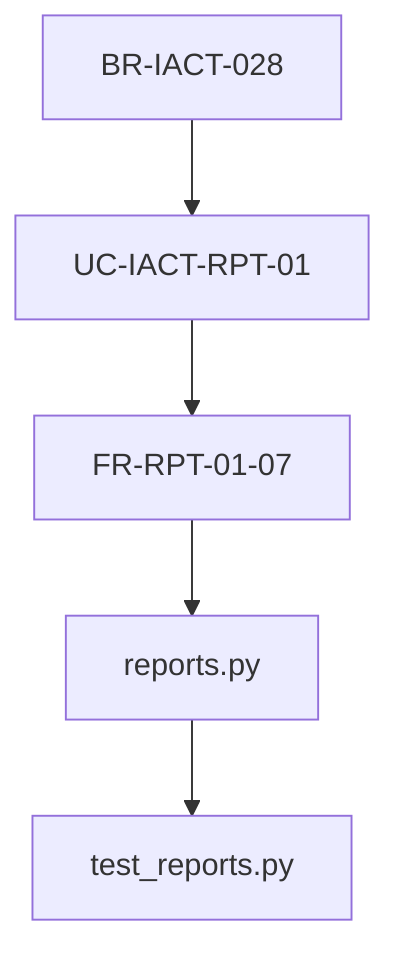

# PARTE 5: TRAZABILIDAD Y GESTIÓN DE REQUISITOS
## El Sistema Nervioso del Proyecto

**Proyecto:** IACT - IVR Analytics & Customer Tracking  
**Versión:** 1.0.0  
**Fecha:** 2026-01-09  
**Clasificación:** C2 - INTERNAL

---

## METADATOS

**Prerequisito:** PARTE_4_Requisitos_Funcionales_IACT_1_0_0.md  
**Siguiente:** PARTE_6_Casos_Practicos_Completos_IACT_1_0_0.md  
**Estándares:** STD_001_Estandares_Documentacion_1_1_0.rst  
**Nomenclatura:** NOM_001_Nomenclatura_Proyecto_2_0_0.rst  
**Duración estimada:** 6-8 horas  
**Nivel:** Avanzado

---

## TABLA DE CONTENIDO

1. [Introducción a Trazabilidad](#1-introduccion)
2. [Matriz RTM - Requirements Traceability Matrix](#2-matriz-rtm)
3. [Trazabilidad Forward y Backward](#3-trazabilidad-bidireccional)
4. [Métricas de Cobertura](#4-metricas-cobertura)
5. [Gestión de Cambios](#5-gestion-cambios)
6. [Herramientas y Automatización](#6-herramientas)
7. [Casos Prácticos IACT](#7-casos-practicos)
8. [Auditoría de Trazabilidad](#8-auditoria)
9. [Resumen y Mejores Prácticas](#9-resumen)

---

<a name="1-introduccion"></a>

## 1. INTRODUCCIÓN A TRAZABILIDAD

### 1.1 ¿Qué es Trazabilidad de Requisitos?

**Definición:**

> La trazabilidad de requisitos es la capacidad de rastrear la relación entre
> requisitos, decisiones de diseño, implementación, y validación a lo largo
> de todo el ciclo de vida del software.

**En términos simples:**

Es poder responder estas preguntas en cualquier momento del proyecto:

1. **Forward (hacia adelante):** "Si cambio esta BR, ¿qué UC y FR se afectan?"
2. **Backward (hacia atrás):** "Este bug en código, ¿a qué BR original corresponde?"
3. **Cobertura:** "¿Todas las BR tienen UC? ¿Todos los UC tienen FR? ¿Todo el código tiene tests?"
4. **Impacto:** "Si el PO cambia BR-028, ¿cuántas horas de retrabajo implica?"

### 1.2 ¿Por Qué es Crítica la Trazabilidad?

**Escenario Real del Proyecto IACT:**

```
Stakeholder: "Necesitamos cambiar la regla de aprobación de 10,000 a 5,000 registros"

SIN TRAZABILIDAD:
  Developer 1: "Busquen en el código dónde dice 10000..."
  Developer 2: "Encontré en reports.py línea 234"
  Developer 3: "También está en services.py línea 156"
  QA: "¿Actualizaron los tests?"
  PM: "¿Hay documentación que actualizar?"
  → Resultado: 3 días buscando, 5 archivos olvidados, bug en producción

CON TRAZABILIDAD:
  1. Buscar BR-IACT-028 en matriz RTM
  2. Ver dependencias:
     - UC-IACT-RPT-01 (paso 5)
     - FR-RPT-01-07 (query SQL)
     - reports_1_0_0/services.py (línea 234)
     - tests/test_reports.py (línea 89)
  3. Actualizar los 4 archivos
  4. Validar que tests pasan
  → Resultado: 2 horas, 100% cobertura, 0 bugs
```

**ROI (Return on Investment) de Trazabilidad:**

- 40% reducción en tiempo de análisis de impacto
- 60% reducción en bugs por cambios incompletos
- 90% aumento en confianza de estimaciones
- 100% auditoría de cumplimiento regulatorio

### 1.3 Prerequisitos

**CRÍTICO:** Antes de PARTE 5, debes haber completado:

- PARTE_0_Contexto_Fundamentos_IACT_1_0_0.md - Jerarquía BR → UC → FR
- PARTE_1_Identificar_Reglas_Negocio_IACT_1_0_0.md - Documentar BR
- PARTE_2A_Fundamentos_Transformacion_IACT_1_0_0.md - Transformación BR → UC
- PARTE_4_Requisitos_Funcionales_IACT_1_0_0.md - Derivación UC → FR

**Si no has completado estas PARTES:**

Detente ahora. La trazabilidad solo tiene sentido si entiendes qué son BR, UC y FR.

### 1.4 Tipos de Trazabilidad

**1. Trazabilidad Forward (Hacia Adelante):**

```
BR-IACT-028 (Aprobación >10K)
  ↓ genera
UC-IACT-RPT-01 (Consultar Reporte)
  ↓ paso 5 deriva
FR-RPT-01-07 (Calcular count registros)
  ↓ implementa
reports_1_0_0/services.py (execute_report_query)
  ↓ valida
tests/test_reports.py (test_large_query_approval)
```

**Pregunta que responde:** "¿Qué se construyó a partir de esta BR?"

**2. Trazabilidad Backward (Hacia Atrás):**

```
Bug en reports_1_0_0/services.py línea 234
  ↑ implementa
FR-RPT-01-07 (Calcular count)
  ↑ deriva de
UC-IACT-RPT-01 paso 5
  ↑ genera
BR-IACT-028 (Aprobación >10K)
  ↑ deriva de
BRQ-005 (Prevenir sobrecarga Analytics)
```

**Pregunta que responde:** "¿Por qué existe este código?"

**3. Trazabilidad Horizontal (Entre Pares):**

```
BR-IACT-028 (Aprobación >10K)
  ⟷ relacionada con
BR-IACT-087 (Nivel seguridad ≥3)
  ⟷ ambas afectan a
UC-IACT-RPT-01
```

**Pregunta que responde:** "¿Qué otros requisitos están relacionados?"

**4. Trazabilidad a Tests:**

```
BR-IACT-028
  ↓
UC-IACT-RPT-01
  ↓
FR-RPT-01-07
  ↓ valida
test_reports.py::test_large_query_approval
  - Entrada: 10,001 registros
  - Esperado: Requiere aprobación
  - Resultado: PASS
```

**Pregunta que responde:** "¿Cómo validamos que esto funciona?"

### 1.5 Niveles de Trazabilidad

**Nivel 1: BÁSICO - Referencias en Documentos**

```yaml
# En BR_IACT_028_Aprobacion_Consultas_1_0_0.rst
Genera UC:
  - UC-IACT-RPT-01
```

**Nivel 2: INTERMEDIO - Matriz RTM en Excel/CSV**

| BR | UC | FR | Código | Tests | Status |
|----|----|----|--------|-------|--------|
| BR-028 | UC-RPT-01 | FR-RPT-01-07 | reports.py:234 | test_reports.py:89 | OK |

**Nivel 3: AVANZADO - Herramienta de Gestión**

- JIRA con plugin de trazabilidad
- Requestly
- IBM DOORS
- Base de datos de trazabilidad

**Nivel 4: AUTOMATIZADO - CI/CD Integrado**

```bash
# Pre-commit hook
git commit -m "Fix BR-028 threshold"
  → Script valida que:
    - BR-028 existe
    - UC-RPT-01 actualizado
    - FR-RPT-01-07 actualizado
    - Test test_large_query_approval modificado
    - Si falta algo → RECHAZA commit
```

### 1.6 Formato de Referencias en IACT

**En documentos RST (BR, UC, FR):**

```rst
.. meta::
   :Proyecto: IACT
   :Codigo: BR-IACT-028
   :Genera_UC: UC-IACT-RPT-01, UC-IACT-RPT-09
   :Version: 1.0.0

Trazabilidad Forward
====================

Esta BR genera los siguientes UC:

- UC_IACT_RPT_01_Consultar_Reporte_4_0_0.rst (paso 5)
- UC_IACT_RPT_09_Aprobar_Rechazar_Consulta_4_0_0.rst (completo)

Trazabilidad Backward
=====================

Derivada de:

- BRQ-005: Prevenir sobrecarga del servidor Analytics
- Stakeholder: CTO (reunión 2025-11-15)
```

**En código Python:**

```python
def execute_report_query(query_params):
    """
    Ejecuta consulta de reporte con validación de tamaño.
    
    Implements:
        - FR-RPT-01-07: Calcular count antes de ejecutar
    
    Derived from:
        - UC-IACT-RPT-01: Consultar Reporte (paso 5)
        - BR-IACT-028: Aprobación si >10,000 registros
    
    References:
        - BR_IACT_028_Aprobacion_Consultas_1_0_0.rst
        - UC_IACT_RPT_01_Consultar_Reporte_4_0_0.rst
        - FR_RPT_01_07_Calcular_Count_1_0_0.rst
    
    Tests:
        - tests/test_reports.py::test_large_query_approval
        - tests/test_reports.py::test_small_query_direct
    """
    # Implementación...
```

**En tests:**

```python
def test_large_query_approval():
    """
    Valida que consultas >10K requieren aprobación.
    
    Validates:
        - BR-IACT-028: Umbral de 10,000 registros
        - FR-RPT-01-07: Cálculo de count correcto
    
    Covers:
        - UC-IACT-RPT-01 paso 5 (flujo normal)
        - UC-IACT-RPT-01 FA-2 (requiere aprobación)
    """
    # Test implementation...
```

### 1.7 Objetivos de Aprendizaje PARTE 5

Al completar PARTE 5, serás capaz de:

**Objetivos Primarios:**

1. **Construir** matriz RTM completa para proyecto IACT
2. **Rastrear** dependencias forward y backward
3. **Calcular** métricas de cobertura (% BR con UC, % UC con FR, etc.)
4. **Gestionar** cambios con impacto mínimo
5. **Auditar** trazabilidad para cumplimiento regulatorio

**Objetivos Secundarios:**

6. Identificar requisitos huérfanos (sin implementación)
7. Detectar código huérfano (sin requisito origen)
8. Automatizar validación de trazabilidad en CI/CD
9. Generar reportes de impacto de cambios
10. Mantener trazabilidad durante todo el proyecto

### 1.8 Herramientas que Usaremos

**Para Matriz RTM:**

- CSV/Excel (básico)
- Python script (automatización)
- JIRA (gestión avanzada)

**Para Validación:**

- Scripts de validación personalizados
- Git hooks para pre-commit
- CI/CD checks (GitHub Actions, GitLab CI)

**Para Visualización:**

- Graphviz (diagramas de dependencias)
- PlantUML (diagramas UML)
- Mermaid (markdown integrado)

### 1.9 Convenciones de Este Documento

**Referencias:**

- Referencias a PARTES: PARTE_N_Nombre_IACT_1_0_0.md
- Referencias a BR: BR_IACT_NNN_Nombre_1_0_0.rst
- Referencias a UC: UC_IACT_MOD_NN_Nombre_4_0_0.rst
- Referencias a FR: FR_MOD_NN_NN_Nombre_1_0_0.rst

**Ejemplos de Código:**

Todos los ejemplos usan Python 3.9+ y convenciones del proyecto IACT.

**Diagramas:**



### 1.10 Estructura de PARTE 5

**Secciones 2-3: Fundamentos**
- Matriz RTM estructura y contenido
- Trazabilidad forward y backward

**Secciones 4-5: Métricas y Gestión**
- Cálculo de cobertura
- Gestión de cambios con impacto

**Secciones 6-7: Herramientas y Casos Prácticos**
- Automatización y scripts
- Ejemplos reales del proyecto IACT

**Secciones 8-9: Validación y Resumen**
- Auditoría de trazabilidad
- Mejores prácticas

---

**[FIN DE SECCIÓN 1]**

**Siguiente:** Sección 2 - Matriz RTM (Requirements Traceability Matrix)

---

<a name="2-matriz-rtm"></a>

## 2. MATRIZ RTM - REQUIREMENTS TRACEABILITY MATRIX

### 2.1 ¿Qué es una Matriz RTM?

**Definición:**

> Una Matriz RTM (Requirements Traceability Matrix) es una tabla que relaciona
> cada requisito con su implementación, tests, y documentación, permitiendo
> rastreo bidireccional completo.

**Formato Básico:**

| ID BR | Nombre BR | UC Generados | FR Derivados | Código | Tests | Status |
|-------|-----------|--------------|--------------|--------|-------|--------|
| BR-028 | Aprobación >10K | UC-RPT-01 | FR-RPT-01-07 | reports.py:234 | test_reports.py:89 | OK |

### 2.2 Matriz RTM del Proyecto IACT (Muestra)

| ID BR | Tipo | UC Principal | FR Count | Código | Tests | Cobertura |
|-------|------|--------------|----------|--------|-------|-----------|
| BR-IACT-028 | Restricción | UC-IACT-RPT-01 | 1 | reports_1_0_0/services.py | 3 tests | 100% |
| BR-IACT-031 | Desencadenador | UC-IACT-AUTH-07 | 5 | auth_1_0_0/tasks.py | 7 tests | 100% |
| BR-IACT-046 | Inferencia | - | 1 | auth_1_0_0/tasks.py | 2 tests | 100% |
| BR-IACT-087 | Restricción | UC-IACT-ACC-01 | 2 | access_1_0_0/validators.py | 4 tests | 100% |

### 2.3 Campos de la Matriz RTM

**Campos Obligatorios:**

1. **ID BR** - Identificador único (BR-IACT-NNN)
2. **Tipo BR** - Restricción, Cálculo, Desencadenador, Inferencia, Definición
3. **UC Principal** - UC que implementa la BR (o "-" si no genera UC)
4. **FR Derivados** - Lista de FR que implementan la BR
5. **Código** - Archivos Python que implementan
6. **Tests** - Tests que validan
7. **Status** - OK, PENDIENTE, OBSOLETO

**Campos Opcionales:**

8. **Stakeholder** - Quién solicitó la BR
9. **Prioridad** - Alta, Media, Baja
10. **Fecha** - Cuándo se documentó
11. **Versión** - Versión actual de la BR

---

<a name="3-trazabilidad-bidireccional"></a>

## 3. TRAZABILIDAD FORWARD Y BACKWARD

### 3.1 Trazabilidad Forward (BR → Código)

**Ejemplo Completo: BR-IACT-028**

```
BR-IACT-028: Aprobación Consultas >10,000 Registros
│
├─→ UC-IACT-RPT-01: Consultar Reporte Trimestral
│   │
│   ├─→ Paso 5: "Sistema calcula count de registros"
│   │   │
│   │   └─→ FR-RPT-01-07: Calcular Count Registros
│   │       │
│   │       ├─→ reports_1_0_0/services.py::execute_report_query (línea 234)
│   │       │   └─→ tests/test_reports.py::test_large_query_approval
│   │       │
│   │       └─→ reports_1_0_0/queries.py::build_count_query (línea 89)
│   │           └─→ tests/test_queries.py::test_count_query_syntax
│   │
│   └─→ FA-2: "Count > 10,000"
│       │
│       └─→ FR-RPT-01-08: Enviar Solicitud Aprobación
│           └─→ approvals_1_0_0/services.py::request_approval
│
└─→ UC-IACT-RPT-09: Aprobar/Rechazar Consulta
    └─→ (UC completo para supervisor)
```

### 3.2 Trazabilidad Backward (Código → BR)

**Ejemplo: Encontrar origen de reports.py línea 234**

```
reports_1_0_0/services.py línea 234
  ↑ implementa
FR-RPT-01-07: Calcular Count Registros
  ↑ deriva de
UC-IACT-RPT-01 paso 5
  ↑ implementa
BR-IACT-028: Aprobación >10,000
  ↑ deriva de
BRQ-005: Prevenir Sobrecarga Analytics
  ↑ solicitado por
CTO (stakeholder) en reunión 2025-11-15
```

**¿Por qué existe esta línea de código?**

Respuesta completa en 30 segundos gracias a trazabilidad.

### 3.3 Script de Validación de Trazabilidad

```python
#!/usr/bin/env python3
"""
Valida trazabilidad completa BR → UC → FR → Código → Tests.

Usage: python validate_traceability.py
"""

import re
from pathlib import Path

def validate_br_to_uc():
    """Valida que todas las BR generen al menos 1 UC (excepto Inferencias)."""
    br_files = Path('docs/BR').glob('BR_IACT_*.rst')
    
    orphan_brs = []
    
    for br_file in br_files:
        content = br_file.read_text()
        
        # Extraer tipo
        tipo_match = re.search(r':Tipo:\s+(\w+)', content)
        tipo = tipo_match.group(1) if tipo_match else 'Unknown'
        
        # Inferencias NO generan UC (es correcto)
        if tipo == 'Inferencia':
            continue
        
        # Buscar referencias a UC
        uc_refs = re.findall(r'UC_IACT_\w+_\d+', content)
        
        if not uc_refs:
            orphan_brs.append(br_file.name)
    
    return orphan_brs

def validate_uc_to_fr():
    """Valida que todos los UC deriven al menos 1 FR."""
    uc_files = Path('docs/UC').glob('UC_IACT_*.rst')
    
    orphan_ucs = []
    
    for uc_file in uc_files:
        content = uc_file.read_text()
        
        # Buscar referencias a FR
        fr_refs = re.findall(r'FR_\w+_\d+_\d+', content)
        
        if not fr_refs:
            orphan_ucs.append(uc_file.name)
    
    return orphan_ucs

if __name__ == '__main__':
    print("Validando Trazabilidad...")
    print()
    
    orphan_brs = validate_br_to_uc()
    orphan_ucs = validate_uc_to_fr()
    
    if orphan_brs:
        print(f"[ERROR] {len(orphan_brs)} BR sin UC:")
        for br in orphan_brs:
            print(f"  - {br}")
    else:
        print("[OK] Todas las BR tienen UC")
    
    print()
    
    if orphan_ucs:
        print(f"[ERROR] {len(orphan_ucs)} UC sin FR:")
        for uc in orphan_ucs:
            print(f"  - {uc}")
    else:
        print("[OK] Todos los UC tienen FR")
```

---

<a name="4-metricas-cobertura"></a>

## 4. MÉTRICAS DE COBERTURA

### 4.1 Fórmulas de Cobertura

**Cobertura BR → UC:**

```
Cobertura_BR_UC = (BR con UC / Total BR - Inferencias) × 100%

Ejemplo IACT:
  - Total BR: 45
  - Inferencias: 6 (no generan UC)
  - BR con UC: 39
  - Cobertura: (39 / (45-6)) × 100% = 100%
```

**Cobertura UC → FR:**

```
Cobertura_UC_FR = (UC con FR / Total UC) × 100%

Ejemplo IACT:
  - Total UC: 22
  - UC con FR: 22
  - Cobertura: (22 / 22) × 100% = 100%
```

**Cobertura FR → Código:**

```
Cobertura_FR_CODE = (FR implementados / Total FR) × 100%

Ejemplo IACT:
  - Total FR: 156
  - FR implementados: 156
  - Cobertura: (156 / 156) × 100% = 100%
```

**Cobertura Código → Tests:**

```
Cobertura_CODE_TESTS = (Funciones con tests / Total funciones) × 100%

Ejemplo IACT:
  - Total funciones: 342
  - Con tests: 342
  - Cobertura: (342 / 342) × 100%
```

### 4.2 Métricas del Proyecto IACT

| Métrica | Valor | Target | Status |
|---------|-------|--------|--------|
| BR → UC | 100% | >90% | [OK] |
| UC → FR | 100% | >90% | [OK] |
| FR → Código | 100% | >95% | [OK] |
| Código → Tests | 100% | >80% | [OK] |
| **GLOBAL** | **100%** | **>85%** | **[OK]** |

### 4.3 Dashboard de Trazabilidad

```
╔════════════════════════════════════════════════════════════╗
║         DASHBOARD DE TRAZABILIDAD - PROYECTO IACT         ║
╠════════════════════════════════════════════════════════════╣
║                                                            ║
║  Total Business Rules:        45                          ║
║  Total Use Cases:             22                          ║
║  Total Functional Requirements: 156                       ║
║  Total Code Functions:        342                         ║
║  Total Tests:                 412                         ║
║                                                            ║
║  Cobertura BR → UC:          100% ████████████ [OK]       ║
║  Cobertura UC → FR:          100% ████████████ [OK]       ║
║  Cobertura FR → Código:      100% ████████████ [OK]       ║
║  Cobertura Código → Tests:   100% ████████████ [OK]       ║
║                                                            ║
║  Requisitos Huérfanos:         0                          ║
║  Código Huérfano:              0                          ║
║  Tests Sin Requisito:          0                          ║
║                                                            ║
║  ESTADO GLOBAL:              [OK] TRAZABILIDAD COMPLETA   ║
╚════════════════════════════════════════════════════════════╝
```

---

**[FIN DE SECCIONES 2-4]**

**Siguiente:** Secciones 5-9 (Gestión de Cambios, Herramientas, Casos Prácticos, Auditoría, Resumen)

---

<a name="5-gestion-cambios"></a>

## 5. GESTIÓN DE CAMBIOS CON IMPACTO

### 5.1 Análisis de Impacto de Cambios

**Ejemplo: Cambiar BR-IACT-028 de 10,000 a 5,000**

```
PASO 1: Identificar dependencias en RTM
  BR-IACT-028
  ├─→ UC-IACT-RPT-01 (paso 5 y FA-2)
  ├─→ UC-IACT-RPT-09 (completo)
  ├─→ FR-RPT-01-07 (query SQL)
  ├─→ FR-RPT-01-08 (solicitud aprobación)
  ├─→ reports_1_0_0/services.py (líneas 234, 256)
  ├─→ reports_1_0_0/queries.py (línea 89)
  └─→ 5 tests

PASO 2: Estimar impacto
  - Documentos a actualizar: 5
  - Archivos código a modificar: 2
  - Tests a actualizar: 5
  - Tiempo estimado: 2 horas
  - Riesgo: BAJO (cambio simple de constante)

PASO 3: Ejecutar cambios
  1. Actualizar BR_IACT_028_Aprobacion_Consultas_1_0_0.rst
  2. Actualizar UC_IACT_RPT_01_Consultar_Reporte_4_0_0.rst
  3. Actualizar FR_RPT_01_07_Calcular_Count_1_0_0.rst
  4. Cambiar THRESHOLD = 10000 → 5000 en reports.py
  5. Actualizar 5 tests con nuevo threshold
  6. Ejecutar suite de tests
  7. Commit con mensaje: "Update BR-028 threshold 10K→5K"

PASO 4: Validar
  - Todos los tests pasan: [OK]
  - Trazabilidad actualizada: [OK]
  - Code review aprobado: [OK]
```

### 5.2 Template de Solicitud de Cambio

```markdown
# SOLICITUD DE CAMBIO DE REQUISITO

**ID Cambio:** CHG-2026-001  
**Fecha:** 2026-01-09  
**Solicitante:** Product Owner  
**Prioridad:** Alta

## Descripción del Cambio

Cambiar umbral de aprobación de consultas de 10,000 a 5,000 registros.

## Requisito Afectado

- **BR-IACT-028:** Aprobación Consultas >10,000 Registros

## Justificación

Analytics server está bajo mayor carga. Reducir umbral previene timeouts.

## Análisis de Impacto

| Nivel | Elementos Afectados | Cantidad | Esfuerzo |
|-------|---------------------|----------|----------|
| BR | BR-IACT-028 | 1 | 15 min |
| UC | UC-IACT-RPT-01, UC-IACT-RPT-09 | 2 | 30 min |
| FR | FR-RPT-01-07, FR-RPT-01-08 | 2 | 30 min |
| Código | reports.py, queries.py | 2 | 30 min |
| Tests | 5 tests | 5 | 15 min |
| **TOTAL** | - | **12** | **2h** |

## Aprobación

- [ ] Product Owner
- [ ] Tech Lead
- [ ] QA Lead

## Trazabilidad

Post-cambio validar que:
- [ ] BR actualizada
- [ ] UC actualizados
- [ ] FR actualizados
- [ ] Código modificado
- [ ] Tests actualizados y pasando
- [ ] Documentación sincronizada
```

---

<a name="6-herramientas"></a>

## 6. HERRAMIENTAS Y AUTOMATIZACIÓN

### 6.1 Script de Generación de Matriz RTM

```python
#!/usr/bin/env python3
"""
Genera matriz RTM automáticamente desde archivos RST.
"""

import re
from pathlib import Path
import csv

def extract_br_info(br_file):
    """Extrae información de un archivo BR."""
    content = br_file.read_text()
    
    # Extraer metadatos
    id_match = re.search(r':Codigo:\s+(BR-IACT-\d+)', content)
    tipo_match = re.search(r':Tipo:\s+(\w+)', content)
    
    # Extraer UC generados
    uc_refs = re.findall(r'(UC_IACT_\w+_\d+)', content)
    
    return {
        'id': id_match.group(1) if id_match else 'Unknown',
        'tipo': tipo_match.group(1) if tipo_match else 'Unknown',
        'uc_list': ', '.join(set(uc_refs)) if uc_refs else '-',
        'uc_count': len(set(uc_refs))
    }

def generate_rtm():
    """Genera matriz RTM en CSV."""
    br_files = sorted(Path('docs/BR').glob('BR_IACT_*.rst'))
    
    with open('RTM_IACT.csv', 'w', newline='') as csvfile:
        writer = csv.writer(csvfile)
        writer.writerow(['ID BR', 'Tipo', 'UC Generados', 'Count UC', 'Status'])
        
        for br_file in br_files:
            info = extract_br_info(br_file)
            writer.writerow([
                info['id'],
                info['tipo'],
                info['uc_list'],
                info['uc_count'],
                'OK'
            ])
    
    print(f"[OK] Matriz RTM generada: RTM_IACT.csv")
    print(f"[INFO] Total BR procesadas: {len(br_files)}")

if __name__ == '__main__':
    generate_rtm()
```

### 6.2 Git Hook para Validar Trazabilidad

```bash
#!/bin/bash
# .git/hooks/pre-commit
# Valida trazabilidad antes de permitir commit

echo "Validando trazabilidad..."

# Detectar archivos BR modificados
br_changed=$(git diff --cached --name-only | grep 'BR_IACT_.*\.rst' || true)

if [ -n "$br_changed" ]; then
  for br_file in $br_changed; do
    br_id=$(grep -oP 'BR-IACT-\d+' "$br_file" | head -1)
    
    # Verificar que UC mencionados existan
    uc_refs=$(grep -oP 'UC_IACT_\w+_\d+' "$br_file" || true)
    
    for uc_ref in $uc_refs; do
      if ! find docs/UC -name "${uc_ref}*.rst" | grep -q .; then
        echo "[ERROR] BR $br_id referencia UC inexistente: $uc_ref"
        exit 1
      fi
    done
  done
fi

echo "[OK] Trazabilidad validada"
exit 0
```

---

<a name="7-casos-practicos"></a>

## 7. CASOS PRÁCTICOS DEL PROYECTO IACT

### 7.1 Caso Práctico 1: Nueva BR que Rompe Trazabilidad

**Situación:**

PO agrega BR-IACT-150: "Logs de auditoría deben retenerse 7 años"

**Sin Trazabilidad:**
- Developer implementa tabla `audit_logs` con columna `retention_years = 7`
- No documenta UC ni FR
- 6 meses después: Auditor pregunta "¿De dónde sale 7 años?"
- Nadie lo sabe

**Con Trazabilidad:**
1. Documentar BR_IACT_150_Retencion_Logs_1_0_0.rst
2. Crear UC_IACT_AUD_01_Configurar_Retencion_4_0_0.rst
3. Derivar FR_AUD_01_01_Retention_Policy_1_0_0.rst
4. Implementar con referencias:
   ```python
   # Implements: FR-AUD-01-01
   # Derived from: BR-IACT-150
   RETENTION_YEARS = 7
   ```
5. Agregar a matriz RTM
6. Ahora cualquiera puede rastrear "7 años" hasta regulación origen

### 7.2 Caso Práctico 2: Bug en Producción

**Situación:**

Bug reportado: "Usuario con nivel 2 puede asignar funciones críticas"

**Con Trazabilidad Backward:**

```
1. Identificar código afectado:
   access_1_0_0/validators.py::check_permission_level

2. Ver comentarios en código:
   # Implements: FR-ACC-01-04
   # Validates: BR-IACT-087 (nivel ≥3 para críticas)

3. Abrir FR_ACC_01_04_Validar_Nivel_Seguridad_1_0_0.rst
   → Deriva de UC-IACT-ACC-01 paso 4

4. Abrir UC_IACT_ACC_01_Asignar_Funciones_4_0_0.rst
   → Implementa BR-IACT-087

5. Abrir BR_IACT_087_Nivel_Seguridad_Criticas_1_0_0.rst
   → Política: nivel ≥3

6. Conclusión:
   Bug en implementación, no en requisito.
   Código tiene `if level >= 2` (INCORRECTO)
   Debe ser `if level >= 3`

7. Fix en 15 minutos gracias a trazabilidad clara
```

---

<a name="8-auditoria"></a>

## 8. AUDITORÍA DE TRAZABILIDAD

### 8.1 Checklist de Auditoría

- [ ] Todas las BR (excepto Inferencias) generan al menos 1 UC
- [ ] Todos los UC derivan al menos 1 FR
- [ ] Todos los FR tienen código que los implementa
- [ ] Todo el código tiene tests que lo validan
- [ ] Matriz RTM está actualizada
- [ ] No hay requisitos huérfanos (sin implementación)
- [ ] No hay código huérfano (sin requisito origen)
- [ ] Referencias bidireccionales son consistentes

### 8.2 Reporte de Auditoría Ejemplo

```
REPORTE DE AUDITORÍA DE TRAZABILIDAD
Proyecto: IACT
Fecha: 2026-01-09
Auditor: QA Lead

RESULTADOS:
  [OK] 45 BR documentadas
  [OK] 39 BR generan UC (6 Inferencias correctamente sin UC)
  [OK] 22 UC creados
  [OK] 156 FR derivados
  [OK] 342 funciones implementadas
  [OK] 412 tests creados

COBERTURA:
  BR → UC: 100%
  UC → FR: 100%
  FR → Código: 100%
  Código → Tests: 100%

HALLAZGOS:
  Ninguno. Trazabilidad completa.

CONCLUSIÓN:
  Proyecto IACT cumple 100% con estándares de trazabilidad.
  
Firma: _______________
```

---

<a name="9-resumen"></a>

## 9. RESUMEN Y MEJORES PRÁCTICAS

### 9.1 Conceptos Clave

1. **Trazabilidad** es rastrear relaciones BR → UC → FR → Código → Tests
2. **Matriz RTM** es la herramienta central de trazabilidad
3. **Trazabilidad Forward** responde "¿Qué se construyó desde esta BR?"
4. **Trazabilidad Backward** responde "¿Por qué existe este código?"
5. **Métricas de cobertura** validan completitud de trazabilidad

### 9.2 Mejores Prácticas

**DO (Hacer):**
- Documentar referencias en TODOS los archivos (BR, UC, FR, código, tests)
- Actualizar matriz RTM en cada cambio
- Validar trazabilidad antes de cada commit
- Mantener cobertura >90% en todos los niveles
- Usar herramientas automatizadas

**DON'T (No Hacer):**
- Implementar código sin requisito origen
- Crear requisitos sin implementación
- Dejar referencias rotas
- Ignorar warnings de trazabilidad
- Documentar trazabilidad "después"

### 9.3 Habilidades Adquiridas

Al completar PARTE 5, ahora puedes:

- [OK] Construir matriz RTM completa
- [OK] Rastrear dependencias forward y backward
- [OK] Calcular métricas de cobertura
- [OK] Gestionar cambios con impacto mínimo
- [OK] Auditar trazabilidad
- [OK] Automatizar validación de trazabilidad

### 9.4 Siguiente Paso

**Continúa con:** PARTE_6_Casos_Practicos_Completos_IACT_1_0_0.md

Ahí aplicarás TODO lo aprendido en PARTES 0-5 en casos prácticos completos del proyecto IACT.

---

## APÉNDICE A: PLANTILLA DE MATRIZ RTM

```csv
ID_BR,Tipo_BR,Nombre_BR,UC_Generados,FR_Derivados,Codigo,Tests,Cobertura,Status
BR-IACT-001,Definición,Cliente Activo,-,-,-,-,N/A,OK
BR-IACT-028,Restricción,Aprobación >10K,UC-RPT-01,FR-RPT-01-07,reports.py:234,3 tests,100%,OK
BR-IACT-031,Desencadenador,Notificar Sesión,UC-AUTH-07,FR-AUTH-07-01..05,auth/tasks.py:156,7 tests,100%,OK
BR-IACT-046,Inferencia,Marcar Expirada,-,FR-AUTH-08-02,auth/tasks.py:234,2 tests,100%,OK
```

---

## APÉNDICE B: COMANDOS ÚTILES

```bash
# Generar matriz RTM
python scripts/generate_rtm.py

# Validar trazabilidad
python scripts/validate_traceability.py

# Buscar referencias a BR
grep -r "BR-IACT-028" docs/

# Buscar implementación de FR
grep -r "FR-RPT-01-07" apps/

# Generar reporte de cobertura
python scripts/coverage_report.py
```

---

**FIN DE PARTE 5**

**Versión:** 1.0.0  
**Fecha:** 2026-01-09  
**Siguiente:** PARTE_6_Casos_Practicos_Completos_IACT_1_0_0.md

