UID: 20251208033409508872
date: 2025-12-08

#  PARTE 0 - CONTEXTO Y FUNDAMENTOS


# PARTE 0: CONTEXTO Y FUNDAMENTOS

**Documento Puente: De Reglas de Negocio a Sistema Completo**

---

## TABLA DE CONTENIDOS

1. [El Problema Fundamental](https://claude.ai/chat/5e04acfc-e93d-426d-9b2c-cec057661ca8#1-el-problema-fundamental)
2. [El Modelo Conceptual](https://claude.ai/chat/5e04acfc-e93d-426d-9b2c-cec057661ca8#2-el-modelo-conceptual)
3. [Principios de Transformación](https://claude.ai/chat/5e04acfc-e93d-426d-9b2c-cec057661ca8#3-principios-de-transformaci%C3%B3n)
4. [Alcance y Limitaciones](https://claude.ai/chat/5e04acfc-e93d-426d-9b2c-cec057661ca8#4-alcance-y-limitaciones)
5. [Roadmap de las 6 Partes](https://claude.ai/chat/5e04acfc-e93d-426d-9b2c-cec057661ca8#5-roadmap-de-las-6-partes)
6. [Convenciones](https://claude.ai/chat/5e04acfc-e93d-426d-9b2c-cec057661ca8#6-convenciones)

---

## 1. EL PROBLEMA FUNDAMENTAL

### 1.1 El Síntoma

En la mayoría de los proyectos de software existe una desconexión entre las reglas que rigen el negocio y el código que implementa el sistema. Esta desconexión se manifiesta de múltiples formas:

**Conversación típica durante mantenimiento:**

```
Desarrollador: "Este código rechaza transacciones mayores a $500.
                ¿Por qué ese valor específico?"

Analista: "Está en los requerimientos funcionales."

Desarrollador: "¿Y de dónde salió ese requerimiento?"

Analista: "No lo sé. Siempre ha estado ahí."

Cliente: "Necesitamos cambiar ese límite a $1,000."

Equipo: [silencio]
        "¿Podemos cambiarlo?"
        "¿Hay implicaciones legales?"
        "¿Qué más debemos ajustar?"
```

Nadie puede responder estas preguntas porque la conexión con la fuente original se perdió.

### 1.2 La Causa Raíz

El problema no es técnico, es metodológico. Los equipos típicamente:

1. Reciben requerimientos funcionales sin contexto
2. Implementan esos requerimientos directamente
3. No documentan el origen de las decisiones
4. Pierden la trazabilidad hacia las reglas de negocio

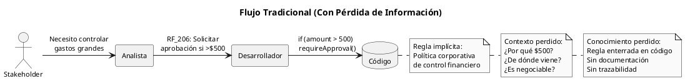

### 1.3 Las Consecuencias

La pérdida de trazabilidad genera problemas en todo el ciclo de vida:

**Durante Desarrollo:**

- Decisiones arbitrarias sin justificación
- Implementación incorrecta por falta de contexto
- Conflictos entre requerimientos sin forma de resolverlos

**Durante Mantenimiento:**

- Imposibilidad de evaluar impacto de cambios
- Miedo a modificar código "que funciona"
- Regresiones por cambios no coordinados

**Durante Auditoría:**

- Incapacidad de demostrar cumplimiento
- No se puede rastrear requerimiento a regulación
- Riesgo legal y financiero

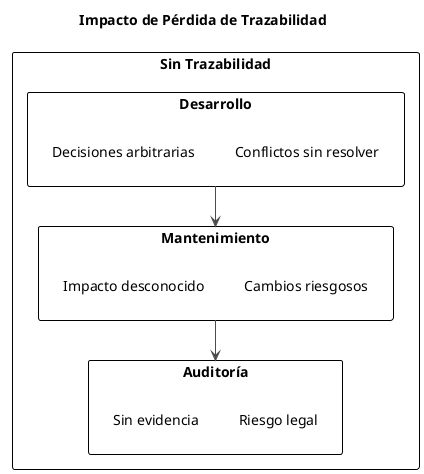

### 1.4 Caso Ilustrativo

**Sistema de Gestión de Químicos en Universidad**

Una universidad implementa un sistema para controlar el uso de productos químicos. Durante el desarrollo:

**Requerimiento documentado:**

```
RF_205: "El sistema debe verificar que el solicitante tenga 
         capacitación para el químico solicitado."
```

**Pregunta crítica no respondida:** ¿Por qué?

Dos años después, durante una auditoría de seguridad:

**Auditor:** "¿Por qué verifican capacitación?"

**Equipo TI:** "Está en los requerimientos."

**Auditor:** "¿Cumple con regulación OSHA 29 CFR 1910.1200?"

**Equipo TI:** "No sabemos."

**Resultado:** El sistema verifica capacitación, pero NO de la forma que OSHA requiere. La implementación es incorrecta porque se perdió el contexto de la regla original.

**Lo que debió documentarse:**

```
BR_087 (Restricción):
  Definición: "Solo personal capacitado según OSHA 1910.1200 
               puede manipular químicos peligrosos clase 1-4"
  Tipo: Restricción
  Fuente: OSHA 29 CFR 1910.1200 (Hazard Communication Standard)
  Fecha vigencia: 2012-05-25
  Estática: Sí (regulación federal)
  
  ↓ genera
  
UC_04: Solicitar Producto Químico
  Precondición: Solicitante.capacitaciónOSHA ≠ null
  Paso 2: Sistema verifica clase de químico
  Paso 3: Sistema valida capacitación coincide con clase
  
  ↓ deriva
  
RF_205: "Sistema debe verificar que solicitante tenga certificado
         OSHA vigente para la clase del químico solicitado"
```

Con esta trazabilidad completa:

- Se sabe POR QUÉ existe el requerimiento
- Se puede validar contra la fuente original
- Se puede actualizar si la regulación cambia
- Se demuestra cumplimiento en auditoría

---

## 2. EL MODELO CONCEPTUAL

### 2.1 La Jerarquía de Abstracción

Los requerimientos no son planos. Existen en niveles de abstracción que van desde lo más general y estable (reglas de negocio) hasta lo más específico y cambiante (implementación).

```plantuml
@startuml
!pragma layout smetana
skinparam monochrome true
skinparam shadowing false
skinparam defaultFontSize 11

title Jerarquía de Abstracción en Requerimientos

package "Nivel 0: Business Rules" as n0 #lightgray {
  rectangle "Reglas de Negocio" as br {
    Políticas organizacionales
    Regulaciones externas
    Estándares industriales
    ----
    Características:
    - Externas al sistema
    - Obligatorias
    - Estables en el tiempo
    - Influyen en todo
  }
}

package "Nivel 1: Business Requirements" as n1 #lightgray {
  rectangle "Requerimientos de Negocio" as breq {
    Objetivos del proyecto
    Justificación de la inversión
    Alcance general
    ----
    Pregunta: ¿POR QUÉ?
    ¿Por qué existe este proyecto?
  }
}

package "Nivel 2: User Requirements" as n2 #lightgray {
  rectangle "Requerimientos de Usuario" as ur {
    Casos de Uso
    Comportamientos observables
    Interacciones usuario-sistema
    ----
    Pregunta: ¿QUÉ?
    ¿Qué hace el usuario?
  }
}

package "Nivel 3: Functional Requirements" as n3 #lightgray {
  rectangle "Requerimientos Funcionales" as fr {
    Especificaciones detalladas
    Pasos específicos del sistema
    Lógica de negocio implementable
    ----
    Pregunta: ¿CÓMO?
    ¿Cómo lo hace el sistema?
  }
}

br ..> breq : influye
breq --> ur : genera
ur --> fr : deriva

note right of br
  Más abstracto
  Menos cambiante
  Mayor alcance
end note

note right of fr
  Más concreto
  Más cambiante
  Menor alcance
end note

@enduml
```

### 2.2 Nivel 0: Business Rules (Reglas de Negocio)

Las Business Rules son declaraciones sobre cómo opera la organización. No son creadas por el proyecto de software, sino que existen independientemente y el software debe conformarse a ellas.

**Fuentes de Business Rules:**

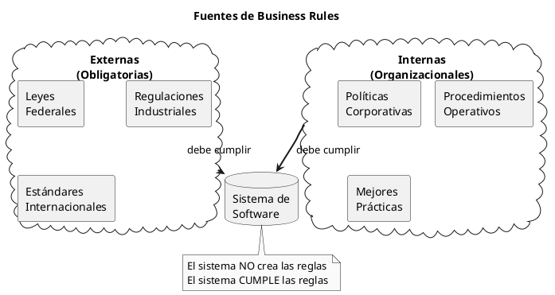

**Características distintivas:**

1. **Externas:** Provienen de fuera del sistema
2. **Obligatorias:** No son opcionales ni negociables
3. **Estables:** Cambian menos frecuentemente que los requerimientos
4. **Influyentes:** Afectan múltiples partes del sistema

**Ejemplo:**

```
BR_028:
  Definición: "Solicitudes de compra que excedan $500 requieren 
               aprobación del gerente de departamento"
  Tipo: Restricción
  Fuente: Política Financiera Corporativa v2.3, Sección 4.2
  Razón: Control de gastos y cumplimiento de auditoría interna
  Fecha vigencia: 2023-01-01
  Estática: No (puede cambiar por decisión del CFO)
```

### 2.3 Nivel 1: Business Requirements

Los Business Requirements expresan los objetivos de alto nivel que justifican la existencia del proyecto. Responden la pregunta: "¿Por qué estamos construyendo este sistema?"

Estos requerimientos están influenciados por las Business Rules, pero no son simplemente una reiteración de ellas. Representan la visión estratégica del negocio.

**Ejemplo:**

```
Business Requirement:
  "El Sistema de Seguimiento de Químicos debe permitir el 
   cumplimiento de todas las regulaciones federales y estatales 
   relacionadas con el uso, almacenamiento y disposición de 
   productos químicos peligrosos, reduciendo el riesgo de 
   incumplimiento y sanciones."

Influenciado por:
  - BR_087 (OSHA 1910.1200)
  - BR_088 (EPA 40 CFR Part 262)
  - BR_089 (State Chemical Safety Act)
```

### 2.4 Nivel 2: User Requirements

Los User Requirements describen comportamientos del sistema desde la perspectiva del usuario. Se expresan típicamente como Casos de Uso que especifican interacciones completas entre actores y sistema.

Un User Requirement NO especifica cómo el sistema implementa la funcionalidad internamente, solo describe lo que el usuario observa.

**Ejemplo:**

```
UC_04: Solicitar Producto Químico

Actor Primario: Solicitante
Objetivo: Obtener autorización para adquirir un producto químico

Flujo Normal:
  1. Solicitante ingresa código del producto
  2. Sistema muestra información del producto
  3. Solicitante ingresa cantidad y justificación
  4. Sistema verifica capacitación del solicitante
  5. Sistema valida cantidad contra límites permitidos
  6. SI monto >$500 ENTONCES
       Sistema solicita aprobación de gerente
  7. Sistema registra la solicitud
  8. Sistema notifica al solicitante

Business Rules aplicadas: BR_028, BR_087, BR_031
```

### 2.5 Nivel 3: Functional Requirements

Los Functional Requirements son especificaciones detalladas de lo que el sistema debe hacer. Se derivan directamente de los pasos de los Casos de Uso.

Mientras que un Caso de Uso describe una interacción completa, los Functional Requirements descomponen esa interacción en funciones específicas del sistema.

**Ejemplo (derivado del UC_04):**

```
RF_205: "El sistema debe comparar el monto total de la solicitud 
         contra el umbral de $500"

RF_206: "SI el monto excede $500 ENTONCES el sistema debe:
         - Cambiar el estado de la solicitud a 'Pendiente Aprobación'
         - Identificar al gerente del departamento del solicitante
         - Enviar notificación al gerente con detalles de solicitud
         - Bloquear procesamiento hasta recibir aprobación"

RF_207: "El sistema debe registrar timestamp de cada cambio de 
         estado en la solicitud"

Derivados de: UC_04, Paso 6
Implementan: BR_028
```

### 2.6 El Flujo de Influencia

Las Business Rules no solo generan un nivel, sino que influyen en múltiples aspectos del sistema simultáneamente.

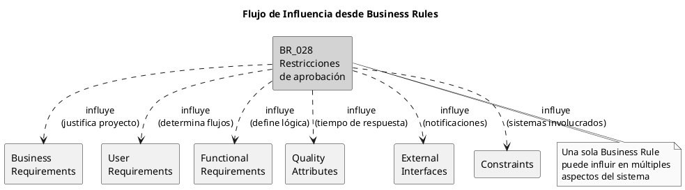

### 2.7 Análisis del Diagrama Maestro

El diagrama que muestra la relación completa entre todos los elementos es:

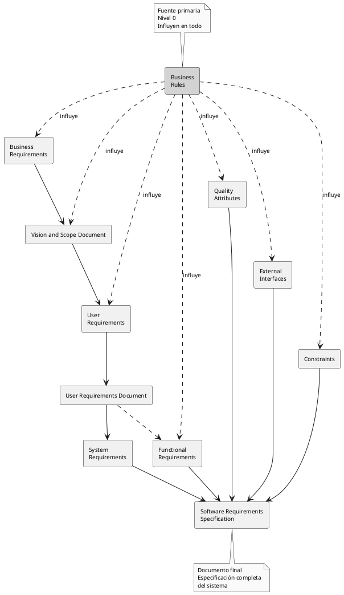

**Interpretación del diagrama:**

1. **Business Rules (centro superior):** Son la fuente primaria. Las flechas punteadas indican que influyen en múltiples elementos simultáneamente.
    
2. **Documentos intermedios:**
    
    - **Vision and Scope Document:** Captura Business Requirements
    - **User Requirements Document:** Captura Casos de Uso
3. **Elementos específicos:**
    
    - **Functional Requirements:** Lo que el sistema hace
    - **Quality Attributes:** Cómo de bien lo hace
    - **External Interfaces:** Con qué se comunica
    - **Constraints:** Limitaciones tecnológicas/organizacionales
    - **System Requirements:** Requerimientos de infraestructura
4. **Software Requirements Specification (SRS):** El documento final que integra todo.
    

**Punto clave:** Las Business Rules no solo generan Business Requirements. Influyen directamente en todos los niveles. Esta influencia múltiple es lo que hace crítico identificarlas y documentarlas explícitamente.

---

## 3. PRINCIPIOS DE TRANSFORMACIÓN

### 3.1 El Concepto de Transformación

Transformar una Business Rule en requerimientos implementables no es un proceso mecánico. Requiere entender la naturaleza de la regla y aplicar el patrón de transformación correcto.

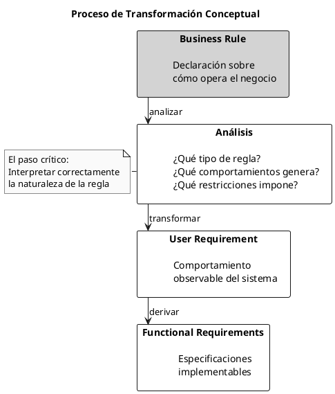

### 3.2 Tipos de Business Rules y Sus Transformaciones

No todas las Business Rules se transforman de la misma manera. El tipo de regla determina cómo afecta el sistema.

**Taxonomía de 5 tipos:**

```plantuml
@startuml
!pragma layout elk
skinparam monochrome true
skinparam defaultFontSize 11

package "Business Rules" {
  rectangle "Hechos" as fact {
    Verdades sobre el dominio
    Estructuran el modelo
    ----
    "Cada contenedor tiene
    código único"
  }
  
  rectangle "Restricciones" as const {
    Limitaciones obligatorias
    Qué DEBE/NO DEBE pasar
    ----
    "Solo gerentes
    aprueban >$500"
  }
  
  rectangle "Desencadenadores" as trig {
    Condición → Comportamiento
    Generan acciones observables
    ----
    "SI vence químico
    ENTONCES notificar"
  }
  
  rectangle "Inferencias" as inf {
    Condición → Nuevo hecho
    Solo cambio de estado interno
    ----
    "SI >30 días impago
    ENTONCES marcar deudora"
  }
  
  rectangle "Cálculos" as calc {
    Fórmulas y algoritmos
    Transformaciones de datos
    ----
    "Precio = items - desc
    + IVA + envío"
  }
}

fact -[hidden]-> const
const -[hidden]-> trig
trig -[hidden]-> inf
inf -[hidden]-> calc

@enduml
```

**Patrón de transformación por tipo:**

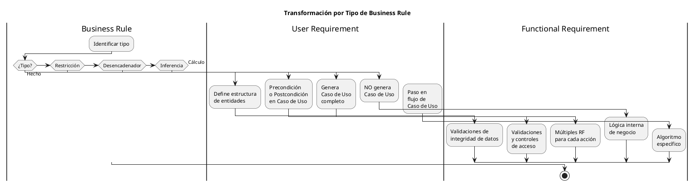

### 3.3 La Distinción Crítica: Desencadenador vs Inferencia

Esta es la distinción más importante y frecuentemente malentendida.

**Definiciones:**

```
Desencadenador (Trigger):
  SI [condición] ENTONCES [COMPORTAMIENTO OBSERVABLE]
  
  El resultado es una ACCIÓN que el usuario o un sistema externo
  puede observar que ocurrió.

Inferencia:
  SI [condición] ENTONCES [NUEVO HECHO INTERNO]
  
  El resultado es un CAMBIO DE ESTADO que solo el sistema conoce
  internamente.
```

**Diferencia fundamental:**

```plantuml
@startuml
skinparam monochrome true
!pragma layout smetana

title Desencadenador vs Inferencia

rectangle "Business Rule" as br

rectangle "¿Observable\nexternamente?" as obs

rectangle "Desencadenador" as trig {
  El sistema HACE algo visible
  ----
  Genera Caso de Uso
  ----
  Ejemplos:
  - Enviar notificación
  - Generar reporte
  - Bloquear cuenta
  - Activar alarma
}

rectangle "Inferencia" as inf {
  El sistema SABE algo nuevo
  ----
  NO genera Caso de Uso
  ----
  Ejemplos:
  - Marcar como deudor
  - Clasificar como VIP
  - Etiquetar riesgoso
  - Considerar vencido
}

br --> obs
obs --> trig : SÍ
obs --> inf : NO

note bottom of trig
  Usuario/sistema externo
  puede OBSERVAR que pasó
end note

note bottom of inf
  Solo lógica interna
  No hay acción visible
end note

@enduml
```

**Ejemplo comparativo:**

```
Contexto: Sistema de inventario de químicos

BR_045 (Desencadenador):
  "SI un contenedor de químico alcanza su fecha de vencimiento
   ENTONCES el sistema debe notificar al propietario del 
   contenedor y al coordinador de seguridad"
   
  Resultado: COMPORTAMIENTO OBSERVABLE
  - Se envían emails (acción visible)
  - Usuarios reciben notificaciones (observable)
  
  Transformación:
    → Genera UC_07: "Notificar Vencimiento de Químico"
    → Genera RF_301: "Sistema envía email a propietario"
    → Genera RF_302: "Sistema envía email a coordinador"

BR_046 (Inferencia):
  "SI un contenedor de químico alcanza su fecha de vencimiento
   ENTONCES el sistema debe marcar el contenedor como 'Caduco'"
   
  Resultado: NUEVO HECHO INTERNO
  - Campo status cambia a "Caduco" (solo interno)
  - No hay acción visible para usuario
  
  Transformación:
    → NO genera Caso de Uso
    → Genera RF_303: "Sistema actualiza status a 'Caduco'"
    → Es lógica interna de negocio
```

### 3.4 Trazabilidad Bidireccional

La trazabilidad no es solo hacia adelante (de regla a código), sino también hacia atrás (de código a regla).

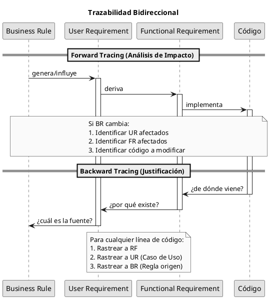

**Forward Tracing (hacia adelante):**

Pregunta: "Si esta Business Rule cambia, ¿qué debo actualizar?"

```
BR_028: "Solicitudes >$500 requieren aprobación"
  ↓
UC_04: "Solicitar Producto Químico" (Paso 6)
  ↓
RF_205: "Comparar monto con umbral"
RF_206: "Solicitar aprobación si >umbral"
RF_207: "Registrar timestamp"
  ↓
QA-12: "Notificar en <5 segundos"
  ↓
[Código en ProductRequestService.java, línea 234]
[Código en ApprovalController.java, línea 89]
[Código en NotificationService.java, línea 156]
```

Si BR_028 cambia de $500 a $1,000:

1. Actualizar UC_04 Paso 6
2. Actualizar RF_205 (nuevo umbral)
3. Actualizar RF_206 (nueva lógica)
4. QA-12 no cambia (sigue siendo <5 seg)
5. Actualizar constante en ProductRequestService
6. Actualizar tests relacionados

**Backward Tracing (hacia atrás):**

Pregunta: "¿Por qué existe esta línea de código?"

```
[Código: if (amount > 500) requireApproval();]
  ↑ implementa
RF_206: "Solicitar aprobación si monto >$500"
  ↑ deriva de
UC_04: "Solicitar Producto Químico", Paso 6
  ↑ implementa
BR_028: "Solicitudes >$500 requieren aprobación gerente"
  ↑ viene de
Política Financiera Corporativa v2.3, Sección 4.2
```

Ahora sabemos:

- Por qué existe el código
- De dónde viene la regla
- Quién puede autorizar cambios (CFO)
- Qué documento actualizar si cambia

### 3.5 Propagación de Cambios

Cuando una Business Rule cambia, el impacto se propaga por la jerarquía.

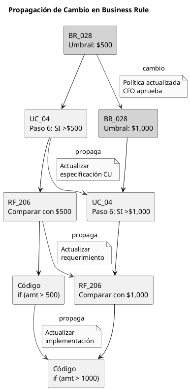

Con trazabilidad:

- Se identifican todos los elementos afectados
- Se actualiza consistentemente en todos los niveles
- Se mantiene documentación sincronizada con código

Sin trazabilidad:

- Se actualiza código pero no documentación
- Se pierden algunos lugares donde se usa la regla
- Se generan inconsistencias

---

## 4. ALCANCE Y LIMITACIONES

### 4.1 Qué Cubre Este Documento

Este documento proporciona una metodología específica y práctica para:

**1. Identificación de Business Rules**

- Técnicas de elicitación (licitación)
- Clasificación en 5 tipos
- Diferenciación crítica: Desencadenador vs Inferencia
- Documentación estructurada
- Gestión de catálogo de reglas

**2. Transformación de Business Rules en User Requirements**

- Patrones de transformación por tipo de regla
- Generación de Casos de Uso desde Desencadenadores
- Integración de Restricciones en flujos
- Incorporación de Cálculos en pasos

**3. Derivación de Functional Requirements**

- Descomposición de Casos de Uso en pasos específicos
- Especificación detallada de comportamientos
- Lógica de negocio implementable

**4. Especificación de Non-Functional Requirements**

- Quality Attributes que restringen funcionalidad
- Técnicas de especificación medible
- Priorización de atributos de calidad

**5. Validación de Trazabilidad**

- Trazabilidad forward y backward
- Matrices de trazabilidad
- Análisis de impacto de cambios

**6. Diagramación en UML**

- Diagramas de Casos de Uso
- Relaciones: Include, Extend
- Especialización de actores

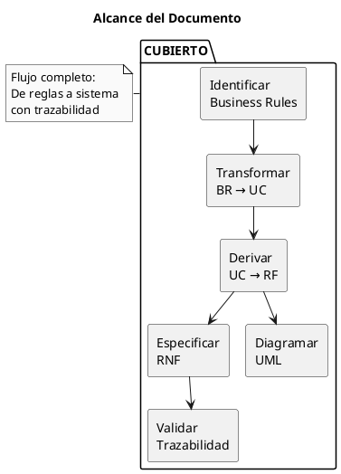

### 4.2 Qué NO Cubre Este Documento

Este documento NO es una guía completa de ingeniería de software. Específicamente, NO cubre:

**1. Metodologías Completas de Desarrollo**

- **RUP (Rational Unified Process):** Este documento NO enseña RUP completo
- **Scrum, XP, Kanban:** No cubre metodologías ágiles
- **Cascada:** No cubre ciclo de vida en cascada
- **DevOps:** No cubre integración/despliegue continuo

**2. Patrones de Diseño y Arquitectura**

- **GRASP (General Responsibility Assignment Software Patterns):** No cubre patrones de asignación de responsabilidades
- **GoF (Gang of Four):** No cubre patrones de diseño clásicos
- **Patrones Arquitectónicos:** No cubre MVC, MVP, MVVM, microservicios, etc.
- **DDD (Domain-Driven Design):** No cubre diseño dirigido por dominio

**3. Diseño Detallado**

- Diagramas de clases detallados
- Diagramas de secuencia de implementación
- Diseño de base de datos
- Diseño de interfaces

**4. Implementación**

- Codificación en lenguajes específicos
- Frameworks y bibliotecas
- Testing unitario/integración
- Refactoring

**5. Gestión de Proyectos**

- Planificación y estimación
- Gestión de riesgos
- Gestión de configuración
- Métricas y seguimiento

**6. Otras Disciplinas**

- Arquitectura empresarial
- Gestión de procesos de negocio (BPM)
- Minería de procesos
- Inteligencia de negocios

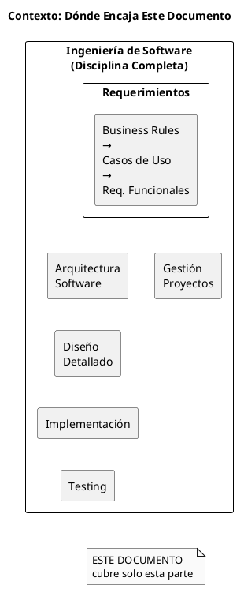

### 4.3 Relación con Otras Disciplinas

Aunque este documento no cubre RUP o GRASP, el conocimiento aquí presentado es compatible y complementario con esas metodologías.

**Relación con RUP:**

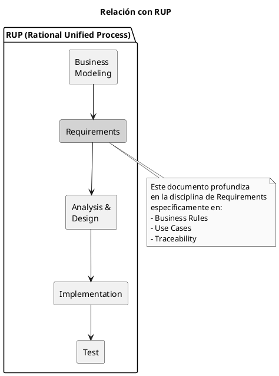

Este documento puede usarse DENTRO de la disciplina de Requirements de RUP para mejorar la trazabilidad desde Business Rules.

**Relación con GRASP:**

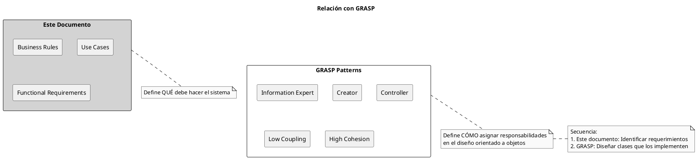

GRASP opera en una fase posterior: asume que ya tienes los requerimientos claros, y te ayuda a diseñar clases que los implementen bien.

### 4.4 Cuándo Usar Este Documento

**Situaciones ideales:**

1. **Proyectos nuevos con reglas complejas:**
    
    - Industrias reguladas (salud, finanzas, químicos)
    - Múltiples políticas organizacionales
    - Necesidad de auditoría/cumplimiento
2. **Sistemas legacy sin documentación:**
    
    - Código existente sin trazabilidad
    - Necesidad de modernización
    - Requerimientos perdidos
3. **Equipos distribuidos:**
    
    - Múltiples analistas/desarrolladores
    - Necesidad de documentación clara
    - Rotación de personal

**Situaciones donde puede ser excesivo:**

1. Prototipos rápidos sin reglas complejas
2. Proyectos muy pequeños (1-2 semanas)
3. Sistemas sin regulaciones externas
4. Equipos muy pequeños con alta comunicación oral

---

## 5. ROADMAP DE LAS 6 PARTES

### 5.1 Visión General del Flujo de Trabajo

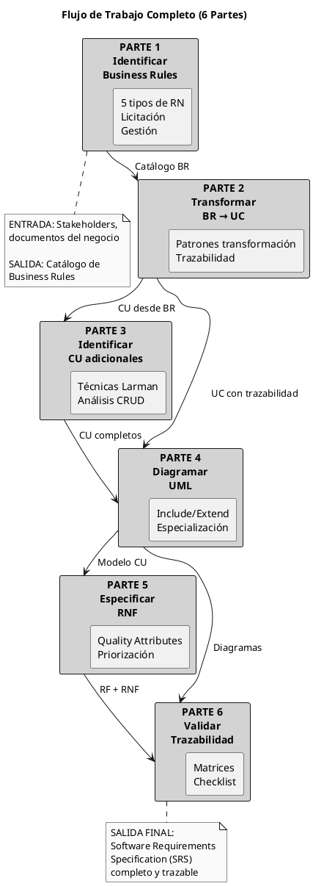

### 5.2 Parte 1: Identificar Reglas de Negocio

**Objetivo:** Extraer y documentar todas las Business Rules del proyecto.

**Contenido:**

- Definición y características de Business Rules
- Posición en jerarquía (Nivel 0)
- Los 5 tipos de Business Rules con ejemplos
- Diferencia crítica: Desencadenador vs Inferencia
- Técnicas de licitación (6 preguntas estratégicas)
- Herramientas de documentación (matrices, plantillas)
- Gestión de catálogo de Business Rules

**Entregables:**

- Catálogo de Business Rules completo
- Matriz de Roles y Permisos (si aplica)
- Plantillas estructuradas completadas
- Tablas de cálculos documentadas

**Tiempo estimado:** 2-3 horas de lectura + ejercicios

**Ejemplo clave trabajado:**

```
BR_028 (Restricción):
  Definición: "Solicitudes de compra >$500 requieren aprobación 
               del gerente de departamento"
  Tipo: Restricción
  Fuente: Política Financiera Corporativa v2.3, Sección 4.2
  Estática: No
  Fecha vigencia: 2023-01-01
```

### 5.3 Parte 2: Transformar RN en Casos de Uso

**Objetivo:** Convertir Business Rules en User Requirements (Casos de Uso) con trazabilidad completa.

**Contenido:**

- Patrones de transformación por tipo de Business Rule
- Cómo Desencadenadores generan Casos de Uso completos
- Cómo Restricciones se convierten en Precondiciones/Pasos
- Cómo Cálculos se integran en flujos
- Cómo Business Rules determinan lógica (ramificaciones)
- Trazabilidad bidireccional BR ↔ UC
- Ejemplo completo: R1 → UC → RF

**Entregables:**

- UC_04 completo con trazabilidad a BR_028, BR_031, BR_034
- Tabla de transformación BR → UC
- Documentación de relaciones

**Tiempo estimado:** 3-4 horas

**Ejemplo clave trabajado:**

```
BR_028 (Restricción) → UC_04, Paso 6:
  "6. Sistema verifica monto de la solicitud
      6.1. SI monto >$500 ENTONCES ir a Flujo Alterno FA-1"

FA-1: Solicitar Aprobación de Gerente
  1. Sistema identifica gerente del departamento
  2. Sistema cambia estado a 'Pendiente Aprobación'
  3. Sistema envía notificación a gerente
  ...
```

### 5.4 Parte 3: Identificar CU Adicionales

**Objetivo:** Identificar Casos de Uso que no derivan directamente de Business Rules.

**Contenido:**

- 6 técnicas de Larman para identificar Casos de Uso
- Análisis CRUD (la técnica más usada)
- Procedimiento básico: Límite → Actores → Objetivos → CU
- Relación entre actores y límites del sistema
- Identificación de actores primarios y secundarios

**Entregables:**

- Lista completa de Casos de Uso del sistema
- Matriz CRUD (Entidades × Operaciones)
- Identificación de todos los actores

**Tiempo estimado:** 2-3 horas

**Ejemplo clave trabajado:**

```
Análisis CRUD para entidad "Producto Químico":
  → UC_01: Registrar Producto Químico (Create)
  → UC_02: Consultar Producto Químico (Read)
  → UC_03: Actualizar Producto Químico (Update)
  → UC_04: Eliminar Producto Químico (Delete)
```

### 5.5 Parte 4: Diagramar en UML

**Objetivo:** Representar visualmente el modelo de Casos de Uso en diagramas UML.

**Contenido:**

- Sintaxis UML para Casos de Uso
- Relación Include (reutilización obligatoria)
- Relación Extend (extensión condicional)
- Especialización de actores (herencia)
- Generalización de Casos de Uso
- Convenciones de diagramación

**Entregables:**

- Diagrama UML completo del sistema
- Documentación de relaciones Include/Extend
- Jerarquía de actores

**Tiempo estimado:** 3-4 horas

**Ejemplo clave trabajado:**

```
Include:
  "Solicitar Producto Químico" <<include>> "Identificar Usuario"
  (Siempre se ejecuta, reutilización)

Extend:
  "Solicitar Producto" <<extend>> "Producto Personalizado"
  (Solo si cliente solicita personalización)
```

### 5.6 Parte 5: Especificar RNF

**Objetivo:** Especificar Requerimientos No Funcionales (Quality Attributes) que restringen los Functional Requirements.

**Contenido:**

- 11 categorías de RNF (Disponibilidad, Desempeño, Seguridad, etc.)
- Externos vs Internos (quién percibe el atributo)
- Técnicas de priorización (matriz de comparación pareada)
- Trade-offs entre atributos (seguridad vs desempeño)
- Técnica SMART (Específico, Medible, Alcanzable, Relevante, Temporal)
- Técnica de especificación: Fuente → Estímulo → Respuesta → Medida

**Entregables:**

- Matriz de priorización de RNF completada
- RNF especificados con técnica SMART
- Escenarios de Quality Attributes

**Tiempo estimado:** 2-3 horas

**Ejemplo clave trabajado:**

```
RNF mal especificado:
  "El sistema será rápido" ❌ (ambiguo, no medible)

RNF bien especificado:
  "Cuando un usuario autorizado solicita generar un reporte
   de inventario completo, el sistema debe generar el reporte
   en menos de 10 segundos en el 95% de los casos" ✓
   
  Fuente: Usuario autorizado
  Estímulo: Solicita reporte de inventario
  Sistema: Módulo de Reportes
  Respuesta: Genera reporte
  Medida: <10 segundos en 95% de casos
```

### 5.7 Parte 6: Validar Trazabilidad

**Objetivo:** Verificar trazabilidad completa desde Business Rules hasta implementación.

**Contenido:**

- Trazabilidad forward (análisis de impacto)
- Trazabilidad backward (justificación)
- Matrices de trazabilidad (múltiples niveles)
- Checklist de calidad completo
- Ejercicio integrador (caso real completo)

**Entregables:**

- Matriz de trazabilidad BR → UC → RF → RNF
- Checklist de calidad validado
- Ejercicio integrador resuelto
- Software Requirements Specification (SRS) completo

**Tiempo estimado:** 3-4 horas

**Ejemplo clave trabajado:**

```
Trazabilidad completa:

BR_028 (Política Financiera v2.3) →
  UC_04 (Solicitar Producto Químico) →
    RF_205 (Comparar monto con umbral) →
    RF_206 (Solicitar aprobación si >umbral) →
    RF_207 (Registrar timestamp) →
      QA-12 (Notificar en <5 segundos)

Validación:
  ✓ BR_028 correctamente implementado en RF_206
  ✓ RF_206 deriva de UC_04 Paso 6
  ✓ QA-12 restringe tiempo de RF_206
  ✓ Trazabilidad bidireccional verificada
```

### 5.8 Resultados Esperados al Completar las 6 Partes

Al finalizar las 6 partes, se habrá producido:

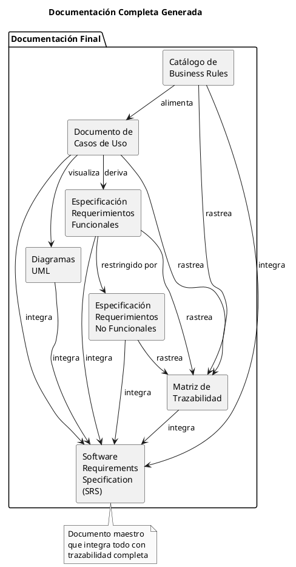

**Documentos específicos:**

1. **Catálogo de Business Rules** (Parte 1)
    
    - ID único para cada regla
    - Clasificación por tipo
    - Fuente documentada
    - Estática/Dinámica
2. **Especificación de Casos de Uso** (Partes 2, 3)
    
    - Casos de Uso completos
    - Actores identificados
    - Flujos Normal y Alternos
    - Precondiciones/Postcondiciones
    - Business Rules aplicadas (trazabilidad)
3. **Diagramas UML** (Parte 4)
    
    - Diagrama de Casos de Uso con actores
    - Relaciones Include/Extend
    - Especialización de actores
4. **Requerimientos Funcionales** (Parte 2)
    
    - RF derivados de pasos de Casos de Uso
    - ID único para cada RF
    - Trazabilidad a UC y BR
5. **Requerimientos No Funcionales** (Parte 5)
    
    - RNF especificados con técnica SMART
    - Priorizados con matriz pareada
    - Escenarios de Quality Attributes
6. **Matriz de Trazabilidad** (Parte 6)
    
    - BR → UC → RF → RNF
    - Forward y Backward tracing
    - Análisis de impacto
7. **Software Requirements Specification (SRS)** (Integración final)
    
    - Integra todos los documentos anteriores
    - Estándar IEEE 830 (o similar)
    - Completo y trazable

---

## 6. CONVENCIONES

### 6.1 Notación de Identificadores

A lo largo del documento y en proyectos reales, se utilizan identificadores únicos para cada elemento:

**Business Rules:**

```
Formato: BR_NNN (donde NNN es número secuencial de 3 dígitos)
Ejemplos: BR_001, BR_028, BR_099, BR_123

Opcionalmente con prefijo de dominio:
  FIN-BR_028 (Business Rule del dominio Financiero)
  SEC-BR_087 (Business Rule del dominio Seguridad)
```

**User Requirements (Casos de Uso):**

```
Formato: UC_NN (donde NN es número secuencial de 2 dígitos)
Ejemplos: UC_01, UC_04, UC_15, UC_99

Alternativamente:
  CU-NN (Caso de Uso en español)
```

**Functional Requirements:**

```
Formato: RF_NNN (Requerimiento Funcional)
Ejemplos: RF_001, RF_205, RF_999

O con módulo:
  INV-RF_205 (Requerimiento Funcional de módulo Inventario)
```

**Non-Functional Requirements / Quality Attributes:**

```
Formato: RNF-NN o QA-NN
Ejemplos: RNF-05, QA-12

O por categoría:
  PERF_05 (Performance/Desempeño)
  SEC-12 (Security/Seguridad)
  USAB-03 (Usability/Usabilidad)
```

### 6.2 Representación de Relaciones

**Símbolos en texto:**

```
→   Flujo, genera, deriva
    Ejemplo: BR_028 → UC_04 (BR_028 genera UC_04)

←   Influencia, restringe (dirección contraria)
    Ejemplo: UC_04 ← BR_028 (BR_028 restringe UC_04)

↔   Trazabilidad bidireccional
    Ejemplo: BR_028 ↔ UC_04 (trazables en ambas direcciones)

⇒   Implica lógicamente
    Ejemplo: Condición ⇒ Consecuencia

≠   No igual
≤   Menor o igual
≥   Mayor o igual
```

**En diagramas PlantUML:**

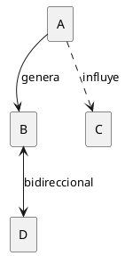

### 6.3 Lectura de Diagramas

**Tipos de líneas:**

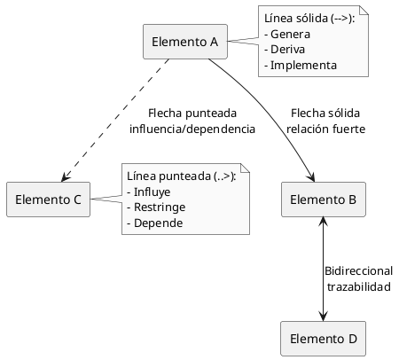

**Colores en diagramas (cuando se usan):**

```plantuml
@startuml
skinparam monochrome false

rectangle "Nivel 0\nBusiness Rules" as n0 #E3F2FD
rectangle "Nivel 1\nBusiness Requirements" as n1 #E8F5E9
rectangle "Nivel 2\nUser Requirements" as n2 #FFF9C4
rectangle "Nivel 3\nFunctional Requirements" as n3 #FFEBEE

n0 ..> n1
n1 --> n2
n2 --> n3

note right
  Azul claro: Nivel 0
  Verde claro: Nivel 1
  Amarillo claro: Nivel 2
  Rojo claro: Nivel 3
end note

@enduml
```

**Nota:** En documentos monocromáticos, los niveles se distinguen por posición vertical o etiquetas explícitas.

### 6.4 Formato de Ejemplos

**Business Rules:**

```
BR_NNN (Tipo):
  Definición: [Texto completo de la regla]
  Tipo: [Hecho/Restricción/Desencadenador/Inferencia/Cálculo]
  Fuente: [Documento de origen]
  Estática: [Sí/No]
  Fecha vigencia: [YYYY-MM-DD]
  
Ejemplo:

BR_028 (Restricción):
  Definición: "Solicitudes de compra que excedan $500 requieren
               aprobación del gerente de departamento"
  Tipo: Restricción
  Fuente: Política Financiera Corporativa v2.3, Sección 4.2
  Estática: No
  Fecha vigencia: 2023-01-01
```

**Casos de Uso:**

```
UC_NN: [Nombre del Caso de Uso]

Actor Primario: [Actor]
Objetivo: [Objetivo del actor]

Precondiciones:
  - [Condición 1]
  - [Condición 2]

Flujo Normal:
  1. [Paso 1]
  2. [Paso 2]
  3. [Paso 3]
  ...

Flujos Alternos:
  FA-N: [Nombre del flujo alterno]
    1. [Paso 1]
    2. [Paso 2]
    ...

Postcondiciones:
  - [Estado resultante]

Business Rules: BR_NNN, BR_MMM
```

**Functional Requirements:**

```
RF_NNN: "[Descripción clara del requerimiento funcional]"

Derivado de: UC_NN, Paso N
Implementa: BR_NNN
Prioridad: [Alta/Media/Baja]
```

### 6.5 Convenciones de Escritura

**Verbos para Business Rules:**

```
DEBE:     Obligatorio (requirements)
NO DEBE:  Prohibido
PUEDE:    Opcional
DEBERÍA:  Recomendado pero no obligatorio
```

**Verbos para especificar comportamiento del sistema:**

```
Presente indicativo:
  "El sistema verifica..."
  "El sistema registra..."
  "El sistema notifica..."

NO usar:
  "El sistema verificará..." (futuro)
  "El sistema debe verificar..." (obligación, usar en RN)
```

### 6.6 Estructura de Referencia Cruzada

Cuando se hace referencia a elementos en diferentes secciones:

```
"Como se especifica en BR_028 (ver Parte 1, Sección 4.2),
 las solicitudes mayores a $500 requieren aprobación."

"El UC_04 (detallado en Parte 2) implementa esta regla
 en el Paso 6 del Flujo Normal."
```

### 6.7 Plantillas de Documentación

Todas las plantillas mencionadas en el documento están disponibles en las partes correspondientes:

- **Plantilla Business Rule:** Parte 1, Sección 7.2
- **Plantilla Caso de Uso:** Parte 2, Sección 3
- **Matriz CRUD:** Parte 3, Sección 2.2
- **Plantilla RNF:** Parte 5, Sección 4

---

## CONCLUSIÓN

Este documento proporciona el contexto y fundamentos necesarios para comprender el enfoque de trabajo que se desarrollará en las siguientes 6 partes.

La idea central es simple pero poderosa:

```
Las reglas de negocio existen independientemente del sistema.
El sistema debe implementar esas reglas correctamente.
La trazabilidad permite validar que así sea.
```

```plantuml
@startuml
skinparam monochrome true
!pragma layout smetana

title Concepto Central

cloud "Mundo Real" as mundo {
  rectangle "Reglas\nde\nNegocio" as rules #lightgray
}

rectangle "Sistema\nde\nSoftware" as system {
  rectangle "Requerimientos\nImplementados" as req
}

rules ==> req : debe cumplir

rectangle "Trazabilidad" as trace

rules --> trace : documenta origen
req --> trace : documenta implementación
trace --> rules : permite validar
trace --> req : permite validar

note bottom of trace
  La trazabilidad es el puente
  que conecta las reglas del
  mundo real con el código
  del sistema
end note

@enduml
```

**Próximos pasos:**

1. Proceder a **Parte 1: Identificar Reglas de Negocio**
2. Aplicar el conocimiento a un proyecto real mientras se avanza
3. Utilizar las plantillas y herramientas proporcionadas
4. Completar los ejercicios para validar comprensión

---

**Documento:** PARTE 0 - Contexto y Fundamentos  
**Versión:** 1.0  
**Fecha:** Diciembre 8, 2025  
**Longitud:** ~18,000 palabras

**Siguiente:** [PARTE 1 - IDENTIFICAR REGLAS DE NEGOCIO](https://claude.ai/chat/PARTE1_IDENTIFICAR_REGLAS_NEGOCIO.md)

---