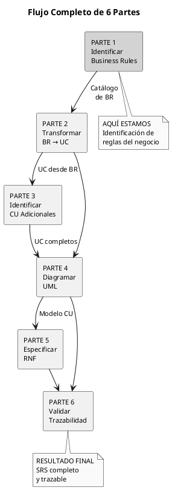
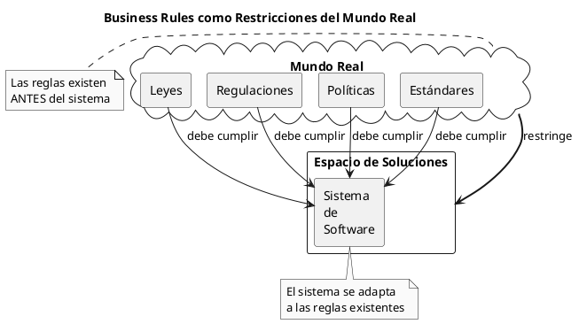
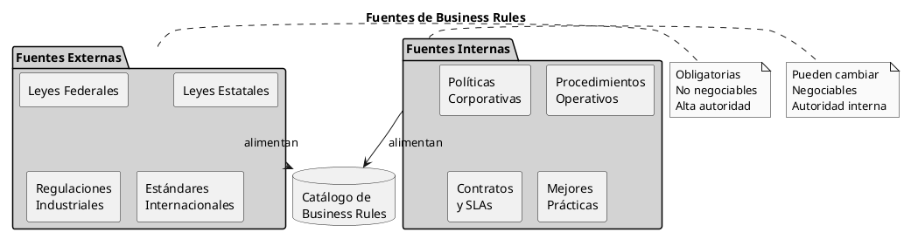
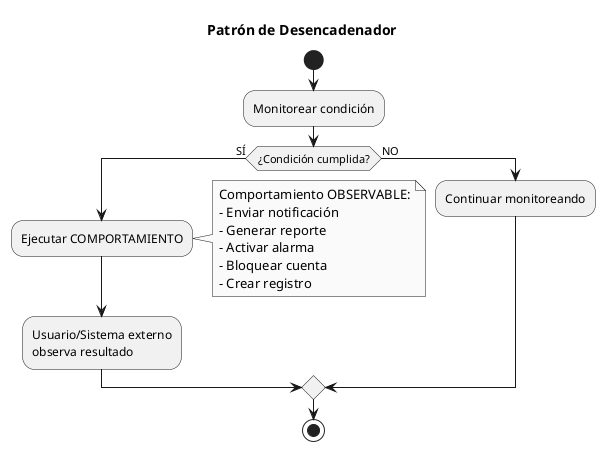
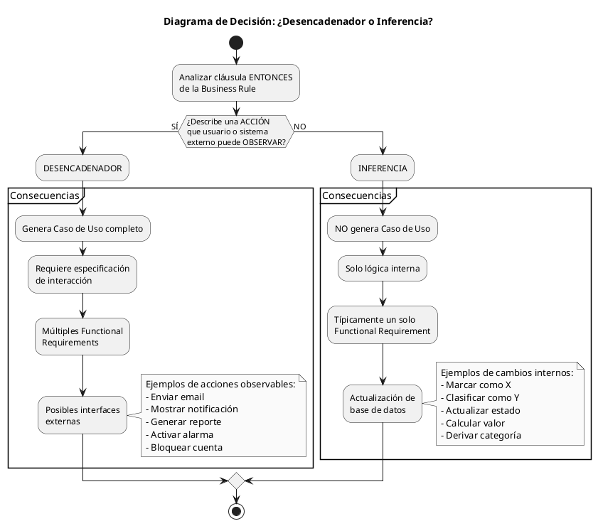
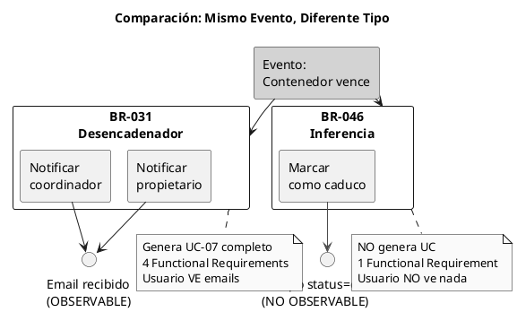
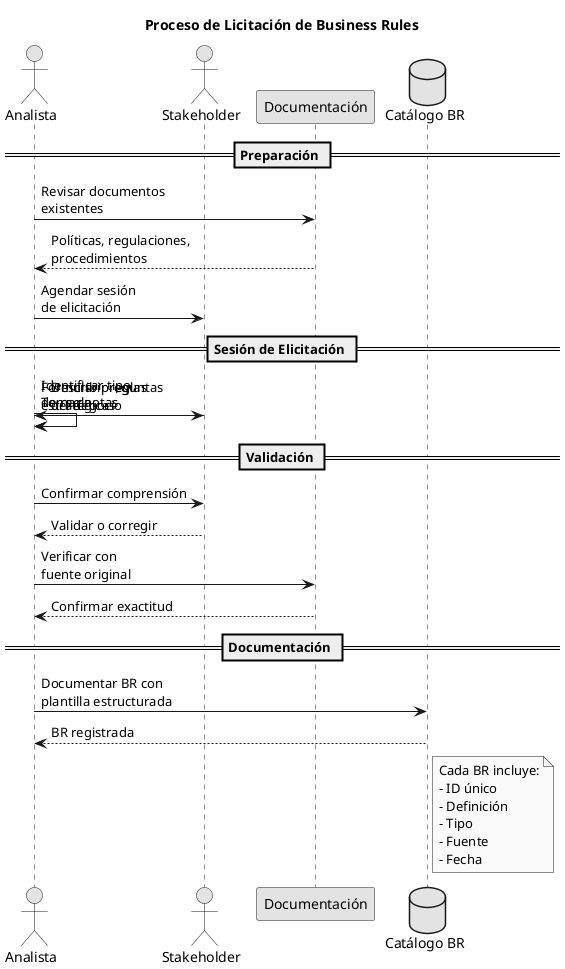
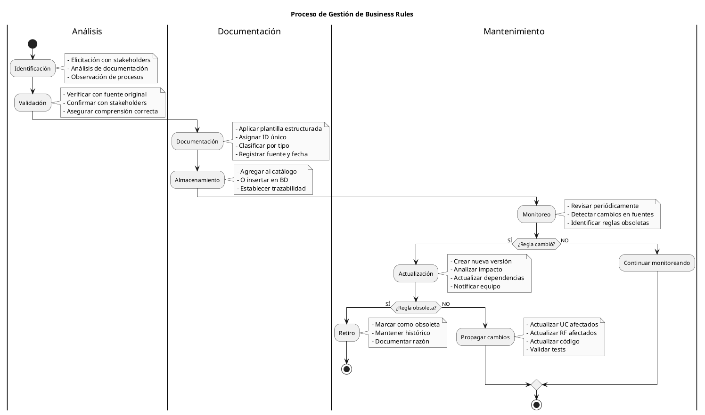
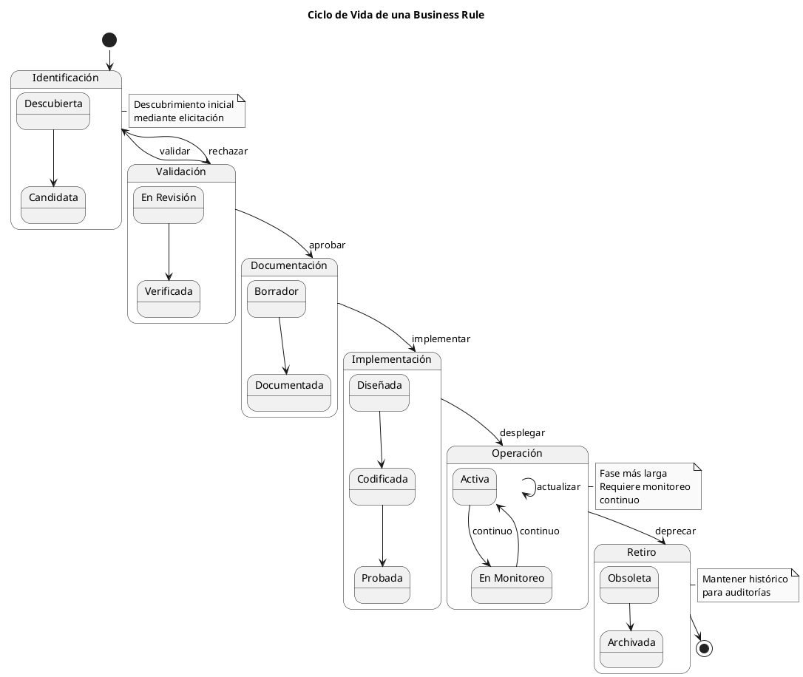

UID: 20251208034056696331
date: 2025-12-08

# PARTE 1: IDENTIFICAR REGLAS DE NEGOCIO

**Documento Puente: De Reglas de Negocio a Sistema Completo**

---

## TABLA DE CONTENIDOS

1. [Introducción](#1-introducción)
2. [Naturaleza de las Reglas de Negocio](#2-naturaleza-de-las-reglas-de-negocio)
3. [Posición en la Jerarquía](#3-posición-en-la-jerarquía)
4. [Taxonomía: Los 5 Tipos de Reglas](#4-taxonomía-los-5-tipos-de-reglas)
5. [La Distinción Crítica: Desencadenador vs Inferencia](#5-la-distinción-crítica-desencadenador-vs-inferencia)
6. [Identificación: Técnicas de Elicitación](#6-identificación-técnicas-de-elicitación)
7. [Documentación de Reglas](#7-documentación-de-reglas)
8. [Gestión del Catálogo de Reglas](#8-gestión-del-catálogo-de-reglas)
9. [Ciclo de Vida de una Regla de Negocio](#9-ciclo-de-vida-de-una-regla-de-negocio)
10. [Casos Especiales](#10-casos-especiales)
11. [Ejercicios Prácticos](#11-ejercicios-prácticos)
12. [Resumen y Siguientes Pasos](#12-resumen-y-siguientes-pasos)

---

## 1. INTRODUCCIÓN

### 1.1 Objetivo de esta Parte

Esta parte del documento se enfoca en la identificación y documentación de Business Rules como paso fundamental en el proceso de desarrollo de requerimientos. Al finalizar esta sección, se habrá adquirido la capacidad de:

1. Comprender la naturaleza conceptual de las Business Rules
2. Identificar los cinco tipos de reglas y sus características distintivas
3. Distinguir entre Desencadenadores e Inferencias (distinción crítica)
4. Aplicar técnicas de elicitación para extraer reglas del negocio
5. Documentar reglas mediante plantillas estructuradas
6. Gestionar un catálogo de Business Rules profesionalmente

### 1.2 Contexto en el Flujo Completo

Esta parte representa el primer paso en un proceso de seis fases que transforma reglas de negocio en un sistema completo y trazable.



**Posicionamiento:** Las Business Rules constituyen la entrada del proceso. Sin una identificación rigurosa de estas reglas, los pasos subsecuentes carecerán de fundamento sólido.

### 1.3 Qué Aprenderás

**Conceptos fundamentales:**
- Por qué las Business Rules existen independientemente del sistema
- Cómo las reglas influyen en múltiples niveles de requerimientos
- La taxonomía completa de cinco tipos de reglas

**Habilidades prácticas:**
- Técnicas de licitación (elicitación) para extraer reglas
- Documentación estructurada con plantillas
- Gestión profesional de catálogos de reglas

**Conocimiento crítico:**
- La distinción entre Desencadenadores e Inferencias
- Cómo esta distinción determina si se genera un Caso de Uso
- Por qué confundirlos genera errores en todo el desarrollo

---

## 2. NATURALEZA DE LAS REGLAS DE NEGOCIO

### 2.1 Definición Conceptual

Las Business Rules no son meros requerimientos. Son declaraciones sobre cómo opera la organización, derivadas de fuentes externas al sistema que se está construyendo.

**Definición formal:**

> Las Business Rules son políticas, leyes, regulaciones y estándares bajo los cuales una organización conduce sus operaciones. Estas reglas existen independientemente de cualquier sistema de software y deben ser cumplidas por cualquier solución que se implemente.

**Perspectiva conceptual:**

Las Business Rules representan restricciones del mundo real que el sistema debe respetar. No son decisiones de diseño ni preferencias del equipo de desarrollo; son limitaciones obligatorias impuestas por el contexto en el que el sistema operará.



### 2.2 Características Esenciales

**Externidad:**

Las Business Rules provienen de fuera del sistema. No son inventadas durante el análisis de requerimientos, sino descubiertas. El equipo de desarrollo no tiene autoridad para cambiarlas o ignorarlas.

**Obligatoriedad:**

Especialmente cuando derivan de leyes o regulaciones, las Business Rules no son negociables. El sistema debe cumplirlas sin excepción. Violarlas puede tener consecuencias legales o financieras.

**Estabilidad:**

Las Business Rules cambian menos frecuentemente que los requerimientos funcionales. Una ley puede permanecer vigente por décadas, mientras que la interfaz de usuario puede cambiar mensualmente.

**Influencia:**

Una sola Business Rule puede afectar múltiples aspectos del sistema: comportamientos de usuario, funcionalidad interna, atributos de calidad, interfaces externas y restricciones de diseño.

### 2.3 Fuentes de Business Rules

Las Business Rules no surgen del vacío. Provienen de fuentes específicas y documentadas.



**Fuentes externas (alta prioridad):**

1. **Leyes federales:** Legislación nacional que aplica a toda la jurisdicción
   - Ejemplo: Ley de Protección de Datos Personales

2. **Leyes estatales/locales:** Legislación regional específica
   - Ejemplo: Códigos de construcción municipales

3. **Regulaciones industriales:** Normativas de organismos reguladores
   - Ejemplo: OSHA (Occupational Safety and Health Administration)
   - Ejemplo: FDA (Food and Drug Administration)

4. **Estándares internacionales:** Normas ISO, IEEE, etc.
   - Ejemplo: ISO 27001 (Seguridad de la Información)

**Fuentes internas (menor prioridad pero importantes):**

1. **Políticas corporativas:** Reglas establecidas por la organización
   - Ejemplo: "Gastos >$500 requieren aprobación gerencial"

2. **Procedimientos operativos:** Prácticas estandarizadas
   - Ejemplo: "Tres cotizaciones antes de comprar"

3. **Contratos y SLAs:** Acuerdos con clientes o proveedores
   - Ejemplo: "Responder tickets en <4 horas"

4. **Mejores prácticas:** Conocimiento del dominio acumulado
   - Ejemplo: "Cambiar contraseñas cada 90 días"

### 2.4 Por Qué Existen Independientemente del Sistema

**Perspectiva temporal:**

Las Business Rules existían ANTES de que el proyecto de software fuera concebido. Continuarán existiendo DESPUÉS de que el sistema sea retirado. El sistema es solo un medio temporal para cumplir reglas permanentes.

```
Línea temporal:

[Regla creada] -------- [Sistema construido] -------- [Sistema retirado]
     1990                      2025                         2035
      |                          |                            |
      |                          |                            |
  Ley aprobada            Sistema implementa            Sistema legacy
  permanece vigente       la ley                        reemplazado
                                                        nueva ley sigue vigente
```

**Perspectiva de autoridad:**

El equipo de desarrollo NO tiene autoridad para crear o modificar Business Rules. Solo puede:

1. Identificarlas correctamente
2. Documentarlas fielmente
3. Implementarlas correctamente

Cambiar una Business Rule requiere que la fuente original (legislador, ejecutivo, comité de estándares) la modifique primero.

**Implicación práctica:**

Cuando un desarrollador pregunta "¿Por qué tenemos que hacerlo así?", la respuesta no debe ser "Porque está en los requerimientos", sino "Porque la Ley X/Política Y lo requiere". Esta trazabilidad hacia la fuente es esencial.

---

## 3. POSICIÓN EN LA JERARQUÍA

### 3.1 Nivel 0: El Nivel Más Abstracto

En la jerarquía de requerimientos, las Business Rules ocupan el Nivel 0, el nivel más abstracto y de mayor alcance. Están "por encima" incluso de los Business Requirements.

```plantuml
@startuml
!pragma layout smetana
skinparam monochrome true
skinparam defaultFontSize 11

title Jerarquía de Requerimientos - Niveles 0 a 3

package "Nivel 0" as n0 #E8E8E8 {
  rectangle "Business Rules" as br {
    Políticas, Leyes, Estándares
    ----
    Fuente primaria
    Independientes del sistema
    Más estables
  }
}

package "Nivel 1" as n1 #D0D0D0 {
  rectangle "Business Requirements" as breq {
    Objetivos del proyecto
    Justificación de inversión
    ----
    Pregunta: ¿POR QUÉ?
  }
}

package "Nivel 2" as n2 #B8B8B8 {
  rectangle "User Requirements" as ur {
    Casos de Uso
    Comportamientos observables
    ----
    Pregunta: ¿QUÉ hace usuario?
  }
}

package "Nivel 3" as n3 #A0A0A0 {
  rectangle "Functional Requirements" as fr {
    Especificaciones detalladas
    Pasos del sistema
    ----
    Pregunta: ¿CÓMO lo hace sistema?
  }
}

br ..> breq : influye
breq --> ur : genera
ur --> fr : deriva

note left of br
  Más abstracto
  Mayor alcance
  Menos detalles
end note

note right of fr
  Más concreto
  Menor alcance
  Más detalles
end note

@enduml
```

**Por qué Nivel 0:**

1. **Abstracción:** Las Business Rules no especifican cómo implementar, solo qué debe cumplirse

2. **Alcance:** Una Business Rule puede afectar múltiples módulos, casos de uso, y componentes

3. **Origen:** Vienen "desde afuera" del proyecto, no se generan durante el análisis

4. **Estabilidad:** Cambian menos que cualquier otro tipo de requerimiento

### 3.2 Influencia en Múltiples Niveles

Las Business Rules no solo generan Business Requirements. Influyen directamente en todos los niveles inferiores.

```plantuml
@startuml
skinparam monochrome true
!pragma layout smetana

title Influencia Múltiple de Business Rules

rectangle "BR-028\nSolicitudes >$500\nrequieren aprobación" as br #lightgray

rectangle "Business\nRequirement" as breq {
  Control financiero
  según políticas
}

rectangle "User\nRequirement" as ur {
  UC-04: Solicitar
  Producto Químico
}

rectangle "Functional\nRequirement" as fr {
  RF-206: Solicitar
  aprobación gerente
}

rectangle "Quality\nAttribute" as qa {
  QA-12: Notificar
  en <5 segundos
}

rectangle "External\nInterface" as ei {
  Email a gerente
  Notificación SMS
}

rectangle "Constraint" as con {
  Debe usar LDAP
  para identificar
  gerentes
}

br ..> breq : justifica proyecto
br ..> ur : determina flujo
br ..> fr : define lógica
br ..> qa : exige rapidez
br ..> ei : requiere notificación
br ..> con : implica integración

note bottom of br
  Una sola Business Rule
  puede influir en TODOS
  los aspectos del sistema
end note

@enduml
```

**Ejemplo concreto:**

```
BR-028: "Solicitudes de compra que excedan $500 requieren 
         aprobación del gerente de departamento"
         
Fuente: Política Financiera Corporativa v2.3, Sección 4.2

INFLUYE EN:

Nivel 1 (Business Requirements):
  → Justifica objetivo: "Control de gastos según políticas"

Nivel 2 (User Requirements):
  → UC-04, Paso 6: "SI monto >$500 ENTONCES solicitar aprobación"
  → UC-09, Precondición: "Usuario.rol = Gerente"

Nivel 3 (Functional Requirements):
  → RF-205: "Sistema compara monto con umbral $500"
  → RF-206: "Sistema identifica gerente del departamento"
  → RF-207: "Sistema envía notificación a gerente"

Quality Attributes:
  → QA-12: "Notificación enviada en <5 segundos"

External Interfaces:
  → EI-03: "Integración con servidor SMTP"
  → EI-04: "Integración con LDAP para identificar gerentes"

Constraints:
  → CON-07: "Debe usar LDAP corporativo existente"
```

### 3.3 Diagrama de Influencia

El análisis del diagrama presentado en la Parte 0 se profundiza aquí en el contexto específico de Business Rules.

Las flechas punteadas desde "Business Rules" hacia múltiples elementos indican **influencia**, no generación directa. Esto significa:

1. **No es cascada simple:** No es que BR → BReq → UR → FR en línea recta

2. **Es influencia múltiple:** BR influye simultáneamente en BReq, UR, FR, QA, EI, Constraints

3. **Trazabilidad compleja:** Un cambio en BR puede requerir cambios en múltiples niveles simultáneamente

**Implicación práctica:**

Cuando una Business Rule cambia (ejemplo: umbral de $500 → $1,000), el impacto debe analizarse en TODOS los niveles que influye, no solo en el nivel inmediato inferior.

---

## 4. TAXONOMÍA: LOS 5 TIPOS DE REGLAS

Las Business Rules se clasifican en cinco categorías según su naturaleza y el efecto que producen en el sistema. Esta taxonomía facilita su identificación, documentación y transformación posterior en requerimientos.

```plantuml
@startuml
!pragma layout elk
skinparam monochrome true
skinparam defaultFontSize 10

title Taxonomía de Business Rules

rectangle "Business Rules" as br #lightgray

rectangle "Tipo 1\nHechos" as t1 {
  Estructuran
  el dominio
}

rectangle "Tipo 2\nRestricciones" as t2 {
  Limitan
  acciones
}

rectangle "Tipo 3\nDesencadenadores" as t3 {
  Generan
  comportamientos
}

rectangle "Tipo 4\nInferencias" as t4 {
  Derivan
  hechos nuevos
}

rectangle "Tipo 5\nCálculos" as t5 {
  Transforman
  datos
}

br --> t1
br --> t2
br --> t3
br --> t4
br --> t5

t1 ..> t2 : restringen
t3 ..> t4 : pueden generar
t5 ..> t4 : pueden generar

note bottom of t3
  CRÍTICO:
  Genera Casos de Uso
end note

note bottom of t4
  CRÍTICO:
  NO genera Casos de Uso
end note

@enduml
```

### 4.1 Tipo 1: Hechos (Facts)

#### 4.1.1 Definición y Propósito

Los hechos son declaraciones verdaderas sobre el dominio del negocio. Establecen la estructura conceptual del sistema definiendo entidades, sus propiedades y las relaciones entre ellas.

**Propósito:** Modelar la realidad del negocio. Los hechos no dicen qué hacer, sino qué ES cierto en el dominio.

#### 4.1.2 Características

1. **Declarativos:** Afirman una verdad, no prescriben una acción
2. **Atemporales:** No incluyen condiciones temporales o eventos
3. **Estructurales:** Definen la arquitectura conceptual del dominio
4. **Fundamentales:** Otros tipos de reglas se construyen sobre hechos

#### 4.1.3 Cómo Identificar

**Palabras clave típicas:**
- "Cada..."
- "Todo..."
- "Un... tiene..."
- "... consiste en..."
- "... pertenece a..."

**Patrón gramatical:**

```
[Entidad A] [verbo ser/tener] [propiedad/relación] [Entidad B]
```

#### 4.1.4 Ejemplos

**Ejemplo abstracto:**

```
HECHO: "Cada transacción financiera involucra exactamente una cuenta 
        de origen y una cuenta de destino"
        
Análisis:
- Define entidades: Transacción, Cuenta
- Define cardinalidad: exactamente una (1:1)
- Define relación: involucra
- No prescribe acción, solo estructura
```

**Ejemplo concreto (dominio químico):**

```
BR-012 (Hecho):
  Definición: "Cada contenedor de producto químico tiene un código 
               de barras único asignado"
  Tipo: Hecho
  Impacto en sistema:
    - Entidad: Contenedor
    - Propiedad: código_barras (único, obligatorio)
    - Validación: Unicidad debe verificarse
```

**Ejemplo concreto (dominio académico):**

```
BR-045 (Hecho):
  Definición: "Cada curso consiste en una componente teórica y una 
               componente práctica con ponderaciones definidas"
  Tipo: Hecho
  Impacto en sistema:
    - Entidad: Curso
    - Propiedades: ponderación_teórica, ponderación_práctica
    - Restricción implícita: suma = 100%
```

### 4.2 Tipo 2: Restricciones (Constraints)

#### 4.2.1 Definición y Propósito

Las restricciones limitan las acciones que pueden realizarse en el sistema. Especifican quién puede hacer qué, bajo qué condiciones, y qué está prohibido.

**Propósito:** Establecer controles y permisos. Las restricciones protegen la integridad del negocio limitando operaciones.

#### 4.2.2 Palabras Clave

**Obligatorias:**
- DEBE
- NO DEBE
- REQUERIDO
- OBLIGATORIO

**Prohibitivas:**
- NO PUEDE
- PROHIBIDO
- RESTRINGIDO

**Condicionales:**
- SOLO SI
- ÚNICAMENTE CUANDO
- SOLAMENTE

**Patrón modal completo:**
```
[Actor/Sistema] DEBE/NO DEBE [acción] [bajo condición]
```

#### 4.2.3 Matriz de Roles y Permisos

Una herramienta común para documentar restricciones de acceso es la matriz de roles y permisos.

```plantuml
@startuml
skinparam monochrome true

title Matriz de Roles y Permisos (Ejemplo)

|= Operación |= Solicitante |= Aprobador |= Gerente |= Admin |
| Crear solicitud | X | X | X | X |
| Ver solicitud propia | X | X | X | X |
| Ver todas solicitudes | | X | X | X |
| Aprobar solicitud | | X | X | X |
| Rechazar solicitud | | X | X | X |
| Modificar aprobada | | | X | X |
| Eliminar solicitud | | | | X |
| Exportar reportes | | X | X | X |

note bottom
  X = Permitido
  (vacío) = No permitido
  
  Cada X genera una Restricción:
  "Solo [rol] puede [operación]"
end note

@enduml
```

**Conversión de matriz a restricciones:**

Cada celda marcada con "X" genera una restricción:

```
BR-101: "Solo usuarios con rol Solicitante, Aprobador, Gerente 
         o Admin pueden crear solicitudes"

BR-102: "Solo usuarios con rol Aprobador, Gerente o Admin pueden 
         ver todas las solicitudes"

BR-103: "Solo usuarios con rol Admin pueden eliminar solicitudes"
```

#### 4.2.4 Ejemplos

**Ejemplo abstracto:**
```
RESTRICCIÓN: "Solo usuarios autenticados con privilegios de 
              administrador pueden modificar configuraciones 
              del sistema"
              
Análisis:
- Actor: Usuario
- Condiciones: autenticado AND privilegios = admin
- Acción: modificar configuraciones
- Modalidad: SOLO (restrictivo)
```

**Ejemplo concreto (dominio financiero):**
```
BR-028 (Restricción):
  Definición: "Solicitudes de compra que excedan $500 deben obtener 
               aprobación del gerente de departamento antes del 
               procesamiento"
  Tipo: Restricción
  Fuente: Política Financiera Corporativa v2.3, Sección 4.2
  Palabras clave: "deben obtener", "antes del"
  Impacto:
    - Precondición en UC-04
    - Flujo alterno si monto >$500
    - RF de validación de aprobación
```

**Ejemplo concreto (dominio químico):**
```
BR-087 (Restricción):
  Definición: "Solo personal con certificación OSHA vigente puede 
               solicitar productos químicos clasificados como 
               peligrosos (clase 1-4)"
  Tipo: Restricción
  Fuente: OSHA 29 CFR 1910.1200
  Palabras clave: "Solo", "puede"
  Impacto:
    - Precondición en UC-04
    - Validación de certificación
    - RF de verificación de vigencia
```

### 4.3 Tipo 3: Desencadenadores (Action Triggers)

#### 4.3.1 Definición y Patrón

Los desencadenadores son reglas de evento-acción que especifican que cuando ocurre una condición, el sistema debe ejecutar un comportamiento observable.

**Patrón formal:**
```
SI [condición o evento] ENTONCES [COMPORTAMIENTO OBSERVABLE]
```

**Distinción clave:** La cláusula ENTONCES describe una ACCIÓN que usuarios o sistemas externos pueden observar que ocurrió.

#### 4.3.2 Características

1. **Observable:** El resultado es visible externamente
2. **Genera Caso de Uso:** Cada desencadenador típicamente genera un CU completo
3. **Evento-driven:** Responde a un evento o condición
4. **Comportamental:** Describe qué HACE el sistema



#### 4.3.3 Verbos Característicos

Los desencadenadores usan verbos de acción observable:

**Comunicación:**
- Notificar
- Enviar
- Alertar
- Informar

**Creación:**
- Generar
- Crear
- Producir
- Emitir

**Modificación visible:**
- Bloquear
- Activar
- Desactivar
- Cambiar (cuando es observable)

**Control:**
- Ejecutar
- Disparar
- Iniciar
- Detener

#### 4.3.4 Ejemplos

**Ejemplo abstracto:**
```
DESENCADENADOR: "SI el inventario de un producto crítico cae por 
                 debajo del punto de reorden ENTONCES el sistema debe 
                 enviar orden de compra automática al proveedor 
                 designado"
                 
Análisis:
- Condición: inventario < punto_reorden AND producto = crítico
- Comportamiento: enviar orden de compra (OBSERVABLE)
- Observable por: Proveedor (recibe orden), Gerente (ve en sistema)
- Genera: UC-15 "Generar Orden Compra Automática"
```

**Ejemplo concreto (dominio químico):**
```
BR-031 (Desencadenador):
  Definición: "SI un contenedor de químico alcanza su fecha de 
               vencimiento ENTONCES el sistema debe notificar al 
               propietario del contenedor y al coordinador de 
               seguridad"
  Tipo: Desencadenador
  Fuente: Política de Seguridad de Laboratorio v4.1
  
  Condición: fecha_actual >= fecha_vencimiento
  Comportamiento: Notificar (OBSERVABLE - emails enviados)
  
  Genera:
    UC-07: "Notificar Vencimiento de Químico"
      Actor Primario: Sistema (actor tiempo)
      Actor Secundario: Propietario, Coordinador
      Flujo:
        1. Sistema detecta vencimiento
        2. Sistema identifica propietario
        3. Sistema identifica coordinador
        4. Sistema envía email a propietario
        5. Sistema envía email a coordinador
        6. Sistema registra notificación
        
  Functional Requirements derivados:
    RF-301: "Sistema verifica diariamente fechas de vencimiento"
    RF-302: "Sistema identifica propietario actual del contenedor"
    RF-303: "Sistema envía email con detalles del químico"
    RF-304: "Sistema registra timestamp de notificación"
```

**Ejemplo concreto (dominio financiero):**
```
BR-156 (Desencadenador):
  Definición: "SI una transacción supera $10,000 ENTONCES el sistema 
               debe generar reporte automático para autoridades 
               fiscales según formato SAT"
  Tipo: Desencadenador
  Fuente: Ley Anti-Lavado Federal, Artículo 17
  
  Condición: monto_transacción > 10000
  Comportamiento: Generar reporte (OBSERVABLE - archivo generado)
  
  Genera:
    UC-23: "Generar Reporte Fiscal Automático"
```

### 4.4 Tipo 4: Inferencias (Inferences)

#### 4.4.1 Definición y Patrón

Las inferencias son reglas que derivan nuevos hechos a partir de hechos existentes. Cuando se cumple una condición, el sistema CONOCE algo nuevo, pero no ejecuta una acción observable externamente.

**Patrón formal:**
```
SI [condición] ENTONCES [NUEVO HECHO INTERNO]
```

**Distinción clave:** La cláusula ENTONCES describe un CAMBIO DE ESTADO interno, no una acción observable.

#### 4.4.2 Características

1. **No observable externamente:** El cambio es solo en el estado interno del sistema
2. **NO genera Caso de Uso:** Es lógica interna, no interacción
3. **Derivativa:** Produce conocimiento nuevo a partir de datos existentes
4. **Clasificatoria:** Frecuentemente clasifica o etiqueta entidades

```plantuml
@startuml
skinparam monochrome true

title Patrón de Inferencia

|Sistema|
start
:Evaluar condición\ncon datos existentes;
if (¿Condición cumplida?) then (SÍ)
  :Actualizar ESTADO INTERNO;
  note right
    Cambio de estado INTERNO:
    - Marcar como X
    - Clasificar como Y
    - Considerar Z
    - Etiquetar como W
    - Derivar valor V
  end note
  :Estado actualizado\n(no visible externamente);
else (NO)
  :Mantener estado actual;
endif
stop

note bottom
  Usuario NO ve que pasó algo
  Solo el sistema conoce el nuevo hecho
end note

@enduml
```

#### 4.4.3 Verbos Característicos

Las inferencias usan verbos de cambio de estado interno:

**Clasificación:**
- Marcar como
- Clasificar como
- Categorizar como
- Etiquetar como

**Consideración:**
- Considerar
- Tratar como
- Evaluar como
- Designar como

**Derivación:**
- Calcular (cuando resultado es solo interno)
- Determinar
- Inferir
- Deducir

#### 4.4.4 Ejemplos

**Ejemplo abstracto:**
```
INFERENCIA: "SI un cliente no ha realizado compras en los últimos 
             12 meses ENTONCES el cliente debe ser marcado como 
             'inactivo'"
             
Análisis:
- Condición: última_compra > 12 meses
- Nuevo hecho: estado_cliente = "inactivo" (INTERNO)
- No observable: Cliente no recibe notificación, no ve cambio
- NO genera CU: Es solo actualización de base de datos
```

**Ejemplo concreto (dominio químico):**
```
BR-046 (Inferencia):
  Definición: "SI un contenedor de químico alcanza su fecha de 
               vencimiento ENTONCES el contenedor debe ser marcado 
               como 'Caduco' en el sistema"
  Tipo: Inferencia
  Fuente: Política de Seguridad de Laboratorio v4.1
  
  Condición: fecha_actual >= fecha_vencimiento
  Nuevo hecho: estado_contenedor = "Caduco" (INTERNO)
  
  NO genera Caso de Uso (solo lógica interna)
  
  Genera solo:
    RF-305: "Sistema actualiza campo status a 'Caduco' cuando 
             fecha_actual >= fecha_vencimiento"
    
  Nota: Esta regla frecuentemente se combina con BR-031 
        (Desencadenador que SÍ notifica)
```

**Comparación directa con Desencadenador:**

```
DESENCADENADOR (BR-031):
  "SI vence ENTONCES NOTIFICAR"
  → Genera UC-07
  → Usuario OBSERVA email

INFERENCIA (BR-046):
  "SI vence ENTONCES MARCAR caduco"
  → NO genera UC
  → Usuario NO observa nada (hasta que busque el contenedor)
```

**Ejemplo concreto (dominio financiero):**
```
BR-089 (Inferencia):
  Definición: "SI una cuenta tiene saldo impago mayor a 30 días ENTONCES 
               la cuenta debe ser clasificada como 'deudora'"
  Tipo: Inferencia
  Fuente: Política de Crédito y Cobranza v2.0
  
  Condición: días_impago > 30
  Nuevo hecho: categoría_cuenta = "deudora" (INTERNO)
  
  NO genera Caso de Uso
  
  Genera:
    RF-412: "Sistema clasifica cuenta como 'deudora' cuando 
             días_impago > 30"
            
  Impacto posterior:
    - Otras reglas pueden USAR esta clasificación
    - Ejemplo: "SI cuenta = deudora ENTONCES no aprobar nuevos créditos"
```

### 4.5 Tipo 5: Cálculos (Calculations)

#### 4.5.1 Definición

Los cálculos son fórmulas, algoritmos o transformaciones matemáticas que el sistema debe aplicar a datos para producir resultados.

**Propósito:** Especificar cómo se derivan valores mediante operaciones matemáticas, lógicas o algorítmicas.

#### 4.5.2 Representación en Tablas

Cuando los cálculos son complejos o tienen múltiples casos, es preferible representarlos en tablas de decisión en lugar de fórmulas extensas.

**Ejemplo: Tabla de Descuentos por Volumen**

```
Cálculo: Descuento aplicable según cantidad comprada

BR-060 (Cálculo - Tabla):
  Definición: "El descuento aplicable se determina según la tabla 
               de descuentos por volumen vigente"
  Tipo: Cálculo
  Fuente: Política Comercial v3.2, Anexo B
  
  Representación tabular:

  | ID      | Cantidad Mínima | Cantidad Máxima | Descuento |
  |---------|-----------------|-----------------|-----------|
  | DISC-1  | 1               | 10              | 0%        |
  | DISC-2  | 11              | 50              | 5%        |
  | DISC-3  | 51              | 100             | 10%       |
  | DISC-4  | 101             | ∞               | 15%       |
  
  Algoritmo:
    cantidad = items_comprados
    IF cantidad <= 10 THEN descuento = 0%
    ELSE IF cantidad <= 50 THEN descuento = 5%
    ELSE IF cantidad <= 100 THEN descuento = 10%
    ELSE descuento = 15%
```

**Ventajas de tablas:**
1. Claridad visual
2. Fácil de mantener
3. Testeable directamente
4. Auditable

#### 4.5.3 Ejemplos

**Ejemplo abstracto (fórmula):**
```
CÁLCULO: "El costo total de una orden se calcula como la suma de 
          los precios de todos los items, menos los descuentos 
          aplicables, más el impuesto correspondiente, más el costo 
          de envío"
          
Fórmula:
  total = Σ(precio_item * cantidad) - descuentos + (subtotal * tasa_IVA) + envío
  
Donde:
  subtotal = Σ(precio_item * cantidad) - descuentos
```

**Ejemplo concreto (dominio académico):**
```
BR-234 (Cálculo):
  Definición: "La calificación final de un curso se calcula como 
               70% de la componente teórica más 30% de la componente 
               práctica"
  Tipo: Cálculo
  Fuente: Reglamento Académico, Artículo 45
  
  Fórmula:
    calificación_final = (calif_teórica * 0.70) + (calif_práctica * 0.30)
    
  Condiciones:
    - calif_teórica en rango [0, 10]
    - calif_práctica en rango [0, 10]
    - calificación_final redondeada a 2 decimales
    
  Impacto:
    RF-567: "Sistema calcula calificación final usando ponderación 
             70/30 cuando se registran ambas componentes"
```

**Ejemplo concreto (dominio logístico):**
```
BR-178 (Cálculo - Complejo):
  Definición: "El costo de envío se calcula según zona geográfica, 
               peso del paquete y tipo de servicio"
  Tipo: Cálculo
  Fuente: Tarifario de Logística 2025
  
  Representación: Tabla multidimensional
  
  | Zona | Peso (kg) | Estándar | Express | Premium |
  |------|-----------|----------|---------|---------|
  | 1    | 0-5       | $50      | $80     | $120    |
  | 1    | 6-10      | $70      | $110    | $160    |
  | 2    | 0-5       | $80      | $120    | $180    |
  | 2    | 6-10      | $110     | $160    | $240    |
  
  Algoritmo:
    zona = determinar_zona(codigo_postal)
    rango_peso = clasificar_peso(peso_paquete)
    tarifa = TABLA[zona][rango_peso][tipo_servicio]
```

---

## 5. LA DISTINCIÓN CRÍTICA: DESENCADENADOR VS INFERENCIA

### 5.1 Por Qué Es Crítica Esta Distinción

La confusión entre Desencadenadores e Inferencias es el error más común y más costoso en la identificación de Business Rules. Esta confusión genera:

**Durante análisis:**
- Casos de Uso innecesarios (inferencias tratadas como desencadenadores)
- Casos de Uso faltantes (desencadenadores tratados como inferencias)
- Especificaciones incorrectas

**Durante diseño:**
- Arquitectura innecesariamente compleja
- Componentes faltantes
- Interfaces incorrectas

**Durante implementación:**
- Código incorrecto
- Bugs difíciles de encontrar
- Comportamiento inesperado

**Durante mantenimiento:**
- Cambios en lugares equivocados
- Efectos secundarios no previstos
- Regresiones

### 5.2 Análisis Conceptual

La diferencia fundamental radica en la naturaleza del resultado:

```
DESENCADENADOR:
  Resultado = COMPORTAMIENTO del sistema
  Sistema HACE algo que alguien puede observar
  
INFERENCIA:
  Resultado = CONOCIMIENTO del sistema
  Sistema SABE algo que solo él conoce
```

**Prueba conceptual:**

Para cualquier regla de la forma "SI [condición] ENTONCES [consecuencia]", pregunte:

> "Si esta regla se ejecuta, ¿un usuario o sistema externo puede OBSERVAR 
> que algo ocurrió, sin consultar la base de datos interna?"

- **SI:** Es un Desencadenador
- **NO:** Es una Inferencia

### 5.3 Tabla Comparativa

```plantuml
@startuml
skinparam monochrome true

title Comparación Desencadenador vs Inferencia

|= Característica |= Desencadenador |= Inferencia |
| **ENTONCES describe** | COMPORTAMIENTO | NUEVO HECHO |
| **Sistema** | HACE algo | SABE algo |
| **Observable** | Sí | No |
| **Genera Caso de Uso** | Sí | No |
| **Verbos típicos** | notificar, enviar, generar, activar | marcar, clasificar, considerar, calcular |
| **Usuario ve resultado** | Sí (email, notificación, etc.) | No (hasta que consulte) |
| **Ejemplo** | "notificar propietario" | "marcar como caduco" |

note bottom
  REGLA DE ORO:
  Si el usuario puede OBSERVAR que pasó algo
  → Desencadenador
  
  Si el usuario NO ve nada
  → Inferencia
end note

@enduml
```

### 5.4 Diagrama de Decisión



### 5.5 Ejemplos Comparativos

Para ilustrar la distinción, se presentan tres pares de reglas que abordan el mismo evento pero con consecuencias diferentes.

#### Ejemplo 1: Vencimiento de Químico

**Contexto:** Un contenedor de producto químico alcanza su fecha de vencimiento.

```
DESENCADENADOR (BR-031):
  "SI un contenedor de químico alcanza su fecha de vencimiento 
   ENTONCES el sistema debe NOTIFICAR al propietario del 
   contenedor y al coordinador de seguridad"
   
  Análisis:
  - Consecuencia: NOTIFICAR (acción observable)
  - ¿Observable?: SÍ (propietario recibe email, coordinador recibe email)
  - Genera: UC-07 "Notificar Vencimiento de Químico"
  - Flujo del UC: 6 pasos (detectar, identificar, enviar, registrar)
  - Functional Requirements: RF-301, RF-302, RF-303, RF-304
  
  Usuario VE: Emails recibidos, notificaciones en sistema

---

INFERENCIA (BR-046):
  "SI un contenedor de químico alcanza su fecha de vencimiento 
   ENTONCES el contenedor debe ser MARCADO como 'Caduco' en el sistema"
   
  Análisis:
  - Consecuencia: MARCAR (cambio de estado interno)
  - ¿Observable?: NO (solo campo en BD cambia)
  - NO genera Caso de Uso (lógica interna)
  - Functional Requirement: RF-305 únicamente
  
  Usuario NO VE nada (hasta que busque ese contenedor específico)
```

**Diagrama de flujo comparativo:**



#### Ejemplo 2: Sistema de Pagos

**Contexto:** Una cuenta tiene saldo impago por más de 30 días.

```
DESENCADENADOR (BR-122):
  "SI una cuenta tiene saldo impago mayor a 30 días ENTONCES 
   el sistema debe ENVIAR recordatorio de pago al titular de 
   la cuenta"
   
  Análisis:
  - Consecuencia: ENVIAR recordatorio (acción observable)
  - ¿Observable?: SÍ (titular recibe email/SMS)
  - Genera: UC-34 "Enviar Recordatorio de Pago"
  - Usuario VE: Email o SMS recibido

---

INFERENCIA (BR-089):
  "SI una cuenta tiene saldo impago mayor a 30 días ENTONCES 
   la cuenta debe ser CLASIFICADA como 'deudora'"
   
  Análisis:
  - Consecuencia: CLASIFICAR (cambio de estado interno)
  - ¿Observable?: NO (solo categoría en BD)
  - NO genera Caso de Uso
  - Usuario NO VE clasificación (hasta consultar reporte)
```

**Nota:** Ambas reglas pueden coexistir y ejecutarse para el mismo evento.

#### Ejemplo 3: Inventario

**Contexto:** El stock de un producto cae por debajo del punto de reorden.

```
DESENCADENADOR (BR-245):
  "SI el inventario de un producto cae por debajo del punto de 
   reorden ENTONCES el sistema debe ALERTAR al departamento de 
   compras"
   
  Análisis:
  - Consecuencia: ALERTAR (acción observable)
  - ¿Observable?: SÍ (compras recibe notificación)
  - Genera: UC-56 "Alertar Stock Bajo"
  - Usuario VE: Notificación en pantalla, email

---

INFERENCIA (BR-246):
  "SI el inventario de un producto cae por debajo del punto de 
   reorden ENTONCES el producto debe ser MARCADO como 'stock bajo'"
   
  Análisis:
  - Consecuencia: MARCAR (cambio de estado interno)
  - ¿Observable?: NO (solo flag en BD)
  - NO genera Caso de Uso
  - Usuario NO VE marca (hasta ver reporte de inventario)
```

### 5.6 Regla de Oro

**Regla mnemotécnica simple:**

```
¿Cómo sabe el usuario que la regla se ejecutó?

DESENCADENADOR: Algo llegó, apareció, cambió visiblemente
                (email, notificación, alarma, reporte generado)

INFERENCIA:     No sabe (hasta que busque en el sistema)
                (tiene que hacer query para verlo)
```

**Prueba práctica:**

Imagina que estás sentado junto a un usuario. La regla se ejecuta.

- Si el usuario dice "¡Mira! Llegó un email" → Desencadenador
- Si el usuario no se da cuenta de nada → Inferencia

### 5.7 Impacto en Casos de Uso

La distinción determina directamente si se genera o no un Caso de Uso.

```plantuml
@startuml
!pragma layout smetana
skinparam monochrome true

title Impacto en Generación de Casos de Uso

rectangle "Business Rule\n(SI... ENTONCES...)" as br #lightgray

if "" then
  rectangle "Desencadenador" as desenc {
    rectangle "Genera\nCaso de Uso\ncompleto" as uc1
    
    rectangle "Requiere\nespecificación\ndetallada" as spec1
    
    rectangle "Múltiples\nFunctional\nRequirements" as fr1
  }
  
  br --> desenc
  desenc --> uc1
  uc1 --> spec1
  spec1 --> fr1
  
else
  rectangle "Inferencia" as infer {
    rectangle "NO genera\nCaso de Uso" as uc2
    
    rectangle "Lógica\ninterna\nsolamente" as spec2
    
    rectangle "Típicamente\n1 FR" as fr2
  }
  
  br --> infer
  infer --> uc2
  uc2 --> spec2
  spec2 --> fr2
endif

note bottom of desenc
  Ejemplo:
  BR-031 → UC-07 (6 pasos)
           RF-301, RF-302, RF-303, RF-304
end note

note bottom of infer
  Ejemplo:
  BR-046 → (sin UC)
           RF-305
end note

@enduml
```

**Consecuencia práctica:**

Si confundes un Desencadenador con una Inferencia:
- **Falta un Caso de Uso completo**
- Usuarios no recibirán notificaciones esperadas
- Comportamiento crítico no implementado

Si confundes una Inferencia con un Desencadenador:
- **Caso de Uso innecesario**
- Sobre-complejidad en diseño
- Esfuerzo desperdiciado

---

## 6. IDENTIFICACIÓN: TÉCNICAS DE ELICITACIÓN

### 6.1 El Proceso de Licitación

La licitación (elicitación) es el proceso de extraer Business Rules del conocimiento de stakeholders, documentación existente y observación del negocio.

**Objetivos:**
1. Identificar todas las reglas relevantes
2. Documentar correctamente su fuente
3. Clasificarlas por tipo
4. Validar su comprensión



### 6.2 Las 6 Preguntas Estratégicas

Seis preguntas fundamentales permiten identificar sistemáticamente los cinco tipos de Business Rules.

```
PREGUNTA 1: ¿Por qué se hace así?
  → Descubre: Restricciones, Hechos
  → Busca: La razón, la fuente, la autoridad
  → Ejemplo: "¿Por qué requiere aprobación?"
             "Porque la política financiera lo establece"

PREGUNTA 2: ¿Cómo están relacionados X e Y?
  → Descubre: Hechos (relaciones estructurales)
  → Busca: Cardinalidad, dependencias, estructura
  → Ejemplo: "¿Cómo se relaciona empleado con departamento?"
             "Cada empleado pertenece a exactamente un departamento"

PREGUNTA 3: ¿Cómo se calcula/determina X?
  → Descubre: Cálculos
  → Busca: Fórmulas, algoritmos, tablas
  → Ejemplo: "¿Cómo se calcula el descuento?"
             "Según tabla de descuentos por volumen"

PREGUNTA 4: ¿Quién puede hacer X?
  → Descubre: Restricciones de acceso
  → Busca: Roles, permisos, condiciones
  → Ejemplo: "¿Quién puede aprobar gastos grandes?"
             "Solo gerentes de departamento"

PREGUNTA 5: ¿Qué pasa cuando ocurre X?
  → Descubre: Desencadenadores
  → Busca: Eventos, acciones observables
  → Ejemplo: "¿Qué pasa cuando el stock es bajo?"
             "El sistema alerta a compras automáticamente"

PREGUNTA 6: ¿En qué casos se considera que X es Y?
  → Descubre: Inferencias
  → Busca: Clasificaciones, categorizaciones
  → Ejemplo: "¿Cuándo se considera que una cuenta es deudora?"
             "Cuando tiene saldo impago >30 días"
```

### 6.3 Técnicas Complementarias

Además de las preguntas estratégicas, existen técnicas complementarias para identificar Business Rules.

#### 6.3.1 Observación de Procesos

Observar cómo se ejecutan los procesos de negocio actualmente revela reglas implícitas.

**Proceso:**
1. Identificar proceso clave (ej: aprobar solicitud)
2. Observar ejecución real
3. Preguntar "¿por qué hizo eso?" en cada decisión
4. Documentar reglas descubiertas

**Ejemplo:**
```
Observación: Empleado rechaza solicitud sin revisar monto

Analista: "¿Por qué rechazó sin revisar?"
Empleado: "Porque el solicitante no tiene capacitación OSHA"

Regla descubierta:
  BR-087 (Restricción): "Solo personal certificado OSHA 
                         puede solicitar químicos peligrosos"
```

#### 6.3.2 Entrevistas Estructuradas

Entrevistas uno-a-uno con stakeholders clave usando guía preparada.

**Estructura de entrevista:**
1. Contexto (15 min): Explicar objetivo, alcance
2. Preguntas generales (20 min): Descripción del dominio
3. Preguntas específicas (45 min): Aplicar 6 preguntas estratégicas
4. Validación (15 min): Confirmar reglas identificadas
5. Cierre (5 min): Próximos pasos

#### 6.3.3 Análisis de Documentación

Revisar sistemáticamente documentación existente.

**Fuentes documentales:**
- Manuales de políticas y procedimientos
- Reglamentos internos
- Contratos con clientes/proveedores
- Documentación de sistemas legacy
- Reportes de auditoría
- Capacitaciones de personal

**Técnica de marcado:**
Al leer, marcar con colores:
- Azul: Hechos (estructura)
- Rojo: Restricciones (DEBE/NO DEBE)
- Verde: Desencadenadores (SI... ENTONCES... acción)
- Amarillo: Inferencias (SI... ENTONCES... clasificar)
- Naranja: Cálculos (fórmulas)

#### 6.3.4 Workshops de Reglas

Sesiones grupales con múltiples stakeholders.

**Ventajas:**
- Consenso inmediato
- Resolución de contradicciones
- Conocimiento compartido

**Estructura de workshop (3 horas):**
1. Introducción (15 min)
2. Explicar tipos de BR (30 min)
3. Brainstorming de reglas (60 min)
4. Clasificación grupal (45 min)
5. Priorización (20 min)
6. Cierre y próximos pasos (10 min)

### 6.4 Ejemplo de Sesión de Licitación

**Contexto:** Sistema de Gestión de Químicos, sesión con Coordinador de Seguridad

```
ANALISTA: "Hablemos sobre el proceso de solicitud de productos 
           químicos. ¿Por qué necesitamos controlar quién 
           solicita químicos?"

COORDINADOR: "Por regulaciones de OSHA. Solo personal capacitado 
              puede manejar químicos peligrosos."

ANALISTA: "Entiendo. ¿Cómo se define 'personal capacitado'?"

COORDINADOR: "Deben tener certificación OSHA vigente para la clase 
              de químico que solicitan. Hay 4 clases."

[Analista documenta]
BR-087 (Restricción):
  "Solo personal con certificación OSHA vigente puede solicitar 
   productos químicos de la clase correspondiente"
  Fuente: OSHA 29 CFR 1910.1200
  
---

ANALISTA: "¿Qué pasa cuando un químico está por vencer?"

COORDINADOR: "El sistema debe avisar al propietario y a mí, con al 
              menos 30 días de anticipación."

ANALISTA: "¿'Avisar' significa enviar email, notificación, o qué?"

COORDINADOR: "Email automático con detalles del químico."

[Analista documenta]
BR-031 (Desencadenador):
  "SI un químico vence en 30 días ENTONCES notificar por email 
   a propietario y coordinador"
  Fuente: Política de Seguridad v4.1
  
---

ANALISTA: "Cuando un químico vence, ¿cómo queda registrado en 
           el sistema?"

COORDINADOR: "Se marca como 'Caduco' automáticamente."

ANALISTA: "¿El propietario ve alguna alerta cuando lo marcan?"

COORDINADOR: "No, solo si busca ese químico específico."

[Analista documenta]
BR-046 (Inferencia):
  "SI un químico vence ENTONCES marcar como 'Caduco'"
  Fuente: Política de Seguridad v4.1
  
[Analista nota: BR-031 es Desencadenador (email observable), 
                BR-046 es Inferencia (marca interna)]
                
---

ANALISTA: "¿Cómo se relaciona un químico con su propietario?"

COORDINADOR: "Cada contenedor tiene un solo propietario en todo 
              momento. El propietario puede cambiar si se transfiere."

[Analista documenta]
BR-012 (Hecho):
  "Cada contenedor de químico pertenece a exactamente un propietario 
   en cualquier momento"
  
---

ANALISTA: "¿Cómo se determina si un químico es 'peligroso'?"

COORDINADOR: "Por su clase según OSHA. Clases 1 a 4 son peligrosos."

[Analista documenta]
BR-088 (Inferencia):
  "SI un químico tiene clase 1, 2, 3 o 4 ENTONCES se clasifica 
   como 'peligroso'"
  Fuente: OSHA 29 CFR 1910.1200
```

**Resultado de la sesión:**
- 5 Business Rules identificadas
- 3 tipos diferentes (Hecho, Restricción, Desencadenador, Inferencia)
- Todas con fuente documentada
- Distinción clara Desencadenador vs Inferencia aplicada

### 6.5 Errores Comunes y Cómo Evitarlos

**Error 1: No documentar la fuente**

```
MAL:
  BR-028: "Solicitudes >$500 requieren aprobación"
  
BIEN:
  BR-028 (Restricción):
    Definición: "Solicitudes >$500 requieren aprobación"
    Fuente: Política Financiera Corporativa v2.3, Sección 4.2
    Fecha vigencia: 2023-01-01
```

**Error 2: Asumir en lugar de preguntar**

```
ASUNCIÓN:
  "Probablemente necesitan aprobación porque es mucho dinero"
  
LICITACIÓN:
  ANALISTA: "¿Por qué $500 específicamente?"
  STAKEHOLDER: "Es el límite de firma del reglamento interno"
```

**Error 3: Confundir Desencadenador con Inferencia**

```
MAL:
  "SI vence químico ENTONCES marcar caduco"
  → Documentado como Desencadenador
  → Genera UC innecesario
  
BIEN:
  "SI vence químico ENTONCES marcar caduco"
  → Identificado como Inferencia (NO observable)
  → NO genera UC
```

**Error 4: Mezclar regla con diseño**

```
MAL:
  BR-045: "El sistema usará una tabla temporal en PostgreSQL para 
           almacenar solicitudes pendientes"
  → Esto es DISEÑO, no Business Rule
  
BIEN:
  BR-045: "Solicitudes pendientes deben ser accesibles para consulta 
           en todo momento"
  → Esto es la regla del negocio (disponibilidad)
```

**Error 5: Reglas demasiado genéricas**

```
MAL:
  BR-099: "El sistema debe ser seguro"
  → Demasiado vago, no accionable
  
BIEN:
  BR-099: "Solo usuarios autenticados con rol Admin pueden eliminar 
           registros de transacciones"
  → Específico, accionable, testeable
```

---

## 7. DOCUMENTACIÓN DE REGLAS

### 7.1 La Plantilla Estructurada

Cada Business Rule debe documentarse usando una plantilla estructurada que capture toda la información necesaria para su posterior transformación en requerimientos.

**Plantilla completa:**

```
BR-NNN (Tipo):
  Definición: [Texto completo de la regla en lenguaje natural]
  
  Tipo: [Hecho | Restricción | Desencadenador | Inferencia | Cálculo]
  
  Fuente: [Documento de origen con versión y sección específica]
  
  Fecha Vigencia: [YYYY-MM-DD desde cuando aplica]
  
  Estática/Dinámica: [Estática | Dinámica]
  
  Prioridad: [Alta | Media | Baja]
  
  Notas: [Aclaraciones adicionales, contexto relevante]
```

### 7.2 Campos Obligatorios

**ID (BR-NNN):**
- Único en todo el catálogo
- Formato: BR-NNN donde NNN es número secuencial de 3 dígitos
- Opcionalmente con prefijo de dominio: FIN-BR-028

**Definición:**
- Texto completo en lenguaje natural
- Debe ser comprensible por stakeholders
- Sin jerga técnica de implementación

**Tipo:**
- Exactamente uno de los 5 tipos
- Crítico para transformación posterior

**Fuente:**
- Documento específico con versión
- Sección o artículo cuando aplique
- Esencial para validación y cambios

### 7.3 Estática vs Dinámica

Una distinción importante es si la regla puede cambiar o no.

**Estática:**
- Proviene de ley o regulación permanente
- Muy difícil o imposible de cambiar
- Cambio requiere proceso legislativo o regulatorio
- Ejemplos: Leyes federales, estándares ISO

**Dinámica:**
- Proviene de política organizacional
- Puede cambiar por decisión interna
- Cambio requiere aprobación de ejecutivo o comité
- Ejemplos: Políticas corporativas, procedimientos

**Importancia:**

Saber si una regla es estática o dinámica afecta:
1. Diseño del sistema (¿parametrizable?)
2. Estrategia de cambio
3. Prioridad de implementación

### 7.4 Ejemplos Documentados

Se presentan cinco ejemplos completos, uno por cada tipo de Business Rule.

#### Ejemplo 1: Hecho

```
BR-012 (Hecho):
  Definición: "Cada contenedor de producto químico tiene asignado 
               un código de barras único que no puede ser reasignado 
               a otro contenedor"
  
  Tipo: Hecho
  
  Fuente: Estándar de Identificación de Materiales Peligrosos, 
          Sección 3.2
  
  Fecha Vigencia: 2020-01-01
  
  Estática/Dinámica: Estática (estándar industrial)
  
  Prioridad: Alta
  
  Notas: Este hecho implica que el código de barras es:
         - Propiedad obligatoria de Contenedor
         - Clave única (constraint de unicidad)
         - Inmutable (no se puede cambiar después de asignado)
         
  Impacto en Sistema:
    - Entidad: Contenedor
    - Atributo: codigo_barras (string, unique, not null, immutable)
    - Validación: Verificar unicidad al crear contenedor
```

#### Ejemplo 2: Restricción

```
BR-028 (Restricción):
  Definición: "Solicitudes de compra que excedan $500 deben obtener 
               aprobación del gerente de departamento antes de ser 
               procesadas"
  
  Tipo: Restricción
  
  Fuente: Política Financiera Corporativa v2.3, Sección 4.2
  
  Fecha Vigencia: 2023-01-01
  
  Estática/Dinámica: Dinámica (puede cambiar por decisión del CFO)
  
  Prioridad: Alta
  
  Notas: - El umbral de $500 puede cambiar; considerar parametrizar
         - "Gerente de departamento" se determina por LDAP
         - "Antes de ser procesadas" significa estado = Pendiente
         
  Impacto en Sistema:
    - UC-04, Flujo Alterno cuando monto >$500
    - RF-205: Comparar monto con umbral
    - RF-206: Solicitar aprobación gerente
    - Precondición en procesamiento de solicitud
```

#### Ejemplo 3: Desencadenador

```
BR-031 (Desencadenador):
  Definición: "SI un contenedor de químico alcanza su fecha de 
               vencimiento ENTONCES el sistema debe notificar por 
               email al propietario del contenedor y al coordinador 
               de seguridad con 30 días de anticipación"
  
  Tipo: Desencadenador
  
  Fuente: Política de Seguridad de Laboratorio v4.1, Artículo 8
  
  Fecha Vigencia: 2024-01-01
  
  Estática/Dinámica: Dinámica (política interna)
  
  Prioridad: Alta
  
  Notas: - "30 días de anticipación" significa fecha_actual = 
           fecha_vencimiento - 30 días
         - Notificación debe incluir: nombre químico, código 
           contenedor, fecha vencimiento, ubicación
         - Debe registrarse timestamp de notificación
         
  Impacto en Sistema:
    - Genera UC-07: "Notificar Vencimiento de Químico"
    - Actor: Sistema (actor tiempo)
    - Actores secundarios: Propietario, Coordinador
    - RF-301: Verificación diaria de vencimientos
    - RF-302: Identificación de propietario y coordinador
    - RF-303: Envío de emails
    - RF-304: Registro de notificación
    - EI-03: Integración con servidor SMTP
```

#### Ejemplo 4: Inferencia

```
BR-046 (Inferencia):
  Definición: "SI un contenedor de químico alcanza su fecha de 
               vencimiento ENTONCES el contenedor debe ser marcado 
               con estado 'Caduco' en el sistema"
  
  Tipo: Inferencia
  
  Fuente: Política de Seguridad de Laboratorio v4.1, Artículo 8
  
  Fecha Vigencia: 2024-01-01
  
  Estática/Dinámica: Dinámica (política interna)
  
  Prioridad: Media
  
  Notas: - Esta regla NO genera notificación (ver BR-031 para eso)
         - Es solo cambio de estado interno
         - Contenedores caducos no pueden usarse en nuevas 
           solicitudes (ver BR-089)
         - El campo "estado" es enumerado: Activo, Caduco, 
           Eliminado
         
  Impacto en Sistema:
    - NO genera Caso de Uso (lógica interna)
    - RF-305: Actualizar campo estado a 'Caduco' cuando 
              fecha_actual >= fecha_vencimiento
    - Verificación diaria junto con BR-031
```

#### Ejemplo 5: Cálculo

```
BR-060 (Cálculo):
  Definición: "El descuento aplicable a una orden de compra se 
               determina según la tabla de descuentos por volumen 
               vigente"
  
  Tipo: Cálculo
  
  Fuente: Política Comercial v3.2, Anexo B - Tabla de Descuentos
  
  Fecha Vigencia: 2024-07-01
  
  Estática/Dinámica: Dinámica (tabla puede actualizarse trimestralmente)
  
  Prioridad: Alta
  
  Tabla de Descuentos:
    | ID      | Cant. Mín | Cant. Máx | Descuento |
    |---------|-----------|-----------|-----------|
    | DISC-1  | 1         | 10        | 0%        |
    | DISC-2  | 11        | 50        | 5%        |
    | DISC-3  | 51        | 100       | 10%       |
    | DISC-4  | 101       | ∞         | 15%       |
  
  Algoritmo:
    cantidad = sum(items.cantidad)
    IF cantidad <= 10 THEN descuento_pct = 0
    ELSE IF cantidad <= 50 THEN descuento_pct = 5
    ELSE IF cantidad <= 100 THEN descuento_pct = 10
    ELSE descuento_pct = 15
    
    descuento_monto = subtotal * (descuento_pct / 100)
  
  Notas: - Tabla almacenada en BD para permitir actualizaciones 
           sin cambiar código
         - Descuento se aplica al subtotal antes de impuestos
         - Cantidad es suma de items de la orden
         
  Impacto en Sistema:
    - UC-10, Paso 8: Calcular descuento
    - RF-478: Implementar cálculo según tabla
    - Tabla: configuracion_descuentos (id, cant_min, cant_max, 
             descuento_pct, vigencia_desde, vigencia_hasta)
```

### 7.5 Matriz de Roles y Permisos

Para sistemas con múltiples roles y operaciones, la matriz de roles y permisos es una herramienta visual efectiva para documentar restricciones de acceso.

```
Matriz: Permisos del Sistema de Gestión de Químicos

| Operación                     | Solicitante | Aprobador | Gerente | Coordinador | Admin |
|-------------------------------|-------------|-----------|---------|-------------|-------|
| Crear solicitud               | X           | X         | X       | X           | X     |
| Ver solicitud propia          | X           | X         | X       | X           | X     |
| Ver todas las solicitudes     |             | X         | X       | X           | X     |
| Aprobar solicitud             |             | X         | X       | X           |       |
| Rechazar solicitud            |             | X         | X       | X           |       |
| Modificar solicitud aprobada  |             |           | X       | X           | X     |
| Eliminar solicitud            |             |           |         | X           | X     |
| Registrar contenedor          |             | X         | X       | X           | X     |
| Transferir contenedor         | X           | X         | X       | X           | X     |
| Eliminar contenedor           |             |           |         | X           | X     |
| Ver reportes operativos       |             | X         | X       | X           | X     |
| Ver reportes de cumplimiento  |             |           | X       | X           | X     |
| Modificar roles               |             |           |         |             | X     |
| Configurar sistema            |             |           |         |             | X     |
| Exportar datos                |             |           | X       | X           | X     |

Convenciones:
  X = Permitido
  (vacío) = No permitido
```

**Conversión a Business Rules:**

Cada celda con "X" genera una restricción:

```
BR-101: "Solo usuarios con rol Solicitante o superior pueden crear 
         solicitudes"

BR-102: "Solo usuarios con rol Aprobador o superior pueden ver todas 
         las solicitudes"

BR-103: "Solo usuarios con rol Gerente o superior pueden modificar 
         solicitudes aprobadas"

BR-104: "Solo usuarios con rol Coordinador o Admin pueden eliminar 
         contenedores"

BR-105: "Solo usuarios con rol Admin pueden modificar roles de otros 
         usuarios"
```

**Ventajas de la matriz:**
1. Visualización clara de todos los permisos
2. Detección de inconsistencias (ej: admin no puede aprobar)
3. Facilita discusiones con stakeholders
4. Base para implementación de control de acceso

### 7.6 Tablas de Cálculos

Cuando los cálculos involucran múltiples casos o parámetros, las tablas de decisión son más claras que las fórmulas.

**Ejemplo: Cálculo de Costo de Envío**

```
BR-178 (Cálculo):
  Definición: "El costo de envío se determina según zona geográfica, 
               peso del paquete y tipo de servicio"
  
  Tipo: Cálculo
  Fuente: Tarifario de Logística 2025
  
  Tabla de Tarifas:
  
  | Zona | Peso (kg) | Estándar | Express | Premium |
  |------|-----------|----------|---------|---------|
  | 1    | 0-5       | $50      | $80     | $120    |
  | 1    | 6-10      | $70      | $110    | $160    |
  | 1    | 11-20     | $100     | $150    | $220    |
  | 2    | 0-5       | $80      | $120    | $180    |
  | 2    | 6-10      | $110     | $160    | $240    |
  | 2    | 11-20     | $150     | $220    | $320    |
  | 3    | 0-5       | $120     | $180    | $270    |
  | 3    | 6-10      | $160     | $240    | $360    |
  | 3    | 11-20     | $220     | $320    | $480    |
  
  Zonas:
    Zona 1: Estados del centro (DF, Edo Mex, Morelos, etc.)
    Zona 2: Estados cercanos (Puebla, Querétaro, Hidalgo, etc.)
    Zona 3: Estados lejanos (Baja California, Quintana Roo, etc.)
  
  Algoritmo:
    zona = determinar_zona(codigo_postal_destino)
    rango_peso = clasificar_peso(peso_paquete)
    costo = TABLA[zona][rango_peso][tipo_servicio]
```

**Ventajas de tablas para cálculos:**
1. Claridad visual
2. Fácil validación con stakeholders
3. Simple de actualizar (sin cambiar código)
4. Testeable directamente con casos de prueba

---

## 8. GESTIÓN DEL CATÁLOGO DE REGLAS

### 8.1 Niveles de Madurez

La gestión de Business Rules evoluciona en cuatro niveles de madurez según el tamaño y complejidad del proyecto.

```plantuml
@startuml
!pragma layout smetana
skinparam monochrome true

title Niveles de Madurez en Gestión de Business Rules

rectangle "NIVEL 1\nSin Gestión" as n1 #D0D0D0 {
  Reglas implícitas en código
  Sin documentación
  Conocimiento tribal
  ----
  Proyectos: Muy pequeños
  Reglas: <10
}

rectangle "NIVEL 2\nLista Simple" as n2 #B8B8B8 {
  Documento Word o Excel
  Lista sin estructura
  Sin trazabilidad
  ----
  Proyectos: Pequeños
  Reglas: 10-30
}

rectangle "NIVEL 3\nCatálogo" as n3 #A0A0A0 {
  Documento estructurado
  IDs únicos
  Plantillas completas
  Trazabilidad manual
  ----
  Proyectos: Medianos
  Reglas: 30-100
}

rectangle "NIVEL 4\nBase de Datos" as n4 #888888 {
  BD relacional
  Trazabilidad automática
  Versionado
  Reportes
  ----
  Proyectos: Grandes
  Reglas: >100
}

n1 -[#red]-> n2 : evolución
n2 -[#red]-> n3 : evolución
n3 -[#red]-> n4 : evolución

note bottom of n1
  NO RECOMENDADO
  Genera deuda técnica
end note

note bottom of n3
  RECOMENDADO
  Para la mayoría
  de proyectos
end note

note bottom of n4
  NECESARIO
  Para proyectos
  complejos
end note

@enduml
```

**Nivel 1: Sin Gestión**

Características:
- Reglas enterradas en código
- No hay documentación explícita
- Conocimiento solo en cabezas de desarrolladores
- Imposible de auditar

Problemas:
- Cambios riesgosos
- Violaciones accidentales
- Pérdida de conocimiento cuando empleados se van

**Nivel 2: Lista Simple**

Características:
- Documento Word o hoja Excel con lista de reglas
- Poca o ninguna estructura
- Sin IDs únicos consistentes
- Sin trazabilidad a código

Adecuado para:
- Proyectos pequeños (<30 reglas)
- Equipos muy pequeños (1-2 personas)
- Prototipado rápido

**Nivel 3: Catálogo Estructurado**

Características:
- Documento formal con plantillas estructuradas
- ID único para cada regla
- Clasificación por tipo
- Fuente documentada
- Trazabilidad manual (con referencias)

Adecuado para:
- Proyectos medianos (30-100 reglas)
- Equipos de 3-10 personas
- La mayoría de los proyectos

**Nivel 4: Base de Datos de Reglas**

Características:
- BD relacional con tablas específicas
- Trazabilidad automática (queries)
- Versionado de reglas
- Reportes automáticos
- Herramientas de búsqueda

Adecuado para:
- Proyectos grandes (>100 reglas)
- Equipos grandes (>10 personas)
- Sistemas críticos regulados

### 8.2 Catálogo Simple vs Base de Datos

```plantuml
@startuml
skinparam monochrome true
!pragma layout elk

title Comparación: Catálogo vs Base de Datos

rectangle "Catálogo Simple\n(Documento)" as cat {
  rectangle "Ventajas" as cat_v {
    Fácil de crear
    No requiere herramientas especiales
    Portable (Word/PDF)
    Simple de revisar
  }
  
  rectangle "Desventajas" as cat_d {
    Búsqueda manual
    Trazabilidad manual
    Sin versionado automático
    Difícil para >100 reglas
  }
}

rectangle "Base de Datos\n(Relacional)" as bd {
  rectangle "Ventajas" as bd_v {
    Búsqueda rápida
    Trazabilidad automática
    Versionado integrado
    Reportes automáticos
    Escalable
  }
  
  rectangle "Desventajas" as bd_d {
    Requiere setup inicial
    Herramientas especializadas
    Mayor complejidad
    Overhead para proyectos pequeños
  }
}

note bottom of cat
  USAR CUANDO:
  <100 reglas
  Equipo <10 personas
  Proyecto mediano
end note

note bottom of bd
  USAR CUANDO:
  >100 reglas
  Equipo >10 personas
  Proyecto grande/crítico
end note

@enduml
```

### 8.3 Por Qué Separar RN del Código

Es tentador incrustar Business Rules directamente en el código como constantes o lógica. Esta práctica genera múltiples problemas.

```plantuml
@startuml
skinparam monochrome true

title Por Qué NO Incrustar Business Rules en Código

rectangle "Problema 1:\nPérdida de Trazabilidad" as p1 {
  Código: if (amount > 500)
  ----
  Pregunta: ¿Por qué 500?
  Respuesta: No se sabe
}

rectangle "Problema 2:\nCambios Riesgosos" as p2 {
  Regla cambia: 500 → 1000
  ----
  ¿Dónde está en código?
  ¿En cuántos lugares?
  ¿Qué más se afecta?
}

rectangle "Problema 3:\nNo Auditable" as p3 {
  Auditor: ¿Cumple política?
  ----
  Buscar en código
  Interpretar lógica
  Sin documentación
}

rectangle "Problema 4:\nNo Mantenible" as p4 {
  Desarrollador se va
  ----
  Conocimiento perdido
  Nadie sabe el origen
  Miedo a cambiar
}

p1 -[#red]-> p2
p2 -[#red]-> p3
p3 -[#red]-> p4

note bottom
  TODOS estos problemas se evitan
  con catálogo separado y trazabilidad
end note

@enduml
```

**Ejemplo de código MALO:**

```java
// MAL: Regla enterrada en código
public void procesarSolicitud(Solicitud sol) {
    if (sol.getMonto() > 500) {  // ¿Por qué 500?
        solicitarAprobacion(sol);
    }
    // ...
}
```

**Problemas:**
1. No se sabe de dónde viene 500
2. Si cambia, hay que buscar en todo el código
3. No se puede auditar fácilmente
4. Conocimiento implícito

**Ejemplo de código BUENO:**

```java
// BIEN: Regla documentada y referenciada
public void procesarSolicitud(Solicitud sol) {
    // Aplicar BR-028: Política Financiera v2.3, Sec 4.2
    double umbralAprobacion = configuracion.getUmbralAprobacion(); // BR-028
    
    if (sol.getMonto() > umbralAprobacion) {
        solicitarAprobacion(sol);  // Implementa BR-028
    }
    // ...
}
```

**Ventajas:**
1. Referencia explícita a BR-028
2. Umbral configurable (no hardcoded)
3. Comentario indica la fuente
4. Trazable y auditable

### 8.4 Proceso de Gestión

La gestión profesional de Business Rules sigue un proceso de cinco fases.



**Fase 1: Identificación**
- Aplicar técnicas de elicitación
- Usar 6 preguntas estratégicas
- Analizar documentación existente
- Observar procesos del negocio

**Fase 2: Validación**
- Verificar contra fuente original
- Confirmar comprensión con stakeholders
- Resolver ambigüedades
- Detectar conflictos

**Fase 3: Documentación**
- Usar plantilla estructurada
- Asignar ID único secuencial
- Clasificar por tipo (los 5 tipos)
- Documentar fuente completa con versión

**Fase 4: Almacenamiento**
- Agregar al catálogo (documento o BD)
- Establecer trazabilidad con requerimientos
- Indexar para búsquedas
- Versionar el catálogo

**Fase 5: Mantenimiento**
- Revisar periódicamente (trimestral/semestral)
- Monitorear cambios en fuentes
- Actualizar cuando fuente cambie
- Deprecar reglas obsoletas

### 8.5 Versionado y Evolución

Las Business Rules evolucionan. Un sistema profesional de gestión debe manejar cambios y mantener histórico.

**Estrategias de versionado:**

**Opción A: Versionado por fecha**
```
BR-028 v2023-01-01: Umbral $500
BR-028 v2024-06-01: Umbral $1,000 (cambio de política)
```

**Opción B: Versionado numérico**
```
BR-028.1: Umbral $500
BR-028.2: Umbral $1,000
```

**Opción C: Marcar estado**
```
BR-028 (Vigente): Umbral $1,000
BR-028 (Obsoleta, reemplazada por BR-028.2): Umbral $500
```

**Proceso de cambio:**

```
1. Detectar cambio en fuente
   Ejemplo: Política Financiera v2.3 → v2.4
   
2. Analizar impacto
   ¿Qué Business Rules se afectan?
   BR-028: Umbral cambia de $500 a $1,000
   
3. Actualizar Business Rule
   Crear BR-028.2 o actualizar BR-028
   Documentar fecha de cambio
   
4. Propagar cambios
   Identificar con trazabilidad:
     UC-04 (afectado)
     RF-205, RF-206 (afectados)
     Código: ProductRequestService.java
   
5. Actualizar todos los niveles
   UC-04: Cambiar condición de $500 a $1,000
   RF-205: Actualizar constante THRESHOLD = 1000
   RF-206: Actualizar lógica de comparación
   Tests: Actualizar casos de prueba
   
6. Validar
   Ejecutar tests de regresión
   Validar con stakeholders
   Documentar en changelog
```

**Mantenimiento del histórico:**

Es crítico mantener el histórico de reglas para:
- Auditorías (demostrar qué regía en fecha X)
- Análisis de impacto retrospectivo
- Entender evolución del negocio
- Cumplimiento regulatorio

**Ejemplo de tabla de histórico:**

```
| BR ID  | Versión | Vigente Desde | Vigente Hasta | Definición      | Estado    |
|--------|---------|---------------|---------------|-----------------|-----------|
| BR-028 | 1.0     | 2023-01-01    | 2024-05-31    | Umbral $500     | Obsoleta  |
| BR-028 | 2.0     | 2024-06-01    | (actual)      | Umbral $1,000   | Vigente   |
```

---

## 9. CICLO DE VIDA DE UNA REGLA DE NEGOCIO

### 9.1 Las Seis Fases

Una Business Rule atraviesa seis fases desde su identificación hasta su eventual retiro.



### 9.2 Fase 1: Identificación

**Objetivo:** Descubrir la existencia de una Business Rule.

**Actividades:**
- Elicitación con stakeholders
- Análisis de documentación
- Observación de procesos
- Workshops de reglas

**Criterio de salida:**
- Regla identificada preliminarmente
- Fuente potencial identificada
- Tipo preliminar asignado

**Ejemplo:**

```
Estado: Candidata

Durante sesión con Coordinador de Seguridad:
  "Cuando un químico vence, enviamos email al dueño"
  
Regla candidata:
  BR-031 (candidata): Notificación de vencimiento
  Tipo preliminar: Desencadenador (email es observable)
  Fuente potencial: Política de Seguridad
  
Siguiente paso: Validar con fuente original
```

### 9.3 Fase 2: Validación

**Objetivo:** Verificar exactitud y autoridad de la regla.

**Actividades:**
- Consultar fuente original (ley, política, estándar)
- Confirmar comprensión con stakeholders
- Resolver ambigüedades
- Detectar conflictos con otras reglas

**Criterio de salida:**
- Fuente confirmada con documento y sección
- Definición precisa acordada
- Sin conflictos irresolubles
- Aprobación de stakeholder autorizado

**Ejemplo:**

```
BR-031 (en revisión):
  Definición preliminar: "Notificar cuando químico vence"
  
Validación:
  1. Consultar: Política de Seguridad de Laboratorio v4.1
  2. Encontrado: Artículo 8, párrafo 3
  3. Texto exacto: "El sistema debe notificar al propietario 
     y coordinador 30 días antes del vencimiento"
  4. Confirmado con Coordinador: ✓
  5. Fuente verificada: ✓
  
Definición corregida:
  "SI un contenedor alcanza su fecha de vencimiento ENTONCES 
   notificar por email al propietario y coordinador con 30 días 
   de anticipación"
   
Estado: Verificada → Pasar a Documentación
```

**Problemas comunes en validación:**

1. **Fuente no encontrada:**
   - Stakeholder menciona regla pero no existe documento
   - Acción: Puede ser conocimiento tribal, documentar como "Best Practice"

2. **Conflicto entre reglas:**
   - Dos fuentes se contradicen
   - Acción: Escalar, priorizar por jerarquía de fuentes

3. **Regla ambigua:**
   - Fuente no es clara
   - Acción: Buscar interpretación oficial o precedente

### 9.4 Fase 3: Documentación

**Objetivo:** Registrar formalmente la regla en el catálogo.

**Actividades:**
- Aplicar plantilla estructurada
- Asignar ID único
- Clasificar por tipo definitivo
- Registrar fuente completa
- Determinar si es estática o dinámica
- Establecer prioridad

**Criterio de salida:**
- Entrada completa en catálogo
- ID único asignado
- Todos los campos obligatorios completados
- Revisión por analista senior

**Ejemplo:**

```
BR-031 (Desencadenador):
  Definición: "SI un contenedor de químico alcanza su fecha de 
               vencimiento ENTONCES el sistema debe notificar por 
               email al propietario del contenedor y al coordinador 
               de seguridad con 30 días de anticipación"
  
  Tipo: Desencadenador
  
  Fuente: Política de Seguridad de Laboratorio v4.1, Artículo 8
  
  Fecha Vigencia: 2024-01-01
  
  Estática/Dinámica: Dinámica
  
  Prioridad: Alta
  
  Notas: Requiere integración con servidor SMTP para envío de emails.
         Template de email debe incluir: nombre químico, código, 
         fecha vencimiento, ubicación.
  
Estado: Documentada → Lista para Implementación
```

### 9.5 Fase 4: Implementación

**Objetivo:** Transformar la regla en funcionalidad del sistema.

**Actividades:**
- Transformar BR en User Requirements (Casos de Uso)
- Derivar Functional Requirements
- Diseñar solución técnica
- Codificar
- Probar unitariamente
- Validar contra regla original

**Criterio de salida:**
- Caso(s) de Uso generado(s) (si Desencadenador)
- Functional Requirements derivados
- Código implementado
- Tests pasando
- Trazabilidad establecida

**Ejemplo:**

```
BR-031 → Implementación

Paso 1: Transformar en UC
  UC-07: Notificar Vencimiento de Químico
    Actor: Sistema (tiempo)
    Actores secundarios: Propietario, Coordinador
    Trigger: Diario a las 00:00
    Flujo: 6 pasos...
    
Paso 2: Derivar FR
  RF-301: Sistema verifica diariamente fechas de vencimiento
  RF-302: Sistema identifica propietario y coordinador
  RF-303: Sistema envía emails con template específico
  RF-304: Sistema registra timestamp de notificación
  
Paso 3: Diseñar
  Componentes: ExpirationCheckService, NotificationService
  Scheduling: Cron job diario
  Template: email_expiration.html
  
Paso 4: Codificar
  ExpirationCheckService.java (150 líneas)
  NotificationService.sendExpirationEmail() (80 líneas)
  
Paso 5: Probar
  Test unitarios: 8 casos
  Test integración: 3 escenarios
  Validación con datos reales
  
Estado: Implementada → Pasar a Operación
```

### 9.6 Fase 5: Operación (Mantenimiento)

**Objetivo:** Mantener la regla vigente y monitoreada.

**Actividades:**
- Monitorear cumplimiento
- Revisar periódicamente fuente original
- Detectar cambios en fuente
- Responder a auditorías
- Recolectar métricas de cumplimiento

**Duración:** Esta es la fase más larga (meses o años).

**Criterio de permanencia:**
- Regla sigue vigente en fuente original
- Sistema la cumple correctamente
- No hay cambios en la fuente

**Actividades de monitoreo:**

```
Calendario de Revisión de BR-028:

Trimestral:
  - Verificar que Política Financiera no cambió
  - Revisar logs de aprobaciones >$500
  - Validar que umbral sigue siendo $500
  
Semestral:
  - Reunión con CFO sobre políticas financieras
  - Revisar si umbral debe ajustarse
  
Anual:
  - Auditoría de cumplimiento completa
  - Análisis de excepciones (si las hubo)
  - Documentar en reporte de auditoría
```

**Métricas útiles:**

```
Para BR-028 (Restricción de aprobación):
  - Total solicitudes >$500: 245 en trimestre
  - Aprobaciones solicitadas: 245 (100%)
  - Aprobaciones otorgadas: 238 (97%)
  - Aprobaciones rechazadas: 7 (3%)
  - Tiempo promedio de aprobación: 2.3 horas
  
Conclusión: Regla cumplida correctamente
```

### 9.7 Fase 6: Retiro (Deprecación)

**Objetivo:** Dar de baja una regla que ya no aplica.

**Razones para retiro:**
- Fuente derogada (ley eliminada, política cancelada)
- Proceso de negocio ya no existe
- Reemplazada por nueva regla
- Proyecto cancelado/terminado

**Actividades:**
- Marcar como obsoleta
- Documentar razón de retiro
- Identificar dependencias (UC, RF que la usan)
- Eliminar o modificar dependencias
- Mantener en histórico

**Criterio de salida:**
- Estado = Obsoleta
- Fecha de retiro registrada
- Razón documentada
- Dependencias eliminadas o migradas
- Histórico preservado

**Ejemplo:**

```
BR-028 (Restricción - OBSOLETA):
  Definición: "Solicitudes >$500 requieren aprobación gerente"
  
  Estado: Obsoleta
  Fecha Retiro: 2025-12-01
  Vigente: 2023-01-01 hasta 2025-11-30
  
  Razón de Retiro:
    Política Financiera v2.3 derogada
    Reemplazada por Política Financiera v3.0
    Nuevo umbral: $1,000 (ver BR-028-v2)
    
  Reemplazada por: BR-028-v2
  
  Dependencias afectadas:
    UC-04: Actualizado para usar BR-028-v2
    RF-205, RF-206: Actualizados para umbral $1,000
    ProductRequestService.java: Constante actualizada
    
  Histórico preservado para auditorías
```

**Proceso de retiro:**

```plantuml
@startuml
skinparam monochrome true

title Proceso de Retiro de Business Rule

start

:Detectar que BR\nya no aplica;

:Marcar como\n"En Deprecación";

:Identificar todas\nlas dependencias;
note right
  - Casos de Uso
  - Functional Requirements
  - Código
  - Tests
end note

if (¿Tiene reemplazo?) then (SÍ)
  :Implementar\nnueva BR;
  :Migrar\ndependencias;
else (NO)
  :Eliminar\ndependencias;
endif

:Actualizar\ntrazabilidad;

:Marcar como\n"Obsoleta";

:Documentar razón\nde retiro;

:Preservar en\nhistórico;

stop

note bottom
  NUNCA eliminar completamente
  Mantener histórico para auditorías
end note

@enduml
```

---

## 10. CASOS ESPECIALES

### 10.1 Conflictos entre Reglas

Ocasionalmente, dos Business Rules de diferentes fuentes se contradicen.

**Ejemplo de conflicto:**

```
BR-145 (Ley Federal):
  "Toda transacción financiera >$10,000 debe reportarse a 
   autoridades fiscales"
   
BR-146 (Ley Estatal):
  "Transacciones entre entidades del mismo grupo empresarial 
   están exentas de reporte hasta $50,000"
   
CONFLICTO: ¿Una transacción de $15,000 entre filiales se reporta?
  - Según BR-145: SÍ (>$10,000)
  - Según BR-146: NO (exenta hasta $50,000)
```

**Estrategia de resolución:**

```plantuml
@startuml
skinparam monochrome true

title Resolución de Conflictos entre Business Rules

start

:Detectar\nconflicto;

:Identificar\nfuentes;

:Consultar\njerarquía;

if (¿Misma jurisdicción?) then (SÍ)
  if (¿Ley vs Política?) then (LEY)
    :Ley prevalece;
  else (MISMA AUTORIDAD)
    :Regla más\nreciente prevalece;
  endif
else (NO)
  if (¿Federal vs Estatal?) then (FEDERAL)
    :Ley federal\npreval
ece;
  else (INTERNACIONAL)
    :Consultar\ntratados;
  endif
endif

:Documentar\nresolución;

:Actualizar BR\nafectadas;

stop

@enduml
```

### 10.2 Priorización de Fuentes

Cuando hay conflicto, se aplica jerarquía de fuentes:

```
JERARQUÍA DE AUTORIDAD (de mayor a menor):

1. Tratados Internacionales ratificados
   └─ Ejemplo: Convención de Basilea sobre residuos peligrosos

2. Leyes Federales / Constitución
   └─ Ejemplo: Ley Federal del Trabajo

3. Leyes Estatales / Regionales
   └─ Ejemplo: Código Civil del Estado

4. Regulaciones de Organismos Federales
   └─ Ejemplo: Regulaciones OSHA, FDA, EPA

5. Regulaciones de Organismos Estatales
   └─ Ejemplo: Secretaría de Salud Estatal

6. Estándares Industriales Internacionales
   └─ Ejemplo: ISO 27001, IEEE 830

7. Estándares Industriales Nacionales
   └─ Ejemplo: Normas NOM

8. Políticas Corporativas
   └─ Ejemplo: Manual de Políticas Internas

9. Procedimientos Departamentales
   └─ Ejemplo: Procedimiento Operativo de TI

10. Mejores Prácticas / Guías
    └─ Ejemplo: PMBOK, CMMI

REGLA DE ORO:
  Autoridad superior siempre prevalece sobre autoridad inferior
```

**Ejemplo de aplicación:**

```
Conflicto detectado:

BR-087 (OSHA - Nivel 4):
  "Solo personal certificado puede manejar químicos clase 1-4"
  
BR-099 (Política Corporativa - Nivel 8):
  "Gerentes pueden autorizar uso temporal sin certificación 
   en emergencias"
   
ANÁLISIS:
  - OSHA (regulación federal) > Política corporativa
  - BR-087 prevalece
  
RESOLUCIÓN:
  - BR-099 debe modificarse o eliminarse
  - Gerentes NO pueden autorizar excepción a OSHA
  - Documentar que BR-099 viola BR-087
  - Escalar a Legal para confirmación
```

### 10.3 Reglas Temporales

Algunas Business Rules solo aplican durante un periodo específico.

**Ejemplo: Regla COVID-19**

```
BR-234 (Restricción - TEMPORAL):
  Definición: "Durante periodo de emergencia sanitaria, solo personal 
               esencial puede acceder a instalaciones"
  
  Tipo: Restricción
  
  Fuente: Decreto de Emergencia Sanitaria COVID-19
  
  Vigencia Desde: 2020-03-15
  Vigencia Hasta: 2023-05-11 (fin de emergencia)
  
  Temporal: SÍ
  
  Estado: Obsoleta (periodo terminó)
  
  Notas: Regla ya no aplica después del fin de emergencia sanitaria
```

**Características de reglas temporales:**

1. **Fecha de inicio y fin definidas**
2. **Usualmente derivadas de decretos o situaciones excepcionales**
3. **Requieren monitoreo de fecha de expiración**
4. **Automáticamente obsoletas al terminar periodo**

**Implementación en sistema:**

```java
// Verificar si regla temporal sigue vigente
public boolean isRuleActive(BusinessRule rule) {
    if (rule.isTemporal()) {
        LocalDate today = LocalDate.now();
        return today.isAfter(rule.getStartDate()) &&
               today.isBefore(rule.getEndDate());
    }
    return true; // Reglas no temporales siempre activas
}
```

### 10.4 Reglas Condicionales Complejas

Algunas Business Rules tienen múltiples condiciones anidadas.

**Ejemplo de regla compleja:**

```
BR-289 (Restricción - COMPLEJA):
  "Un empleado puede solicitar trabajo remoto SI Y SOLO SI cumple 
   TODAS las siguientes condiciones:
   
   1. Antigüedad >= 6 meses
   2. Evaluación de desempeño >= 8.0 en último periodo
   3. (Rol = Desarrollador O Rol = Analista O Rol = Diseñador)
   4. NO tiene sanciones activas
   5. Departamento.política_remoto = Permitido"
```

**Estrategia: Dividir en sub-reglas**

```
BR-289: Solicitud de Trabajo Remoto (Regla Maestra)

BR-289-A (Sub-regla): "Antigüedad >= 6 meses"
BR-289-B (Sub-regla): "Evaluación >= 8.0"
BR-289-C (Sub-regla): "Rol en lista permitida"
BR-289-D (Sub-regla): "Sin sanciones activas"
BR-289-E (Sub-regla): "Departamento permite remoto"

BR-289 (Fórmula):
  permitido = BR-289-A AND BR-289-B AND BR-289-C AND BR-289-D AND BR-289-E
```

**Ventajas de dividir:**
1. Cada sub-regla es simple
2. Fácil de probar independientemente
3. Fácil de modificar (cambiar una sub-regla)
4. Clara trazabilidad

**Representación en tabla de decisión:**

```
| Antigüedad | Evaluación | Rol      | Sanciones | Dept. Política | Resultado |
|------------|------------|----------|-----------|----------------|-----------|
| >=6 meses  | >=8.0      | Lista    | No        | Permitido      | Aprobar   |
| <6 meses   | *          | *        | *         | *              | Rechazar  |
| *          | <8.0       | *        | *         | *              | Rechazar  |
| *          | *          | No Lista | *         | *              | Rechazar  |
| *          | *          | *        | Sí        | *              | Rechazar  |
| *          | *          | *        | *         | No Permitido   | Rechazar  |

Nota: * significa "cualquier valor"
```

---

## 11. EJERCICIOS PRÁCTICOS

### Ejercicio 1: Identificar Tipos de RN

**Instrucciones:** Clasifica cada regla según su tipo.

```
1. "Cada pedido debe incluir al menos un item"

2. "Solo usuarios con rol Admin pueden eliminar registros"

3. "SI stock < punto_reorden ENTONCES alertar a compras"

4. "Descuento = (subtotal * 0.10) SI cantidad >= 100"

5. "SI cliente.días_impago > 60 ENTONCES marcar como moroso"
```

**Respuestas:**

```
1. HECHO
   Razón: Define estructura (pedido tiene items, cardinalidad mínima)

2. RESTRICCIÓN
   Razón: Palabra clave "Solo", limita quién puede hacer qué

3. DESENCADENADOR
   Razón: SI... ENTONCES alertar (acción observable)

4. CÁLCULO
   Razón: Fórmula matemática para derivar valor

5. INFERENCIA
   Razón: SI... ENTONCES marcar (cambio estado interno, NO observable)
```

### Ejercicio 2: Desencadenador vs Inferencia

**Instrucciones:** Para cada regla, indica si es Desencadenador o Inferencia.

```
1. "SI cuenta inactiva >12 meses ENTONCES enviar encuesta reactivación"

2. "SI cuenta inactiva >12 meses ENTONCES clasificar como dormida"

3. "SI temperatura >40°C ENTONCES activar alarma sonora"

4. "SI temperatura >40°C ENTONCES marcar sensor como crítico"

5. "SI empleado.faltas >= 3 en mes ENTONCES notificar a RH"
```

**Respuestas:**

```
1. DESENCADENADOR
   Observable: Cliente recibe encuesta (email, app)
   Genera UC: "Enviar Encuesta de Reactivación"

2. INFERENCIA
   NO observable: Solo campo en BD cambia
   NO genera UC: Lógica interna

3. DESENCADENADOR
   Observable: Alarma suena (audible)
   Genera UC: "Activar Alarma de Emergencia"

4. INFERENCIA
   NO observable: Solo flag interno
   NO genera UC: Actualización de estado

5. DESENCADENADOR
   Observable: RH recibe notificación
   Genera UC: "Notificar Ausentismo a RH"
```

### Ejercicio 3: Licitación - Formular Preguntas

**Escenario:** Sistema de biblioteca universitaria.

**Instrucciones:** Usando las 6 preguntas estratégicas, formula preguntas que identificarían Business Rules.

**Solución sugerida:**

```
PREGUNTA 1 (¿Por qué así?):
  "¿Por qué los estudiantes tienen límite de 5 libros?"
  → Puede descubrir Restricción sobre cantidad

PREGUNTA 2 (¿Cómo relacionados?):
  "¿Cómo se relaciona un préstamo con un libro?"
  → Puede descubrir Hecho (cardinalidad 1:1)

PREGUNTA 3 (¿Cómo se calcula?):
  "¿Cómo se calcula la multa por retraso?"
  → Puede descubrir Cálculo (ej: $5 por día)

PREGUNTA 4 (¿Quién puede?):
  "¿Quién puede renovar préstamos?"
  → Puede descubrir Restricción de acceso

PREGUNTA 5 (¿Qué pasa cuando?):
  "¿Qué pasa cuando un libro no se devuelve a tiempo?"
  → Puede descubrir Desencadenador (enviar recordatorio)

PREGUNTA 6 (¿En qué casos?):
  "¿Cuándo se considera que un estudiante es 'moroso'?"
  → Puede descubrir Inferencia (>30 días retraso)
```

### Ejercicio 4: Documentar con Plantilla

**Escenario:** Sistema bancario.

**Regla:** "Transacciones mayores a $10,000 deben reportarse automáticamente al SAT"

**Instrucciones:** Documenta usando la plantilla estructurada completa.

**Solución:**

```
BR-156 (Desencadenador):
  Definición: "SI una transacción supera $10,000 ENTONCES el sistema 
               debe generar reporte automático para autoridades 
               fiscales según formato SAT vigente"
  
  Tipo: Desencadenador
  
  Fuente: Ley Anti-Lavado de Dinero, Artículo 17, Fracción III
  
  Fecha Vigencia: 2013-07-01
  
  Estática/Dinámica: Estática (ley federal, muy difícil de cambiar)
  
  Prioridad: Crítica
  
  Notas:
    - Umbral de $10,000 es en pesos mexicanos
    - Reporte debe generarse dentro de 24 horas
    - Formato oficial: Anexo 1 de Reglas de Carácter General
    - Incumplimiento tiene sanciones penales
    
  Impacto en Sistema:
    - Genera UC-23: "Generar Reporte Fiscal Automático"
    - RF-567: Detectar transacciones >$10,000
    - RF-568: Generar XML según formato SAT
    - RF-569: Transmitir a portal SAT
    - RF-570: Registrar confirmación de recepción
```

### Ejercicio 5: Caso Completo

**Escenario:** Sistema de reservas de hotel.

**Instrucciones:** Identifica al menos 6 Business Rules de diferentes tipos.

**Solución sugerida:**

```
BR-301 (Hecho):
  "Cada habitación pertenece a exactamente una categoría 
   (estándar, deluxe, suite)"
  
BR-302 (Restricción):
  "Solo huéspedes registrados con identificación válida pueden 
   realizar check-in"
   
BR-303 (Restricción):
  "Reservaciones deben hacerse con al menos 24 horas de anticipación"
  
BR-304 (Desencadenador):
  "SI huésped no llega en 6 horas después de hora estimada ENTONCES 
   enviar mensaje de confirmación al huésped"
   
BR-305 (Inferencia):
  "SI reservación no confirmada en 24 horas ENTONCES marcar como 
   'No Show'"
   
BR-306 (Cálculo):
  "Tarifa total = (tarifa_base * noches) + servicios_adicionales + 
   (subtotal * IVA)"
```

---

## 12. RESUMEN Y SIGUIENTES PASOS

### 12.1 Conceptos Clave Dominados

Al completar esta parte, se han dominado los siguientes conceptos críticos:

**Fundamentos conceptuales:**
1. Las Business Rules son políticas, leyes y estándares externos al sistema
2. Existen independientemente del proyecto de software
3. Ocupan el Nivel 0 de la jerarquía (más abstracto)
4. Influyen en múltiples niveles simultáneamente

**Taxonomía de 5 tipos:**
1. **Hechos:** Estructuran el dominio
2. **Restricciones:** Limitan acciones (DEBE/NO DEBE)
3. **Desencadenadores:** Generan comportamientos observables
4. **Inferencias:** Derivan hechos internos
5. **Cálculos:** Transforman datos mediante fórmulas

**Distinción crítica:**
- **Desencadenadores:** Sistema HACE algo observable → Genera UC
- **Inferencias:** Sistema SABE algo nuevo → NO genera UC
- Prueba: ¿Usuario puede observar que pasó algo? SÍ=Desenc, NO=Inf

**Técnicas prácticas:**
- 6 preguntas estratégicas para elicitación
- Plantilla estructurada para documentación
- Matriz de roles y permisos
- Gestión profesional de catálogo

**Ciclo de vida:**
- Identificación → Validación → Documentación → Implementación → Operación → Retiro
- Versionado y evolución de reglas
- Mantenimiento del histórico

### 12.2 Entregables de Esta Parte

Al finalizar el trabajo de esta parte, se deben tener los siguientes entregables:

```
DOCUMENTACIÓN CREADA:

1. Catálogo de Business Rules
   └─ Formato: Documento estructurado o Base de Datos
   └─ Contenido: Todas las BR identificadas con plantilla completa
   
2. Matriz de Roles y Permisos (si aplica)
   └─ Formato: Tabla
   └─ Conversión a Restricciones documentada

3. Tablas de Cálculos (si aplica)
   └─ Para reglas de tipo Cálculo complejas
   
4. Documento de Fuentes
   └─ Lista de todas las fuentes consultadas
   └─ Versiones de políticas, leyes, estándares
   
5. Registro de Validación
   └─ Confirmaciones de stakeholders
   └─ Resolución de conflictos
```

**Métricas de calidad:**

```
Checklist de Calidad del Catálogo:

□ Cada BR tiene ID único
□ Cada BR tiene definición clara
□ Cada BR tiene fuente documentada
□ Cada BR está clasificada por tipo (los 5 tipos)
□ Cada BR indica si es estática o dinámica
□ Desencadenadores e Inferencias correctamente diferenciados
□ Restricciones usan palabras clave (DEBE, NO DEBE)
□ Hechos definen estructura del dominio
□ Cálculos tienen fórmulas o tablas
□ Conflictos identificados y resueltos
□ Validación con stakeholders registrada
```

### 12.3 Conexión con Parte 2

La Parte 1 establece la base. La Parte 2 construye sobre ella.

```plantuml
@startuml
!pragma layout smetana
skinparam monochrome true

title Flujo: Parte 1 → Parte 2

rectangle "PARTE 1\nCompletada" as p1 #lightgray {
  rectangle "Catálogo de\nBusiness Rules" as cat
  rectangle "BR clasificadas\npor tipo" as tipos
  rectangle "Fuentes\ndocumentadas" as fuentes
}

rectangle "PARTE 2\nTransformación" as p2 {
  rectangle "Desencadenadores\n→ Casos de Uso" as desenc
  rectangle "Restricciones\n→ Precondiciones" as rest
  rectangle "Cálculos\n→ Pasos de CU" as calc
  rectangle "Inferencias\n→ Lógica interna" as infer
}

p1 --> p2 : entrada

cat --> desenc : alimenta
cat --> rest : alimenta
cat --> calc : alimenta
cat --> infer : alimenta

tipos --> desenc : identifica
fuentes --> desenc : justifica

note bottom of p1
  Salida de Parte 1:
  Catálogo completo
  de Business Rules
  validado y documentado
end note

note bottom of p2
  Entrada de Parte 2:
  Transformar cada tipo de BR
  en elementos de requerimientos
  específicos
end note

@enduml
```

**Lo que viene en Parte 2:**

1. **Transformación de Desencadenadores en Casos de Uso completos**
   - Ejemplo: BR-031 → UC-07 con 6 pasos detallados
   
2. **Integración de Restricciones en flujos de CU**
   - Ejemplo: BR-028 → UC-04 Paso 6 con Flujo Alterno

3. **Incorporación de Cálculos en pasos de CU**
   - Ejemplo: BR-060 → UC-10 Paso 8 "Calcular descuento"

4. **Manejo de Inferencias como lógica interna**
   - Ejemplo: BR-046 → RF-305 (sin UC)

5. **Derivación de Functional Requirements desde pasos de CU**
   - Ejemplo: UC-07 Paso 4 → RF-303 "Sistema envía email"

6. **Trazabilidad bidireccional completa**
   - Forward: BR → UC → RF
   - Backward: RF → UC → BR

**Preparación para Parte 2:**

Asegurar que el catálogo de Business Rules esté:
- Completo (todas las reglas identificadas)
- Validado (confirmadas con stakeholders)
- Documentado (plantillas completas)
- Clasificado (tipo correcto asignado)
- Priorizado (para decidir orden de implementación)

---

**Documento:** PARTE 1 - Identificar Reglas de Negocio  
**Versión:** 2.0  
**Fecha:** Diciembre 8, 2025  
**Longitud:** ~2,000 líneas (~50 páginas)  
**Diagramas PlantUML:** 21  

**Siguiente:** [PARTE 2 - TRANSFORMAR REGLAS DE NEGOCIO EN CASOS DE USO](PARTE2_TRANSFORMAR_RN_CASOS_USO.md)
