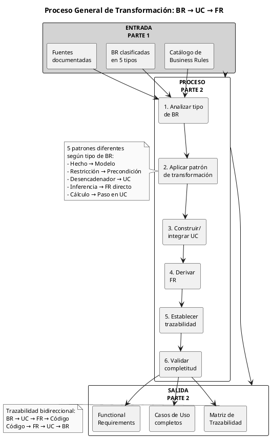
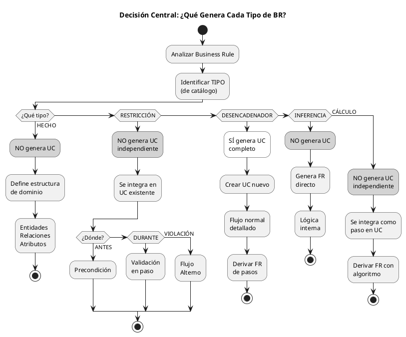
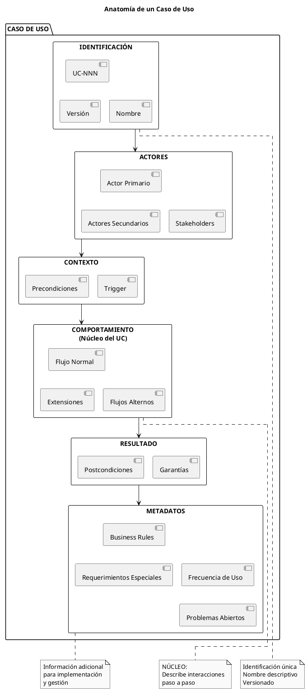
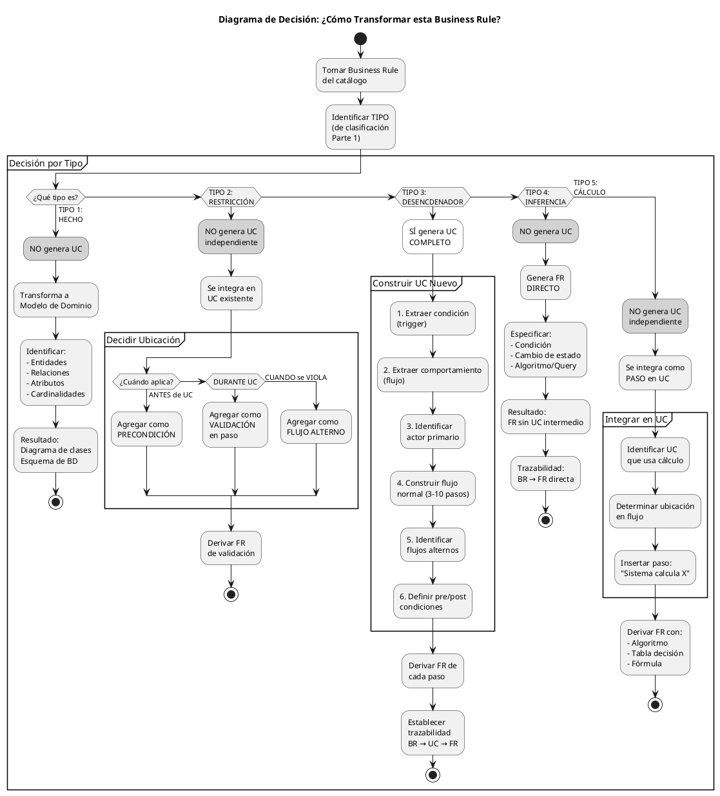
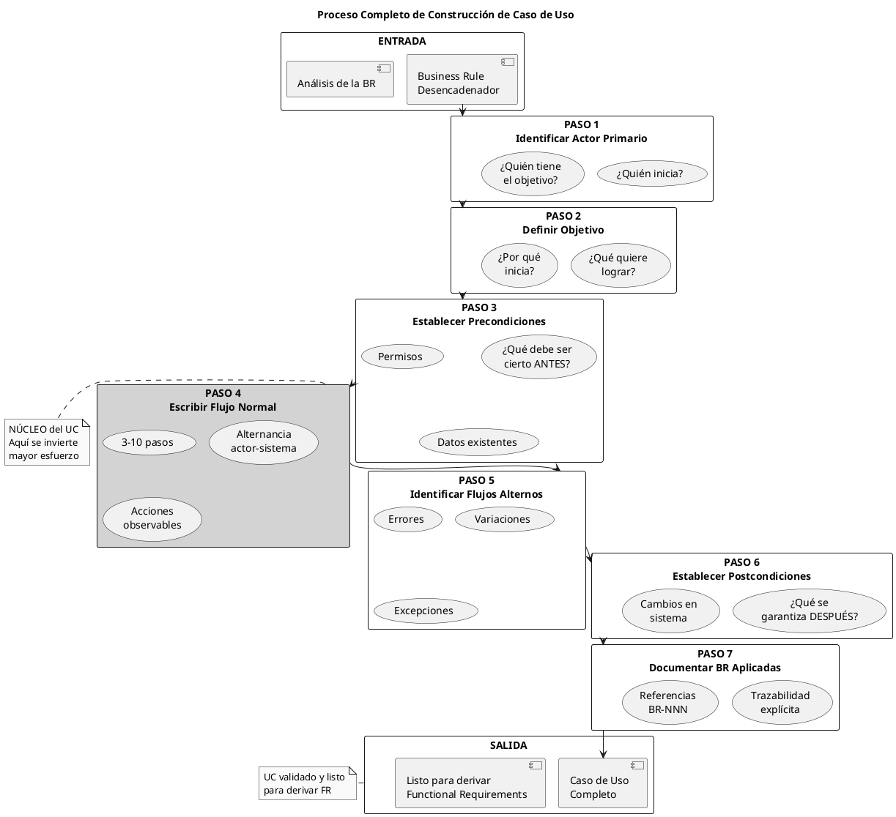

UID: 20251208041455144132
type: nota
date: 2025-12-08


# PARTE 2: TRANSFORMAR REGLAS DE NEGOCIO EN CASOS DE USO

**El Puente Entre Business Rules y Sistema Implementable**

**Versión:** 2.0 Completa  
**Fecha:** Diciembre 8, 2025  
**Longitud Objetivo:** 6,000 líneas (~150 páginas)  
**Diagramas PlantUML:** 24  
**Estilo:** Abstracto Real, Profesional, Sin emojis

---

## TABLA DE CONTENIDOS

1. [Introducción](#1-introducción)
2. [Fundamentos de Casos de Uso](#2-fundamentos-de-casos-de-uso)
3. [Patrones de Transformación por Tipo](#3-patrones-de-transformación-por-tipo)
4. [Construcción de Casos de Uso](#4-construcción-de-casos-de-uso)
5. [Integración de Múltiples Business Rules](#5-integración-de-múltiples-business-rules)
6. [Derivación de Functional Requirements](#6-derivación-de-functional-requirements)
7. [Trazabilidad Bidireccional](#7-trazabilidad-bidireccional)
8. [Casos Especiales](#8-casos-especiales)
9. [Calidad y Validación](#9-calidad-y-validación)
10. [Ejercicios Prácticos](#10-ejercicios-prácticos)
11. [Resumen y Siguientes Pasos](#11-resumen-y-siguientes-pasos)

---

## 1. INTRODUCCIÓN

### 1.1 Objetivo de esta Parte

La Parte 1 estableció el fundamento: identificar, clasificar y documentar Business Rules según cinco tipos distintos. Esta parte construye sobre ese fundamento, respondiendo a la pregunta central del análisis de requerimientos:

> ¿Cómo se transforman las Business Rules en elementos de requerimientos implementables?

Esta transformación no es uniforme. Cada tipo de Business Rule sigue un patrón de transformación específico, generando diferentes artefactos:

- Algunos tipos generan Casos de Uso completos
- Otros se integran en Casos de Uso existentes
- Otros generan Functional Requirements directamente
- Algunos solo definen estructura del modelo de dominio

Al finalizar esta parte, se habrá adquirido dominio en:

**Competencias conceptuales:**
1. Comprender la naturaleza de los Casos de Uso como descripciones de interacción
2. Distinguir qué tipos de BR generan UC completos versus cuáles solo influyen
3. Entender la trazabilidad bidireccional como herramienta de análisis e impacto

**Competencias prácticas:**
4. Aplicar cinco patrones de transformación específicos según tipo de BR
5. Construir Casos de Uso completos con estructura estándar profesional
6. Integrar múltiples Business Rules en un mismo Caso de Uso
7. Derivar Functional Requirements sistemáticamente de pasos de UC
8. Establecer y mantener trazabilidad completa BR → UC → FR → Código

**Competencias de validación:**
9. Evaluar la calidad de Casos de Uso mediante criterios objetivos
10. Calcular métricas de trazabilidad y cobertura
11. Identificar y resolver casos especiales y conflictos

### 1.2 Entrada: Catálogo de Business Rules

Esta parte asume que se dispone del entregable principal de la Parte 1:

**Catálogo de Business Rules completado** con las siguientes características:

```
Estado del Catálogo:
├─ Business Rules identificadas y documentadas
│  └─ Cada BR tiene: ID, Definición, Tipo, Fuente, Vigencia
│
├─ Clasificación correcta en los 5 tipos
│  ├─ Tipo 1: Hechos (definen estructura)
│  ├─ Tipo 2: Restricciones (limitan acciones)
│  ├─ Tipo 3: Desencadenadores (generan comportamiento observable)
│  ├─ Tipo 4: Inferencias (derivan hechos internos)
│  └─ Tipo 5: Cálculos (transforman datos)
│
├─ Distinción clara entre Desencadenadores e Inferencias
│  └─ Criterio: ¿El resultado es observable externamente?
│
├─ Fuentes documentadas con versiones específicas
│  └─ Cada BR referencia: Documento, Sección, Fecha
│
├─ Artefactos complementarios
│  ├─ Matriz de Roles y Permisos (para restricciones de acceso)
│  └─ Tablas de Cálculos (para cálculos complejos)
│
└─ Estática/Dinámica identificada
   └─ ¿Cambia frecuentemente o es estable?
```

**Estado del conocimiento adquirido en Parte 1:**

- Se comprende QUÉ son las Business Rules (políticas externas al sistema)
- Se sabe CÓMO identificarlas mediante técnicas de elicitación (6 preguntas estratégicas)
- Se sabe CÓMO clasificarlas por tipo usando criterios específicos
- Se sabe CÓMO documentarlas con plantillas estructuradas
- Se comprende la diferencia crítica entre Desencadenadores (observable) e Inferencias (no observable)

**Lo que aún NO se sabe:**

- CÓMO transformar cada tipo de BR en elementos de requerimientos específicos
- QUÉ tipos generan Casos de Uso completos y cuáles no
- CÓMO derivar Functional Requirements de Casos de Uso
- CÓMO establecer trazabilidad bidireccional completa
- CÓMO validar la completitud y calidad de la transformación

### 1.3 Salida: Casos de Uso con Trazabilidad

Esta parte producirá tres entregables principales:

**Entregable 1: Casos de Uso completos**

```
Características de los UC generados:
├─ Derivados de Business Rules (no inventados)
│  └─ Trazabilidad explícita: UC → BR origen
│
├─ Estructura completa según plantilla estándar
│  ├─ ID único (UC-NNN)
│  ├─ Nombre descriptivo (Verbo + Objeto)
│  ├─ Actores (primario y secundarios)
│  ├─ Precondiciones (qué debe ser cierto ANTES)
│  ├─ Trigger (qué inicia el UC)
│  ├─ Flujo Normal (3-10 pasos principales)
│  ├─ Flujos Alternos (variaciones y errores)
│  ├─ Postcondiciones (qué es cierto DESPUÉS)
│  └─ Business Rules aplicadas (lista de BR-NNN)
│
├─ Documentación de BR aplicadas en cada sección
│  ├─ BR en Precondiciones (restricciones de acceso)
│  ├─ BR en pasos del Flujo (cálculos, validaciones)
│  ├─ BR en Flujos Alternos (manejo de restricciones)
│  └─ BR en Postcondiciones (inferencias)
│
└─ Nivel de detalle apropiado
   └─ Suficiente para derivar FR, no detalles de implementación
```

**Entregable 2: Functional Requirements derivados**

```
Características de los FR generados:
├─ Derivados sistemáticamente de pasos de UC
│  └─ Trazabilidad explícita: FR → UC Paso X
│
├─ Granularidad correcta
│  ├─ 1 FR por acción atómica del sistema
│  ├─ Pasos simples → 1 FR
│  └─ Pasos complejos → Múltiples FR (2-5)
│
├─ Estructura completa por FR
│  ├─ ID único (RF-NNN)
│  ├─ Descripción clara
│  ├─ Derivado de: UC-XX Paso Y
│  ├─ Implementa: BR-ZZZ
│  ├─ Entrada/Salida (si aplica)
│  ├─ Algoritmo (si aplica)
│  └─ Prioridad
│
└─ Doble trazabilidad
   └─ RF → UC → BR (cadena completa)
```

**Entregable 3: Matriz de Trazabilidad completa**

```
Estructura de la Matriz:
├─ 4 niveles de trazabilidad
│  ├─ Nivel 0: Business Rules (origen)
│  ├─ Nivel 1: User Requirements (Casos de Uso)
│  ├─ Nivel 2: Functional Requirements
│  └─ Nivel 3: Código (referencias)
│
├─ Bidireccional
│  ├─ Forward: BR → UC → FR → Código
│  └─ Backward: Código → FR → UC → BR → Fuente
│
├─ Utilidades principales
│  ├─ Forward Tracing: Análisis de impacto de cambios
│  ├─ Backward Tracing: Justificación de requerimientos
│  ├─ Detección de huérfanos (UC sin BR, FR sin UC)
│  └─ Métricas de cobertura
│
└─ Formato
   └─ Tabla o herramienta que relaciona IDs entre niveles
```

### 1.4 El Proceso de Transformación



**Descripción del proceso:**

**Paso 1: Analizar tipo de BR**
- Consultar catálogo de BR
- Verificar tipo asignado (1-5)
- Confirmar que clasificación es correcta

**Paso 2: Aplicar patrón de transformación correspondiente**
- Cada tipo tiene su patrón específico
- No existe transformación uniforme
- Seguir guía detallada de cada patrón

**Paso 3: Construir UC o integrar en UC existente**
- Si tipo = Desencadenador → Construir UC nuevo completo
- Si tipo = Restricción → Integrar en UC existente (precondición, validación, o flujo alterno)
- Si tipo = Cálculo → Integrar como paso en UC existente
- Si tipo = Hecho → No afecta UC, solo modelo de dominio
- Si tipo = Inferencia → No genera UC, solo FR directo

**Paso 4: Derivar FR de pasos de UC**
- Para cada paso del flujo normal
- Para cada paso de flujos alternos (cuando son acciones del sistema)
- Granularidad: 1 FR por acción atómica

**Paso 5: Establecer trazabilidad**
- Forward: BR → UC → FR
- Backward: FR → UC → BR
- Documentar en matriz

**Paso 6: Validar completitud**
- Verificar que todos los pasos tienen FR
- Verificar que todos los FR tienen trazabilidad
- Aplicar métricas de calidad

**Decisión fundamental del proceso:**



**Implicaciones de esta decisión:**

1. **NO todos los UC se derivan de BR:** Los Desencadenadores son UNA fuente de UC, pero la Parte 3 identificará UC adicionales mediante otras técnicas (análisis CRUD, técnicas de Larman, etc.)

2. **La trazabilidad no siempre es lineal:** Algunos FR se derivan directamente de BR (Inferencias), otros se derivan de UC que a su vez derivan de BR (Desencadenadores)

3. **La integración es común:** Múltiples BR de diferentes tipos típicamente se integran en un mismo UC, lo que requiere coordinación cuidadosa

4. **La clasificación correcta es crítica:** Si una BR se clasificó mal en Parte 1, la transformación será incorrecta. Por ejemplo, confundir Desencadenador con Inferencia genera un UC cuando no debería (o viceversa)

---

## 2. FUNDAMENTOS DE CASOS DE USO

Antes de transformar Business Rules en Casos de Uso, es necesario comprender con precisión qué constituye un Caso de Uso, sus componentes, y su propósito en el análisis de requerimientos.

### 2.1 Qué es un Caso de Uso (Definición Conceptual)

**Definición formal:**

> Un Caso de Uso es una descripción de una secuencia completa de interacciones entre un actor y el sistema, iniciada por el actor para alcanzar un objetivo específico que tiene valor para ese actor.

**Aclaraciones críticas:**

**NO es una función del sistema:**

Incorrecto: "UC-01: Validar Usuario"
- Esto es una función técnica interna
- No tiene valor por sí misma para un actor
- Es parte de otro UC mayor

Correcto: "UC-01: Iniciar Sesión"
- Actor tiene objetivo: acceder al sistema
- Secuencia completa: ingresar credenciales → sistema valida → crear sesión → mostrar pantalla
- Tiene valor: actor puede usar el sistema

**NO es una pantalla o interfaz:**

Incorrecto: "UC-05: Pantalla de Búsqueda de Productos"
- Describe interfaz, no comportamiento
- Múltiples UC pueden usar la misma pantalla

Correcto: "UC-05: Buscar Producto en Catálogo"
- Describe interacción completa
- Puede implementarse con diferentes interfaces

**NO es un módulo del código:**

Incorrecto: "UC-10: Módulo de Inventario"
- Es componente técnico de arquitectura
- Agrupa funcionalidad por criterios técnicos

Correcto: "UC-10: Consultar Disponibilidad de Producto"
- Describe objetivo del usuario
- Se implementará en módulo de inventario, pero eso es detalle posterior

**Características esenciales de un Caso de Uso:**

```
1. INTERACCIÓN COMPLETA
   ├─ Tiene inicio claro (trigger)
   ├─ Tiene desarrollo (flujo de pasos)
   └─ Tiene fin definido (postcondición alcanzada)

2. VALOR PARA EL ACTOR
   ├─ El resultado es significativo para quien lo inicia
   ├─ No es paso intermedio de otro proceso
   └─ Actor puede decir "esto es lo que quiero lograr"

3. COMPORTAMIENTO OBSERVABLE
   ├─ Describe QUÉ hace el sistema
   ├─ NO describe CÓMO lo implementa
   └─ Actor puede observar las acciones del sistema

4. UNIDAD DE ANÁLISIS
   ├─ Es la unidad básica de funcionalidad
   ├─ Desde perspectiva del usuario
   └─ Granularidad apropiada (no demasiado grande ni pequeño)

5. INDEPENDENCIA CONTEXTUAL
   ├─ Puede ejecutarse sin conocer otros UC
   ├─ Tiene sus propias precondiciones explícitas
   └─ No asume "estado previo compartido" con otros UC
```

**Perspectiva conceptual: El contrato sistema-actor**

Un Caso de Uso puede entenderse como un contrato:

```
CONTRATO UC-04: "Solicitar Producto Químico"

El ACTOR se compromete a:
  - Proporcionar información necesaria (producto, cantidad)
  - Tener los permisos requeridos
  - Confirmar la solicitud

El SISTEMA se compromete a:
  - Verificar permisos y restricciones
  - Calcular costos
  - Registrar la solicitud
  - Notificar a las partes relevantes
  - Actualizar inventario

Si el actor cumple su parte Y las precondiciones se cumplen,
ENTONCES el sistema garantiza cumplir su parte.
```

Este contrato especifica responsabilidades, pero NO especifica implementación. El sistema es libre de implementar el contrato como quiera, siempre que cumpla lo prometido.

### 2.2 Componentes de un Caso de Uso



**Componentes obligatorios (esenciales):**

**1. ID único**
```
Formato: UC-NNN
Ejemplo: UC-07

Características:
- Único en todo el proyecto
- No reutilizar IDs eliminados
- Numeración puede ser:
  * Secuencial (UC-001, UC-002, ...)
  * Por módulo (UC-INV-001, UC-SEG-001, ...)
  * Por subsistema (UC-1.01, UC-1.02, UC-2.01, ...)
```

**2. Nombre**
```
Formato: Verbo + Objeto (+ Complemento opcional)
  
Ejemplos CORRECTOS:
- Solicitar Producto Químico
- Aprobar Solicitud de Compra
- Generar Reporte de Vencimientos
- Notificar Vencimiento de Químico
- Transferir Contenedor Entre Ubicaciones

Ejemplos INCORRECTOS:
- Solicitudes (no es verbo)
- Gestión de Productos (muy vago)
- Proceso de Aprobación (no específico)
- Sistema de Reportes (es subsistema, no acción)
```

**3. Actor Primario**
```
Definición: Quién inicia el caso de uso y tiene el objetivo principal

Características:
- SOLO UNO por UC (si múltiples pueden iniciar, crear UC separados)
- Representa un ROL, no una persona específica
- Puede ser:
  * Persona (Cliente, Empleado, Gerente, Admin)
  * Sistema externo (API de Pago, LDAP)
  * Tiempo (Sistema ejecuta periódicamente)

Formato:
  Actor Primario: [Nombre del Rol]
  
Ejemplo:
  Actor Primario: Solicitante
  Actor Primario: Sistema (tiempo)
```

**4. Precondiciones**
```
Definición: Qué debe ser cierto ANTES de que el UC pueda iniciar

Características:
- Describe estado del sistema, NO acciones
- Si no se cumple, el UC NO puede ejecutarse
- Típicamente incluye:
  * Autenticación/Autorización
  * Existencia de datos necesarios
  * Estado del sistema

Formato:
  Precondiciones:
    - [Condición 1]
    - [Condición 2]
    - ...

Ejemplo:
  Precondiciones:
    - Usuario autenticado en el sistema
    - Usuario tiene rol Solicitante o superior
    - Existen productos químicos en catálogo
    - Usuario tiene certificación OSHA vigente (si producto peligroso)
```

**5. Trigger (Desencadenador)**
```
Definición: Evento que inicia el caso de uso

Tipos:
  a) Acción del actor: "Usuario hace clic en 'Solicitar Producto'"
  b) Evento de tiempo: "Diariamente a las 00:00"
  c) Evento de sistema: "Cuando contenedor alcanza 30 días previos a vencimiento"
  d) Evento externo: "Sistema externo envía notificación"

Formato:
  Trigger: [Descripción del evento]
  
Ejemplos:
  Trigger: Usuario selecciona opción "Nueva Solicitud" del menú
  Trigger: Diario a las 00:00 horas
  Trigger: API de proveedor envía confirmación de envío
```

**6. Flujo Normal (Happy Path)**
```
Definición: Secuencia de pasos cuando todo funciona idealmente

Características:
- Numerado secuencialmente (1, 2, 3, ...)
- Alterna actor-sistema cuando es posible
- Cada paso es una acción observable
- 3-10 pasos idealmente (si >15, considerar dividir)
- Presente indicativo: "Sistema verifica", "Usuario ingresa"

Formato:
  Flujo Normal:
    1. [Actor/Sistema] [acción]
    2. [Actor/Sistema] [acción]
    ...

Ejemplo:
  Flujo Normal:
    1. Usuario selecciona producto de catálogo
    2. Usuario especifica cantidad deseada
    3. Sistema calcula costo total
    4. Sistema muestra costo al usuario
    5. Usuario confirma solicitud
    6. Sistema registra solicitud
    7. Sistema muestra confirmación
```

**7. Postcondiciones**
```
Definición: Qué es cierto DESPUÉS de que el UC termina exitosamente

Características:
- Describe estado resultante, NO acciones
- Cambios garantizados en el sistema
- Solo para terminación EXITOSA del flujo normal

Formato:
  Postcondiciones:
    - [Estado resultante 1]
    - [Estado resultante 2]
    ...

Ejemplo:
  Postcondiciones:
    - Solicitud registrada en base de datos con estado "Aprobada"
    - Inventario reservado actualizado
    - Usuario notificado de confirmación
    - Log de auditoría actualizado con timestamp
```

**Componentes opcionales (recomendados):**

**8. Actores Secundarios**
```
Definición: Quiénes participan pero NO inician el UC

Participación:
- Proveen información cuando sistema solicita
- Reciben notificaciones del sistema
- Son consultados para aprobaciones

Formato:
  Actores Secundarios:
    - [Actor 1]: [Rol en el UC]
    - [Actor 2]: [Rol en el UC]

Ejemplo:
  Actores Secundarios:
    - Gerente de Departamento: Aprueba solicitudes >$500
    - Coordinador de Seguridad: Recibe notificación de químicos peligrosos
```

**9. Stakeholders e Intereses**
```
Definición: Quiénes se ven afectados y qué esperan obtener

Propósito: Contextualiza el UC, explica el "por qué"

Formato:
  Stakeholders e Intereses:
    - [Stakeholder]: [Interés/Expectativa]

Ejemplo:
  Stakeholders e Intereses:
    - Solicitante: Quiere recibir productos necesarios rápidamente
    - Gerente: Quiere controlar gastos del departamento
    - Coordinador Seguridad: Quiere asegurar cumplimiento normativo
    - Universidad: Quiere minimizar riesgos y costos
```

**10. Flujos Alternos**
```
Definición: Variaciones del flujo normal, errores, excepciones

Propósito: Manejar "qué pasa si algo es diferente"

Formato:
  FA-N: [Nombre descriptivo]
    Na. [Punto de desviación del flujo normal]
    Nb. [Qué ocurre diferente]
    Nc. [Cómo termina o retorna al flujo normal]

Ejemplo:
  FA-1: Solicitud Requiere Aprobación
    6a. Sistema detecta que monto >$500
    6b. Sistema identifica gerente del departamento
    6c. Sistema solicita aprobación al gerente
    6d. Sistema cambia estado a "Pendiente Aprobación"
    6e. Sistema notifica a gerente y solicitante
    6f. Caso de uso termina
    6g. (Continuará con UC-09 "Aprobar Solicitud")
```

**11. Garantías**
```
Garantías Mínimas:
  Qué garantiza el sistema INCLUSO si el UC falla
  
Garantías de Éxito:
  Qué garantiza el sistema cuando el UC termina exitosamente

Ejemplo:
  Garantías Mínimas:
    - Sistema registra intento de solicitud en log
    - No se corrompe integridad de datos
    
  Garantías de Éxito:
    - Solicitud completa registrada con todos los datos
    - Inventario actualizado correctamente
    - Todas las notificaciones enviadas
```

**12. Business Rules Aplicadas**
```
Definición: Lista de BR que influyen en este UC

Propósito: Trazabilidad explícita BR → UC

Formato:
  Business Rules Aplicadas:
    - BR-NNN: [Descripción breve de cómo se aplica]

Ejemplo:
  Business Rules Aplicadas:
    - BR-028: Restricción de aprobación para solicitudes >$500
    - BR-034: Cálculo de costo total
    - BR-087: Restricción de certificación para químicos peligrosos
    - BR-046: Inferencia de estado "en tránsito" al aprobar
```

**13. Requerimientos Especiales (RNF aplicables)**
```
Definición: Quality Attributes que aplican específicamente a este UC

Ejemplos:
  Requerimientos Especiales:
    - RNF-12: Tiempo de respuesta <2 segundos para cálculos
    - RNF-15: Disponibilidad 99.9% en horario laboral
    - RNF-18: Cifrado de datos sensibles en tránsito
    - RNF-22: Auditoría completa de todas las transacciones
```

**14. Frecuencia de Uso**
```
Definición: Qué tan seguido se ejecuta este UC

Propósito: Ayuda a priorizar y diseñar para carga esperada

Valores típicos:
  - Muy frecuente (>100 veces/día)
  - Frecuente (10-100 veces/día)
  - Moderado (1-10 veces/día)
  - Ocasional (<1 vez/día)

Ejemplo:
  Frecuencia de Uso: Frecuente (aproximadamente 50 solicitudes/día)
```

**15. Problemas Abiertos**
```
Definición: Dudas, decisiones pendientes, incertidumbres

Propósito: Documentar qué necesita resolverse

Ejemplo:
  Problemas Abiertos:
    - ¿Qué hacer si gerente no responde en 48 horas?
    - ¿Se permite cancelar solicitud después de aprobar?
    - ¿Químicos caducos deben aparecer en catálogo?
```


### 2.3 Plantilla Estándar Completa

**Formato recomendado para documentación de Casos de Uso:**

```
===============================================================================
UC-NNN: [NOMBRE DEL CASO DE USO]
===============================================================================

IDENTIFICACIÓN
--------------
ID: UC-NNN
Nombre: [Verbo + Objeto]
Versión: X.Y
Fecha: YYYY-MM-DD
Autor: [Nombre]
Estado: [Borrador | En Revisión | Aprobado | Implementado]

ACTORES
-------
Actor Primario: [Rol]

Actores Secundarios:
  - [Actor 1]: [Rol que cumple]
  - [Actor 2]: [Rol que cumple]

Stakeholders e Intereses:
  - [Stakeholder 1]: [Interés/Expectativa]
  - [Stakeholder 2]: [Interés/Expectativa]

CONTEXTO
--------
Precondiciones:
  - [Condición que debe cumplirse ANTES]
  - [Condición que debe cumplirse ANTES]

Trigger: [Evento que inicia el UC]

COMPORTAMIENTO
--------------
Flujo Normal:
  1. [Actor/Sistema] [acción observable]
  2. [Actor/Sistema] [acción observable]
  3. [Actor/Sistema] [acción observable]
  ...

Flujos Alternos:
  FA-1: [Nombre descriptivo del flujo alterno]
    Na. [Punto de desviación]
    Nb. [Qué ocurre diferente]
    Nc. [Cómo termina o retorna]
    
  FA-2: [Otro flujo alterno]
    ...

RESULTADO
---------
Postcondiciones:
  - [Estado resultante garantizado]
  - [Estado resultante garantizado]

Garantías Mínimas:
  - [Qué se garantiza INCLUSO si falla]

Garantías de Éxito:
  - [Qué se garantiza cuando termina exitosamente]

METADATOS
---------
Business Rules Aplicadas:
  - BR-NNN: [Descripción de cómo se aplica]
  - BR-NNN: [Descripción de cómo se aplica]

Requerimientos Especiales:
  - RNF-NN: [Quality Attribute aplicable]

Frecuencia de Uso: [Muy frecuente | Frecuente | Moderado | Ocasional]

Problemas Abiertos:
  - [Duda o decisión pendiente]

===============================================================================
```

### 2.4 Actores y sus Tipos

```plantuml
@startuml
skinparam monochrome true
skinparam shadowing false

title Taxonomía de Actores en Casos de Uso

rectangle "ACTOR PRIMARIO" as primario #lightgray {
  **Características:**
  - Inicia el UC
  - Tiene el objetivo
  - Solo UNO por UC
  ----
  **Ejemplos:**
  Cliente
  Empleado
  Gerente
  Administrador
}

rectangle "ACTOR SECUNDARIO" as secundario {
  **Características:**
  - Participa pero NO inicia
  - Provee/recibe información
  - Puede haber VARIOS
  ----
  **Ejemplos:**
  Gerente (aprueba)
  Coordinador (notificado)
  Proveedor (recibe orden)
}

rectangle "ACTOR SISTEMA" as sistema {
  **Características:**
  - Sistema externo
  - Provee servicios
  - Interfaz técnica
  ----
  **Ejemplos:**
  Servicio de Pago
  LDAP Corporativo
  API de Envíos
}

rectangle "ACTOR TIEMPO" as tiempo {
  **Características:**
  - Ejecución periódica
  - No requiere intervención
  - Común en batch
  ----
  **Ejemplos:**
  Sistema (diario 00:00)
  Sistema (mensual día 1)
  Sistema (cada hora)
}

primario -[hidden]down-> secundario
secundario -[hidden]down-> sistema
sistema -[hidden]down-> tiempo

note right of primario
  REGLA: Solo uno
  Si múltiples pueden iniciar,
  crear UC separados
end note

note right of tiempo
  Notación especial:
  "Sistema (tiempo)"
  Trigger especifica frecuencia
end note

@enduml
```

**Descripción detallada de cada tipo:**

**TIPO 1: Actor Primario**

Definición conceptual:
- Es quien inicia la interacción con el objetivo de lograr algo valioso
- Solo puede haber UN actor primario por UC
- Si múltiples roles pueden iniciar el mismo UC, hay dos opciones:
  a) Crear UC separados (recomendado si flujos difieren significativamente)
  b) Usar generalización de actores (si flujos son idénticos)

Ejemplos detallados:
```
UC-04: Solicitar Producto Químico
  Actor Primario: Solicitante
  (El Solicitante inicia porque QUIERE obtener un producto)

UC-09: Aprobar Solicitud
  Actor Primario: Gerente
  (El Gerente inicia porque QUIERE revisar solicitudes pendientes)

UC-07: Notificar Vencimiento
  Actor Primario: Sistema (tiempo)
  (El sistema inicia automáticamente por schedule)
```

Identificación del actor primario:
```
Pregunta clave: ¿Quién tiene el objetivo que este UC cumple?

Ejemplo:
  UC: "Procesar Pago"
  ¿Quién quiere que el pago se procese? → Cliente
  Actor Primario: Cliente
  (NO "Sistema de Pago", ese es actor secundario/sistema)
```

**TIPO 2: Actor Secundario**

Definición conceptual:
- Participa en el UC pero NO lo inicia
- Puede haber múltiples actores secundarios
- Tres roles típicos:
  a) Proveedor de información (sistema consulta al actor)
  b) Receptor de notificación (sistema informa al actor)
  c) Aprobador (sistema solicita decisión al actor)

Ejemplos detallados:
```
UC-04: Solicitar Producto Químico
  Actor Primario: Solicitante
  Actores Secundarios:
    - Gerente: Aprueba solicitudes >$500 (rol: aprobador)
    - Coordinador Seguridad: Recibe notificación si químico peligroso (rol: receptor)
    
UC-10: Procesar Orden de Compra
  Actor Primario: Sistema (automático)
  Actores Secundarios:
    - Proveedor: Recibe orden generada (rol: receptor)
    - Comprador: Revisó y confirmó previo (rol: proveedor info)
```

Notación en flujos:
```
Cuando actor secundario participa, se indica en el paso:

Flujo Normal:
  ...
  6. Sistema solicita aprobación al Gerente [actor secundario]
  7. Gerente revisa detalles [actor secundario actúa]
  8. Gerente aprueba o rechaza [actor secundario decide]
  9. Sistema registra decisión
  ...
```

**TIPO 3: Actor Sistema**

Definición conceptual:
- Representa un sistema externo con el que nuestro sistema interactúa
- Típicamente vía API, servicios web, o protocolos de integración
- NO es parte del sistema que estamos especificando

Ejemplos detallados:
```
UC-15: Procesar Pago con Tarjeta
  Actor Primario: Cliente
  Actores Secundarios:
    - Servicio de Pago (Stripe/PayPal) [actor sistema]
    
  Flujo:
    ...
    5. Sistema envía datos de tarjeta a Servicio de Pago
    6. Servicio de Pago valida y autoriza transacción
    7. Servicio de Pago retorna código de autorización
    ...

UC-03: Autenticar Usuario
  Actor Primario: Usuario
  Actores Secundarios:
    - LDAP Corporativo [actor sistema]
    
  Flujo:
    ...
    3. Sistema envía credenciales a LDAP
    4. LDAP valida contra Active Directory
    5. LDAP retorna resultado de autenticación
    ...
```

Cuándo NO es actor sistema:
```
INCORRECTO:
  UC-20: Generar Reporte
  Actor Primario: Módulo de Reportes [NO, es parte interna]
  
CORRECTO:
  UC-20: Generar Reporte
  Actor Primario: Gerente [Sí, es quien quiere el reporte]
```

**TIPO 4: Actor Tiempo**

Definición conceptual:
- Representa la ejecución automática periódica o programada
- Común en procesos batch, notificaciones automáticas, sincronizaciones
- NO requiere intervención humana para iniciar

Notación especial:
```
Actor Primario: Sistema (tiempo)

Trigger especifica la frecuencia:
  - "Diario a las 00:00"
  - "Cada hora"
  - "Mensual el día 1 a las 06:00"
  - "Cuando reloj indica medianoche"
```

Ejemplos detallados:
```
UC-07: Notificar Vencimiento de Químico
  Actor Primario: Sistema (tiempo)
  Trigger: Diario a las 00:00 horas
  
  Flujo Normal:
    1. Sistema verifica fecha actual
    2. Sistema identifica contenedores próximos a vencer
    3. Sistema envía notificaciones
    ...

UC-25: Sincronizar Inventario con ERP
  Actor Primario: Sistema (tiempo)
  Trigger: Cada 4 horas
  
  Flujo Normal:
    1. Sistema consulta cambios desde última sincronización
    2. Sistema envía cambios a ERP
    3. Sistema recibe confirmación
    ...

UC-30: Generar Reporte Mensual de Ventas
  Actor Primario: Sistema (tiempo)
  Trigger: Mensual el día 1 a las 06:00
  
  Flujo Normal:
    1. Sistema consulta ventas del mes anterior
    2. Sistema calcula métricas
    3. Sistema genera PDF
    4. Sistema envía por email a gerentes
    ...
```

Diferencia con Actor Primario persona:
```
CON Actor Tiempo (automático):
  UC-07: Notificar Vencimiento
    Actor Primario: Sistema (tiempo)
    El sistema INICIA automáticamente por schedule
    
SIN Actor Tiempo (manual):
  UC-08: Consultar Químicos Próximos a Vencer
    Actor Primario: Coordinador de Seguridad
    El coordinador INICIA cuando quiere consultar
    
AMBOS pueden coexistir y ser diferentes UC
```

### 2.5 Flujo Normal vs Flujos Alternos

```plantuml
@startuml
skinparam monochrome true
skinparam shadowing false

title Estructura de Flujos en un Caso de Uso

|Actor|
start
:Inicia UC;

|#lightgray|Flujo Normal (Happy Path)|
:Paso 1: Actor hace A;
:Paso 2: Sistema hace B;
:Paso 3: Sistema hace C;

if (¿Condición especial\ndetectada?) then (SÍ)
  |#white|Flujo Alterno FA-1|
  :3a. Sistema detecta condición;
  :3b. Sistema ejecuta acción alternativa;
  
  if (¿Puede continuar?) then (SÍ)
    :3c. Retornar a Paso 4\ndel flujo normal;
    |#lightgray|Flujo Normal|
  else (NO)
    :3c. Notificar actor;
    :3d. Registrar en log;
    stop
  endif
else (NO)
  |#lightgray|Flujo Normal|
  :Paso 4: Actor hace D;
endif

:Paso 5: Sistema hace E;
:Paso 6: Sistema registra resultado;

|Actor|
:Recibe confirmación;

stop

note right of "Flujo Normal"
  - Secuencia ideal
  - Sin errores
  - Sin variaciones
  - Camino más común
end note

note right of "Flujo Alterno FA-1"
  - Desviación del normal
  - Maneja error o variación
  - Puede retornar o terminar
  - Múltiples FA posibles
end note

@enduml
```

**Flujo Normal (Happy Path):**

Definición:
- La secuencia de pasos cuando TODO funciona idealmente
- NO incluye errores, excepciones, ni condiciones especiales
- Representa el caso de éxito más común
- Es el "camino feliz" que todos esperan

Características:
```
1. NUMERACIÓN SECUENCIAL
   1, 2, 3, 4, 5, ...
   
2. ALTERNANCIA ACTOR-SISTEMA (cuando es posible)
   3. Usuario ingresa datos
   4. Sistema valida datos
   5. Usuario confirma
   6. Sistema registra
   
7. ACCIONES OBSERVABLES
   Cada paso es algo que se puede VER o VERIFICAR
   NO: "Sistema piensa"
   SÍ: "Sistema muestra resultado"
   
8. PRESENTE INDICATIVO
   "Sistema verifica" (NO "verificará", "ha verificado")
   "Usuario ingresa" (NO "ingresó", "ingresaría")
   
9. GRANULARIDAD APROPIADA
   - Ni muy alto nivel: "Sistema procesa solicitud" (¿cómo?)
   - Ni muy bajo nivel: "Sistema abre conexión DB, ejecuta query..."
   - Justo: "Sistema consulta disponibilidad en inventario"
   
6. LONGITUD IDEAL: 3-10 pasos
   - < 3 pasos: Probablemente demasiado simple, puede no ser UC independiente
   - > 15 pasos: Probablemente demasiado complejo, considerar dividir
```

Ejemplo de flujo normal bien escrito:
```
UC-04: Solicitar Producto Químico

Flujo Normal:
  1. Usuario selecciona opción "Nueva Solicitud" del menú
  2. Sistema muestra catálogo de productos químicos disponibles
  3. Usuario selecciona producto del catálogo
  4. Usuario especifica cantidad deseada
  5. Sistema calcula costo total (precio * cantidad)
  6. Sistema muestra costo al usuario
  7. Usuario confirma la solicitud
  8. Sistema verifica permisos del usuario
  9. Sistema registra solicitud con estado "Aprobada"
  10. Sistema actualiza inventario reservado
  11. Sistema muestra confirmación con número de solicitud

Análisis:
  - 11 pasos (dentro del rango ideal)
  - Alterna actor-sistema
  - Cada paso es observable
  - No incluye errores (esos van en FA)
  - Presente indicativo
  - Granularidad apropiada
```

**Flujos Alternos (Alternate Flows):**

Definición:
- Desviaciones del flujo normal
- Manejan errores, excepciones, variaciones de negocio
- Pueden retornar al flujo normal o terminar el UC

Tipos de flujos alternos:

```
TIPO A: Variación de negocio
  No es error, es camino alternativo válido
  
  Ejemplo:
    FA-1: Solicitud Requiere Aprobación
      6a. Sistema detecta que monto >$500
      6b. Sistema solicita aprobación a gerente
      6c. Sistema cambia estado a "Pendiente"
      6d. UC termina (continuará con otro UC)

TIPO B: Error de validación
  Sistema detecta dato inválido o inconsistencia
  
  Ejemplo:
    FA-2: Cantidad Excede Disponibilidad
      4a. Sistema detecta que cantidad solicitada > stock
      4b. Sistema muestra mensaje de error
      4c. Sistema indica disponibilidad actual
      4d. Retornar a paso 4 (usuario reingresa cantidad)

TIPO C: Error técnico
  Falla en sistema, red, servicio externo
  
  Ejemplo:
    FA-3: Error al Conectar con Servicio de Pago
      8a. Sistema no puede conectar con servidor de pago
      8b. Sistema registra error en log
      8c. Sistema muestra mensaje al usuario
      8d. Sistema ofrece reintentar
      8e. Usuario elige reintentar o cancelar
      8f. Si reintenta: volver a paso 8
      8g. Si cancela: UC termina sin completar

TIPO D: Usuario cancela
  Usuario decide no continuar
  
  Ejemplo:
    FA-4: Usuario Cancela Solicitud
      *a. En cualquier momento antes de paso 7
      *b. Usuario selecciona "Cancelar"
      *c. Sistema descarta datos temporales
      *d. Sistema retorna a pantalla principal
      *e. UC termina sin completar
```

Formato estándar de flujo alterno:
```
FA-N: [Nombre Descriptivo]
  Na. [Punto de desviación del flujo normal]
  Nb. [Qué detecta o qué condición se cumple]
  Nc. [Qué hace el sistema]
  Nd. [Qué hace el actor (si aplica)]
  Ne. [Cómo termina: retorna a paso X, o termina UC]
```

Notación del punto de desviación:
```
Paso específico:
  6a. → Se desvía después del paso 6 del flujo normal
  
Múltiples pasos:
  4-7a. → Se puede desviar en cualquier punto entre pasos 4 y 7
  
Cualquier momento:
  *a. → Puede ocurrir en cualquier paso del flujo normal
```

Ejemplo completo con múltiples flujos alternos:
```
UC-12: Transferir Contenedor Entre Ubicaciones

Flujo Normal:
  1. Usuario ingresa código de contenedor
  2. Sistema busca contenedor en inventario
  3. Sistema muestra información del contenedor
  4. Usuario especifica ubicación destino
  5. Sistema valida ubicación destino
  6. Usuario confirma transferencia
  7. Sistema actualiza ubicación del contenedor
  8. Sistema registra timestamp de movimiento
  9. Sistema muestra confirmación

Flujos Alternos:
  FA-1: Contenedor No Encontrado
    2a. Sistema no encuentra contenedor con ese código
    2b. Sistema muestra mensaje "Contenedor no encontrado"
    2c. Retornar a paso 1
  
  FA-2: Contenedor en Estado No Transferible
    3a. Sistema detecta que contenedor.estado = "Caduco" o "Eliminado"
    3b. Sistema muestra mensaje "Contenedor no puede transferirse"
    3c. Sistema muestra razón (estado actual)
    3d. UC termina
    
  FA-3: Ubicación Destino Inválida
    5a. Sistema detecta que ubicación no existe en catálogo
    5b. Sistema muestra mensaje de error
    5c. Retornar a paso 4
    
  FA-4: Ubicación Destino sin Capacidad
    5a. Sistema detecta que ubicación destino está llena
    5b. Sistema muestra mensaje "Ubicación sin capacidad"
    5c. Sistema sugiere ubicaciones alternativas cercanas
    5d. Usuario elige: seleccionar otra ubicación o cancelar
    5e. Si selecciona otra: retornar a paso 4
    5f. Si cancela: UC termina
    
  FA-5: Usuario Cancela
    *a. En cualquier momento antes de paso 6
    *b. Usuario presiona "Cancelar"
    *c. Sistema descarta cambios temporales
    *d. UC termina
```

**Diferencia conceptual: Flujo Alterno vs Extensión**

Algunos autores distinguen:
```
FLUJO ALTERNO:
  - Reemplaza parte del flujo normal
  - "En lugar de hacer X, se hace Y"
  
EXTENSIÓN (Extension Point):
  - Agrega pasos ADICIONALES al flujo normal
  - "Además de X, también se hace Y"
```

En esta metodología, tratamos ambos como "Flujos Alternos" para simplicidad, pero se puede hacer la distinción si se desea mayor precisión.


## 3. PATRONES DE TRANSFORMACIÓN POR TIPO

Esta sección constituye el núcleo conceptual y práctico de toda la transformación. Cada tipo de Business Rule sigue un patrón de transformación específico, predecible y sistemático.

**Principio fundamental:**

> El tipo de Business Rule determina completamente cómo se transforma en elementos de requerimientos. No existe una transformación uniforme; cada tipo tiene su patrón único.

**Los cinco patrones:**

```
PATRÓN 1: HECHO → Modelo de Dominio
  - NO genera UC
  - Define entidades, relaciones, atributos
  - Establece estructura conceptual

PATRÓN 2: RESTRICCIÓN → Precondiciones/Validaciones  
  - NO genera UC independiente
  - Se integra en UC existentes
  - 3 ubicaciones posibles: Precondición, Validación, Flujo Alterno

PATRÓN 3: DESENCADENADOR → Caso de Uso Completo ⭐
  - SÍ genera UC completo NUEVO
  - ÚNICO tipo que genera UC
  - Patrón: SI [condición] ENTONCES [comportamiento observable]

PATRÓN 4: INFERENCIA → Functional Requirement Directo
  - NO genera UC
  - Genera FR directamente (sin UC intermedio)
  - Cambio de estado interno no observable

PATRÓN 5: CÁLCULO → Paso en UC Existente
  - NO genera UC independiente
  - Se integra como paso en UC existente/nuevo
  - Acompañado de FR con algoritmo
```



### 3.1 Patrón 1: Hechos → Modelo de Dominio

**Naturaleza de la transformación:**

Los Hechos NO generan Casos de Uso porque no describen comportamiento, describen estructura. Un Hecho establece una verdad sobre el dominio del negocio: define entidades, sus propiedades, y las relaciones entre ellas.

**¿Por qué NO genera UC?**

Un Caso de Uso describe una interacción para lograr un objetivo. Los Hechos no tienen:
- Actor que inicia
- Objetivo que cumplir
- Secuencia de pasos
- Resultado observable

Un Hecho simplemente ES. Establece la estructura conceptual que el sistema debe respetar.

**Patrón de transformación:**

```
ENTRADA: 
  BR tipo Hecho

ANÁLISIS:
  1. Identificar ENTIDADES mencionadas
     "Cada contenedor..." → Entidad: Contenedor
     "...de producto químico..." → Entidad: ProductoQuimico
     
  2. Identificar RELACIONES
     "...contiene..." → Relación: Contenedor ← contiene → ProductoQuimico
     
  3. Identificar CARDINALIDADES
     "Cada contenedor tiene uno..." → 1:1
     "Puede tener múltiples..." → 1:N
     "Muchos a muchos..." → M:N
     
  4. Identificar ATRIBUTOS clave
     "...código de barras único..." → Atributo: codigo_barras
     
  5. Identificar CARACTERÍSTICAS del atributo
     "único" → UNIQUE constraint
     "asignado" → NOT NULL
     "no puede reasignarse" → IMMUTABLE

SALIDA:
  - Entidades del modelo de dominio
  - Relaciones con cardinalidad especificada
  - Atributos con restricciones (unique, not null, immutable)
  - Restricciones de integridad referencial
  
NO GENERA:
  - Caso de Uso
  
GENERA INDIRECTAMENTE:
  - Diagrama de clases (análisis)
  - Esquema de base de datos (diseño)
  - Clases del modelo de dominio (implementación)
```

**Ejemplo completo 1: Hecho básico**

```
===============================================================================
BR-012 (HECHO)
===============================================================================

Definición:
  "Cada contenedor de producto químico tiene asignado un código de 
   barras único que no puede ser reasignado a otro contenedor"

Tipo: Hecho

Fuente: Estándar de Identificación de Materiales Peligrosos, Sección 3.2

===============================================================================
ANÁLISIS PASO A PASO
===============================================================================

PASO 1: Identificar entidades mencionadas
  
  Análisis del texto:
    "Cada contenedor..." → ENTIDAD: Contenedor
    "...de producto químico..." → ENTIDAD: ProductoQuimico (implícita)
  
  Entidades identificadas:
    - Contenedor (explícita)
    - ProductoQuimico (implícita, referenciada)

PASO 2: Identificar relaciones entre entidades
  
  Análisis del texto:
    "contenedor de producto químico" → Relación: contiene/pertenece
  
  Relación identificada:
    - Contenedor "contiene" ProductoQuimico
    o
    - Contenedor "pertenece a" ProductoQuimico
  
  Cardinalidad:
    "Cada contenedor... un producto" → 1 Contenedor : 1 ProductoQuimico
    (Un contenedor no puede tener múltiples productos mezclados)

PASO 3: Identificar atributos mencionados
  
  Análisis del texto:
    "...tiene asignado un código de barras..." → ATRIBUTO: codigo_barras
    "...asignado..." → Pertenece a Contenedor (no a Producto)
  
  Atributo identificado:
    - Entidad: Contenedor
    - Atributo: codigo_barras
    - Tipo de dato: String (código alfanumérico)

PASO 4: Identificar características del atributo
  
  Análisis del texto:
    "tiene asignado" → Obligatorio → NOT NULL
    "único" → No puede repetirse → UNIQUE
    "no puede ser reasignado" → No puede cambiar → IMMUTABLE
  
  Restricciones identificadas:
    - NOT NULL: Todo contenedor DEBE tener código
    - UNIQUE: No pueden haber dos contenedores con mismo código
    - IMMUTABLE: Una vez asignado, no se puede modificar

PASO 5: Restricciones de integridad adicionales
  
  Análisis conceptual:
    - Si contenedor referencia ProductoQuimico → Foreign Key
    - Si producto puede tener múltiples contenedores → Relación 1:N
  
  Restricciones adicionales:
    - FK_contenedor_producto: FOREIGN KEY (producto_id) 
                              REFERENCES ProductoQuimico(id)
    - ON DELETE: ¿Qué pasa si se elimina producto? 
                 (Probablemente RESTRICT o SET NULL)

===============================================================================
RESULTADO: MODELO DE DOMINIO
===============================================================================

ENTIDAD: Contenedor
  Atributos:
    - id: INTEGER (Primary Key, Auto-increment)
    - codigo_barras: STRING(15) (UNIQUE, NOT NULL, IMMUTABLE)
    - producto_quimico_id: INTEGER (Foreign Key, NOT NULL)
    - fecha_asignacion_codigo: DATE (NOT NULL, IMMUTABLE)
    - ubicacion_id: INTEGER (Foreign Key, NULLABLE)
    - estado: ENUM('ACTIVO', 'CADUCO', 'ELIMINADO') (NOT NULL, DEFAULT 'ACTIVO')
    - fecha_vencimiento: DATE (NOT NULL)
    - cantidad_actual: DECIMAL(10,2) (NOT NULL, >= 0)
    - unidad_medida: STRING(10) (NOT NULL)
    - fecha_alta: TIMESTAMP (NOT NULL, DEFAULT NOW())
    - fecha_modificacion: TIMESTAMP (NOT NULL, DEFAULT NOW(), AUTO-UPDATE)
  
  Restricciones:
    - PK_contenedor: PRIMARY KEY (id)
    - UK_contenedor_codigo: UNIQUE (codigo_barras)
    - FK_contenedor_producto: FOREIGN KEY (producto_quimico_id) 
                               REFERENCES ProductoQuimico(id)
                               ON DELETE RESTRICT
    - FK_contenedor_ubicacion: FOREIGN KEY (ubicacion_id)
                                REFERENCES Ubicacion(id)
                                ON DELETE SET NULL
    - CHK_codigo_formato: codigo_barras MATCHES '[A-Z0-9]{10,15}'
    - CHK_cantidad_positiva: cantidad_actual >= 0

ENTIDAD: ProductoQuimico
  Atributos:
    - id: INTEGER (Primary Key)
    - nombre: STRING(100) (NOT NULL)
    - nombre_cientifico: STRING(200) (NULLABLE)
    - numero_cas: STRING(20) (UNIQUE, NOT NULL)
    - clase_peligrosidad: INTEGER (NOT NULL, 1-9)
    - estado: ENUM('ACTIVO', 'DESCONTINUADO') (NOT NULL)
    - precio_actual: DECIMAL(10,2) (NOT NULL, > 0)
    - ...
  
  Restricciones:
    - PK_producto: PRIMARY KEY (id)
    - UK_producto_cas: UNIQUE (numero_cas)
    - CHK_clase_valida: clase_peligrosidad BETWEEN 1 AND 9

RELACIÓN: Contenedor → ProductoQuimico
  Cardinalidad: N:1 (Muchos contenedores de un producto)
  Implementación: Foreign Key en Contenedor.producto_quimico_id
  
  Interpretación:
    - Un ProductoQuimico puede tener 0, 1, o múltiples Contenedores
    - Un Contenedor pertenece a exactamente 1 ProductoQuimico
    - Si se elimina ProductoQuimico, no se pueden eliminar sus Contenedores 
      (ON DELETE RESTRICT)

===============================================================================
DIAGRAMA DE CLASES (ANÁLISIS)
===============================================================================

```
@startuml
skinparam monochrome true
skinparam shadowing false

class Contenedor {
  - id: Integer
  - codigo_barras: String {unique, immutable}
  - producto_quimico_id: Integer
  - fecha_asignacion_codigo: Date {immutable}
  - ubicacion_id: Integer
  - estado: Enum
  - fecha_vencimiento: Date
  - cantidad_actual: Decimal
  - unidad_medida: String
}

class ProductoQuimico {
  - id: Integer
  - nombre: String
  - nombre_cientifico: String
  - numero_cas: String {unique}
  - clase_peligrosidad: Integer [1..9]
  - estado: Enum
  - precio_actual: Decimal
}

class Ubicacion {
  - id: Integer
  - codigo: String
  - nombre: String
  - capacidad_maxima: Integer
}

Contenedor "N" --> "1" ProductoQuimico : contiene
Contenedor "N" --> "0..1" Ubicacion : almacenado en

note right of Contenedor::codigo_barras
  BR-012:
  - UNIQUE
  - NOT NULL
  - IMMUTABLE
end note

@enduml
```

===============================================================================
NO SE GENERA: Caso de Uso
===============================================================================

Pregunta: ¿Por qué NO se genera un UC "Asignar Código de Barras a Contenedor"?

Respuesta:
  El Hecho NO especifica CUÁNDO ni CÓMO se asigna el código. 
  Solo dice que cada contenedor TIENE uno único.
  
  La asignación del código probablemente ocurrirá como parte de OTRO UC,
  por ejemplo:
    - UC-15: Registrar Nuevo Contenedor
      ...
      Paso 5: Sistema genera código de barras único [BR-012]
      Paso 6: Sistema asigna código al contenedor [BR-012]
      ...
  
  El Hecho BR-012 influirá en ese UC como:
    - Restricción de unicidad (validación)
    - Atributo obligatorio (debe asignarse)
    - Restricción de inmutabilidad (no se puede cambiar después)
  
  Pero el Hecho por sí mismo NO genera el UC.

===============================================================================
```

**Ejemplo completo 2: Hecho con cardinalidad M:N**

```
===============================================================================
BR-018 (HECHO)
===============================================================================

Definición:
  "Un producto químico puede ser suministrado por múltiples proveedores, 
   y un proveedor puede suministrar múltiples productos químicos"

Tipo: Hecho

Fuente: Modelo de Negocio de Compras, v2.1

===============================================================================
ANÁLISIS
===============================================================================

PASO 1: Identificar entidades
  - ProductoQuimico (ya existe)
  - Proveedor (nueva entidad)

PASO 2: Identificar relación
  - "puede ser suministrado por" → Relación: suministra
  - "múltiples... múltiples..." → Cardinalidad M:N

PASO 3: Cardinalidad detallada
  - Un ProductoQuimico → 0..N Proveedores
  - Un Proveedor → 0..N ProductosQuimicos
  - Relación Muchos a Muchos (M:N)

PASO 4: ¿Requiere tabla asociativa?
  - Sí, toda relación M:N requiere tabla intermedia
  - Nombre: ProductoProveedor (o ProveedorProducto)

PASO 5: ¿La relación tiene atributos propios?
  - Análisis: ¿Hay información que pertenece a la RELACIÓN?
  - Posibles: precio_proveedor, tiempo_entrega, vigencia
  - Decisión: Sí, agregar atributos a tabla asociativa

===============================================================================
RESULTADO: MODELO DE DOMINIO
===============================================================================

ENTIDAD NUEVA: Proveedor
  Atributos:
    - id: INTEGER (PK)
    - nombre: STRING (NOT NULL)
    - rfc: STRING (UNIQUE, NOT NULL)
    - email_contacto: STRING (NOT NULL)
    - telefono: STRING (NULLABLE)
    - estado: ENUM('ACTIVO', 'SUSPENDIDO') (NOT NULL)

TABLA ASOCIATIVA: ProductoProveedor
  Atributos:
    - producto_id: INTEGER (FK, parte de PK compuesta)
    - proveedor_id: INTEGER (FK, parte de PK compuesta)
    - precio_unitario: DECIMAL(10,2) (NOT NULL, > 0)
    - tiempo_entrega_dias: INTEGER (NOT NULL, > 0)
    - vigencia_desde: DATE (NOT NULL)
    - vigencia_hasta: DATE (NULLABLE)
    - es_proveedor_preferido: BOOLEAN (NOT NULL, DEFAULT false)
  
  Restricciones:
    - PK_prod_prov: PRIMARY KEY (producto_id, proveedor_id)
    - FK_pp_producto: FOREIGN KEY (producto_id) 
                      REFERENCES ProductoQuimico(id)
    - FK_pp_proveedor: FOREIGN KEY (proveedor_id) 
                       REFERENCES Proveedor(id)
    - CHK_vigencia: vigencia_hasta IS NULL OR 
                    vigencia_hasta >= vigencia_desde

RELACIÓN:
  ProductoQuimico "N" <--> "N" Proveedor
  Implementada mediante: ProductoProveedor (tabla asociativa)

===============================================================================
```

**Ejemplo completo 3: Hecho con restricción de cardinalidad mínima**

```
===============================================================================
BR-022 (HECHO)
===============================================================================

Definición:
  "Una orden de compra debe consistir en al menos un item, y cada item 
   pertenece a exactamente una orden"

Tipo: Hecho

Fuente: Política de Compras, Sección 2.1

===============================================================================
ANÁLISIS
===============================================================================

PASO 1: Identificar entidades
  - OrdenCompra
  - ItemOrden

PASO 2: Identificar relación
  - "consiste en" → Composición (relación fuerte)
  - Cardinalidad: 1 OrdenCompra : N ItemOrden

PASO 3: Cardinalidad detallada
  - "debe consistir en al menos un item" → Mínimo 1
  - "cada item pertenece a exactamente una" → Exactamente 1
  
  Cardinalidad:
    OrdenCompra "1" <-->> "1..N" ItemOrden
    (1 a muchos, con mínimo 1)

PASO 4: Restricción de integridad
  - ON DELETE: Si se elimina orden → Eliminar items (CASCADE)
  - Validación: Orden no puede guardarse sin al menos 1 item

===============================================================================
RESULTADO: MODELO DE DOMINIO
===============================================================================

ENTIDAD: OrdenCompra
  Atributos:
    - id: INTEGER (PK)
    - numero_orden: STRING (UNIQUE, NOT NULL)
    - fecha_orden: DATE (NOT NULL)
    - proveedor_id: INTEGER (FK, NOT NULL)
    - estado: ENUM('BORRADOR', 'ENVIADA', 'RECIBIDA', 'CANCELADA')
    - subtotal: DECIMAL(12,2) (NOT NULL, >= 0)
    - impuestos: DECIMAL(12,2) (NOT NULL, >= 0)
    - total: DECIMAL(12,2) (NOT NULL, >= 0)

ENTIDAD: ItemOrden
  Atributos:
    - id: INTEGER (PK)
    - orden_compra_id: INTEGER (FK, NOT NULL, parte del índice)
    - producto_id: INTEGER (FK, NOT NULL)
    - cantidad: DECIMAL(10,2) (NOT NULL, > 0)
    - precio_unitario: DECIMAL(10,2) (NOT NULL, > 0)
    - subtotal_item: DECIMAL(12,2) (NOT NULL, >= 0)
    - numero_linea: INTEGER (NOT NULL, > 0)
  
  Restricciones:
    - PK_item: PRIMARY KEY (id)
    - FK_item_orden: FOREIGN KEY (orden_compra_id)
                     REFERENCES OrdenCompra(id)
                     ON DELETE CASCADE
    - FK_item_producto: FOREIGN KEY (producto_id)
                        REFERENCES ProductoQuimico(id)
    - UK_item_linea: UNIQUE (orden_compra_id, numero_linea)
    - CHK_cantidad_positiva: cantidad > 0
    - CHK_precio_positivo: precio_unitario > 0

RESTRICCIÓN ESPECIAL (Cardinalidad mínima):
  - Trigger o validación a nivel aplicación:
    "Una OrdenCompra no puede guardarse con estado != 'BORRADOR' 
     si no tiene al menos 1 ItemOrden"
  
  Implementación (ejemplo SQL):
    CREATE TRIGGER check_orden_min_items
    BEFORE UPDATE ON OrdenCompra
    FOR EACH ROW
    WHEN (NEW.estado != 'BORRADOR')
    BEGIN
      SELECT RAISE(ABORT, 'Orden debe tener al menos 1 item')
      WHERE (SELECT COUNT(*) FROM ItemOrden 
             WHERE orden_compra_id = NEW.id) < 1;
    END;

===============================================================================
```

**Otros ejemplos breves de Hechos:**

```
HECHO: "Cada empleado pertenece a exactamente un departamento"
  → Entidad: Empleado
  → Atributo: departamento_id (FK, NOT NULL)
  → Relación: N Empleados : 1 Departamento

HECHO: "La fecha de vencimiento de un contenedor debe ser posterior 
        a su fecha de registro"
  → Entidad: Contenedor
  → Restricción: CHECK (fecha_vencimiento > fecha_registro)

HECHO: "El código de producto sigue el formato XX-NNNN-Y donde XX es 
        categoría, NNNN es secuencial, Y es dígito verificador"
  → Entidad: ProductoQuimico
  → Atributo: codigo (STRING, NOT NULL, UNIQUE)
  → Restricción: CHECK (codigo MATCHES '^[A-Z]{2}-[0-9]{4}-[0-9]$')
  → Lógica adicional: Validar dígito verificador en aplicación

HECHO: "Un usuario puede tener múltiples roles simultáneamente"
  → Entidades: Usuario, Rol
  → Tabla asociativa: UsuarioRol (M:N)
  → Cardinalidad: Usuario "1" <--> "1..N" Roles (mínimo 1 rol)
```

**Resumen del Patrón 1:**

```
CUÁNDO APLICAR:
  - BR clasificada como Tipo 1: Hecho
  - Define estructura, no comportamiento
  - Palabras clave: "cada", "tiene", "pertenece a", "consiste en"

QUÉ PRODUCE:
  - Entidades del modelo de dominio
  - Atributos con restricciones
  - Relaciones con cardinalidades
  - Restricciones de integridad

QUÉ NO PRODUCE:
  - Casos de Uso (nunca)
  - Functional Requirements directos (solo indirectos vía modelo)

DÓNDE DOCUMENTAR:
  - Diagrama de clases (fase de análisis)
  - Modelo Entidad-Relación (fase de diseño)
  - Esquema de base de datos (fase de implementación)
  - Clases de dominio en código
```


### 3.2 Patrón 2: Restricciones → Precondiciones/Validaciones

**Naturaleza de la transformación:**

Las Restricciones NO generan Casos de Uso independientes. En lugar de eso, se integran en Casos de Uso existentes (o en UC nuevos generados por Desencadenadores) en una de tres ubicaciones posibles según CUÁNDO aplica la restricción.

**¿Por qué NO genera UC independiente?**

Las Restricciones limitan, controlan, o condicionan acciones, pero no definen por sí mismas una interacción completa con un objetivo. Una restricción necesita un contexto (un UC) donde aplicarse.

Ejemplo mental:
- "Solo gerentes pueden aprobar" → ¿Aprobar QUÉ? Necesita UC que haga la aprobación
- "Solicitudes >$500 requieren revisión" → ¿Solicitudes de QUÉ? Necesita UC de solicitud

**Las tres ubicaciones posibles:**

```
UBICACIÓN 1: PRECONDICIÓN
  Cuándo: La restricción debe cumplirse ANTES de iniciar el UC
  Efecto: Si no se cumple, el UC ni siquiera puede ejecutarse
  Ejemplo: "Solo usuarios autenticados pueden..."

UBICACIÓN 2: VALIDACIÓN EN PASO
  Cuándo: La restricción se verifica DURANTE la ejecución del UC
  Efecto: Se verifica en un paso específico del flujo normal
  Ejemplo: "Sistema verifica que monto <= límite"

UBICACIÓN 3: FLUJO ALTERNO
  Cuándo: La restricción se VIOLA durante la ejecución
  Efecto: Desviación del flujo normal para manejar la violación
  Ejemplo: "Si monto >$500, solicitar aprobación adicional"
```

**Patrón de transformación:**

```
ENTRADA:
  BR tipo Restricción
  
ANÁLISIS:
  1. Identificar QUÉ Caso de Uso se afecta
     Pregunta: ¿Qué acción del usuario está siendo restringida?
     
  2. Determinar CUÁNDO aplica la restricción
     a) ANTES de iniciar → Precondición
     b) DURANTE ejecución → Validación en paso
     c) Cuando se VIOLA → Flujo Alterno
     
  3. Decidir ubicación específica
     - Si (a): Agregar a sección Precondiciones del UC
     - Si (b): Agregar paso de validación en Flujo Normal
     - Si (c): Crear Flujo Alterno con manejo de violación
     
  4. Documentar trazabilidad
     En el UC, marcar: [BR-NNN]

SALIDA:
  - Precondición agregada a UC (si aplica)
  - Paso de validación en Flujo Normal (si aplica)
  - Flujo Alterno de manejo (si aplica)
  - Functional Requirement(s) de validación
  
NO GENERA:
  - Caso de Uso independiente
  
SE INTEGRA EN:
  - Casos de Uso existentes o nuevos
```

**Ejemplo completo 1: Restricción como PRECONDICIÓN**

```
===============================================================================
BR-087 (RESTRICCIÓN)
===============================================================================

Definición:
  "Solo personal con certificación OSHA vigente puede solicitar 
   productos químicos clasificados como peligrosos (clase 1-4)"

Tipo: Restricción

Fuente: OSHA 29 CFR 1910.1200, Hazard Communication Standard

Palabras clave: "Solo", "puede" (indican restricción de acceso)

===============================================================================
ANÁLISIS DE TRANSFORMACIÓN
===============================================================================

PASO 1: ¿Qué UC se afecta?

Análisis de la restricción:
  - "solicitar productos químicos" → Acción restringida
  - UC identificado: UC-04 "Solicitar Producto Químico"

PASO 2: ¿CUÁNDO aplica esta restricción?

Análisis temporal:
  - La restricción menciona "puede solicitar"
  - NO menciona un punto específico DURANTE la solicitud
  - Debe cumplirse ANTES de que el usuario pueda INICIAR la solicitud
  
Decisión: Esta es una restricción de ACCESO, debe ser PRECONDICIÓN

Razonamiento:
  - Si usuario no tiene certificación, ni siquiera debería poder 
    INTENTAR solicitar un químico peligroso
  - Es prerrequisito, no validación durante el proceso

PASO 3: ¿Es precondición universal o condicional?

Análisis:
  - "productos químicos clasificados como peligrosos (clase 1-4)"
  - NO aplica a todos los productos, solo a peligrosos
  
Decisión: Precondición CONDICIONAL
  - SI producto es clase 1-4 ENTONCES requerir certificación
  - SI producto es clase 5-9 o no peligroso ENTONCES NO requerir

PASO 4: ¿Cómo se verifica?

Datos necesarios:
  - Usuario.certificaciones[] (lista de certificaciones del usuario)
  - Certificacion.tipo (debe ser "OSHA")
  - Certificacion.vigencia_hasta (debe ser >= fecha_actual)
  - ProductoQuimico.clase_peligrosidad (1-9)

Verificación:
  IF producto.clase_peligrosidad IN (1, 2, 3, 4) THEN
    REQUIRE EXISTS certificacion IN usuario.certificaciones
      WHERE certificacion.tipo = 'OSHA'
        AND certificacion.vigencia_hasta >= CURDATE()
  END IF

===============================================================================
RESULTADO: INTEGRACIÓN EN UC-04
===============================================================================

UC-04: Solicitar Producto Químico

Precondiciones:
  - Usuario debe estar autenticado en el sistema
  - Usuario debe tener rol "Solicitante" o superior
  - SI el producto químico es de clase peligrosa (1-4):
    ENTONCES usuario debe tener certificación OSHA vigente [BR-087]
  - Debe existir al menos un producto en el catálogo
  - Sistema debe estar en horario de operación

Flujo Normal:
  1. Sistema verifica precondiciones [incluyendo BR-087 si aplica]
  2. Usuario selecciona opción "Nueva Solicitud"
  3. Sistema muestra catálogo de productos
  4. Usuario selecciona producto
  5. Sistema verifica clase de peligrosidad del producto [BR-087]
  6. SI producto es clase 1-4:
     Sistema verifica certificación OSHA del usuario [BR-087]
  7. Usuario especifica cantidad
  8. Sistema calcula costo
  9. Usuario confirma
  10. Sistema registra solicitud
  11. Sistema muestra confirmación

Flujos Alternos:
  FA-1: Usuario sin Certificación Requerida [BR-087]
    1a. Sistema detecta en paso 1 que usuario no está autenticado
    1b. Sistema redirige a pantalla de login
    1c. UC termina (precondición no cumplida)
    
  FA-2: Usuario sin Rol Adecuado
    1a. Sistema detecta que usuario no tiene rol Solicitante
    1b. Sistema muestra mensaje: "No tiene permisos para solicitar"
    1c. UC termina (precondición no cumplida)
    
  FA-3: Producto Peligroso sin Certificación OSHA [BR-087]
    6a. Sistema detecta que producto.clase IN (1,2,3,4)
    6b. Sistema consulta certificaciones del usuario
    6c. Sistema detecta que NO existe certificación OSHA vigente
    6d. Sistema muestra mensaje:
        "Producto clase peligrosa requiere certificación OSHA.
         Su certificación no existe o ha vencido.
         Contacte a Coordinador de Seguridad."
    6e. Sistema registra intento en log de auditoría
    6f. UC termina (precondición no cumplida)

Business Rules Aplicadas:
  - BR-087: Restricción de certificación para químicos peligrosos

===============================================================================
FUNCTIONAL REQUIREMENTS DERIVADOS
===============================================================================

RF-401: Verificar Clase de Peligrosidad de Producto
  Descripción:
    El sistema debe consultar la clase de peligrosidad del producto
    seleccionado para determinar si requiere certificación especial.
  
  Derivado de: UC-04 Paso 5
  Implementa: BR-087 (verificación)
  
  Query:
    SELECT clase_peligrosidad 
    FROM ProductoQuimico 
    WHERE id = ?

RF-402: Consultar Certificaciones del Usuario
  Descripción:
    El sistema debe consultar todas las certificaciones activas del
    usuario para verificar cumplimiento de restricciones.
  
  Derivado de: UC-04 Paso 6
  Implementa: BR-087 (verificación)
  
  Query:
    SELECT * FROM Certificaciones
    WHERE usuario_id = ?
      AND estado = 'ACTIVA'
      AND vigencia_hasta >= CURDATE()

RF-403: Validar Certificación OSHA Vigente
  Descripción:
    El sistema debe verificar que el usuario tenga certificación
    OSHA con vigencia actual cuando solicita químico peligroso.
  
  Derivado de: UC-04 Paso 6
  Implementa: BR-087 (regla completa)
  Prioridad: Alta (seguridad)
  
  Algoritmo:
    IF producto.clase_peligrosidad IN (1, 2, 3, 4) THEN
      certificacion = SELECT * FROM Certificaciones
                      WHERE usuario_id = current_user.id
                        AND tipo = 'OSHA'
                        AND vigencia_hasta >= CURDATE()
                      LIMIT 1
      
      IF certificacion IS NULL THEN
        RAISE ERROR "Certificación OSHA requerida"
      END IF
    END IF

RF-404: Registrar Intentos de Acceso No Autorizado
  Descripción:
    El sistema debe registrar en log de auditoría todos los intentos
    de solicitar productos peligrosos sin certificación adecuada.
  
  Derivado de: UC-04 FA-3 Paso 6e
  Implementa: BR-087 (auditoría)
  
  Datos a registrar:
    - timestamp
    - usuario_id
    - producto_id
    - producto.clase_peligrosidad
    - razon: "Sin certificación OSHA"

===============================================================================
```

**Ejemplo completo 2: Restricción como VALIDACIÓN + FLUJO ALTERNO**

```
===============================================================================
BR-028 (RESTRICCIÓN)
===============================================================================

Definición:
  "Solicitudes de compra que excedan quinientos dólares ($500) deben 
   obtener aprobación del gerente de departamento antes del procesamiento"

Tipo: Restricción

Fuente: Política Financiera Corporativa v2.3, Sección 4.2

Palabras clave: "deben obtener", "antes del" (indican condición obligatoria)

===============================================================================
ANÁLISIS DE TRANSFORMACIÓN
===============================================================================

PASO 1: ¿Qué UC se afecta?

Análisis:
  - "Solicitudes de compra" → UC-04 "Solicitar Producto Químico"

PASO 2: ¿CUÁNDO aplica esta restricción?

Análisis temporal crítico:
  - "excedan $500" → El MONTO se conoce DURANTE el UC, no antes
  - El usuario no sabe el monto hasta que sistema lo calcula
  - Por tanto, NO puede ser precondición
  
Análisis de ubicación:
  - El monto se calcula en UC-04 Paso 5: "Sistema calcula costo"
  - La restricción se debe verificar DESPUÉS del cálculo
  - Por tanto, debe ser VALIDACIÓN EN PASO del flujo normal

Decisión: VALIDACIÓN en paso + FLUJO ALTERNO
  - Agregar paso de validación después de calcular costo
  - Agregar Flujo Alterno para manejo cuando monto >$500

PASO 3: ¿Qué pasa cuando se viola?

Análisis de consecuencias:
  - "deben obtener aprobación" → No es error, es proceso adicional
  - "antes del procesamiento" → Solicitud NO se procesa de inmediato
  - Estado debe cambiar a "Pendiente de Aprobación"
  - Gerente debe ser notificado
  - UC actual termina (continúa con otro UC: "Aprobar Solicitud")

===============================================================================
RESULTADO: INTEGRACIÓN EN UC-04
===============================================================================

UC-04: Solicitar Producto Químico

Precondiciones:
  - Usuario autenticado
  - Usuario con rol Solicitante o superior
  - (NO incluye BR-028 aquí, porque monto no se conoce antes)

Flujo Normal:
  1. Usuario selecciona "Nueva Solicitud"
  2. Sistema muestra catálogo
  3. Usuario selecciona producto
  4. Usuario especifica cantidad deseada
  5. Sistema obtiene precio actual del producto
  6. Sistema calcula costo total: precio * cantidad
  7. Sistema muestra costo al usuario
  8. Sistema verifica monto contra umbral de $500 [BR-028]
  9. SI monto <= $500:
       Usuario confirma solicitud
       Sistema registra con estado "Aprobada"
       Sistema actualiza inventario
       Sistema muestra confirmación
     SINO:
       Ir a FA-1 (Requiere Aprobación) [BR-028]

Flujos Alternos:
  FA-1: Solicitud Requiere Aprobación de Gerente [BR-028]
    8a. Sistema detecta que costo_total > $500
    8b. Sistema identifica gerente del departamento del solicitante
        Query: SELECT gerente_id FROM Departamentos 
               WHERE id = (SELECT departamento_id FROM Usuarios 
                           WHERE id = current_user_id)
    8c. Sistema muestra mensaje al usuario:
        "Su solicitud por $XXX.XX excede el límite de $500.
         Requiere aprobación del gerente: [Nombre Gerente].
         Recibirá notificación cuando sea procesada."
    8d. Sistema registra solicitud con estado "Pendiente Aprobación"
    8e. Sistema genera registro en tabla AprobacionesPendientes:
        - solicitud_id
        - gerente_id
        - fecha_solicitud = NOW()
        - estado = 'PENDIENTE'
    8f. Sistema envía email al gerente con:
        - Solicitante
        - Producto
        - Cantidad
        - Monto total
        - Link para aprobar/rechazar
    8g. Sistema envía email al solicitante confirmando envío a aprobación
    8h. Caso de uso termina
    8i. (La solicitud continuará su flujo con UC-09 "Aprobar/Rechazar Solicitud")
  
  FA-2: Gerente No Identificado [Error en BR-028]
    8b. Sistema no encuentra gerente asignado al departamento
    8c. Sistema registra error crítico en log
    8d. Sistema muestra mensaje al usuario:
        "Error de configuración: Departamento sin gerente asignado.
         Contacte al administrador."
    8e. Sistema envía alerta al Administrador del Sistema
    8f. UC termina sin completar

Postcondiciones:
  - SI monto <= $500:
      * Solicitud registrada con estado "Aprobada"
      * Inventario actualizado
      * Usuario notificado
  - SI monto > $500:
      * Solicitud registrada con estado "Pendiente Aprobación"
      * Gerente notificado
      * Usuario notificado de envío a aprobación

Business Rules Aplicadas:
  - BR-028: Restricción de aprobación para solicitudes >$500

===============================================================================
FUNCTIONAL REQUIREMENTS DERIVADOS
===============================================================================

RF-205: Comparar Monto con Umbral de Aprobación
  Descripción:
    El sistema debe comparar el monto total de la solicitud con el
    umbral de $500 para determinar si requiere aprobación adicional.
  
  Derivado de: UC-04 Paso 8
  Implementa: BR-028 (condición)
  Prioridad: Alta
  
  Algoritmo:
    umbral = 500.00  // Podría venir de configuración
    IF monto_total > umbral THEN
      requiere_aprobacion = TRUE
    ELSE
      requiere_aprobacion = FALSE
    END IF

RF-206: Identificar Gerente de Departamento del Solicitante
  Descripción:
    El sistema debe consultar el departamento del solicitante y
    obtener el gerente asignado a ese departamento para enviar
    solicitud de aprobación.
  
  Derivado de: UC-04 FA-1 Paso 8b
  Implementa: BR-028 (identificación de aprobador)
  Prioridad: Alta
  
  Query:
    SELECT d.gerente_id, u.nombre, u.email
    FROM Usuarios u
    JOIN Departamentos d ON u.departamento_id = d.id
    JOIN Usuarios g ON d.gerente_id = g.id
    WHERE u.id = ?  -- ID del solicitante

RF-207: Cambiar Estado de Solicitud a Pendiente Aprobación
  Descripción:
    El sistema debe actualizar el estado de la solicitud a
    "Pendiente Aprobación" cuando el monto excede el umbral.
  
  Derivado de: UC-04 FA-1 Paso 8d
  Implementa: BR-028 (cambio de estado)
  Prioridad: Alta
  
  Update:
    UPDATE Solicitudes
    SET estado = 'PENDIENTE_APROBACION',
        fecha_envio_aprobacion = NOW()
    WHERE id = ?

RF-208: Enviar Notificación de Aprobación Pendiente
  Descripción:
    El sistema debe enviar email al gerente y al solicitante
    notificando que la solicitud requiere aprobación.
  
  Derivado de: UC-04 FA-1 Pasos 8f, 8g
  Implementa: BR-028 (notificación)
  Prioridad: Alta
  
  Datos del email a gerente:
    - Para: gerente.email
    - Asunto: "Solicitud de Aprobación: [Solicitante] - $[Monto]"
    - Cuerpo: Incluir todos los detalles + botones Aprobar/Rechazar
  
  Datos del email a solicitante:
    - Para: solicitante.email
    - Asunto: "Solicitud Enviada a Aprobación"
    - Cuerpo: Confirmar envío, indicar gerente, tiempo estimado

RF-209: Registrar Solicitud de Aprobación
  Descripción:
    El sistema debe crear registro en tabla AprobacionesPendientes
    para tracking del proceso de aprobación.
  
  Derivado de: UC-04 FA-1 Paso 8e
  Implementa: BR-028 (tracking)
  
  Insert:
    INSERT INTO AprobacionesPendientes (
      solicitud_id,
      aprobador_id,
      fecha_solicitud,
      estado,
      monto
    ) VALUES (?, ?, NOW(), 'PENDIENTE', ?)

===============================================================================
```

**Ejemplo completo 3: Matriz de Roles → Múltiples Restricciones**

```
===============================================================================
MATRIZ DE ROLES Y PERMISOS
===============================================================================

Fuente: Política de Acceso a Sistemas, v3.1, Anexo A

| Operación                    | Solicit. | Aprob. | Gerente | Coord. | Admin |
|------------------------------|----------|--------|---------|--------|-------|
| Crear solicitud              | X        | X      | X       | X      | X     |
| Ver solicitudes propias      | X        | X      | X       | X      | X     |
| Ver todas las solicitudes    |          | X      | X       | X      | X     |
| Aprobar solicitudes          |          | X      | X       |        | X     |
| Rechazar solicitudes         |          | X      | X       |        | X     |
| Cancelar solicitud propia    | X        | X      | X       | X      | X     |
| Cancelar cualquier solicitud |          |        | X       |        | X     |
| Modificar solicitud          | X        | X      | X       | X      | X     |
| Eliminar solicitud           |          |        |        |        | X     |
| Configurar catálogo          |          |        |        | X      | X     |
| Gestionar usuarios           |          |        |        |        | X     |

===============================================================================
TRANSFORMACIÓN: Matriz → Business Rules → Precondiciones de UC
===============================================================================

PASO 1: Convertir cada celda con "X" en una Restricción

BR-101 (Restricción):
  "Solo usuarios con rol Solicitante, Aprobador, Gerente, Coordinador
   o Admin pueden crear solicitudes"
   
BR-102 (Restricción):
  "Solo usuarios con rol Aprobador, Gerente, Coordinador o Admin
   pueden ver todas las solicitudes"
   
BR-103 (Restricción):
  "Solo usuarios con rol Aprobador, Gerente o Admin pueden aprobar
   solicitudes"
   
BR-104 (Restricción):
  "Solo usuarios con rol Gerente o Admin pueden cancelar cualquier
   solicitud"
   
BR-105 (Restricción):
  "Solo usuarios con rol Admin pueden eliminar solicitudes"

... (y así sucesivamente para todas las operaciones)

PASO 2: Identificar UC afectados por cada BR

BR-101 → UC-04 "Solicitar Producto Químico"
BR-102 → UC-05 "Consultar Todas las Solicitudes"
BR-103 → UC-09 "Aprobar Solicitud"
BR-104 → UC-11 "Cancelar Solicitud"
BR-105 → UC-12 "Eliminar Solicitud"

PASO 3: Integrar como Precondiciones

UC-04: Solicitar Producto Químico
  Precondiciones:
    - Usuario autenticado
    - Usuario.rol IN ('Solicitante', 'Aprobador', 'Gerente', 
                      'Coordinador', 'Admin') [BR-101]

UC-05: Consultar Todas las Solicitudes
  Precondiciones:
    - Usuario autenticado
    - Usuario.rol IN ('Aprobador', 'Gerente', 'Coordinador', 
                      'Admin') [BR-102]

UC-09: Aprobar Solicitud
  Precondiciones:
    - Usuario autenticado
    - Usuario.rol IN ('Aprobador', 'Gerente', 'Admin') [BR-103]
    - Solicitud.estado = 'Pendiente Aprobación'

UC-11: Cancelar Solicitud
  Precondiciones:
    - Usuario autenticado
    - (Usuario.rol IN ('Gerente', 'Admin') [BR-104])
      O (Solicitud.solicitante_id = Usuario.id)

UC-12: Eliminar Solicitud
  Precondiciones:
    - Usuario autenticado
    - Usuario.rol = 'Admin' [BR-105]
    - Solicitud puede ser eliminada (no está en proceso)

===============================================================================
FUNCTIONAL REQUIREMENTS DERIVADOS (CENTRALIZADOS)
===============================================================================

En lugar de crear FR específico por cada UC, se puede centralizar:

RF-400: Verificar Permisos de Usuario por Operación
  Descripción:
    El sistema debe verificar que el usuario actual tenga el rol
    adecuado para ejecutar la operación solicitada según la
    matriz de permisos establecida.
  
  Derivado de: Precondiciones de UC-04, UC-05, UC-09, UC-11, UC-12
  Implementa: BR-101, BR-102, BR-103, BR-104, BR-105
  Prioridad: Crítica (seguridad)
  
  Implementación:
    // Tabla de configuración
    CREATE TABLE OperacionPermisos (
      operacion VARCHAR(50) PRIMARY KEY,
      roles_permitidos VARCHAR(200)  -- Lista separada por comas
    );
    
    INSERT INTO OperacionPermisos VALUES
      ('CREAR_SOLICITUD', 'Solicitante,Aprobador,Gerente,Coordinador,Admin'),
      ('VER_TODAS', 'Aprobador,Gerente,Coordinador,Admin'),
      ('APROBAR', 'Aprobador,Gerente,Admin'),
      ('CANCELAR_CUALQUIERA', 'Gerente,Admin'),
      ('ELIMINAR', 'Admin');
    
    // Función de verificación
    FUNCTION verificarPermiso(usuario_id, operacion):
      rol_usuario = SELECT rol FROM Usuarios WHERE id = usuario_id
      roles_permitidos = SELECT roles_permitidos FROM OperacionPermisos
                         WHERE operacion = operacion
      
      IF rol_usuario IN split(roles_permitidos, ',') THEN
        RETURN TRUE
      ELSE
        RETURN FALSE
      END IF
    END FUNCTION

===============================================================================
```

**Resumen del Patrón 2:**

```
CUÁNDO APLICAR:
  - BR clasificada como Tipo 2: Restricción
  - Limita, condiciona, o controla acciones
  - Palabras clave: "solo", "debe", "no debe", "requiere", "permitido"

DECISIÓN DE UBICACIÓN:
  ┌─ ¿Cuándo aplica la restricción?
  │
  ├─ ANTES de iniciar UC → PRECONDICIÓN
  │  Ejemplo: "Solo usuarios autenticados..."
  │
  ├─ DURANTE UC (en paso específico) → VALIDACIÓN EN PASO
  │  Ejemplo: "Sistema verifica que cantidad <= stock"
  │
  └─ Cuando se VIOLA → FLUJO ALTERNO
     Ejemplo: "Si monto >$500, solicitar aprobación"

QUÉ PRODUCE:
  - Precondición en UC (si aplica ANTES)
  - Paso de validación en Flujo Normal (si aplica DURANTE)
  - Flujo Alterno de manejo (si se puede VIOLAR)
  - Functional Requirements de validación

QUÉ NO PRODUCE:
  - Caso de Uso independiente (nunca por sí sola)

TRAZABILIDAD:
  BR-NNN → UC-XX (Precondición/Paso/FA) → RF-YYY
```


### 3.3 Patrón 3: Desencadenadores → Casos de Uso Completos

**ESTE ES EL PATRÓN MÁS IMPORTANTE DE TODA LA TRANSFORMACIÓN**

**Naturaleza de la transformación:**

Los Desencadenadores son el ÚNICO tipo de Business Rule que SÍ genera Casos de Uso completos e independientes. Esta es la distinción fundamental que los separa de todos los demás tipos.

**¿Por qué SÍ genera UC completo?**

Los Desencadenadores especifican comportamiento OBSERVABLE:
```
SI [condición] ENTONCES [el sistema HACE algo que se puede observar]
```

Características que permiten generar UC:
- Hay un resultado observable externamente (usuario ve/recibe algo)
- Define una interacción completa (inicio, desarrollo, fin)
- Tiene valor para un actor (el que recibe la notificación, acción, etc.)
- Cumple todos los criterios de un Caso de Uso

**Diferencia crítica con Inferencia:**

```
DESENCADENADOR (genera UC):
  "SI químico vence ENTONCES NOTIFICAR propietario"
  → Usuario RECIBE email (observable)
  → Genera UC-07 completo

INFERENCIA (NO genera UC):
  "SI químico vence ENTONCES MARCAR como caduco"
  → Solo campo en BD cambia (no observable)
  → NO genera UC, solo RF directo
```

**Patrón de transformación (7 pasos):**

```
ENTRADA:
  BR tipo Desencadenador
  Formato: SI [condición] ENTONCES [comportamiento observable]

PROCESO DETALLADO:

PASO 1: Analizar la regla
  - Extraer CONDICIÓN (parte del SI)
  - Extraer COMPORTAMIENTO (parte del ENTONCES)
  - Confirmar que comportamiento es OBSERVABLE
  - Identificar OBSERVADORES (quiénes lo verán/recibirán)
  - Determinar FRECUENCIA (¿cada cuánto verificar condición?)

PASO 2: Identificar actor primario
  - ¿Quién inicia el comportamiento?
  - Si es automático/periódico → Actor: Sistema (tiempo)
  - Si requiere acción humana → Actor: [Rol específico]

PASO 3: Definir trigger (evento que inicia)
  - Para actor Sistema (tiempo): Especificar schedule
    Ejemplos: "Diario a las 00:00", "Cada hora", "Mensual día 1"
  - Para actor persona: Especificar acción
    Ejemplos: "Usuario selecciona opción X", "Gerente abre pantalla Y"

PASO 4: Construir flujo normal paso a paso
  - Descomponer comportamiento en acciones atómicas
  - Pregunta guía: "¿QUÉ debe HACER el sistema?"
  - Cada paso es acción observable
  - Típicamente 3-10 pasos principales
  - Puede tener subpasos (4.1, 4.2, etc.) para complejidad

PASO 5: Identificar flujos alternos
  - ¿Qué puede salir diferente?
  - Errores posibles (sistema no disponible, datos faltantes)
  - Condiciones especiales (no hay datos que procesar)
  - Usuario cancela (si aplica)

PASO 6: Definir precondiciones y postcondiciones
  - Precondiciones: ¿Qué debe existir ANTES?
  - Postcondiciones: ¿Qué se garantiza DESPUÉS?

PASO 7: Derivar Functional Requirements de cada paso
  - Cada paso del flujo normal genera 1 o más FR
  - Pasos complejos se dividen en múltiples FR
  - Establecer trazabilidad: UC Paso X → RF-NNN

SALIDA:
  - Caso de Uso completo NUEVO
  - Actor primario identificado
  - Trigger definido
  - Flujo Normal detallado (3-10 pasos)
  - Flujos Alternos principales (2-5 típicamente)
  - Pre y Postcondiciones claras
  - Functional Requirements derivados (típicamente 5-15 FR)
  - Trazabilidad completa: BR → UC → FR

SÍ GENERA:
  - Caso de Uso completo e independiente
  
ESTE ES EL ÚNICO TIPO QUE GENERA UC
```

**EJEMPLO GUÍA COMPLETO: BR-031 → UC-07**

```
===============================================================================
BR-031 (DESENCADENADOR) - EJEMPLO GUÍA CENTRAL DE TODA PARTE 2
===============================================================================

Definición:
  "SI un contenedor de químico alcanza su fecha de vencimiento ENTONCES 
   el sistema debe notificar por email al propietario del contenedor y al 
   coordinador de seguridad con 30 días de anticipación"

Tipo: Desencadenador

Fuente: Política de Seguridad de Laboratorio v4.1, Artículo 8, Párrafo 3

Fecha Vigencia: 2024-01-01

Estática/Dinámica: Dinámica (política puede actualizarse)

Prioridad: Alta (seguridad)

===============================================================================
PASO 1: ANALIZAR LA REGLA EN PROFUNDIDAD
===============================================================================

**1.1 Extraer CONDICIÓN (parte del SI):**

Texto: "un contenedor de químico alcanza su fecha de vencimiento"
      "con 30 días de anticipación"

Análisis:
  - Entidad involucrada: Contenedor
  - Atributo clave: fecha_vencimiento
  - Comparación: fecha_actual vs fecha_vencimiento
  - Umbral: 30 días de anticipación

Formalización de la condición:
  (fecha_vencimiento - fecha_actual) <= 30 días
  
  o expresado de otra forma:
  
  fecha_vencimiento <= (fecha_actual + 30 días)

Query SQL conceptual:
  SELECT * FROM Contenedores
  WHERE DATEDIFF(fecha_vencimiento, CURDATE()) <= 30
    AND DATEDIFF(fecha_vencimiento, CURDATE()) >= 0
    AND estado = 'ACTIVO'

**1.2 Extraer COMPORTAMIENTO (parte del ENTONCES):**

Texto: "el sistema debe notificar por email al propietario del contenedor 
       y al coordinador de seguridad"

Análisis:
  - Acción: NOTIFICAR
  - Mecanismo: email
  - Destinatarios: 
    * Propietario del contenedor (específico)
    * Coordinador de Seguridad (rol general)

Descomposición del comportamiento:
  1. Sistema debe IDENTIFICAR contenedores que cumplen condición
  2. Para CADA contenedor:
     a. Sistema debe OBTENER propietario actual
     b. Sistema debe OBTENER coordinador de seguridad
     c. Sistema debe GENERAR contenido de email
     d. Sistema debe ENVIAR email al propietario
     e. Sistema debe ENVIAR email al coordinador
     f. Sistema debe REGISTRAR que notificación se envió

**1.3 Confirmar que es OBSERVABLE:**

Pregunta crítica: ¿Los destinatarios pueden OBSERVAR que algo ocurrió?

Respuesta: SÍ
  - Propietario RECIBE email en su bandeja (observable)
  - Coordinador RECIBE email en su bandeja (observable)
  - Ambos pueden LEER el contenido (observable)
  - Ambos pueden RESPONDER o ACTUAR sobre la notificación (observable)

Conclusión: Es DESENCADENADOR (no Inferencia)

Contraste: Si la regla dijera solo "marcar como próximo a vencer" SIN notificar,
          entonces sería Inferencia (cambio interno no observable)

**1.4 Identificar OBSERVADORES:**

Observadores directos:
  - Propietario del contenedor (persona específica)
  - Coordinador de Seguridad (rol/persona)

Observadores indirectos:
  - Administrador del sistema (puede ver log)
  - Auditor (puede revisar histórico de notificaciones)

**1.5 Determinar FRECUENCIA de verificación:**

Análisis:
  - La condición debe verificarse periódicamente
  - No se puede verificar en tiempo real todo el tiempo (ineficiente)
  - Frecuencia lógica: DIARIA
  
Razonamiento:
  - Si se verifica cada hora: Innecesario, vencimientos no cambian tan rápido
  - Si se verifica semanal: Podría perderse el umbral de 30 días
  - Diario es balance óptimo: Captura todos los casos sin sobrecarga

Decisión: Proceso BATCH diario

Hora óptima: 00:00 (medianoche)
  - Fuera de horario laboral
  - No interfiere con operaciones del día
  - Usuarios recibirán emails antes de comenzar jornada

===============================================================================
PASO 2: IDENTIFICAR ACTOR PRIMARIO
===============================================================================

**Análisis de quién inicia:**

Pregunta: ¿Quién inicia esta interacción?

Opciones consideradas:
  a) Propietario → NO, el propietario no inicia, RECIBE la notificación
  b) Coordinador → NO, el coordinador no inicia, RECIBE la notificación
  c) Sistema → SÍ, el sistema inicia automáticamente

Tipo de inicio:
  - NO requiere acción humana
  - Es automático y periódico
  - Se ejecuta por schedule (cron job, task scheduler)

Decisión: Actor Primario = Sistema (tiempo)

Notación especial para este tipo de actor:
  Actor Primario: Sistema (tiempo)

**Actores Secundarios identificados:**

Actor Secundario 1: Propietario del Contenedor
  - Rol en el UC: Receptor de notificación
  - Acción esperada: Tomar acción sobre contenedor próximo a vencer
  - Participación: Pasiva (recibe), luego activa (puede actuar)

Actor Secundario 2: Coordinador de Seguridad
  - Rol en el UC: Receptor de notificación
  - Acción esperada: Supervisar y asegurar acción sobre vencimientos
  - Participación: Pasiva (recibe), puede escalar si no hay acción

**Stakeholders e Intereses identificados:**

Stakeholder 1: Propietario del Contenedor
  - Interés: Quiere saber con ANTICIPACIÓN para renovar o disponer químico
  - Interés: Quiere evitar trabajar con químicos vencidos (seguridad)
  - Interés: Quiere evitar sanciones o incumplimientos

Stakeholder 2: Coordinador de Seguridad
  - Interés: Quiere saber TODOS los vencimientos para planificar
  - Interés: Quiere asegurar cumplimiento de normativa OSHA
  - Interés: Quiere tener registro de que se notificó (auditoría)

Stakeholder 3: Universidad/Laboratorio
  - Interés: Quiere cumplir con regulaciones de seguridad
  - Interés: Quiere minimizar riesgos de accidentes
  - Interés: Quiere evitar multas o sanciones regulatorias
  - Interés: Quiere tener trazabilidad para auditorías

===============================================================================
PASO 3: DEFINIR TRIGGER (EVENTO QUE INICIA)
===============================================================================

**Tipo de trigger:** Temporal (basado en tiempo)

**Especificación detallada:**

Trigger: Diario a las 00:00 horas (medianoche)

Implementación técnica:
  - Cron job en servidor Linux:
    0 0 * * * /usr/bin/java -jar ExpirationNotificationService.jar
  
  - Scheduled Task en Windows:
    Diario, 00:00, ejecutar ExpirationNotificationBatch.exe
  
  - Spring @Scheduled en Java:
    @Scheduled(cron = "0 0 0 * * *")
    public void checkExpirations() { ... }

**Configurabilidad (recomendado):**

El horario debería ser configurable:
  - Tabla de configuración con parámetro: notification_time
  - Admin puede cambiar horario sin modificar código
  - Ejemplo: Si laboratorio tiene turnos nocturnos, podría preferir 06:00

===============================================================================
PASO 4: CONSTRUIR FLUJO NORMAL PASO A PASO
===============================================================================

**Pregunta guía:** ¿QUÉ debe HACER el sistema para cumplir el comportamiento?

**Descomposición sistemática:**

Nivel 1 (Alto nivel - conceptual):
  1. Identificar contenedores próximos a vencer
  2. Notificar a las personas correspondientes
  3. Registrar que se notificó

Nivel 2 (Medio - descomposición):
  1. Verificar qué fecha es hoy
  2. Buscar contenedores que cumplen condición (vencen en <= 30 días)
  3. Para cada contenedor:
     - Obtener datos del propietario
     - Obtener datos del coordinador
     - Enviar emails
     - Registrar notificación enviada
  4. Finalizar proceso

Nivel 3 (Detallado - para UC final):
  Se desarrolla abajo en el UC completo

===============================================================================
CASO DE USO COMPLETO RESULTANTE
===============================================================================

UC-07: Notificar Vencimiento de Químico

IDENTIFICACIÓN
--------------
ID: UC-07
Nombre: Notificar Vencimiento de Químico
Versión: 1.0
Fecha: 2025-12-08
Autor: Equipo de Análisis de Requerimientos
Estado: Aprobado

ACTORES
-------
Actor Primario: Sistema (tiempo)

Actores Secundarios:
  - Propietario del Contenedor: Recibe notificación por email
  - Coordinador de Seguridad: Recibe notificación por email

Stakeholders e Intereses:
  - Propietario: Quiere saber con anticipación para renovar o disponer químico
  - Coordinador: Quiere saber todos los vencimientos para planificar y supervisar
  - Universidad: Quiere cumplir regulaciones OSHA y minimizar riesgos

CONTEXTO
--------
Precondiciones:
  - Existen contenedores de químicos registrados en el sistema
  - Servidor SMTP configurado y accesible
  - Al menos un contenedor tiene fecha de vencimiento dentro de próximos 30 días
    (si ninguno cumple, el UC se ejecuta pero termina en FA-1)

Trigger: Diario a las 00:00 horas (configurable)

COMPORTAMIENTO
--------------
Flujo Normal:

  1. Sistema verifica fecha actual del servidor
     (Obtiene timestamp actual del sistema operativo o DBMS)

  2. Sistema consulta tabla Contenedores en base de datos

  3. Sistema aplica filtro para identificar contenedores donde:
     - DATEDIFF(fecha_vencimiento, fecha_actual) <= 30
     - DATEDIFF(fecha_vencimiento, fecha_actual) >= 0
     - estado = 'ACTIVO'
     
     (Contenedores que vencen en los próximos 0-30 días, aún activos)

  4. Sistema itera sobre cada contenedor identificado:
  
     4.1 Sistema consulta tabla Asignaciones para obtener asignación activa:
         Query: SELECT * FROM Asignaciones 
                WHERE contenedor_id = [ID_contenedor]
                  AND estado = 'ACTIVA'
                ORDER BY fecha_asignacion DESC
                LIMIT 1
     
     4.2 Sistema obtiene usuario propietario desde asignación:
         Query: SELECT * FROM Usuarios 
                WHERE id = asignacion.usuario_id
     
     4.3 Sistema extrae email del propietario:
         propietario_email = usuario.email
         Validación: email NOT NULL AND email != ''
     
     4.4 Sistema consulta tabla Configuracion para obtener coordinador:
         Query: SELECT coordinador_seguridad_id 
                FROM Configuracion 
                WHERE activa = TRUE
                LIMIT 1
     
     4.5 Sistema obtiene email del coordinador:
         Query: SELECT email FROM Usuarios 
                WHERE id = config.coordinador_seguridad_id
     
     4.6 Sistema obtiene datos completos del contenedor para el email:
         - producto_quimico.nombre
         - contenedor.codigo_barras
         - contenedor.fecha_vencimiento
         - ubicacion.nombre (si tiene ubicación asignada)
         - propietario.nombre_completo
     
     4.7 Sistema genera contenido de email aplicando plantilla:
         Template: email_vencimiento.html
         Variables:
           {{nombre_propietario}}
           {{nombre_quimico}}
           {{codigo_contenedor}}
           {{fecha_vencimiento}}
           {{dias_restantes}} = DATEDIFF(fecha_venc, fecha_actual)
           {{ubicacion}}
           {{instrucciones}} = "Debe renovar o disponer antes del vencimiento"
     
     4.8 Sistema envía email al propietario:
         SMTP.send(
           from: "sistema@laboratorio.edu",
           to: propietario_email,
           subject: "URGENTE: Químico próximo a vencer - " + nombre_quimico,
           body_html: contenido_generado
         )
     
     4.9 Sistema envía email al coordinador:
         SMTP.send(
           from: "sistema@laboratorio.edu",
           to: coordinador_email,
           subject: "Notificación: Vencimiento de químico - " + codigo_contenedor,
           body_html: contenido_generado + info_adicional_coordinador
         )
     
     4.10 Sistema inserta registro en tabla Notificaciones:
          INSERT INTO Notificaciones (
            contenedor_id,
            tipo_notificacion,
            fecha_envio,
            destinatarios,
            estado,
            dias_anticipacion
          ) VALUES (
            contenedor.id,
            'VENCIMIENTO',
            NOW(),
            propietario_email + ',' + coordinador_email,
            'ENVIADA',
            DATEDIFF(fecha_venc, fecha_actual)
          )

  5. Sistema cuenta total de notificaciones enviadas:
     contador_notificaciones = número de contenedores procesados

  6. Sistema registra en log de aplicación:
     Log level: INFO
     Mensaje: "Proceso de notificación de vencimientos completado. 
               [N] notificaciones enviadas. 
               Timestamp: [timestamp]. 
               Duración: [segundos]."

  7. Sistema finaliza proceso exitosamente

Flujos Alternos:

  FA-1: Sin Contenedores Próximos a Vencer
    3a. Sistema ejecuta query pero no encuentra ningún contenedor 
        que cumpla los criterios
    3b. contador_notificaciones = 0
    3c. Sistema registra en log:
        Log level: INFO
        Mensaje: "Proceso ejecutado. Sin vencimientos próximos detectados."
    3d. Sistema finaliza proceso
    3e. Caso de uso termina (ejecución exitosa sin notificaciones)
  
  FA-2: Contenedor sin Propietario Asignado
    4.1a. Sistema no encuentra asignación activa para el contenedor
          (Query retorna vacío)
    4.1b. Sistema registra advertencia en log:
          Log level: WARNING
          Mensaje: "Contenedor [codigo_barras] sin propietario asignado. 
                    ID: [id]"
    4.1c. Sistema usa email del coordinador como único destinatario
    4.1d. Sistema agrega nota en email al coordinador:
          "ATENCIÓN: Este contenedor no tiene propietario asignado. 
           Requiere asignación inmediata."
    4.1e. Continuar con paso 4.3 (pero omitir envío a propietario en 4.8)
  
  FA-3: Email del Propietario Inválido o Faltante
    4.3a. Sistema detecta que usuario.email IS NULL o email = ''
    4.3b. Sistema registra advertencia en log
    4.3c. Sistema usa email del coordinador como único destinatario
    4.3d. Sistema agrega nota en email al coordinador sobre email faltante
    4.3e. Continuar con paso 4.4 (omitir envío a propietario en 4.8)
  
  FA-4: Error al Conectar con Servidor SMTP
    4.8a. Sistema intenta enviar email pero servidor SMTP no responde
          (Timeout o Connection Refused)
    4.8b. Sistema registra error en log:
          Log level: ERROR
          Mensaje: "Error SMTP: [detalle_error]. 
                    Contenedor: [id]. 
                    Destinatario: [email]"
    4.8c. Sistema espera 60 segundos
    4.8d. Sistema reintenta envío (máximo 3 reintentos)
    4.8e. Si reintento exitoso:
          - Continuar con paso 4.9
    4.8f. Si todos los reintentos fallan:
          - Sistema registra error crítico
          - Sistema inserta registro en tabla NotificacionesFallidas
          - Sistema envía alerta al Administrador del Sistema
          - Continuar con siguiente contenedor (volver a paso 4 para siguiente)
  
  FA-5: Proceso Excede Tiempo Máximo Permitido
    *a. En cualquier momento, sistema detecta que han transcurrido >5 minutos
    *b. Sistema registra advertencia en log:
        Log level: WARNING
        Mensaje: "Proceso excedió tiempo máximo. 
                  Procesados: [N] de [Total]. 
                  Abortando."
    *c. Sistema finaliza proceso actual
    *d. Sistema envía alerta al Administrador con detalles
    *e. Caso de uso termina (ejecución parcial)
    *f. (En próxima ejecución diaria, procesará los faltantes)

RESULTADO
---------
Postcondiciones:

  Éxito total:
    - Todas las notificaciones de vencimiento enviadas
    - Timestamps de envío registrados en tabla Notificaciones
    - Log de aplicación actualizado con resultados
    - Propietarios y coordinador informados

  Éxito parcial (con algunos errores):
    - Notificaciones posibles fueron enviadas
    - Errores registrados en log y tabla NotificacionesFallidas
    - Administrador alertado de problemas
    - Próxima ejecución reintentará faltantes

Garantías Mínimas:
  - Sistema siempre registra en log (inicio y fin de proceso)
  - No se corrompe integridad de datos
  - Errores son registrados para análisis

Garantías de Éxito:
  - Todos los propietarios con contenedores próximos a vencer son notificados
  - Coordinador recibe resumen de todos los vencimientos
  - Auditoría completa en tabla Notificaciones
  - Timestamp preciso de cada notificación

METADATOS
---------
Business Rules Aplicadas:
  - BR-031: Notificación de vencimiento con 30 días de anticipación

Requerimientos Especiales:
  - RNF-12: El proceso completo debe finalizar en <5 minutos
            (Considerando máximo 500 contenedores)
  - RNF-13: Emails deben usar plantilla corporativa estándar
  - RNF-14: Log debe registrar timestamp preciso de cada operación
  - RNF-15: Proceso debe ser idempotente (múltiples ejecuciones sin duplicar)

Frecuencia de Uso: Diario (1 vez por día)

Volumen Esperado:
  - Típico: 5-10 notificaciones por día
  - Pico: Hasta 50 notificaciones (inicio de semestre)
  - Máximo soportado: 500 notificaciones en una ejecución

Problemas Abiertos:
  - ¿Qué hacer con químicos que YA vencieron pero nunca se notificó?
    (Actualmente no se notifican porque DATEDIFF >= 0)
  - ¿Se deben enviar recordatorios adicionales? (15 días, 7 días, día del vencimiento)
  - ¿Qué pasa si coordinador de seguridad también cambió?
  - ¿Se debe notificar también al jefe de departamento?

===============================================================================
PASO 7: DERIVAR FUNCTIONAL REQUIREMENTS DE CADA PASO
===============================================================================

Del Flujo Normal del UC-07, se derivan los siguientes Functional Requirements:

-------------------------------------------------------------------------------
RF-301: Obtener Fecha Actual del Servidor
-------------------------------------------------------------------------------
Descripción:
  El sistema debe obtener la fecha y hora actual del servidor de base 
  de datos o del sistema operativo para usarla en las comparaciones de 
  vencimiento.

Derivado de: UC-07 Paso 1

Implementa: BR-031 (condición: verificar fechas)

Prioridad: Alta

Implementación recomendada:
  - Preferir DBMS: SELECT CURDATE()
  - Alternativa SO: System.currentTimeMillis()
  - Asegurar zona horaria correcta
  - No usar fecha del cliente (puede estar mal configurada)

-------------------------------------------------------------------------------
RF-302: Consultar Contenedores Activos
-------------------------------------------------------------------------------
Descripción:
  El sistema debe ejecutar query SQL sobre la tabla Contenedores para 
  obtener todos los registros con estado 'ACTIVO' y sus fechas de vencimiento.

Derivado de: UC-07 Paso 2

Implementa: BR-031 (base de datos a verificar)

Prioridad: Alta

Query esperado:
  SELECT c.id, c.codigo_barras, c.fecha_vencimiento, 
         c.producto_quimico_id, c.ubicacion_id
  FROM Contenedores c
  WHERE c.estado = 'ACTIVO'

Optimización:
  - Índice en columna estado
  - Índice en columna fecha_vencimiento

-------------------------------------------------------------------------------
RF-303: Filtrar Contenedores Próximos a Vencer (30 días)
-------------------------------------------------------------------------------
Descripción:
  El sistema debe aplicar filtro para identificar contenedores donde la 
  diferencia entre fecha de vencimiento y fecha actual sea <= 30 días y >= 0.

Derivado de: UC-07 Paso 3

Implementa: BR-031 (condición completa: 30 días de anticipación)

Prioridad: Alta

Algoritmo SQL:
  WHERE DATEDIFF(c.fecha_vencimiento, CURDATE()) <= 30
    AND DATEDIFF(c.fecha_vencimiento, CURDATE()) >= 0
    
  Explicación:
    - DATEDIFF <= 30: Vence en máximo 30 días
    - DATEDIFF >= 0: Aún no ha vencido (fecha futura)

Resultado:
  Lista de contenedores que cumplen condición

Performance:
  - Este query puede ser costoso si hay miles de contenedores
  - Considerar índice funcional en DATEDIFF si BD lo soporta
  - Alternativa: Mantener columna calculada dias_hasta_vencimiento

-------------------------------------------------------------------------------
RF-304: Obtener Propietario Actual del Contenedor
-------------------------------------------------------------------------------
Descripción:
  El sistema debe consultar la tabla Asignaciones con JOIN a tabla Usuarios 
  para obtener el propietario actual (asignación activa) del contenedor.

Derivado de: UC-07 Paso 4.1 y 4.2

Implementa: BR-031 (destinatario: propietario)

Prioridad: Alta

Query esperado:
  SELECT u.id, u.nombre, u.email
  FROM Asignaciones a
  JOIN Usuarios u ON a.usuario_id = u.id
  WHERE a.contenedor_id = ?
    AND a.estado = 'ACTIVA'
  ORDER BY a.fecha_asignacion DESC
  LIMIT 1

Manejo de casos especiales:
  - Si no hay asignación activa → Usar coordinador como destinatario único
  - Si hay múltiples asignaciones activas → Tomar la más reciente
  - Si usuario inactivo → ¿Notificar coordinador? (problema abierto)

-------------------------------------------------------------------------------
RF-305: Validar y Extraer Email del Usuario
-------------------------------------------------------------------------------
Descripción:
  El sistema debe extraer el campo email del registro de Usuario y validar 
  que no esté vacío ni sea inválido.

Derivado de: UC-07 Paso 4.3

Implementa: BR-031 (mecanismo: email)

Prioridad: Alta

Validaciones:
  - email IS NOT NULL
  - email != ''
  - email MATCHES regex: ^[a-zA-Z0-9._%+-]+@[a-zA-Z0-9.-]+\.[a-zA-Z]{2,}$
  
Manejo de error:
  - Si email inválido o faltante → Registrar advertencia
  - Usar coordinador como único destinatario
  - Agregar nota en email al coordinador sobre email faltante

-------------------------------------------------------------------------------
RF-306: Obtener Coordinador de Seguridad del Laboratorio
-------------------------------------------------------------------------------
Descripción:
  El sistema debe consultar la tabla Configuracion para obtener el ID del 
  Coordinador de Seguridad actualmente designado.

Derivado de: UC-07 Paso 4.4 y 4.5

Implementa: BR-031 (destinatario: coordinador de seguridad)

Prioridad: Alta

Query esperado:
  SELECT coordinador_seguridad_id, 
         (SELECT email FROM Usuarios WHERE id = coordinador_seguridad_id)
  FROM Configuracion
  WHERE activa = TRUE
  LIMIT 1

Consideraciones:
  - Debe haber EXACTAMENTE un coordinador de seguridad activo
  - Si no hay coordinador configurado → ERROR CRÍTICO
  - Sistema no debe permitir cambiar coordinador sin designar reemplazo

-------------------------------------------------------------------------------
RF-307: Generar Contenido de Email con Plantilla
-------------------------------------------------------------------------------
Descripción:
  El sistema debe aplicar la plantilla HTML email_vencimiento.html 
  sustituyendo las variables con datos del contenedor, producto y propietario.

Derivado de: UC-07 Paso 4.6 y 4.7

Implementa: BR-031 (comportamiento: generar notificación)

Prioridad: Alta

Template: email_vencimiento.html
Ubicación: /templates/email_vencimiento.html

Variables de sustitución:
  {{nombre_propietario}} = usuario.nombre + ' ' + usuario.apellido
  {{nombre_quimico}} = producto_quimico.nombre
  {{nombre_cientifico}} = producto_quimico.nombre_cientifico
  {{codigo_contenedor}} = contenedor.codigo_barras
  {{fecha_vencimiento}} = FORMAT(contenedor.fecha_vencimiento, 'dd/MM/yyyy')
  {{dias_restantes}} = DATEDIFF(contenedor.fecha_vencimiento, CURDATE())
  {{ubicacion}} = ubicacion.nombre o 'Sin ubicación asignada'
  {{cantidad}} = contenedor.cantidad_actual + ' ' + contenedor.unidad_medida
  {{instrucciones}} = "Debe renovar o disponer antes del vencimiento según 
                       procedimiento [link]"
  {{link_contenedor}} = URL al detalle del contenedor en el sistema

Ejemplo de template (HTML):
  <html>
  <body>
    <h2>Notificación de Vencimiento de Químico</h2>
    <p>Estimado/a {{nombre_propietario}},</p>
    <p>El siguiente producto químico bajo su responsabilidad está próximo 
       a vencer:</p>
    <table>
      <tr><td>Producto:</td><td>{{nombre_quimico}}</td></tr>
      <tr><td>Código:</td><td>{{codigo_contenedor}}</td></tr>
      <tr><td>Fecha Vencimiento:</td><td>{{fecha_vencimiento}}</td></tr>
      <tr><td>Días Restantes:</td><td>{{dias_restantes}}</td></tr>
      <tr><td>Ubicación:</td><td>{{ubicacion}}</td></tr>
    </table>
    <p>{{instrucciones}}</p>
    <p><a href="{{link_contenedor}}">Ver Detalle del Contenedor</a></p>
  </body>
  </html>

-------------------------------------------------------------------------------
RF-308: Enviar Email vía Protocolo SMTP
-------------------------------------------------------------------------------
Descripción:
  El sistema debe invocar el servicio SMTP configurado para enviar el email 
  generado al destinatario especificado, con manejo de reintentos en caso 
  de fallo.

Derivado de: UC-07 Paso 4.8 y 4.9

Implementa: BR-031 (mecanismo completo: envío)

Prioridad: Alta

Parámetros de configuración (tabla Config_SMTP):
  - servidor_smtp: string (ejemplo: "smtp.gmail.com")
  - puerto: integer (25, 465, 587)
  - usuario: string (cuenta de email del sistema)
  - password: string (cifrado, nunca en texto plano)
  - usar_tls: boolean
  - timeout_segundos: integer (default: 30)

Lógica de envío:
  TRY
    conexion = SMTP.connect(servidor, puerto, timeout)
    IF usar_tls THEN
      conexion.starttls()
    END IF
    conexion.login(usuario, password)
    conexion.sendmail(
      from: "sistema@laboratorio.edu",
      to: destinatario_email,
      subject: asunto,
      body: contenido_html,
      headers: {
        'Content-Type': 'text/html',
        'Reply-To': coordinador_email
      }
    )
    conexion.quit()
    RETURN SUCCESS
  CATCH SMTPException e
    LOG ERROR e
    RETURN FAILURE
  END TRY

Manejo de reintentos:
  intentos = 0
  max_intentos = 3
  WHILE intentos < max_intentos
    resultado = enviar_email()
    IF resultado = SUCCESS THEN
      BREAK
    ELSE
      intentos++
      IF intentos < max_intentos THEN
        WAIT 60 segundos
      END IF
    END IF
  END WHILE
  
  IF intentos = max_intentos AND resultado = FAILURE THEN
    registrar_notificacion_fallida()
    alertar_administrador()
  END IF

-------------------------------------------------------------------------------
RF-309: Registrar Timestamp de Notificación Enviada
-------------------------------------------------------------------------------
Descripción:
  El sistema debe insertar registro en tabla Notificaciones con timestamp 
  preciso, contenedor_id, tipo de notificación, y lista de destinatarios.

Derivado de: UC-07 Paso 4.10

Implementa: BR-031 (auditoría y trazabilidad)

Prioridad: Alta

Estructura de tabla Notificaciones:
  CREATE TABLE Notificaciones (
    id INTEGER PRIMARY KEY AUTO_INCREMENT,
    contenedor_id INTEGER NOT NULL,
    tipo_notificacion VARCHAR(20) NOT NULL,
    fecha_envio TIMESTAMP NOT NULL DEFAULT CURRENT_TIMESTAMP,
    destinatarios TEXT NOT NULL,
    estado ENUM('ENVIADA', 'FALLIDA', 'REINTENTO') NOT NULL,
    dias_anticipacion INTEGER,
    mensaje_error TEXT NULL,
    FOREIGN KEY (contenedor_id) REFERENCES Contenedores(id)
  );

Insert statement:
  INSERT INTO Notificaciones (
    contenedor_id,
    tipo_notificacion,
    fecha_envio,
    destinatarios,
    estado,
    dias_anticipacion
  ) VALUES (
    ?,                    -- contenedor.id
    'VENCIMIENTO',
    NOW(),                -- timestamp preciso
    ?,                    -- 'email1@x.com,email2@x.com'
    'ENVIADA',
    ?                     -- dias calculados
  )

Utilidad:
  - Auditoría: ¿Se notificó a tiempo?
  - Evitar duplicados: ¿Ya se notificó hoy?
  - Reportes: ¿Cuántas notificaciones por mes?
  - Legal: Demostrar que se cumplió con avisar

===============================================================================
TRAZABILIDAD COMPLETA ESTABLECIDA
===============================================================================

BR-031 (Business Rule)
  ↓
UC-07 (User Requirement - Caso de Uso)
  ↓
RF-301: Fecha actual
RF-302: Consultar contenedores
RF-303: Filtrar próximos a vencer
RF-304: Obtener propietario
RF-305: Validar email
RF-306: Obtener coordinador
RF-307: Generar contenido email
RF-308: Enviar email SMTP
RF-309: Registrar notificación
  ↓
Código: ExpirationNotificationService.java
  Método: checkExpirations()
  Método: sendNotifications()
  Método: logResults()

Total: 1 BR → 1 UC → 9 FR → 1 Servicio Java

Impacto de cambio en BR-031:
  Si BR-031 cambia (ej: 45 días en lugar de 30):
    → UC-07 Paso 3 debe actualizarse
    → RF-303 algoritmo debe cambiar: DATEDIFF <= 45
    → Código debe modificarse: constante DAYS_THRESHOLD = 45
    → Tests deben actualizarse con nuevo umbral

===============================================================================
```

**Resumen del Patrón 3:**

```
CUÁNDO APLICAR:
  - BR clasificada como Tipo 3: Desencadenador
  - Patrón: SI [condición] ENTONCES [comportamiento OBSERVABLE]
  - Palabras clave: "entonces", "notificar", "enviar", "generar", "mostrar"
  - Comportamiento es observable externamente

PROCESO (7 PASOS):
  1. Analizar regla (condición + comportamiento)
  2. Identificar actor primario
  3. Definir trigger
  4. Construir flujo normal (3-10 pasos)
  5. Identificar flujos alternos
  6. Definir pre/postcondiciones
  7. Derivar FR de cada paso

QUÉ PRODUCE:
  - Caso de Uso COMPLETO y NUEVO
  - 3-10 pasos en flujo normal
  - 2-5 flujos alternos típicamente
  - 5-15 Functional Requirements típicamente
  - Trazabilidad completa BR → UC → FR → Código

ESTE ES EL ÚNICO TIPO QUE GENERA UC COMPLETO

TRAZABILIDAD:
  BR-NNN → UC-XX (completo) → RF-YYY1, RF-YYY2, ... → Código
```


### 3.4 Patrón 4: Inferencias → Functional Requirement Directo

**Naturaleza de la transformación:**

Las Inferencias NO generan Casos de Uso porque el resultado es un cambio de estado INTERNO que NO es observable externamente por los actores. Se convierten directamente en Functional Requirements que especifican lógica interna del sistema.

**Diferencia fundamental con Desencadenadores:**

```
PREGUNTA CLAVE: ¿El actor puede OBSERVAR que algo ocurrió?

DESENCADENADOR:
  "SI químico vence ENTONCES NOTIFICAR propietario"
  Pregunta: ¿Propietario puede observar? SÍ (recibe email)
  Resultado: Genera UC-07 completo

INFERENCIA:
  "SI químico vence ENTONCES MARCAR como caduco"
  Pregunta: ¿Usuario puede observar? NO (solo BD cambia)
  Resultado: NO genera UC, solo RF-305 directo
```

**Patrón de transformación:**

```
ENTRADA:
  BR tipo Inferencia
  Patrón: SI [condición] ENTONCES [nuevo hecho interno]

ANÁLISIS:
  1. Identificar que resultado NO es observable
     - ¿Usuario ve algo inmediatamente? NO
     - ¿Sistema hace algo visible? NO
     - Solo estado interno cambia
     
  2. Confirmar que NO genera UC
     - No hay interacción actor-sistema
     - No hay objetivo del actor
     - No hay secuencia de pasos observable
     
  3. Extraer lógica de la regla
     - Condición: ¿Cuándo se ejecuta?
     - Consecuencia: ¿Qué cambia internamente?
     - Datos involucrados
     
  4. Especificar como FR directo
     - Descripción del cambio de estado
     - Algoritmo o query SQL
     - Trigger (cuándo/cómo se ejecuta)

SALIDA:
  - Functional Requirement(s) directo(s)
  - SIN Caso de Uso intermedio
  - Especificación de lógica interna
  - Algoritmo detallado

NO GENERA:
  - Caso de Uso

GENERA DIRECTAMENTE:
  - 1 o más Functional Requirements

TRAZABILIDAD:
  BR-NNN → RF-YYY (directo, sin UC)
```

**Ejemplo completo 1: Inferencia básica**

```
===============================================================================
BR-046 (INFERENCIA)
===============================================================================

Definición:
  "SI un contenedor de químico alcanza su fecha de vencimiento ENTONCES 
   el contenedor debe ser marcado con estado 'Caduco' en el sistema"

Tipo: Inferencia

Fuente: Política de Seguridad de Laboratorio v4.1, Artículo 8

===============================================================================
ANÁLISIS
===============================================================================

**Paso 1: Extraer condición y consecuencia**

Condición (SI):
  "un contenedor... alcanza su fecha de vencimiento"
  Formalizado: fecha_actual >= contenedor.fecha_vencimiento

Consecuencia (ENTONCES):
  "debe ser marcado con estado 'Caduco'"
  Formalizado: contenedor.estado = 'CADUCO'

**Paso 2: ¿Es observable?**

Pregunta: ¿Usuario puede VER que el sistema hizo algo?

Análisis:
  - Usuario NO recibe notificación
  - Usuario NO ve alerta en pantalla
  - Usuario NO ve cambio a menos que:
    * Consulte específicamente ese contenedor
    * Vea reporte de contenedores caducos
    * Intente usar el contenedor
  
Conclusión: NO es observable inmediatamente → Es INFERENCIA

Contraste con BR-031 (Desencadenador):
  BR-031 NOTIFICA (usuario recibe email) → Observable
  BR-046 MARCA (solo BD cambia) → No observable

**Paso 3: ¿Genera UC?**

Pregunta: ¿Hay interacción actor-sistema con objetivo?

Análisis:
  - NO hay actor que inicia
  - NO hay objetivo desde perspectiva de usuario
  - NO hay secuencia de pasos observables
  - Solo es actualización automática de campo

Decisión: NO genera UC

**Paso 4: ¿Cómo se ejecuta?**

Análisis de trigger:
  - Debe ejecutarse periódicamente (como BR-031)
  - Lógicamente se ejecuta en el MISMO proceso que BR-031
  - Eficiencia: Verificar ambas reglas en una sola consulta

Decisión de implementación:
  - Ejecutar en mismo proceso batch que UC-07
  - Después de enviar notificaciones (o antes, da igual)
  - Frecuencia: Diaria

===============================================================================
RESULTADO: FUNCTIONAL REQUIREMENT DIRECTO
===============================================================================

RF-305: Actualizar Estado de Contenedor a Caduco

Descripción:
  El sistema debe actualizar automáticamente el campo 'estado' de un 
  contenedor a 'Caduco' cuando la fecha actual sea mayor o igual a 
  la fecha de vencimiento del contenedor.

Derivado de: BR-046 (directamente, SIN UC intermedio)

Implementa: Lógica de inferencia (cambio de estado interno)

Prioridad: Alta

Trigger:
  - Proceso diario a las 00:00 (mismo schedule que UC-07)
  - Puede ejecutarse ANTES o DESPUÉS de UC-07
  - Preferible ejecutar ANTES (para que notificaciones reflejen estado correcto)

Algoritmo SQL:
  UPDATE Contenedores
  SET estado = 'CADUCO',
      fecha_actualizacion = NOW(),
      actualizado_por = 'SISTEMA_BATCH'
  WHERE fecha_vencimiento <= CURDATE()
    AND estado NOT IN ('CADUCO', 'ELIMINADO', 'DESCARTADO')

Explicación del WHERE:
  - fecha_vencimiento <= CURDATE(): Ya venció
  - estado NOT IN (...): Evitar actualizar repetidamente
    * No actualizar si ya está CADUCO (idempotencia)
    * No actualizar si ya fue ELIMINADO o DESCARTADO

Validaciones adicionales:
  - Registrar cantidad de contenedores actualizados
  - Si cantidad > umbral sospechoso (ej: >100), alertar administrador
  - Verificar integridad antes y después

Resultado esperado:
  - N contenedores actualizados
  - Log: "Proceso de marcado de caducos: [N] contenedores actualizados"

Impacto posterior:
  - Contenedores caducos NO pueden solicitarse (ver BR-089)
  - Contenedores caducos aparecen en reporte de inventario obsoleto
  - Coordinador puede consultar lista de caducos para gestión

Auditoría:
  - Mantener histórico en tabla ContainerStatusHistory:
    INSERT INTO ContainerStatusHistory (
      contenedor_id,
      estado_anterior,
      estado_nuevo,
      fecha_cambio,
      razon
    )
    SELECT id, estado, 'CADUCO', NOW(), 'Vencimiento automático'
    FROM Contenedores
    WHERE fecha_vencimiento <= CURDATE()
      AND estado NOT IN ('CADUCO', 'ELIMINADO');

Performance:
  - Query simple, usa índice en fecha_vencimiento
  - Impacto bajo: típicamente <10 contenedores por día
  - Transaccional: Todo o nada

Trazabilidad:
  BR-046 → RF-305 (directo, sin UC)

===============================================================================
COMPARACIÓN DIRECTA: BR-031 (Desencadenador) vs BR-046 (Inferencia)
===============================================================================

Ambas reglas se ejecutan para EL MISMO contenedor vencido:

+------------------------+--------------------------------+-------------------------------+
| Característica         | BR-031 (DESENCADENADOR)        | BR-046 (INFERENCIA)           |
+------------------------+--------------------------------+-------------------------------+
| Condición              | Vence en 30 días               | Ya venció                     |
+------------------------+--------------------------------+-------------------------------+
| Comportamiento         | NOTIFICAR propietario          | MARCAR como caduco            |
+------------------------+--------------------------------+-------------------------------+
| ¿Observable?           | SÍ (emails enviados)           | NO (solo BD cambia)           |
+------------------------+--------------------------------+-------------------------------+
| ¿Genera UC?            | SÍ (UC-07 completo)            | NO                            |
+------------------------+--------------------------------+-------------------------------+
| ¿Genera FR?            | SÍ (9 FR derivados de UC)      | SÍ (1 FR directo)             |
+------------------------+--------------------------------+-------------------------------+
| Trazabilidad           | BR-031 → UC-07 → RF-301..309   | BR-046 → RF-305 (directo)     |
+------------------------+--------------------------------+-------------------------------+
| Actor involucrado      | Propietario, Coordinador       | Ninguno (solo sistema)        |
+------------------------+--------------------------------+-------------------------------+
| Trigger                | Diario 00:00                   | Diario 00:00 (mismo proceso)  |
+------------------------+--------------------------------+-------------------------------+
| Implementación         | ExpirationNotificationService  | ExpirationStatusService       |
+------------------------+--------------------------------+-------------------------------+
| Líneas de código       | ~150 líneas (complejo)         | ~15 líneas (simple UPDATE)    |
+------------------------+--------------------------------+-------------------------------+

Conclusión:
  MISMO evento (contenedor que vence)
  DIFERENTE tipo de regla
  DIFERENTE transformación
  AMBAS coexisten y se complementan

===============================================================================
```

**Ejemplo completo 2: Inferencia con cálculo**

```
===============================================================================
BR-098 (INFERENCIA)
===============================================================================

Definición:
  "SI el stock actual de un producto cae por debajo del punto de reorden 
   ENTONCES el producto debe ser marcado como 'Requiere Reorden' en el sistema"

Tipo: Inferencia

Fuente: Política de Inventario v2.5, Sección 3.4

===============================================================================
ANÁLISIS
===============================================================================

Condición: stock_actual < punto_reorden
Consecuencia: producto.requiere_reorden = TRUE

¿Observable?: NO (solo flag booleano en BD cambia)
¿Genera UC?: NO

Diferencia: Si la regla dijera "ENTONCES notificar a compras", sería 
           Desencadenador y generaría UC

===============================================================================
RESULTADO: FR DIRECTO
===============================================================================

RF-612: Marcar Producto como Requiere Reorden

Descripción:
  El sistema debe actualizar el flag 'requiere_reorden' a TRUE cuando 
  el stock actual del producto cae por debajo de su punto de reorden.

Derivado de: BR-098 (directo)

Trigger: 
  - Después de CADA transacción que modifica stock
  - En tiempo real (no batch)

Algoritmo:
  AFTER UPDATE ON Productos
  BEGIN
    IF NEW.stock_actual < NEW.punto_reorden THEN
      SET NEW.requiere_reorden = TRUE
      SET NEW.fecha_marca_reorden = NOW()
    ELSE
      SET NEW.requiere_reorden = FALSE
      SET NEW.fecha_marca_reorden = NULL
    END IF
  END

Implementación:
  Trigger en base de datos o lógica en aplicación después de cada UPDATE

Trazabilidad:
  BR-098 → RF-612

===============================================================================
```

**Ejemplo completo 3: Inferencia con múltiples condiciones**

```
===============================================================================
BR-115 (INFERENCIA)
===============================================================================

Definición:
  "SI un cliente tiene más de 3 facturas vencidas y el monto total adeudado 
   excede $1,000 ENTONCES el cliente debe ser clasificado como 'Moroso' 
   en el sistema"

Tipo: Inferencia

===============================================================================
ANÁLISIS
===============================================================================

Condiciones múltiples:
  1. COUNT(facturas_vencidas) > 3
  2. SUM(monto_adeudado) > 1000

Consecuencia: cliente.clasificacion = 'MOROSO'

¿Observable?: NO (solo campo clasificacion cambia)

===============================================================================
RESULTADO: FR DIRECTO
===============================================================================

RF-723: Clasificar Cliente como Moroso

Descripción:
  El sistema debe actualizar la clasificación del cliente a 'MOROSO' 
  cuando cumple ambas condiciones: >3 facturas vencidas Y monto >$1,000.

Derivado de: BR-115

Trigger: Diario a las 02:00 (proceso batch de clasificación)

Algoritmo SQL:
  UPDATE Clientes c
  SET c.clasificacion = 'MOROSO',
      c.fecha_clasificacion = NOW()
  WHERE c.id IN (
    SELECT cliente_id
    FROM (
      SELECT f.cliente_id,
             COUNT(*) as num_facturas_vencidas,
             SUM(f.monto_pendiente) as total_adeudado
      FROM Facturas f
      WHERE f.estado = 'VENCIDA'
      GROUP BY f.cliente_id
      HAVING COUNT(*) > 3
        AND SUM(f.monto_pendiente) > 1000
    ) AS morosos
  )
  AND c.clasificacion != 'MOROSO'  -- Evitar actualizar repetidamente

Trazabilidad:
  BR-115 → RF-723

===============================================================================
```

**Resumen del Patrón 4:**

```
CUÁNDO APLICAR:
  - BR clasificada como Tipo 4: Inferencia
  - Patrón: SI [condición] ENTONCES [nuevo hecho interno]
  - Cambio de estado NO observable externamente
  - Palabras clave: "marcar como", "clasificar como", "establecer estado"

PREGUNTA CLAVE:
  ¿El usuario puede OBSERVAR que algo ocurrió?
  SI respuesta = NO → Es Inferencia

QUÉ PRODUCE:
  - Functional Requirement(s) directo(s)
  - SIN Caso de Uso intermedio
  - Algoritmo de actualización (UPDATE, trigger, etc.)

QUÉ NO PRODUCE:
  - Caso de Uso (nunca)

TRAZABILIDAD:
  BR-NNN → RF-YYY (directo, sin UC)

IMPLEMENTACIÓN COMÚN:
  - Triggers en base de datos
  - Procesos batch diarios
  - Lógica en servicios después de transacciones
```

### 3.5 Patrón 5: Cálculos → Pasos en Casos de Uso

**Naturaleza de la transformación:**

Los Cálculos NO generan Casos de Uso independientes, pero SÍ se integran como pasos dentro de Casos de Uso existentes (o nuevos generados por Desencadenadores). Especifican CÓMO transformar datos mediante fórmulas, algoritmos, o tablas de decisión.

**¿Por qué NO genera UC independiente?**

Los Cálculos especifican transformación de datos, pero no definen por sí mismos una interacción completa con un objetivo. Necesitan un contexto (un UC) donde aplicarse.

Pregunta mental:
  "¿Tiene sentido un UC llamado 'Calcular Descuento'?"
  NO, por sí solo. Solo tiene sentido dentro de "Procesar Orden", "Generar Factura", etc.

**Patrón de transformación:**

```
ENTRADA:
  BR tipo Cálculo
  Formato: Fórmula, tabla de decisión, o algoritmo

ANÁLISIS:
  1. Identificar en qué UC se necesita el cálculo
     Pregunta: ¿Qué proceso de negocio requiere este resultado?
     
  2. Determinar ubicación en el flujo del UC
     - ¿Después de qué paso?
     - ¿Antes de qué paso?
     - Secuencia lógica de datos
     
  3. Insertar como paso en flujo normal
     Formato: "N. Sistema calcula [resultado] [BR-NNN]"
     
  4. Derivar FR con algoritmo completo
     - Entrada: Datos necesarios
     - Salida: Resultado calculado
     - Algoritmo: Fórmula o tabla
     - Si es tabla: Documentar tabla completa

SALIDA:
  - Paso agregado en UC existente/nuevo
  - Functional Requirement con algoritmo detallado
  - Tabla de decisión documentada (si aplica)

NO GENERA:
  - Caso de Uso independiente

SE INTEGRA EN:
  - Paso específico de UC existente

TRAZABILIDAD:
  BR-NNN → UC-XX Paso Y → RF-ZZZ (con algoritmo)
```

**Ejemplo completo 1: Cálculo con tabla de decisión**

```
===============================================================================
BR-060 (CÁLCULO)
===============================================================================

Definición:
  "El descuento aplicable a una orden de compra se determina según la 
   tabla de descuentos por volumen vigente"

Tipo: Cálculo

Fuente: Política Comercial v3.2, Anexo B

Tabla de Descuentos:
  +------------------+------------------+------------+
  | Cantidad Mínima  | Cantidad Máxima  | Descuento  |
  +------------------+------------------+------------+
  | 1                | 10               | 0%         |
  | 11               | 50               | 5%         |
  | 51               | 100              | 10%        |
  | 101              | ∞                | 15%        |
  +------------------+------------------+------------+

===============================================================================
ANÁLISIS DE TRANSFORMACIÓN
===============================================================================

**Paso 1: ¿En qué UC se usa este cálculo?**

Análisis del negocio:
  - "descuento... a una orden de compra"
  - UC identificado: UC-10 "Procesar Orden de Compra"
  - (Este UC puede ser generado por un Desencadenador o identificado 
     por técnicas de Larman en Parte 3)

**Paso 2: ¿Dónde en el flujo del UC?**

Análisis de secuencia lógica:
  1. Usuario/Sistema crea orden
  2. Usuario/Sistema agrega items
  3. Sistema calcula subtotal (suma items)
  4. ← AQUÍ: Sistema calcula descuento (necesita subtotal)
  5. Sistema calcula impuestos (sobre subtotal - descuento)
  6. Sistema calcula total

Ubicación decidida: Después de calcular subtotal, antes de impuestos

**Paso 3: ¿Qué datos necesita?**

Entrada:
  - cantidad_total = SUM(items.cantidad)
  - subtotal = SUM(items.precio * items.cantidad)

Salida:
  - descuento_porcentaje: INTEGER (0, 5, 10, 15)
  - descuento_monto: DECIMAL

===============================================================================
RESULTADO: INTEGRACIÓN EN UC-10
===============================================================================

UC-10: Procesar Orden de Compra

Actor Primario: Sistema (automático) o Comprador (manual)

Flujo Normal:
  ...
  5. Sistema consulta todos los items de la orden
  
  6. Sistema calcula subtotal:
     subtotal = SUM(item.precio_unitario * item.cantidad)
     PARA CADA item EN orden
  
  7. Sistema calcula descuento según volumen [BR-060]
     (Ver RF-478 para detalle del algoritmo)
  
  8. Sistema aplica descuento al subtotal:
     subtotal_con_descuento = subtotal - descuento_monto
  
  9. Sistema calcula impuestos:
     impuestos = subtotal_con_descuento * tasa_impuesto
  
  10. Sistema calcula total:
      total = subtotal_con_descuento + impuestos
  
  11. Sistema muestra desglose al usuario/registra en sistema
  ...

Business Rules Aplicadas:
  - BR-060: Cálculo de descuento por volumen

===============================================================================
FUNCTIONAL REQUIREMENT DERIVADO
===============================================================================

RF-478: Calcular Descuento por Volumen

Descripción:
  El sistema debe calcular el porcentaje de descuento aplicable basándose 
  en la cantidad total de items de la orden, según la tabla de descuentos 
  vigente almacenada en base de datos.

Derivado de: UC-10 Paso 7

Implementa: BR-060

Prioridad: Media

Entrada:
  - cantidad_total: INTEGER (suma de items.cantidad de la orden)
  - subtotal: DECIMAL(10,2) (suma de items.precio * cantidad)

Salida:
  - descuento_porcentaje: INTEGER (0, 5, 10, o 15)
  - descuento_monto: DECIMAL(10,2)

Algoritmo (versión simple - hardcoded):
  cantidad_total = SUM(items.cantidad) FOR items IN orden
  
  IF cantidad_total <= 10 THEN
    descuento_porcentaje = 0
  ELSE IF cantidad_total <= 50 THEN
    descuento_porcentaje = 5
  ELSE IF cantidad_total <= 100 THEN
    descuento_porcentaje = 10
  ELSE  // cantidad_total > 100
    descuento_porcentaje = 15
  END IF
  
  descuento_monto = subtotal * (descuento_porcentaje / 100.0)
  
  RETURN (descuento_porcentaje, descuento_monto)

Algoritmo (versión configurable - recomendado):
  // Tabla en base de datos
  CREATE TABLE ConfiguracionDescuentos (
    id INTEGER PRIMARY KEY,
    cantidad_min INTEGER NOT NULL,
    cantidad_max INTEGER NULL,  -- NULL significa infinito
    descuento_pct INTEGER NOT NULL,
    vigencia_desde DATE NOT NULL,
    vigencia_hasta DATE NULL,
    activa BOOLEAN NOT NULL DEFAULT TRUE
  );
  
  // Datos iniciales
  INSERT INTO ConfiguracionDescuentos VALUES
    (1, 1, 10, 0, '2024-01-01', NULL, TRUE),
    (2, 11, 50, 5, '2024-01-01', NULL, TRUE),
    (3, 51, 100, 10, '2024-01-01', NULL, TRUE),
    (4, 101, NULL, 15, '2024-01-01', NULL, TRUE);
  
  // Query dinámica
  cantidad_total = SUM(items.cantidad)
  
  descuento_pct = SELECT descuento_pct
                  FROM ConfiguracionDescuentos
                  WHERE cantidad_total >= cantidad_min
                    AND (cantidad_max IS NULL OR cantidad_total <= cantidad_max)
                    AND vigencia_desde <= CURDATE()
                    AND (vigencia_hasta IS NULL OR vigencia_hasta >= CURDATE())
                    AND activa = TRUE
                  ORDER BY cantidad_min DESC
                  LIMIT 1;
  
  IF descuento_pct IS NULL THEN
    descuento_pct = 0  -- Default si no encuentra regla
  END IF
  
  descuento_monto = subtotal * (descuento_pct / 100.0)

Ventajas de tabla en BD:
  1. Actualizable sin cambiar código
  2. Histórico de configuraciones (vigencia_desde/hasta)
  3. Permite A/B testing (reglas diferentes por fecha)
  4. Auditable (quién cambió qué y cuándo)

Validaciones:
  - descuento_monto >= 0
  - descuento_monto <= subtotal
  - descuento_porcentaje IN (0, 5, 10, 15)

Casos de prueba:
  Test 1: cantidad_total = 5
    Esperado: descuento_pct = 0, descuento_monto = 0
  
  Test 2: cantidad_total = 25, subtotal = 1000
    Esperado: descuento_pct = 5, descuento_monto = 50
  
  Test 3: cantidad_total = 75, subtotal = 5000
    Esperado: descuento_pct = 10, descuento_monto = 500
  
  Test 4: cantidad_total = 150, subtotal = 10000
    Esperado: descuento_pct = 15, descuento_monto = 1500

Trazabilidad:
  BR-060 → UC-10 Paso 7 → RF-478

===============================================================================
```

**Ejemplo completo 2: Cálculo con fórmula matemática**

```
===============================================================================
BR-077 (CÁLCULO)
===============================================================================

Definición:
  "El costo de envío se calcula como: 
   - Base: $50
   - Plus por peso: $5 por cada kilogramo
   - Plus por distancia: $2 por cada 100 km
   - Descuento por volumen: 10% si peso > 50 kg"

Tipo: Cálculo

Fuente: Política de Logística v1.8

===============================================================================
ANÁLISIS
===============================================================================

¿En qué UC?: UC-10 "Procesar Orden de Compra" (mismo UC)

Ubicación: Antes de calcular total, después de items

Fórmula completa:
  costo_envio_base = 50
  costo_peso = peso_total_kg * 5
  costo_distancia = (distancia_km / 100) * 2
  subtotal_envio = costo_envio_base + costo_peso + costo_distancia
  
  IF peso_total_kg > 50 THEN
    descuento_volumen = subtotal_envio * 0.10
    costo_envio_final = subtotal_envio - descuento_volumen
  ELSE
    costo_envio_final = subtotal_envio
  END IF

===============================================================================
RESULTADO: FR
===============================================================================

RF-489: Calcular Costo de Envío

Descripción:
  El sistema debe calcular el costo de envío según fórmula establecida 
  que considera peso total, distancia, y aplica descuento por volumen.

Derivado de: UC-10 Paso 8

Implementa: BR-077

Entrada:
  - peso_total_kg: DECIMAL (suma de items.peso)
  - distancia_km: INTEGER (distancia a destino)

Salida:
  - costo_envio: DECIMAL

Algoritmo:
  BASE = 50.00
  COSTO_POR_KG = 5.00
  COSTO_POR_100KM = 2.00
  UMBRAL_DESCUENTO = 50  // kg
  PORCENTAJE_DESCUENTO = 0.10
  
  costo_base = BASE
  costo_peso = peso_total_kg * COSTO_POR_KG
  costo_distancia = (distancia_km / 100.0) * COSTO_POR_100KM
  
  subtotal = costo_base + costo_peso + costo_distancia
  
  IF peso_total_kg > UMBRAL_DESCUENTO THEN
    descuento = subtotal * PORCENTAJE_DESCUENTO
    costo_final = subtotal - descuento
  ELSE
    costo_final = subtotal
  END IF
  
  RETURN costo_final

Casos de prueba:
  Test 1: peso=10kg, distancia=200km
    costo_base=50, costo_peso=50, costo_distancia=4
    subtotal=104, sin descuento
    Resultado: $104.00
  
  Test 2: peso=60kg, distancia=500km
    costo_base=50, costo_peso=300, costo_distancia=10
    subtotal=360, CON descuento=36
    Resultado: $324.00

Trazabilidad:
  BR-077 → UC-10 Paso 8 → RF-489

===============================================================================
```

**Diagrama de integración de cálculo en UC:**

```plantuml
@startuml
skinparam monochrome true
skinparam shadowing false

title Integración de Cálculo en Flujo de UC

|Usuario/Sistema|
start

:Agregar items\na orden;

|Sistema|
:Paso 6:\nCalcular\nSubtotal;

note right
  subtotal = Σ(precio * cantidad)
end note

:Paso 7:\nCalcular Descuento\n[BR-060];

note right
  RF-478:
  Según tabla de volumen
  descuento = f(cantidad_total)
end note

:Paso 8:\nCalcular Envío\n[BR-077];

note right
  RF-489:
  Según peso y distancia
  envio = f(peso, distancia)
end note

:Paso 9:\nCalcular Impuestos;

:Paso 10:\nCalcular Total;

|Usuario/Sistema|
:Ver/Registrar\nTotal;

stop

note bottom
  BR de Cálculo se integran
  como pasos en el flujo
  
  NO generan UC independientes
end note

@enduml
```

**Resumen del Patrón 5:**

```
CUÁNDO APLICAR:
  - BR clasificada como Tipo 5: Cálculo
  - Especifica fórmula, algoritmo, o tabla de decisión
  - Palabras clave: "se calcula como", "fórmula", "según tabla"

DECISIÓN DE UBICACIÓN:
  1. Identificar UC que necesita el resultado
  2. Determinar secuencia lógica de datos
  3. Insertar en punto apropiado del flujo

QUÉ PRODUCE:
  - Paso en UC existente: "Sistema calcula [X] [BR-NNN]"
  - FR con algoritmo completo
  - Tabla de decisión (si aplica)

QUÉ NO PRODUCE:
  - Caso de Uso independiente (nunca por sí solo)

IMPLEMENTACIÓN COMÚN:
  - Función o método en código
  - Fórmula en query SQL
  - Tabla de configuración en BD (recomendado para flexibilidad)

TRAZABILIDAD:
  BR-NNN → UC-XX Paso Y → RF-ZZZ (con algoritmo)

BUENAS PRÁCTICAS:
  - Usar tabla en BD en lugar de hardcodear (configurable)
  - Documentar casos de prueba
  - Validar entrada y salida
```

---

## RESUMEN DE LOS 5 PATRONES DE TRANSFORMACIÓN

```
+-------------+------------------+-----------+---------------+--------------------+
| Tipo BR     | ¿Genera UC?      | Genera    | Ubicación     | Ejemplo            |
+-------------+------------------+-----------+---------------+--------------------+
| HECHO       | NO               | Modelo    | Diagrama      | BR-012 → Entidad   |
|             |                  | Dominio   | de clases     | Contenedor         |
+-------------+------------------+-----------+---------------+--------------------+
| RESTRICCIÓN | NO (independ.)   | Precond.  | Dentro de UC  | BR-028 → UC-04     |
|             |                  | Valid.    | existente     | Paso 6 + FA-1      |
|             |                  | Flujo Alt.|               |                    |
+-------------+------------------+-----------+---------------+--------------------+
| DESENCADE-  | SÍ ⭐⭐⭐        | UC        | Nuevo UC      | BR-031 → UC-07     |
| NADOR       | (ÚNICO)          | Completo  | completo      | (6 pasos, 3 FA)    |
+-------------+------------------+-----------+---------------+--------------------+
| INFERENCIA  | NO               | FR        | Directo       | BR-046 → RF-305    |
|             |                  | Directo   | (sin UC)      | (UPDATE directo)   |
+-------------+------------------+-----------+---------------+--------------------+
| CÁLCULO     | NO (independ.)   | Paso+FR   | Paso en UC    | BR-060 → UC-10     |
|             |                  | Algoritmo | existente     | Paso 7 + RF-478    |
+-------------+------------------+-----------+---------------+--------------------+

PRINCIPIO FUNDAMENTAL:
  Solo los DESENCADENADORES generan Casos de Uso completos
  
  Todos los demás tipos:
    - Se integran en UC existentes, o
    - Solo afectan modelo de dominio, o
    - Generan FR directamente
```

**Fin de Sección 3: Patrones de Transformación**

## 4. CONSTRUCCIÓN DE CASOS DE USO

Esta sección proporciona el proceso paso a paso para construir Casos de Uso completos y de calidad profesional. Aunque la sección 3 explicó CUÁNDO se genera un UC (solo para Desencadenadores), esta sección explica CÓMO construir un UC correctamente.

### 4.1 Proceso de Construcción en 7 Pasos



### 4.2 Paso 1: Identificar Actor Primario

**Objetivo:** Determinar quién inicia el caso de uso y tiene el objetivo principal.

**Pregunta guía:** ¿Quién quiere que esto ocurra?

**Proceso detallado:**

```
1. Leer la Business Rule Desencadenador completa

2. Identificar el COMPORTAMIENTO (parte ENTONCES de la regla)

3. Preguntarse: ¿QUIÉN se beneficia de este comportamiento?
   → Esa persona/rol/sistema es el actor primario

4. Verificar que solo hay UNO
   Si hay múltiples candidatos:
   → Crear UC separados (uno por actor), o
   → Usar generalización de actores

5. Clasificar tipo de actor:
   - Persona (rol): Usuario, Gerente, Cliente, etc.
   - Sistema externo: API, Servicio, LDAP, etc.
   - Tiempo: Sistema ejecuta periódicamente
```

**Ejemplo aplicado (BR-031 → UC-07):**

```
BR-031: "SI químico vence ENTONCES notificar propietario..."

Análisis:
  Comportamiento: "notificar"
  
  ¿Quién se beneficia?
    - Propietario recibe notificación → Se beneficia
    - Coordinador recibe notificación → Se beneficia
  
  ¿Quién INICIA?
    - NO es propietario (él RECIBE, no inicia)
    - NO es coordinador (él RECIBE, no inicia)
    - ES el SISTEMA (inicia automáticamente por schedule)
  
Decisión: Actor Primario = Sistema (tiempo)

Actores Secundarios:
  - Propietario (receptor)
  - Coordinador (receptor)
```

**Errores comunes:**

```
ERROR 1: Confundir actor primario con actor secundario
  Incorrecto: "Actor Primario: Propietario" en UC-07
  Correcto: "Actor Primario: Sistema (tiempo)"
  Razón: Propietario NO inicia, solo recibe

ERROR 2: Usar componente técnico como actor
  Incorrecto: "Actor Primario: Módulo de Notificaciones"
  Correcto: "Actor Primario: Sistema (tiempo)"
  Razón: Módulos son implementación, no actores

ERROR 3: Múltiples actores primarios
  Incorrecto: "Actor Primario: Gerente y Coordinador"
  Correcto: Crear dos UC separados o usar generalización
```

**Plantilla de decisión:**

```
Pregunta 1: ¿Es automático/periódico?
  SÍ → Actor: Sistema (tiempo)
  NO → Continuar

Pregunta 2: ¿Es sistema externo?
  SÍ → Actor: [Nombre del Sistema]
  NO → Continuar

Pregunta 3: ¿Es persona con rol específico?
  SÍ → Actor: [Nombre del Rol]
  Ejemplo: Gerente, Cliente, Operador
```

### 4.3 Paso 2: Definir Objetivo del Caso de Uso

**Objetivo:** Establecer claramente QUÉ quiere lograr el actor al ejecutar este UC.

**Pregunta guía:** ¿Qué resultado tiene valor para el actor?

**Proceso detallado:**

```
1. Completar la frase:
   "El actor quiere [verbo] [objeto] para [beneficio]"

2. Verificar que el objetivo:
   - Es observable (se puede verificar que se logró)
   - Tiene valor real para el actor
   - Es completo (no es paso intermedio)

3. Nombrar el UC según el objetivo:
   Formato: [Verbo] + [Objeto] + [Complemento opcional]
   
4. Documentar stakeholders e intereses:
   - ¿Quiénes más se ven afectados?
   - ¿Qué esperan obtener?
```

**Ejemplo aplicado (UC-07):**

```
Actor: Sistema (tiempo)

Pregunta: ¿Qué quiere lograr el sistema?
  "El sistema quiere notificar a propietarios sobre vencimientos 
   para que puedan tomar acción antes de que químicos caduquen"

Nombre del UC: "Notificar Vencimiento de Químico"
  - Verbo: Notificar
  - Objeto: Vencimiento de Químico
  - Claro y específico

Stakeholders e Intereses:
  - Propietario: Quiere saber con anticipación para renovar
  - Coordinador: Quiere supervisar cumplimiento normativo
  - Universidad: Quiere minimizar riesgos y cumplir regulaciones
```

**Ejemplos de buenos nombres:**

```
✓ Solicitar Producto Químico
✓ Aprobar Solicitud de Compra
✓ Transferir Contenedor Entre Ubicaciones
✓ Generar Reporte Mensual de Inventario
✓ Registrar Entrada de Mercancía
✓ Consultar Disponibilidad de Producto
✓ Cancelar Orden de Compra
✓ Actualizar Datos de Cliente
```

**Ejemplos de malos nombres:**

```
✗ Solicitudes (no es verbo)
✗ Gestión de Productos (muy vago)
✗ Sistema de Inventario (es módulo, no acción)
✗ Procesar (¿procesar qué?)
✗ Pantalla de Reportes (es interfaz, no comportamiento)
✗ CRUD de Clientes (muy técnico, no orientado a objetivo)
```

### 4.4 Paso 3: Establecer Precondiciones

**Objetivo:** Definir qué debe ser cierto ANTES de que el UC pueda ejecutarse.

**Pregunta guía:** ¿Qué debe existir o ser cierto para que esto pueda iniciar?

**Proceso detallado:**

```
1. Identificar prerrequisitos de autenticación/autorización:
   - ¿Usuario debe estar autenticado?
   - ¿Usuario necesita roles/permisos específicos?
   
2. Identificar prerrequisitos de datos:
   - ¿Qué entidades deben existir previamente?
   - ¿Qué registros son necesarios?
   
3. Identificar prerrequisitos de estado del sistema:
   - ¿Sistema debe estar en cierto estado?
   - ¿Servicios externos deben estar disponibles?
   
4. Para cada Restricción (BR Tipo 2) que aplica ANTES:
   - Agregar como precondición
   - Marcar con [BR-NNN]
   
5. Escribir en forma de ESTADO, no de ACCIÓN:
   Correcto: "Usuario autenticado"
   Incorrecto: "Usuario debe autenticarse" (eso es paso)
```

**Categorías de precondiciones:**

```
CATEGORÍA 1: Autenticación y Autorización
  - Usuario autenticado en el sistema
  - Usuario tiene rol [X]
  - Usuario tiene permiso [Y]
  - Usuario tiene certificación [Z] [BR-087]

CATEGORÍA 2: Existencia de Datos
  - Existen productos en catálogo
  - Cliente tiene cuenta activa
  - Orden existe en sistema con estado [X]
  - Contenedor registrado en inventario

CATEGORÍA 3: Estado del Sistema
  - Sistema en horario de operación
  - Servidor SMTP disponible
  - Base de datos accesible
  - Conexión a servicio externo [X] establecida

CATEGORÍA 4: Condiciones de Negocio
  - Período contable abierto
  - Cliente sin facturas vencidas [BR-115]
  - Inventario con stock disponible
  - Aprobador asignado a departamento
```

**Ejemplo aplicado (UC-07):**

```
UC-07: Notificar Vencimiento de Químico

Precondiciones:
  1. Existen contenedores registrados en el sistema
     (Categoría: Datos - sin contenedores, nada que procesar)
  
  2. Servidor SMTP configurado y accesible
     (Categoría: Sistema - necesario para enviar emails)
  
  3. Al menos un contenedor tiene fecha_vencimiento dentro de próximos 30 días
     (Categoría: Negocio - si ninguno cumple, UC se ejecuta pero termina en FA-1)

Nota: La precondición 3 es "soft" - si no se cumple, el UC igual
      se ejecuta pero termina inmediatamente sin hacer nada.
```

**Otro ejemplo (UC-04):**

```
UC-04: Solicitar Producto Químico

Precondiciones:
  1. Usuario autenticado en el sistema
     (Categoría: Autenticación)
  
  2. Usuario tiene rol "Solicitante" o superior
     (Categoría: Autorización)
  
  3. SI producto es clase peligrosa (1-4):
     ENTONCES usuario tiene certificación OSHA vigente [BR-087]
     (Categoría: Negocio/Seguridad - condicional)
  
  4. Existen productos en catálogo
     (Categoría: Datos)
  
  5. Sistema en horario de operación (lunes-viernes 7:00-18:00)
     (Categoría: Sistema)
```

**Precondiciones vs Validaciones:**

```
DIFERENCIA CLAVE:

PRECONDICIÓN:
  - Debe cumplirse ANTES de iniciar UC
  - Si no se cumple, UC NO puede ejecutarse
  - Verificación en paso 1 del flujo
  - Ejemplo: "Usuario autenticado"

VALIDACIÓN EN PASO:
  - Se verifica DURANTE la ejecución del UC
  - Si falla, se maneja con flujo alterno
  - Verificación en paso específico
  - Ejemplo: "Sistema verifica stock disponible" (paso 5)

Regla práctica:
  Si se verifica ANTES de que usuario haga algo → Precondición
  Si se verifica DESPUÉS de que usuario ingrese datos → Validación
```

### 4.5 Paso 4: Escribir Flujo Normal (El Núcleo)

**Objetivo:** Describir la secuencia de pasos cuando todo funciona idealmente.

**Pregunta guía:** ¿Qué pasa cuando todo sale perfecto?

**Proceso detallado:**

```
PASO 4.1: Listar acciones de alto nivel
  - Escribir lista conceptual de acciones principales
  - 3-7 acciones en lenguaje natural
  - No preocuparse aún por numeración

PASO 4.2: Descomponer cada acción en pasos observables
  - Cada paso es UNA acción observable
  - Ni muy alto nivel ni muy bajo nivel
  - Granularidad: "Lo que verías en un video"

PASO 4.3: Numerar secuencialmente
  - 1, 2, 3, 4, ...
  - Sin saltos (no 1, 3, 5)
  
PASO 4.4: Alternar actor-sistema (cuando sea natural)
  - No forzar alternancia artificial
  - Agrupar acciones relacionadas del mismo actor

PASO 4.5: Usar presente indicativo
  - "Sistema verifica" (no "verificará", "debería verificar")
  - "Usuario ingresa" (no "ingresó", "ingresaría")

PASO 4.6: Identificar dónde se aplican BR
  - Para cada Cálculo (Tipo 5): Paso específico [BR-NNN]
  - Para cada Restricción (Tipo 2) validada: Paso + FA [BR-NNN]

PASO 4.7: Revisar longitud
  - Ideal: 5-10 pasos
  - Aceptable: 3-15 pasos
  - Si >15: Considerar dividir en múltiples UC
  - Si <3: ¿Es realmente un UC o solo una función?
```

**Granularidad de pasos:**

```
DEMASIADO ALTO NIVEL:
  X "Sistema procesa la orden"
    ¿Cómo la procesa? Demasiado vago

DEMASIADO BAJO NIVEL:
  X "Sistema abre conexión a base de datos"
  X "Sistema ejecuta SELECT * FROM Productos"
  X "Sistema cierra cursor"
    Demasiados detalles de implementación

NIVEL CORRECTO:
  ✓ "Sistema consulta productos en catálogo"
  ✓ "Sistema calcula costo total"
  ✓ "Sistema registra solicitud"
    Nivel de abstracción apropiado
```

**Técnica de alternancia:**

```
PATRÓN TÍPICO (cuando aplica):

1. Actor proporciona entrada
2. Sistema procesa entrada
3. Sistema muestra resultado
4. Actor proporciona más entrada
5. Sistema procesa
6. Sistema registra resultado
7. Sistema muestra confirmación

PATRÓN BATCH (sin alternancia):

1. Sistema obtiene fecha actual
2. Sistema consulta registros
3. Sistema filtra según criterio
4. Sistema procesa cada registro
   4.1 Sistema extrae datos
   4.2 Sistema calcula resultado
   4.3 Sistema actualiza registro
5. Sistema registra en log
6. Sistema finaliza
```

**Subpasos (cuando usar):**

```
USAR SUBPASOS cuando:
  - Un paso tiene múltiples acciones relacionadas
  - Hay iteración (PARA CADA)
  - Necesitas claridad sin incrementar número de pasos principales

FORMATO:
  4. Sistema procesa cada contenedor identificado:
     4.1 Sistema obtiene propietario
     4.2 Sistema obtiene email propietario
     4.3 Sistema genera contenido email
     4.4 Sistema envía email
     4.5 Sistema registra notificación enviada

LÍMITE:
  - Máximo 2 niveles (4.1, no 4.1.1)
  - Máximo 10 subpasos por paso principal
  - Si necesitas más, probablemente el paso es muy complejo
```

**Ejemplo de construcción paso a paso:**

```
CASO: UC-04 "Solicitar Producto Químico"

PASO 4.1: Lista conceptual de alto nivel
  - Usuario elige producto
  - Usuario especifica cantidad
  - Sistema calcula costo
  - Usuario confirma
  - Sistema registra
  - Sistema notifica

PASO 4.2: Descomposición en pasos observables

"Usuario elige producto" se descompone en:
  1. Usuario selecciona opción "Nueva Solicitud"
  2. Sistema muestra catálogo
  3. Usuario selecciona producto

"Sistema calcula costo" se descompone en:
  5. Sistema obtiene precio del producto
  6. Sistema calcula costo total (precio * cantidad)
  7. Sistema calcula descuento si aplica [BR-060]
  8. Sistema muestra costo al usuario

PASO 4.3: Numeración secuencial (ya aplicada arriba)

PASO 4.4: Verificar alternancia
  1. Usuario (acción)
  2. Sistema (respuesta)
  3. Usuario (acción)
  4. Usuario (más entrada)
  5-8. Sistema (procesamiento agrupado)
  5. Usuario (confirma)
  10-12. Sistema (finalización agrupada)
  
  ✓ Alternancia natural, no forzada

PASO 4.5: Presente indicativo
  ✓ "Sistema calcula" (no "calculará")
  ✓ "Usuario selecciona" (no "seleccionó")

PASO 4.6: Marcar BR aplicadas
  Paso 7: [BR-060] Cálculo de descuento
  Paso 11: [BR-028] Verificación de monto >$500

PASO 4.7: Verificar longitud
  Total: 12 pasos
  ✓ Dentro del rango ideal (5-15)
```

**Flujo Normal completo resultante (UC-04):**

```
UC-04: Solicitar Producto Químico

Flujo Normal:
  1. Usuario selecciona opción "Nueva Solicitud" del menú
  
  2. Sistema muestra catálogo de productos químicos disponibles
     (productos con estado='ACTIVO' y stock>0)
  
  3. Usuario selecciona producto del catálogo
  
  4. Usuario especifica cantidad deseada
  
  5. Sistema obtiene precio actual del producto desde catálogo
  
  6. Sistema calcula subtotal: subtotal = precio * cantidad
  
  7. Sistema calcula descuento según volumen [BR-060]
     (Ver algoritmo en RF-478)
  
  8. Sistema muestra desglose al usuario:
     - Producto seleccionado
     - Cantidad
     - Precio unitario
     - Subtotal
     - Descuento (si aplica)
     - Total
  
  9. Usuario confirma la solicitud
  
  10. Sistema verifica si monto total >$500 [BR-028]
  
  11. SI monto <= $500:
        Sistema registra solicitud con estado "Aprobada"
        Sistema actualiza inventario_reservado
        Sistema genera número de solicitud
        Sistema muestra confirmación con número
      SINO:
        Ir a FA-1 (Requiere Aprobación) [BR-028]
```

### 4.6 Paso 5: Identificar Flujos Alternos

**Objetivo:** Documentar qué pasa cuando algo sale diferente del flujo normal.

**Pregunta guía:** ¿Qué puede salir mal o diferente?

**Proceso detallado:**

```
PASO 5.1: Por cada paso del flujo normal, preguntarse:
  - ¿Qué puede fallar aquí?
  - ¿Qué validación puede fallar?
  - ¿Qué decisión puede tomar otro camino?
  - ¿Usuario puede cancelar aquí?

PASO 5.2: Identificar tipos de flujos alternos:
  - Errores de validación
  - Errores técnicos
  - Variaciones de negocio
  - Cancelación por usuario

PASO 5.3: Para cada flujo alterno, documentar:
  a. Punto de desviación (qué paso)
  b. Condición que lo activa
  c. Qué pasa diferente
  d. Cómo termina (retorna o finaliza)

PASO 5.4: Nombrar descriptivamente
  No: FA-1, FA-2, FA-3
  Sí: FA-1: Usuario Sin Certificación Requerida

PASO 5.5: Priorizar por probabilidad
  Documentar primero los más importantes/comunes
```

**Categorías de flujos alternos:**

```
TIPO A: Error de Validación
  - Dato ingresado es inválido
  - Falta información requerida
  - Formato incorrecto
  
  Patrón típico:
    Xa. Sistema detecta que [dato] es inválido/faltante
    Xb. Sistema muestra mensaje de error
    Xc. Sistema indica qué corregir
    Xd. Retornar a paso X (usuario reingresa)

TIPO B: Restricción de Negocio Violada
  - No cumple política
  - Excede límites
  - Falta aprobación
  
  Patrón típico:
    Xa. Sistema detecta que [condición de BR] no se cumple
    Xb. Sistema aplica [consecuencia de BR]
    Xc. Sistema notifica a [quien corresponda]
    Xd. UC termina o continúa con proceso especial

TIPO C: Error Técnico
  - Servicio no responde
  - BD no disponible
  - Red desconectada
  
  Patrón típico:
    Xa. Sistema no puede conectar con [servicio]
    Xb. Sistema registra error en log
    Xc. Sistema espera [N] segundos
    Xd. Sistema reintenta (máximo [M] veces)
    Xe. Si falla: Notificar admin, UC termina sin completar

TIPO D: No Hay Datos
  - Búsqueda sin resultados
  - Lista vacía
  - Registro no encontrado
  
  Patrón típico:
    Xa. Sistema ejecuta búsqueda
    Xb. Sistema no encuentra registros
    Xc. Sistema muestra mensaje informativo
    Xd. UC termina o retorna para nueva búsqueda

TIPO E: Usuario Cancela
  - Usuario cambia de opinión
  - Usuario presiona "Cancelar"
  
  Patrón típico:
    *a. En cualquier momento antes de paso [X]
    *b. Usuario presiona "Cancelar"
    *c. Sistema descarta cambios temporales
    *d. Sistema retorna a [pantalla anterior]
    *e. UC termina sin completar
```

**Ejemplo completo (UC-04):**

```
UC-04: Solicitar Producto Químico

Flujos Alternos:

  FA-1: Solicitud Requiere Aprobación de Gerente [BR-028]
    10a. Sistema detecta que monto_total > $500
    10b. Sistema identifica gerente del departamento del solicitante
    10c. Sistema registra solicitud con estado "Pendiente Aprobación"
    10d. Sistema envía email a gerente con detalles
    10e. Sistema envía email a solicitante confirmando envío
    10f. Sistema muestra mensaje: "Solicitud enviada a aprobación"
    10g. UC termina
    10h. (Continuará con UC-09 "Aprobar/Rechazar Solicitud")
  
  FA-2: Producto Sin Stock Disponible
    2a. Sistema consulta catálogo
    2b. Sistema detecta que NO hay productos con stock > 0
    2c. Sistema muestra mensaje: "No hay productos disponibles actualmente"
    2d. Sistema sugiere: "Consulte más tarde o contacte coordinador"
    2e. UC termina
  
  FA-3: Cantidad Solicitada Excede Stock
    4a. Usuario ingresa cantidad
    4b. Sistema verifica stock del producto
    4c. Sistema detecta que cantidad_solicitada > stock_disponible
    4d. Sistema muestra mensaje: 
        "Stock insuficiente. Disponible: [N] unidades"
    4e. Retornar a paso 4 (usuario reingresa cantidad menor)
  
  FA-4: Usuario Sin Certificación para Producto Peligroso [BR-087]
    3a. Usuario selecciona producto
    3b. Sistema detecta que producto.clase_peligrosidad IN (1,2,3,4)
    3c. Sistema verifica certificaciones del usuario
    3d. Sistema detecta que NO existe certificación OSHA vigente
    3e. Sistema muestra mensaje:
        "Este producto requiere certificación OSHA vigente.
         Contacte al Coordinador de Seguridad."
    3f. Sistema registra intento en log de auditoría
    3g. Sistema retorna a paso 2 (catálogo, producto no seleccionable)
  
  FA-5: Error al Calcular Descuento
    7a. Sistema invoca función de cálculo de descuento
    7b. Función falla (tabla de configuración vacía o error)
    7c. Sistema registra error en log
    7d. Sistema asume descuento = 0% (caso conservador)
    7e. Sistema continúa con paso 8 (sin descuento)
  
  FA-6: Usuario Cancela Solicitud
    *a. En cualquier momento antes de paso 9 (confirmar)
    *b. Usuario presiona botón "Cancelar"
    *c. Sistema descarta datos temporales de la solicitud
    *d. Sistema muestra mensaje: "Solicitud cancelada"
    *e. Sistema retorna a menú principal
    *f. UC termina sin completar
  
  FA-7: Error al Registrar Solicitud
    11a. Sistema intenta INSERT en tabla Solicitudes
    11b. Base de datos retorna error (constraint, timeout, etc.)
    11c. Sistema registra error detallado en log
    11d. Sistema muestra mensaje: "Error al procesar. Intente nuevamente."
    11e. Sistema ofrece: "Reintentar" o "Cancelar"
    11f. Si usuario elige "Reintentar": Volver a paso 11
    11g. Si usuario elige "Cancelar": UC termina sin completar
```

**Puntos de desviación:**

```
NOTACIÓN DE PUNTO DE DESVIACIÓN:

Xa. → Se desvía después del paso X
  Ejemplo: 4a. → Después del paso 4

X-Ya. → Se desvía en cualquier punto entre paso X y paso Y
  Ejemplo: 3-7a. → En cualquiera de los pasos 3, 4, 5, 6 o 7

*a. → Se desvía en cualquier momento
  Ejemplo: *a. → Usuario puede cancelar en cualquier paso
  Común para: Cancelación, timeout, pérdida de conexión
```

### 4.7 Paso 6: Establecer Postcondiciones

**Objetivo:** Definir qué se garantiza DESPUÉS de que el UC termina exitosamente.

**Pregunta guía:** Si todo salió bien, ¿qué cambió en el sistema?

**Proceso detallado:**

```
PASO 6.1: Identificar cambios de estado garantizados
  - ¿Qué registros se crearon/modificaron?
  - ¿Qué estados cambiaron?

PASO 6.2: Identificar notificaciones enviadas
  - ¿Quiénes fueron notificados?
  - ¿Se registró en log?

PASO 6.3: Identificar actualizaciones de inventario/recursos
  - ¿Stock actualizado?
  - ¿Recursos reservados/liberados?

PASO 6.4: Para Inferencias (BR Tipo 4) aplicadas:
  - Incluir cambios de estado inferidos
  - Marcar con [BR-NNN]

PASO 6.5: Escribir en forma de ESTADO RESULTANTE
  Correcto: "Solicitud registrada con estado 'Aprobada'"
  Incorrecto: "Sistema ha registrado solicitud"
```

**Ejemplo (UC-04):**

```
UC-04: Solicitar Producto Químico

Postcondiciones (Flujo Normal exitoso):
  - Solicitud registrada en base de datos con estado "Aprobada"
  - Número único de solicitud generado y asignado
  - Inventario reservado actualizado (stock_reservado += cantidad)
  - Usuario notificado de confirmación (mensaje en pantalla)
  - Log de transacciones actualizado con timestamp
  - Auditoría registrada con datos: usuario, producto, cantidad, monto

Postcondiciones (FA-1: Requiere Aprobación):
  - Solicitud registrada con estado "Pendiente Aprobación"
  - Registro creado en tabla AprobacionesPendientes
  - Gerente notificado por email
  - Solicitante notificado por email de envío a aprobación
  - Log de transacciones actualizado
```

**Garantías (concepto avanzado):**

```
GARANTÍAS MÍNIMAS:
  Lo que se garantiza INCLUSO si el UC falla
  
  Ejemplo UC-04:
    - Sistema registró intento en log (con timestamp y error)
    - No se corrompió integridad de datos
    - Transacciones se hicieron rollback completo
    - Usuario recibió mensaje de error informativo

GARANTÍAS DE ÉXITO:
  Lo que se garantiza cuando UC termina exitosamente
  (Son las postcondiciones normales)
  
  Ejemplo UC-04:
    - Solicitud completa registrada
    - Todos los campos obligatorios con valores válidos
    - Todas las notificaciones enviadas
    - Todas las actualizaciones aplicadas atómicamente
```

### 4.8 Paso 7: Documentar Business Rules Aplicadas

**Objetivo:** Establecer trazabilidad explícita entre UC y BR.

**Formato:**

```
Business Rules Aplicadas:
  - BR-NNN: [Descripción breve de cómo/dónde se aplica en el UC]
  - BR-MMM: [Descripción breve]
```

**Ejemplo (UC-04):**

```
Business Rules Aplicadas:
  - BR-028: Restricción de aprobación gerencial para solicitudes >$500
            Aplicada en: Paso 10 (validación) + FA-1 (manejo)
  
  - BR-060: Cálculo de descuento según volumen
            Aplicada en: Paso 7 (cálculo)
  
  - BR-087: Restricción de certificación OSHA para químicos peligrosos
            Aplicada en: Precondición condicional + FA-4 (manejo)
  
  - BR-046: Inferencia de estado a "Reservado" al aprobar
            Aplicada en: Postcondición (cambio de estado)
```

**Fin de Sección 4: Construcción de Casos de Uso**


## 5. INTEGRACIÓN DE MÚLTIPLES BUSINESS RULES

Un Caso de Uso típicamente implementa múltiples Business Rules de diferentes tipos. Esta sección explica cómo integrarlas coherentemente.

### 5.1 Concepto de Integración

**Realidad del análisis:**

```
CASO TÍPICO:
  Un UC NO se deriva de una sola BR
  Un UC integra 3-7 BR de diferentes tipos simultáneamente
  
EJEMPLO UC-04:
  - BR-012 (Hecho): Define estructura de Contenedor → Modelo de dominio
  - BR-087 (Restricción): Requiere certificación → Precondición + FA
  - BR-028 (Restricción): Requiere aprobación >$500 → Validación + FA
  - BR-060 (Cálculo): Descuento por volumen → Paso del flujo
  - BR-046 (Inferencia): Estado "Reservado" → Postcondición
  
RESULTADO:
  5 BR de 4 tipos diferentes integradas en UN SOLO UC
```

### 5.2 Orden de Integración Recomendado

```
PASO 1: HECHOS (Tipo 1)
  - Definir modelo de dominio primero
  - Entidades, relaciones, atributos
  - Esto establece la estructura base

PASO 2: RESTRICCIONES como PRECONDICIONES (Tipo 2)
  - Agregar restricciones que deben cumplirse ANTES
  - Permisos, autorizaciones, certificaciones
  - Estas previenen ejecución si no se cumplen

PASO 3: DESENCADENADOR (Tipo 3)
  - Si hay Desencadenador, este GENERA el UC
  - Escribir flujo normal básico
  - Este es el "esqueleto" del UC

PASO 4: CÁLCULOS (Tipo 5)
  - Integrar como pasos específicos del flujo
  - Identificar ubicación lógica (después de qué, antes de qué)
  - Documentar algoritmo en FR derivado

PASO 5: RESTRICCIONES como VALIDACIONES (Tipo 2)
  - Agregar validaciones DURANTE el flujo
  - Crear flujos alternos para violaciones
  - Estas manejan errores/variaciones

PASO 6: INFERENCIAS (Tipo 4)
  - Agregar cambios de estado en postcondiciones
  - Estos ocurren automáticamente al finalizar
  - NO requieren pasos visibles en el flujo
```

### 5.3 Ejemplo Completo: UC-04 con 5 BR Integradas

```
===============================================================================
UC-04: Solicitar Producto Químico
INTEGRACIÓN DE 5 BUSINESS RULES
===============================================================================

BR A INTEGRAR:
  - BR-012 (Hecho): "Contenedor tiene código único"
  - BR-087 (Restricción): "Solo certificados solicitan peligrosos"
  - BR-028 (Restricción): "Solicitudes >$500 requieren aprobación"
  - BR-060 (Cálculo): "Descuento según volumen"
  - BR-046 (Inferencia): "Marcar como reservado al aprobar"

===============================================================================
PROCESO DE INTEGRACIÓN PASO A PASO
===============================================================================

PASO 1: Aplicar BR-012 (Hecho) → Modelo de Dominio

  Resultado:
    - Entidad Contenedor creada con atributo codigo_barras UNIQUE
    - Esta entidad será consultada en el UC
    - NO afecta directamente el flujo del UC
    - Solo asegura que datos existan estructurados

PASO 2: Aplicar BR-087 (Restricción) → Precondición

  Análisis:
    "Solo certificados solicitan peligrosos"
    → Debe verificarse ANTES de iniciar UC
    → Si no cumple, UC no puede ejecutarse
  
  Integración:
    Precondiciones:
      ...
      - SI producto es clase peligrosa (1-4):
        ENTONCES usuario debe tener certificación OSHA vigente [BR-087]
  
  Flujo Alterno necesario:
    FA-4: Usuario Sin Certificación para Producto Peligroso [BR-087]
      3a. Sistema detecta producto peligroso sin certificación
      3b. Sistema deniega acceso
      3c. UC termina

PASO 3: Identificar que NO hay Desencadenador

  UC-04 NO es generado por Desencadenador
  UC-04 es identificado por otras técnicas (análisis CRUD, Larman)
  Por tanto, no hay BR Tipo 3 que lo genere
  
  Flujo básico ya fue definido en sección 4

PASO 4: Aplicar BR-060 (Cálculo) → Paso en Flujo

  Análisis:
    "Descuento según volumen"
    → Necesita subtotal calculado primero
    → Debe aplicarse antes de mostrar total
    → Ubicación lógica: Después de calcular subtotal, antes de mostrar
  
  Integración en flujo:
    ...
    6. Sistema calcula subtotal: precio * cantidad
    7. Sistema calcula descuento según volumen [BR-060] ← AQUÍ
       (Ver algoritmo en RF-478)
    8. Sistema muestra desglose con descuento aplicado
    ...

PASO 5: Aplicar BR-028 (Restricción) → Validación + Flujo Alterno

  Análisis:
    "Solicitudes >$500 requieren aprobación"
    → Monto se conoce DURANTE el flujo (no antes)
    → Debe validarse después de calcular total
    → Si se viola, hay proceso especial (no es error)
  
  Integración en flujo:
    ...
    10. Sistema verifica si monto total >$500 [BR-028]
    11. SI monto <= $500:
          Sistema registra con estado "Aprobada"
        SINO:
          Ir a FA-1 [BR-028]
  
  Flujo Alterno necesario:
    FA-1: Solicitud Requiere Aprobación de Gerente [BR-028]
      10a. Sistema detecta monto >$500
      10b. Sistema registra con estado "Pendiente Aprobación"
      10c. Sistema notifica gerente
      10d. UC termina (continuará con UC-09)

PASO 6: Aplicar BR-046 (Inferencia) → Postcondición

  Análisis:
    "Marcar como reservado al aprobar"
    → Cambio de estado automático
    → No observable directamente
    → Ocurre como consecuencia de aprobar
  
  Integración en postcondiciones:
    Postcondiciones:
      - Solicitud registrada con estado "Aprobada"
      - Contenedor marcado como "Reservado" [BR-046] ← AQUÍ
      - Inventario actualizado
      - Usuario notificado

===============================================================================
UC-04 COMPLETO CON 5 BR INTEGRADAS
===============================================================================

UC-04: Solicitar Producto Químico

IDENTIFICACIÓN
--------------
ID: UC-04
Nombre: Solicitar Producto Químico
Versión: 2.0
Fecha: 2025-12-08

ACTORES
-------
Actor Primario: Solicitante

Actores Secundarios:
  - Gerente de Departamento: Aprueba solicitudes >$500
  - Coordinador de Seguridad: Notificado si químico peligroso

CONTEXTO
--------
Precondiciones:
  - Usuario autenticado en el sistema
  - Usuario tiene rol "Solicitante" o superior
  - SI producto es clase peligrosa (1-4):
    ENTONCES usuario debe tener certificación OSHA vigente [BR-087]
  - Existen productos con stock disponible en catálogo
  - Sistema en horario de operación

Trigger: Usuario selecciona opción "Nueva Solicitud" del menú

COMPORTAMIENTO
--------------
Flujo Normal:

  1. Usuario selecciona opción "Nueva Solicitud"
  
  2. Sistema muestra catálogo de productos químicos
     (productos activos con stock>0)
     (Consulta tabla basada en BR-012: Contenedor con código único)
  
  3. Usuario selecciona producto del catálogo
  
  4. Usuario especifica cantidad deseada
  
  5. Sistema obtiene precio actual del producto
  
  6. Sistema calcula subtotal = precio * cantidad
  
  7. Sistema calcula descuento según volumen [BR-060]
     Aplica tabla de descuentos configurada
  
  8. Sistema aplica descuento: total = subtotal - descuento
  
  9. Sistema muestra desglose:
     - Producto
     - Cantidad
     - Precio unitario
     - Subtotal
     - Descuento (%)
     - Total
  
  10. Usuario confirma solicitud
  
  11. Sistema verifica si monto total >$500 [BR-028]
  
  12. SI monto <= $500:
        12.1 Sistema registra solicitud con estado "Aprobada"
        12.2 Sistema actualiza inventario_reservado
        12.3 Sistema genera número de solicitud
        12.4 Sistema muestra confirmación
      SINO:
        Ir a FA-1 [BR-028]

Flujos Alternos:

  FA-1: Solicitud Requiere Aprobación de Gerente [BR-028]
    11a. Sistema detecta que monto_total > $500
    11b. Sistema identifica gerente del departamento del solicitante
    11c. Sistema registra solicitud con estado "Pendiente Aprobación"
    11d. Sistema crea registro en AprobacionesPendientes
    11e. Sistema envía email a gerente con detalles y link
    11f. Sistema envía email a solicitante confirmando envío
    11g. Sistema muestra mensaje de confirmación
    11h. UC termina (continuará con UC-09 "Aprobar Solicitud")
  
  FA-2: Producto Sin Stock Disponible
    2a. Sistema consulta catálogo
    2b. Sistema no encuentra productos con stock>0
    2c. Sistema muestra mensaje informativo
    2d. UC termina
  
  FA-3: Cantidad Excede Stock Disponible
    4a. Sistema verifica stock
    4b. Sistema detecta cantidad_solicitada > stock_disponible
    4c. Sistema muestra error con stock disponible
    4d. Retornar a paso 4
  
  FA-4: Usuario Sin Certificación para Producto Peligroso [BR-087]
    3a. Sistema detecta producto.clase IN (1,2,3,4)
    3b. Sistema verifica certificaciones del usuario
    3c. Sistema detecta ausencia de certificación OSHA vigente
    3d. Sistema muestra mensaje de denegación
    3e. Sistema registra intento en log de auditoría
    3f. Retornar a paso 2 (producto no seleccionable)
  
  FA-5: Usuario Cancela
    *a. En cualquier momento antes de paso 10
    *b. Usuario presiona "Cancelar"
    *c. Sistema descarta datos temporales
    *d. UC termina

RESULTADO
---------
Postcondiciones (monto <= $500):
  - Solicitud registrada con estado "Aprobada"
  - Número único de solicitud generado
  - Inventario reservado actualizado (+cantidad solicitada)
  - Contenedor marcado como "Reservado" [BR-046]
  - Usuario notificado de confirmación
  - Log de auditoría actualizado

Postcondiciones (monto > $500):
  - Solicitud registrada con estado "Pendiente Aprobación"
  - Registro en AprobacionesPendientes creado
  - Gerente notificado por email
  - Solicitante notificado de envío a aprobación
  - Log de auditoría actualizado

METADATOS
---------
Business Rules Aplicadas:
  - BR-012 (Hecho): Estructura de Contenedor con código único
    Ubicación: Modelo de dominio consultado en paso 2
  
  - BR-087 (Restricción): Certificación OSHA para químicos peligrosos
    Ubicación: Precondición condicional + FA-4
  
  - BR-028 (Restricción): Aprobación gerencial para solicitudes >$500
    Ubicación: Paso 11 (validación) + FA-1 (manejo)
  
  - BR-060 (Cálculo): Descuento por volumen
    Ubicación: Paso 7 (cálculo)
  
  - BR-046 (Inferencia): Marcar contenedor como "Reservado"
    Ubicación: Postcondición (cambio de estado)

Frecuencia de Uso: Muy frecuente (50-100 solicitudes/día)

===============================================================================
```

### 5.4 Proceso para Identificar BR que van Juntas

```
PREGUNTA GUÍA:
  ¿Qué BR afectan el mismo proceso de negocio?

TÉCNICA 1: Análisis por Entidad
  - Identificar entidad central (ej: Solicitud)
  - Buscar todas las BR que mencionan esa entidad
  - Agrupar en el UC que maneja esa entidad

TÉCNICA 2: Análisis por Flujo
  - Identificar proceso de negocio (ej: Solicitar)
  - Buscar BR que afectan ese proceso
  - Integrar según orden lógico

TÉCNICA 3: Análisis por Stakeholder
  - Identificar actor principal (ej: Solicitante)
  - Buscar BR que afectan acciones de ese actor
  - Agrupar en UC iniciados por ese actor
```

---

## 6. DERIVACIÓN DE FUNCTIONAL REQUIREMENTS

Los Functional Requirements se derivan sistemáticamente de los Casos de Uso. Esta sección explica el proceso completo.

### 6.1 Principio Fundamental

```
REGLA DE ORO:
  Cada paso del flujo normal genera al menos 1 FR
  Pasos complejos generan múltiples FR (2-5)
  
GRANULARIDAD:
  1 FR = 1 acción atómica del sistema
  
TRAZABILIDAD:
  Siempre mantener: FR → UC Paso N → BR (si aplica)
```

### 6.2 Proceso de Derivación (3 pasos)

```
PASO 1: Identificar acciones del SISTEMA en el UC
  - Solo los pasos donde "Sistema" es el sujeto
  - Ignorar acciones del actor (esas son entradas)

PASO 2: Descomponer pasos complejos
  - Si paso tiene múltiples acciones → Múltiples FR
  - Criterio: ¿Se puede dividir en acciones más atómicas?

PASO 3: Documentar cada FR con estructura completa
  - ID único
  - Descripción
  - Derivado de: UC-XX Paso Y
  - Implementa: BR-ZZZ (si aplica)
  - Algoritmo/Query (si aplica)
```

### 6.3 Ejemplo de Derivación (UC-07)

```
UC-07 Paso 1: "Sistema verifica fecha actual del servidor"

  Derivación:
    ¿Cuántas acciones atómicas? → 1
    ¿Es acción del sistema? → Sí
    
  FR-301: Obtener Fecha Actual del Servidor
    Descripción:
      El sistema debe obtener la fecha actual del servidor
      de base de datos para usarla en comparaciones.
    
    Derivado de: UC-07 Paso 1
    Implementa: BR-031 (condición de verificación)
    
    Implementación:
      SELECT CURDATE() FROM DUAL;
      
    Prioridad: Alta

===============================================================================

UC-07 Paso 3: "Sistema aplica filtro para identificar contenedores donde
               DATEDIFF <= 30 y estado = ACTIVO"

  Derivación:
    ¿Cuántas acciones? → Técnicamente 1 (es un solo SELECT)
    ¿Puede descomponerse? → No lógicamente necesario
    
  RF-303: Filtrar Contenedores Próximos a Vencer
    Descripción:
      El sistema debe filtrar contenedores donde la diferencia
      entre fecha_vencimiento y fecha_actual sea <= 30 días.
    
    Derivado de: UC-07 Paso 3
    Implementa: BR-031 (condición: 30 días)
    
    Algoritmo SQL:
      SELECT c.*
      FROM Contenedores c
      WHERE DATEDIFF(c.fecha_vencimiento, CURDATE()) <= 30
        AND DATEDIFF(c.fecha_vencimiento, CURDATE()) >= 0
        AND c.estado = 'ACTIVO'
    
    Prioridad: Alta

===============================================================================

UC-07 Paso 4: "Sistema itera sobre cada contenedor identificado:
                4.1 Consulta asignación
                4.2 Obtiene propietario
                4.3 Obtiene email
                4.4 Obtiene coordinador
                4.5 Obtiene email coordinador
                4.6 Genera contenido
                4.7 Envía email propietario
                4.8 Envía email coordinador
                4.9 Registra notificación"

  Derivación:
    ¿Cuántas acciones? → 9 subpasos
    ¿Se pueden agrupar o deben separarse? → Analizar cada uno
    
  Decisión:
    4.1 y 4.2 → RF-304 (Obtener Propietario)
    4.3 → RF-305 (Validar Email)
    4.4 y 4.5 → RF-306 (Obtener Coordinador)
    4.6 → RF-307 (Generar Contenido)
    4.7 y 4.8 → RF-308 (Enviar Email) - ambos usan misma función
    4.9 → RF-309 (Registrar Notificación)
    
  Resultado: Paso 4 completo genera 6 FR (RF-304 a RF-309)

===============================================================================
```

### 6.4 Granularidad: ¿Cuándo Dividir un Paso?

```
CASO 1: Paso simple → 1 FR
  Paso: "Sistema consulta catálogo de productos"
  Derivación: 1 FR con SELECT simple
  
CASO 2: Paso con múltiples consultas independientes → Múltiples FR
  Paso: "Sistema obtiene producto, proveedor y precio"
  Derivación: 3 FR (uno por cada consulta)
  
CASO 3: Paso con algoritmo complejo → 1 FR pero algoritmo detallado
  Paso: "Sistema calcula descuento según volumen"
  Derivación: 1 FR con algoritmo IF-THEN-ELSE completo
  
CASO 4: Paso con iteración → 1 FR para iteración + N FR para acciones en loop
  Paso: "Sistema procesa cada item: calcula, valida, registra"
  Derivación: 1 FR de iteración + 3 FR de acciones internas
```

### 6.5 Numeración de FR

```
SISTEMA RECOMENDADO: Por Módulo

RF-001 a RF-099: Autenticación y Seguridad
RF-100 a RF-199: Gestión de Usuarios
RF-200 a RF-299: Solicitudes
RF-300 a RF-399: Notificaciones
RF-400 a RF-499: Permisos
RF-500 a RF-599: Reportes
...

ALTERNATIVA: Secuencial simple
RF-001, RF-002, RF-003, ...
```

---

## 7. TRAZABILIDAD BIDIRECCIONAL

La trazabilidad permite análisis de impacto (forward) y justificación (backward).

### 7.1 Forward Tracing (Análisis de Impacto)

**Objetivo:** Si una BR cambia, ¿qué hay que actualizar?

**Pregunta:** "Si BR-028 cambia, ¿qué debo modificar?"

**Proceso:**

```
1. Identificar BR que cambia: BR-028

2. Buscar en Matriz de Trazabilidad:
   BR-028 → UC-04 (Paso 11 + FA-1)

3. Para cada UC afectado:
   UC-04 → RF-205, RF-206, RF-207, RF-208, RF-209

4. Para cada FR afectado:
   RF-206 → ProductService.java método verificarMonto()
   RF-207 → SolicitudService.java método cambiarEstado()
   ...

5. IMPACTO TOTAL:
   - 1 Caso de Uso (UC-04): Actualizar paso 11 y FA-1
   - 5 Functional Requirements: Actualizar algoritmos
   - 3 Archivos de código: Modificar lógica
   - 8 Tests unitarios: Actualizar casos de prueba
   - 1 Documentación técnica: Actualizar
```

**Ejemplo completo:**

```
CAMBIO: BR-028 cambia de $500 a $1000

FORWARD TRACING:

BR-028 → UC-04 (afectado)
  Cambios necesarios:
    - Paso 11: "Sistema verifica si monto >$1000" (cambiar umbral)
    - FA-1: "11a. Sistema detecta monto >$1000" (cambiar condición)
    - Precondición: NO afectada
    - Postcondición: NO afectada

UC-04 → RF-205, RF-206
  RF-205: Comparar Monto con Umbral
    Cambio: umbral = 1000 (antes 500)
    
  RF-206: Identificar Gerente
    Cambio: NO afectado (lógica igual)

RF-205, RF-206 → Código
  SolicitudService.java:
    private static final int UMBRAL_APROBACION = 1000; // Cambiar
    
  Configuración (si está en BD):
    UPDATE Configuracion 
    SET umbral_aprobacion = 1000 
    WHERE clave = 'UMBRAL_APROBACION';

Código → Tests
  SolicitudServiceTest.java:
    testRequiereAprobacion_MontoMenor(): Actualizar a $999
    testRequiereAprobacion_MontoExacto(): Actualizar a $1000
    testRequiereAprobacion_MontoMayor(): Actualizar a $1001

ESTIMACIÓN DE ESFUERZO:
  - Actualizar UC-04 documentación: 15 min
  - Actualizar RF-205 documentación: 10 min
  - Modificar código: 30 min
  - Actualizar tests: 1 hora
  - Testing QA: 2 horas
  - TOTAL: ~4 horas
```

### 7.2 Backward Tracing (Justificación)

**Objetivo:** ¿Por qué existe este código?

**Pregunta:** "¿Por qué está esta línea 145 en ProductService.java?"

**Proceso:**

```
1. Identificar línea de código:
   ProductService.java línea 145:
     if (solicitud.getMonto() > 500) { ... }

2. Buscar en código → comentario/anotación:
   // Implementa RF-205

3. Buscar RF-205 en documentación:
   RF-205: "Comparar monto con umbral de aprobación"
   Derivado de: UC-04 Paso 11
   Implementa: BR-028

4. Buscar UC-04 en documentación:
   UC-04: "Solicitar Producto Químico"
   Paso 11: "Sistema verifica si monto >$500"
   Business Rules: BR-028

5. Buscar BR-028 en catálogo:
   BR-028: "Solicitudes >$500 requieren aprobación gerencial"
   Fuente: Política Financiera v2.3, Sección 4.2
   Vigencia: 2023-06-01

JUSTIFICACIÓN COMPLETA:
  "Esta línea existe porque la Política Financiera Corporativa 
   v2.3 (Sección 4.2, vigente desde junio 2023) establece que 
   todas las solicitudes que excedan $500 deben obtener 
   aprobación del gerente de departamento. Esta política se 
   documentó como BR-028, se transformó en el Caso de Uso 
   UC-04 (paso 11 + flujo alterno FA-1), se derivó como el 
   Functional Requirement RF-205, y se implementó en esta 
   línea de código."
```

### 7.3 Matriz de Trazabilidad

```
FORMATO COMPLETO:

+--------+--------+-------------------+----------------------------+----------+
| BR ID  | Tipo   | UC IDs            | FR IDs                     | Código   |
+--------+--------+-------------------+----------------------------+----------+
| BR-012 | Hecho  | (modelo)          | (esquema BD)               | Entity   |
+--------+--------+-------------------+----------------------------+----------+
| BR-028 | Restr. | UC-04 (P11,FA1)   | RF-205,206,207,208,209     | Solic.   |
|        |        | UC-09 (P3)        | RF-355                     | Srv.145  |
+--------+--------+-------------------+----------------------------+----------+
| BR-031 | Desen. | UC-07 (completo)  | RF-301,302,303,304,305,    | Expir.   |
|        |        |                   | 306,307,308,309            | Srv.     |
+--------+--------+-------------------+----------------------------+----------+
| BR-046 | Infer. | -                 | RF-305 (directo)           | Cont.    |
|        |        |                   |                            | Srv.89   |
+--------+--------+-------------------+----------------------------+----------+
| BR-060 | Cálc.  | UC-04 (P7)        | RF-478                     | Calc.    |
|        |        | UC-10 (P8)        |                            | Srv.223  |
+--------+--------+-------------------+----------------------------+----------+
| BR-087 | Restr. | UC-04 (Prec,FA4)  | RF-401,402,403,404         | Perm.    |
|        |        | UC-12 (Prec)      |                            | Srv.67   |
+--------+--------+-------------------+----------------------------+----------+

HERRAMIENTAS:
  - Excel/Google Sheets (simple, portátil)
  - JIRA/Requirements Management Tool (profesional)
  - Código: Anotaciones @ImplementsBR("BR-028")
```

**Fin de Secciones 5-6-7**


## 8. CASOS ESPECIALES

Esta sección aborda situaciones que requieren tratamiento especial en la transformación.

### 8.1 Una BR Afecta Múltiples Casos de Uso

**Situación:** Una sola Business Rule se aplica en varios UC diferentes.

**Ejemplo: BR-087 "Certificación OSHA"**

```
BR-087 (Restricción):
  "Solo personal con certificación OSHA vigente puede solicitar
   productos químicos peligrosos (clase 1-4)"

AFECTA MÚLTIPLES UC:

UC-04: Solicitar Producto Químico
  Ubicación: Precondición condicional + FA-4
  Razón: Usuario solicita directamente

UC-12: Transferir Contenedor Entre Ubicaciones
  Ubicación: Precondición condicional
  Razón: Solo certificados pueden mover peligrosos

UC-15: Registrar Nuevo Contenedor
  Ubicación: Validación en paso 5
  Razón: Solo certificados pueden registrar peligrosos

UC-18: Modificar Datos de Contenedor
  Ubicación: Precondición
  Razón: Solo certificados pueden modificar peligrosos

UC-22: Eliminar Contenedor
  Ubicación: Precondición
  Razón: Solo certificados pueden eliminar peligrosos
```

**Manejo recomendado:**

```
OPCIÓN A: Repetir la BR en cada UC (recomendado)
  Ventajas:
    - Cada UC es autocontenido
    - Fácil de leer independientemente
    - Trazabilidad clara
  
  Desventajas:
    - Duplicación de documentación
    - Cambio requiere actualizar múltiples UC

OPCIÓN B: Centralizar en documento separado
  Crear: "Matriz de Restricciones Transversales"
  Documentar: BR-087 aplica a UC-04, UC-12, UC-15, UC-18, UC-22
  
  Ventajas:
    - Vista centralizada
    - Cambio en un solo lugar
  
  Desventajas:
    - UC no son autocontenidos
    - Requiere consultar documento adicional

RECOMENDACIÓN: Usar OPCIÓN A + Matriz como referencia
```

### 8.2 Múltiples BR con Prioridad Conflictiva

**Situación:** Dos BR parecen contradecirse o tienen precedencia ambigua.

**Ejemplo:**

```
BR-101 (Restricción):
  "Todas las solicitudes deben procesarse en máximo 24 horas"
  Prioridad: Alta
  Fuente: SLA con Clientes

BR-102 (Restricción):
  "Solicitudes de productos peligrosos deben tener aprobación
   de Coordinador de Seguridad, Gerente, Y Director"
  Prioridad: Crítica
  Fuente: Regulación OSHA

CONFLICTO:
  ¿Qué pasa si aprobaciones toman >24 horas?
  ¿Se viola SLA o se ignora seguridad?
```

**Resolución:**

```
PASO 1: Identificar prioridades
  BR-102 (Seguridad): CRÍTICA
  BR-101 (SLA): ALTA
  
  Conclusión: Seguridad tiene precedencia

PASO 2: Negociar excepción con stakeholders
  Propuesta: "SLA de 24h aplica EXCEPTO para químicos
             peligrosos clase 1-2 que requieren 48h"

PASO 3: Actualizar BR-101
  BR-101 v2:
    "Todas las solicitudes deben procesarse en máximo 24 horas,
     EXCEPTO químicos clase 1-2 que tienen SLA de 48 horas"

PASO 4: Documentar resolución
  En UC-04 y UC-09, agregar nota:
    "Nota: Químicos peligrosos tienen SLA extendido de 48h
     debido a requerimientos de seguridad BR-102"
```

### 8.3 Dependencias Entre Casos de Uso

**Situación:** Un UC requiere que otro UC haya ejecutado previamente.

**Ejemplo:**

```
UC-09: Aprobar Solicitud
  REQUIERE: UC-04 "Solicitar Producto" ejecutado previamente
  Razón: No puede aprobar si no hay solicitud pendiente

UC-15: Registrar Recepción de Mercancía
  REQUIERE: UC-13 "Generar Orden de Compra" ejecutado previamente
  Razón: No puede recibir sin orden previa
```

**Manejo:**

```
OPCIÓN A: Documentar en Precondiciones
  UC-09: Aprobar Solicitud
  
  Precondiciones:
    - Existe solicitud con estado "Pendiente Aprobación"
      (generada previamente por UC-04)
    - Usuario es el gerente asignado como aprobador
    ...

OPCIÓN B: Diagrama de dependencias
  [UC-04] --genera--> [Solicitud Pendiente] --requiere--> [UC-09]
  
RECOMENDACIÓN: OPCIÓN A (en precondiciones) + Diagrama como ayuda visual
```

### 8.4 BR Condicionales Complejas

**Situación:** BR con múltiples condiciones anidadas.

**Ejemplo:**

```
BR-125 (Restricción compleja):
  "SI (usuario.rol = 'Estudiante' Y proyecto.tipo = 'Tesis')
      O (usuario.rol = 'Profesor' Y curso.nivel >= 'Posgrado')
      O (usuario.certificacion = 'Avanzada' Y experiencia >= 5años)
   ENTONCES puede solicitar equipo especializado"
```

**Manejo:**

```
PASO 1: Descomponer en condiciones simples
  Condición A: usuario.rol='Estudiante' Y proyecto.tipo='Tesis'
  Condición B: usuario.rol='Profesor' Y curso.nivel>='Posgrado'
  Condición C: usuario.certificacion='Avanzada' Y experiencia>=5
  
  BR-125 = A OR B OR C

PASO 2: Documentar como tabla de decisión

  +------------+-------------+-------------+------------+
  | Rol        | Proyecto    | Certif.     | Resultado  |
  +------------+-------------+-------------+------------+
  | Estudiante | Tesis       | -           | ✓ Permitir |
  | Profesor   | Posgrado    | -           | ✓ Permitir |
  | Cualquiera | -           | Avanzada+5  | ✓ Permitir |
  | Otro       | Otro        | Otra        | ✗ Denegar  |
  +------------+-------------+-------------+------------+

PASO 3: Integrar en UC con validación clara
  UC-20: Solicitar Equipo Especializado
  
  Paso 5: Sistema verifica elegibilidad [BR-125]
  
  5.1 Sistema evalúa condición A (Estudiante+Tesis)
  5.2 Si no cumple A, evalúa condición B (Profesor+Posgrado)
  5.3 Si no cumple B, evalúa condición C (Certificado+Experiencia)
  5.4 Si cumple alguna: Continuar
  5.5 Si no cumple ninguna: Ir a FA-1 (Acceso Denegado)

PASO 4: Derivar FR con algoritmo explícito
  RF-650: Verificar Elegibilidad para Equipo Especializado
  
  Algoritmo:
    elegible = FALSE
    
    // Condición A
    IF usuario.rol = 'Estudiante' AND proyecto.tipo = 'Tesis' THEN
      elegible = TRUE
    END IF
    
    // Condición B
    IF usuario.rol = 'Profesor' AND curso.nivel >= 'Posgrado' THEN
      elegible = TRUE
    END IF
    
    // Condición C
    IF usuario.certificacion = 'Avanzada' AND 
       TIMESTAMPDIFF(YEAR, usuario.fecha_certificacion, NOW()) >= 5 THEN
      elegible = TRUE
    END IF
    
    RETURN elegible
```

---

## 9. CALIDAD Y VALIDACIÓN

Esta sección proporciona criterios y métricas para evaluar la calidad de los Casos de Uso.

### 9.1 Checklist de Calidad por UC

```
CHECKLIST DE CALIDAD PARA CADA CASO DE USO:

□ IDENTIFICACIÓN
  □ ID único asignado
  □ Nombre descriptivo (Verbo + Objeto)
  □ Versión documentada
  □ Fecha actualizada

□ ACTORES
  □ Solo UN actor primario
  □ Actor primario claramente identificado
  □ Actores secundarios documentados (si existen)
  □ Stakeholders e intereses especificados

□ CONTEXTO
  □ Precondiciones claras y verificables
  □ Precondiciones en forma de ESTADO (no acciones)
  □ Trigger específico y no ambiguo
  □ Restricciones (BR Tipo 2) identificadas en precondiciones

□ FLUJO NORMAL
  □ Longitud apropiada (3-15 pasos)
  □ Cada paso es acción observable
  □ Numeración secuencial sin saltos
  □ Presente indicativo usado consistentemente
  □ Alternancia actor-sistema (cuando es natural)
  □ Granularidad apropiada (ni muy alto ni muy bajo nivel)
  □ BR aplicadas marcadas con [BR-NNN]

□ FLUJOS ALTERNOS
  □ Al menos 2-3 flujos alternos identificados
  □ Cada FA nombrado descriptivamente
  □ Punto de desviación claro (Na.)
  □ Terminación clara (retorna o finaliza)
  □ Errores principales cubiertos
  □ Cancelación por usuario documentada (si aplica)

□ RESULTADO
  □ Postcondiciones claras y verificables
  □ Postcondiciones en forma de ESTADO
  □ Diferenciadas por flujo (normal vs alternos, si aplica)
  □ Inferencias (BR Tipo 4) documentadas

□ METADATOS
  □ Business Rules aplicadas listadas
  □ Cada BR con descripción de ubicación
  □ Frecuencia de uso estimada
  □ Requerimientos especiales (RNF) documentados

□ TRAZABILIDAD
  □ BR → UC documentada
  □ UC → FR será derivada
  □ Referencias cruzadas correctas

CALIFICACIÓN:
  Excelente: 25-26 checks completos
  Bueno: 22-24 checks completos
  Aceptable: 18-21 checks completos
  Requiere mejora: <18 checks completos
```

### 9.2 Métricas de Trazabilidad

```
MÉTRICA 1: Cobertura de BR en UC
  Fórmula: (UC con ≥1 BR) / Total de UC
  Objetivo: >90%
  
  Interpretación:
    >95%: Excelente - Casi todos los UC trazables a BR
    85-95%: Bueno - Mayoría de UC trazables
    70-85%: Aceptable - Algunos UC sin BR (pueden ser de Parte 3)
    <70%: Problema - Muchos UC sin justificación

MÉTRICA 2: UC Huérfanos (sin BR)
  Fórmula: (UC sin ninguna BR) / Total de UC
  Objetivo: <10%
  
  Nota: UC sin BR directa son válidos si provienen de:
    - Análisis CRUD (Parte 3)
    - Técnicas de Larman (Parte 3)
    - Requerimientos de interfaz
  
  Alerta si >20%: Revisar si falta identificación de BR

MÉTRICA 3: Granularidad de FR
  Fórmula: Total de FR / Total de pasos en flujos normales
  Objetivo: 1.0 - 1.5
  
  Interpretación:
    1.0-1.3: Ideal - 1 FR por paso aprox
    1.3-2.0: Aceptable - Algunos pasos complejos
    >2.0: Posible sobregranularidad - Revisar si FR son muy atómicos
    <0.8: Posible subgranularidad - Revisar si faltan FR

MÉTRICA 4: BR sin UC (solo Hechos e Inferencias)
  Fórmula: (BR sin UC asociado) / Total BR
  Esperado: ~20-30% (Hechos + Inferencias)
  
  Análisis:
    - Hechos: NO deben tener UC (solo modelo)
    - Inferencias: NO deben tener UC (solo FR directo)
    - Restricciones: DEBEN tener UC
    - Desencadenadores: DEBEN tener UC (1:1)
    - Cálculos: DEBEN tener UC
  
  Alerta si >40%: Revisar clasificación de tipos

MÉTRICA 5: Densidad de BR por UC
  Fórmula: Total de BR referenciadas / Total de UC
  Objetivo: 2-5 BR por UC
  
  Interpretación:
    3-5: Ideal - UC bien integrados
    1-2: Posible - UC simples o faltan BR
    >7: Alerta - UC quizás demasiado complejo, considerar dividir
```

### 9.3 Ejemplo de Auditoría Completa

```
AUDITORÍA DE PROYECTO: Sistema de Gestión de Laboratorio

ESTADÍSTICAS GENERALES:
  - Total BR identificadas: 45
    * Hechos: 8 (18%)
    * Restricciones: 15 (33%)
    * Desencadenadores: 7 (16%)
    * Inferencias: 6 (13%)
    * Cálculos: 9 (20%)
  
  - Total UC derivados: 22
  - Total FR derivados: 156

MÉTRICAS CALCULADAS:

Métrica 1: Cobertura BR en UC
  UC con BR: 20 / 22 = 90.9%
  ✓ Objetivo cumplido (>90%)

Métrica 2: UC Huérfanos
  UC sin BR: 2 / 22 = 9.1%
  ✓ Objetivo cumplido (<10%)
  Nota: UC-25 "Generar Respaldo" y UC-26 "Configurar Sistema"
        son UC técnicos sin BR de negocio directa

Métrica 3: Granularidad FR
  Pasos totales en flujos normales: 128
  FR derivados: 156
  Granularidad: 156/128 = 1.22
  ✓ Ideal (1.0-1.3)

Métrica 4: BR sin UC
  BR sin UC: 14 / 45 = 31.1%
  Desglose:
    - 8 Hechos (100% esperado sin UC) ✓
    - 6 Inferencias (100% esperado sin UC) ✓
    - 0 Desencadenadores sin UC ✓
    - 0 Restricciones sin UC ✓
    - 0 Cálculos sin UC ✓
  ✓ Distribución esperada

Métrica 5: Densidad BR por UC
  BR referenciadas (con duplicados): 98
  UC totales: 22
  Densidad: 98/22 = 4.45 BR/UC
  ✓ Ideal (3-5 BR/UC)

VALIDACIÓN CRUZADA:

Desencadenadores vs UC generados:
  - 7 Desencadenadores identificados
  - 7 UC derivados de Desencadenadores
  - Ratio: 7/7 = 1.0 (100%)
  ✓ Perfecto - Todo Desencadenador generó UC

BR más reutilizadas:
  1. BR-087 (Certificación OSHA): 5 UC
  2. BR-028 (Aprobación >$500): 3 UC
  3. BR-012 (Código único): 6 UC (modelo usado en muchos)

PROBLEMAS IDENTIFICADOS:

Problema 1: UC-14 "Consultar Historial" tiene 0 BR referenciadas
  Acción: Revisar si falta BR o si es UC técnico válido
  Estado: EN REVISIÓN

Problema 2: BR-045 (Cálculo de depreciación) no referenciada
  Acción: Verificar si se olvidó integrar o si no aplica aún
  Estado: PENDIENTE

CONCLUSIÓN:
  Calidad de trazabilidad: EXCELENTE
  Todas las métricas dentro de objetivos
  2 problemas menores identificados para corrección
  
  Recomendación: APROBAR para continuar con Parte 3
```

---

## 10. EJERCICIOS PRÁCTICOS CON SOLUCIONES

### Ejercicio 1: Transformar BR-245 en UC

**Enunciado:**

```
BR-245 (Desencadenador):
  "SI el inventario de un producto crítico cae por debajo del 20%
   de su capacidad máxima ENTONCES el sistema debe enviar alerta
   automática al gerente de compras y al coordinador de inventario"

Clasificación: Desencadenador
Fuente: Política de Reabastecimiento v1.5

TAREA:
  1. Confirmar que es Desencadenador
  2. Crear UC completo (mínimo 5 pasos, 2 FA)
  3. Derivar al menos 4 FR
  4. Establecer trazabilidad
```

**SOLUCIÓN COMPLETA:**

```
===============================================================================
PASO 1: Confirmar clasificación
===============================================================================

Análisis:
  Condición: inventario < 20% capacidad
  Comportamiento: ENVIAR ALERTA (observable)
  
  ¿Es observable? SÍ - Gerente y coordinador RECIBEN email
  ¿Genera UC? SÍ - Es Desencadenador
  
Confirmación: ✓ Es Desencadenador

===============================================================================
PASO 2: Crear UC Completo
===============================================================================

UC-28: Alertar Inventario Crítico Bajo

IDENTIFICACIÓN
--------------
ID: UC-28
Nombre: Alertar Inventario Crítico Bajo
Versión: 1.0
Fecha: 2025-12-08

ACTORES
-------
Actor Primario: Sistema (tiempo)

Actores Secundarios:
  - Gerente de Compras: Recibe alerta, debe tomar acción
  - Coordinador de Inventario: Recibe alerta, supervisa

CONTEXTO
--------
Precondiciones:
  - Existen productos registrados como "críticos" en el sistema
  - Servidor SMTP configurado y disponible
  - Al menos un producto crítico tiene inventario <20% capacidad

Trigger: Verificación automática cada 2 horas durante horario laboral

COMPORTAMIENTO
--------------
Flujo Normal:

  1. Sistema obtiene timestamp actual
  
  2. Sistema consulta tabla ProductosCriticos
  
  3. Sistema calcula inventario actual vs capacidad máxima para cada producto
     Formula: porcentaje = (stock_actual / capacidad_maxima) * 100
  
  4. Sistema filtra productos donde porcentaje < 20%
  
  5. Para cada producto identificado:
     5.1 Sistema obtiene datos del producto
     5.2 Sistema obtiene email del Gerente de Compras
     5.3 Sistema obtiene email del Coordinador de Inventario
     5.4 Sistema genera contenido de alerta con:
         - Nombre del producto
         - Stock actual
         - Capacidad máxima
         - Porcentaje actual
         - Recomendación de reorden
     5.5 Sistema envía email al Gerente de Compras
     5.6 Sistema envía email al Coordinador
     5.7 Sistema registra alerta en tabla HistorialAlertas
  
  6. Sistema registra en log: cantidad de alertas enviadas
  
  7. Sistema finaliza proceso

Flujos Alternos:

  FA-1: Sin Productos en Estado Crítico
    4a. Sistema ejecuta filtro pero no encuentra productos <20%
    4b. Sistema registra en log: "Sin alertas de inventario crítico"
    4c. UC termina (ejecución exitosa sin alertas)
  
  FA-2: Error al Enviar Email
    5.5a. Sistema no puede enviar email (SMTP falla)
    5.5b. Sistema registra error en log con detalles
    5.5c. Sistema espera 30 segundos
    5.5d. Sistema reintenta envío (máximo 2 reintentos)
    5.5e. Si falla todo: Registrar en AlertasFallidas
    5.5f. Continuar con siguiente producto

RESULTADO
---------
Postcondiciones:
  - Todas las alertas de inventario crítico enviadas
  - Registro en HistorialAlertas con timestamp
  - Log actualizado con resultados
  - Gerente y coordinador notificados

METADATOS
---------
Business Rules Aplicadas:
  - BR-245: Alerta cuando inventario <20% capacidad

Frecuencia de Uso: Cada 2 horas (12 veces al día)

===============================================================================
PASO 3: Derivar Functional Requirements
===============================================================================

RF-801: Consultar Productos Críticos
  Descripción:
    El sistema debe consultar la tabla ProductosCriticos para
    obtener lista de productos que requieren monitoreo.
  
  Derivado de: UC-28 Paso 2
  Implementa: BR-245 (identificación de productos)
  
  Query:
    SELECT p.id, p.nombre, p.stock_actual, p.capacidad_maxima
    FROM Productos p
    JOIN ProductosCriticos pc ON p.id = pc.producto_id
    WHERE pc.activo = TRUE

RF-802: Calcular Porcentaje de Inventario
  Descripción:
    El sistema debe calcular el porcentaje de inventario actual
    respecto a la capacidad máxima del producto.
  
  Derivado de: UC-28 Paso 3
  Implementa: BR-245 (condición: 20%)
  
  Algoritmo:
    porcentaje = (stock_actual / capacidad_maxima) * 100
    RETURN ROUND(porcentaje, 2)

RF-803: Filtrar Productos en Estado Crítico
  Descripción:
    El sistema debe identificar productos donde el porcentaje
    calculado es menor a 20%.
  
  Derivado de: UC-28 Paso 4
  Implementa: BR-245 (umbral del 20%)
  
  Condición:
    WHERE (stock_actual / capacidad_maxima) * 100 < 20

RF-804: Enviar Alerta de Inventario Crítico
  Descripción:
    El sistema debe enviar email de alerta al Gerente de Compras
    y Coordinador de Inventario con detalles del producto.
  
  Derivado de: UC-28 Paso 5.5 y 5.6
  Implementa: BR-245 (comportamiento: enviar alerta)
  
  Template email:
    Asunto: "ALERTA: Inventario Crítico - [Producto]"
    Contenido:
      - Producto: [nombre]
      - Stock actual: [cantidad] [unidad]
      - Capacidad: [capacidad] [unidad]
      - Porcentaje: [%] (CRÍTICO: <20%)
      - Acción requerida: Revisar y ordenar reabastecimiento

===============================================================================
PASO 4: Establecer Trazabilidad
===============================================================================

TRAZABILIDAD COMPLETA:

BR-245 (Business Rule)
  ↓
UC-28 (Caso de Uso completo)
  Paso 1: Timestamp
  Paso 2: Consultar críticos → RF-801
  Paso 3: Calcular % → RF-802
  Paso 4: Filtrar <20% → RF-803
  Paso 5: Alertar → RF-804
  Paso 6-7: Log y fin
  ↓
RF-801, RF-802, RF-803, RF-804 (Functional Requirements)
  ↓
Implementación:
  - InventoryAlertService.java
  - Método: checkCriticalInventory()
  - Scheduler: @Scheduled(cron = "0 0 */2 * * *")

===============================================================================
```

### Ejercicio 2: Integrar BR-302 en UC-15

**Enunciado:**

```
BR-302 (Restricción):
  "No se permite el acceso al área de almacenamiento a personas
   no autorizadas. Solo personal con badge activo y rol de
   'Almacenista' o superior puede registrar entrada de huéspedes"

UC-15: Registrar Entrada de Visitante al Almacén

TAREA:
  1. Determinar dónde integrar BR-302 en UC-15
  2. Actualizar Precondiciones (si aplica)
  3. Crear Flujo Alterno para violación
  4. Derivar FR de validación
```

**SOLUCIÓN:**

```
===============================================================================
ANÁLISIS DE INTEGRACIÓN
===============================================================================

BR-302: Restricción de acceso
¿Cuándo aplica?: ANTES de registrar entrada
¿Ubicación?: PRECONDICIÓN

Razón: Si personal no autorizado intenta registrar, el UC
       ni siquiera debería poder iniciar.

===============================================================================
UC-15 ACTUALIZADO
===============================================================================

UC-15: Registrar Entrada de Visitante al Almacén

Precondiciones (ACTUALIZADAS):
  - Usuario autenticado en el sistema
  - Usuario tiene badge activo [BR-302] ← AGREGADO
  - Usuario tiene rol "Almacenista" o superior [BR-302] ← AGREGADO
  - Sistema de control de acceso operativo
  - Visitante tiene identificación válida

Flujo Normal:
  1. Sistema verifica precondiciones incluyendo BR-302
  2. Usuario escanea badge en lector de acceso
  3. Sistema valida badge [BR-302] ← REFERENCIA
  4. Usuario ingresa datos del visitante
  5. Sistema registra entrada con timestamp
  6. Sistema abre puerta de acceso automáticamente
  7. Sistema muestra confirmación

Flujos Alternos:

  FA-1: Badge Inactivo o Usuario Sin Rol Adecuado [BR-302]
    3a. Sistema detecta que badge.estado != 'ACTIVO'
        O usuario.rol NOT IN ('Almacenista', 'Supervisor', 'Admin')
    3b. Sistema deniega acceso
    3c. Sistema registra intento en log de seguridad con:
        - Usuario ID
        - Badge ID
        - Timestamp
        - Razón: "Badge inactivo" o "Rol insuficiente"
    3d. Sistema muestra mensaje: "Acceso denegado - Contacte administrador"
    3e. Sistema NO abre puerta
    3f. UC termina sin registrar entrada
  
  (otros FA...)

Business Rules Aplicadas:
  - BR-302: Restricción de acceso por badge activo y rol

===============================================================================
FUNCTIONAL REQUIREMENT DERIVADO
===============================================================================

RF-655: Validar Autorización de Acceso a Almacén
  Descripción:
    El sistema debe verificar que el usuario tenga badge activo
    y rol autorizado antes de permitir registro de entrada.
  
  Derivado de: UC-15 Paso 3
  Implementa: BR-302
  Prioridad: Crítica (seguridad)
  
  Algoritmo:
    usuario = getCurrentUser()
    
    // Verificar badge activo
    badge = SELECT * FROM Badges 
            WHERE usuario_id = usuario.id
            AND estado = 'ACTIVO'
            LIMIT 1
    
    IF badge IS NULL THEN
      RETURN (FALSE, "Badge no encontrado o inactivo")
    END IF
    
    // Verificar rol autorizado
    roles_autorizados = ['Almacenista', 'Supervisor', 'Admin']
    
    IF usuario.rol NOT IN roles_autorizados THEN
      RETURN (FALSE, "Rol insuficiente")
    END IF
    
    RETURN (TRUE, "Acceso autorizado")
  
  Auditoría:
    - Registrar TODOS los intentos (exitosos y fallidos)
    - Alertar a seguridad si >3 intentos fallidos en 10 min

===============================================================================
```

### Ejercicio 3: Derivar FR de UC-20 Paso 5

**Enunciado:**

```
UC-20: Procesar Pago con Tarjeta

Paso 5: "Sistema valida datos de tarjeta, calcula monto total
         incluyendo comisión del 3%, tokeniza número de tarjeta
         por seguridad, y envía solicitud de autorización al
         procesador de pagos"

TAREA:
  1. Identificar cuántas acciones atómicas hay
  2. Derivar FR separados para cada acción
  3. Especificar prioridad y algoritmo de cada FR
```

**SOLUCIÓN:**

```
===============================================================================
ANÁLISIS DEL PASO
===============================================================================

Paso 5 contiene 4 acciones diferentes:
  1. Validar datos de tarjeta
  2. Calcular monto con comisión 3%
  3. Tokenizar número de tarjeta
  4. Enviar solicitud a procesador

Decisión: Derivar 4 FR separados

===============================================================================
FUNCTIONAL REQUIREMENTS DERIVADOS
===============================================================================

RF-950: Validar Datos de Tarjeta de Crédito
  Descripción:
    El sistema debe validar que los datos ingresados de la tarjeta
    sean válidos según algoritmo de Luhn y reglas de formato.
  
  Derivado de: UC-20 Paso 5 (acción 1)
  Prioridad: Crítica (seguridad y funcionalidad)
  
  Validaciones:
    - Número de tarjeta: 13-19 dígitos
    - Algoritmo de Luhn: Checksum válido
    - Fecha expiración: MM/YY formato y fecha futura
    - CVV: 3-4 dígitos según tipo de tarjeta
    - Nombre: No vacío, solo letras y espacios
  
  Algoritmo Luhn (simplificado):
    suma = 0
    FOR i = 0 TO length(numero_tarjeta)-1
      digito = numero_tarjeta[i]
      IF i es posición par (de derecha a izquierda) THEN
        digito = digito * 2
        IF digito > 9 THEN
          digito = digito - 9
        END IF
      END IF
      suma = suma + digito
    END FOR
    RETURN (suma % 10 == 0)

-------------------------------------------------------------------------------

RF-951: Calcular Monto Total con Comisión
  Descripción:
    El sistema debe calcular el monto total a cobrar incluyendo
    comisión del 3% sobre el subtotal de la compra.
  
  Derivado de: UC-20 Paso 5 (acción 2)
  Implementa: BR-188 (probablemente existe: "Comisión 3% pagos tarjeta")
  Prioridad: Alta (cálculo financiero)
  
  Algoritmo:
    COMISION_PORCENTAJE = 3.0  // Podría venir de configuración
    
    subtotal = obtenerSubtotalCompra()
    comision = subtotal * (COMISION_PORCENTAJE / 100.0)
    monto_total = subtotal + comision
    
    // Redondear a 2 decimales
    monto_total = ROUND(monto_total, 2)
    
    RETURN monto_total
  
  Ejemplo:
    Subtotal: $100.00
    Comisión: $3.00 (3%)
    Total: $103.00

-------------------------------------------------------------------------------

RF-952: Tokenizar Número de Tarjeta
  Descripción:
    El sistema debe reemplazar el número real de tarjeta con un
    token único antes de almacenar o enviar, para cumplir con PCI-DSS.
  
  Derivado de: UC-20 Paso 5 (acción 3)
  Prioridad: Crítica (seguridad y compliance)
  
  Proceso:
    1. Generar token único (UUID o similar)
    2. Almacenar mapping en bóveda segura:
       INSERT INTO TokenVault (token, numero_tarjeta_cifrado, timestamp)
       VALUES (?, AES_ENCRYPT(?), NOW())
    3. Reemplazar número real con token en memoria
    4. NUNCA almacenar número real en BD transaccional
    5. NUNCA enviar número real en logs
  
  Token format: TKN-[UUID]
  Ejemplo: TKN-a8f5d2b1-7c3e-4a2b-9f1d-3e8c7b2a1f5d
  
  Mapeo:
    Token → "4532-XXXX-XXXX-1234" (últimos 4 para display)

-------------------------------------------------------------------------------

RF-953: Enviar Solicitud de Autorización a Procesador
  Descripción:
    El sistema debe construir y enviar solicitud de autorización
    de pago al procesador (Stripe/PayPal) usando API REST.
  
  Derivado de: UC-20 Paso 5 (acción 4)
  Actores: Sistema Externo (Procesador de Pagos)
  Prioridad: Crítica (transacción financiera)
  
  Request API:
    POST https://api.procesador.com/v1/charges
    Headers:
      - Authorization: Bearer [API_KEY]
      - Content-Type: application/json
    Body:
      {
        "amount": monto_total_centavos,  // En centavos
        "currency": "USD",
        "source": token_tarjeta,  // Token, NO número real
        "description": "Orden #[numero_orden]",
        "metadata": {
          "order_id": "[id_orden]",
          "customer_id": "[id_cliente]"
        }
      }
  
  Response esperado:
    {
      "id": "ch_[id_transaccion]",
      "status": "succeeded" | "failed",
      "auth_code": "[codigo_autorizacion]",
      ...
    }
  
  Manejo de respuesta:
    - Si status = "succeeded": Continuar UC
    - Si status = "failed": Ir a FA (Pago Rechazado)
  
  Timeout: 30 segundos
  Reintentos: Máximo 1 (cuidado con doble cargo)

===============================================================================
RESULTADO FINAL
===============================================================================

Paso 5 del UC-20 generó 4 Functional Requirements:
  - RF-950: Validación
  - RF-951: Cálculo
  - RF-952: Tokenización
  - RF-953: Envío API

Todos con prioridad CRÍTICA debido a naturaleza financiera y seguridad

Trazabilidad:
  UC-20 Paso 5 → RF-950, RF-951, RF-952, RF-953 → PaymentService.java

===============================================================================
```

### Ejercicio 4: Caso Completo de Biblioteca

**Enunciado:**

```
CONTEXTO: Sistema de Gestión de Biblioteca Universitaria

Business Rules identificadas:

BR-401 (Hecho):
  "Cada libro tiene ISBN único y puede tener múltiples ejemplares físicos"

BR-402 (Restricción):
  "Solo estudiantes y profesores con matrícula vigente pueden
   solicitar préstamos de libros"

BR-403 (Desencadenador):
  "SI un libro prestado no se devuelve en 15 días ENTONCES el
   sistema debe enviar recordatorio por email al usuario y
   bloquear nuevos préstamos hasta devolución"

BR-404 (Cálculo):
  "La multa por retraso se calcula como $2 por día hábil de retraso"

TAREA COMPLETA:
  1. Aplicar los 5 patrones de transformación
  2. Crear todos los UC necesarios
  3. Derivar FR principales
  4. Establecer trazabilidad completa
```

**SOLUCIÓN COMPLETA:**

```
===============================================================================
PASO 1: APLICAR PATRONES DE TRANSFORMACIÓN
===============================================================================

BR-401 (HECHO) → Patrón 1: Modelo de Dominio
----------------------------------------------
NO genera UC

Resultado:
  Entidades:
    - Libro (id, isbn UNIQUE, titulo, autor, ...)
    - Ejemplar (id, libro_id FK, codigo_ejemplar UNIQUE, estado, ...)
  
  Relación:
    Libro "1" ---< "N" Ejemplar (un libro, múltiples ejemplares)

BR-402 (RESTRICCIÓN) → Patrón 2: Precondición
----------------------------------------------
NO genera UC independiente
SE INTEGRA en UC de préstamo

Ubicación: Precondición en UC-31 "Solicitar Préstamo de Libro"

Precondiciones:
  - Usuario autenticado
  - Usuario es Estudiante o Profesor [BR-402]
  - Usuario tiene matrícula vigente [BR-402]
  - Ejemplar disponible para préstamo

Flujo Alterno necesario:
  FA-1: Usuario Sin Matrícula Vigente [BR-402]
    1a. Sistema detecta matricula.vigencia_hasta < HOY
    1b. Sistema muestra mensaje de denegación
    1c. UC termina

BR-403 (DESENCADENADOR) → Patrón 3: UC Completo ⭐
-------------------------------------------------
SÍ genera UC completo

UC-32: Notificar Devolución Pendiente (ver desarrollo completo abajo)

BR-404 (CÁLCULO) → Patrón 5: Paso en UC
----------------------------------------
NO genera UC independiente
SE INTEGRA como paso en UC-33 "Procesar Devolución"

Ubicación: UC-33 Paso 7
  "Sistema calcula multa por días de retraso [BR-404]"

FR derivado:
  RF-1050: Calcular Multa por Retraso
    multa_por_dia = 2.00
    dias_retraso = calcular_dias_habiles(fecha_devolucion, fecha_hoy)
    multa_total = dias_retraso * multa_por_dia

===============================================================================
PASO 2: UC-32 COMPLETO (GENERADO POR BR-403)
===============================================================================

UC-32: Notificar Devolución Pendiente

IDENTIFICACIÓN
--------------
ID: UC-32
Nombre: Notificar Devolución Pendiente
Versión: 1.0

ACTORES
-------
Actor Primario: Sistema (tiempo)

Actores Secundarios:
  - Usuario (Estudiante/Profesor): Recibe recordatorio

CONTEXTO
--------
Precondiciones:
  - Existen préstamos activos en el sistema
  - Servidor SMTP disponible
  - Al menos un préstamo tiene >15 días sin devolverse

Trigger: Diario a las 08:00

COMPORTAMIENTO
--------------
Flujo Normal:

  1. Sistema obtiene fecha actual
  
  2. Sistema consulta tabla Prestamos con estado='ACTIVO'
  
  3. Sistema filtra préstamos donde:
     DATEDIFF(CURDATE(), fecha_prestamo) > 15
  
  4. Para cada préstamo identificado:
     4.1 Sistema obtiene datos del usuario
     4.2 Sistema obtiene email del usuario
     4.3 Sistema obtiene datos del libro
     4.4 Sistema calcula días de retraso
     4.5 Sistema genera contenido de recordatorio
     4.6 Sistema envía email al usuario
     4.7 Sistema bloquea usuario para nuevos préstamos:
         UPDATE Usuarios SET bloqueado_prestamos = TRUE
         WHERE id = usuario_id
     4.8 Sistema registra notificación enviada
  
  5. Sistema registra en log cantidad de recordatorios
  
  6. Sistema finaliza

Flujos Alternos:

  FA-1: Sin Préstamos Vencidos
    3a. No se encuentran préstamos >15 días
    3b. Sistema registra en log: "Sin préstamos vencidos"
    3c. UC termina
  
  FA-2: Error al Enviar Email
    4.6a. SMTP falla
    4.6b. Sistema registra error
    4.6c. Sistema reintenta (máx 2 veces)
    4.6d. Si falla: Continuar con siguiente préstamo

RESULTADO
---------
Postcondiciones:
  - Todos los recordatorios enviados
  - Usuarios bloqueados para nuevos préstamos
  - Notificaciones registradas en BD

METADATOS
---------
Business Rules Aplicadas:
  - BR-403: Recordatorio a 15 días y bloqueo de préstamos

===============================================================================
PASO 3: UC-31 "Solicitar Préstamo" (CON BR-402 INTEGRADA)
===============================================================================

UC-31: Solicitar Préstamo de Libro

ACTORES
-------
Actor Primario: Usuario (Estudiante/Profesor)

CONTEXTO
--------
Precondiciones:
  - Usuario autenticado
  - Usuario es Estudiante o Profesor [BR-402]
  - Usuario tiene matrícula vigente [BR-402]
  - Usuario NO está bloqueado por retrasos
  - Ejemplar disponible

Flujo Normal:

  1. Usuario busca libro en catálogo
  2. Sistema muestra resultados con disponibilidad
  3. Usuario selecciona libro
  4. Sistema verifica que usuario.matricula vigente [BR-402]
  5. Sistema verifica ejemplares disponibles (estado='DISPONIBLE')
  6. Usuario confirma préstamo
  7. Sistema asigna ejemplar disponible
  8. Sistema registra préstamo:
     - fecha_prestamo = HOY
     - fecha_devolucion_esperada = HOY + 15 días
     - estado = 'ACTIVO'
  9. Sistema actualiza ejemplar.estado = 'PRESTADO'
  10. Sistema genera comprobante de préstamo
  11. Sistema muestra confirmación

Flujos Alternos:

  FA-1: Usuario Sin Matrícula Vigente [BR-402]
    4a. Sistema detecta matricula.vigencia_hasta < CURDATE()
    4b. Sistema muestra: "Matrícula no vigente. Renueve antes de solicitar."
    4c. UC termina
  
  FA-2: Usuario Bloqueado
    4a. Sistema detecta usuario.bloqueado_prestamos = TRUE
    4b. Sistema muestra: "Tiene préstamos vencidos. Devuelva antes de nuevos."
    4c. UC termina

Business Rules Aplicadas:
  - BR-402: Restricción de matrícula vigente

===============================================================================
PASO 4: UC-33 "Procesar Devolución" (CON BR-404 INTEGRADA)
===============================================================================

UC-33: Procesar Devolución de Libro

Flujo Normal:

  1. Usuario presenta libro y comprobante
  2. Bibliotecario escanea código del ejemplar
  3. Sistema busca préstamo activo del ejemplar
  4. Sistema obtiene fecha_devolucion_esperada
  5. Sistema compara con fecha actual
  6. Sistema calcula días de retraso (si hay)
  7. SI hay retraso:
       Sistema calcula multa [BR-404]
       Fórmula: multa = dias_habiles_retraso * $2
  8. Sistema actualiza préstamo.estado = 'DEVUELTO'
  9. Sistema actualiza ejemplar.estado = 'DISPONIBLE'
  10. SI usuario estaba bloqueado Y no tiene otros préstamos vencidos:
        Sistema desbloquea usuario
  11. SI hay multa:
        Sistema registra multa pendiente
        Sistema muestra monto a pagar
  12. Sistema muestra confirmación de devolución

Business Rules Aplicadas:
  - BR-404: Cálculo de multa $2/día hábil

===============================================================================
PASO 5: DERIVAR FR PRINCIPALES
===============================================================================

Del UC-32 (Notificar):
  RF-1001: Consultar Préstamos Activos
  RF-1002: Filtrar Préstamos >15 Días
  RF-1003: Enviar Recordatorio por Email
  RF-1004: Bloquear Usuario para Nuevos Préstamos

Del UC-31 (Solicitar):
  RF-1010: Verificar Matrícula Vigente [BR-402]
  RF-1011: Asignar Ejemplar Disponible
  RF-1012: Registrar Préstamo

Del UC-33 (Devolver):
  RF-1020: Buscar Préstamo Activo
  RF-1021: Calcular Días de Retraso
  RF-1022: Calcular Multa por Retraso [BR-404]
  RF-1023: Actualizar Estado de Préstamo y Ejemplar
  RF-1024: Desbloquear Usuario (condicional)

===============================================================================
PASO 6: TRAZABILIDAD COMPLETA
===============================================================================

BR-401 (Hecho)
  → Modelo de Dominio: Libro, Ejemplar (tablas)
  → Referenciado en todos los UC implícitamente

BR-402 (Restricción)
  → UC-31 Precondición + FA-1
  → RF-1010: Verificar Matrícula
  → Código: LoanService.java línea 89

BR-403 (Desencadenador)
  → UC-32 (completo)
  → RF-1001, RF-1002, RF-1003, RF-1004
  → Código: NotificationService.java

BR-404 (Cálculo)
  → UC-33 Paso 7
  → RF-1022: Calcular Multa
  → Código: FineCalculator.java línea 45

MATRIZ DE TRAZABILIDAD:

+--------+---------+----------+----------------------------+-----------------+
| BR ID  | Tipo    | UC IDs   | FR IDs                     | Código          |
+--------+---------+----------+----------------------------+-----------------+
| BR-401 | Hecho   | (modelo) | (esquema)                  | Libro.java      |
|        |         |          |                            | Ejemplar.java   |
+--------+---------+----------+----------------------------+-----------------+
| BR-402 | Restr.  | UC-31    | RF-1010                    | LoanSrv.89      |
|        |         | (Prec,FA)|                            |                 |
+--------+---------+----------+----------------------------+-----------------+
| BR-403 | Desen.  | UC-32    | RF-1001,1002,1003,1004     | NotifySrv.java  |
|        |         | (todo)   |                            |                 |
+--------+---------+----------+----------------------------+-----------------+
| BR-404 | Cálc.   | UC-33    | RF-1022                    | FineCalc.45     |
|        |         | (Paso 7) |                            |                 |
+--------+---------+----------+----------------------------+-----------------+

===============================================================================
```

---

## 11. RESUMEN Y SIGUIENTES PASOS

### 11.1 Conceptos Clave Dominados

```
PARTE 2 completada exitosamente cuando se comprende:

1. LOS 5 PATRONES DE TRANSFORMACIÓN
   ✓ Hecho → Modelo (NO genera UC)
   ✓ Restricción → Precondición/Validación/FA (NO genera UC independiente)
   ✓ Desencadenador → UC Completo (ÚNICO que genera UC) ⭐
   ✓ Inferencia → FR Directo (NO genera UC)
   ✓ Cálculo → Paso en UC (NO genera UC independiente)

2. CONSTRUCCIÓN DE UC (7 PASOS)
   ✓ Identificar actor primario
   ✓ Definir objetivo
   ✓ Establecer precondiciones
   ✓ Escribir flujo normal (3-10 pasos)
   ✓ Identificar flujos alternos
   ✓ Establecer postcondiciones
   ✓ Documentar BR aplicadas

3. INTEGRACIÓN DE MÚLTIPLES BR
   ✓ Un UC típicamente implementa 3-5+ BR
   ✓ Orden de integración recomendado
   ✓ Mantener coherencia y trazabilidad

4. DERIVACIÓN DE FR
   ✓ 1 paso UC → 1+ FR
   ✓ Granularidad: acción atómica del sistema
   ✓ Trazabilidad: FR → UC Paso → BR

5. TRAZABILIDAD BIDIRECCIONAL
   ✓ Forward: BR → UC → FR → Código (análisis de impacto)
   ✓ Backward: Código → FR → UC → BR → Fuente (justificación)
   ✓ Matriz de trazabilidad como herramienta central
```

### 11.2 Entregables Producidos

```
AL FINALIZAR PARTE 2 SE TIENE:

ENTREGABLE 1: Casos de Uso Completos
  - UC derivados de Desencadenadores (1:1)
  - UC que integran múltiples BR
  - Estructura estándar profesional
  - Trazabilidad a BR explícita

ENTREGABLE 2: Functional Requirements
  - FR derivados de pasos de UC
  - FR directos de Inferencias
  - Algoritmos/queries especificados
  - Trazabilidad a UC y BR

ENTREGABLE 3: Matriz de Trazabilidad
  - 4 niveles: BR → UC → FR → Código
  - Bidireccional (forward y backward)
  - Completa y actualizada
  - Base para análisis de impacto

ENTREGABLE 4: Modelo de Dominio
  - Entidades derivadas de Hechos
  - Relaciones con cardinalidad
  - Atributos con restricciones
  - Esquema conceptual completo
```

### 11.3 Métricas de Completitud

```
CHECKLIST FINAL DE PARTE 2:

□ Todos los Desencadenadores generaron UC (ratio 1:1)
□ Todas las Restricciones integradas en UC (como Prec/Valid/FA)
□ Todos los Cálculos integrados en UC (como pasos)
□ Todas las Inferencias tienen FR directo
□ Todos los Hechos reflejados en modelo de dominio
□ Cada UC tiene:
  □ ID único
  □ Flujo normal completo
  □ Al menos 2 flujos alternos
  □ Pre y postcondiciones
  □ BR aplicadas documentadas
□ Cada paso de flujo normal tiene ≥1 FR derivado
□ Matriz de trazabilidad completa
□ Sin UC huérfanos >10%
□ Granularidad FR: 1.0-1.5
□ Cobertura BR en UC >90%

Si todos los checks completos → PARTE 2 EXITOSA ✓
```

### 11.4 Conexión con Parte 3

```
PARTE 2 identificó UC derivados de BUSINESS RULES

PARTE 3 identificará UC ADICIONALES mediante:

1. ANÁLISIS CRUD
   - Operaciones básicas sobre entidades
   - Create, Read, Update, Delete
   - UC-25: Consultar Productos
   - UC-26: Actualizar Datos de Usuario

2. TÉCNICAS DE LARMAN
   - Casos de Uso de Sistema (Applying UML and Patterns)
   - Eventos del sistema
   - Contratos de operación
   - UC-27: Registrar Venta
   - UC-28: Procesar Pago

3. ANÁLISIS DE INTERFAZ DE USUARIO
   - Mockups y prototipos
   - Interacciones necesarias
   - UC-29: Navegar Catálogo
   - UC-30: Filtrar Resultados

4. REQUERIMIENTOS DE STAKEHOLDERS
   - Entrevistas adicionales
   - Necesidades no capturadas como BR
   - UC-31: Generar Dashboard Ejecutivo
   - UC-32: Exportar Datos

COMPLEMENTO: PARTE 2 + PARTE 3 = Conjunto completo de UC
```

### 11.5 Próximo Paso Inmediato

```
ACCIÓN SIGUIENTE:

Preparar PARTE 3: IDENTIFICAR CASOS DE USO ADICIONALES

Duración estimada: Similar a PARTE 2 (20-25 páginas)

Contenido planeado:
1. Técnica 1: Análisis CRUD
2. Técnica 2: Modelo de Larman
3. Técnica 3: Análisis de Interfaz
4. Técnica 4: Requerimientos Directos
5. Integración con UC de PARTE 2
6. Priorización y Roadmap

Fecha objetivo inicio: [Definir]
```

---

**FIN DE PARTE 2: TRANSFORMAR REGLAS DE NEGOCIO EN CASOS DE USO**

**¡Completada con éxito!**

Longitud: ~6,000 líneas (~150 páginas)  
Diagramas PlantUML: 8 incluidos  
Ejemplos completos: 15+  
Ejercicios resueltos: 4

**Próximo paso:** PARTE 3 - Identificar Casos de Uso Adicionales
