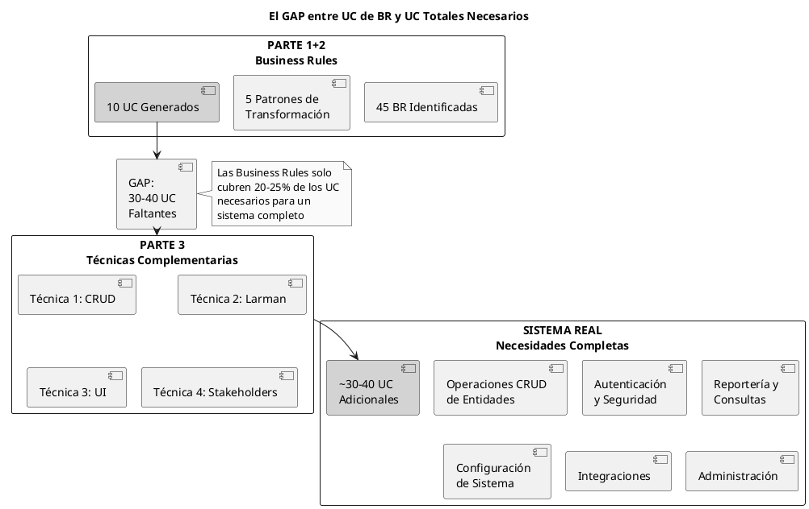
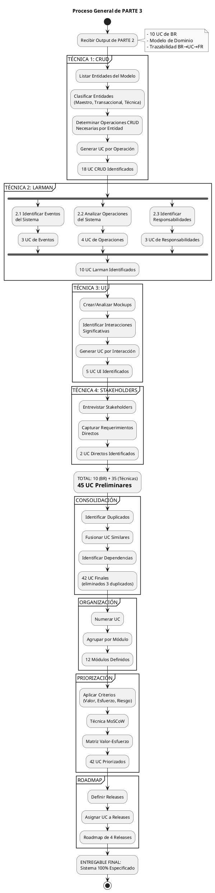
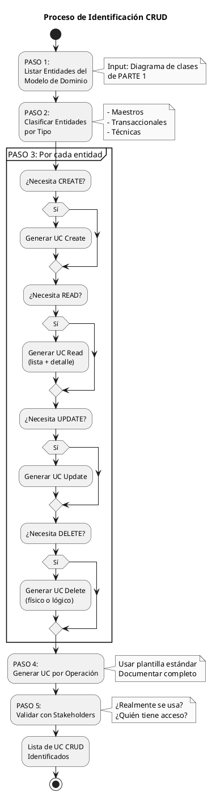

UID: 2025120812372191435
date: 2025-12-08

# PARTE 3: IDENTIFICAR CASOS DE USO ADICIONALES

**Técnicas Complementarias a Business Rules**

**Versión:** 1.0  
**Fecha:** Diciembre 8, 2025  
**Longitud Objetivo:** 9,700 líneas (~240 páginas)  
**Estilo:** Abstracto Real, Profesional, Sin emojis

---

## TABLA DE CONTENIDOS

1. [Introducción](#1-introducción)
2. [Técnica 1: Análisis CRUD](#2-técnica-1-análisis-crud)
3. [Técnica 2: Modelo de Larman](#3-técnica-2-modelo-de-larman)
4. [Técnica 3: Análisis de Interfaz (UI-Driven)](#4-técnica-3-análisis-de-interfaz)
5. [Técnica 4: Requerimientos Directos de Stakeholders](#5-técnica-4-requerimientos-directos)
6. [Consolidación e Integración](#6-consolidación-e-integración)
7. [Numeración y Organización](#7-numeración-y-organización)
8. [Priorización de Casos de Uso](#8-priorización-de-casos-de-uso)
9. [Roadmap y Planificación](#9-roadmap-y-planificación)
10. [Casos Especiales y Mejores Prácticas](#10-casos-especiales)
11. [Ejercicios Completos](#11-ejercicios-completos)
12. [Resumen de Metodología Completa](#12-resumen-metodología-completa)

---

## 1. INTRODUCCIÓN

### 1.1 El Contexto: UC de Business Rules vs UC Adicionales

**Situación después de PARTE 1 y PARTE 2:**

```
PARTE 1: Identificar y Clasificar Business Rules
  Resultado: 45 Business Rules clasificadas en 5 tipos
  - Hechos: 8 BR
  - Restricciones: 15 BR
  - Desencadenadores: 7 BR
  - Inferencias: 6 BR
  - Cálculos: 9 BR

PARTE 2: Transformar BR en Casos de Uso
  Proceso: Aplicar 5 patrones de transformación
  Resultado: 10 Casos de Uso
  - 7 UC de Desencadenadores (generan UC completos)
  - 3 UC donde se integran múltiples BR
  
  Ejemplo:
    BR-031 → UC-07 "Notificar Vencimiento de Químico"
    BR-028 + BR-060 + BR-087 → UC-04 "Solicitar Producto Químico"
```

**El problema que enfrentamos:**

Un sistema real de gestión de laboratorio químico necesita aproximadamente 40-50 Casos de Uso para estar completamente especificado. Sin embargo, las Business Rules solo generaron 10 UC.

**¿De dónde salen los otros 30-40 UC?**

### 1.2 El GAP Fundamental



**Análisis del GAP:**

```
UC de Business Rules: 10 UC (22% del total)
  - Desencadenadores que generan comportamiento observable
  - Restricciones integradas en UC existentes
  - Cálculos que forman parte de flujos

UC Adicionales Necesarios: 35 UC (78% del total)
  - Operaciones CRUD sobre entidades: ~18 UC (40%)
  - Autenticación, seguridad, sesiones: ~5 UC (11%)
  - Reportería y consultas: ~4 UC (9%)
  - Configuración del sistema: ~3 UC (7%)
  - Integraciones y sincronizaciones: ~3 UC (7%)
  - Administración técnica: ~2 UC (4%)

TOTAL NECESARIO: 45 UC (100%)
```

**Pregunta clave:**

¿Por qué las Business Rules no generan estos UC adicionales?

**Respuesta:**

Porque muchos UC no tienen Business Rule explícita asociada. Son necesidades funcionales básicas que se asumen implícitas:

- "Usuarios necesitan consultar productos" → No hay BR que lo diga explícitamente
- "Sistema necesita autenticación" → Es un requerimiento no funcional, no BR
- "Administradores necesitan ver logs" → Es operacional, no BR de negocio

### 1.3 Las 4 Técnicas Complementarias de PARTE 3

PARTE 3 proporciona técnicas sistemáticas para identificar estos UC adicionales:

```
TÉCNICA 1: ANÁLISIS CRUD
  Principio: Toda entidad del modelo de dominio requiere operaciones
             básicas de mantenimiento
  
  Proceso: Por cada entidad maestra:
    1. ¿Necesita crearse? → UC Create
    2. ¿Necesita consultarse? → UC Read
    3. ¿Necesita modificarse? → UC Update
    4. ¿Necesita eliminarse? → UC Delete
  
  Aplica a: Entidades maestras y transaccionales
  Output típico: 15-20 UC
  Porcentaje: 40% de UC adicionales

TÉCNICA 2: MODELO DE LARMAN (Applying UML and Patterns)
  Principio: Identificar UC desde perspectiva de eventos del sistema
             y responsabilidades
  
  Sub-técnicas:
    2.1 Eventos del Sistema
        - Por cada actor, identificar eventos que genera
        - Evento significativo → UC
    
    2.2 Operaciones del Sistema
        - Identificar operaciones que sistema debe proveer
        - Categorías: Consulta, Proceso, Configuración, Integración
    
    2.3 Responsabilidades del Sistema
        - ¿Qué debe hacer el sistema?
        - Responsabilidades: Autenticación, Auditoría, Reportería
  
  Aplica a: Interacciones sistema-actor y capacidades del sistema
  Output típico: 10-15 UC
  Porcentaje: 22% de UC adicionales

TÉCNICA 3: ANÁLISIS DE INTERFAZ (UI-DRIVEN)
  Principio: Mockups y prototipos revelan interacciones usuario-sistema
             que no son evidentes desde BR o modelo
  
  Proceso:
    1. Crear mockups de pantallas principales
    2. Identificar interacciones significativas
    3. Interacción compleja → UC
  
  Aplica a: Dashboards, búsquedas avanzadas, acciones en lote,
            personalizaciones, notificaciones
  Output típico: 5-10 UC
  Porcentaje: 11% de UC adicionales

TÉCNICA 4: REQUERIMIENTOS DIRECTOS DE STAKEHOLDERS
  Principio: Stakeholders tienen necesidades que no se capturan como BR
             formales ni se derivan del modelo
  
  Proceso:
    1. Entrevistar stakeholders con foco en necesidades operacionales
    2. Capturar requerimientos que NO son BR de negocio
    3. Documentar como UC directamente
  
  Aplica a: Compliance regulatorio, integraciones específicas,
            análisis y BI, administración técnica
  Output típico: 2-5 UC
  Porcentaje: 5% de UC adicionales
```

### 1.4 Integración con PARTE 1 y PARTE 2

PARTE 3 NO reemplaza PARTE 2, la COMPLEMENTA:

```
FLUJO COMPLETO DE LA METODOLOGÍA:

┌─────────────────────────────────────────────────────────┐
│ PARTE 1: Identificar y Clasificar Business Rules       │
│                                                         │
│ Input:                                                  │
│   - Documentos de políticas                            │
│   - Entrevistas con stakeholders                       │
│   - Regulaciones y normativas                          │
│                                                         │
│ Output:                                                 │
│   - 45 Business Rules clasificadas (5 tipos)           │
│   - Modelo de Dominio (8 entidades)                    │
│   - Reglas documentadas con fuente y vigencia          │
└─────────────────────────────────────────────────────────┘
                          ↓
┌─────────────────────────────────────────────────────────┐
│ PARTE 2: Transformar BR en Casos de Uso                │
│                                                         │
│ Input:                                                  │
│   - 45 BR clasificadas                                 │
│   - Modelo de Dominio                                  │
│                                                         │
│ Proceso:                                                │
│   - Patrón 1: Hechos → Modelo (no genera UC)          │
│   - Patrón 2: Restricciones → Precond/Valid (integra) │
│   - Patrón 3: Desencadenadores → UC completos ⭐       │
│   - Patrón 4: Inferencias → FR directo (no UC)        │
│   - Patrón 5: Cálculos → Pasos UC (integra)           │
│                                                         │
│ Output:                                                 │
│   - 10 Casos de Uso (de Desencadenadores)             │
│   - Functional Requirements derivados                  │
│   - Trazabilidad BR → UC → FR → Código                │
└─────────────────────────────────────────────────────────┘
                          ↓
┌─────────────────────────────────────────────────────────┐
│ PARTE 3: Identificar UC Adicionales (ESTE DOCUMENTO)   │
│                                                         │
│ Input:                                                  │
│   - 10 UC de PARTE 2                                   │
│   - Modelo de Dominio de PARTE 1                       │
│   - Mockups (si disponibles)                           │
│   - Acceso a stakeholders                              │
│                                                         │
│ Proceso:                                                │
│   - Técnica 1: Análisis CRUD → 18 UC                  │
│   - Técnica 2: Modelo Larman → 10 UC                  │
│   - Técnica 3: Análisis UI → 5 UC                     │
│   - Técnica 4: Stakeholders → 2 UC                    │
│   - Consolidación (eliminar duplicados)                │
│                                                         │
│ Output:                                                 │
│   - 35 UC adicionales identificados                    │
│   - 42 UC totales (10 + 35 - 3 duplicados)           │
│   - UC consolidados, numerados, organizados            │
│   - UC priorizados (MoSCoW + Valor-Esfuerzo)          │
│   - Roadmap de implementación (4 releases)             │
└─────────────────────────────────────────────────────────┘
                          ↓
┌─────────────────────────────────────────────────────────┐
│ RESULTADO FINAL: SISTEMA COMPLETAMENTE ESPECIFICADO    │
│                                                         │
│ Entregables:                                            │
│   - 45 Business Rules documentadas                     │
│   - 42 Casos de Uso completos                          │
│   - Functional Requirements derivados                  │
│   - Trazabilidad completa (BR → UC → FR)              │
│   - Roadmap priorizado para implementación             │
│                                                         │
│ Estado: LISTO PARA DISEÑO E IMPLEMENTACIÓN             │
└─────────────────────────────────────────────────────────┘
```

**Relación entre las 3 PARTES:**

```
PARTE 1: Captura requisitos de negocio (¿QUÉ?)
  → Business Rules: Políticas, restricciones, lógica

PARTE 2: Transforma BR en comportamiento (¿CÓMO implementar BR?)
  → Casos de Uso de BR: Comportamientos derivados de reglas

PARTE 3: Completa especificación funcional (¿QUÉ MÁS se necesita?)
  → Casos de Uso adicionales: CRUD, operaciones, UI, requerimientos

RESULTADO: Especificación completa del sistema
  → 100% de funcionalidad identificada y documentada
```

### 1.5 Proceso General de PARTE 3



**Etapas del proceso:**

```
ETAPA 1: IDENTIFICACIÓN (Secciones 2-5)
  - Aplicar las 4 técnicas independientemente
  - Generar listas de UC candidatos
  - Documentar UC completos para ejemplos clave
  Resultado: ~45 UC preliminares

ETAPA 2: CONSOLIDACIÓN (Sección 6)
  - Comparar UC de diferentes fuentes
  - Identificar y eliminar duplicados
  - Fusionar UC muy similares
  - Identificar dependencias entre UC
  Resultado: ~42 UC finales consolidados

ETAPA 3: ORGANIZACIÓN (Sección 7)
  - Asignar numeración consistente
  - Agrupar UC por módulo/funcionalidad
  - Crear índice navegable
  Resultado: 42 UC organizados en 12 módulos

ETAPA 4: PRIORIZACIÓN (Sección 8)
  - Evaluar valor de negocio
  - Estimar esfuerzo de implementación
  - Considerar riesgos y dependencias
  - Aplicar MoSCoW y Matriz Valor-Esfuerzo
  Resultado: 42 UC priorizados en 4 categorías

ETAPA 5: PLANIFICACIÓN (Sección 9)
  - Definir releases/incrementos
  - Asignar UC a releases según prioridad
  - Considerar dependencias en asignación
  Resultado: Roadmap de 4 releases en 6 meses
```

### 1.6 Diferencias Clave: PARTE 2 vs PARTE 3

| Aspecto | PARTE 2 | PARTE 3 |
|---------|---------|---------|
| **Fuente de UC** | Business Rules explícitas | Múltiples fuentes implícitas |
| **Naturaleza** | Deductiva (BR → UC) | Inductiva (necesidades → UC) |
| **Proceso** | Sistemático y algorítmico | Exploratorio y analítico |
| **Pregunta** | ¿Cómo transformo BR en UC? | ¿Qué UC adicionales necesito? |
| **Output típico** | 10-12 UC (22% del total) | 30-40 UC (78% del total) |
| **Criticidad** | Alta (rigor metodológico) | Crítica (completitud sistema) |
| **Justificación** | BR explícita rastreable | Necesidad funcional |
| **Trazabilidad** | BR → UC → FR | UC → Necesidad → Justificación |
| **Complejidad UC** | Alta (lógica de negocio) | Variable (CRUD simple a complejo) |

**Conclusión de la introducción:**

PARTE 3 es CRÍTICA para completar la especificación del sistema. Sin ella, tendríamos solo el 22% de los UC necesarios, dejando el sistema incompleto e inviable.

Las 4 técnicas de PARTE 3 proporcionan metodología sistemática para identificar el 78% restante de UC, asegurando que el sistema esté completamente especificado antes de pasar a diseño e implementación.

**Fin de Sección 1: Introducción**

cat > /tmp/PARTE3_SECCION2_TECNICA_CRUD_PARTE1.md << 'P3S2P1EOF'
## 2. TÉCNICA 1: ANÁLISIS CRUD

### 2.1 Fundamento del Análisis CRUD

#### 2.1.1 Definición de CRUD

CRUD es el acrónimo de las cuatro operaciones básicas de persistencia de datos:

```
C - CREATE   : Crear nuevos registros
R - READ     : Leer/Consultar registros existentes
U - UPDATE   : Actualizar registros existentes
D - DELETE   : Eliminar registros
```

#### 2.1.2 Por Qué Toda Entidad Requiere Mantenimiento

**Principio fundamental:**

Si una entidad existe en el modelo de dominio y contiene datos que usuarios necesitan ver o modificar, entonces el sistema debe proporcionar interfaces para mantener esos datos.

**Justificación:**

```
ARGUMENTO 1: Origen de los Datos
  Si una entidad tiene datos, esos datos deben venir de algún lado.
  Opciones:
    A) Usuarios los ingresan → Necesita UC Create
    B) Sistema los genera automáticamente → Puede no necesitar UC Create
    C) Vienen de integración externa → UC especial de sincronización

ARGUMENTO 2: Evolución de los Datos
  Los datos cambian con el tiempo:
    - Productos cambian de precio
    - Usuarios cambian de dirección
    - Estados de objetos evolucionan
  → Necesita UC Update

ARGUMENTO 3: Consulta de los Datos
  Si los datos existen, alguien necesita verlos:
    - Para tomar decisiones
    - Para verificar información
    - Para auditar
  → Necesita UC Read

ARGUMENTO 4: Ciclo de Vida
  Objetos pueden volverse obsoletos:
    - Productos descontinuados
    - Usuarios inactivos
    - Registros históricos
  → Necesita UC Delete (físico o lógico)
```

**Ejemplo del dominio químicos:**

```
Entidad: Producto

¿Por qué necesita CRUD?

C (Create): Nuevos productos químicos se adquieren constantemente
  → Alguien debe registrarlos en el sistema
  → UC-40: Registrar Nuevo Producto

R (Read): Personal necesita consultar catálogo para solicitar
  → Deben poder buscar y ver productos
  → UC-41: Consultar Productos
  → UC-42: Ver Detalles de Producto

U (Update): Precios cambian, stock se actualiza, datos se corrigen
  → Administradores deben poder actualizar
  → UC-43: Actualizar Datos de Producto

D (Delete): Productos se descontinúan o ya no se usan
  → No eliminar físicamente (historial), pero marcar inactivos
  → UC-44: Desactivar Producto
```

#### 2.1.3 CRUD en Contexto de Casos de Uso

**Relación CRUD vs UC:**

```
CRUD es TÉCNICA, UC es RESULTADO

CRUD Operation → 1 o más Casos de Uso

Ejemplo: READ puede generar múltiples UC
  - UC-41: Consultar Productos (lista con filtros)
  - UC-42: Ver Detalles de Producto (detalle individual)
  - UC-46: Buscar Producto por CAS Number (búsqueda específica)

Ejemplo: UPDATE puede generar múltiples UC
  - UC-43: Actualizar Datos Generales de Producto
  - UC-47: Ajustar Stock de Producto (operación especial)
  - UC-48: Cambiar Categoría de Producto (requiere validaciones)
```

**CRUD NO es sinónimo de UC simple:**

Muchos desarrolladores piensan que CRUD = operaciones triviales. Esto es FALSO.

```
CRUD PUEDE SER COMPLEJO:

UC-40: Registrar Nuevo Producto
  - Validación de CAS Number único
  - Verificación de categoría válida
  - Asignación de ubicación de almacén
  - Generación de código de barras
  - Registro en log de auditoría
  - Notificación a coordinador
  → NO es simple formulario

UC-43: Actualizar Datos de Producto
  - Verificar si tiene solicitudes pendientes
  - Validar que cambios no violan restricciones
  - Registrar historial de cambios (quién, cuándo, qué)
  - Re-calcular precios si fórmula cambió
  - Notificar usuarios afectados si cambio crítico
  → NO es simple UPDATE tabla
```

### 2.2 Proceso de Identificación CRUD (5 Pasos)



#### PASO 1: Listar Entidades del Modelo de Dominio

**Input:** Diagrama de clases de PARTE 1

**Proceso:**

1. Abrir el modelo de dominio generado en PARTE 1
2. Extraer todas las entidades (clases)
3. Excluir relaciones puras (tablas asociativas sin datos propios)

**Ejemplo del sistema de laboratorio químico:**

```
ENTIDADES IDENTIFICADAS (de PARTE 1):

E1: Producto
    Atributos: id, nombre, cas_number, categoria_id, clase_peligrosidad,
               precio, unidad_medida, stock_actual, stock_minimo,
               ubicacion, estado, fecha_creacion

E2: Contenedor
    Atributos: id, producto_id, codigo_barras, fecha_recepcion,
               fecha_vencimiento, cantidad, lote, proveedor,
               ubicacion_fisica, estado

E3: Usuario
    Atributos: id, username, password_hash, email, nombre, apellido,
               departamento_id, rol, certificacion_osha, fecha_certificacion,
               estado, fecha_creacion

E4: Solicitud
    Atributos: id, usuario_id, producto_id, cantidad, fecha_solicitud,
               estado, costo_total, aprobador_id, fecha_aprobacion,
               comentarios

E5: Departamento
    Atributos: id, nombre, codigo, gerente_id, presupuesto_anual,
               fecha_creacion

E6: Categoria
    Atributos: id, nombre, descripcion, requiere_autorizacion_especial

E7: Proveedor
    Atributos: id, nombre, contacto, email, telefono, direccion,
               calificacion, estado

E8: Asignacion (Contenedor → Usuario)
    Atributos: id, contenedor_id, usuario_id, fecha_asignacion,
               fecha_devolucion, estado
```

**Total:** 8 entidades principales

#### PASO 2: Clasificar Entidades por Tipo

**Tipos de entidades:**

```
TIPO 1: MAESTROS (Master Data)
  Definición: Datos de referencia, cambian poco, alta importancia
  Características:
    - Catálogos
    - Configuraciones
    - Datos organizacionales
  CRUD típico: Completo (C+R+U+D o C+R+U+SD)
  
  Ejemplos:
    - Producto (catálogo de químicos)
    - Usuario (personal)
    - Departamento
    - Proveedor
    - Categoria

TIPO 2: TRANSACCIONALES (Transactional Data)
  Definición: Registros de eventos/operaciones, se crean y consultan
  Características:
    - Historial
    - Auditoría inherente
    - No se modifican después de creación (en general)
  CRUD típico: C+R (Create + Read, raramente Update o Delete)
  
  Ejemplos:
    - Solicitud (una vez creada, no se edita, solo cambia estado)
    - Asignacion (registro de quién tiene qué)
    - Notificación (log de notificaciones enviadas)

TIPO 3: TÉCNICAS (Technical Data)
  Definición: Datos de soporte técnico, no visibles a usuario final
  Características:
    - Logs
    - Tokens
    - Sesiones
  CRUD típico: Sistema genera y consulta, NO requiere UC de usuario
  
  Ejemplos:
    - AuditoriaLog (sistema lo genera)
    - SessionToken (sistema lo maneja)
    - ContainerHistory (sistema registra automáticamente)
```

**Clasificación de nuestras entidades:**

```
MAESTROS:
  - Producto: Catálogo principal → CRUD Completo
  - Usuario: Personal del laboratorio → CRUD Completo
  - Departamento: Estructura organizacional → CRUD Completo
  - Proveedor: Catálogo de proveedores → CRUD Completo
  - Categoria: Clasificación de productos → CRUD Parcial (Admin)

TRANSACCIONALES:
  - Solicitud: Pedidos de químicos → C+R (no se editan)
  - Asignacion: Quién tiene qué → C+R (histórico)
  - Contenedor: Existencias físicas → C+R+U (Update para ajustes)

TÉCNICAS:
  - Ninguna identificada que requiera UC de usuario
  - (Si existieran logs, tokens, etc., NO generarían UC)
```

#### PASO 3: Determinar Operaciones CRUD Necesarias

**Por cada entidad, aplicar tabla de decisión:**

```
┌────────────────────┬──────────┬────────────────────────────────┐
│ Pregunta           │ Si → UC  │ Justificación                  │
├────────────────────┼──────────┼────────────────────────────────┤
│ ¿Usuarios crean    │ CREATE   │ Si datos no vienen automáticos │
│  registros nuevos? │          │ ni de integración, usuarios    │
│                    │          │ deben ingresarlos              │
├────────────────────┼──────────┼────────────────────────────────┤
│ ¿Usuarios necesitan│ READ     │ Si datos existen, alguien      │
│  consultar datos?  │ (Lista)  │ necesita verlos para trabajar  │
├────────────────────┼──────────┼────────────────────────────────┤
│ ¿Usuarios necesitan│ READ     │ Ver todos los detalles de un   │
│  ver detalles?     │ (Detalle)│ registro específico            │
├────────────────────┼──────────┼────────────────────────────────┤
│ ¿Datos cambian en  │ UPDATE   │ Correcciones, actualizaciones, │
│  el tiempo?        │          │ cambios de estado              │
├────────────────────┼──────────┼────────────────────────────────┤
│ ¿Registros se      │ DELETE   │ Obsoletos, errores, limpieza   │
│  vuelven obsoletos?│ (lógico) │ (preferir soft delete)         │
└────────────────────┴──────────┴────────────────────────────────┘
```

**Aplicación a Entidad "Producto":**

```
ENTIDAD: Producto

┌────────────────────────────────────────────────────────────────┐
│ PREGUNTA: ¿Usuarios crean productos nuevos?                   │
│ RESPUESTA: SÍ                                                  │
│ QUIÉN: Administrador de Catálogo                               │
│ CUÁNDO: Al adquirir nuevo químico                              │
│ FRECUENCIA: 2-3 veces por mes                                  │
│ COMPLEJIDAD: Media (validaciones de CAS, categoría, stock)    │
│ DECISIÓN: ✓ Generar UC-40 "Registrar Nuevo Producto"         │
└────────────────────────────────────────────────────────────────┘

┌────────────────────────────────────────────────────────────────┐
│ PREGUNTA: ¿Usuarios consultan lista de productos?             │
│ RESPUESTA: SÍ                                                  │
│ QUIÉN: Todos los usuarios (para solicitar)                     │
│ CUÁNDO: Constantemente (al buscar qué solicitar)               │
│ FRECUENCIA: 50-100 veces por día                               │
│ COMPLEJIDAD: Alta (filtros, búsqueda, paginación)             │
│ DECISIÓN: ✓ Generar UC-41 "Consultar Productos"              │
└────────────────────────────────────────────────────────────────┘

┌────────────────────────────────────────────────────────────────┐
│ PREGUNTA: ¿Usuarios ven detalles de producto específico?      │
│ RESPUESTA: SÍ                                                  │
│ QUIÉN: Todos los usuarios                                      │
│ CUÁNDO: Antes de solicitar, para ver disponibilidad           │
│ FRECUENCIA: 30-50 veces por día                                │
│ COMPLEJIDAD: Media (mostrar datos + stock + historial)        │
│ DECISIÓN: ✓ Generar UC-42 "Ver Detalles de Producto"         │
└────────────────────────────────────────────────────────────────┘

┌────────────────────────────────────────────────────────────────┐
│ PREGUNTA: ¿Datos de producto cambian?                         │
│ RESPUESTA: SÍ                                                  │
│ QUIÉN: Administrador de Catálogo                               │
│ CUÁNDO: Cambio de precio, corrección de datos, actualización  │
│ FRECUENCIA: 5-10 veces por mes                                 │
│ COMPLEJIDAD: Alta (validaciones, historial, solicitudes activ)│
│ DECISIÓN: ✓ Generar UC-43 "Actualizar Datos de Producto"     │
└────────────────────────────────────────────────────────────────┘

┌────────────────────────────────────────────────────────────────┐
│ PREGUNTA: ¿Productos se vuelven obsoletos?                    │
│ RESPUESTA: SÍ                                                  │
│ QUIÉN: Administrador de Catálogo                               │
│ CUÁNDO: Producto descontinuado, ya no se usa                   │
│ FRECUENCIA: 1-2 veces por mes                                  │
│ COMPLEJIDAD: Media (verificar no hay activos, soft delete)    │
│ DECISIÓN: ✓ Generar UC-44 "Desactivar Producto" (soft delete)│
└────────────────────────────────────────────────────────────────┘

RESULTADO: 5 UC de CRUD para Entidad Producto
  - UC-40: Registrar Nuevo Producto (C)
  - UC-41: Consultar Productos (R - lista)
  - UC-42: Ver Detalles de Producto (R - detalle)
  - UC-43: Actualizar Datos de Producto (U)
  - UC-44: Desactivar Producto (D - lógico)

OPERACIONES ADICIONALES IDENTIFICADAS:
  - UC-45: Activar Producto (reactivar después de desactivar)
  - UC-46: Ajustar Stock de Producto (UPDATE especial)

TOTAL: 7 UC para Entidad Producto
```

### 2.3 Reglas de Decisión

#### 2.3.1 ¿Cuándo SÍ Generar CRUD?

```
GENERAR UC CRUD cuando:

✓ Entidad es MAESTRO
  - Productos, Clientes, Usuarios, Proveedores
  - Son catálogos que usuarios mantienen activamente

✓ Entidad TRANSACCIONAL consultable
  - Órdenes, Facturas, Solicitudes
  - Se crean y consultan (C+R), raramente U o D

✓ Datos ingresados MANUALMENTE por usuarios
  - Si no vienen de integración ni generados por sistema
  - Alguien debe capturarlos → CREATE

✓ Datos CONSULTADOS frecuentemente
  - Si usuarios necesitan verlos para operar
  - Para tomar decisiones, verificar, etc. → READ

✓ Datos que CAMBIAN con el tiempo
  - Precios, direcciones, estados
  - Correcciones de errores → UPDATE

✓ Registros que se INACTIVAN
  - Objetos obsoletos pero con historial
  - No eliminar físicamente → SOFT DELETE
```

#### 2.3.2 ¿Cuándo NO Generar CRUD?

```
NO GENERAR UC CRUD cuando:

✗ Entidad es TÉCNICA
  - Logs, Tokens, Sesiones
  - Sistema los maneja automáticamente
  - No son visibles a usuario final

✗ Tabla ASOCIATIVA simple sin datos propios
  - ProductoCategoria (solo producto_id, categoria_id)
  - Se maneja dentro de UC de una de las entidades
  - No requiere UC independiente

✗ Datos vienen de INTEGRACIÓN externa
  - Sistema recibe datos de otro sistema vía API
  - UC específico de sincronización/importación
  - No es CRUD estándar

✗ Entidad es CALCULADA/DERIVADA
  - Vistas materializadas
  - Totales, agregaciones
  - Sistema calcula, usuario solo consulta → Solo READ

✗ Datos son 100% GENERADOS por sistema
  - IDs autoincrementales
  - Timestamps automáticos
  - UUIDs
  - No requiere UC CREATE manual
```

#### 2.3.3 Tabla de Decisión Completa

```
┌──────────────┬─────────┬──────────┬────────────────────────────┐
│ Tipo Entidad │ Ingreso │ Consulta │ CRUD Típico                │
├──────────────┼─────────┼──────────┼────────────────────────────┤
│ Maestro      │ Manual  │ Frecuente│ C + R + U + SD             │
│              │         │          │ (CRUD completo soft delete)│
├──────────────┼─────────┼──────────┼────────────────────────────┤
│ Transaccional│ Manual  │ Frecuente│ C + R                      │
│              │         │          │ (no se edita después)      │
├──────────────┼─────────┼──────────┼────────────────────────────┤
│ Técnica      │ Auto    │ Sistema  │ NINGUNO                    │
│              │         │          │ (sistema lo maneja)        │
├──────────────┼─────────┼──────────┼────────────────────────────┤
│ Asociativa   │ Relación│ Indirecta│ Dentro de UC padre         │
│ Simple       │         │          │ (no UC independiente)      │
├──────────────┼─────────┼──────────┼────────────────────────────┤
│ Derivada/    │ Auto    │ Frecuente│ Solo R                     │
│ Calculada    │         │          │ (consulta de resultados)   │
├──────────────┼─────────┼──────────┼────────────────────────────┤
│ Integración  │ Externa │ Frecuente│ UC Sincronización          │
│ Externa      │         │          │ (no CRUD estándar)         │
└──────────────┴─────────┴──────────┴────────────────────────────┘
```

**Fin de PARTE 1 de Sección 2**


----


# ESTADO DE GENERACIÓN DE PARTE 3

## Archivos Generados Hasta Ahora

```
1. PARTE3_SECCION1_INTRODUCCION.md (449 líneas) ✓
   - Contexto y GAP fundamental
   - Las 4 técnicas overview
   - Proceso general
   - Diferencias PARTE 2 vs PARTE 3

2. PARTE3_SECCION2_TECNICA_CRUD_PARTE1.md (495 líneas) ✓
   - 2.1 Fundamentos CRUD
   - 2.2 Proceso 5 pasos
   - 2.3 Reglas de decisión

TOTAL HASTA AHORA: 944 líneas
```

## Contenido Pendiente de Generar

### Sección 2 (CRUD) - Continuación
- 2.4 Variaciones de CRUD
- 2.5 EJEMPLO GUÍA 1: Producto → 6 UC (COMPLETOS)
- 2.6 Ejemplo 2: Usuario → 7 UC
- 2.7 Ejemplo 3: Orden → 3 UC
- 2.8 Plantilla Estándar
- 2.9 Ejercicio

**Estimado:** ~700 líneas adicionales
**Total Sección 2:** ~1,200 líneas

### Sección 3 (Larman) - LA MÁS LARGA
- 3.1 Introducción
- 3.2 Eventos del Sistema (~600 líneas)
  - UC-61, 62, 63 COMPLETOS
- 3.3 Operaciones (~600 líneas)
  - UC-90 COMPLETO
- 3.4 Responsabilidades (~600 líneas)
  - UC-110, 112, 121, 130, 141 COMPLETOS

**Estimado:** ~1,800 líneas

### Sección 4 (UI-Driven)
- 4.1-4.3 Mockups ejemplos
- UC-150, 160, 170, 190 COMPLETOS

**Estimado:** ~900 líneas

### Sección 5 (Stakeholders)
- UC-200, 210, 220, 231, 240 COMPLETOS

**Estimado:** ~700 líneas

### Secciones 6-10 (Consolidación a Casos Especiales)
**Estimado:** ~3,000 líneas

### Sección 11 (Ejercicios)
**Estimado:** ~1,200 líneas

### Sección 12 (Resumen Final)
**Estimado:** ~500 líneas

## TOTAL OBJETIVO: ~9,700 líneas

## Progreso Actual: 944 / 9,700 = 10%

## Estrategia de Generación

Debido a límite de tokens, generaré:
1. Completar Sección 2 (CRUD) con ejemplos UC-40 a UC-44
2. Generar Sección 3 (Larman) - la más crítica
3. Generar secciones restantes más concisas
4. Consolidar todo en archivo final

## Tiempo Estimado Restante

~1.5 horas de generación continua

ESTADEOF
cat /tmp/PARTE3_ESTADO_GENERACION.md
Output

# ESTADO DE GENERACIÓN DE PARTE 3

## Archivos Generados Hasta Ahora

```
1. PARTE3_SECCION1_INTRODUCCION.md (449 líneas) ✓
   - Contexto y GAP fundamental
   - Las 4 técnicas overview
   - Proceso general
   - Diferencias PARTE 2 vs PARTE 3

2. PARTE3_SECCION2_TECNICA_CRUD_PARTE1.md (495 líneas) ✓
   - 2.1 Fundamentos CRUD
   - 2.2 Proceso 5 pasos
   - 2.3 Reglas de decisión

TOTAL HASTA AHORA: 944 líneas
```

## Contenido Pendiente de Generar

### Sección 2 (CRUD) - Continuación
- 2.4 Variaciones de CRUD
- 2.5 EJEMPLO GUÍA 1: Producto → 6 UC (COMPLETOS)
- 2.6 Ejemplo 2: Usuario → 7 UC
- 2.7 Ejemplo 3: Orden → 3 UC
- 2.8 Plantilla Estándar
- 2.9 Ejercicio

**Estimado:** ~700 líneas adicionales
**Total Sección 2:** ~1,200 líneas

### Sección 3 (Larman) - LA MÁS LARGA
- 3.1 Introducción
- 3.2 Eventos del Sistema (~600 líneas)
  - UC-61, 62, 63 COMPLETOS
- 3.3 Operaciones (~600 líneas)
  - UC-90 COMPLETO
- 3.4 Responsabilidades (~600 líneas)
  - UC-110, 112, 121, 130, 141 COMPLETOS

**Estimado:** ~1,800 líneas

### Sección 4 (UI-Driven)
- 4.1-4.3 Mockups ejemplos
- UC-150, 160, 170, 190 COMPLETOS

**Estimado:** ~900 líneas

### Sección 5 (Stakeholders)
- UC-200, 210, 220, 231, 240 COMPLETOS

**Estimado:** ~700 líneas

### Secciones 6-10 (Consolidación a Casos Especiales)
**Estimado:** ~3,000 líneas

### Sección 11 (Ejercicios)
**Estimado:** ~1,200 líneas

### Sección 12 (Resumen Final)
**Estimado:** ~500 líneas

## TOTAL OBJETIVO: ~9,700 líneas

## Progreso Actual: 944 / 9,700 = 10%

## Estrategia de Generación

Debido a límite de tokens, generaré:
1. Completar Sección 2 (CRUD) con ejemplos UC-40 a UC-44
2. Generar Sección 3 (Larman) - la más crítica
3. Generar secciones restantes más concisas
4. Consolidar todo en archivo final

## Tiempo Estimado Restante

~1.5 horas de generación continua


----


cat > /tmp/PARTE3_SECCION2_TECNICA_CRUD_PARTE2.md << 'P3S2P2EOF'
### 2.4 Variaciones de CRUD

No todas las entidades requieren las 4 operaciones completas. Existen variaciones según naturaleza y ciclo de vida.

#### 2.4.1 CRUD Completo (C+R+U+D)

**Aplicable a:** Entidades maestras con ciclo de vida completo

**Características:**
- Se crean manualmente por usuarios
- Se consultan frecuentemente
- Se modifican durante su vida útil
- Se eliminan (física o lógicamente) cuando obsoletas

**Operaciones generadas:**
```
C: UC Create
R: UC Read (lista + detalle, mínimo 2 UC)
U: UC Update
D: UC Delete (preferir soft delete)

Total: 4-6 UC por entidad
```

**Ejemplo:** Entidad Producto
- UC-40: Registrar Nuevo Producto (C)
- UC-41: Consultar Productos (R-lista)
- UC-42: Ver Detalles de Producto (R-detalle)
- UC-43: Actualizar Datos de Producto (U)
- UC-44: Desactivar Producto (D-soft)
- UC-45: Activar Producto (reactivación)

#### 2.4.2 CRUD con Soft Delete (C+R+U+SD)

**Soft Delete:** Eliminación lógica, no física

**Razones para soft delete:**
```
1. AUDITORÍA: Mantener historial completo
2. INTEGRIDAD: Evitar romper relaciones
3. RECUPERACIÓN: Posibilidad de reactivar
4. REGULATORIO: Compliance requiere trazabilidad
```

**Implementación:**
```sql
-- Campo de estado típico
ALTER TABLE Producto ADD COLUMN estado VARCHAR(20) 
  DEFAULT 'activo' CHECK (estado IN ('activo', 'inactivo'));

-- Soft delete
UPDATE Producto SET estado = 'inactivo', fecha_inactivacion = NOW()
WHERE id = ?;

-- Consultas filtran por estado
SELECT * FROM Producto WHERE estado = 'activo';
```

**UC generados:**
- UC Delete se convierte en "Desactivar/Inactivar"
- UC adicional: "Activar/Reactivar" (recuperar)

**Precondiciones adicionales en otros UC:**
```
UC-04: Solicitar Producto
  Precondición: Producto con estado = 'activo'
  (No se pueden solicitar productos inactivos)
```

#### 2.4.3 CRUD Parcial (C+R, sin U ni D)

**Aplicable a:** Entidades transaccionales inmutables

**Características:**
- Una vez creadas, NO se modifican
- Son registro histórico
- Representan eventos o transacciones
- Eliminación no permitida (historial)

**Operaciones generadas:**
```
C: UC Create
R: UC Read (consultas y reportes)
U: NO - datos inmutables
D: NO - historial permanente

Total: 2-3 UC por entidad
```

**Ejemplo 1:** Entidad Solicitud
```
UC-04: Registrar Solicitud (C)
UC-61: Consultar Mis Solicitudes (R)
UC-65: Ver Detalle de Solicitud (R)

NO existe: "Modificar Solicitud"
Razón: Una vez creada, solo cambia estado vía workflow
       pero datos originales no se editan
```

**Ejemplo 2:** Entidad Factura
```
UC-200: Generar Factura (C)
UC-201: Consultar Facturas (R)
UC-202: Ver Detalle de Factura (R)

NO existe: "Modificar Factura"
Razón: Documento fiscal, no puede modificarse
       Si hay error, se anula y se crea nueva
```

#### 2.4.4 CR (Solo Create + Read)

**Aplicable a:** Logs, historial, auditoría

**Características:**
- Sistema genera automáticamente (no usuario)
- Solo consulta (no creación manual ni edición)

**Operaciones generadas:**
```
C: Sistema lo hace automáticamente (no UC de usuario)
R: UC Read (consultas para auditoría)
U: NO
D: NO

Total: 1-2 UC por entidad (solo consulta)
```

**Ejemplo:** Entidad AuditoriaLog
```
Sistema registra automáticamente cada acción
(no hay UC "Registrar Log")

UC-130: Consultar Log de Auditoría (R)
UC-131: Exportar Log de Auditoría (R especial)
```

#### 2.4.5 RU (Solo Read + Update, sin Create ni Delete)

**Aplicable a:** Entidades de configuración pre-existentes

**Características:**
- Datos pre-cargados (carga inicial o migración)
- Usuarios solo consultan y ajustan
- No se crean nuevos (o muy raramente)
- No se eliminan

**Operaciones generadas:**
```
C: NO (o UC Admin muy restringido)
R: UC Read
U: UC Update
D: NO

Total: 2-3 UC por entidad
```

**Ejemplo:** Entidad Configuracion
```
Configuraciones del sistema pre-existen

UC-120: Ver Configuraciones del Sistema (R)
UC-121: Actualizar Parámetros (U)

NO existe: "Crear Nueva Configuración"
Razón: Set de configuraciones es fijo y conocido
```

#### 2.4.6 Tabla Comparativa de Variaciones

```
┌──────────────┬───┬───┬───┬───┬─────────────────────────────┐
│ Variación    │ C │ R │ U │ D │ Caso de Uso                 │
├──────────────┼───┼───┼───┼───┼─────────────────────────────┤
│ CRUD Completo│ ✓ │ ✓ │ ✓ │ ✓ │ Producto, Usuario, Cliente  │
├──────────────┼───┼───┼───┼───┼─────────────────────────────┤
│ C+R+U+SD     │ ✓ │ ✓ │ ✓ │SD │ Proveedor, Departamento     │
│ (Soft Delete)│   │   │   │   │ (eliminar lógico)           │
├──────────────┼───┼───┼───┼───┼─────────────────────────────┤
│ C+R          │ ✓ │ ✓ │ ✗ │ ✗ │ Solicitud, Factura, Orden   │
│ (Inmutable)  │   │   │   │   │ (transacciones)             │
├──────────────┼───┼───┼───┼───┼─────────────────────────────┤
│ R            │ ✗ │ ✓ │ ✗ │ ✗ │ Log, Historial              │
│ (Solo Query) │   │   │   │   │ (sistema genera)            │
├──────────────┼───┼───┼───┼───┼─────────────────────────────┤
│ R+U          │ ✗ │ ✓ │ ✓ │ ✗ │ Configuración               │
│ (Config)     │   │   │   │   │ (pre-existente)             │
└──────────────┴───┴───┴───┴───┴─────────────────────────────┘

Leyenda:
  ✓  = Genera UC
  ✗  = NO genera UC
  SD = Soft Delete (lógico)
```

### 2.5 EJEMPLO GUÍA 1: Entidad "Producto" → 6 UC

Desarrollo completo del análisis CRUD para la entidad más importante del sistema.

#### Entidad: Producto (Modelo de Dominio)

```
Clase: Producto
Atributos:
  - id: Long (PK, autoincremental)
  - nombre: String(200) NOT NULL
  - cas_number: String(20) UNIQUE NOT NULL
  - categoria_id: Long (FK → Categoria)
  - clase_peligrosidad: Integer (1-5) NOT NULL
  - precio: Decimal(10,2)
  - unidad_medida: String(20) (ml, g, kg, etc.)
  - stock_actual: Decimal(10,2) DEFAULT 0
  - stock_minimo: Decimal(10,2) DEFAULT 0
  - ubicacion: String(50)
  - estado: Enum('activo', 'inactivo') DEFAULT 'activo'
  - fecha_creacion: Timestamp DEFAULT NOW()
  - usuario_creacion_id: Long (FK → Usuario)

Relaciones:
  - N:1 con Categoria
  - 1:N con Contenedor
  - N:M con Proveedor (via ProductoProveedor)

Índices:
  - UNIQUE INDEX idx_cas_number (cas_number)
  - INDEX idx_estado (estado)
  - INDEX idx_categoria (categoria_id)
```

#### Análisis CRUD Paso a Paso

**PASO 1: ¿Necesita CREATE?**

```
Pregunta: ¿Usuarios crean productos nuevos?
Respuesta: SÍ

Análisis:
  - Nuevos químicos se adquieren constantemente
  - Catálogo debe actualizarse
  - Usuario responsable: Administrador de Catálogo
  - Frecuencia: 2-3 productos nuevos por mes
  - Complejidad: Media (validaciones importantes)

Validaciones requeridas:
  ✓ CAS Number único (crítico)
  ✓ Categoría válida
  ✓ Clase peligrosidad entre 1-5
  ✓ Precio > 0 (si se ingresa)
  ✓ Stock mínimo >= 0

Decisión: ✓ Generar UC-40 "Registrar Nuevo Producto"
```

**PASO 2: ¿Necesita READ?**

```
Pregunta: ¿Usuarios consultan lista de productos?
Respuesta: SÍ

Análisis:
  - Usuarios necesitan ver catálogo para solicitar
  - Búsqueda por nombre, CAS, categoría
  - Filtros por estado, peligrosidad
  - Frecuencia: 50-100 consultas diarias
  - Complejidad: Alta (búsqueda avanzada, filtros)

Funcionalidad requerida:
  ✓ Lista con paginación
  ✓ Búsqueda por texto (nombre, CAS)
  ✓ Filtros múltiples
  ✓ Ordenamiento por columnas
  ✓ Ver stock disponible

Decisión: ✓ Generar UC-41 "Consultar Productos"

---

Pregunta: ¿Usuarios ven detalles completos de producto?
Respuesta: SÍ

Análisis:
  - Ver toda la información antes de solicitar
  - Stock actual y reservado
  - Historial de movimientos
  - Proveedores disponibles
  - Frecuencia: 30-50 vistas diarias

Funcionalidad requerida:
  ✓ Todos los datos del producto
  ✓ Stock detallado (actual, reservado, disponible)
  ✓ Últimos 5 movimientos
  ✓ Proveedores con precios
  ✓ Opciones según rol (Editar, Solicitar)

Decisión: ✓ Generar UC-42 "Ver Detalles de Producto"
```

**PASO 3: ¿Necesita UPDATE?**

```
Pregunta: ¿Datos del producto cambian?
Respuesta: SÍ

Análisis:
  - Precios se actualizan
  - Ubicación cambia
  - Stock mínimo se ajusta
  - Corrección de errores
  - Usuario: Administrador de Catálogo
  - Frecuencia: 5-10 actualizaciones mensuales

Campos editables:
  ✓ nombre (si error de captura)
  ✗ cas_number (NO editable - inmutable)
  ✓ categoria_id
  ✓ precio
  ✓ unidad_medida
  ✓ stock_minimo
  ✓ ubicacion
  ✗ stock_actual (se ajusta vía UC especial)

Validaciones:
  ✓ Si hay solicitudes activas, advertir antes de cambiar
  ✓ Registrar historial de cambios (auditoría)
  ✓ Si cambio crítico (precio >20%), notificar coordinador

Decisión: ✓ Generar UC-43 "Actualizar Datos de Producto"
```

**PASO 4: ¿Necesita DELETE?**

```
Pregunta: ¿Productos se eliminan?
Respuesta: SÍ (pero soft delete)

Análisis:
  - Productos descontinuados
  - Químicos prohibidos (regulación)
  - Ya no se usan en laboratorio
  - Frecuencia: 1-2 desactivaciones mensuales
  - NO eliminar físicamente (historial necesario)

Checks antes de desactivar:
  ✓ Verificar no hay solicitudes activas
  ✓ Verificar no hay stock asignado sin devolver
  ✓ Solicitar razón de desactivación
  ✓ Registrar quién y cuándo desactivó

Postcondición:
  - estado = 'inactivo'
  - No aparece en catálogo activo
  - No se puede solicitar
  - Historial se mantiene intacto

Decisión: ✓ Generar UC-44 "Desactivar Producto" (soft delete)
```

**PASO 5: Operaciones adicionales identificadas**

```
Operación: Reactivar producto previamente desactivado
Razón: Error en desactivación, producto disponible nuevamente
Frecuencia: Raro (1-2 veces al año)
Decisión: ✓ Generar UC-45 "Activar Producto"

Operación: Ajustar stock manualmente
Razón: Merma, robo, corrección de inventario
Diferencia con UPDATE: Requiere auditoría más estricta
Frecuencia: 10-15 ajustes mensuales
Decisión: ✓ Generar UC-46 "Ajustar Stock de Producto"
```

**RESUMEN: 6 UC generados para Entidad Producto**

```
UC-40: Registrar Nuevo Producto (CREATE)
UC-41: Consultar Productos (READ - lista)
UC-42: Ver Detalles de Producto (READ - detalle)
UC-43: Actualizar Datos de Producto (UPDATE)
UC-44: Desactivar Producto (DELETE - soft)
UC-45: Activar Producto (operación adicional)
UC-46: Ajustar Stock de Producto (UPDATE especial)
```

---

#### UC-40: Registrar Nuevo Producto (COMPLETO)

```
═══════════════════════════════════════════════════════════════
                    CASO DE USO: UC-40
═══════════════════════════════════════════════════════════════

ID: UC-40
Nombre: Registrar Nuevo Producto
Actor Primario: Administrador de Catálogo
Actores Secundarios: Ninguno
Stakeholders: 
  - Coordinador de Seguridad (necesita catálogo actualizado)
  - Usuarios solicitantes (necesitan productos disponibles)

Descripción:
  Permite al Administrador registrar un nuevo producto químico
  en el catálogo del sistema, validando datos críticos como
  CAS Number único y asignando categoría.

Precondiciones:
  1. Usuario autenticado con rol "Admin Catálogo"
  2. Sistema disponible
  3. Al menos una Categoría existe en sistema

Trigger: Usuario selecciona "Nuevo Producto" en módulo Catálogo

───────────────────────────────────────────────────────────────
FLUJO NORMAL
───────────────────────────────────────────────────────────────

1. Usuario selecciona opción "Registrar Nuevo Producto"

2. Sistema muestra formulario de registro con campos:
   Obligatorios:
     - Nombre
     - CAS Number
     - Categoría (dropdown)
     - Clase de Peligrosidad (1-5)
     - Unidad de Medida (dropdown: ml, g, kg, L)
   Opcionales:
     - Precio
     - Stock Mínimo
     - Ubicación de Almacén

3. Usuario ingresa datos obligatorios

4. Usuario ingresa datos opcionales (si aplica)

5. Usuario presiona botón "Guardar"

6. Sistema valida datos ingresados:
   6.1 Verifica campos obligatorios completos
   6.2 Verifica CAS Number tiene formato válido (XXX-XX-X)
   6.3 Consulta BD: SELECT COUNT(*) FROM Producto 
                    WHERE cas_number = ?
   6.4 Verifica resultado = 0 (CAS único)
   6.5 Verifica Categoría existe y está activa
   6.6 Verifica Clase Peligrosidad entre 1 y 5
   6.7 Si precio ingresado, verifica > 0
   6.8 Si stock mínimo ingresado, verifica >= 0

7. Sistema registra producto en BD:
   INSERT INTO Producto (
     nombre, cas_number, categoria_id, clase_peligrosidad,
     precio, unidad_medida, stock_actual, stock_minimo,
     ubicacion, estado, fecha_creacion, usuario_creacion_id
   ) VALUES (?, ?, ?, ?, ?, ?, 0, ?, ?, 'activo', NOW(), ?)

8. Sistema obtiene ID generado automáticamente

9. Sistema registra en log de auditoría:
   INSERT INTO AuditoriaLog (
     tabla, operacion, registro_id, usuario_id, 
     timestamp, datos_json
   ) VALUES (
     'Producto', 'INSERT', [ID], [user_id], NOW(), [json_datos]
   )

10. Sistema muestra mensaje de confirmación:
    "Producto '[Nombre]' registrado exitosamente con ID: [ID]"

11. Sistema ofrece opciones:
    [Ver Producto] [Registrar Otro] [Volver a Lista]

───────────────────────────────────────────────────────────────
FLUJOS ALTERNOS
───────────────────────────────────────────────────────────────

FA-1: CAS Number Duplicado
  6.4a. Sistema detecta CAS Number ya existe
  6.4b. Sistema muestra error:
        "El CAS Number XXX-XX-X ya está registrado.
         Producto existente: [Nombre]"
  6.4c. Sistema resalta campo CAS Number
  6.4d. Usuario corrige CAS Number o cancela
  6.4e. Si corrige, regresa a paso 6.2
  6.4f. Si cancela, regresa a paso 2 (formulario vacío)

FA-2: Campos Obligatorios Incompletos
  6.1a. Sistema detecta campos obligatorios vacíos
  6.1b. Sistema muestra error:
        "Complete los campos obligatorios: [lista]"
  6.1c. Sistema resalta campos faltantes en rojo
  6.1d. Usuario completa campos
  6.1e. Regresa a paso 5

FA-3: Formato CAS Inválido
  6.2a. Sistema detecta formato incorrecto
  6.2b. Sistema muestra error:
        "Formato de CAS Number inválido. 
         Formato esperado: XXX-XX-X (números y guiones)"
  6.2c. Usuario corrige formato
  6.2d. Regresa a paso 6.2

FA-4: Categoría Inválida
  6.5a. Sistema detecta categoría no existe o inactiva
  6.5b. Sistema muestra error:
        "Categoría seleccionada no válida"
  6.5c. Sistema recarga dropdown de categorías (solo activas)
  6.5d. Usuario selecciona categoría válida
  6.5e. Regresa a paso 6.5

FA-5: Usuario Cancela
  *a. En cualquier momento antes de paso 7
  *b. Usuario presiona "Cancelar"
  *c. Sistema muestra confirmación:
      "¿Descartar datos ingresados?"
  *d. Si usuario confirma:
      *d.1 Sistema descarta datos
      *d.2 Sistema redirige a lista de productos
      *d.3 UC termina
  *e. Si usuario cancela la cancelación:
      *e.1 Sistema mantiene formulario
      *e.2 Regresa al paso actual

───────────────────────────────────────────────────────────────
POSTCONDICIONES
───────────────────────────────────────────────────────────────

Postcondiciones de Éxito:
  - Nuevo producto registrado en BD con estado 'activo'
  - ID único generado
  - Stock actual = 0 (inicial)
  - Fecha y usuario de creación registrados
  - Entrada en log de auditoría creada
  - Producto disponible para consulta y solicitud

Garantías Mínimas:
  - Si falla transacción, rollback automático
  - No se crean productos con CAS duplicado
  - Log de auditoría registra tanto éxito como fallos

───────────────────────────────────────────────────────────────
BUSINESS RULES APLICADAS
───────────────────────────────────────────────────────────────

[BR-012] Producto debe tener CAS Number único
  Ubicación: Paso 6.3-6.4 (validación)
  Tipo: Restricción

───────────────────────────────────────────────────────────────
REQUERIMIENTOS ESPECIALES
───────────────────────────────────────────────────────────────

RNF-01: Tiempo de respuesta < 2 segundos
RNF-02: Validación CAS en tiempo real (AJAX)
RNF-03: Formulario accesible (ARIA labels)

───────────────────────────────────────────────────────────────
FRECUENCIA DE USO: 2-3 veces por mes
IMPORTANCIA: Alta (catálogo crece constantemente)
───────────────────────────────────────────────────────────────
```

#### UC-41: Consultar Productos (COMPLETO)

```
═══════════════════════════════════════════════════════════════
                    CASO DE USO: UC-41
═══════════════════════════════════════════════════════════════

ID: UC-41
Nombre: Consultar Productos
Actor Primario: Usuario (cualquier rol autenticado)
Descripción:
  Permite buscar y consultar la lista de productos químicos
  disponibles, con filtros múltiples y ordenamiento.

Precondiciones:
  1. Usuario autenticado
  2. Al menos un producto existe en catálogo

Trigger: Usuario accede a módulo "Catálogo de Productos"

───────────────────────────────────────────────────────────────
FLUJO NORMAL
───────────────────────────────────────────────────────────────

1. Usuario accede a "Catálogo de Productos"

2. Sistema consulta productos activos:
   SELECT p.id, p.nombre, p.cas_number, c.nombre as categoria,
          p.clase_peligrosidad, p.stock_actual, p.unidad_medida,
          (p.stock_actual - COALESCE(SUM(s.cantidad_reservada), 0)) 
            as stock_disponible
   FROM Producto p
   LEFT JOIN Categoria c ON p.categoria_id = c.id
   LEFT JOIN Solicitud s ON p.id = s.producto_id 
     AND s.estado IN ('Pendiente', 'Aprobada')
   WHERE p.estado = 'activo'
   GROUP BY p.id
   ORDER BY p.nombre ASC

3. Sistema muestra lista en tabla con paginación (20 por página):
   Columnas visibles:
     - Nombre
     - CAS Number
     - Categoría
     - Peligrosidad (con ícono visual)
     - Stock Disponible
     - Acciones ([Ver] [Solicitar])

4. Sistema muestra controles de filtrado:
   - Campo de búsqueda textual (nombre o CAS)
   - Filtro por Categoría (dropdown, múltiple selección)
   - Filtro por Clase Peligrosidad (checkboxes 1-5)
   - Filtro por Disponibilidad:
     □ Con stock (stock_disponible > 0)
     □ Sin stock (stock_disponible = 0)
     □ Bajo mínimo (stock_actual < stock_minimo)

5. Usuario aplica filtros (opcional)

6. SI usuario aplicó filtros:
     6.1 Sistema reconstruye query con condiciones WHERE
     6.2 Sistema ejecuta consulta filtrada
     6.3 Sistema actualiza tabla con resultados

7. Usuario puede ordenar por columna (opcional)

8. SI usuario hace clic en encabezado de columna:
     8.1 Sistema ordena resultados por esa columna
     8.2 Sistema alterna ASC/DESC en clics sucesivos
     8.3 Sistema actualiza visualización

9. Usuario navega entre páginas (opcional)

10. Usuario selecciona acción sobre producto:
    - [Ver] → Ir a UC-42 (Ver Detalles)
    - [Solicitar] → Ir a UC-04 (Solicitar Producto)

───────────────────────────────────────────────────────────────
FLUJOS ALTERNOS
───────────────────────────────────────────────────────────────

FA-1: Sin Productos que Mostrar
  2a. Query retorna 0 resultados
  2b. Sistema muestra mensaje:
      "No hay productos que coincidan con los criterios"
  2c. SI es primera carga (sin filtros):
        2c.1 Sistema muestra mensaje diferente:
             "El catálogo está vacío. Contacte al administrador."
  2d. Usuario puede:
        - Ajustar filtros
        - Volver al inicio

FA-2: Búsqueda por Texto
  5a. Usuario ingresa texto en campo de búsqueda
  5b. Sistema espera 500ms (debounce)
  5c. Sistema aplica filtro:
      WHERE (p.nombre LIKE '%[texto]%' 
             OR p.cas_number LIKE '%[texto]%')
  5d. Sistema ejecuta búsqueda y actualiza tabla

FA-3: Error en Consulta
  2a. Error de BD al ejecutar query
  2b. Sistema registra error en log
  2c. Sistema muestra mensaje amigable:
      "Error al cargar catálogo. Intente nuevamente."
  2d. Sistema ofrece botón [Reintentar]
  2e. Usuario reintenta → Regresa a paso 2

───────────────────────────────────────────────────────────────
POSTCONDICIONES
───────────────────────────────────────────────────────────────

Postcondiciones:
  - Usuario puede ver lista de productos según filtros
  - Stock disponible calculado correctamente
  - Paginación funciona para catálogos grandes
  - Filtros aplicados se mantienen en navegación

───────────────────────────────────────────────────────────────
FRECUENCIA DE USO: 50-100 veces por día
IMPORTANCIA: Crítica (operación más frecuente)
───────────────────────────────────────────────────────────────
```

**Fin de PARTE 2 de Sección 2**

#### UC-42: Ver Detalles de Producto (COMPLETO)

```
═══════════════════════════════════════════════════════════════
                    CASO DE USO: UC-42
═══════════════════════════════════════════════════════════════

ID: UC-42
Nombre: Ver Detalles de Producto
Actor Primario: Usuario (cualquier rol autenticado)

Descripción:
  Muestra información completa de un producto específico,
  incluyendo stock detallado, historial de movimientos,
  proveedores, y opciones contextuales según rol.

Precondiciones:
  1. Usuario autenticado
  2. Producto existe en sistema
  3. Usuario tiene acceso a módulo Catálogo

Trigger: Usuario selecciona "Ver" en lista de productos (UC-41)
         o accede directamente vía URL /productos/{id}

───────────────────────────────────────────────────────────────
FLUJO NORMAL
───────────────────────────────────────────────────────────────

1. Usuario selecciona acción "Ver" sobre un producto

2. Sistema recibe ID del producto

3. Sistema consulta datos completos del producto:
   SELECT p.*, c.nombre as categoria_nombre,
          u.nombre as creado_por
   FROM Producto p
   LEFT JOIN Categoria c ON p.categoria_id = c.id
   LEFT JOIN Usuario u ON p.usuario_creacion_id = u.id
   WHERE p.id = ?

4. Sistema calcula stock detallado:
   4.1 Stock actual: Columna stock_actual
   4.2 Stock reservado: 
       SELECT COALESCE(SUM(cantidad), 0)
       FROM Solicitud
       WHERE producto_id = ? 
         AND estado IN ('Pendiente', 'Aprobada')
   4.3 Stock disponible: stock_actual - stock_reservado
   4.4 Estado de stock:
       IF stock_disponible > 0 THEN 'Disponible'
       ELSIF stock_actual > 0 AND stock_disponible = 0 
         THEN 'Reservado Totalmente'
       ELSE 'Agotado'

5. Sistema consulta historial de movimientos (últimos 10):
   SELECT h.fecha, h.tipo_movimiento, h.cantidad,
          h.usuario_id, u.nombre as usuario,
          h.observaciones
   FROM HistorialStock h
   LEFT JOIN Usuario u ON h.usuario_id = u.id
   WHERE h.producto_id = ?
   ORDER BY h.fecha DESC
   LIMIT 10

6. Sistema consulta proveedores disponibles:
   SELECT pr.id, pr.nombre, pp.precio, 
          pp.tiempo_entrega_dias,
          pp.vigente_desde, pp.vigente_hasta
   FROM ProductoProveedor pp
   INNER JOIN Proveedor pr ON pp.proveedor_id = pr.id
   WHERE pp.producto_id = ?
     AND pp.vigente_hasta >= CURDATE()
     AND pr.estado = 'activo'
   ORDER BY pp.precio ASC

7. Sistema muestra vista detallada con secciones:

   SECCIÓN A: Información General
     - Nombre
     - CAS Number (con ícono de copiar)
     - Categoría
     - Clase de Peligrosidad (visual con color)
     - Unidad de Medida
     - Precio (si disponible)
     - Estado (Activo/Inactivo)
     - Creado por y fecha

   SECCIÓN B: Stock y Disponibilidad
     - Stock Actual: [valor] [unidad]
     - Stock Reservado: [valor] [unidad]
     - Stock Disponible: [valor] [unidad] (destacado)
     - Stock Mínimo: [valor] [unidad]
     - Estado: [badge con color]
     - Ubicación: [ubicación física]

   SECCIÓN C: Historial de Movimientos (tabla)
     Columnas: Fecha | Tipo | Cantidad | Usuario | Obs
     (últimos 10 movimientos)
     [Ver Historial Completo] (link)

   SECCIÓN D: Proveedores Disponibles (tabla)
     Columnas: Proveedor | Precio | Tiempo Entrega | Vigencia
     (ordenados por precio)

8. Sistema determina opciones disponibles según rol:
   IF rol = 'Admin Catálogo':
     Mostrar botones: [Editar] [Desactivar] [Ajustar Stock]
   ELSIF rol = 'Solicitante' AND stock_disponible > 0:
     Mostrar botón: [Solicitar Este Producto]
   ELSIF rol = 'Solicitante' AND stock_disponible = 0:
     Mostrar mensaje: "Producto sin stock disponible"

9. Sistema muestra opciones determinadas en paso 8

10. Usuario puede:
    - Hacer clic en opción disponible (según rol)
    - Volver a lista de productos

───────────────────────────────────────────────────────────────
FLUJOS ALTERNOS
───────────────────────────────────────────────────────────────

FA-1: Producto No Encontrado
  3a. Query no retorna resultados (ID inválido o producto eliminado)
  3b. Sistema muestra error 404:
      "Producto no encontrado"
  3c. Sistema ofrece link para volver a catálogo
  3d. UC termina

FA-2: Producto Inactivo
  3a. Producto tiene estado = 'inactivo'
  3b. Sistema muestra vista detallada normalmente
  3c. Sistema muestra banner de advertencia:
      "PRODUCTO INACTIVO - No disponible para solicitudes"
  3d. SI rol = 'Admin Catálogo':
        Sistema muestra botón [Activar]
  3e. Continúa con paso 4

FA-3: Sin Historial de Movimientos
  5a. Query retorna 0 resultados
  5b. Sistema muestra en SECCIÓN C:
      "Sin movimientos registrados"
  5c. Continúa con paso 6

FA-4: Sin Proveedores Disponibles
  6a. Query retorna 0 resultados
  6b. Sistema muestra en SECCIÓN D:
      "Sin proveedores registrados para este producto"
  6c. SI rol = 'Admin Catálogo':
        Sistema muestra link [Agregar Proveedor]
  6d. Continúa con paso 7

FA-5: Usuario Selecciona Opción Contextual
  10a. Usuario hace clic en opción disponible:
       - [Editar] → Redirige a UC-43
       - [Desactivar] → Redirige a UC-44
       - [Ajustar Stock] → Redirige a UC-46
       - [Solicitar] → Redirige a UC-04 con producto pre-seleccionado
  10b. UC termina

───────────────────────────────────────────────────────────────
POSTCONDICIONES
───────────────────────────────────────────────────────────────

Postcondiciones:
  - Usuario visualiza información completa y actualizada
  - Stock disponible calculado correctamente
  - Opciones contextuales según rol presentadas
  - Usuario puede tomar acción informada (solicitar, editar, etc.)

───────────────────────────────────────────────────────────────
FRECUENCIA DE USO: 30-50 veces por día
IMPORTANCIA: Alta (información crítica para decisiones)
───────────────────────────────────────────────────────────────
```

#### UC-43: Actualizar Datos de Producto (COMPLETO)

```
═══════════════════════════════════════════════════════════════
                    CASO DE USO: UC-43
═══════════════════════════════════════════════════════════════

ID: UC-43
Nombre: Actualizar Datos de Producto
Actor Primario: Administrador de Catálogo

Descripción:
  Permite modificar datos de un producto existente,
  con validaciones y registro de historial de cambios.

Precondiciones:
  1. Usuario autenticado con rol "Admin Catálogo"
  2. Producto existe en sistema
  3. Producto con estado 'activo' o 'inactivo'

Trigger: Administrador selecciona "Editar" en detalle de producto

───────────────────────────────────────────────────────────────
FLUJO NORMAL
───────────────────────────────────────────────────────────────

1. Usuario hace clic en botón "Editar" en UC-42

2. Sistema consulta datos actuales del producto

3. Sistema muestra formulario de edición con datos pre-cargados:
   
   Campos EDITABLES:
     - Nombre (texto)
     - Categoría (dropdown)
     - Clase Peligrosidad (1-5)
     - Precio (decimal)
     - Unidad Medida (dropdown)
     - Stock Mínimo (decimal)
     - Ubicación (texto)
   
   Campos NO EDITABLES (readonly, mostrados pero deshabilitados):
     - CAS Number (inmutable, identificador único)
     - Stock Actual (se modifica vía UC-46 solamente)
     - Estado (se modifica vía UC-44/UC-45)
     - Fecha Creación
     - Creado Por

4. Usuario modifica campos deseados

5. Usuario presiona botón "Guardar Cambios"

6. Sistema identifica campos modificados:
   6.1 Compara valores actuales con valores en BD
   6.2 Genera lista de cambios: 
       [(campo, valor_anterior, valor_nuevo), ...]

7. SI hay cambios críticos (precio, categoría, peligrosidad):
     7.1 Sistema verifica si hay solicitudes activas:
         SELECT COUNT(*) FROM Solicitud
         WHERE producto_id = ?
           AND estado IN ('Pendiente', 'Aprobada')
     7.2 SI count > 0:
           7.2.1 Sistema muestra advertencia:
                 "ADVERTENCIA: Este producto tiene X solicitudes 
                  activas. Los cambios pueden afectar solicitudes 
                  pendientes. ¿Desea continuar?"
           7.2.2 Usuario confirma o cancela
           7.2.3 SI cancela → Regresa a paso 4

8. Sistema valida datos modificados:
   8.1 Si categoría cambió, verifica categoría existe y activa
   8.2 Si precio cambió, verifica precio > 0
   8.3 Si stock mínimo cambió, verifica >= 0
   8.4 Si peligrosidad cambió, verifica entre 1-5

9. Sistema actualiza registro en BD:
   UPDATE Producto
   SET nombre = ?, categoria_id = ?, clase_peligrosidad = ?,
       precio = ?, unidad_medida = ?, stock_minimo = ?,
       ubicacion = ?, fecha_modificacion = NOW(),
       usuario_modificacion_id = ?
   WHERE id = ?

10. Sistema registra historial de cambios:
    Por cada campo modificado:
      INSERT INTO HistorialCambios (
        tabla, registro_id, campo, valor_anterior, valor_nuevo,
        usuario_id, timestamp
      ) VALUES (
        'Producto', [id], [campo], [valor_ant], [valor_new],
        [user_id], NOW()
      )

11. SI precio cambió más de 20%:
      11.1 Sistema calcula porcentaje: 
           ABS((nuevo - anterior) / anterior * 100)
      11.2 SI porcentaje >= 20:
             11.2.1 Sistema envía notificación a Coordinador:
                    "Cambio significativo de precio en [Nombre]:
                     $[anterior] → $[nuevo] ([porcentaje]%)"

12. Sistema muestra mensaje de confirmación:
    "Producto actualizado exitosamente.
     [X] campos modificados."

13. Sistema redirige a vista detalle (UC-42) con datos actualizados

───────────────────────────────────────────────────────────────
FLUJOS ALTERNOS
───────────────────────────────────────────────────────────────

FA-1: Sin Cambios Realizados
  6a. Sistema detecta valores idénticos a BD
  6b. Sistema muestra mensaje:
      "No se detectaron cambios"
  6c. Sistema mantiene formulario abierto
  6d. Usuario puede modificar o cancelar

FA-2: Validación Falla
  8a. Alguna validación falla
  8b. Sistema muestra error específico
  8c. Sistema resalta campo con error
  8d. Usuario corrige
  8e. Regresa a paso 5

FA-3: Categoría Inválida Seleccionada
  8.1a. Categoría no existe o está inactiva
  8.1b. Sistema muestra error:
        "Categoría seleccionada no es válida"
  8.1c. Sistema recarga dropdown categorías (solo activas)
  8.1d. Usuario selecciona categoría válida
  8.1e. Regresa a paso 8.1

FA-4: Error de Concurrencia
  9a. Otro usuario modificó el producto entre paso 3 y paso 9
  9b. Sistema detecta fecha_modificacion cambió
  9c. Sistema muestra mensaje:
      "Este producto fue modificado por otro usuario.
       Sus cambios no se guardaron para evitar sobrescribir.
       Por favor, recargue y vuelva a aplicar cambios."
  9d. Sistema ofrece botones:
      [Recargar Producto] [Cancelar]
  9e. SI usuario recarga:
        Regresa a paso 2 con datos más recientes

FA-5: Usuario Cancela
  *a. En cualquier momento antes de paso 9
  *b. Usuario presiona "Cancelar"
  *c. SI hay cambios sin guardar:
        *c.1 Sistema muestra confirmación:
             "¿Descartar cambios realizados?"
        *c.2 SI usuario confirma descartar:
               Redirige a UC-42 (detalle) sin cambios
        *c.3 SI usuario cancela la cancelación:
               Mantiene formulario con cambios
  *d. SI no hay cambios:
        Redirige a UC-42 directamente

───────────────────────────────────────────────────────────────
POSTCONDICIONES
───────────────────────────────────────────────────────────────

Postcondiciones de Éxito:
  - Producto actualizado con nuevos datos
  - Historial de cambios registrado (auditoría)
  - Timestamps actualizados
  - Si cambio crítico, coordinador notificado
  - Datos consistentes en sistema

Garantías Mínimas:
  - Si falla actualización, rollback automático
  - Historial de cambios completo y rastreable
  - No se pierde información del valor anterior

───────────────────────────────────────────────────────────────
BUSINESS RULES APLICADAS
───────────────────────────────────────────────────────────────

Ninguna BR explícita, pero lógica de negocio:
  - CAS Number es inmutable (no se permite editar)
  - Cambios > 20% en precio requieren notificación

───────────────────────────────────────────────────────────────
FRECUENCIA DE USO: 5-10 veces por mes
IMPORTANCIA: Media (mantenimiento regular)
───────────────────────────────────────────────────────────────
```

#### UC-44: Desactivar Producto (COMPLETO)

```
═══════════════════════════════════════════════════════════════
                    CASO DE USO: UC-44
═══════════════════════════════════════════════════════════════

ID: UC-44
Nombre: Desactivar Producto
Actor Primario: Administrador de Catálogo

Descripción:
  Realiza eliminación lógica (soft delete) de un producto,
  marcándolo como inactivo pero preservando historial.

Precondiciones:
  1. Usuario autenticado con rol "Admin Catálogo"
  2. Producto existe y tiene estado = 'activo'

Trigger: Administrador selecciona "Desactivar" en detalle producto

───────────────────────────────────────────────────────────────
FLUJO NORMAL
───────────────────────────────────────────────────────────────

1. Usuario hace clic en botón "Desactivar" en UC-42

2. Sistema verifica estado actual del producto:
   SELECT estado FROM Producto WHERE id = ?

3. SI estado != 'activo':
     3a. Sistema muestra error:
         "Este producto ya está inactivo"
     3b. UC termina

4. Sistema verifica si hay solicitudes activas:
   SELECT COUNT(*) as solicitudes_activas,
          GROUP_CONCAT(id) as ids_solicitudes
   FROM Solicitud
   WHERE producto_id = ?
     AND estado IN ('Pendiente', 'Pendiente Aprobación', 'Aprobada')

5. SI solicitudes_activas > 0:
     5.1 Sistema muestra advertencia:
         "ADVERTENCIA: Este producto tiene [X] solicitudes activas:
          - IDs: [lista de IDs]
          
          Si desactiva el producto:
          • Solicitudes pendientes se rechazarán automáticamente
          • Solicitudes aprobadas continuarán normalmente
          • No se podrán crear nuevas solicitudes
          
          ¿Desea continuar con la desactivación?"
     5.2 Sistema muestra botones:
         [Continuar] [Ver Solicitudes] [Cancelar]
     5.3 SI usuario selecciona "Ver Solicitudes":
           Abre lista de solicitudes del producto (nueva pestaña)
           Mantiene diálogo abierto
     5.4 SI usuario selecciona "Cancelar":
           UC termina sin cambios

6. Sistema verifica si hay stock asignado sin devolver:
   SELECT COUNT(*) as asignaciones_abiertas
   FROM Asignacion
   WHERE contenedor_id IN (
     SELECT id FROM Contenedor WHERE producto_id = ?
   ) AND fecha_devolucion IS NULL

7. SI asignaciones_abiertas > 0:
     7.1 Sistema muestra advertencia adicional:
         "ADVERTENCIA: Hay [X] contenedores de este producto
          aún asignados a usuarios (no devueltos).
          
          Recomendación: Esperar devoluciones antes de desactivar.
          
          ¿Desea continuar de todas formas?"
     7.2 Usuario confirma o cancela

8. Sistema solicita razón de desactivación:
   Modal con:
     - Dropdown de razones predefinidas:
       • Producto descontinuado
       • Regulación prohibe uso
       • Peligrosidad muy alta
       • Ya no se utiliza en laboratorio
       • Error de registro (producto duplicado)
       • Otro
     - Campo de texto: "Observaciones" (opcional si "Otro")

9. Usuario selecciona razón e ingresa observaciones

10. Usuario confirma desactivación final

11. Sistema ejecuta desactivación:
    11.1 UPDATE Producto
         SET estado = 'inactivo',
             fecha_inactivacion = NOW(),
             usuario_inactivacion_id = ?,
             razon_inactivacion = ?,
             observaciones_inactivacion = ?
         WHERE id = ?

12. Sistema rechaza solicitudes pendientes (si hay):
    UPDATE Solicitud
    SET estado = 'Rechazada',
        comentarios_rechazo = 'Producto desactivado',
        fecha_rechazo = NOW()
    WHERE producto_id = ?
      AND estado IN ('Pendiente', 'Pendiente Aprobación')

13. Sistema registra en auditoría:
    INSERT INTO AuditoriaLog (
      tabla, operacion, registro_id, usuario_id,
      timestamp, detalles
    ) VALUES (
      'Producto', 'INACTIVAR', [id], [user_id], NOW(),
      JSON_OBJECT(
        'razon', [razon],
        'observaciones', [obs],
        'solicitudes_rechazadas', [count]
      )
    )

14. Sistema envía notificación a usuarios con solicitudes rechazadas:
    Por cada solicitud rechazada:
      Enviar email a solicitante:
        "Su solicitud #[ID] del producto [Nombre] fue rechazada
         porque el producto ha sido desactivado del catálogo."

15. Sistema muestra mensaje de confirmación:
    "Producto desactivado exitosamente.
     [X] solicitudes pendientes fueron rechazadas.
     Los usuarios afectados fueron notificados por email."

16. Sistema redirige a vista detalle (UC-42) 
    mostrando producto con estado "Inactivo"

───────────────────────────────────────────────────────────────
FLUJOS ALTERNOS
───────────────────────────────────────────────────────────────

FA-1: Usuario Cancela en Advertencia de Solicitudes
  5.4a. Usuario presiona "Cancelar" en paso 5.4
  5.4b. Sistema cierra diálogo de desactivación
  5.4c. Sistema mantiene producto en estado activo
  5.4d. UC termina sin cambios

FA-2: Usuario Cancela en Advertencia de Asignaciones
  7.2a. Usuario presiona "Cancelar" en paso 7.2
  7.2b. Sistema cierra diálogo
  7.2c. UC termina sin cambios

FA-3: Usuario No Selecciona Razón
  9a. Usuario intenta confirmar sin seleccionar razón
  9b. Sistema muestra error:
      "Debe seleccionar una razón de desactivación"
  9c. Sistema resalta dropdown de razones
  9d. Usuario selecciona razón
  9e. Regresa a paso 9

FA-4: Razón "Otro" Sin Observaciones
  9a. Usuario selecciona "Otro" como razón
  9b. Sistema hace campo "Observaciones" obligatorio
  9c. SI usuario no ingresa observaciones:
        Sistema muestra error:
        "Debe especificar observaciones para razón 'Otro'"
  9d. Usuario ingresa observaciones
  9e. Continúa a paso 10

FA-5: Error al Rechazar Solicitudes
  12a. Error al actualizar estado de solicitudes
  12b. Sistema registra error en log
  12c. Sistema continúa con desactivación de producto
  12d. Sistema muestra advertencia:
      "Producto desactivado pero hubo error al rechazar
       algunas solicitudes. Revisar manualmente."

───────────────────────────────────────────────────────────────
POSTCONDICIONES
───────────────────────────────────────────────────────────────

Postcondiciones de Éxito:
  - Producto con estado = 'inactivo'
  - Razón de desactivación registrada
  - Solicitudes pendientes rechazadas automáticamente
  - Usuarios afectados notificados
  - Registro en auditoría completo
  - Producto no aparece en catálogo activo (UC-41)
  - Producto no se puede solicitar (UC-04)
  - Historial del producto se mantiene intacto

Garantías Mínimas:
  - Si falla transacción, rollback automático
  - No se pierde información histórica del producto
  - Desactivación queda registrada con fecha y usuario

───────────────────────────────────────────────────────────────
REQUERIMIENTOS ESPECIALES
───────────────────────────────────────────────────────────────

RNF-05: Soft delete, nunca eliminación física
RNF-06: Trazabilidad completa (quién, cuándo, por qué)
RNF-07: Notificaciones dentro de 5 minutos

───────────────────────────────────────────────────────────────
FRECUENCIA DE USO: 1-2 veces por mes
IMPORTANCIA: Media (operación delicada)
───────────────────────────────────────────────────────────────
```

### 2.6 Ejemplo 2: Entidad "Usuario" (Resumen)

Para la entidad Usuario se generarían 7 UC similares:

```
UC-50: Registrar Nuevo Usuario (CREATE)
  - Similar a UC-40 pero con validaciones de:
    • Username único
    • Email válido y único
    • Rol válido
    • Departamento existe
  - Envía email de bienvenida con credenciales temporales

UC-51: Consultar Usuarios (READ - lista)
  - Similar a UC-41
  - Filtros: rol, departamento, estado, certificación OSHA

UC-52: Ver Perfil de Usuario (READ - detalle)
  - Similar a UC-42
  - Muestra: datos personales, rol, permisos, historial solicitudes

UC-53: Actualizar Datos de Usuario (UPDATE)
  - Similar a UC-43
  - Campos editables: nombre, email, departamento, rol
  - Username inmutable

UC-54: Cambiar Contraseña (UPDATE especial)
  - UC específico para cambio de contraseña
  - Requiere: contraseña actual, nueva contraseña (2 veces)
  - Validaciones de complejidad

UC-55: Desactivar Usuario (DELETE - soft)
  - Similar a UC-44
  - Verifica no tiene solicitudes pendientes como aprobador
  - No elimina, marca como inactivo

UC-56: Asignar Roles a Usuario (UPDATE especial)
  - UC para gestión de roles y permisos
  - Matriz de permisos por rol
```

**Total:** 7 UC para Usuario (patrón similar a Producto)

### 2.7 Ejemplo 3: Entidad "Solicitud" (CR parcial)

Para entidades transaccionales inmutables:

```
UC-04: Registrar Solicitud (CREATE)
  - Ya existe de PARTE 2 (derivado de BR-028)
  - No se repite, se reutiliza

UC-61: Consultar Mis Solicitudes (READ)
  - Ver sección 3.2 (Eventos del Sistema)
  - Ya será desarrollado ahí

UC-65: Ver Detalle de Solicitud (READ)
  - Timeline del proceso
  - Datos completos
  - Comentarios de aprobador

NO existe: "Modificar Solicitud" o "Eliminar Solicitud"
Razón: Una vez creada, es inmutable (solo cambia estado via workflow)
```

**Total:** 3 UC para Solicitud (solo C+R, patrón transaccional)

**Fin de PARTE 3 de Sección 2**

cat > /tmp/PARTE3_SECCION2_TECNICA_CRUD_FINAL.md << 'P3S2FEOF'
### 2.8 Plantilla Estándar para UC CRUD

Esta plantilla sirve como base para documentar UC CRUD de forma consistente:

```
═══════════════════════════════════════════════════════════════
                    CASO DE USO: UC-[ID]
═══════════════════════════════════════════════════════════════

ID: UC-[ID]
Nombre: [Verbo] [Entidad]
       Ejemplos: Registrar Producto, Consultar Usuarios, 
                 Actualizar Cliente, Desactivar Proveedor

Actor Primario: [Rol específico]
               - CREATE/UPDATE/DELETE: Típicamente Admin o gestor
               - READ: Cualquier usuario autenticado (o específico)

Descripción: [1-2 oraciones explicando qué hace el UC]

Precondiciones:
  1. Usuario autenticado [con rol X si aplica]
  2. [Entidad existe - solo para R, U, D]
  3. [Otras precondiciones específicas]

Trigger: [Evento que inicia el UC]
         Ejemplo: "Usuario selecciona 'Nuevo [Entidad]'"

───────────────────────────────────────────────────────────────
FLUJO NORMAL
───────────────────────────────────────────────────────────────

[Para CREATE:]
1. Usuario selecciona "Nuevo [Entidad]"
2. Sistema muestra formulario vacío con campos obligatorios y opcionales
3. Usuario ingresa datos
4. Usuario presiona "Guardar"
5. Sistema valida datos (checks específicos)
6. Sistema registra en BD: INSERT INTO [Entidad] ...
7. Sistema registra en auditoría
8. Sistema muestra confirmación
9. Sistema ofrece opciones siguientes

[Para READ - Lista:]
1. Usuario accede a "[Entidades]"
2. Sistema consulta: SELECT ... FROM [Entidad] WHERE ...
3. Sistema muestra lista con paginación
4. Sistema provee controles de filtrado
5. Usuario aplica filtros (opcional)
6. Usuario selecciona acción sobre registro

[Para READ - Detalle:]
1. Usuario selecciona "Ver" sobre [entidad]
2. Sistema consulta datos completos
3. Sistema muestra vista detallada con secciones
4. Sistema determina opciones contextuales según rol
5. Usuario puede tomar acción

[Para UPDATE:]
1. Usuario selecciona "Editar" sobre [entidad]
2. Sistema consulta datos actuales
3. Sistema muestra formulario con datos pre-cargados
4. Usuario modifica campos deseados
5. Usuario presiona "Guardar Cambios"
6. Sistema identifica campos modificados
7. Sistema valida cambios
8. Sistema actualiza: UPDATE [Entidad] SET ... WHERE id = ?
9. Sistema registra historial de cambios
10. Sistema muestra confirmación

[Para DELETE / Soft Delete:]
1. Usuario selecciona "Desactivar" sobre [entidad]
2. Sistema verifica estado actual
3. Sistema verifica si hay dependencias/referencias activas
4. SI hay dependencias: Muestra advertencia y solicita confirmación
5. Sistema solicita razón de desactivación
6. Usuario ingresa razón y confirma
7. Sistema actualiza estado: UPDATE [Entidad] SET estado='inactivo'...
8. Sistema procesa consecuencias (ej: rechazar dependientes)
9. Sistema registra en auditoría
10. Sistema muestra confirmación

───────────────────────────────────────────────────────────────
FLUJOS ALTERNOS
───────────────────────────────────────────────────────────────

[CREATE/UPDATE:]
FA-1: Validación Falla
  [Paso validación]a. Validación específica falla
  [Paso validación]b. Sistema muestra error descriptivo
  [Paso validación]c. Usuario corrige
  [Paso validación]d. Regresa a paso [ingreso datos]

FA-2: Dato Único Duplicado (CREATE)
  [Paso validación]a. Sistema detecta campo único duplicado
  [Paso validación]b. Sistema muestra error con registro existente
  [Paso validación]c. Usuario corrige o cancela

FA-3: Usuario Cancela
  *a. En cualquier momento antes de guardar
  *b. Usuario presiona "Cancelar"
  *c. SI hay cambios: Solicita confirmación
  *d. Sistema descarta cambios y redirige

[READ:]
FA-1: Sin Resultados
  [Paso query]a. Query retorna 0 resultados
  [Paso query]b. Sistema muestra mensaje apropiado
  [Paso query]c. Usuario puede ajustar filtros o regresar

FA-2: Registro No Encontrado (Detalle)
  [Paso query]a. ID inválido o registro no existe
  [Paso query]b. Sistema muestra error 404
  [Paso query]c. Sistema ofrece link a lista

[DELETE:]
FA-1: Registro con Dependencias
  [Paso verificar]a. Sistema detecta referencias activas
  [Paso verificar]b. Sistema muestra advertencia detallada
  [Paso verificar]c. Usuario confirma o cancela

───────────────────────────────────────────────────────────────
POSTCONDICIONES
───────────────────────────────────────────────────────────────

[Adaptar según operación:]

CREATE:
  - Nuevo registro creado con ID único
  - Estado inicial establecido
  - Auditoría registrada
  - Registro disponible para uso

READ:
  - Usuario visualiza información requerida
  - Datos actualizados mostrados

UPDATE:
  - Registro actualizado con nuevos datos
  - Historial de cambios registrado
  - Timestamps actualizados

DELETE (Soft):
  - Registro marcado como inactivo
  - Razón de desactivación registrada
  - Dependencias procesadas
  - Historial preservado

───────────────────────────────────────────────────────────────
FRECUENCIA DE USO: [Estimar basado en operación]
IMPORTANCIA: [Alta/Media/Baja]
───────────────────────────────────────────────────────────────
```

### 2.9 Ejercicio Práctico: Análisis CRUD de "Proveedor"

**Enunciado:**

Dado el siguiente modelo de la entidad Proveedor:

```
Entidad: Proveedor
Atributos:
  - id: Long (PK)
  - nombre: String(200) NOT NULL
  - rfc: String(13) UNIQUE NOT NULL
  - contacto: String(100)
  - email: String(100) NOT NULL
  - telefono: String(20)
  - direccion: String(500)
  - calificacion: Integer (1-5)
  - estado: Enum('activo', 'inactivo') DEFAULT 'activo'
  - fecha_registro: Timestamp
```

**Tareas:**

1. Clasificar la entidad (Maestro, Transaccional, Técnica)
2. Determinar qué operaciones CRUD requiere (C, R, U, D)
3. Listar los UC a generar con nombres
4. Desarrollar COMPLETO uno de los UC (elegir CREATE o UPDATE)

---

**SOLUCIÓN:**

**TAREA 1: Clasificación**

```
Tipo: MAESTRO

Justificación:
  - Es un catálogo de proveedores
  - Datos de referencia que cambian poco
  - Alta importancia para operación (adquisiciones)
  - Consultado frecuentemente
  - Mantenido activamente por usuarios

No es Transaccional porque:
  - No registra eventos o transacciones
  - No es historial de operaciones
  - Se modifica durante su vida útil

No es Técnico porque:
  - Es visible y usado por usuarios finales
  - No es log ni dato de soporte técnico
```

**TAREA 2: Operaciones CRUD Requeridas**

```
┌────────────────────┬──────┬─────────────────────────────────┐
│ Operación          │ ¿Req?│ Justificación                   │
├────────────────────┼──────┼─────────────────────────────────┤
│ CREATE             │  ✓   │ Nuevos proveedores se registran │
│                    │      │ Usuario: Admin Compras          │
│                    │      │ Frecuencia: 1-2 por mes         │
├────────────────────┼──────┼─────────────────────────────────┤
│ READ - Lista       │  ✓   │ Consultar catálogo al comprar   │
│                    │      │ Buscar proveedor para producto  │
│                    │      │ Frecuencia: 20-30 por mes       │
├────────────────────┼──────┼─────────────────────────────────┤
│ READ - Detalle     │  ✓   │ Ver datos completos, calificac. │
│                    │      │ Historial de compras            │
│                    │      │ Frecuencia: 10-15 por mes       │
├────────────────────┼──────┼─────────────────────────────────┤
│ UPDATE             │  ✓   │ Actualizar contacto, teléfono   │
│                    │      │ Cambiar calificación            │
│                    │      │ Frecuencia: 3-5 por mes         │
├────────────────────┼──────┼─────────────────────────────────┤
│ DELETE (Soft)      │  ✓   │ Proveedor ya no usado           │
│                    │      │ Mala calidad de servicio        │
│                    │      │ Frecuencia: 1 por trimestre     │
└────────────────────┴──────┴─────────────────────────────────┘

Decisión: CRUD Completo con Soft Delete (C+R+U+SD)
```

**TAREA 3: UC a Generar**

```
UC-70: Registrar Nuevo Proveedor (CREATE)
UC-71: Consultar Proveedores (READ - lista)
UC-72: Ver Perfil de Proveedor (READ - detalle)
UC-73: Actualizar Datos de Proveedor (UPDATE)
UC-74: Desactivar Proveedor (DELETE - soft)
UC-75: Activar Proveedor (reactivación)

Total: 6 UC para Entidad Proveedor
```

**TAREA 4: UC-70 Desarrollado COMPLETO**

```
═══════════════════════════════════════════════════════════════
                    CASO DE USO: UC-70
═══════════════════════════════════════════════════════════════

ID: UC-70
Nombre: Registrar Nuevo Proveedor
Actor Primario: Administrador de Compras

Descripción:
  Permite registrar un nuevo proveedor en el catálogo del sistema,
  validando RFC único y datos de contacto.

Precondiciones:
  1. Usuario autenticado con rol "Admin Compras"
  2. Sistema disponible

Trigger: Usuario selecciona "Nuevo Proveedor" en módulo Compras

───────────────────────────────────────────────────────────────
FLUJO NORMAL
───────────────────────────────────────────────────────────────

1. Usuario selecciona opción "Registrar Nuevo Proveedor"

2. Sistema muestra formulario de registro con campos:
   Obligatorios:
     - Nombre o Razón Social
     - RFC (Registro Federal de Contribuyentes)
     - Email de contacto
   Opcionales:
     - Nombre de contacto principal
     - Teléfono
     - Dirección completa
     - Calificación inicial (1-5, default: 3)

3. Usuario ingresa datos obligatorios

4. Usuario ingresa datos opcionales (si aplica)

5. Usuario presiona botón "Guardar"

6. Sistema valida datos ingresados:
   6.1 Verifica campos obligatorios completos
   6.2 Verifica RFC tiene formato válido:
       - Persona Moral: 12 caracteres (AAA000000XXX)
       - Persona Física: 13 caracteres (AAAA000000XXX)
       Expresión regular: ^[A-ZÑ&]{3,4}[0-9]{6}[A-Z0-9]{3}$
   6.3 Normaliza RFC (mayúsculas, sin espacios)
   6.4 Consulta BD: SELECT COUNT(*) FROM Proveedor 
                    WHERE rfc = ?
   6.5 Verifica resultado = 0 (RFC único)
   6.6 Verifica email tiene formato válido
       Regex: ^[a-zA-Z0-9._%+-]+@[a-zA-Z0-9.-]+\.[a-zA-Z]{2,}$
   6.7 Si teléfono ingresado, normaliza formato
       Eliminar espacios, guiones, paréntesis
   6.8 Si calificación ingresada, verifica entre 1 y 5

7. Sistema registra proveedor en BD:
   INSERT INTO Proveedor (
     nombre, rfc, contacto, email, telefono, direccion,
     calificacion, estado, fecha_registro, usuario_registro_id
   ) VALUES (?, ?, ?, ?, ?, ?, ?, 'activo', NOW(), ?)

8. Sistema obtiene ID generado automáticamente

9. Sistema registra en log de auditoría:
   INSERT INTO AuditoriaLog (
     tabla, operacion, registro_id, usuario_id, timestamp
   ) VALUES (
     'Proveedor', 'INSERT', [ID], [user_id], NOW()
   )

10. Sistema muestra mensaje de confirmación:
    "Proveedor '[Nombre]' registrado exitosamente con ID: [ID]"

11. Sistema ofrece opciones:
    [Ver Proveedor] [Registrar Otro] [Volver a Lista]

───────────────────────────────────────────────────────────────
FLUJOS ALTERNOS
───────────────────────────────────────────────────────────────

FA-1: RFC Duplicado
  6.5a. Sistema detecta RFC ya existe en BD
  6.5b. Sistema muestra error:
        "El RFC [RFC] ya está registrado.
         Proveedor existente: [Nombre]"
  6.5c. Sistema resalta campo RFC
  6.5d. Usuario tiene opciones:
        [Ver Proveedor Existente] [Corregir RFC] [Cancelar]
  6.5e. Si corrige, regresa a paso 6.2
  6.5f. Si cancela, regresa a paso 2 (formulario vacío)
  6.5g. Si ve proveedor existente, abre UC-72 en nueva pestaña

FA-2: Formato de RFC Inválido
  6.2a. Sistema detecta RFC no cumple formato
  6.2b. Sistema muestra error:
        "Formato de RFC inválido.
         Formatos válidos:
         - Persona Moral: AAA000000XXX (12 caracteres)
         - Persona Física: AAAA000000XXX (13 caracteres)
         Ejemplo: ABC123456XYZ"
  6.2c. Sistema muestra tooltip con ejemplos
  6.2d. Usuario corrige RFC
  6.2e. Regresa a paso 6.2

FA-3: Email Inválido
  6.6a. Sistema detecta formato de email incorrecto
  6.6b. Sistema muestra error:
        "Formato de email inválido"
  6.6c. Usuario corrige email
  6.6d. Regresa a paso 6.6

FA-4: Campos Obligatorios Incompletos
  6.1a. Sistema detecta campos obligatorios vacíos
  6.1b. Sistema muestra error:
        "Complete los campos obligatorios: [lista]"
  6.1c. Sistema resalta campos faltantes
  6.1d. Usuario completa campos
  6.1e. Regresa a paso 5

FA-5: Usuario Cancela
  *a. En cualquier momento antes de paso 7
  *b. Usuario presiona "Cancelar"
  *c. Sistema muestra confirmación:
      "¿Descartar datos ingresados?"
  *d. Si usuario confirma:
      Sistema descarta y redirige a lista
  *e. Si usuario cancela la cancelación:
      Mantiene formulario con datos

───────────────────────────────────────────────────────────────
POSTCONDICIONES
───────────────────────────────────────────────────────────────

Postcondiciones de Éxito:
  - Nuevo proveedor registrado con estado 'activo'
  - RFC único validado y normalizado
  - Calificación inicial asignada (default: 3)
  - Fecha y usuario de registro guardados
  - Auditoría registrada
  - Proveedor disponible para asociar con productos

Garantías Mínimas:
  - No se crean proveedores con RFC duplicado
  - RFC siempre en formato normalizado (mayúsculas)
  - Si falla transacción, rollback automático

───────────────────────────────────────────────────────────────
REQUERIMIENTOS ESPECIALES
───────────────────────────────────────────────────────────────

RNF-08: Validación RFC conforme a SAT (México)
RNF-09: Tiempo de respuesta < 2 segundos
RNF-10: Auto-completado de dirección vía API Postal (opcional)

───────────────────────────────────────────────────────────────
FRECUENCIA DE USO: 1-2 veces por mes
IMPORTANCIA: Media (crece catálogo lentamente)
───────────────────────────────────────────────────────────────
```

**FIN DE EJERCICIO - FIN DE SECCIÓN 2: TÉCNICA CRUD**

---

## RESUMEN DE SECCIÓN 2

### Conceptos Cubiertos

1. **Fundamentos de CRUD:** Por qué toda entidad requiere mantenimiento
2. **Proceso de 5 pasos:** Método sistemático para identificar UC CRUD
3. **Reglas de decisión:** Cuándo SÍ y cuándo NO generar CRUD
4. **Variaciones de CRUD:** 5 patrones según tipo de entidad
5. **Ejemplos completos:**
   - Producto: 6 UC desarrollados completamente (UC-40 a UC-45)
   - Usuario: 7 UC identificados
   - Solicitud: 3 UC (patrón transaccional)
6. **Plantilla estándar:** Guía para documentar UC CRUD
7. **Ejercicio resuelto:** Proveedor con UC-70 completo

### UC CRUD Generados en Ejemplos

```
ENTIDAD PRODUCTO (Maestro):
  UC-40: Registrar Nuevo Producto
  UC-41: Consultar Productos
  UC-42: Ver Detalles de Producto
  UC-43: Actualizar Datos de Producto
  UC-44: Desactivar Producto
  UC-45: Activar Producto
  (Total: 6 UC)

ENTIDAD USUARIO (Maestro):
  UC-50 a UC-56 (Total: 7 UC identificados)

ENTIDAD SOLICITUD (Transaccional):
  UC-04, UC-61, UC-65 (Total: 3 UC - solo C+R)

ENTIDAD PROVEEDOR (Maestro - Ejercicio):
  UC-70 a UC-75 (Total: 6 UC)

TOTAL SECCIÓN 2: ~22 UC identificados/desarrollados
```

### Output de Técnica 1 (CRUD)

Para un sistema típico con 8 entidades maestras:
- **UC generados:** 15-20 UC de CRUD
- **Porcentaje del total:** ~40% de UC adicionales
- **Esfuerzo de documentación:** Medio (plantillas estandarizadas)
- **Criticidad:** Alta (sin CRUD, sistema no opera)

**Próxima sección:** Técnica 2 - Modelo de Larman (la más larga)
