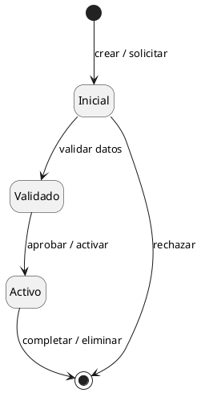

```yml
created_at: 2026-05-04 01:51:32
project: IACT-docs
work_package: 2026-05-04-01-51-32-kruchten-view-diagram-types
phase: Phase 1 — DISCOVER
author: NestorMonroy
status: Aprobado
```

# Kruchten 5+1 — Tipos de Diagrama por Vista

## Objetivo

Definir y documentar los tipos de diagramas UML correctos para cada
una de las 6 vistas del modelo de Kruchten (5+1 con Domain Model)
implementadas en `source/arquitectura-tecnica/{View}/`.

Cada vista tiene 80 archivos (uno por UC del catálogo IACT). Cada
archivo debe contener los diagramas que corresponden a su vista.

---

## Mapeo canónico: Vista → Diagrama(s)

| Vista | Diagrama Principal | Diagrama Secundario | Propósito |
|-------|-------------------|---------------------|-----------|
| **DomainModel** | Diagrama de clases (conceptual) | Diagrama de estados | Entidades del dominio + ciclo de vida de la entidad principal |
| **DesignView** | Diagrama de secuencia | Diagrama de comunicación | Flujo técnico + interacciones entre objetos numeradas |
| **ImplementationView** | Diagrama de componentes | — | Organización del código: paquetes, interfaces, dependencias |
| **UseCaseView** | Diagrama de casos de uso | — | Actores RBAC + relaciones include/extend |
| **ProcessView** | Diagrama de actividades | — | Flujo de control, concurrencia, decisiones |
| **DeployView** | Diagrama de despliegue | — | Nodos físicos, artefactos, comunicación |

---

## Estado actual (PROVEN — verificado con Read tool)

### DomainModel (acc-01.rst como muestra)
- **Tiene**: Diagrama de clases con 3 entidades genéricas (UserFunction, User, Function)
- **Falta**: Diagrama de estados para el ciclo de vida de la entidad principal del UC
- **Gap**: Necesita sección adicional `Estado — {entidad}` con `@startuml` tipo `[*] -> Estado1`

### DesignView (acc-01.rst como muestra)
- **Tiene**: Diagrama de secuencia (actor → Frontend → Django API → MariaDB)
- **Falta**: Diagrama de comunicación con objetos numerados
- **Gap**: Necesita sección adicional con diagrama `@startuml` tipo communication

### ImplementationView (acc-01.rst como muestra)
- **Tiene**: Diagrama de componentes (package MOD_xxx con 3 componentes)
- **Falta**: Nada — cobertura correcta para la vista
- **Estado**: COMPLETO

### UseCaseView (acc-01.rst como muestra)
- **Tiene**: Diagrama UC con actor RBAC + `rectangle "MOD_xxx"` + usecase
- **Falta**: Nada — cobertura correcta para la vista
- **Estado**: COMPLETO

### ProcessView (acc-01.rst como muestra)
- **Tiene**: Diagrama de actividades con start/stop, validación RBAC, bifurcación 403
- **Falta**: Nada — cobertura correcta para la vista
- **Estado**: COMPLETO

### DeployView (acc-01.rst como muestra)
- **Tiene**: Diagrama de despliegue con 3 nodos (React, Django, MariaDB)
- **Falta**: Nada — cobertura correcta para la vista
- **Estado**: COMPLETO

---

## Gap analysis

| Vista | Estado | Acción requerida |
|-------|--------|-----------------|
| DomainModel | GAP | Agregar diagrama de estados por UC |
| DesignView | GAP | Agregar diagrama de comunicación por UC |
| ImplementationView | COMPLETO | Ninguna |
| UseCaseView | COMPLETO | Ninguna |
| ProcessView | COMPLETO | Ninguna |
| DeployView | COMPLETO | Ninguna |

**Total archivos a modificar**: 80 × 2 vistas = **160 archivos**

---

## Patrones de diagrama por vista

### DomainModel — Diagrama de estados

Patrón canónico para el estado de la entidad principal del UC:



- Los estados reflejan el ciclo de vida de la entidad que el UC manipula
- Transiciones con etiqueta del evento que las dispara
- Estados finales con `[*]` para rechazos y completados

### DesignView — Diagrama de comunicación

Patrón canónico con mensajes numerados entre objetos:

```plantuml
@startuml
object ":{actor_rbac}" as Actor
object ":Frontend" as Front
object ":APIView" as API
object ":Service" as Svc
object ":Repository" as Repo
object ":MariaDB" as DB

Actor -> Front : 1: solicitar acción
Front -> API : 2: POST/GET /api/endpoint
API -> Svc : 3: ejecutar lógica
Svc -> Repo : 4: consultar/persistir
Repo -> DB : 5: query / SP call
DB --> Repo : 6: resultado
Repo --> Svc : 7: entidad
Svc --> API : 8: resultado procesado
API --> Front : 9: JSON response
Front --> Actor : 10: renderizar
@enduml
```



- Mensajes numerados secuencialmente (1: … 10:)
- Objetos con prefijo `:` (instancias, no clases)
- Actor RBAC con nombre exacto del catálogo de funciones

---

## Plan de implementación

**Tarea A — DomainModel (80 archivos)**
- Agregar sección "Diagrama de Estados" debajo del diagrama de clases
- Estado principal varía por módulo (entidad que el UC gestiona)
- Implementar por módulo: AUTH(5), USR(4), ACC(7), PERM(10), RPT(16+1), ALR(5), PIP(4), AUD(4), LOG(7), OPR(10), SUP(3), CLI(5)

**Tarea B — DesignView (80 archivos)**
- Agregar sección "Diagrama de Comunicación" debajo del diagrama de secuencia
- Actor RBAC con función exacta del catálogo (acc_NNN_xxx)
- Implementar por módulo en el mismo orden

**Implementación por lotes**: cada módulo como un commit atómico.
