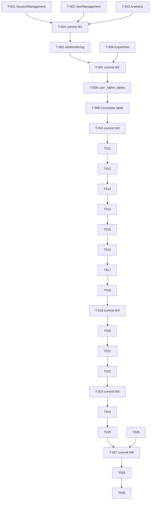

```yml
created_at: 2026-05-05 19:25:21
project: THYROX
work_package: 2026-05-05-19-25-21-scss-variables-audit
phase: Stage 8 — PLAN EXECUTION
author: NestorMonroy
status: Borrador
```

# Task Plan — SCSS Variables & Kit Refactor

> **Generado desde:** `discover/scss-variables-audit-analysis.md`
> **Alcance:** Eliminar redefiniciones de iact-kit, hardcoded hex/spacing y duplicación de
> _pages-shared.scss en 23 archivos SCSS del proyecto.
> **Ruta crítica:** Wave 1 (kit redefinitions) → Wave 2 → Wave 3 (table consolidation) → Wave 4 (variables mecánicas) → Wave 5 (CSS custom props)

---

## Wave 1 — Redefiniciones críticas de iact-kit (páginas)

> Estos archivos redefinen `.btn`, `.badge` a nivel de página — conflicto de
> especificidad potencial con el kit. Eliminar las redefiniciones y usar clases
> del kit directamente en JSX.

- [ ] **T-001** Refactorizar `SessionManagement.scss` — eliminar `.badge`, `.btn`, `.btn-primary`,
  `.btn-secondary`, `.btn-danger` redefinidos; reemplazar 20+ hex por variables;
  eliminar bloque loading duplicado de `.loading-state`
- [ ] **T-002** Refactorizar `UserManagement.scss` — eliminar `.btn-primary`, `.btn-secondary`
  redefinidos; renombrar `.btn-action`/`.btn-edit`/`.btn-delete` a `.user-action`/
  `.user-edit`/`.user-delete` (nombres específicos de página); reemplazar 30+ hex;
  eliminar bloque search-bar duplicado
- [ ] **T-003** Refactorizar `Analytics.scss` — eliminar `.btn-primary`, `.btn-secondary`,
  `.btn-danger` redefinidos; reemplazar 20+ hex/rem por variables; eliminar bloque
  loading duplicado
- [ ] **T-004** Commit Wave 1: `Refactor page SCSS: remove iact-kit redefinitions`

---

## Wave 2 — Redefiniciones de iact-kit (páginas media prioridad)

> Mismo patrón que Wave 1 pero con menos redefiniciones.

- [ ] **T-005** Refactorizar `JobMonitoring.scss` — eliminar `.btn-primary`, `.btn-secondary`
  redefinidos; reemplazar 40+ hex/spacing por variables; eliminar bloque empty-state
  duplicado
- [ ] **T-006** Refactorizar `ExportHub.scss` — eliminar `.btn-primary`, `.btn-secondary`
  redefinidos; reemplazar 25+ hex por variables
- [ ] **T-007** Commit Wave 2: `Refactor export and job SCSS: remove kit redefinitions`

---

## Wave 3 — Consolidar archivos duplicados de tabla

> `_table.scss` (con hardcoded) y `_tables.scss` (con variables) definen `.table`.
> Consolidar en un único archivo.

- [ ] **T-008** Leer ambos archivos `_table.scss` y `_tables.scss` — identificar reglas
  únicas en cada uno, decidir cuál mantener como canónico
- [ ] **T-009** Migrar reglas únicas de `_table.scss` a `_tables.scss` con variables;
  eliminar `_table.scss`; actualizar imports en `iact-ui-kit.scss` o `main.scss`
  si aplica
- [ ] **T-010** Commit Wave 3: `Consolidate _table and _tables into single file`

---

## Wave 4 — Variables mecánicas (navigation + layout)

> Archivos de navigation (CSS Modules) y layout. Sin redefiniciones de kit.
> Solo reemplazar hex hardcodeados por variables SCSS. Los CSS Modules mantienen
> sus clases locales — solo se aplican las variables SCSS ($primary-color, etc.).

- [ ] **T-011** Reemplazar hex en `Header/Header.module.scss` — 17 instancias
- [ ] **T-012** Reemplazar hex en `Header/UserMenu.module.scss` — 13 instancias
- [ ] **T-013** Reemplazar hex en `Header/NotificationBell.module.scss` — 11 instancias
- [ ] **T-014** Reemplazar hex en `Sidebar/Sidebar.module.scss` — 20+ instancias
- [ ] **T-015** Reemplazar hex en `Sidebar/SidebarNav.module.scss` + `NavLink.module.scss`
- [ ] **T-016** Reemplazar hex en `Header/BreadcrumbNav.module.scss` + `MenuButton.module.scss`
  + `LogoBrand.module.scss`
- [ ] **T-017** Reemplazar hex en `DateTimeInputs/DateTimeInput.scss` + `SelectDropdown.scss`
  (solo los que mapean a variables; documentar los que no mapean)
- [ ] **T-018** Reemplazar hex en `Dashboard.module.scss` + `DashboardLayout.module.scss`
- [ ] **T-019** Commit Wave 4: `Replace hardcoded hex with SCSS variables in nav and layout`

---

## Wave 5 — CSS custom properties y deuda menor

> Archivos que usan `var(--color-xxx)` mezclado con SCSS — posible causa de
> bugs visuales si los custom props no están definidos.

- [ ] **T-020** Auditar `_alert-item.scss` y `_alert-list.scss` — listar cada
  `var(--color-xxx)` usado; verificar si están definidos en `:root` del proyecto
- [ ] **T-021** Auditar `_progress-bar.scss` — mismo proceso; corregir `#4cb350`
  hardcodeado a `$success-color`
- [ ] **T-022** Si los custom props no están definidos: reemplazarlos por variables SCSS;
  si están definidos en `:root`: dejar como están y documentar en guía
- [ ] **T-023** Commit Wave 5: `Fix CSS custom properties and remaining hardcoded values`

---

## Wave 6 — Extensión de variables (decisión)

> Los grises de Tailwind (`#6b7280`, `#f3f4f6`, etc.) no tienen variable equivalente.
> Esta wave es opcional y depende de la decisión del equipo.

- [ ] **T-024** Decidir: ¿extender `_variables.scss` con tokens grises o mantener
  hardcoded con comentario? (ver Riesgo R-03)
- [ ] **T-025** Si se decide extender: agregar `$gray-100: #f3f4f6`, `$gray-200: #e5e7eb`,
  `$gray-300: #d1d5db`, `$gray-400: #9ca3af`, `$gray-500: #6b7280`, `$gray-700: #374151`,
  `$gray-900: #111827` a `_variables.scss`; actualizar archivos afectados
- [ ] **T-026** Si se decide NO extender: agregar comentario en los archivos afectados
  con `// tailwind gray-500 — sin variable equivalente en design system`
- [ ] **T-027** Commit Wave 6: `Extend SCSS variables with gray tokens` (o `Document gray color exceptions`)

---

## Cierre

- [ ] **T-028** Actualizar `docs/guides/scss-page-patterns.md` — agregar sección con
  los grises sin variable (si aplica) y lista de clases a NO redefinir
- [ ] **T-029** Push y actualizar `now.md` (stage: Phase 11 TRACK/EVALUATE)

---

## DAG de dependencias



---

## Out-of-scope

- Refactorizar `src/styles/components/_buttons.scss`, `_alerts-badges.scss`, `_table.scss`
  como redefiniciones intencionales — son la capa de customización del proyecto
- Cambiar archivos dentro de `src/styles/iact-kit/` — son fuente canónica del kit
- Migrar de SCSS variables a CSS custom properties — decisión de arquitectura mayor
- Modificar lógica JSX de los componentes — solo se toca el SCSS

---

## Evidencia de respaldo

| Claim | Tipo | Fuente | Confianza | Origen |
|-------|------|--------|-----------|--------|
| 30 archivos SCSS analizados, 23 con deuda | PROVEN | Bash find + lectura de archivos en Phase 1 | alta | nuevo |
| 5 archivos de página redefinen clases de iact-kit | PROVEN | Lectura directa de cada archivo en Phase 1 | alta | nuevo |
| `sass-loader.additionalData` inyecta variables sin @import | PROVEN | webpack.config.js modificado en sesión anterior | alta | heredado |
| CSS Modules no pueden usar clases globales directamente | INFERRED | Comportamiento estándar de CSS Modules (scope local) | alta | nuevo |
| Grises de Tailwind no tienen equivalente en _variables.scss | PROVEN | Lectura de src/styles/abstracts/_variables.scss | alta | nuevo |

---

## Resumen de progreso

| Wave | Tareas | Completadas | Pendientes |
|------|--------|-------------|------------|
| **W1 — Kit redefinitions críticas** | 4 | 0 | 4 |
| **W2 — Kit redefinitions media** | 3 | 0 | 3 |
| **W3 — Consolidar tabla** | 3 | 0 | 3 |
| **W4 — Variables navigation/layout** | 9 | 0 | 9 |
| **W5 — CSS custom properties** | 4 | 0 | 4 |
| **W6 — Extensión variables (decisión)** | 4 | 0 | 4 |
| **Cierre** | 2 | 0 | 2 |
| **Total** | **29** | **0** | **29** |
