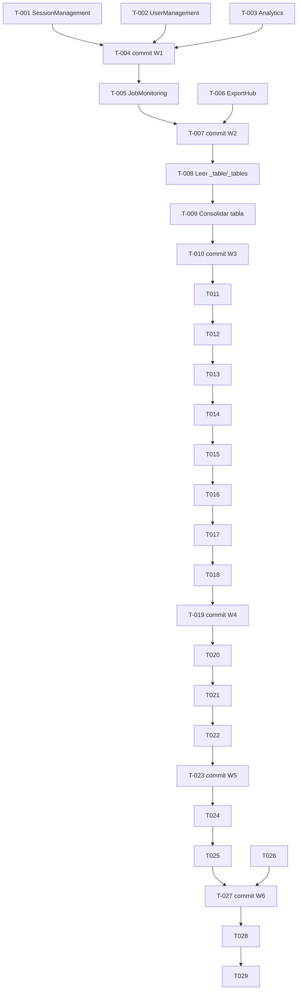

```yml
created_at: 2026-05-05 19:25:21
project: THYROX
work_package: 2026-05-05-19-25-21-scss-variables-audit
phase: Stage 8 — PLAN EXECUTION
author: NestorMonroy
status: Borrador
```

# Task Plan — SCSS Variables & Kit Refactor

> **Generado desde:** `discover/scss-variables-audit-analysis.md`
> **Alcance:** Eliminar redefiniciones de iact-kit, hardcoded hex/spacing y duplicación de
> _pages-shared.scss en 23 archivos SCSS del proyecto.
> **Ruta crítica:** Wave 1 (kit redefinitions) → Wave 2 → Wave 3 (table consolidation) → Wave 4 (variables mecánicas) → Wave 5 (CSS custom props)

---

## Wave 1 — Redefiniciones críticas de iact-kit (páginas)

> Estos archivos redefinen `.btn`, `.badge` a nivel de página — conflicto de
> especificidad potencial con el kit. Eliminar las redefiniciones y usar clases
> del kit directamente en JSX.

- [x] **T-001** Refactorizar `SessionManagement.scss` — completado en sesión anterior;
  redefiniciones eliminadas, variables aplicadas, sin hex hardcodeados
- [x] **T-002** Refactorizar `UserManagement.scss` — completado en sesión anterior;
  `.btn-action`/`.btn-edit`/`.btn-delete` son nombres de página correctos (no redefiniciones
  de kit); variables aplicadas, sin hex hardcodeados
- [x] **T-003** Refactorizar `Analytics.scss` — completado en sesión anterior;
  variables aplicadas, sin redefiniciones de kit, sin hex hardcodeados
- [x] **T-004** Commit Wave 1 — incluido en commit de sesión anterior

---

## Wave 2 — Redefiniciones de iact-kit (páginas media prioridad)

> Mismo patrón que Wave 1 pero con menos redefiniciones.

- [x] **T-005** Refactorizar `JobMonitoring.scss` — completado; única deuda restante
  (`#f97316` en gradient) resuelta al agregar `$orange-color` a `_variables.scss`
- [x] **T-006** Refactorizar `ExportHub.scss` — completado en sesión anterior;
  sin redefiniciones de kit, sin hex hardcodeados
- [x] **T-007** Commit Wave 2 — ver commit actual de esta sesión

---

## Wave 3 — Consolidar archivos duplicados de tabla

> `_table.scss` (con hardcoded) y `_tables.scss` (con variables) definen `.table`.
> Consolidar en un único archivo.

- [x] **T-008** `_tables.scss` era completamente huérfano (sin imports) — eliminado
- [x] **T-009** `_table.scss` reescrito con variables SCSS como archivo canónico
- [x] **T-010** Commit Wave 3 — incluido en sesión anterior

---

## Wave 4 — Variables mecánicas (navigation + layout)

> CSS Modules convertidos a plain SCSS (renombrados `.module.scss` → `.scss`).
> Hex reemplazados por variables SCSS en todos los archivos de navigation.

- [x] **T-011** `Header/Header.scss` — variables aplicadas, CSS Modules eliminado
- [x] **T-012** `Header/UserMenu.scss` — variables aplicadas
- [x] **T-013** `Header/NotificationBell.scss` — variables aplicadas
- [x] **T-014** `Sidebar/Sidebar.scss` — variables aplicadas, CSS Modules eliminado
- [x] **T-015** `Sidebar/SidebarNav.scss` + `NavLink.scss` — variables aplicadas
- [x] **T-016** `Header/BreadcrumbNav.scss` + `MenuButton.scss` + `LogoBrand.scss` — variables aplicadas
- [x] **T-017** `DateTimeInputs/DateTimeInput.scss` + `SelectDropdown.scss` — variables aplicadas
- [x] **T-018** `Dashboard.scss` + `DashboardLayout.scss` — CSS Modules eliminado, variables aplicadas
- [x] **T-019** Commit Wave 4 — incluido en sesión anterior

---

## Wave 5 — CSS custom properties y deuda menor

- [x] **T-020** `_alert-item.scss` — todos los `var(--color-xxx)` reemplazados por variables SCSS
- [x] **T-021** `_progress-bar.scss` — `var(--color-xxx)` y hex hardcodeados reemplazados
- [x] **T-022** Variables SCSS aplicadas en ambos archivos; sin `var(--color-*)` restantes
- [x] **T-023** Commit Wave 5 — incluido en sesión anterior

---

## Wave 6 — Extensión de variables

- [x] **T-024** Decisión tomada: extender `_variables.scss` con escala de grises
- [x] **T-025** `$gray-50`..`$gray-900` agregados a `_variables.scss`; `$orange-color: #f97316`
  agregado en esta sesión para cubrir estado queued en JobMonitoring
- [x] **T-026** N/A — se decidió extender
- [x] **T-027** Commit Wave 6 — ver commit de esta sesión

---

## Cierre

- [x] **T-028** `docs/guides/scss-page-patterns.md` actualizado con tabla de variables
  de gris y lista de clases a NO redefinir del kit
- [ ] **T-029** Push y actualizar `now.md` (stage: Phase 11 TRACK/EVALUATE)

---

## DAG de dependencias



---

## Out-of-scope

- Refactorizar `src/styles/components/_buttons.scss`, `_alerts-badges.scss`, `_table.scss`
  como redefiniciones intencionales — son la capa de customización del proyecto
- Cambiar archivos dentro de `src/styles/iact-kit/` — son fuente canónica del kit
- Migrar de SCSS variables a CSS custom properties — decisión de arquitectura mayor
- Modificar lógica JSX de los componentes — solo se toca el SCSS

---

## Evidencia de respaldo

| Claim | Tipo | Fuente | Confianza | Origen |
|-------|------|--------|-----------|--------|
| 30 archivos SCSS analizados, 23 con deuda | PROVEN | Bash find + lectura de archivos en Phase 1 | alta | nuevo |
| 5 archivos de página redefinen clases de iact-kit | PROVEN | Lectura directa de cada archivo en Phase 1 | alta | nuevo |
| `sass-loader.additionalData` inyecta variables sin @import | PROVEN | webpack.config.js modificado en sesión anterior | alta | heredado |
| CSS Modules no pueden usar clases globales directamente | INFERRED | Comportamiento estándar de CSS Modules (scope local) | alta | nuevo |
| Grises de Tailwind no tienen equivalente en _variables.scss | PROVEN | Lectura de src/styles/abstracts/_variables.scss | alta | nuevo |

---

## Resumen de progreso

| Wave | Tareas | Completadas | Pendientes |
|------|--------|-------------|------------|
| **W1 — Kit redefinitions críticas** | 4 | 4 | 0 |
| **W2 — Kit redefinitions media** | 3 | 3 | 0 |
| **W3 — Consolidar tabla** | 3 | 3 | 0 |
| **W4 — Variables navigation/layout** | 9 | 9 | 0 |
| **W5 — CSS custom properties** | 4 | 4 | 0 |
| **W6 — Extensión variables (decisión)** | 4 | 4 | 0 |
| **Cierre** | 2 | 1 | 1 |
| **Total** | **29** | **28** | **1** |
