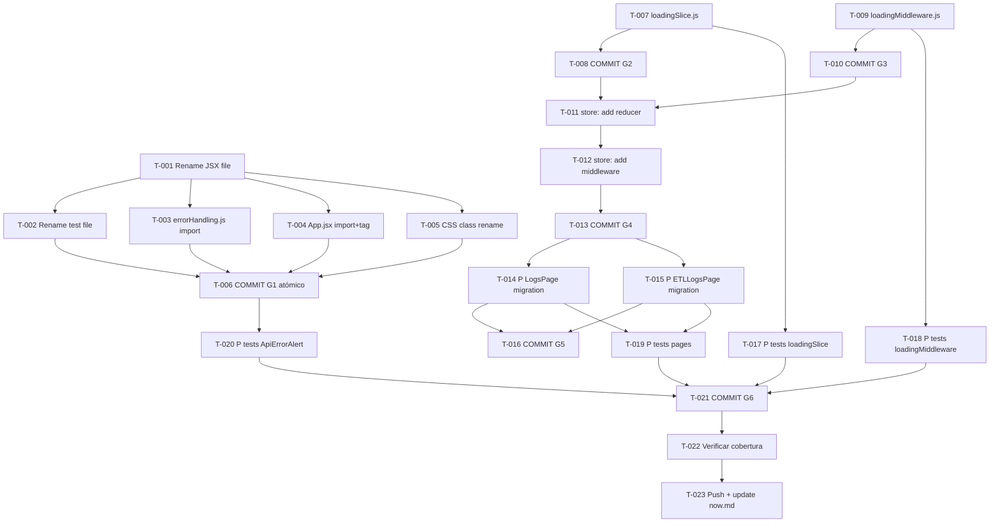

```yml
created_at: 2026-05-05 22:24:51
project: IACT-UI
work_package: 2026-05-05-22-24-51-ui-feedback-naming-and-loading
phase: Stage 8 — PLAN EXECUTION
author: NestorMonroy
status: Borrador
```

# Task Plan — UI Feedback: Naming + Loading State

> **Generado desde:** `strategy/ui-feedback-naming-and-loading-solution-strategy.md`
> **Alcance:** Renombrar ApiErrorToast → ApiErrorAlert (commit atómico) + implementar
> loading centralizado con loadingSlice + loadingMiddleware + migración piloto (LogsPage,
> ETLLogsPage) + TDD completo
> **Ruta crítica:** G1-RENAME → G4-STORE-WIRING → G5-PILOT-MIGRATION → G6-TDD-PAGES → Cierre

---

## Convención de tarea

Opción C — Tareas genéricas con trazabilidad a decisión de strategy.
`[P]` = paralelizable con otras tareas marcadas `[P]` en el mismo bloque.

---

## G1 — RENAME (ApiErrorToast → ApiErrorAlert)

> Commit atómico obligatorio: todos los cambios de este grupo van en UN solo commit.
> Ninguna tarea de este grupo puede commitearse de forma parcial.
> No hay deps externas — este grupo puede ejecutarse primero en paralelo con G2/G3.

- [ ] **T-001** Renombrar `src/components/feedback/ApiErrorToast.jsx` a `ApiErrorAlert.jsx` — actualizar nombre del componente interno, displayName si existe, y cualquier referencia interna al nombre
  - Archivos: `src/components/feedback/ApiErrorToast.jsx` → `ApiErrorAlert.jsx`
  - Deps: ninguna

- [ ] **T-002** Renombrar `src/components/feedback/__tests__/ApiErrorToast.test.jsx` a `ApiErrorAlert.test.jsx` — actualizar import del componente dentro del test y cualquier string literal que referencie el nombre anterior
  - Archivos: `src/components/feedback/__tests__/ApiErrorToast.test.jsx` → `ApiErrorAlert.test.jsx`
  - Deps: T-001

- [ ] **T-003** Actualizar import en `src/redux/middleware/errorHandling.js` — cambiar `import ApiErrorToast` → `import ApiErrorAlert` y referencia en el uso
  - Archivos: `src/redux/middleware/errorHandling.js`
  - Deps: T-001

- [ ] **T-004** Actualizar import y JSX tag en `src/App.jsx` — cambiar import name y `<ApiErrorToast` → `<ApiErrorAlert`
  - Archivos: `src/App.jsx`
  - Deps: T-001

- [ ] **T-005** Renombrar clase CSS `.api-error-toast` → `.api-error-alert` en `src/styles/_feedback.scss` — buscar todas las ocurrencias del selector (incluyendo variantes BEM como `__`, `--` si existen)
  - Archivos: `src/styles/_feedback.scss`
  - Deps: T-001

- [ ] **T-006** Commit atómico G1: `Rename ApiErrorToast to ApiErrorAlert`
  - Incluye: T-001..T-005 en un solo `git add -A && git commit`
  - Deps: T-001, T-002, T-003, T-004, T-005

---

## G2 — LOADING-SLICE

> Puede ejecutarse en paralelo con G3.
> No depende de G1.

- [ ] **T-007** [P] Crear `src/redux/slices/loadingSlice.js` con el diseño aprobado — `createSlice` name `'loading'`, `contexts: {}` initialState, reducers `incrementContext` / `decrementContext` (Math.max guard), selectores `selectIsLoading(context)` y `selectAnyLoading`, exports nombrados + default reducer
  - Archivos: `src/redux/slices/loadingSlice.js` (nuevo)
  - Deps: ninguna

- [ ] **T-008** [P] Commit G2: `Add loadingSlice with per-context counters`
  - Deps: T-007

---

## G3 — LOADING-MW

> Puede ejecutarse en paralelo con G2.
> No depende de G1 ni G2 (importa desde loadingSlice pero el archivo puede crearse
> antes de que el slice esté en el store — el import se resolverá en T-011).

- [ ] **T-009** [P] Crear `src/redux/middleware/loadingMiddleware.js` con el diseño aprobado — import `incrementContext` / `decrementContext` desde `@redux/slices/loadingSlice`, `SILENT_CONTEXTS = new Set(['auth', 'session'])`, lógica de intercepción por sufijo `/pending` → increment, `/fulfilled|/rejected` → decrement, guard `if (!action.type)`
  - Archivos: `src/redux/middleware/loadingMiddleware.js` (nuevo)
  - Deps: ninguna

- [ ] **T-010** [P] Commit G3: `Add loadingMiddleware with silent-context support`
  - Deps: T-009

---

## G4 — STORE-WIRING

> Requiere G2 y G3 completos (slice y middleware deben existir antes del wiring).

- [ ] **T-011** Agregar `loading: loadingReducer` al objeto de reducers en `src/redux/store.js` — import `loadingReducer` desde `@redux/slices/loadingSlice`
  - Archivos: `src/redux/store.js`
  - Deps: T-008, T-010

- [ ] **T-012** Agregar `loadingMiddleware` al chain de middlewares en `src/redux/store.js` — import `loadingMiddleware` desde `@redux/middleware/loadingMiddleware`, concatenarlo al chain existente con `.concat(..., loadingMiddleware)` respetando el orden original
  - Archivos: `src/redux/store.js`
  - Deps: T-011

- [ ] **T-013** Commit G4: `Wire loadingSlice and loadingMiddleware into store`
  - Deps: T-011, T-012

---

## G5 — PILOT-MIGRATION

> Requiere G4 completo (el store debe tener el slice registrado antes de usar selectIsLoading).
> Las dos migraciones son independientes entre sí — pueden ejecutarse en paralelo.

- [ ] **T-014** [P] Migrar `LogsPage`: reemplazar `useSelector(selectLogsLoading)` → `useSelector(selectIsLoading('logs'))` — agregar import de `selectIsLoading` desde `@redux/slices/loadingSlice`, remover import de `selectLogsLoading` si queda sin uso
  - Archivos: `src/pages/LogsPage.jsx` (o path equivalente)
  - Deps: T-013

- [ ] **T-015** [P] Migrar `ETLLogsPage`: mismo cambio que T-014 — `useSelector(selectETLLogsLoading)` → `useSelector(selectIsLoading('logs'))` (o el contexto correcto según el thunk prefix) — remover import obsoleto
  - Archivos: `src/pages/ETLLogsPage.jsx` (o path equivalente)
  - Deps: T-013

- [ ] **T-016** Commit G5: `Migrate LogsPage and ETLLogsPage to loadingSlice selectors`
  - Deps: T-014, T-015

---

## G6 — TDD

> Las tareas de test son independientes entre sí pero cada una depende de su
> implementación correspondiente. T-017..T-019 pueden ejecutarse en paralelo
> una vez que sus deps estén completas.

- [ ] **T-017** [P] Escribir tests para `loadingSlice` — cubrir: estado inicial `{}`, `incrementContext` crea key y suma, `incrementContext` acumula en key existente, `decrementContext` resta, `decrementContext` no baja de 0 (Math.max guard), `selectIsLoading('ctx')` retorna false/true según contador, `selectAnyLoading` retorna false/true
  - Archivos: `src/redux/slices/__tests__/loadingSlice.test.js` (nuevo)
  - Deps: T-007

- [ ] **T-018** [P] Escribir tests para `loadingMiddleware` — cubrir: acción sin `/pending|fulfilled|rejected` pasa sin dispatch extra, acción `/pending` dispatcha `incrementContext(context)`, acción `/fulfilled` dispatcha `decrementContext(context)`, acción `/rejected` dispatcha `decrementContext(context)`, acción con context en `SILENT_CONTEXTS` (`auth`, `session`) pasa sin dispatch extra, acción sin `action.type` pasa sin crash
  - Archivos: `src/redux/middleware/__tests__/loadingMiddleware.test.js` (nuevo)
  - Deps: T-009

- [ ] **T-019** [P] Escribir/actualizar tests para `LogsPage` y `ETLLogsPage` — verificar que el componente renderiza con `selectIsLoading('logs')` mockeado como true (spinner visible) y false (spinner oculto); confirmar que `selectLogsLoading` / `selectETLLogsLoading` ya no se importa
  - Archivos: tests existentes de LogsPage y ETLLogsPage (actualizar) o crear si no existen
  - Deps: T-014, T-015

- [ ] **T-020** [P] Actualizar/crear tests para `ApiErrorAlert` — verificar que el archivo de test renombrado pasa: import correcto, displayName si aplica, comportamiento idéntico al test anterior
  - Archivos: `src/components/feedback/__tests__/ApiErrorAlert.test.jsx`
  - Deps: T-006

- [ ] **T-021** Commit G6: `Add TDD coverage for loadingSlice, loadingMiddleware, and migrated pages`
  - Deps: T-017, T-018, T-019, T-020

---

## Cierre

- [ ] **T-022** Verificar cobertura completa: ejecutar suite de tests y confirmar 0 failing — revisar que ningún import obsoleto quede (ApiErrorToast, selectLogsLoading, selectETLLogsLoading), verificar que `_feedback.scss` no tenga referencias a `.api-error-toast`
  - Deps: T-021

- [ ] **T-023** Push y actualizar `now.md` — campos: `stage: Stage 9 — PILOT/VALIDATE`, `current_work: validacion-piloto-loading`, `methodology_step: pdca:check`
  - Deps: T-022

---

## DAG de dependencias



**Resumen de paralelismo:**

- **G2 (T-007) y G3 (T-009)** pueden ejecutarse en paralelo desde el inicio (junto con G1).
- **G1 (T-001..T-006)** también es paralela a G2/G3 ya que no tiene dependencias cruzadas.
- **G4 (T-011..T-013)** desbloquea cuando G2 y G3 commitean.
- **G5 (T-014..T-016)** desbloquea cuando G4 commitea. T-014 y T-015 son paralelas.
- **G6 (T-017..T-021)** — T-017, T-018, T-019, T-020 son paralelas (cada una depende
  solo de su implementación). T-021 espera a las 4.

---

## Evidencia de respaldo

| Claim | Tipo | Fuente | Confianza | Origen |
|-------|------|--------|-----------|--------|
| 6 archivos afectados por el renombre ApiErrorToast | PROVEN | Listado explícito en prompt del usuario (strategy aprobada) | alta | externo |
| loadingSlice.js con diseño de counters por contexto | PROVEN | Código completo proporcionado en strategy aprobada | alta | externo |
| loadingMiddleware.js con SILENT_CONTEXTS Set | PROVEN | Código completo proporcionado en strategy aprobada | alta | externo |
| LogsPage usa `selectLogsLoading` actualmente | INFERRED | Mención explícita en strategy + patrón de migración descrito | media | externo |
| ETLLogsPage usa `selectETLLogsLoading` actualmente | INFERRED | Mención explícita en strategy + patrón de migración descrito | media | externo |
| store.js usa `.concat()` para middleware chain | INFERRED | Patrón estándar RTK — necesita verificación al ejecutar T-012 | media | externo |

---

## Stopping Points

| SP | Tarea | Condición de parada |
|----|-------|---------------------|
| SP-01 | Pre-T-006 | Confirmar que todos los archivos T-001..T-005 están staged antes del commit atómico |
| SP-02 | Pre-T-012 | Verificar que el chain de middlewares en store.js antes de modificarlo — el orden importa |
| SP-03 | Post-T-022 | Suite de tests 0 failing antes de T-023 — si hay failures, resolver antes de push |

---

## Out-of-scope

- Migración de todas las páginas que usen selectores de loading individual — solo LogsPage y ETLLogsPage son piloto en este WP. Las demás páginas quedan para ÉPICA futura.
- Eliminar los selectores legacy (`selectLogsLoading`, `selectETLLogsLoading`) de sus slices originales — se dejan hasta confirmar que el piloto funciona sin regresiones.
- Añadir `selectAnyLoading` a ningún componente — solo implementar en el slice, no consumir todavía.

---

## Resumen de progreso

| Grupo | Tareas | Completadas | Pendientes |
|-------|--------|-------------|------------|
| **G1 — RENAME** | 6 | 0 | 6 |
| **G2 — LOADING-SLICE** | 2 | 0 | 2 |
| **G3 — LOADING-MW** | 2 | 0 | 2 |
| **G4 — STORE-WIRING** | 3 | 0 | 3 |
| **G5 — PILOT-MIGRATION** | 3 | 0 | 3 |
| **G6 — TDD** | 5 | 0 | 5 |
| **Cierre** | 2 | 0 | 2 |
| **Total** | **23** | **0** | **23** |
