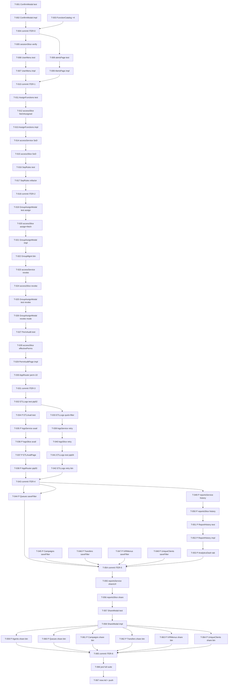

```yml
created_at: 2026-05-06 02:27:32
project: IACT-UI
work_package: 2026-05-06-02-07-30-uc-full-implementation
phase: Stage 8 — PLAN EXECUTION
author: NestorMonroy
status: Borrador
```

# Task Plan — UC Full Implementation

> **Generado desde:** `analyze/uc-deep-analysis.md` (análisis profundo con evidencia file:line)
> **Alcance:** 13 UCs pendientes + 2 INFRA pre-requisitos → 100% cobertura UCs in-scope
> **Ruta crítica:** T-001 → T-002 → T-004 → T-010 → T-018 → T-031 → T-043 → T-054 → T-065 → T-067
> **Convención TDD:** para cada UC, los tests se crean/actualizan ANTES de la implementación

---

## Convención de tarea

Opción C — tareas genéricas con trazabilidad a UC/INFRA.

```
- [ ] T-NNN archivo/acción — descripción (UC/INFRA-N)
- [ ] T-NNN [P] archivo — descripción paralela (UC/INFRA-N)
```

`[P]` = paralelizable con otras tareas del mismo grupo que no comparten archivos.

---

## ITER-0 — Infraestructura compartida (INFRA-01 + INFRA-02)

> Pre-requisito de ITER-1 completo y de pip-04 en ITER-4.
> Sin estas dos tareas, cualquier modal de confirmación o permiso nuevo está bloqueado.

- [ ] **T-001** `src/components/shared/__tests__/ConfirmModal.test.jsx` — crear: tests render con props (title/message/variant), variantes danger/warning/default, onConfirm/onClose, ESC key cierra (INFRA-01)
- [ ] **T-002** `src/components/shared/ConfirmModal.jsx` — crear: wrapper sobre `Modal.jsx` con footer [Cancelar][Confirmar], prop `variant` controla color del botón confirm, forwardea todas las props de Modal (INFRA-01)
- [ ] **T-003** `src/permissions/catalog.js` — agregar 4 constantes: `MANAGE_SOD_RULES`, `RETRY_PIPELINE`, `SHARE_REPORTS`, `VIEW_PERMISSIONS_AUDIT` con string paths en el namespace existente (INFRA-02)
- [ ] **T-004** Commit ITER-0: `Add ConfirmModal component and 4 FunctionCatalog permissions`

---

## ITER-1 — Modales de confirmación (uc-auth-02 + uc-alr-03)

> Depende de: T-004 (ConfirmModal listo).
> uc-auth-02 y uc-alr-03 son paralelos entre sí — no comparten archivos.

- [ ] **T-005** `src/redux/slices/sessionSlice.js` — verificar existencia de `logoutAllSessions`; si no existe, agregar thunk mock-first con `DELETE /sessions/all` y estado `loggingOutAll: false` (uc-auth-02)
- [ ] **T-006** `src/components/navigation/Header/__tests__/UserMenu.test.jsx` — crear directorio y archivo: tests que el click logout abre ConfirmModal, cancel no despacha, confirm despacha `logout()` (uc-auth-02)
- [ ] **T-007** `src/components/navigation/Header/UserMenu.jsx` — agregar estado `showLogoutModal`, reemplazar llamada directa `onLogout` con apertura de ConfirmModal; onConfirm = dispatch logout (uc-auth-02)
- [ ] **T-008** `src/pages/alerts/__tests__/alertsPages.test.jsx` — agregar: click "Confirmar" en alerta abre ConfirmModal con nombre/severidad, cancel no despacha `updateAlert`, confirm sí despacha (uc-alr-03)
- [ ] **T-009** `src/components/pages/Alerts/AlertsPage.jsx` — agregar estado `{ show: false, alertId: null }`, reemplazar llamada directa a `handleAcknowledge` con apertura de ConfirmModal variant='warning' (uc-alr-03)
- [ ] **T-010** Commit ITER-1: `Add logout and acknowledge confirmation modals`

---

## ITER-2 — Access CRUD (uc-acc-02 + uc-adm-01)

> Depende de: T-010. uc-acc-02 y uc-adm-01 son paralelos en las primeras tareas
> pero comparten `accessSlice.js` — secuenciar tasks que toquen ese archivo.

- [ ] **T-011** `src/pages/access/__tests__/AssignFunctionsPage.test.jsx` — agregar: tab "Revocar" visible, lista funciones asignadas, click "Revocar seleccionadas" despacha `revokeFunction` (uc-acc-02)
- [ ] **T-012** `src/redux/slices/accessSlice.js` — agregar thunk `fetchUserAssignedFunctions(userId)` + state shape `userAssignedFunctions: []` (uc-acc-02)
- [ ] **T-013** `src/pages/access/AssignFunctionsPage.jsx` — agregar tab "Revocar" usando clases `_tabs.scss` (`.tabs`, `.tab-button`, `.tab-content`); en tab Revocar: lista funciones asignadas + botón "Revocar seleccionadas" que llama `revokeFunction` (uc-acc-02)
- [ ] **T-014** `src/services/accessService.js` — agregar 3 métodos SoD: `createSoDRule(data)`, `updateSoDRule(id, data)`, `deactivateSoDRule(id)` — mock-first con endpoints `POST/PUT/PATCH /access/sod-rules` (uc-adm-01)
- [ ] **T-015** `src/redux/slices/accessSlice.js` — agregar 3 thunks: `createSoDRule`, `updateSoDRule`, `deactivateSoDRule` + ampliar state con `sodRules: []`, `sodRulesStatus: 'idle'` (uc-adm-01)
- [ ] **T-016** `src/pages/access/__tests__/SeparationRulesPage.test.jsx` — crear: render lista desde Redux (no hardcoded), modal crear regla abre/cierra, submit crea regla, botón desactivar despacha `deactivateSoDRule` (uc-adm-01)
- [ ] **T-017** `src/pages/access/SeparationRulesPage.jsx` — refactor completo: reemplazar `useState` local hardcoded por `useSelector(selectSoDRules)` + `useEffect(fetchSodRules)`, agregar botón "Nueva regla" que abre modal CRUD (uc-adm-01)
- [ ] **T-018** Commit ITER-2: `Add revoke functions tab and SoD CRUD with Redux`

---

## ITER-3 — Group assign/revoke + permissions audit (uc-perm-01 + uc-perm-02 + uc-perm-10)

> Depende de: T-018.
> perm-01 → perm-02 (secuencial: perm-02 reutiliza GroupAssignModal de perm-01).
> perm-10 es independiente de perm-01/02 en componentes pero comparte accessSlice —
> ejecutar T-027..T-030 después de T-026.

- [ ] **T-019** `src/components/access/__tests__/GroupAssignModal.test.jsx` — crear: render mode='assign', lista grupos disponibles, confirm despacha `assignGroupToUser(userId, groupId)`, cancel cierra (uc-perm-01)
- [ ] **T-020** `src/redux/slices/accessSlice.js` — agregar 2 thunks: `assignGroupToUser(userId, groupId)` y `fetchUserGroups(userId)` + state `userGroups: {}` (uc-perm-01)
- [ ] **T-021** `src/components/access/GroupAssignModal.jsx` — crear: props `{isOpen, onClose, userId, username, mode}`, fetch grupos disponibles al abrir, lista con checkbox, footer [Cancelar][Asignar/Revocar] (uc-perm-01)
- [ ] **T-022** `src/pages/access/GroupManagementPage.jsx` — agregar botón "Asignar a usuario" por fila en la tabla de grupos, abre `GroupAssignModal mode='assign'` con `userId` seleccionado (uc-perm-01)
- [ ] **T-023** `src/services/accessService.js` — agregar método `revokeAccessGroup(userId, groupId)` — mock-first con `DELETE /users/{userId}/access-groups/{groupId}` (uc-perm-02)
- [ ] **T-024** `src/redux/slices/accessSlice.js` — agregar thunk `revokeGroupFromUser(userId, groupId)` que llama `accessService.revokeAccessGroup` (uc-perm-02)
- [ ] **T-025** `src/components/access/__tests__/GroupAssignModal.test.jsx` — agregar tests para mode='revoke': lista grupos actualmente asignados (via `fetchUserGroups`), confirm despacha `revokeGroupFromUser` (uc-perm-02)
- [ ] **T-026** `src/components/access/GroupAssignModal.jsx` — agregar lógica mode='revoke': en lugar de grupos disponibles, mostrar grupos asignados actuales (fetched con `fetchUserGroups`); botón confirm pasa a "Revocar" (uc-perm-02)
- [ ] **T-027** `src/pages/access/__tests__/PermissionsAuditPage.test.jsx` — crear: render tabla de permisos efectivos, columnas usuario/función/origen, filtro por usuario (uc-perm-10)
- [ ] **T-028** `src/redux/slices/accessSlice.js` — agregar thunk `fetchEffectivePermissions(userId)` + state `effectivePermissions: {}` keyed by userId (uc-perm-10)
- [ ] **T-029** `src/pages/access/PermissionsAuditPage.jsx` — crear: input búsqueda usuario, tabla permisos efectivos (función/origen/fecha otorgamiento), usa `fetchEffectivePermissions` (uc-perm-10)
- [ ] **T-030** `src/router/AppRouter.jsx` — agregar ruta `/access/audit/permissions` con `lazy(PermissionsAuditPage)` y `ProtectedRoute(VIEW_PERMISSIONS_AUDIT)` (uc-perm-10)
- [ ] **T-031** Commit ITER-3: `Add group assign/revoke modals and permissions audit page`

---

## ITER-4 — Pipeline ETL (uc-pip-02 + uc-pip-03 + uc-pip-04)

> Depende de: T-031.
> pip-02 puede ejecutarse solo (solo modifica ETLLogsPage).
> pip-03 (T-034..T-038) es [P] con pip-02 — no comparte archivos con T-032..T-033.
> pip-04 depende de pip-02 (debe estar el estado de ETL establecido) y de INFRA-01 (T-002).

- [ ] **T-032** `src/pages/logs/__tests__/ETLLogsPage.test.jsx` — agregar: click "Solo errores" pre-configura filtro `status='failed'` y despacha `fetchETLLogs`, badge muestra conteo de errores (uc-pip-02)
- [ ] **T-033** `src/pages/logs/ETLLogsPage.jsx` — agregar botón "Solo errores" junto al filtro de status, badge con `errorCount` calculado del estado Redux, aplica filtro al click (uc-pip-02)
- [ ] **T-034** [P] `src/pages/logs/__tests__/ETLAvailabilityPage.test.jsx` — crear: render tabla fuentes de datos, columnas nombre/última actualización/estado/freshness, dispatch `fetchETLAvailability` al montar (uc-pip-03)
- [ ] **T-035** [P] `src/services/logsService.js` — agregar método `getETLAvailability()` — mock-first con `GET /logs/etl/availability` retorna array de `{source, lastUpdate, status, freshnessMinutes}` (uc-pip-03)
- [ ] **T-036** [P] `src/redux/slices/logsSlice.js` — agregar thunk `fetchETLAvailability` + state `etlAvailability: []`, `availabilityStatus: 'idle'` (uc-pip-03)
- [ ] **T-037** [P] `src/pages/logs/ETLAvailabilityPage.jsx` — crear: tabla con columnas fuente/última actualización/estado, badge de freshness (verde <1h, amarillo <6h, rojo >6h), usa `_pages-shared.scss` + `_table.scss` (uc-pip-03)
- [ ] **T-038** [P] `src/router/AppRouter.jsx` — agregar ruta `/logs/etl/availability` con `lazy(ETLAvailabilityPage)` y `ProtectedRoute(VIEW_LOGS)` (uc-pip-03)
- [ ] **T-039** `src/services/logsService.js` — agregar método `retryPipeline(pipelineId)` — mock-first con `POST /logs/etl/{pipelineId}/retry` (uc-pip-04)
- [ ] **T-040** `src/redux/slices/logsSlice.js` — agregar thunk `retryPipeline(pipelineId)` + state `retryStatus: {}` keyed by pipelineId con valores `'idle'|'loading'|'success'|'error'` (uc-pip-04)
- [ ] **T-041** `src/pages/logs/__tests__/ETLLogsPage.test.jsx` — agregar: botón "Reintentar" visible solo en filas con `status='failed'`, click abre ConfirmModal, confirm despacha `retryPipeline`, loading state durante retry (uc-pip-04)
- [ ] **T-042** `src/pages/logs/ETLLogsPage.jsx` — agregar botón "Reintentar" en cada fila failed, abre `ConfirmModal variant='warning'`, onConfirm despacha `retryPipeline(row.id)`, muestra spinner en la fila durante retry (uc-pip-04)
- [ ] **T-043** Commit ITER-4: `Add ETL error filter, availability page, and pipeline retry`

---

## ITER-5 — Reports generalization (uc-rpt-10 + uc-rpt-03)

> Depende de: T-043.
> rpt-10 (T-044..T-048): 5 archivos independientes entre sí → todos son [P].
> rpt-03 (T-049..T-053): no comparte archivos con rpt-10 → también [P] entre sí.
> Todas las tareas del grupo son paralelas respecto a las de rpt-10.

- [ ] **T-044** [P] `src/pages/reports/QueuesReportPage.jsx` — agregar `SavedFiltersPanel`, estado `{viewName, activeFilters}`, `handleSaveFilter` con `dispatch(saveFilter)`, botón "Guardar vista" (patrón de AgentsReportPage) (uc-rpt-10)
- [ ] **T-045** [P] `src/pages/reports/CampaignsReportPage.jsx` — agregar `SavedFiltersPanel`, `handleSaveFilter`, botón "Guardar vista" (mismo patrón) (uc-rpt-10)
- [ ] **T-046** [P] `src/pages/reports/TransfersReportPage.jsx` — agregar `SavedFiltersPanel`, `handleSaveFilter`, botón "Guardar vista" (mismo patrón) (uc-rpt-10)
- [ ] **T-047** [P] `src/pages/reports/IVRMenusReportPage.jsx` — agregar `SavedFiltersPanel`, `handleSaveFilter`, botón "Guardar vista" (mismo patrón) (uc-rpt-10)
- [ ] **T-048** [P] `src/pages/reports/UniqueClientsReportPage.jsx` — agregar `SavedFiltersPanel`, `handleSaveFilter`, botón "Guardar vista" (mismo patrón) (uc-rpt-10)
- [ ] **T-049** [P] `src/services/reportsService.js` — agregar método `getReportHistory()` — mock-first con `GET /reports/history` retorna array de `{id, type, createdAt, filters, downloadUrl}` (uc-rpt-03)
- [ ] **T-050** [P] `src/redux/slices/reportsSlice.js` — agregar thunk `fetchReportHistory` + state `reportHistory: []`, `historyStatus: 'idle'` (uc-rpt-03)
- [ ] **T-051** [P] `src/components/pages/Analytics/__tests__/ReportHistory.test.jsx` — crear: render lista de reportes, columnas tipo/fecha/filtros, link descarga, estado vacío (uc-rpt-03)
- [ ] **T-052** [P] `src/components/pages/Analytics/ReportHistory.jsx` — crear: tabla de reportes generados con columnas tipo/fecha/parámetros, link descarga, empty state, dispatch `fetchReportHistory` al montar (uc-rpt-03)
- [ ] **T-053** [P] `src/components/pages/Analytics/AnalyticsDashboard.jsx` — agregar tab "Historial" junto a "overview" y "reports", renderiza `<ReportHistory />`, lazy-load (uc-rpt-03)
- [ ] **T-054** Commit ITER-5: `Generalize saved filters to 5 report pages and add report history tab`

---

## ITER-6 — Share reports (uc-rpt-11)

> Depende de: T-054 (savedFilters generalizado en todas las páginas).
> T-059..T-064 son [P] entre sí — cada una toca 1 página distinta.

- [ ] **T-055** `src/services/reportsService.js` — agregar función `generateShareUrl(type, filters)`: serializa `filters` en query params y retorna URL con `window.location.origin + path + params` (client-side, sin backend) (uc-rpt-11)
- [ ] **T-056** `src/redux/slices/reportsSlice.js` — agregar thunk `shareReport(type, filters)` + state `sharedUrl: null` (uc-rpt-11)
- [ ] **T-057** `src/components/reports/__tests__/ShareReportModal.test.jsx` — crear: render URL en input readonly, botón "Copiar enlace" llama `navigator.clipboard.writeText`, close funciona (uc-rpt-11)
- [ ] **T-058** `src/components/reports/ShareReportModal.jsx` — crear: `<Modal>` con input URL readonly, botón "Copiar enlace" + feedback "¡Copiado!", footer solo [Cerrar] (uc-rpt-11)
- [ ] **T-059** [P] `src/pages/reports/AgentsReportPage.jsx` — agregar botón "Compartir" en toolbar, abre `ShareReportModal` con URL generada de los filtros activos (uc-rpt-11)
- [ ] **T-060** [P] `src/pages/reports/QueuesReportPage.jsx` — agregar botón "Compartir" + `ShareReportModal` (uc-rpt-11)
- [ ] **T-061** [P] `src/pages/reports/CampaignsReportPage.jsx` — agregar botón "Compartir" + `ShareReportModal` (uc-rpt-11)
- [ ] **T-062** [P] `src/pages/reports/TransfersReportPage.jsx` — agregar botón "Compartir" + `ShareReportModal` (uc-rpt-11)
- [ ] **T-063** [P] `src/pages/reports/IVRMenusReportPage.jsx` — agregar botón "Compartir" + `ShareReportModal` (uc-rpt-11)
- [ ] **T-064** [P] `src/pages/reports/UniqueClientsReportPage.jsx` — agregar botón "Compartir" + `ShareReportModal` (uc-rpt-11)
- [ ] **T-065** Commit ITER-6: `Add share report modal to all report pages`

---

## Cierre

- [ ] **T-066** Ejecutar `npx jest --no-coverage` — verificar 0 regressions vs baseline 1460 tests; todos los tests nuevos pasan
- [ ] **T-067** Actualizar `now.md` (phase → `Phase 11 TRACK/EVALUATE`) + push final al branch

---

## DAG de dependencias



---

## Cobertura UC → Tarea

| UC / INFRA | Tareas | Archivos nuevos | Archivos modificados |
|------------|--------|-----------------|----------------------|
| INFRA-01 | T-001, T-002 | `ConfirmModal.jsx`, `ConfirmModal.test.jsx` | — |
| INFRA-02 | T-003 | — | `catalog.js` |
| uc-auth-02 | T-005, T-006, T-007 | `UserMenu.test.jsx` (dir nuevo) | `sessionSlice.js`, `UserMenu.jsx` |
| uc-alr-03 | T-008, T-009 | — | `alertsPages.test.jsx`, `AlertsPage.jsx` |
| uc-acc-02 | T-011, T-012, T-013 | — | `AssignFunctionsPage.test.jsx`, `accessSlice.js`, `AssignFunctionsPage.jsx` |
| uc-adm-01 | T-014, T-015, T-016, T-017 | `SeparationRulesPage.test.jsx` | `accessService.js`, `accessSlice.js`, `SeparationRulesPage.jsx` |
| uc-perm-01 | T-019, T-020, T-021, T-022 | `GroupAssignModal.test.jsx`, `GroupAssignModal.jsx` | `accessSlice.js`, `GroupManagementPage.jsx` |
| uc-perm-02 | T-023, T-024, T-025, T-026 | — | `accessService.js`, `accessSlice.js`, `GroupAssignModal.test.jsx`, `GroupAssignModal.jsx` |
| uc-perm-10 | T-027, T-028, T-029, T-030 | `PermissionsAuditPage.test.jsx`, `PermissionsAuditPage.jsx` | `accessSlice.js`, `AppRouter.jsx` |
| uc-pip-02 | T-032, T-033 | — | `ETLLogsPage.test.jsx`, `ETLLogsPage.jsx` |
| uc-pip-03 | T-034, T-035, T-036, T-037, T-038 | `ETLAvailabilityPage.test.jsx`, `ETLAvailabilityPage.jsx` | `logsService.js`, `logsSlice.js`, `AppRouter.jsx` |
| uc-pip-04 | T-039, T-040, T-041, T-042 | — | `logsService.js`, `logsSlice.js`, `ETLLogsPage.test.jsx`, `ETLLogsPage.jsx` |
| uc-rpt-10 | T-044..T-048 | — | 5× ReportPage.jsx |
| uc-rpt-03 | T-049, T-050, T-051, T-052, T-053 | `ReportHistory.test.jsx`, `ReportHistory.jsx` | `reportsService.js`, `reportsSlice.js`, `AnalyticsDashboard.jsx` |
| uc-rpt-11 | T-055..T-064 | `ShareReportModal.test.jsx`, `ShareReportModal.jsx` | `reportsService.js`, `reportsSlice.js`, 6× ReportPage.jsx |

**Totales:**
- Archivos nuevos: 10 (6 componentes + 4 tests en dirs nuevos/existentes)
- Archivos modificados: ~22
- Thunks Redux nuevos: ~10 (`accessSlice` ×7, `logsSlice` ×2, `reportsSlice` ×2, `sessionSlice` ×1 si aplica)
- Commits: 7 (uno por iteración) + push final

---

## Checklist de atomicidad

- [x] Cada tarea toca exactamente 1 archivo o 1 sección de 1 archivo
- [x] Ninguna descripción de tarea contiene "y" conectando dos operaciones en archivos distintos
- [x] Cada tarea puede commitearse y marcarse [x] de forma independiente
- [x] Los tests están listados ANTES de sus implementaciones en cada UC (TDD)
- [x] Tasks de archivos compartidos (accessSlice, logsSlice, AppRouter) están secuenciadas, nunca marcadas [P]

---

## Evidencia de respaldo

| Claim | Tipo | Fuente | Confianza | Origen |
|-------|------|--------|-----------|--------|
| `Modal.jsx` existe con todas las props necesarias para ConfirmModal | PROVEN | `src/components/shared/Modal.jsx` read en sesión anterior | alta | nuevo |
| `accessService.assignAccessGroup` existe (perm-01 no necesita nuevo método) | PROVEN | `src/services/accessService.js:157-171` leído en sesión anterior | alta | nuevo |
| `savedFiltersSlice` CRUD completo + `SavedFiltersPanel` listo para rpt-10 | PROVEN | slice y componente leídos; `AgentsReportPage` ya usa el patrón | alta | nuevo |
| `_tabs.scss` tiene `.tabs`, `.tab-button`, `.tab-content` para acc-02 y rpt-03 | PROVEN | `src/styles/iact-kit/_tabs.scss` leído en sesión anterior | alta | nuevo |
| `window.confirm()` en 10 lugares — INFRA-01 es pre-req real | PROVEN | `grep` ejecutado en sesión anterior, tabla en uc-deep-analysis.md | alta | nuevo |
| Middleware existente cubre todos los thunks nuevos sin cambio | INFERRED | `loadingMiddleware` maneja pending/fulfilled/rejected; patrón verificado en slices existentes | media | nuevo |
| Backend mock-first es suficiente para pip-03/04, perm-02, adm-01 CRUD | INFERRED | Patrón ya usado en otras features del proyecto; riesgo R-01 documentado | media | nuevo |

---

## Stopping Points

| SP | Tarea | Condición |
|----|-------|-----------|
| SP-01 | Pre-T-005 | INFRA-01 y INFRA-02 mergeados y tests verdes antes de ITER-1 |
| SP-02 | Pre-T-019 | ITER-2 completo y 0 regressions en access tests |
| SP-03 | Pre-T-055 | ITER-5 completo, savedFilters en 5 páginas, tests rpt-10 verdes |

---

## Out-of-scope

- Reemplazar `window.confirm()` existente en páginas que no son UCs de este WP (cleanup técnico — deuda técnica separada)
- Endpoints reales de backend para mock-first UCs (pip-03/04, perm-02, adm-01 CRUD, rpt-11) — se activan cuando el backend esté listo
- SCSS específico de freshness/badges si ya cubierto por `_badges.scss` (verificar en T-037)
- Email sharing en ShareReportModal — solo URL client-side en este WP

---

## Resumen de progreso

| Iteración | Tareas | Completadas | Pendientes |
|-----------|--------|-------------|------------|
| ITER-0 Infraestructura | 4 | 0 | 4 |
| ITER-1 Confirm modals | 6 | 0 | 6 |
| ITER-2 Access CRUD | 8 | 0 | 8 |
| ITER-3 Groups + audit | 13 | 0 | 13 |
| ITER-4 Pipeline ETL | 12 | 0 | 12 |
| ITER-5 Reports general | 11 | 0 | 11 |
| ITER-6 Share reports | 11 | 0 | 11 |
| Cierre | 2 | 0 | 2 |
| **Total** | **67** | **0** | **67** |
