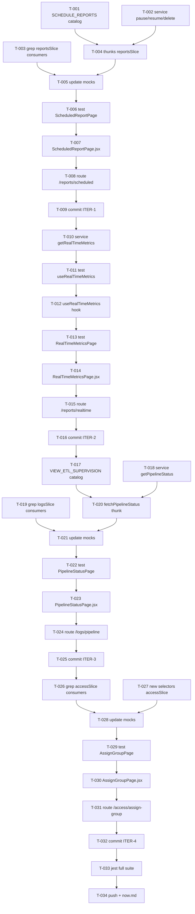

```yml
created_at: 2026-05-06 06:06:54
project: IACT-UI
work_package: 2026-05-06-05-45-28-requisitos-gap-analysis
phase: Stage 8 — PLAN EXECUTION
author: NestorMonroy
status: Borrador
```

# Task Plan — Implementación UCs Pendientes (requisitos-gap-analysis)

> **Alcance:** 6 UCs — uc-rpt-07, uc-rpt-08, uc-rpt-02, uc-pip-01, uc-acc-04, uc-perm-01
> **Ruta crítica:** ITER-1 → ITER-2 → ITER-3 → ITER-4
> **Baseline:** 1551 tests en 200 suites. No romper ninguno.
> **Convención:** TDD estricto — test antes de implementación en cada UC.
> **Mock-first:** todos los endpoints nuevos usan datos simulados.
> **PAT-UI-003:** grep consumers de slice antes de agregar cualquier export.

---

## ITER-1 — uc-rpt-07 + uc-rpt-08 (Scheduled Reports)

> `reportsService.scheduleReport()`, `getScheduledReports()`, thunks `fetchScheduledReports`,
> `createScheduledReport` y selector `selectScheduledReports` ya existen en el slice.
> Falta: actions de gestión (pause/resume/delete/run-now), la página real y la ruta.

- [x] **T-001** Agregar `SCHEDULE_REPORTS` a `src/permissions/catalog.js`
- [x] **T-002** Agregar `pauseSchedule(id)`, `resumeSchedule(id)`, `deleteSchedule(id)`, `runScheduleNow(id)` mock-first a `src/services/reportsService.js`
- [x] **T-003** Grep consumers de `reportsSlice` en tests: `grep -r "from '@redux/slices/reportsSlice'" src --include="*.test.*" -l`
- [x] **T-004** Agregar thunks `pauseSchedule`, `resumeSchedule`, `deleteSchedule`, `runScheduleNow` + reducers a `src/redux/slices/reportsSlice.js`
- [x] **T-005** Actualizar mocks de `reportsSlice` en todos los archivos de test encontrados en T-003
- [x] **T-006** Crear `src/pages/reports/__tests__/ScheduledReportPage.test.jsx` — tests: renderiza lista, muestra form de creación, acciones pause/resume/delete/run-now, history panel
- [x] **T-007** Crear `src/pages/reports/ScheduledReportPage.jsx` — tabs Crear / Gestionar, detalle + historico 30 días, actions funcionales vía dispatch
- [x] **T-008** Agregar route `/reports/scheduled` + lazy import `ScheduledReportPage` en `src/router/AppRouter.jsx` con `ProtectedRoute permission={FunctionCatalog.SCHEDULE_REPORTS}`
- [x] **T-009** Commit ITER-1: `Add ITER-1: uc-rpt-07 + uc-rpt-08 scheduled reports`

---

## ITER-2 — uc-rpt-02 (Métricas en Tiempo Real)

> `FunctionCatalog.VIEW_REALTIME_METRICS` ya existe. No existe servicio ni página.
> Polling a 30s con mock-first. Estado local en hook — no contaminar el store global
> con datos efímeros que se invalidan cada 30s.

- [ ] **T-010** Agregar `getRealTimeMetrics()` mock-first a `src/services/reportsService.js` — retorna las 6 métricas (llamadas en cola, agentes ocupados/libres, atendidas/hora, abandono/5min, SL/15min, lag)
- [ ] **T-011** Crear `src/hooks/domain/__tests__/useRealTimeMetrics.test.js` — tests: llama servicio al montar, refresca cada 30s, limpia interval al desmontar
- [ ] **T-012** Crear `src/hooks/domain/useRealTimeMetrics.js` — hook con `setInterval(30000)` + cleanup en return de `useEffect`
- [ ] **T-013** Crear `src/pages/reports/__tests__/RealTimeMetricsPage.test.jsx` — tests: muestra 6 métricas, muestra indicador de lag, muestra estado de carga
- [ ] **T-014** Crear `src/pages/reports/RealTimeMetricsPage.jsx` — grid de métricas, badge de lag, indicador de última actualización
- [ ] **T-015** Agregar route `/reports/realtime` + lazy import en AppRouter con `ProtectedRoute permission={FunctionCatalog.VIEW_REALTIME_METRICS}`
- [ ] **T-016** Commit ITER-2: `Add ITER-2: uc-rpt-02 real-time metrics page with 30s polling`

---

## ITER-3 — uc-pip-01 (Pipeline ETL Overview)

> pip-02 (`ETLLogsPage`), pip-03 (`ETLAvailabilityPage`), pip-04 (`PipelineRetry`) routed.
> pip-01 (health overview: jobs running/completed/failed, lag, throughput) ausente.

- [ ] **T-017** Agregar `VIEW_ETL_SUPERVISION` a `src/permissions/catalog.js`
- [ ] **T-018** Agregar `getPipelineStatus()` mock-first a `src/services/logsService.js` — retorna `{ jobs: {running, completed, failed}, sources: [{name, lag, throughput, bytes, avgLatency}] }`
- [ ] **T-019** Grep consumers de `logsSlice` en tests: `grep -r "from '@redux/slices/logsSlice'" src --include="*.test.*" -l`
- [ ] **T-020** Agregar `fetchPipelineStatus` thunk + `selectPipelineStatus` selector + `pipelineStatus: null` initial state a `src/redux/slices/logsSlice.js`
- [ ] **T-021** Actualizar mocks de `logsSlice` en todos los archivos de test encontrados en T-019
- [ ] **T-022** Crear `src/pages/logs/__tests__/PipelineStatusPage.test.jsx` — tests: renderiza jobs dashboard, muestra tabla de sources con lag/throughput, despacha `fetchPipelineStatus` al montar
- [ ] **T-023** Crear `src/pages/logs/PipelineStatusPage.jsx` — cards de jobs (running/completed/failed), tabla de sources, RBAC `VIEW_ETL_SUPERVISION`
- [ ] **T-024** Agregar route `/logs/pipeline` + lazy import en AppRouter con `ProtectedRoute permission={FunctionCatalog.VIEW_ETL_SUPERVISION}`
- [ ] **T-025** Commit ITER-3: `Add ITER-3: uc-pip-01 ETL pipeline status overview`

---

## ITER-4 — uc-acc-04 + uc-perm-01 (Assign Group to User)

> Thunk `assignGroupToUser` ya existe en `accessSlice`. `revokeGroupFromUser` también.
> No existe página dedicada — `AssignFunctionsPage` cubre uc-acc-01 (funciones individuales),
> no uc-acc-04 (AGR completo). Componente compartido accesible desde ambos módulos.

- [ ] **T-026** Grep consumers de `accessSlice` en tests: `grep -r "from '@redux/slices/accessSlice'" src --include="*.test.*" -l`
- [ ] **T-027** Agregar `selectAssignGroupLoading`, `selectAssignGroupError`, `selectAssignGroupSuccess` a `src/redux/slices/accessSlice.js`
- [ ] **T-028** Actualizar mocks de `accessSlice` en todos los archivos de test encontrados en T-026
- [ ] **T-029** Crear `src/pages/access/__tests__/AssignGroupPage.test.jsx` — tests: renderiza selector de usuario + selector de grupo, despacha `assignGroupToUser` al confirmar, muestra loading/error/success
- [ ] **T-030** Crear `src/pages/access/AssignGroupPage.jsx` — formulario user+group selector, optional expiresAt, dispatch `assignGroupToUser`, feedback de resultado
- [ ] **T-031** Agregar route `/access/assign-group` + lazy import en AppRouter con `ProtectedRoute permission={FunctionCatalog.MANAGE_ACCESS}`
- [ ] **T-032** Commit ITER-4: `Add ITER-4: uc-acc-04 + uc-perm-01 assign group to user page`

---

## Cierre

- [ ] **T-033** Correr suite completa: `npx jest --no-coverage` — verificar 0 regressions y ≥1551+nuevos tests passing
- [ ] **T-034** Push y actualizar `now.md` (phase → Phase 10 IMPLEMENT completa → Phase 11)

---

## DAG de dependencias



---

## Evidencia de respaldo

| Claim | Tipo | Fuente | Confianza |
|-------|------|--------|-----------|
| `reportsService.scheduleReport()` y `getScheduledReports()` existen | PROVEN | `grep -n "scheduleReport\|getScheduledReports" src/services/reportsService.js` | alta |
| `fetchScheduledReports`, `createScheduledReport`, `selectScheduledReports` en reportsSlice | PROVEN | `grep -n "export.*fetchScheduledReports\|selectScheduledReports" src/redux/slices/reportsSlice.js` | alta |
| `assignGroupToUser` thunk existe en accessSlice | PROVEN | `grep -n "assignGroupToUser" src/redux/slices/accessSlice.js` | alta |
| `VIEW_REALTIME_METRICS` en FunctionCatalog | PROVEN | `grep "VIEW_REALTIME_METRICS" src/permissions/catalog.js` | alta |
| `SCHEDULE_REPORTS` NO existe en FunctionCatalog | PROVEN | grep sin resultado en catalog.js | alta |
| `getPipelineStatus()` NO existe en logsService | PROVEN | lectura de logsService.js — no figura el método | alta |
| pip-02/03/04 routed, pip-01 ausente | PROVEN | grep AppRouter — no aparece `/logs/pipeline` | alta |
| No existe AssignGroupPage.jsx en pages/access/ | PROVEN | `ls src/pages/access/` — no figura el archivo | alta |

---

## Out-of-scope

- uc-opr-* (módulo Operador): excluido por decisión de usuario — dependencia CTI backend
- uc-sup-* (módulo Supervisión): excluido por decisión de usuario — dependencia WebSocket
- uc-cli-* (caller/IVR): excluido — responsabilidad de backend, no frontend
- Implementación de endpoints reales: todos los backends nuevos → mock-first; activación = cambio de 1 línea en el service

---

## Resumen de progreso

| ITER | UC(s) | Tareas | Completadas | Pendientes |
|------|-------|--------|-------------|------------|
| **ITER-1** | rpt-07 + rpt-08 | 9 | 0 | 9 |
| **ITER-2** | rpt-02 | 7 | 0 | 7 |
| **ITER-3** | pip-01 | 9 | 0 | 9 |
| **ITER-4** | acc-04 + perm-01 | 7 | 0 | 7 |
| **Cierre** | — | 2 | 0 | 2 |
| **Total** | **6 UCs** | **34** | **0** | **34** |
