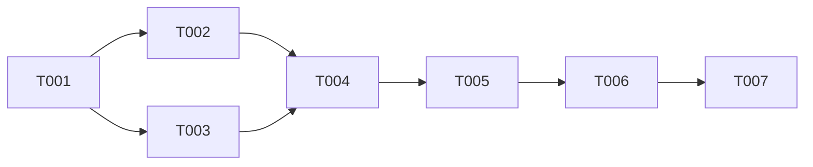

```yml
created_at: 2026-05-06 21:01:37
project: IACT-ui
work_package: 2026-05-06-19-34-24-rbac-v560-spec-analysis
phase: Phase 8 — PLAN EXECUTION
author: claude
status: Borrador
version: 1.0.0
```

# Task Plan — RBAC v5.6.0 Alignment

## Contexto

Phase 10 IMPLEMENT completada. 19 gaps de alineación RBAC v5.6.0 corregidos en 6 ITERs
(A→F), 1719 tests verdes. Este plan cubre las actividades de cierre (Phase 11) y la
creación de artefactos de trazabilidad que formalizan el WP como cerrado.

## Resumen de estado

| Stage | Estado |
|-------|--------|
| Phase 1 DISCOVER | ✅ Completo |
| Phase 10 IMPLEMENT | ✅ Completo (6 ITERs, 19 gaps) |
| Phase 11 TRACK/EVALUATE | ⬜ Pendiente |
| Phase 12 STANDARDIZE | ⬜ Pendiente |

## DAG de dependencias



## Tasks

### Bloque A — Actualización de estado (sin dependencias entre sí)

- [ ] [T-001] Actualizar `now.md` al estado real: Phase 10 IMPLEMENT completa, WP activo,
  próximo step Phase 11. El campo `phase` debe ser `Phase 11 — TRACK/EVALUATE`.
  SPEC: now.md muestra stale "Phase 1 — DISCOVER (SP-01 gate humano)".

- [ ] [T-002] Crear `track/rbac-v560-alignment-changelog.md` con todas las entradas de los
  6 ITERs (Added, Changed, Fixed). Incluir trazabilidad a gaps G-A1..G-F3.
  SPEC: changelog-policy.md — el WP-changelog se crea durante o al cierre del WP.

- [ ] [T-003] Crear `track/rbac-v560-alignment-lessons.md` con lecciones aprendidas:
  hallazgos sobre `nombre_completo` → `module` rename, TDD red-phase, schemas.js omitido
  en plan inicial, AGR describe label error (G-B1 vs G-B2).
  SPEC: workflow-track/SKILL.md — lessons learned obligatorio para cierre de WP.

### Bloque B — Cierre formal (requiere A completo)

- [ ] [T-004] Actualizar `wp-state.md` con el resumen de cierre: phase → Phase 11,
  status → Closed, métricas finales (19 gaps, 6 ITERs, 1719 tests).
  SPEC: wp-state.md actual muestra Phase 1 completo sin mención de Phase 10.

- [ ] [T-005] Commit de cierre con todos los artefactos Phase 11 (now.md, changelog,
  lessons, wp-state actualizado). Mensaje Tim Pope: "Close RBAC v5.6.0 alignment WP".
  SPEC: commit-conventions.md — Tim Pope style, body explica QUÉ y POR QUÉ.

### Bloque C — Estandarización (requiere B completo)

- [ ] [T-006] Crear `standardize/rbac-v560-patterns.md` con patrones propagables:
  (1) patrón regex `module:action` para codenames de función, (2) patrón snake_case para
  AGR codenames, (3) convención de campo `module` en lugar de `nombre_completo` en
  funciones_accesibles del mock.
  SPEC: workflow-standardize/SKILL.md — Phase 12 documenta patrones para futuros WPs.

- [ ] [T-007] Push final a `claude/project-analysis-N9IkV` y verificar con
  `validate-phase-completion.sh`. Reportar WP como cerrado.
  SPEC: I-015 — validate-phase-completion.sh requerido antes de reportar completación.

## Métricas de éxito

| Métrica | Valor |
|---------|-------|
| Tests en verde | 1719 (baseline: 1719) |
| Archivos WP-changelog | 1 (con entradas de todos los ITERs) |
| Lessons learned | ≥ 3 lecciones documentadas |
| Patrones estandarizados | ≥ 3 |

## Notas

- T-002 y T-003 son independientes entre sí — pueden ejecutarse en paralelo
- T-005 agrupa TODOS los artefactos de Phase 11 en un solo commit
- T-006 (Phase 12) es opcional si el usuario decide omitir STANDARDIZE para WPs medianos
- validate-phase-completion.sh en T-007 requiere working tree clean
