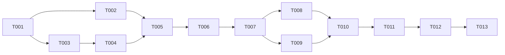

```yml
created_at: 2026-05-06 21:01:37
updated_at: 2026-05-06 21:22:00
project: IACT-ui
work_package: 2026-05-06-19-34-24-rbac-v560-spec-analysis
phase: Phase 8 — PLAN EXECUTION
author: claude
status: Borrador
version: 2.0.0
```

# Task Plan — RBAC v5.6.0 Alignment

## Contexto

Phase 10 IMPLEMENT ejecutó 6 ITERs (A→F) cubriendo los 19 gaps originales
identificados en Phase 1. Análisis post-implementación reveló 10 gaps adicionales:
bugs críticos en slice, errores de data model en mock, y route guards incompletos.
Este plan cubre todos los gaps restantes + cierre formal del WP.

## Estado de implementación Phase 10

| ITER | Gaps cubiertos | Estado |
|------|---------------|--------|
| A | G-A3, G-A4, G-A5, G-B1 | ✅ |
| B | G-A1, G-A2, G-E1, G-E2, G-E3, G-E4 (catalog+router) | ✅ |
| C | G-D1, G-D2 (mock GET) | ✅ |
| D | G-C1, G-C2, G-C3, G-D3 | ✅ |
| E | G-A1, G-E4 (SavedViewsPage+ruta+slice) | ✅ |
| F | G-B2 | ✅ |

## Gaps nuevos identificados post-Phase 10

| ID | Severidad | Descripción | Causa |
|----|-----------|-------------|-------|
| G-F1 | **CRÍTICO** | `deactivateAGR` importado en `AGRCatalogPage.jsx:13` pero NO exportado por `adminSlice.js` — runtime TypeError al hacer click en Desactivar | Omisión en ITER-F |
| G-F2 | Alta | Mock AGR data model invertido: `codename: 'AGR-001'` (ID) + `name: 'basic_operator_group'` (snake_case). Debería ser `codename: 'basic_operator_group'` + `name: 'Operador Básico...'`. La tabla muestra ID como codename | Error en ITER-C |
| G-F3 | Alta | Mock AGR usa `state: 'ACTIVE'` (string) pero componente lee `agr.active` (boolean). Badge INACTIVE/ACTIVE nunca muestra INACTIVE | Error en ITER-C/D |
| G-F4 | Media | `/logs/etl/availability` usa `VIEW_LOGS` (`logs:view_app`) — spec define esta ruta como ETL, debería ser `VIEW_PIPELINE_LOGS` | Omisión en ITER-B |
| G-F5 | Media | `/logs/search` usa `VIEW_LOGS` — spec tiene `logs:search` como función separada con constante `SEARCH_LOGS` en catalog | Omisión en ITER-B |
| G-F6 | Media | `/logs/export` usa `VIEW_LOGS` — spec tiene `logs:export` como función separada con constante `EXPORT_LOGS` en catalog | Omisión en ITER-B |
| G-F7 | Media | `/profile/sessions` sin `ProtectedRoute` — UC-AUTH-05 requiere `auth:view_all_sessions`. Constante `VIEW_ALL_SESSIONS` ausente en catalog | No estaba en scope original |
| G-F8 | Baja | `/permissions/revoke-group` usa `MANAGE_ACCESS` (`access:assign`) — UC_PERM_02 mapea a `access:revoke_group`. Constante ausente en catalog | No estaba en scope original |
| G-F9 | Baja | `/permissions/temp-permissions` usa `MANAGE_ACCESS` — UC_PERM_03 mapea a `access:grant_exceptional`. Constante ausente en catalog | No estaba en scope original |
| G-C5 | Baja | Sin escenario de usuario admin en `permissions.json` — FunctionCatalogPage/AGRCatalogPage no se pueden probar end-to-end en mock | Identificado en Phase 1, no implementado |

## DAG de dependencias



## Tasks — Bloque I: Fix crítico (deactivateAGR)

- [x] [T-001] **TDD RED** — Agregar test en `adminSlice.test.js` que verifique que
  `deactivateAGR` existe como named export y que su reducer actualiza `agr.active = false`.
  SPEC: `adminService.deactivateAGR(id)` existe (adminService.js:91) y retorna AGR con active:false.
  Tests deben fallar porque el thunk no existe en slice.

- [x] [T-002] **IMPLEMENT** — Agregar en `adminSlice.js`:
  (1) thunk `deactivateAGR = createAsyncThunk('admin/deactivateAGR', ...)` que llama
  `adminService.deactivateAGR(id)`; (2) extraReducers para `fulfilled` (patch agr en state.agrs)
  y `rejected` (set error). Verificar que tests T-001 pasan.
  SPEC: G-F1. Patrón idéntico a `deactivateFunction` (líneas 50-56, 147-156).

## Tasks — Bloque II: Fix mock data model AGR

- [x] [T-003] **TDD RED** — Agregar tests en `mockInterceptor.test.js` (o crear
  `__tests__/mockInterceptor-agr.test.js`) que verifiquen:
  (a) GET /api/admin/agr/ retorna objetos con `codename` en snake_case (ej: `basic_operator_group`);
  (b) GET retorna objetos con `active: true` (boolean), no `state: 'ACTIVE'` (string);
  (c) POST crea AGR con `active: true`.
  Tests deben fallar porque mock actual tiene el formato invertido.

- [x] [T-004] **IMPLEMENT** — Actualizar `_handleAdminAGR` en `mockInterceptor.js`:
  (a) Corregir array AGRS: `codename` = snake_case (ej: `basic_operator_group`),
  `name` = nombre display (ej: `'Operador Básico'`), reemplazar `state: 'ACTIVE'` → `active: true`;
  (b) En POST: reemplazar `state: 'ACTIVE'` → `active: true`;
  (c) En PATCH: si body incluye `active: false`, retornar `{ ...body }` (ya correcto).
  SPEC: G-F2, G-F3. AGRCatalogPage lee `agr.codename` y `agr.active`.

## Tasks — Bloque III: Route guards logs granulares

- [x] [T-005] **TDD + IMPLEMENT** — Corregir 3 route guards en `AppRouter.jsx`:
  (a) `/logs/etl/availability` → `FunctionCatalog.VIEW_PIPELINE_LOGS` (era VIEW_LOGS);
  (b) `/logs/search` → `FunctionCatalog.SEARCH_LOGS` (era VIEW_LOGS);
  (c) `/logs/export` → `FunctionCatalog.EXPORT_LOGS` (era VIEW_LOGS).
  Tests: verificar que `screen.getByText` de cada página requiere la permission correcta
  en `AppRouter.test.jsx` o snapshot update.
  SPEC: G-F4, G-F5, G-F6. Catálogo ya tiene SEARCH_LOGS y EXPORT_LOGS.

## Tasks — Bloque IV: Catalog + route guards faltantes

- [x] [T-006] **TDD RED** — Agregar tests en `catalog.test.js` que verifiquen existencia de:
  `VIEW_ALL_SESSIONS = 'auth:view_all_sessions'`,
  `REVOKE_FUNCTION_GROUP = 'access:revoke_group'`,
  `GRANT_EXCEPTIONAL = 'access:grant_exceptional'`.
  Tests fallan porque constantes no existen en catalog.js.

- [x] [T-007] **IMPLEMENT** — Agregar en `catalog.js`:
  ```
  // MOD_Auth (extendido)
  VIEW_ALL_SESSIONS: 'auth:view_all_sessions',
  // MOD_Access (extendido — UC_PERM_02, UC_PERM_03)
  REVOKE_FUNCTION_GROUP:   'access:revoke_group',
  GRANT_EXCEPTIONAL:       'access:grant_exceptional',
  ```
  SPEC: G-F7, G-F8, G-F9. Mapeo confirmado en spec sección 3.3 MOD_Access.

- [x] [T-008] **IMPLEMENT** — Actualizar route guards en `AppRouter.jsx`:
  (a) `/profile/sessions` → agregar `ProtectedRoute` con `FunctionCatalog.VIEW_ALL_SESSIONS`;
  (b) `/permissions/revoke-group` → cambiar `MANAGE_ACCESS` → `REVOKE_FUNCTION_GROUP`;
  (c) `/permissions/temp-permissions` → cambiar `MANAGE_ACCESS` → `GRANT_EXCEPTIONAL`.
  SPEC: G-F7, G-F8, G-F9.

## Tasks — Bloque V: Admin user mock (G-C5)

- [x] [T-009] **IMPLEMENT** — Agregar segundo escenario de usuario en mock:
  Crear `src/mocks/permissions-admin.json` (o agregar `adminUser` export en `permissions.json`)
  con usuario `sistema.admin` perteneciente a AGR-010 (`system_admin_group`) con capacidades:
  `auth:view_own_sessions`, `auth:close_session`, `auth:reset_password`,
  `auth:view_all_sessions`, `logs:view_app`, `logs:export`, `adm:manage_catalog`,
  `adm:create_sod`, `access:assign_to_group`.
  SPEC: G-C5. AGR-010 spec sección 3.12 (`system_admin_group`, 6 funciones base +
  `adm:manage_catalog`, `adm:create_sod` de MOD_Admin).
  Actualizar `mockInterceptor.js` para servir este segundo escenario si el header
  `X-Mock-User: admin` está presente (o simplemente añadir a `permissions.json`
  como objeto separado para referencia).

## Tasks — Bloque VI: Cierre formal WP (Phase 11 + 12)

- [ ] [T-010] Actualizar `now.md` → phase: `Phase 11 — TRACK/EVALUATE`.
  SPEC: now.md muestra stale "Phase 1 — DISCOVER (SP-01 gate humano)".

- [ ] [T-011] Crear `track/rbac-v560-alignment-changelog.md` con entradas de todos los
  ITERs A..F + correcciones T-001..T-009. Formato Keep a Changelog.
  SPEC: changelog-policy.md — WP-changelog obligatorio antes del cierre.

- [ ] [T-012] Crear `track/rbac-v560-alignment-lessons.md` con ≥5 lecciones:
  (1) nombre_completo→module rename requirió schemas.js (descubierto mid-ITER),
  (2) deactivateAGR omitido en ITER-F (patrón simétrico no verificado),
  (3) mock data model AGR invertido (codename↔name),
  (4) TDD red-phase reveló G-B1 correctamente antes de fix,
  (5) G-C5 identificado en Phase 1 pero postergado sin T-NNN de cierre.
  SPEC: workflow-track/SKILL.md — lessons learned obligatorio.

- [ ] [T-013] Actualizar `wp-state.md` con métricas finales. Commit de cierre Tim Pope.
  Push a `claude/project-analysis-N9IkV`. Ejecutar `validate-phase-completion.sh`.
  SPEC: I-015. Protocolo de completación.

## Métricas de éxito

| Métrica | Valor objetivo |
|---------|---------------|
| Tests en verde | ≥ 1719 (sin regresiones) |
| `deactivateAGR` en adminSlice | sí |
| Mock AGR codename formato | snake_case |
| Mock AGR active | boolean |
| Route guards logs granulares | 3 corregidos |
| Constantes nuevas en catalog | ≥ 3 |
| WP-changelog con entradas | ≥ 10 entradas |
| Lessons learned | ≥ 5 |

## Notas de implementación

- T-001/T-003 son independientes — pueden ejecutarse en paralelo
- T-005 (logs guards) NO depende de T-002 ni T-004 — también paralelo con Bloques I y II
- T-006/T-007/T-008 son secuenciales entre sí (catalog antes de router)
- Bloque VI solo se inicia cuando T-001..T-009 están todos en verde
- validate-phase-completion.sh en T-013 requiere working tree clean + push completo
